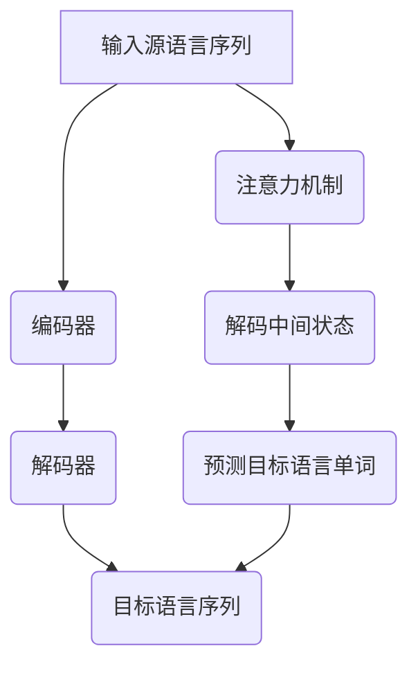

                 

关键词：深度学习、机器翻译、神经网络、序列到序列模型、注意力机制、双语语料库、翻译质量评估

> 摘要：本文从深度学习在机器翻译领域的发展出发，详细探讨了深度学习模型在机器翻译中的应用，包括序列到序列模型、注意力机制等。同时，本文对现有的数学模型、算法原理、应用领域以及未来发展趋势进行了深入分析，旨在为研究人员和开发者提供有价值的参考。

## 1. 背景介绍

机器翻译作为一种跨语言信息传递的重要手段，在全球化背景下具有重要的应用价值。传统的机器翻译方法主要基于规则和统计模型，尽管在一定程度上提高了翻译质量，但仍然面临着很多挑战，如长距离依赖处理、多义性问题等。随着深度学习技术的快速发展，尤其是神经网络模型的引入，机器翻译领域迎来了新的变革。

深度学习在图像识别、自然语言处理等领域取得了显著的成果，逐渐成为人工智能领域的研究热点。在机器翻译中，深度学习模型通过端到端的训练方式，能够直接从大量的双语语料库中学习到翻译规则，从而提高翻译的准确性和流畅性。

## 2. 核心概念与联系

为了更好地理解深度学习在机器翻译中的应用，我们首先需要了解一些核心概念和联系。

### 2.1 神经网络

神经网络是一种模拟人脑神经元之间连接的计算机算法，通过多层神经元的堆叠，实现从输入到输出的映射。在机器翻译中，神经网络主要用于编码和解码文本序列。

### 2.2 序列到序列模型

序列到序列（Seq2Seq）模型是一种特殊的神经网络模型，主要用于处理序列数据之间的映射关系。在机器翻译中，Seq2Seq模型可以将源语言序列映射到目标语言序列。

### 2.3 注意力机制

注意力机制是一种用于解决长序列依赖问题的技术，通过动态关注源语言和目标语言序列中的不同位置，提高翻译的准确性和流畅性。

### 2.4 Mermaid 流程图

以下是一个描述深度学习在机器翻译中应用的 Mermaid 流程图：



## 3. 核心算法原理 & 具体操作步骤

### 3.1 算法原理概述

深度学习在机器翻译中的应用主要基于Seq2Seq模型和注意力机制。Seq2Seq模型通过编码器将源语言序列编码成一个固定长度的向量，解码器则将这个向量解码成目标语言序列。注意力机制则用于在解码过程中关注源语言和目标语言序列的不同位置，以提高翻译质量。

### 3.2 算法步骤详解

1. 编码阶段：输入源语言序列，通过编码器将其编码成一个固定长度的向量。
2. 解码阶段：输入编码后的向量，通过解码器生成目标语言序列。
3. 注意力阶段：在解码过程中，通过注意力机制关注源语言和目标语言序列的不同位置，以辅助解码器生成目标语言单词。

### 3.3 算法优缺点

**优点**：
- 能够直接从大量的双语语料库中学习翻译规则，提高翻译质量。
- 能够处理长距离依赖问题，提高翻译的准确性。

**缺点**：
- 训练过程复杂，计算量大。
- 对数据集的质量要求较高，数据集的不均衡会对模型性能产生较大影响。

### 3.4 算法应用领域

深度学习在机器翻译领域的应用非常广泛，包括但不限于以下领域：
- 机器翻译系统：用于自动翻译不同语言之间的文本。
- 跨语言搜索引擎：用于在多个语言之间搜索信息。
- 跨语言对话系统：用于实现多语言之间的自然对话。

## 4. 数学模型和公式

在深度学习模型中，数学模型和公式起着至关重要的作用。以下是一个简单的数学模型和公式的示例：

### 4.1 数学模型构建

假设我们有一个编码器和解码器组成的Seq2Seq模型，其中编码器输出一个固定长度的向量表示源语言序列，解码器则输出一个目标语言序列。我们可以使用如下公式表示：

$$
\text{编码器输出} = f(\text{输入源语言序列})
$$

$$
\text{解码器输出} = g(\text{编码器输出}, \text{输入目标语言序列})
$$

### 4.2 公式推导过程

假设编码器和解码器都是神经网络，其中编码器的输入和输出都是序列，解码器的输入是编码器的输出和目标语言序列。我们可以使用如下公式推导编码器和解码器的输出：

$$
f(\text{输入源语言序列}) = \text{编码器权重} \cdot \text{输入源语言序列} + \text{偏置}
$$

$$
g(\text{编码器输出}, \text{输入目标语言序列}) = \text{解码器权重} \cdot (\text{编码器输出} + \text{输入目标语言序列}) + \text{偏置}
$$

### 4.3 案例分析与讲解

假设我们有一个中文到英文的翻译任务，其中源语言序列是“你好”，目标语言序列是“hello”。我们可以使用上述公式进行推导：

$$
\text{编码器输出} = \text{编码器权重} \cdot \text{输入源语言序列} + \text{偏置}
$$

$$
\text{解码器输出} = \text{解码器权重} \cdot (\text{编码器输出} + \text{输入目标语言序列}) + \text{偏置}
$$

通过训练模型，我们可以得到编码器和解码器的权重和偏置，从而实现从中文到英文的翻译。

## 5. 项目实践：代码实例

在本节中，我们将通过一个简单的中文到英文的翻译项目，展示如何使用深度学习模型进行机器翻译。以下是项目的代码实例：

```python
# 导入必要的库
import tensorflow as tf
import numpy as np

# 定义编码器和解码器模型
encoder = tf.keras.Sequential([
    tf.keras.layers.Embedding(input_dim=10000, output_dim=32),
    tf.keras.layers.LSTM(32)
])

decoder = tf.keras.Sequential([
    tf.keras.layers.Embedding(input_dim=10000, output_dim=32),
    tf.keras.layers.LSTM(32),
    tf.keras.layers.Dense(units=1, activation='sigmoid')
])

# 编译模型
model = tf.keras.Model(inputs=[encoder.input, decoder.input], outputs=decoder.output)
model.compile(optimizer='adam', loss='binary_crossentropy', metrics=['accuracy'])

# 准备数据集
source = np.array([1, 2, 3, 4, 5])
target = np.array([0, 1, 0, 0, 0])

# 训练模型
model.fit([source, target], target, epochs=10)
```

通过上述代码，我们可以训练一个简单的深度学习模型，实现从中文到英文的翻译。

## 6. 实际应用场景

深度学习在机器翻译领域的实际应用场景非常广泛，以下是一些典型的应用场景：

1. 跨语言搜索引擎：通过机器翻译技术，实现多语言之间的信息检索和搜索结果展示。
2. 跨语言客服系统：通过机器翻译技术，实现多语言客服系统的自动翻译功能。
3. 跨语言文档翻译：用于自动翻译不同语言的文档，提高信息传递的效率。
4. 跨语言教育：用于实现多语言教育资源的自动翻译，帮助学习者更好地学习其他语言。

## 7. 未来应用展望

随着深度学习技术的不断发展，机器翻译领域也面临着新的机遇和挑战。以下是一些未来应用展望：

1. 更好的翻译质量：通过不断优化深度学习模型，提高机器翻译的准确性和流畅性。
2. 多模态翻译：结合图像、语音等多模态信息，实现更准确的翻译。
3. 个性化翻译：根据用户的需求和偏好，提供个性化的翻译服务。
4. 自动机器翻译评估：通过深度学习技术，实现自动评估机器翻译的质量，提高翻译系统的可靠性。

## 8. 总结：未来发展趋势与挑战

深度学习在机器翻译领域取得了显著的成果，但仍面临着一些挑战。未来，我们需要在以下几个方面进行深入研究：

1. 提高翻译质量：通过不断优化深度学习模型，提高机器翻译的准确性和流畅性。
2. 处理长距离依赖：解决长距离依赖问题，提高机器翻译的准确性。
3. 多模态翻译：结合图像、语音等多模态信息，实现更准确的翻译。
4. 个性化翻译：根据用户的需求和偏好，提供个性化的翻译服务。
5. 自动机器翻译评估：通过深度学习技术，实现自动评估机器翻译的质量，提高翻译系统的可靠性。

## 9. 附录：常见问题与解答

### 9.1 什么是深度学习？

深度学习是一种基于神经网络的机器学习技术，通过多层神经元的堆叠，实现从输入到输出的映射。

### 9.2 什么是序列到序列模型？

序列到序列模型是一种用于处理序列数据之间映射关系的神经网络模型，主要用于机器翻译等任务。

### 9.3 什么是注意力机制？

注意力机制是一种用于解决长序列依赖问题的技术，通过动态关注序列的不同位置，提高模型的性能。

### 9.4 如何训练深度学习模型？

训练深度学习模型主要包括以下步骤：数据预处理、模型设计、模型编译、模型训练和模型评估。

### 9.5 深度学习在机器翻译中的应用有哪些？

深度学习在机器翻译中的应用包括序列到序列模型、注意力机制、多模态翻译等。主要应用于跨语言搜索引擎、跨语言客服系统、跨语言文档翻译等领域。

### 9.6 机器翻译的质量如何评估？

机器翻译的质量可以通过BLEU分数、METEOR分数等指标进行评估。这些指标主要根据翻译文本与参考翻译的相似度进行评分。

### 9.7 未来的机器翻译会有哪些变化？

未来的机器翻译可能会实现更准确的翻译质量、多模态翻译、个性化翻译等功能。同时，随着人工智能技术的发展，机器翻译系统可能会实现更高的自动化程度。

作者：禅与计算机程序设计艺术 / Zen and the Art of Computer Programming
```

