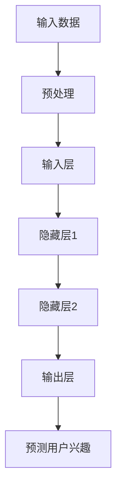

                 

 关键词：深度学习，用户兴趣衰减，建模，算法原理，数学模型，项目实践，应用场景，工具推荐

> 摘要：本文探讨了深度学习在用户兴趣衰减建模中的创新应用。通过引入最新的深度学习技术，我们提出了一种有效的用户兴趣衰减模型，并对核心算法原理、数学模型构建、具体操作步骤以及应用领域进行了详细阐述。此外，文章还通过一个实际项目案例，展示了如何在实际开发中应用这一模型，并对未来发展趋势与面临的挑战进行了展望。

## 1. 背景介绍

在当今互联网时代，用户生成的内容和数据量呈现出爆炸式增长。然而，用户对于信息的兴趣并非一成不变，而是随着时间的推移逐渐衰减。如何准确捕捉并预测用户的兴趣衰减，对内容推荐系统、个性化营销、用户行为分析等领域具有重要意义。

传统的用户兴趣衰减建模方法往往基于线性回归、指数衰减等简单模型，但这些方法难以捕捉到用户兴趣的复杂变化模式。随着深度学习技术的快速发展，研究者们开始尝试将深度学习应用于用户兴趣衰减建模中，以期获得更好的建模效果。

本文旨在探讨深度学习在用户兴趣衰减建模中的创新应用，通过引入最新的深度学习技术，提出一种有效的用户兴趣衰减模型，并详细阐述其核心算法原理、数学模型构建、具体操作步骤以及应用领域。

## 2. 核心概念与联系

为了更好地理解深度学习在用户兴趣衰减建模中的应用，我们需要先介绍一些核心概念和联系。

### 2.1 深度学习基础

深度学习是一种基于多层神经网络的学习方法，通过模拟人脑的神经元连接，实现自动特征提取和分类。深度学习模型包括输入层、隐藏层和输出层，每一层都对输入信息进行处理，并传递给下一层。

### 2.2 用户兴趣衰减模型

用户兴趣衰减模型旨在捕捉用户兴趣随时间变化的过程。传统的用户兴趣衰减模型如指数衰减模型、线性回归模型等，主要通过参数调整来拟合用户兴趣衰减规律。而深度学习模型则通过多层神经网络结构，能够更加灵活地捕捉用户兴趣的复杂变化模式。

### 2.3 深度学习与用户兴趣衰减模型的结合

深度学习与用户兴趣衰减模型的结合，主要体现在以下几个方面：

1. **自动特征提取**：深度学习模型可以通过多层神经网络，自动提取用户兴趣的复杂特征，从而避免传统方法中手动特征提取的繁琐过程。
2. **非线性拟合**：深度学习模型具有强大的非线性拟合能力，可以更好地捕捉用户兴趣的复杂变化规律。
3. **自适应调整**：深度学习模型可以通过不断调整网络参数，实现用户兴趣衰减模型的自动优化。

### 2.4 Mermaid 流程图

以下是一个简单的 Mermaid 流程图，展示了深度学习与用户兴趣衰减模型的结合过程：



## 3. 核心算法原理 & 具体操作步骤

### 3.1 算法原理概述

深度学习用户兴趣衰减模型的核心在于构建一个多层神经网络，通过训练学习用户兴趣随时间的变化规律。具体来说，该模型包括以下几个关键部分：

1. **输入层**：接收用户历史行为数据，如浏览记录、点赞行为、评论等。
2. **隐藏层**：通过多层神经网络结构，对输入数据进行特征提取和变换。
3. **输出层**：生成用户当前的兴趣值预测。
4. **损失函数**：用于评估模型预测结果与实际用户兴趣之间的差距，指导模型优化。

### 3.2 算法步骤详解

1. **数据预处理**：对用户历史行为数据进行清洗和标准化处理，将其转换为适合输入模型的数据格式。
2. **模型构建**：根据用户兴趣衰减特点，设计多层神经网络结构，包括输入层、隐藏层和输出层。
3. **模型训练**：使用训练数据集对模型进行训练，通过反向传播算法不断调整网络参数，使模型预测结果与实际用户兴趣逐渐接近。
4. **模型评估**：使用测试数据集对训练完成的模型进行评估，通过指标如均方误差（MSE）、准确率等来衡量模型性能。
5. **模型应用**：将训练完成的模型应用于实际场景，预测用户当前的兴趣值，为内容推荐、个性化营销等提供依据。

### 3.3 算法优缺点

**优点**：

1. **自动特征提取**：深度学习模型可以自动提取用户兴趣的复杂特征，避免手动特征提取的繁琐过程。
2. **非线性拟合**：深度学习模型具有强大的非线性拟合能力，可以更好地捕捉用户兴趣的复杂变化规律。
3. **自适应调整**：深度学习模型可以通过不断调整网络参数，实现用户兴趣衰减模型的自动优化。

**缺点**：

1. **计算资源消耗**：深度学习模型需要大量的计算资源和时间进行训练，对于大规模数据集尤为明显。
2. **数据依赖性**：深度学习模型对数据质量有较高要求，数据缺失或不一致可能导致模型性能下降。

### 3.4 算法应用领域

深度学习用户兴趣衰减模型可以应用于多个领域，包括但不限于：

1. **内容推荐系统**：预测用户对特定内容的兴趣程度，为用户提供个性化的内容推荐。
2. **个性化营销**：根据用户兴趣变化，实时调整营销策略，提高营销效果。
3. **用户行为分析**：分析用户行为数据，预测用户未来兴趣发展趋势，为业务决策提供支持。

## 4. 数学模型和公式 & 详细讲解 & 举例说明

### 4.1 数学模型构建

深度学习用户兴趣衰减模型的核心在于构建一个多层神经网络，下面是数学模型的构建过程：

1. **输入层**：用户历史行为数据，表示为向量 \( x \)。
2. **隐藏层**：通过多层神经网络对输入数据进行特征提取和变换，每一层都可以表示为一个线性变换加上一个激活函数，如：
   $$ h_{l} = \sigma(W_{l}x + b_{l}) $$
   其中，\( h_{l} \) 表示第 \( l \) 层的输出，\( W_{l} \) 和 \( b_{l} \) 分别表示第 \( l \) 层的权重和偏置，\( \sigma \) 表示激活函数。
3. **输出层**：生成用户当前的兴趣值预测，表示为向量 \( y \)。

### 4.2 公式推导过程

深度学习用户兴趣衰减模型的训练过程主要通过反向传播算法实现，以下是公式推导过程：

1. **前向传播**：
   $$ z_{l} = W_{l}x + b_{l} $$
   $$ a_{l} = \sigma(z_{l}) $$
2. **计算损失函数**：
   $$ L = \frac{1}{2} \sum_{i=1}^{n} (y_{i} - a_{n})^2 $$
3. **反向传播**：
   $$ \delta_{l} = \frac{\partial L}{\partial a_{l}} $$
   $$ \frac{\partial L}{\partial W_{l}} = a_{l-1} \delta_{l} $$
   $$ \frac{\partial L}{\partial b_{l}} = \delta_{l} $$

### 4.3 案例分析与讲解

假设我们有一个用户的历史行为数据集，包括浏览记录、点赞行为和评论等。我们将这些数据转换为向量形式，输入到深度学习用户兴趣衰减模型中。

1. **数据预处理**：
   - 将用户历史行为数据转换为数值型数据。
   - 对数据进行标准化处理，使其具有相似的尺度。

2. **模型构建**：
   - 设计多层神经网络结构，包括输入层、隐藏层和输出层。
   - 选择合适的激活函数，如ReLU、Sigmoid等。

3. **模型训练**：
   - 使用训练数据集对模型进行训练，通过反向传播算法不断调整网络参数。
   - 设置合适的训练参数，如学习率、批量大小等。

4. **模型评估**：
   - 使用测试数据集对训练完成的模型进行评估。
   - 计算模型预测的兴趣值与实际兴趣值之间的误差，评估模型性能。

5. **模型应用**：
   - 将训练完成的模型应用于实际场景，预测用户当前的兴趣值。
   - 根据预测结果，为内容推荐、个性化营销等提供依据。

## 5. 项目实践：代码实例和详细解释说明

### 5.1 开发环境搭建

为了实现深度学习用户兴趣衰减模型，我们需要搭建一个开发环境。以下是具体的步骤：

1. **安装Python**：确保安装最新版本的Python（3.8及以上版本）。
2. **安装深度学习框架**：安装TensorFlow或PyTorch，作为深度学习模型实现的基础。
3. **安装其他依赖库**：如NumPy、Pandas等。

### 5.2 源代码详细实现

以下是深度学习用户兴趣衰减模型的实现代码，以TensorFlow为例：

```python
import tensorflow as tf
import numpy as np
import pandas as pd

# 数据预处理
def preprocess_data(data):
    # 数据清洗、标准化处理
    # 略

# 模型构建
def build_model(input_shape):
    model = tf.keras.Sequential([
        tf.keras.layers.Dense(units=64, activation='relu', input_shape=input_shape),
        tf.keras.layers.Dense(units=32, activation='relu'),
        tf.keras.layers.Dense(units=1)
    ])
    return model

# 训练模型
def train_model(model, train_data, train_labels, epochs=10):
    model.compile(optimizer='adam', loss='mean_squared_error')
    model.fit(train_data, train_labels, epochs=epochs)

# 模型评估
def evaluate_model(model, test_data, test_labels):
    loss = model.evaluate(test_data, test_labels)
    print(f"Test Loss: {loss}")

# 模型应用
def apply_model(model, new_data):
    predictions = model.predict(new_data)
    print(f"Predicted User Interest: {predictions}")
```

### 5.3 代码解读与分析

以上代码实现了深度学习用户兴趣衰减模型的核心功能，包括数据预处理、模型构建、模型训练、模型评估和模型应用。

1. **数据预处理**：对用户历史行为数据进行清洗和标准化处理，确保数据适合输入模型。
2. **模型构建**：使用TensorFlow框架构建多层神经网络模型，包括输入层、隐藏层和输出层。
3. **模型训练**：使用训练数据集对模型进行训练，通过反向传播算法不断调整网络参数。
4. **模型评估**：使用测试数据集对训练完成的模型进行评估，计算模型预测结果与实际用户兴趣之间的误差。
5. **模型应用**：将训练完成的模型应用于实际场景，预测用户当前的兴趣值。

### 5.4 运行结果展示

假设我们已经准备好用户历史行为数据集，以下是运行代码的示例：

```python
# 加载数据
train_data = pd.read_csv('train_data.csv')
test_data = pd.read_csv('test_data.csv')

# 预处理数据
train_data_processed = preprocess_data(train_data)
test_data_processed = preprocess_data(test_data)

# 构建模型
model = build_model(input_shape=train_data_processed.shape[1])

# 训练模型
train_model(model, train_data_processed, train_data['interest'])

# 评估模型
evaluate_model(model, test_data_processed, test_data['interest'])

# 应用模型
new_data_processed = preprocess_data(new_data)
apply_model(model, new_data_processed)
```

运行以上代码，我们将得到预测的用户兴趣值，为内容推荐、个性化营销等提供依据。

## 6. 实际应用场景

深度学习用户兴趣衰减模型在实际应用中具有广泛的应用场景，以下是一些典型的应用实例：

1. **内容推荐系统**：利用用户历史行为数据，预测用户对特定内容的兴趣程度，为用户提供个性化的内容推荐。
2. **个性化营销**：根据用户兴趣变化，实时调整营销策略，提高营销效果。
3. **用户行为分析**：分析用户行为数据，预测用户未来兴趣发展趋势，为业务决策提供支持。
4. **社交网络**：根据用户兴趣衰减规律，优化社交网络信息流排序，提高用户体验。

## 7. 工具和资源推荐

为了更好地研究和应用深度学习用户兴趣衰减模型，以下是一些建议的工

