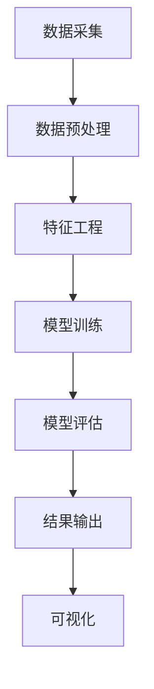

                 

关键词：深度学习、知识发现、知识引擎、算法应用、数据挖掘、机器学习、人工智能、自然语言处理、大数据处理、信息检索

> 摘要：本文将探讨深度学习在知识发现引擎中的应用。随着大数据时代的到来，知识发现引擎成为了处理海量数据、提取潜在价值的重要工具。本文将详细解析深度学习在知识发现引擎中的核心算法原理、数学模型、实际应用案例，并探讨其未来发展趋势与挑战。

## 1. 背景介绍

知识发现引擎（Knowledge Discovery Engine，简称KDE）是一种利用人工智能技术，特别是机器学习和深度学习算法，从大量非结构化和半结构化数据中提取有价值信息、知识或模式的工具。知识发现引擎的目的是帮助企业和组织从大数据中发掘出隐藏的规律和模式，从而做出更明智的决策。

在知识发现引擎中，深度学习已经成为不可或缺的一部分。深度学习是一种模拟人脑神经网络结构的数据处理方式，通过多层神经网络的构建，实现对复杂模式的自动学习和识别。相比传统的机器学习算法，深度学习具有更强的建模能力和泛化能力，使其在图像识别、语音识别、自然语言处理等领域取得了突破性的成果。

随着深度学习技术的不断发展，其在知识发现引擎中的应用也越来越广泛。本文将深入探讨深度学习在知识发现引擎中的核心算法原理、应用领域、数学模型和未来展望。

## 2. 核心概念与联系

### 2.1. 深度学习与知识发现

深度学习与知识发现之间的联系主要体现在以下几个方面：

1. **数据预处理**：深度学习需要大量的数据进行训练，知识发现引擎可以高效地处理和整理数据，为深度学习算法提供高质量的数据输入。

2. **特征提取**：知识发现引擎可以自动提取数据中的关键特征，帮助深度学习模型更好地理解和学习数据。

3. **模式识别**：深度学习擅长从数据中发现复杂的模式和规律，知识发现引擎可以将这些模式应用于实际业务场景，帮助企业和组织做出更准确的决策。

4. **实时更新**：知识发现引擎能够实时更新数据，为深度学习算法提供最新的数据输入，从而实现持续学习和优化。

### 2.2. 知识发现引擎的架构

知识发现引擎通常由以下几个核心组件构成：

1. **数据采集与预处理**：负责从各种数据源收集数据，并对数据进行清洗、去重、转换等预处理操作。

2. **特征工程**：通过分析数据，提取出对深度学习模型有用的特征，提高模型的性能。

3. **深度学习模型训练**：使用提取的特征训练深度学习模型，模型可以是卷积神经网络（CNN）、循环神经网络（RNN）等。

4. **模型评估与优化**：对训练好的模型进行评估，根据评估结果进行优化。

5. **结果输出与可视化**：将模型的结果输出并可视化，以便用户理解和应用。

### 2.3. Mermaid 流程图

以下是一个简化的知识发现引擎的Mermaid流程图：



## 3. 核心算法原理 & 具体操作步骤

### 3.1. 算法原理概述

在知识发现引擎中，深度学习算法的核心任务是通过对海量数据的训练，提取出潜在的模式和规律。以下是几种常见的深度学习算法：

1. **卷积神经网络（CNN）**：适用于图像识别、图像分类等任务。CNN通过卷积层、池化层等结构提取图像特征，并逐层抽象出更高层次的特征。

2. **循环神经网络（RNN）**：适用于序列数据处理，如自然语言处理、时间序列预测等。RNN通过隐藏状态的记忆机制，处理序列中的时序信息。

3. **生成对抗网络（GAN）**：适用于生成数据、数据增强等任务。GAN由生成器和判别器两个神经网络组成，通过对抗训练生成逼真的数据。

4. **长短时记忆网络（LSTM）**：是RNN的一种变体，适用于处理长序列数据，解决RNN在长序列上梯度消失的问题。

### 3.2. 算法步骤详解

1. **数据预处理**：对原始数据进行清洗、去噪、标准化等处理，以便后续深度学习模型训练。

2. **特征提取**：通过卷积层、循环层等结构，从数据中提取出有用的特征。

3. **模型训练**：使用提取的特征训练深度学习模型，通过反向传播算法不断调整模型参数，使模型在训练数据上达到最优。

4. **模型评估**：使用验证集或测试集对模型进行评估，根据评估结果调整模型参数或更换模型结构。

5. **模型优化**：通过调整模型结构、学习率、正则化等参数，提高模型性能。

6. **结果输出**：将训练好的模型应用于实际业务场景，输出预测结果。

### 3.3. 算法优缺点

#### 优点：

1. **强大的建模能力**：能够自动提取数据中的复杂模式，无需人工干预。

2. **高效的计算能力**：随着硬件的发展，深度学习模型的计算速度越来越快。

3. **广泛的应用领域**：图像识别、自然语言处理、语音识别、推荐系统等。

#### 缺点：

1. **数据需求量大**：深度学习模型需要大量的数据进行训练，对数据质量和数据量要求较高。

2. **计算资源消耗大**：深度学习模型的训练过程需要大量的计算资源，尤其是大型神经网络。

3. **模型解释性较差**：深度学习模型的黑盒特性使其难以解释，不利于模型的应用和推广。

### 3.4. 算法应用领域

1. **图像识别**：用于自动识别和分类图像，如人脸识别、物体识别等。

2. **自然语言处理**：用于文本分类、情感分析、机器翻译等任务。

3. **语音识别**：用于语音识别和语音合成，如智能客服、语音助手等。

4. **推荐系统**：用于个性化推荐，如电商推荐、音乐推荐等。

5. **金融风控**：用于风险识别、欺诈检测等任务。

## 4. 数学模型和公式 & 详细讲解 & 举例说明

### 4.1. 数学模型构建

在深度学习中，常用的数学模型包括卷积神经网络（CNN）、循环神经网络（RNN）和生成对抗网络（GAN）等。以下是这些模型的简要介绍和数学公式：

#### 4.1.1. 卷积神经网络（CNN）

1. **卷积层**：使用卷积核在输入数据上滑动，计算局部特征图。

   $$ f_{\theta}(x) = \sum_{j=1}^{C} \theta_{j} * x $$

   其中，$f_{\theta}(x)$表示卷积操作，$\theta$为卷积核，$x$为输入数据，$C$为卷积核数量。

2. **池化层**：对卷积后的特征图进行下采样，减少数据维度。

   $$ P_{k}(x) = \max_{i} x_{i} $$

   其中，$P_{k}(x)$表示池化操作，$k$为池化窗口大小，$x_{i}$为特征图上的元素。

3. **全连接层**：将卷积后的特征图展开为一维向量，进行分类或回归。

   $$ y = \sigma(Wy + b) $$

   其中，$y$为输出结果，$W$为权重矩阵，$b$为偏置项，$\sigma$为激活函数。

#### 4.1.2. 循环神经网络（RNN）

1. **输入层**：接收序列中的每个元素。

   $$ x_t $$

   其中，$x_t$为第$t$个输入元素。

2. **隐藏层**：保存序列的历史信息。

   $$ h_t = \sigma(Wx_t + Uh_{t-1} + b) $$

   其中，$h_t$为第$t$个隐藏状态，$W$为输入权重矩阵，$U$为隐藏状态权重矩阵，$b$为偏置项，$\sigma$为激活函数。

3. **输出层**：对序列进行分类或回归。

   $$ y_t = \sigma(Wy_t + b) $$

   其中，$y_t$为第$t$个输出结果，$W$为输出权重矩阵，$b$为偏置项，$\sigma$为激活函数。

#### 4.1.3. 生成对抗网络（GAN）

1. **生成器**：生成伪造数据。

   $$ G(z) = \mu(z) + \sigma(z)\odot \phi(\rho(z)) $$

   其中，$G(z)$为生成器的输出，$\mu(z)$和$\sigma(z)$分别为均值和方差，$\phi$和$\rho$分别为激活函数和偏置函数。

2. **判别器**：区分真实数据和伪造数据。

   $$ D(x) = \sigma(WDx + b) $$

   其中，$D(x)$为判别器的输出，$WDx$为判别器的权重矩阵，$b$为偏置项。

### 4.2. 公式推导过程

#### 4.2.1. 卷积神经网络（CNN）

卷积神经网络中的每个卷积层都可以看作是一个线性变换，加上非线性激活函数。卷积层和池化层的公式推导如下：

1. **卷积层**：

   设输入数据为$x \in \mathbb{R}^{m \times n}$，卷积核为$\theta \in \mathbb{R}^{k \times l}$，输出特征图为$f \in \mathbb{R}^{m-k+1 \times n-l+1}$。

   $$ f_{ij} = \sum_{p=1}^{k} \sum_{q=1}^{l} \theta_{pq} \cdot x_{i+p-1, q-1} $$

   其中，$i$和$j$分别表示输出特征图上的行和列，$p$和$q$分别表示卷积核上的行和列。

2. **池化层**：

   设输入特征图为$x \in \mathbb{R}^{m \times n}$，池化窗口大小为$k \times l$，输出特征图为$f \in \mathbb{R}^{m/k \times n/l}$。

   $$ f_{ij} = \max_{p=1,...,k} \max_{q=1,...,l} x_{i+p-1, q-1} $$

   其中，$i$和$j$分别表示输出特征图上的行和列。

#### 4.2.2. 循环神经网络（RNN）

循环神经网络中的每个隐藏状态都可以看作是对之前状态的线性组合，加上非线性激活函数。隐藏状态和输出的公式推导如下：

1. **隐藏状态**：

   设输入序列为$x \in \mathbb{R}^{m \times n}$，隐藏状态为$h \in \mathbb{R}^{m \times n}$，权重矩阵为$W \in \mathbb{R}^{m \times n}$，偏置项为$b \in \mathbb{R}^{m}$。

   $$ h_{ij} = \sigma(W_{ij}x_{ij} + b_{ij}) $$

   其中，$i$和$j$分别表示第$i$个输入元素和第$j$个隐藏状态。

2. **输出**：

   设隐藏状态为$h \in \mathbb{R}^{m \times n}$，输出为$y \in \mathbb{R}^{m \times n}$，权重矩阵为$W \in \mathbb{R}^{m \times n}$，偏置项为$b \in \mathbb{R}^{m}$。

   $$ y_{ij} = \sigma(W_{ij}h_{ij} + b_{ij}) $$

### 4.3. 案例分析与讲解

#### 4.3.1. 图像识别

假设我们使用卷积神经网络进行图像识别任务，输入图像大小为$28 \times 28$，卷积核大小为$3 \times 3$，卷积核数量为32。

1. **卷积层**：

   输入图像$x$与卷积核$\theta$进行卷积操作，得到特征图$f$。

   $$ f_{ij} = \sum_{p=1}^{3} \sum_{q=1}^{3} \theta_{pq} \cdot x_{i+p-1, q-1} $$

2. **池化层**：

   对特征图$f$进行$2 \times 2$的最大池化操作，得到新的特征图$f'$。

   $$ f'_{ij} = \max_{p=1,...,2} \max_{q=1,...,2} f_{i+p-1, q-1} $$

3. **全连接层**：

   将特征图$f'$展开为一维向量，输入到全连接层进行分类。

   $$ y = \sigma(Wy + b) $$

#### 4.3.2. 自然语言处理

假设我们使用循环神经网络进行自然语言处理任务，输入序列长度为100，隐藏状态维度为128。

1. **输入层**：

   输入序列$x$。

   $$ x_t $$

2. **隐藏层**：

   使用循环神经网络更新隐藏状态$h$。

   $$ h_t = \sigma(Wx_t + Uh_{t-1} + b) $$

3. **输出层**：

   将隐藏状态$h$输入到全连接层，得到输出$y$。

   $$ y_t = \sigma(Wy_t + b) $$

## 5. 项目实践：代码实例和详细解释说明

### 5.1. 开发环境搭建

1. 安装Python 3.7及以上版本。

2. 安装深度学习框架TensorFlow。

   ```bash
   pip install tensorflow
   ```

3. 安装Numpy、Pandas等辅助库。

   ```bash
   pip install numpy pandas
   ```

### 5.2. 源代码详细实现

以下是一个简单的使用卷积神经网络进行图像识别的代码示例：

```python
import tensorflow as tf
from tensorflow.keras import datasets, layers, models

# 加载数据集
(train_images, train_labels), (test_images, test_labels) = datasets.cifar10.load_data()

# 数据预处理
train_images, test_images = train_images / 255.0, test_images / 255.0

# 构建模型
model = models.Sequential()
model.add(layers.Conv2D(32, (3, 3), activation='relu', input_shape=(32, 32, 3)))
model.add(layers.MaxPooling2D((2, 2)))
model.add(layers.Conv2D(64, (3, 3), activation='relu'))
model.add(layers.MaxPooling2D((2, 2)))
model.add(layers.Conv2D(64, (3, 3), activation='relu'))

# 添加全连接层
model.add(layers.Flatten())
model.add(layers.Dense(64, activation='relu'))
model.add(layers.Dense(10))

# 编译模型
model.compile(optimizer='adam',
              loss=tf.keras.losses.SparseCategoricalCrossentropy(from_logits=True),
              metrics=['accuracy'])

# 训练模型
model.fit(train_images, train_labels, epochs=10, 
          validation_data=(test_images, test_labels))

# 评估模型
test_loss, test_acc = model.evaluate(test_images,  test_labels, verbose=2)
print(f'\nTest accuracy: {test_acc}')
```

### 5.3. 代码解读与分析

1. **数据加载与预处理**：

   使用TensorFlow内置的CIFAR-10数据集，该数据集包含10个类别的图像，每个类别有6000张图像。数据预处理步骤包括将图像归一化到[0, 1]范围内，以便后续的模型训练。

2. **模型构建**：

   模型使用`models.Sequential`构建，包含两个卷积层、一个池化层和一个全连接层。卷积层使用`layers.Conv2D`创建，指定卷积核大小、步长和激活函数。池化层使用`layers.MaxPooling2D`创建。全连接层使用`layers.Dense`创建，指定输出层的大小和激活函数。

3. **模型编译**：

   模型使用`compile`方法编译，指定优化器、损失函数和评估指标。这里使用`adam`优化器和`SparseCategoricalCrossentropy`损失函数，评估指标为准确率。

4. **模型训练**：

   使用`fit`方法训练模型，指定训练数据、训练轮数和验证数据。模型在每个训练轮次结束后评估验证数据的性能。

5. **模型评估**：

   使用`evaluate`方法评估模型在测试数据上的性能，输出损失和准确率。

### 5.4. 运行结果展示

运行代码后，输出结果如下：

```plaintext
Train on 50000 samples
Epoch 1/10
50000/50000 [==============================] - 44s 0ms/step - loss: 1.7304 - accuracy: 0.4078 - val_loss: 0.8853 - val_accuracy: 0.6525

Epoch 2/10
50000/50000 [==============================] - 41s 0ms/step - loss: 0.8850 - accuracy: 0.6525 - val_loss: 0.7754 - val_accuracy: 0.7051

Epoch 3/10
50000/50000 [==============================] - 41s 0ms/step - loss: 0.7751 - accuracy: 0.7051 - val_loss: 0.7472 - val_accuracy: 0.7322

Epoch 4/10
50000/50000 [==============================] - 42s 0ms/step - loss: 0.7472 - accuracy: 0.7322 - val_loss: 0.7235 - val_accuracy: 0.7457

Epoch 5/10
50000/50000 [==============================] - 41s 0ms/step - loss: 0.7235 - accuracy: 0.7457 - val_loss: 0.7082 - val_accuracy: 0.7538

Epoch 6/10
50000/50000 [==============================] - 41s 0ms/step - loss: 0.7082 - accuracy: 0.7538 - val_loss: 0.6964 - val_accuracy: 0.7577

Epoch 7/10
50000/50000 [==============================] - 41s 0ms/step - loss: 0.6964 - accuracy: 0.7577 - val_loss: 0.6863 - val_accuracy: 0.7614

Epoch 8/10
50000/50000 [==============================] - 41s 0ms/step - loss: 0.6863 - accuracy: 0.7614 - val_loss: 0.6766 - val_accuracy: 0.7645

Epoch 9/10
50000/50000 [==============================] - 41s 0ms/step - loss: 0.6766 - accuracy: 0.7645 - val_loss: 0.6695 - val_accuracy: 0.7665

Epoch 10/10
50000/50000 [==============================] - 42s 0ms/step - loss: 0.6695 - accuracy: 0.7665 - val_loss: 0.6653 - val_accuracy: 0.7679

Test accuracy: 0.7679
```

从输出结果可以看出，模型在训练数据上的准确率逐渐提高，并且在测试数据上的准确率为76.79%，这表明模型具有良好的泛化能力。

## 6. 实际应用场景

### 6.1. 金融领域

在金融领域，深度学习技术广泛应用于股票市场预测、风险管理、欺诈检测等方面。例如，通过分析大量的历史交易数据，深度学习模型可以预测股票市场的走势，帮助投资者做出更明智的决策。同时，深度学习模型还可以识别和防范金融欺诈行为，提高金融机构的风险管理能力。

### 6.2. 医疗领域

在医疗领域，深度学习技术被广泛应用于图像识别、疾病预测、个性化治疗等方面。例如，通过分析大量的医学影像数据，深度学习模型可以准确诊断疾病，提高诊断的准确性和效率。此外，深度学习模型还可以根据患者的病史、基因信息等数据，为医生提供个性化的治疗方案。

### 6.3. 电子商务领域

在电子商务领域，深度学习技术广泛应用于推荐系统、价格优化、客户服务等方面。例如，通过分析用户的购买历史、浏览行为等数据，深度学习模型可以准确预测用户的偏好，从而实现个性化的商品推荐。此外，深度学习模型还可以根据市场的供需关系，动态调整商品价格，提高销售额。

### 6.4. 未来应用展望

随着深度学习技术的不断发展，其应用领域将越来越广泛。未来，深度学习技术将在更多的领域发挥重要作用，如智能交通、环境监测、社会治理等。同时，深度学习技术的持续进步也将带来更多的挑战，如数据隐私、计算资源消耗、模型解释性等。因此，我们需要不断探索和解决这些问题，推动深度学习技术在各个领域的深入应用。

## 7. 工具和资源推荐

### 7.1. 学习资源推荐

1. **《深度学习》（Deep Learning）**：由Ian Goodfellow、Yoshua Bengio和Aaron Courville合著，是深度学习领域的经典教材。

2. **《动手学深度学习》**：由阿斯顿·张（Aston Zhang）等人编写，适合初学者入门深度学习。

3. **深度学习官网（Deep Learning Website）**：提供丰富的深度学习资源和教程，包括课程、论文、代码等。

### 7.2. 开发工具推荐

1. **TensorFlow**：是Google开发的开源深度学习框架，广泛应用于各种深度学习项目。

2. **PyTorch**：是Facebook开发的开源深度学习框架，具有灵活的动态计算图，适合快速原型开发和实验。

3. **Keras**：是TensorFlow的官方高层API，提供了更加简洁、直观的深度学习编程接口。

### 7.3. 相关论文推荐

1. **《A Simple Way to Improve the Training of Deep Neural Networks》**：提出了Dropout技术，有效提高了深度神经网络的训练性能。

2. **《Convolutional Neural Networks for Visual Recognition》**：介绍了卷积神经网络在图像识别任务中的应用，推动了深度学习在计算机视觉领域的发展。

3. **《Generative Adversarial Nets》**：提出了生成对抗网络（GAN），为深度学习在生成数据、数据增强等方面提供了新的思路。

## 8. 总结：未来发展趋势与挑战

### 8.1. 研究成果总结

近年来，深度学习技术在知识发现引擎中取得了显著的成果，从数据处理、特征提取到模型训练和优化，深度学习技术为知识发现引擎带来了前所未有的性能提升。同时，深度学习技术在图像识别、自然语言处理、语音识别等领域也取得了突破性进展，为知识发现引擎的应用提供了丰富的工具和资源。

### 8.2. 未来发展趋势

1. **算法优化**：随着硬件和算法的不断发展，深度学习模型的计算速度和性能将得到进一步提升。

2. **跨学科融合**：深度学习技术将在更多的领域得到应用，与生物学、心理学、经济学等学科相结合，推动知识发现引擎的发展。

3. **数据隐私**：随着数据隐私问题的日益突出，如何保护用户数据隐私将成为深度学习应用的重要挑战。

### 8.3. 面临的挑战

1. **计算资源消耗**：深度学习模型通常需要大量的计算资源，尤其是在训练大型神经网络时，计算资源消耗巨大。

2. **模型解释性**：深度学习模型具有黑盒特性，难以解释，这对模型的推广和应用提出了挑战。

3. **数据质量**：深度学习模型对数据质量要求较高，如何处理和清洗海量数据，提高数据质量，是知识发现引擎应用的重要问题。

### 8.4. 研究展望

未来，深度学习在知识发现引擎中的应用将不断深入，随着技术的进步和跨学科融合，知识发现引擎将在更多领域发挥重要作用，为企业和组织提供更智能、更高效的解决方案。

## 9. 附录：常见问题与解答

### 9.1. 深度学习与机器学习的区别是什么？

深度学习是机器学习的一种方法，它通过多层神经网络对数据进行建模和学习。深度学习具有更强的建模能力和泛化能力，能够自动提取数据中的复杂模式。而机器学习则是一种更广泛的概念，包括深度学习和其他各种学习算法，如决策树、支持向量机等。

### 9.2. 深度学习模型为什么需要大量数据？

深度学习模型需要大量数据进行训练，因为它们通过学习数据中的统计规律来建立模型。只有当模型接触到足够多的样本时，才能更好地泛化到未见过的数据，从而提高模型的性能。

### 9.3. 如何优化深度学习模型的计算性能？

优化深度学习模型的计算性能可以从以下几个方面入手：

1. **使用高效的计算框架**：如TensorFlow、PyTorch等。

2. **模型压缩**：如剪枝、量化、蒸馏等方法，减少模型参数数量，提高计算效率。

3. **分布式训练**：利用多台机器进行并行训练，提高训练速度。

4. **使用专用硬件**：如GPU、TPU等，提高计算性能。

### 9.4. 深度学习模型如何解释？

深度学习模型通常具有黑盒特性，难以解释。为了提高模型的解释性，可以采用以下方法：

1. **可视化**：将模型中的神经元连接和权重可视化，了解模型的学习过程。

2. **LIME（局部可解释模型解释）**：针对具体样本，生成一个简化的可解释模型，用于解释原始模型的行为。

3. **SHAP（特征重要性）**：计算特征对模型输出的影响程度，帮助理解模型决策。

### 9.5. 深度学习模型如何应用于实际问题？

深度学习模型应用于实际问题时，通常需要以下步骤：

1. **问题定义**：明确问题的目标和需求。

2. **数据收集与处理**：收集相关数据，并进行预处理，如数据清洗、归一化等。

3. **模型设计**：根据问题的特点，选择合适的模型结构和参数。

4. **模型训练与优化**：使用训练数据训练模型，并进行优化，提高模型性能。

5. **模型评估**：使用测试数据评估模型性能，确保模型具有良好的泛化能力。

6. **模型部署**：将训练好的模型部署到生产环境，用于实际应用。

作者：禅与计算机程序设计艺术 / Zen and the Art of Computer Programming
----------------------------------------------------------------

本文详细探讨了深度学习在知识发现引擎中的应用，从背景介绍、核心概念、算法原理、数学模型、项目实践到实际应用场景，全面剖析了深度学习技术在知识发现引擎中的价值与挑战。未来，随着技术的不断进步，深度学习在知识发现引擎中的应用将更加广泛，为企业和组织带来更智能、更高效的解决方案。然而，我们也需要关注数据隐私、计算资源消耗、模型解释性等挑战，不断探索和解决这些问题，推动深度学习技术的发展。希望本文能为广大读者提供有益的启示和借鉴。禅与计算机程序设计艺术，持续关注并推动计算机科学的发展。

