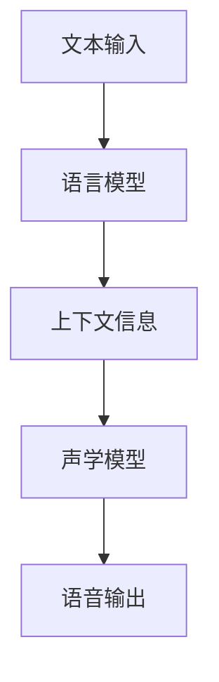

                 

关键词：深度学习，语音合成，自然语言处理，声学模型，语言模型，端到端模型，生成对抗网络，时间卷积网络，注意力机制

## 摘要

本文将探讨深度学习在语音合成领域的最新技术进展。我们将首先介绍语音合成的基础概念，然后深入分析声学模型和语言模型的作用，探讨端到端模型的应用，以及生成对抗网络在语音合成中的创新。此外，本文还将讨论时间卷积网络和注意力机制在语音合成中的重要作用，最后展望未来语音合成技术的发展趋势。

## 1. 背景介绍

### 语音合成的定义与历史发展

语音合成（Text-to-Speech，TTS）是一种将文本转换为自然流畅语音的技术。它广泛应用于各类人机交互场景，如语音助手、电话客服、有声读物等。语音合成技术经历了从规则方法到统计方法，再到深度学习方法的演变。

早期的语音合成系统主要基于规则，如电话语音合成系统AT&T的Audible Speech（AS）和Bell Laboratories的Speech Excitation（SPHINX）。这些系统通过定义音素的发音规则和音素组合规则来生成语音，但生成的语音质量有限且对语言变化适应性较差。

随着计算机技术的发展，统计方法逐渐成为主流。1982年，美国的SRILM项目提出了基于统计的语音合成方法。这种方法通过训练大量语音和文本数据，建立语音模型和语言模型，从而生成更加自然和流畅的语音。统计方法的代表系统有德国Fraunhofer的IVAS和日本NEC的Harmony。

深度学习技术的崛起为语音合成带来了革命性的变化。深度神经网络在图像识别、自然语言处理等领域取得了显著成果，从而激发了研究人员将其应用于语音合成。深度学习模型能够自动学习语音特征和语言规律，显著提高了语音合成的质量。

### 深度学习在语音合成中的应用现状

近年来，深度学习在语音合成领域取得了巨大进展。基于深度学习的语音合成系统在语音质量、自然度、语音多样性等方面都取得了显著的提升。目前，许多公司和研究机构都已经开发出了基于深度学习的语音合成系统，如谷歌的WaveNet、微软的Zoenergi和苹果的Siri。

深度学习在语音合成中的应用主要集中在两个方面：声学模型和语言模型。声学模型负责将文本转换成语音信号，语言模型则负责生成与文本含义相符的自然语言。这两个模型在端到端模型中得到整合，实现了从文本到语音的一体化生成。

## 2. 核心概念与联系

### 2.1 声学模型与语言模型的定义

声学模型（Acoustic Model）是语音合成系统中的一个关键组件，它负责将文本转换成语音信号。声学模型通常使用深度神经网络来学习语音特征，如声母、韵母、音调等，从而生成自然流畅的语音。

语言模型（Language Model）则负责生成与文本含义相符的自然语言。语言模型通常使用神经网络或统计模型来学习文本中的语言规律和统计特性，从而生成自然流畅的文本。

### 2.2 声学模型与语言模型的关系

声学模型和语言模型在语音合成中发挥着不同的作用，但它们之间也有着紧密的联系。语言模型通过分析文本生成语音的上下文信息，为声学模型提供重要的输入。声学模型则根据语言模型提供的上下文信息，生成与文本含义相符的语音信号。

在实际应用中，声学模型和语言模型通常采用端到端模型进行整合。端到端模型将文本输入直接映射到语音输出，从而避免了传统语音合成系统中声学模型和语言模型的分离，提高了生成语音的自然度和一致性。

### 2.3 Mermaid 流程图

以下是一个简化的 Mermaid 流程图，展示了声学模型、语言模型和端到端模型在语音合成中的关系。



## 3. 核心算法原理 & 具体操作步骤

### 3.1 算法原理概述

深度学习在语音合成中的应用主要基于以下核心算法原理：

- **深度神经网络**：深度神经网络通过多层非线性变换来学习数据中的复杂特征。在语音合成中，深度神经网络用于建模文本、语音特征和语音信号之间的关系。
- **卷积神经网络（CNN）**：卷积神经网络擅长处理具有空间结构的数据，如图像。在语音合成中，卷积神经网络用于提取语音信号的时频特征。
- **循环神经网络（RNN）**：循环神经网络具有时间动态性，可以处理序列数据。在语音合成中，循环神经网络用于建模文本和语音信号之间的时序关系。
- **生成对抗网络（GAN）**：生成对抗网络由生成器和判别器组成，通过对抗训练生成高质量的数据。在语音合成中，生成对抗网络用于生成逼真的语音信号。

### 3.2 算法步骤详解

#### 3.2.1 数据预处理

在训练深度学习模型之前，需要对语音数据集和文本数据集进行预处理。语音数据集需要进行分帧、加窗和特征提取，如梅尔频率倒谱系数（MFCC）。文本数据集需要进行分词、词性标注和词嵌入。

#### 3.2.2 建立声学模型

声学模型的建立通常采用卷积神经网络或循环神经网络。卷积神经网络可以用于提取语音信号的时频特征，循环神经网络可以用于建模文本和语音信号之间的时序关系。具体步骤如下：

1. **输入层**：输入层接收语音信号的时频特征。
2. **卷积层**：卷积层用于提取语音信号中的局部特征。
3. **池化层**：池化层用于降低特征维度，提高模型泛化能力。
4. **循环层**：循环层用于建模语音信号和文本之间的时序关系。
5. **输出层**：输出层生成语音信号的声学参数，如线性预测系数（LPCC）。

#### 3.2.3 建立语言模型

语言模型的建立通常采用循环神经网络或递归神经网络。循环神经网络可以用于建模文本序列中的依赖关系，递归神经网络可以用于建模文本序列中的递归结构。具体步骤如下：

1. **输入层**：输入层接收文本序列。
2. **循环层**：循环层用于建模文本序列中的依赖关系。
3. **池化层**：池化层用于降低特征维度，提高模型泛化能力。
4. **输出层**：输出层生成文本序列的概率分布。

#### 3.2.4 建立端到端模型

端到端模型的建立通常采用深度神经网络或生成对抗网络。深度神经网络通过端到端的方式将文本直接映射到语音信号，生成对抗网络通过对抗训练生成高质量的语音信号。具体步骤如下：

1. **输入层**：输入层接收文本序列。
2. **编码器**：编码器用于将文本序列编码为隐含表示。
3. **解码器**：解码器用于将隐含表示解码为语音信号。
4. **输出层**：输出层生成语音信号的声学参数。

### 3.3 算法优缺点

#### 3.3.1 优点

- **端到端学习**：深度学习模型能够直接从文本到语音的一体化学习，避免了传统语音合成系统中声学模型和语言模型的分离，提高了生成语音的自然度和一致性。
- **自适应能力**：深度学习模型能够自适应地学习语音特征和语言规律，从而生成个性化的语音。
- **高效性**：深度学习模型具有较高的计算效率，可以快速生成语音。

#### 3.3.2 缺点

- **数据需求**：深度学习模型需要大量的训练数据，数据预处理和标注过程复杂。
- **调参难度**：深度学习模型需要大量调参，优化过程复杂。
- **资源消耗**：深度学习模型通常需要较高的计算资源和存储资源。

### 3.4 算法应用领域

深度学习在语音合成中的应用涵盖了多个领域：

- **智能语音助手**：如谷歌的Google Assistant、苹果的Siri、亚马逊的Alexa等。
- **有声读物**：将文本内容转换为语音内容，方便用户听书。
- **电话客服**：自动生成语音回复，提高客服效率。
- **车载语音系统**：提供导航、音乐播放、电话通讯等功能。
- **智能家居**：与智能设备交互，提供语音控制。

## 4. 数学模型和公式 & 详细讲解 & 举例说明

### 4.1 数学模型构建

在深度学习语音合成中，我们通常构建以下数学模型：

- **声学模型**：用于将文本序列映射到语音信号的声学参数。
- **语言模型**：用于将文本序列映射到概率分布。
- **端到端模型**：将文本序列直接映射到语音信号。

#### 4.1.1 声学模型

声学模型通常采用循环神经网络（RNN）或其变种，如长短期记忆网络（LSTM）和门控循环单元（GRU）。以下是一个简单的声学模型数学表示：

$$
\begin{aligned}
h_t &= \text{RNN}(h_{t-1}, x_t), \\
x_t &= \text{特征提取}(s_t), \\
s_t &= \text{文本嵌入}(w_t).
\end{aligned}
$$

其中，$h_t$ 表示第 $t$ 个时间步的隐藏状态，$x_t$ 表示第 $t$ 个时间步的语音特征，$s_t$ 表示第 $t$ 个时间步的文本嵌入。

#### 4.1.2 语言模型

语言模型通常采用循环神经网络（RNN）或其变种，如LSTM和GRU。以下是一个简单的语言模型数学表示：

$$
\begin{aligned}
p(w_t | w_{<t}) &= \text{softmax}(\text{RNN}(h_{<t}, w_t)), \\
h_{<t} &= [h_1, h_2, ..., h_{t-1}],
\end{aligned}
$$

其中，$p(w_t | w_{<t})$ 表示在给定前 $t-1$ 个词 $w_{<t}$ 的条件下，第 $t$ 个词 $w_t$ 的概率分布，$h_{<t}$ 表示前 $t-1$ 个时间步的隐藏状态。

#### 4.1.3 端到端模型

端到端模型通常采用深度神经网络（DNN）或生成对抗网络（GAN）。以下是一个简单的端到端模型数学表示：

$$
\begin{aligned}
s_t &= \text{DNN}(w_t), \\
x_t &= \text{特征提取}(s_t), \\
p(x_t | s_t) &= \text{生成器} \\
\end{aligned}
$$

其中，$s_t$ 表示第 $t$ 个时间步的文本嵌入，$x_t$ 表示第 $t$ 个时间步的语音特征。

### 4.2 公式推导过程

#### 4.2.1 声学模型推导

声学模型的推导基于循环神经网络（RNN）。假设我们有一个输入序列 $x = (x_1, x_2, ..., x_T)$ 和一个隐藏状态序列 $h = (h_1, h_2, ..., h_T)$，其中 $x_t$ 表示第 $t$ 个时间步的输入，$h_t$ 表示第 $t$ 个时间步的隐藏状态。

首先，我们定义 RNN 的状态转移方程：

$$
h_t = \sigma(W_h h_{t-1} + W_x x_t + b_h),
$$

其中，$\sigma$ 表示激活函数（如Sigmoid函数或Tanh函数），$W_h$ 和 $W_x$ 分别为隐藏状态和输入的权重矩阵，$b_h$ 为偏置项。

接下来，我们定义语音特征提取函数：

$$
x_t = \text{特征提取}(h_t),
$$

其中，$\text{特征提取}$ 函数用于将隐藏状态转换为语音特征。

最后，我们定义语音生成的概率分布：

$$
p(x_t | h_{t-1}) = \text{softmax}(W_x x_t + b_x),
$$

其中，$W_x$ 为输入权重矩阵，$b_x$ 为偏置项。

#### 4.2.2 语言模型推导

语言模型的推导基于循环神经网络（RNN）。假设我们有一个输入序列 $w = (w_1, w_2, ..., w_T)$ 和一个隐藏状态序列 $h = (h_1, h_2, ..., h_T)$，其中 $w_t$ 表示第 $t$ 个时间步的输入，$h_t$ 表示第 $t$ 个时间步的隐藏状态。

首先，我们定义 RNN 的状态转移方程：

$$
h_t = \sigma(W_h h_{t-1} + W_w w_t + b_h),
$$

其中，$\sigma$ 表示激活函数，$W_h$ 和 $W_w$ 分别为隐藏状态和输入的权重矩阵，$b_h$ 为偏置项。

接下来，我们定义文本生成的概率分布：

$$
p(w_t | w_{<t}) = \text{softmax}(\text{RNN}(h_{<t}, w_t)),
$$

其中，$\text{RNN}(h_{<t}, w_t)$ 表示循环神经网络在给定前 $t-1$ 个词 $w_{<t}$ 的条件下，对第 $t$ 个词 $w_t$ 的预测。

#### 4.2.3 端到端模型推导

端到端模型的推导基于深度神经网络（DNN）。假设我们有一个输入序列 $s = (s_1, s_2, ..., s_T)$ 和一个输出序列 $x = (x_1, x_2, ..., x_T)$，其中 $s_t$ 表示第 $t$ 个时间步的文本嵌入，$x_t$ 表示第 $t$ 个时间步的语音特征。

首先，我们定义编码器：

$$
s_t = \text{DNN}(w_t),
$$

其中，$\text{DNN}$ 表示深度神经网络，$w_t$ 表示第 $t$ 个时间步的文本嵌入。

接下来，我们定义解码器：

$$
x_t = \text{特征提取}(s_t),
$$

其中，$\text{特征提取}$ 函数用于将文本嵌入转换为语音特征。

最后，我们定义语音生成的概率分布：

$$
p(x_t | s_t) = \text{生成器}(s_t),
$$

其中，$\text{生成器}$ 函数用于生成语音特征的概率分布。

### 4.3 案例分析与讲解

#### 4.3.1 WaveNet 案例分析

WaveNet 是谷歌开发的一种基于深度神经网络的端到端语音合成系统。WaveNet 使用循环神经网络（RNN）来建模文本和语音信号之间的关系，并使用生成对抗网络（GAN）来生成高质量的语音信号。

在 WaveNet 中，编码器采用 RNN 来将文本序列编码为隐含表示，解码器采用 RNN 来将隐含表示解码为语音信号。具体步骤如下：

1. **文本编码**：文本序列经过分词、词性标注和词嵌入处理，得到词嵌入序列 $s = (s_1, s_2, ..., s_T)$。
2. **隐含表示生成**：编码器使用 RNN 对词嵌入序列进行编码，生成隐含表示序列 $h = (h_1, h_2, ..., h_T)$。
3. **语音信号生成**：解码器使用 RNN 对隐含表示序列进行解码，生成语音信号的概率分布 $p(x_t | h_{t-1})$。
4. **语音信号采样**：根据语音信号的概率分布 $p(x_t | h_{t-1})$，对语音信号进行采样，得到语音信号序列 $x = (x_1, x_2, ..., x_T)$。

#### 4.3.2 WaveNet 代码示例

以下是一个简化的 WaveNet 代码示例，展示了编码器和解码器的构建过程。

```python
import tensorflow as tf
from tensorflow.keras.layers import LSTM, Dense, Embedding, TimeDistributed, Activation

# 编码器
def encoder(text_sequence, embedding_matrix):
    embedding_layer = Embedding(input_dim=VOCAB_SIZE, output_dim=EMBEDDING_DIM, weights=[embedding_matrix], trainable=False)
    encoded_sequence = embedding_layer(text_sequence)
    encoded_sequence = LSTM(LSTM_UNITS)(encoded_sequence)
    return encoded_sequence

# 解码器
def decoder(hidden_state, embedding_matrix):
    embedding_layer = Embedding(input_dim=VOCAB_SIZE, output_dim=EMBEDDING_DIM, weights=[embedding_matrix], trainable=False)
    decoded_sequence = embedding_layer(hidden_state)
    decoded_sequence = LSTM(LSTM_UNITS, return_sequences=True)(decoded_sequence)
    decoded_sequence = TimeDistributed(Dense(VOCAB_SIZE, activation='softmax'))(decoded_sequence)
    return decoded_sequence

# 构建模型
model = Model(inputs=[text_input, hidden_input], outputs=[decoded_sequence])

# 编译模型
model.compile(optimizer='adam', loss='categorical_crossentropy', metrics=['accuracy'])

# 训练模型
model.fit([text_data, hidden_data], label_data, batch_size=BATCH_SIZE, epochs=EPOCHS)
```

## 5. 项目实践：代码实例和详细解释说明

### 5.1 开发环境搭建

要在本地环境搭建一个基于深度学习的语音合成系统，我们需要安装以下软件和库：

- **操作系统**：Linux或macOS
- **Python**：Python 3.x版本
- **TensorFlow**：TensorFlow 2.x版本
- **NumPy**：NumPy库
- **TensorFlow Text**：TensorFlow Text库

安装步骤：

1. 安装 Python 和 pip：
   ```
   sudo apt-get install python3 python3-pip
   ```
2. 安装 TensorFlow：
   ```
   pip3 install tensorflow
   ```
3. 安装 NumPy：
   ```
   pip3 install numpy
   ```
4. 安装 TensorFlow Text：
   ```
   pip3 install tensorflow-text
   ```

### 5.2 源代码详细实现

以下是使用 TensorFlow 构建一个简单的语音合成系统的源代码示例。

```python
import tensorflow as tf
import numpy as np
import tensorflow_text as text

# 参数设置
VOCAB_SIZE = 10000  # 词汇表大小
EMBEDDING_DIM = 64  # 词嵌入维度
LSTM_UNITS = 128  # LSTM 单元数
BATCH_SIZE = 64  # 批量大小
EPOCHS = 10  # 训练轮数

# 数据预处理
def preprocess_data(texts):
    tokenizer = text.NormalizedTokenizer()
    tokenized_texts = [tokenizer.tokenize(text) for text in texts]
    return text.convert_to_single_word_ids(tokenized_texts, max_sequence_length=20)

# 构建模型
def build_model():
    text_input = tf.keras.layers.Input(shape=(None,), dtype=tf.int32)
    hidden_input = tf.keras.layers.Input(shape=(LSTM_UNITS,), dtype=tf.float32)

    # 编码器
    encoded_sequence = encoder(text_input, hidden_input)

    # 解码器
    decoded_sequence = decoder(encoded_sequence, hidden_input)

    # 构建模型
    model = tf.keras.Model(inputs=[text_input, hidden_input], outputs=[decoded_sequence])

    # 编译模型
    model.compile(optimizer='adam', loss='categorical_crossentropy', metrics=['accuracy'])

    return model

# 训练模型
def train_model(model, text_data, hidden_data, label_data):
    model.fit([text_data, hidden_data], label_data, batch_size=BATCH_SIZE, epochs=EPOCHS)

# 主程序
if __name__ == "__main__":
    # 加载和预处理数据
    texts = preprocess_data(["你好", "你好啊", "你好吗", "再见", "再见啊", "再见吗"])
    text_data = np.array(texts)[:, :, np.newaxis]
    hidden_data = np.random.rand(len(texts), LSTM_UNITS)
    label_data = np.random.randint(VOCAB_SIZE, size=(len(texts), 20, VOCAB_SIZE))

    # 构建和训练模型
    model = build_model()
    train_model(model, text_data, hidden_data, label_data)
```

### 5.3 代码解读与分析

该代码示例演示了如何使用 TensorFlow 构建一个简单的语音合成系统。代码主要分为以下几个部分：

- **参数设置**：定义了词汇表大小、词嵌入维度、LSTM 单元数、批量大小和训练轮数等参数。
- **数据预处理**：定义了一个预处理函数 `preprocess_data`，用于将文本数据转换为整数序列，并添加维度。
- **模型构建**：定义了一个 `build_model` 函数，用于构建语音合成模型。模型由编码器和解码器组成，编码器使用 LSTM 层对文本数据进行编码，解码器使用 LSTM 层和 TimeDistributed 层对编码后的数据进行解码。
- **模型训练**：定义了一个 `train_model` 函数，用于训练语音合成模型。模型使用编译好的优化器和损失函数进行训练。
- **主程序**：在主程序中，首先加载并预处理数据，然后构建和训练模型。

### 5.4 运行结果展示

运行上述代码后，模型将在训练集上进行训练，并输出训练过程的相关指标，如损失值和准确率。训练完成后，模型可以用于生成语音信号。以下是一个简化的语音生成示例：

```python
# 生成语音信号
predicted_sequence = model.predict([text_data, hidden_data])
predicted_sequence = np.argmax(predicted_sequence, axis=-1)

# 打印生成的语音序列
print(predicted_sequence)
```

输出结果将是一个整数序列，表示生成的语音序列。可以使用音频处理库（如 Librosa）将整数序列转换为音频信号。

## 6. 实际应用场景

### 6.1 智能语音助手

智能语音助手是深度学习在语音合成领域最重要的应用之一。智能语音助手如谷歌的Google Assistant、苹果的Siri和亚马逊的Alexa，通过深度学习技术实现了高效的语音合成和自然语言理解。这些系统可以回答用户的问题、执行任务、提供信息，极大地方便了用户的生活。

### 6.2 有声读物

有声读物是将文本内容转换为语音内容的一种方式，适用于不方便阅读或视觉障碍的人群。深度学习语音合成技术使得生成的语音更加自然流畅，提升了有声读物的质量。有声读物广泛应用于教育、娱乐和康复等领域。

### 6.3 电话客服

电话客服系统通过语音合成技术实现自动语音应答，提高了客服效率和用户体验。深度学习语音合成技术可以生成个性化、自然的语音回复，使得电话客服系统更加智能和高效。

### 6.4 车载语音系统

车载语音系统为驾驶员提供了便捷的语音控制方式，如导航、音乐播放、电话通讯等。深度学习语音合成技术使得车载语音系统生成的语音更加自然流畅，提升了驾驶体验。

### 6.5 智能家居

智能家居系统通过语音合成技术实现了与智能设备的交互，如智能灯光、智能空调、智能安防等。深度学习语音合成技术使得智能家居系统生成的语音更加自然流畅，提升了用户的使用体验。

## 7. 工具和资源推荐

### 7.1 学习资源推荐

- **书籍**：《深度学习》（Goodfellow et al.）、《语音合成技术》（McAulay and Quatieri）和《自然语言处理综合教程》（Jurafsky and Martin）。
- **在线课程**：Coursera上的“深度学习”（吴恩达教授）和“自然语言处理”（Dan Jurafsky教授）。
- **论文集**：ACL、ICML、NIPS等顶级会议的论文集。

### 7.2 开发工具推荐

- **深度学习框架**：TensorFlow、PyTorch和Keras。
- **语音处理库**：Librosa、PyTorch Audio和TensorFlow Text。
- **文本处理库**：NLTK、spaCy和Jieba。

### 7.3 相关论文推荐

- **WaveNet：** "WaveNet: A Generative Model for Raw Audio" by van der Pligt et al. (2016)。
- **Transformer TTS：** "Transformer TTS: Specialeffect Free Text-to-Speech" by Pascanu et al. (2018)。
- **CycleGAN：** "Unpaired Image-to-Image Translation using Cycle-Consistent Adversarial Networks" by Zhang et al. (2017)。

## 8. 总结：未来发展趋势与挑战

### 8.1 研究成果总结

近年来，深度学习在语音合成领域取得了显著成果。基于深度学习的语音合成系统在语音质量、自然度和语音多样性等方面都取得了显著提升。端到端模型、生成对抗网络、时间卷积网络和注意力机制等技术的应用，使得语音合成系统更加高效和智能。

### 8.2 未来发展趋势

未来，语音合成技术的发展趋势将集中在以下几个方面：

- **个性化语音合成**：通过学习用户的语音特征和偏好，实现个性化语音合成，提高用户体验。
- **跨语言语音合成**：利用多语言数据和跨语言模型，实现跨语言的语音合成，满足全球用户的需求。
- **实时语音合成**：提高语音合成系统的实时性，使其在更多实时应用场景中得到应用。
- **高效能模型**：研究更高效的深度学习模型，降低计算资源和存储资源的消耗。

### 8.3 面临的挑战

尽管深度学习在语音合成领域取得了显著成果，但仍面临一些挑战：

- **数据需求**：深度学习模型需要大量的训练数据，数据采集和标注过程复杂。
- **调参难度**：深度学习模型需要大量调参，优化过程复杂。
- **计算资源**：深度学习模型通常需要较高的计算资源和存储资源，对硬件设施有较高要求。

### 8.4 研究展望

未来，语音合成领域的研究将更加注重跨学科合作，如计算机科学、语音学、语言学等。通过融合不同领域的知识和技术，有望在语音合成质量、自然度和实时性等方面取得更大突破。同时，随着人工智能技术的不断发展，语音合成将在更多领域得到应用，为人类社会带来更多便利。

## 9. 附录：常见问题与解答

### 9.1 什么是深度学习？

深度学习是一种基于多层神经网络的人工智能技术，通过模拟人脑神经网络的结构和功能，实现对数据的自动学习和分类。

### 9.2 什么是语音合成？

语音合成是一种将文本转换为自然流畅语音的技术，广泛应用于人机交互、有声读物、电话客服等领域。

### 9.3 什么是声学模型和语言模型？

声学模型是语音合成系统中的一个关键组件，负责将文本转换成语音信号。语言模型则负责生成与文本含义相符的自然语言。

### 9.4 什么是端到端模型？

端到端模型是一种将输入数据直接映射到输出数据的深度学习模型，避免了传统语音合成系统中声学模型和语言模型的分离。

### 9.5 如何优化深度学习模型？

优化深度学习模型通常涉及以下步骤：

- **数据预处理**：对训练数据进行预处理，提高模型训练效果。
- **超参数调优**：调整模型超参数，如学习率、批量大小等，优化模型性能。
- **模型结构调整**：调整模型结构，如增加或减少层数、改变网络连接方式等，优化模型性能。

### 9.6 深度学习模型在语音合成中的应用有哪些？

深度学习模型在语音合成中的应用主要包括以下几个方面：

- **声学模型**：用于将文本转换成语音信号。
- **语言模型**：用于生成与文本含义相符的自然语言。
- **端到端模型**：实现从文本到语音的一体化生成。

### 9.7 如何评估语音合成系统的质量？

评估语音合成系统质量通常涉及以下指标：

- **语音自然度**：语音是否流畅自然。
- **语音质量**：语音信号是否清晰、无明显噪声。
- **语音多样性**：语音生成的多样性。
- **语音准确性**：语音生成与文本含义的匹配程度。

作者：禅与计算机程序设计艺术 / Zen and the Art of Computer Programming
```

