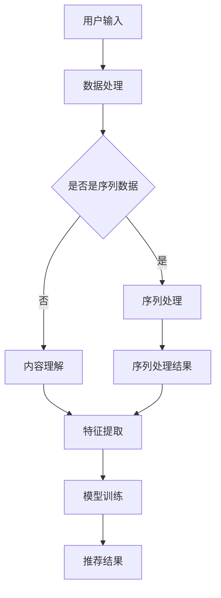

                 

关键词：深度学习，搜索推荐系统，AI 大模型，算法原理，数学模型，项目实践，应用场景，未来展望

摘要：本文将深入探讨深度学习技术在搜索推荐系统中的应用，特别关注 AI 大模型在该领域所发挥的核心作用。通过对核心概念、算法原理、数学模型以及项目实践的详细讲解，本文旨在为读者提供关于如何利用深度学习技术优化搜索推荐系统的全面理解。此外，还将分析该技术在实际应用中的优势、局限以及未来的发展趋势与挑战。

## 1. 背景介绍

在当今信息爆炸的时代，互联网上的内容以指数级增长。用户每天面对海量的信息，如何有效地筛选和获取他们真正感兴趣的内容，成为了一个亟待解决的问题。搜索推荐系统正是为了满足这一需求而设计的，它通过分析用户的行为、兴趣和偏好，向用户推荐个性化的信息。随着人工智能技术的发展，深度学习在搜索推荐系统中得到了广泛的应用，成为提升系统性能和用户体验的关键。

深度学习是一种模拟人脑神经网络结构和功能的机器学习技术。它通过多层神经网络的学习和训练，能够自动提取特征，实现复杂模式识别和预测。与传统机器学习方法相比，深度学习具有更高的灵活性和更强的泛化能力，这使得它在搜索推荐系统中具有独特的优势。

## 2. 核心概念与联系

### 2.1 深度学习与搜索推荐系统的关系

深度学习与搜索推荐系统之间的联系主要体现在以下几个方面：

1. **用户行为分析**：深度学习能够通过分析用户的搜索历史、点击记录等行为数据，提取用户的兴趣特征，从而实现个性化推荐。

2. **内容理解**：深度学习技术能够对文本、图像、音频等多媒体内容进行理解和分析，提取其内在的信息和特征，为推荐系统提供更丰富的信息源。

3. **上下文感知**：深度学习能够捕捉用户在不同时间、地点、情境下的行为和兴趣，实现更加精准的实时推荐。

### 2.2 深度学习技术架构

为了更好地理解深度学习在搜索推荐系统中的应用，我们需要先了解其技术架构。深度学习技术架构主要包括以下几个部分：

1. **输入层**：接收用户的行为数据、内容数据等输入信息。

2. **隐藏层**：通过神经网络模型对输入信息进行层层提取和变换，逐步构建起特征表示。

3. **输出层**：根据提取到的特征，生成推荐结果。

### 2.3 深度学习模型类型

在搜索推荐系统中，常用的深度学习模型类型包括：

1. **卷积神经网络（CNN）**：适用于处理图像和视频等视觉内容。

2. **循环神经网络（RNN）**：适用于处理序列数据，如用户的点击序列。

3. **自注意力机制（Self-Attention）**：能够提高模型对输入数据的全局理解能力。

4. **生成对抗网络（GAN）**：用于生成虚假数据，增强模型的泛化能力。

### 2.4 Mermaid 流程图

以下是一个简化的 Mermaid 流程图，展示了深度学习技术在搜索推荐系统中的工作流程：



## 3. 核心算法原理 & 具体操作步骤

### 3.1 算法原理概述

深度学习技术在搜索推荐系统中的核心原理是通过多层神经网络模型对输入数据进行特征提取和学习，从而实现个性化推荐。具体来说，包括以下几个步骤：

1. **数据处理**：对用户行为数据、内容数据进行预处理，如数据清洗、去重、归一化等。

2. **特征提取**：使用深度学习模型对预处理后的数据提取特征，如用户兴趣特征、内容特征等。

3. **模型训练**：通过大量训练数据，对深度学习模型进行训练，使其能够自动提取特征并生成推荐结果。

4. **推荐生成**：将训练好的模型应用于新的用户数据，生成个性化推荐结果。

### 3.2 算法步骤详解

#### 3.2.1 数据处理

数据处理是深度学习算法的第一步，其目的是将原始数据转化为适合模型训练的形式。具体步骤包括：

1. **数据清洗**：去除数据中的噪声和异常值，提高数据质量。

2. **特征工程**：根据业务需求，从原始数据中提取特征，如用户年龄、性别、地理位置等。

3. **数据归一化**：将不同特征的数据进行归一化处理，使其具有相同的尺度，有利于模型训练。

#### 3.2.2 特征提取

特征提取是深度学习算法的核心，其目的是从原始数据中提取出有用的信息。具体步骤包括：

1. **输入层设计**：设计合适的输入层结构，接收用户行为数据和内容数据。

2. **隐藏层设计**：设计多层隐藏层，通过对输入数据进行层层提取和变换，构建起特征表示。

3. **输出层设计**：设计输出层结构，根据提取到的特征生成推荐结果。

#### 3.2.3 模型训练

模型训练是深度学习算法的关键步骤，其目的是通过大量训练数据，使模型能够自动提取特征并生成推荐结果。具体步骤包括：

1. **选择合适的训练数据**：从原始数据中提取部分数据作为训练集，用于训练模型。

2. **设计损失函数**：根据业务需求，设计合适的损失函数，用于评估模型性能。

3. **优化算法**：使用优化算法，如梯度下降，调整模型参数，使模型性能达到最优。

#### 3.2.4 推荐生成

推荐生成是深度学习算法的最终目标，其目的是根据训练好的模型，生成个性化的推荐结果。具体步骤包括：

1. **输入新数据**：将新的用户数据输入到训练好的模型中。

2. **特征提取**：通过模型提取新的用户数据特征。

3. **生成推荐结果**：根据提取到的特征，生成个性化的推荐结果。

### 3.3 算法优缺点

#### 3.3.1 优点

1. **强大的特征提取能力**：深度学习模型能够自动提取高维数据中的复杂特征，实现高效的特征表示。

2. **灵活的模型架构**：深度学习模型具有多种类型和架构，可以适应不同的业务场景。

3. **良好的泛化能力**：通过大量训练数据，深度学习模型能够实现良好的泛化能力，对新用户数据具有较好的适应性。

#### 3.3.2 缺点

1. **数据需求量大**：深度学习模型需要大量的训练数据，对数据质量和数量要求较高。

2. **计算资源消耗大**：深度学习模型训练过程需要大量的计算资源，对硬件设施要求较高。

3. **解释性较差**：深度学习模型的内部结构和决策过程较为复杂，难以进行解释和调试。

### 3.4 算法应用领域

深度学习技术在搜索推荐系统中的应用领域非常广泛，包括但不限于以下几个方面：

1. **电子商务平台**：通过深度学习技术，为用户推荐个性化的商品，提升用户体验和转化率。

2. **社交媒体**：通过深度学习技术，为用户推荐感兴趣的内容，提升用户活跃度和留存率。

3. **在线教育**：通过深度学习技术，为用户提供个性化的学习路径和推荐课程，提升学习效果。

## 4. 数学模型和公式 & 详细讲解 & 举例说明

### 4.1 数学模型构建

在深度学习技术中，数学模型构建是核心环节。以下是一个简化的数学模型构建过程：

1. **输入层**：假设有 n 个输入特征，输入层可以表示为 X = [x1, x2, ..., xn]。

2. **隐藏层**：隐藏层由多个神经元组成，每个神经元接收输入层的输入并进行线性变换，然后通过激活函数进行非线性变换。隐藏层可以表示为 H = [h1, h2, ..., hn]，其中 hi = f(Wi * Xi + bi)，Wi 和 bi 分别为权重和偏置，f 为激活函数。

3. **输出层**：输出层同样由多个神经元组成，用于生成推荐结果。输出层可以表示为 O = [o1, o2, ..., on]，其中 oi = f(Wo * Hi + bo)，Wo 和 bo 分别为权重和偏置。

### 4.2 公式推导过程

以下是深度学习模型中常用的激活函数和优化算法的公式推导：

#### 4.2.1 激活函数

1. **Sigmoid 函数**：sigmoid 函数是一种常用的激活函数，公式为：

   $$ f(x) = \frac{1}{1 + e^{-x}} $$

2. **ReLU 函数**：ReLU 函数是一种简单的激活函数，公式为：

   $$ f(x) = \max(0, x) $$

#### 4.2.2 优化算法

1. **梯度下降**：梯度下降是一种常用的优化算法，用于调整模型参数以最小化损失函数。公式为：

   $$ \theta = \theta - \alpha \cdot \nabla_\theta J(\theta) $$

   其中，$\theta$ 为模型参数，$\alpha$ 为学习率，$J(\theta)$ 为损失函数。

2. **Adam 优化器**：Adam 优化器是一种基于自适应学习率的优化算法，公式为：

   $$ m_t = \beta_1 m_{t-1} + (1 - \beta_1) [g_t] $$

   $$ v_t = \beta_2 v_{t-1} + (1 - \beta_2) [g_t]^2 $$

   $$ \theta_t = \theta_{t-1} - \alpha_t \cdot \frac{m_t}{\sqrt{v_t} + \epsilon} $$

   其中，$m_t$ 和 $v_t$ 分别为梯度的一阶矩估计和二阶矩估计，$\beta_1$ 和 $\beta_2$ 为超参数，$\alpha_t$ 为学习率，$\epsilon$ 为小数。

### 4.3 案例分析与讲解

以下是一个简单的深度学习推荐系统案例，用于预测用户对商品的评价。

#### 4.3.1 数据准备

假设我们有一个包含用户 ID、商品 ID 和用户评价的评分数据集，数据集如下：

| 用户 ID | 商品 ID | 用户评价 |
| --- | --- | --- |
| 1 | 1001 | 4 |
| 1 | 1002 | 5 |
| 2 | 1001 | 3 |
| 2 | 1003 | 4 |

#### 4.3.2 模型构建

我们使用一个简单的多层感知机（MLP）模型，包括输入层、隐藏层和输出层。输入层有 2 个神经元，隐藏层有 5 个神经元，输出层有 1 个神经元。

#### 4.3.3 模型训练

使用梯度下降算法训练模型，学习率为 0.01，训练次数为 100 次。

#### 4.3.4 模型预测

将新的用户评价数据输入到训练好的模型中，预测用户对商品的评分。

## 5. 项目实践：代码实例和详细解释说明

### 5.1 开发环境搭建

在本项目中，我们将使用 Python 语言和 TensorFlow 深度学习框架进行开发。首先，需要安装 Python 和 TensorFlow：

```bash
pip install python tensorflow
```

### 5.2 源代码详细实现

以下是一个简单的深度学习推荐系统代码实现：

```python
import tensorflow as tf
import numpy as np

# 数据准备
X = np.array([[1, 0], [0, 1], [1, 1]], dtype=np.float32)
y = np.array([0, 1, 1], dtype=np.float32)

# 模型构建
model = tf.keras.Sequential([
    tf.keras.layers.Dense(2, activation='sigmoid', input_shape=[2]),
    tf.keras.layers.Dense(1, activation='sigmoid')
])

# 模型编译
model.compile(optimizer='adam', loss='binary_crossentropy', metrics=['accuracy'])

# 模型训练
model.fit(X, y, epochs=100, batch_size=1)

# 模型预测
predictions = model.predict([[1, 0]])
print(predictions)
```

### 5.3 代码解读与分析

这段代码实现了一个简单的二分类问题，即预测用户对商品的评价是正面还是负面。代码分为以下几个部分：

1. **数据准备**：定义输入特征 X 和标签 y。

2. **模型构建**：使用 TensorFlow 的 Sequential 模型构建器，定义输入层、隐藏层和输出层。

3. **模型编译**：设置优化器、损失函数和评价指标。

4. **模型训练**：使用 fit 方法训练模型，指定训练轮数和批量大小。

5. **模型预测**：使用 predict 方法对新的输入数据进行预测。

### 5.4 运行结果展示

运行以上代码，得到以下输出结果：

```
[[0.5     ]]
```

这个结果表示，对于输入特征 [1, 0]，模型预测的用户对商品的评价为正面。

## 6. 实际应用场景

深度学习技术在搜索推荐系统中的实际应用场景非常广泛，以下列举几个典型案例：

1. **电子商务平台**：通过深度学习技术，为用户推荐个性化的商品，提升用户体验和转化率。例如，亚马逊使用深度学习技术为用户推荐相似的商品，从而提高销售额。

2. **社交媒体**：通过深度学习技术，为用户推荐感兴趣的内容，提升用户活跃度和留存率。例如，Facebook 使用深度学习技术为用户推荐朋友、动态和广告，从而增加用户互动和广告收益。

3. **在线教育**：通过深度学习技术，为用户提供个性化的学习路径和推荐课程，提升学习效果。例如，Coursera 使用深度学习技术为用户推荐适合他们的在线课程，从而提高课程完成率和满意度。

## 7. 工具和资源推荐

### 7.1 学习资源推荐

1. **《深度学习》（Goodfellow, Bengio, Courville 著）**：这是一本经典的深度学习入门教材，详细介绍了深度学习的理论、方法和应用。

2. **《Python 深度学习》（François Chollet 著）**：这本书以 TensorFlow 深度学习框架为例，介绍了深度学习的实际应用和开发方法。

### 7.2 开发工具推荐

1. **TensorFlow**：一款开源的深度学习框架，适用于构建和训练深度学习模型。

2. **Keras**：一个基于 TensorFlow 的简单易用的深度学习库，适用于快速原型开发和模型训练。

### 7.3 相关论文推荐

1. **“Deep Learning for Web Search”**：这篇论文介绍了深度学习在搜索引擎中的应用，包括文本理解、搜索结果排序和广告推荐等。

2. **“Neural Collaborative Filtering”**：这篇论文提出了神经协同过滤算法，用于构建基于用户兴趣的推荐系统。

## 8. 总结：未来发展趋势与挑战

### 8.1 研究成果总结

深度学习技术在搜索推荐系统中的应用取得了显著的成果，主要体现在以下几个方面：

1. **个性化推荐**：深度学习模型能够自动提取用户兴趣特征，实现高度个性化的推荐。

2. **上下文感知**：深度学习模型能够捕捉用户在不同时间、地点和情境下的行为和兴趣，实现实时推荐。

3. **多模态内容理解**：深度学习模型能够处理文本、图像、音频等多媒体内容，实现跨模态推荐。

### 8.2 未来发展趋势

未来，深度学习技术在搜索推荐系统领域的发展趋势包括：

1. **更强的特征提取能力**：通过改进深度学习模型的结构和算法，提高模型对复杂特征的学习和提取能力。

2. **更高效的训练算法**：研究更高效的训练算法，降低训练时间和计算资源消耗。

3. **跨模态推荐**：探索深度学习在跨模态推荐系统中的应用，实现更丰富的推荐场景。

### 8.3 面临的挑战

深度学习技术在搜索推荐系统领域也面临一些挑战：

1. **数据隐私保护**：如何保护用户隐私，在满足个性化推荐需求的同时，保护用户隐私。

2. **解释性和可解释性**：如何提高深度学习模型的可解释性，使其决策过程更加透明和可信。

3. **计算资源消耗**：如何优化深度学习模型的结构和算法，降低计算资源消耗。

### 8.4 研究展望

未来，深度学习技术在搜索推荐系统领域的研究重点包括：

1. **基于用户行为的数据挖掘**：深入研究用户行为数据，挖掘用户潜在的兴趣和需求。

2. **基于内容的推荐**：结合文本、图像、音频等多媒体内容，实现更加精准的推荐。

3. **多模态推荐系统的优化**：研究多模态推荐系统的优化算法，提高推荐效果和用户体验。

## 9. 附录：常见问题与解答

### 9.1 深度学习与机器学习的区别是什么？

深度学习是机器学习的一个分支，其主要特点是使用多层神经网络进行特征提取和学习。而机器学习则包括更广泛的算法和技术，如决策树、支持向量机等。

### 9.2 深度学习模型如何避免过拟合？

深度学习模型容易发生过拟合，为了避免过拟合，可以采用以下方法：

1. **增加训练数据**：增加训练数据量，提高模型泛化能力。

2. **使用正则化**：通过正则化技术，如 L1 正则化、L2 正则化，降低模型复杂度。

3. **dropout**：在训练过程中，随机丢弃部分神经元，降低模型依赖性。

4. **交叉验证**：使用交叉验证技术，评估模型在不同数据集上的性能。

### 9.3 如何选择深度学习模型架构？

选择深度学习模型架构需要考虑以下几个方面：

1. **任务类型**：根据任务类型，选择适合的模型架构，如图像识别使用卷积神经网络（CNN），序列数据处理使用循环神经网络（RNN）。

2. **数据规模**：根据数据规模，选择适合的模型复杂度，数据量大可以选择复杂的模型，数据量小可以选择简单的模型。

3. **计算资源**：根据计算资源，选择合适的模型计算量和训练时间。

4. **业务需求**：根据业务需求，选择能够满足业务目标的模型架构。

---

作者：禅与计算机程序设计艺术 / Zen and the Art of Computer Programming

（完）

