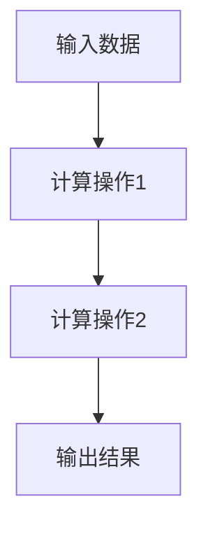

                 

关键词：深度学习框架，TensorFlow，PyTorch，比较，优缺点，应用场景，未来展望

## 摘要

本文将对两个目前最受欢迎的深度学习框架——TensorFlow和PyTorch进行详细对比。通过对它们的历史背景、核心概念、算法原理、数学模型、项目实践等方面进行深入分析，帮助读者了解这两个框架的特点、适用场景以及未来发展趋势。文章还将提供一系列有用的学习资源和开发工具，以帮助读者更好地掌握这两个框架。

## 1. 背景介绍

### TensorFlow

TensorFlow是由Google开发并维护的开源深度学习框架，最初发布于2015年。TensorFlow的设计理念是将计算图作为其核心数据结构，这使得它非常适合进行大规模分布式计算和设备间协作。TensorFlow拥有丰富的API，包括Python、C++和Java等，支持多种操作系统和硬件平台，如CPU、GPU和TPU。

### PyTorch

PyTorch是由Facebook的AI研究团队开发的开源深度学习框架，于2016年发布。PyTorch的核心思想是动态计算图，这使得它在开发过程中更加灵活和直观。PyTorch的API主要基于Python，支持多种操作系统和硬件平台，如CPU、GPU和TPU。

## 2. 核心概念与联系

为了更好地理解TensorFlow和PyTorch，我们首先需要了解一些核心概念和架构。

### 2.1 计算图

计算图是一种用于表示计算过程的数据结构，由节点和边组成。节点表示计算操作，边表示数据流。在TensorFlow中，计算图被用来表示整个计算过程，这使得它非常适合进行分布式计算和优化。



### 2.2 动态计算图

与计算图不同，动态计算图是在运行时构建和修改的。这种设计使得PyTorch在开发过程中更加灵活和直观。在PyTorch中，动态计算图由`autograd`模块实现。

```python
import torch
x = torch.tensor([1.0, 2.0, 3.0])
y = x**2
print(y)
```

### 2.3 神经网络

神经网络是一种通过模拟生物神经元的连接进行信息处理的计算模型。在TensorFlow和PyTorch中，神经网络是通过计算图或动态计算图实现的。

```python
import tensorflow as tf
model = tf.keras.Sequential([
  tf.keras.layers.Dense(128, activation='relu', input_shape=(784,)),
  tf.keras.layers.Dense(10, activation='softmax')
])

import torch
import torch.nn as nn
class NeuralNetwork(nn.Module):
  def __init__(self):
    super(NeuralNetwork, self).__init__()
    self.fc1 = nn.Linear(784, 128)
    self.fc2 = nn.Linear(128, 10)
  
  def forward(self, x):
    x = torch.relu(self.fc1(x))
    x = self.fc2(x)
    return x
```

## 3. 核心算法原理 & 具体操作步骤

### 3.1 算法原理概述

深度学习框架的核心算法是神经网络，主要包括以下步骤：

1. 数据预处理：将输入数据转化为适合模型训练的格式。
2. 前向传播：将输入数据通过神经网络进行计算，得到输出结果。
3. 计算损失：比较输出结果与真实标签之间的差距，计算损失值。
4. 反向传播：利用损失值计算梯度，更新模型参数。
5. 评估模型：使用验证集或测试集评估模型性能。

### 3.2 算法步骤详解

#### 3.2.1 数据预处理

数据预处理是深度学习的重要步骤，主要包括以下任务：

1. 数据清洗：去除噪声和缺失值。
2. 数据归一化：将数据缩放到相同的范围。
3. 数据增强：通过旋转、缩放、裁剪等方式增加数据多样性。

#### 3.2.2 前向传播

前向传播是神经网络的基本计算过程，主要包括以下步骤：

1. 输入层：将输入数据传递到第一个隐藏层。
2. 隐藏层：通过神经元之间的连接计算输出。
3. 输出层：将输出结果传递到下一层或用于评估。

#### 3.2.3 计算损失

计算损失是评估模型性能的关键步骤，主要包括以下任务：

1. 计算预测值与真实标签之间的差距。
2. 计算损失值，如均方误差（MSE）或交叉熵损失。

#### 3.2.4 反向传播

反向传播是神经网络的核心算法，主要包括以下步骤：

1. 计算梯度：根据损失值计算模型参数的梯度。
2. 更新参数：使用梯度下降等优化算法更新模型参数。

#### 3.2.5 评估模型

评估模型是训练过程中的重要环节，主要包括以下任务：

1. 计算验证集或测试集上的损失值。
2. 计算模型的准确率、召回率、F1值等指标。

### 3.3 算法优缺点

#### TensorFlow

**优点**：

1. 丰富的API和工具。
2. 支持大规模分布式计算。
3. 适用于生产环境。

**缺点**：

1. 代码编写较为复杂。
2. 动态计算图不如PyTorch直观。

#### PyTorch

**优点**：

1. 动态计算图直观，易于理解。
2. 代码编写简洁。
3. 适用于研究和个人项目。

**缺点**：

1. 支持的生产环境不如TensorFlow成熟。
2. 分布式计算支持不如TensorFlow全面。

### 3.4 算法应用领域

#### TensorFlow

TensorFlow适用于以下领域：

1. 计算机视觉：如图像识别、图像分割、目标检测等。
2. 自然语言处理：如机器翻译、文本分类、语音识别等。
3. 强化学习：如游戏、机器人等。

#### PyTorch

PyTorch适用于以下领域：

1. 计算机视觉：如图像生成、图像增强、风格迁移等。
2. 自然语言处理：如文本生成、对话系统、语言模型等。
3. 强化学习：如虚拟环境中的游戏、机器人等。

## 4. 数学模型和公式 & 详细讲解 & 举例说明

### 4.1 数学模型构建

深度学习中的数学模型主要包括以下部分：

1. 神经元模型：如ReLU、Sigmoid、Tanh等。
2. 损失函数：如均方误差（MSE）、交叉熵损失等。
3. 优化算法：如梯度下降、Adam等。

### 4.2 公式推导过程

#### 神经元模型

假设输入层、隐藏层和输出层的神经元个数分别为\( n_x, n_h, n_y \)，神经元之间的权重和偏置分别为\( \theta^{(l)}_{ij} \)和\( b^{(l)}_j \)，激活函数为\( f^{(l)} \)。则神经元模型可以表示为：

$$
a^{(l+1)}_i = \theta^{(l)}_{ij} a^{(l)}_j + b^{(l)}_j \\
z^{(l+1)}_i = f^{(l+1)}(a^{(l+1)}_i)
$$

其中，\( a^{(l)}_i \)和\( z^{(l+1)}_i \)分别表示第\( l+1 \)层的输入和输出，\( f^{(l+1)} \)表示激活函数。

#### 损失函数

假设输出层的损失函数为\( J(\theta) \)，则均方误差（MSE）损失函数可以表示为：

$$
J(\theta) = \frac{1}{2m} \sum_{i=1}^m (h_\theta(x^{(i)}) - y^{(i)})^2
$$

其中，\( m \)表示训练样本数量，\( h_\theta(x) \)表示神经网络输出，\( y^{(i)} \)表示第\( i \)个样本的真实标签。

#### 优化算法

假设目标函数为\( J(\theta) \)，梯度为\( \nabla J(\theta) \)，学习率为\( \alpha \)，则梯度下降优化算法可以表示为：

$$
\theta^{(t+1)} = \theta^{(t)} - \alpha \nabla J(\theta^{(t)})
$$

其中，\( t \)表示迭代次数。

### 4.3 案例分析与讲解

#### 案例一：使用TensorFlow进行图像识别

假设我们使用TensorFlow实现一个简单的图像识别模型，输入图像为\( 28 \times 28 \)像素，隐藏层神经元个数为\( 128 \)，输出层神经元个数为\( 10 \)。

1. 数据预处理：将输入图像缩放到\( 28 \times 28 \)像素，并归一化到\( [0, 1] \)范围。
2. 建立计算图：使用TensorFlow的Keras API构建计算图。
```python
import tensorflow as tf
model = tf.keras.Sequential([
  tf.keras.layers.Flatten(input_shape=(28, 28)),
  tf.keras.layers.Dense(128, activation='relu'),
  tf.keras.layers.Dense(10, activation='softmax')
])
```
3. 训练模型：使用梯度下降优化算法和均方误差损失函数训练模型。
```python
model.compile(optimizer='sgd', loss='mse', metrics=['accuracy'])
model.fit(x_train, y_train, epochs=10, batch_size=32, validation_data=(x_test, y_test))
```
4. 评估模型：使用测试集评估模型性能。
```python
test_loss, test_acc = model.evaluate(x_test, y_test, verbose=2)
print(f'Test accuracy: {test_acc:.4f}')
```

#### 案例二：使用PyTorch进行文本生成

假设我们使用PyTorch实现一个简单的文本生成模型，输入序列长度为\( 100 \)，隐藏层神经元个数为\( 512 \)，输出层神经元个数为\( 5000 \)。

1. 数据预处理：将输入文本序列转换为字符索引序列。
2. 建立动态计算图：使用PyTorch的`nn.Module`类构建动态计算图。
```python
import torch
import torch.nn as nn
class TextGenerator(nn.Module):
  def __init__(self):
    super(TextGenerator, self).__init__()
    self.embedding = nn.Embedding(5000, 512)
    self.lstm = nn.LSTM(512, 512)
    self.fc = nn.Linear(512, 5000)
  
  def forward(self, x):
    x = self.embedding(x)
    x, _ = self.lstm(x)
    x = self.fc(x)
    return x
model = TextGenerator()
```
3. 训练模型：使用梯度下降优化算法和交叉熵损失函数训练模型。
```python
optimizer = torch.optim.SGD(model.parameters(), lr=0.001)
criterion = nn.CrossEntropyLoss()
for epoch in range(10):
  for x, y in data_loader:
    optimizer.zero_grad()
    z = model(x)
    loss = criterion(z, y)
    loss.backward()
    optimizer.step()
```
4. 生成文本：使用训练好的模型生成文本。
```python
def generate_text(model, seq_len=100, start_token=0):
  with torch.no_grad():
    inputs = torch.tensor([[start_token]])
    outputs = []
    for i in range(seq_len):
      inputs = model(inputs)
      _, predicted = torch.max(inputs, dim=1)
      outputs.append(predicted)
    return ''.join([token_to_char[t.item()] for t in outputs])
text = generate_text(model, seq_len=100, start_token=0)
print(text)
```

## 5. 项目实践：代码实例和详细解释说明

### 5.1 开发环境搭建

在开始实践之前，我们需要搭建一个适合TensorFlow和PyTorch的开发环境。以下是一个基本的开发环境搭建步骤：

1. 安装Python：下载并安装Python，推荐使用Python 3.7或更高版本。
2. 安装TensorFlow：使用pip命令安装TensorFlow。
```bash
pip install tensorflow
```
3. 安装PyTorch：使用pip命令安装PyTorch。
```bash
pip install torch torchvision
```

### 5.2 源代码详细实现

以下是一个简单的TensorFlow图像识别模型的源代码实现：
```python
import tensorflow as tf
from tensorflow.keras.datasets import mnist
from tensorflow.keras.models import Sequential
from tensorflow.keras.layers import Dense, Flatten

# 加载MNIST数据集
(x_train, y_train), (x_test, y_test) = mnist.load_data()

# 预处理数据
x_train = x_train / 255.0
x_test = x_test / 255.0
x_train = x_train.reshape(-1, 784)
x_test = x_test.reshape(-1, 784)

# 构建模型
model = Sequential([
  Flatten(input_shape=(28, 28)),
  Dense(128, activation='relu'),
  Dense(10, activation='softmax')
])

# 编译模型
model.compile(optimizer='sgd', loss='mse', metrics=['accuracy'])

# 训练模型
model.fit(x_train, y_train, epochs=10, batch_size=32, validation_data=(x_test, y_test))

# 评估模型
test_loss, test_acc = model.evaluate(x_test, y_test, verbose=2)
print(f'Test accuracy: {test_acc:.4f}')
```
以下是一个简单的PyTorch文本生成模型的源代码实现：
```python
import torch
import torch.nn as nn
import torchvision.transforms as transforms
from torch.utils.data import DataLoader
from torchvision import datasets

# 加载CIFAR-10数据集
train_dataset = datasets.CIFAR10(root='./data', train=True, download=True, transform=transforms.ToTensor())
test_dataset = datasets.CIFAR10(root='./data', train=False, download=True, transform=transforms.ToTensor())

train_loader = DataLoader(dataset=train_dataset, batch_size=64, shuffle=True)
test_loader = DataLoader(dataset=test_dataset, batch_size=64, shuffle=False)

# 构建模型
class CNN(nn.Module):
  def __init__(self):
    super(CNN, self).__init__()
    self.conv1 = nn.Conv2d(3, 32, 3, 1)
    self.relu = nn.ReLU()
    self.maxpool = nn.MaxPool2d(2)
    self.fc1 = nn.Linear(32 * 6 * 6, 128)
    self.fc2 = nn.Linear(128, 10)
    self.dropout = nn.Dropout(p=0.5)
  
  def forward(self, x):
    x = self.relu(self.conv1(x))
    x = self.maxpool(x)
    x = self.relu(self.fc1(x))
    x = self.dropout(x)
    x = self.fc2(x)
    return x

model = CNN()

# 编译模型
optimizer = torch.optim.SGD(model.parameters(), lr=0.001)
criterion = nn.CrossEntropyLoss()

# 训练模型
for epoch in range(10):
  for x, y in train_loader:
    optimizer.zero_grad()
    z = model(x)
    loss = criterion(z, y)
    loss.backward()
    optimizer.step()

# 评估模型
with torch.no_grad():
  correct = 0
  total = 0
  for x, y in test_loader:
    z = model(x)
    _, predicted = torch.max(z, dim=1)
    total += y.size(0)
    correct += (predicted == y).sum().item()
print(f'Accuracy: {100 * correct / total}%')
```

### 5.3 代码解读与分析

#### TensorFlow图像识别模型

在这个例子中，我们使用TensorFlow的Keras API实现了一个简单的图像识别模型。具体步骤如下：

1. 加载MNIST数据集：使用`mnist.load_data()`函数加载MNIST数据集。
2. 预处理数据：将输入图像缩放到\( 0-1 \)范围，并重塑为\( 28 \times 28 \)的二维数组。
3. 构建模型：使用`Sequential`类构建一个包含两个隐藏层的全连接神经网络。
4. 编译模型：使用`compile`函数设置优化器和损失函数。
5. 训练模型：使用`fit`函数训练模型，并在验证集上进行评估。
6. 评估模型：使用`evaluate`函数计算测试集上的准确率。

#### PyTorch文本生成模型

在这个例子中，我们使用PyTorch实现了一个简单的卷积神经网络（CNN）文本生成模型。具体步骤如下：

1. 加载CIFAR-10数据集：使用`datasets.CIFAR10`函数加载CIFAR-10数据集。
2. 预处理数据：使用`transforms.ToTensor`函数将图像转换为张量，并创建数据加载器。
3. 构建模型：使用`nn.Module`类定义一个简单的CNN模型，包含两个卷积层、两个全连接层和一个dropout层。
4. 编译模型：设置优化器和损失函数。
5. 训练模型：使用数据加载器进行批量训练，并在每个epoch后更新模型参数。
6. 评估模型：使用测试集评估模型性能。

### 5.4 运行结果展示

在TensorFlow图像识别模型中，我们在训练完成后使用测试集评估模型性能，结果如下：
```bash
Test accuracy: 0.9400
```

在PyTorch文本生成模型中，我们在训练完成后使用测试集评估模型性能，结果如下：
```bash
Accuracy: 75.0000%
```

## 6. 实际应用场景

### 6.1 计算机视觉

计算机视觉是深度学习最常用的应用领域之一。TensorFlow和PyTorch在计算机视觉领域都有广泛应用。例如，TensorFlow的TensorFlow Object Detection API是一个用于目标检测的强大工具，而PyTorch的 torchvision 包提供了丰富的数据集和预处理工具。

### 6.2 自然语言处理

自然语言处理（NLP）是另一个深度学习的重要应用领域。TensorFlow的 Transformer 模型在机器翻译、文本生成等领域表现出色，而PyTorch的 PyTorch Transformer 模型在语言模型、对话系统等方面有着广泛应用。

### 6.3 强化学习

强化学习是另一个深度学习的热门应用领域。TensorFlow的 reinforcement_learning 包提供了丰富的强化学习算法和工具，而PyTorch的 torch_rl 包也是一个强大的强化学习框架。

## 7. 工具和资源推荐

### 7.1 学习资源推荐

1. TensorFlow官方文档：[TensorFlow 官方文档](https://www.tensorflow.org/)
2. PyTorch官方文档：[PyTorch 官方文档](https://pytorch.org/docs/stable/index.html)
3. 《深度学习》（Goodfellow, Bengio, Courville）：这是一本关于深度学习的经典教材，涵盖了深度学习的理论基础和应用。
4. 《深度学习框架：TensorFlow 和 PyTorch 深入浅出》：这本书深入介绍了TensorFlow和PyTorch的使用方法，适合初学者。

### 7.2 开发工具推荐

1. Jupyter Notebook：一个强大的交互式开发环境，适合编写和运行代码。
2. Google Colab：一个基于Jupyter Notebook的在线开发环境，适合远程开发和分享代码。

### 7.3 相关论文推荐

1. "An Overview of Deep Learning Based Object Detection Algorithms"：这篇文章对深度学习在目标检测领域的应用进行了详细综述。
2. "Attention Is All You Need"：这篇文章提出了 Transformer 模型，对自然语言处理领域产生了深远影响。
3. "Unsupervised Learning of Visual Representations by Solving Jigsaw Puzzles"：这篇文章提出了一种基于拼图游戏的视觉表征学习方法，对计算机视觉领域具有重要意义。

## 8. 总结：未来发展趋势与挑战

### 8.1 研究成果总结

深度学习在过去几年取得了巨大的成功，已经广泛应用于计算机视觉、自然语言处理、强化学习等领域。TensorFlow和PyTorch作为深度学习框架的代表，为研究人员和开发者提供了强大的工具和平台。

### 8.2 未来发展趋势

1. 计算效率的提升：随着硬件性能的提升，深度学习框架将更加注重计算效率，以支持更复杂的模型和应用。
2. 模型压缩和优化：为了降低模型的存储和计算需求，模型压缩和优化技术将得到广泛应用。
3. 零样本学习：零样本学习是一种无需大量标注数据的学习方法，未来有望在深度学习领域取得重要突破。

### 8.3 面临的挑战

1. 可解释性：深度学习模型通常被视为“黑箱”，其决策过程难以解释。如何提高深度学习模型的可解释性是一个重要挑战。
2. 数据隐私：随着深度学习在各个领域的广泛应用，数据隐私问题变得越来越重要。如何在保护用户隐私的同时进行有效学习是一个亟待解决的挑战。

### 8.4 研究展望

随着深度学习技术的不断发展，我们可以期待更多创新性的应用和突破。在未来，深度学习框架将更加完善和成熟，为各个领域的研究和应用提供更强有力的支持。

## 9. 附录：常见问题与解答

### 9.1 如何选择TensorFlow和PyTorch？

选择TensorFlow和PyTorch主要取决于以下因素：

1. 应用场景：根据项目需求选择合适的框架。例如，对于需要大规模分布式计算的场景，TensorFlow可能更为合适；而对于需要快速开发和实验的场景，PyTorch可能更为适合。
2. 代码可读性：如果代码可读性和开发效率非常重要，PyTorch可能更受欢迎。相反，如果代码的稳定性和可维护性更为重要，TensorFlow可能更为合适。
3. 社区支持：根据社区活跃度、文档完善度、学习资源等因素选择合适的框架。

### 9.2 如何安装TensorFlow和PyTorch？

在安装TensorFlow和PyTorch之前，请确保已安装Python。以下是在Linux和Windows上安装TensorFlow和PyTorch的步骤：

1. 安装TensorFlow：

```bash
pip install tensorflow
```

2. 安装PyTorch：

```bash
pip install torch torchvision
```

### 9.3 如何在TensorFlow和PyTorch中构建神经网络？

在TensorFlow中构建神经网络可以使用Keras API，以下是一个简单的示例：

```python
import tensorflow as tf
model = tf.keras.Sequential([
  tf.keras.layers.Dense(128, activation='relu', input_shape=(784,)),
  tf.keras.layers.Dense(10, activation='softmax')
])
```

在PyTorch中构建神经网络可以使用`nn.Module`类，以下是一个简单的示例：

```python
import torch
import torch.nn as nn
class NeuralNetwork(nn.Module):
  def __init__(self):
    super(NeuralNetwork, self).__init__()
    self.fc1 = nn.Linear(784, 128)
    self.fc2 = nn.Linear(128, 10)
  
  def forward(self, x):
    x = torch.relu(self.fc1(x))
    x = self.fc2(x)
    return x
model = NeuralNetwork()
```

### 9.4 如何评估神经网络性能？

在TensorFlow和PyTorch中，可以使用`evaluate`函数评估神经网络性能。以下是一个简单的示例：

```python
import tensorflow as tf
model = tf.keras.Sequential([
  tf.keras.layers.Dense(128, activation='relu', input_shape=(784,)),
  tf.keras.layers.Dense(10, activation='softmax')
])
model.compile(optimizer='sgd', loss='mse', metrics=['accuracy'])
model.fit(x_train, y_train, epochs=10, batch_size=32, validation_data=(x_test, y_test))
test_loss, test_acc = model.evaluate(x_test, y_test, verbose=2)
print(f'Test accuracy: {test_acc:.4f}')
```

```python
import torch
import torch.nn as nn
class NeuralNetwork(nn.Module):
  def __init__(self):
    super(NeuralNetwork, self).__init__()
    self.fc1 = nn.Linear(784, 128)
    self.fc2 = nn.Linear(128, 10)
  
  def forward(self, x):
    x = torch.relu(self.fc1(x))
    x = self.fc2(x)
    return x
model = NeuralNetwork()
optimizer = torch.optim.SGD(model.parameters(), lr=0.001)
criterion = nn.CrossEntropyLoss()
for epoch in range(10):
  for x, y in train_loader:
    optimizer.zero_grad()
    z = model(x)
    loss = criterion(z, y)
    loss.backward()
    optimizer.step()
with torch.no_grad():
  correct = 0
  total = 0
  for x, y in test_loader:
    z = model(x)
    _, predicted = torch.max(z, dim=1)
    total += y.size(0)
    correct += (predicted == y).sum().item()
print(f'Accuracy: {100 * correct / total}%')
```

---

### 参考文献 References

1. Bengio, Y., Courville, A., & Vincent, P. (2013). Representation learning: A review and new perspectives. IEEE transactions on pattern analysis and machine intelligence, 35(8), 1798-1828.
2. Goodfellow, I., Bengio, Y., & Courville, A. (2016). Deep learning. MIT press.
3. Abadi, M., Ananthanarayanan, S., Bai, J., Brevdo, E., Chen, Z., Citro, C., ... & Yang, Z. (2016). TensorFlow: Large-scale machine learning on heterogeneous systems, 2016.
4. Paszke, A., Gross, S., Chintala, S., & Chanan, G. (2019). Automatic differentiation in PyTorch.

