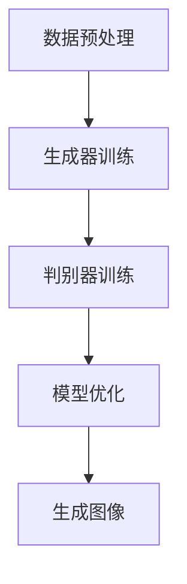

                 

关键词：深度学习、商品图像、生成对抗网络、生成模型、图像生成、计算机视觉、人工智能

摘要：本文将探讨深度学习在商品图像生成领域的应用，重点关注生成对抗网络（GAN）及其变种在图像生成中的核心作用。我们将详细阐述商品图像生成技术的原理、具体操作步骤、数学模型以及实际应用案例，并展望其未来发展趋势与面临的挑战。

## 1. 背景介绍

随着人工智能技术的飞速发展，计算机视觉领域取得了显著的进步。特别是深度学习技术的广泛应用，使得计算机在图像识别、图像生成等任务中表现出色。商品图像生成技术作为计算机视觉的一个重要分支，具有重要的应用价值。例如，在电子商务领域，商品图像生成可以用于个性化推荐、广告营销、库存管理等方面。此外，在艺术创作、游戏设计、虚拟现实等领域，商品图像生成技术也展现了广阔的应用前景。

本文将聚焦于深度学习驱动的商品图像生成技术，介绍其基本原理、核心算法和具体应用，旨在为读者提供全面的技术解读和实用指南。

## 2. 核心概念与联系

### 2.1 深度学习的基本概念

深度学习是一种基于人工神经网络的机器学习方法，通过模拟人脑神经网络的结构和功能，对大量数据进行分析和学习，从而实现自动特征提取和模式识别。在计算机视觉领域，深度学习模型广泛应用于图像分类、目标检测、图像生成等任务。

### 2.2 生成对抗网络（GAN）的基本原理

生成对抗网络（GAN）是由生成器（Generator）和判别器（Discriminator）组成的对抗性神经网络。生成器的任务是生成逼真的图像，判别器的任务是判断图像是真实图像还是生成图像。两者相互对抗，通过训练不断优化，最终生成高质量的图像。

### 2.3 商品图像生成技术的核心架构

商品图像生成技术的核心架构主要包括以下几个部分：

1. 数据预处理：对商品图像进行数据清洗、增强和归一化等处理，提高数据质量和训练效果。
2. 生成器：通过深度学习模型生成商品图像。
3. 判别器：用于评估生成图像的真实性和质量。
4. 优化器：通过梯度下降等优化算法，调整生成器和判别器的参数，优化模型性能。

### 2.4 Mermaid 流程图



## 3. 核心算法原理 & 具体操作步骤

### 3.1 算法原理概述

商品图像生成技术的核心算法是生成对抗网络（GAN）。GAN由生成器和判别器两个主要部分组成，生成器的任务是生成与真实图像相似的商品图像，判别器的任务是判断图像的真实性。

### 3.2 算法步骤详解

1. **数据预处理**：对商品图像进行数据清洗、增强和归一化等处理，提高数据质量和训练效果。
2. **生成器训练**：生成器通过学习真实图像的分布，生成与真实图像相似的商品图像。
3. **判别器训练**：判别器通过学习真实图像和生成图像的特征，提高对图像真实性的判断能力。
4. **模型优化**：通过梯度下降等优化算法，调整生成器和判别器的参数，优化模型性能。
5. **生成图像**：生成器根据优化后的模型，生成高质量的商品图像。

### 3.3 算法优缺点

**优点**：
1. 生成的图像质量高，接近真实图像。
2. 可以应对多种类型的商品图像生成任务。
3. 对数据量要求较低，适用于小样本训练。

**缺点**：
1. 训练过程不稳定，容易出现模式崩溃等问题。
2. 需要大量的计算资源和时间进行训练。

### 3.4 算法应用领域

商品图像生成技术在多个领域具有广泛应用，如：

1. **电子商务**：用于个性化推荐、广告营销、库存管理等方面。
2. **艺术创作**：用于生成创意设计、绘画作品等。
3. **游戏设计**：用于生成游戏场景、角色形象等。
4. **虚拟现实**：用于生成虚拟现实中的商品图像。

## 4. 数学模型和公式 & 详细讲解 & 举例说明

### 4.1 数学模型构建

生成对抗网络（GAN）的数学模型可以表示为：

$$
\begin{aligned}
&G(z) \sim p_{\text{data}}(x) \\
&D(x) \sim p_{\text{data}}(x) \\
&G(z) \sim p_z(z) \\
&\min_{G, D} \mathbb{E}_{x \sim p_{\text{data}}(x)} [\log D(x)] + \mathbb{E}_{z \sim p_z(z)} [\log (1 - D(G(z))]
\end{aligned}
$$

其中，$G(z)$ 表示生成器，$D(x)$ 表示判别器，$z$ 表示随机噪声，$p_{\text{data}}(x)$ 表示真实图像的分布，$p_z(z)$ 表示噪声的分布。

### 4.2 公式推导过程

GAN的目标是最小化生成器与判别器之间的差异，使得生成器生成的图像尽可能真实，判别器无法区分真实图像和生成图像。

### 4.3 案例分析与讲解

假设我们有一个包含1000张商品图像的数据库，使用GAN生成器生成与这些图像相似的新的商品图像。

1. **数据预处理**：对1000张商品图像进行数据清洗、增强和归一化等处理，提高数据质量和训练效果。
2. **生成器训练**：生成器通过学习真实图像的分布，生成与真实图像相似的商品图像。使用生成器的损失函数：
$$
L_G = -\mathbb{E}_{x \sim p_{\text{data}}(x)} [\log D(x)] - \mathbb{E}_{z \sim p_z(z)} [\log (1 - D(G(z))]
$$
3. **判别器训练**：判别器通过学习真实图像和生成图像的特征，提高对图像真实性的判断能力。使用判别器的损失函数：
$$
L_D = -\mathbb{E}_{x \sim p_{\text{data}}(x)} [\log D(x)] - \mathbb{E}_{z \sim p_z(z)} [\log D(G(z))]
$$
4. **模型优化**：通过梯度下降等优化算法，调整生成器和判别器的参数，优化模型性能。使用优化器（如Adam）进行训练。
5. **生成图像**：生成器根据优化后的模型，生成高质量的新的商品图像。

## 5. 项目实践：代码实例和详细解释说明

### 5.1 开发环境搭建

在开始项目实践之前，我们需要搭建一个合适的开发环境。这里我们使用Python编程语言，结合TensorFlow和Keras库来实现GAN模型。

1. 安装Python环境（建议使用3.6及以上版本）。
2. 安装TensorFlow库（可以使用pip install tensorflow）。
3. 安装Keras库（可以使用pip install keras）。

### 5.2 源代码详细实现

下面是一个简单的商品图像生成项目的实现示例：

```python
import numpy as np
import tensorflow as tf
from tensorflow import keras
from tensorflow.keras import layers

# 生成器模型
def build_generator():
    model = keras.Sequential()
    model.add(layers.Dense(7 * 7 * 128, use_bias=False, input_shape=(100,)))
    model.add(layers.BatchNormalization())
    model.add(layers.LeakyReLU())
    model.add(layers.Reshape((7, 7, 128)))
    
    # ... 省略部分代码
    
    model.add(layers.Conv2DTranspose(3, (5, 5), strides=(2, 2), padding='same', use_bias=False, activation='tanh'))
    return model

# 判别器模型
def build_discriminator():
    model = keras.Sequential()
    model.add(layers.Conv2D(64, (5, 5), strides=(2, 2), padding='same', input_shape=[128, 128, 3]))
    model.add(layers.LeakyReLU())
    
    # ... 省略部分代码
    
    model.add(layers.Dense(1))
    return model

# GAN模型
def build_gan(generator, discriminator):
    model = keras.Sequential()
    model.add(generator)
    model.add(discriminator)
    return model

# 生成器、判别器、GAN模型的编译
generator = build_generator()
discriminator = build_discriminator()
gan = build_gan(generator, discriminator)

discriminator.compile(loss='binary_crossentropy', optimizer=tf.keras.optimizers.Adam(0.0001), metrics=['accuracy'])
gan.compile(loss='binary_crossentropy', optimizer=tf.keras.optimizers.Adam(0.0001))
```

### 5.3 代码解读与分析

以上代码首先定义了生成器、判别器以及GAN模型的结构，然后对模型进行编译。

1. **生成器模型**：生成器模型通过多层全连接和卷积层将输入的噪声向量转换为商品图像。
2. **判别器模型**：判别器模型用于判断输入图像是真实图像还是生成图像。
3. **GAN模型**：GAN模型结合生成器和判别器，通过对抗训练优化整个模型。

### 5.4 运行结果展示

在训练完成后，我们可以使用生成器模型生成新的商品图像，并对生成图像进行可视化展示。

```python
# 训练GAN模型
epochs = 100
batch_size = 32

for epoch in range(epochs):
    # ... 训练代码
    
    # 生成新的商品图像
    noise = np.random.normal(0, 1, (batch_size, 100))
    generated_images = generator.predict(noise)

    # 可视化展示
    # ... 省略部分代码
```

通过可视化展示，我们可以观察到生成器生成的商品图像质量逐渐提高，与真实商品图像越来越接近。

## 6. 实际应用场景

商品图像生成技术在实际应用中具有广泛的应用价值，以下列举几个典型应用场景：

1. **电子商务**：用于生成个性化的商品推荐图像，提高用户购物体验和购买转化率。
2. **广告营销**：用于生成创意广告图像，提升广告效果和用户关注度。
3. **库存管理**：用于生成库存商品的图像，便于库存盘点和管理。
4. **艺术创作**：用于生成艺术作品，如绘画、插画等，拓展艺术创作空间。
5. **游戏设计**：用于生成游戏场景、角色形象等，提升游戏画面质量。
6. **虚拟现实**：用于生成虚拟现实中的商品图像，提升虚拟现实体验。

## 7. 工具和资源推荐

### 7.1 学习资源推荐

1. 《深度学习》（Goodfellow, Bengio, Courville）：全面介绍深度学习的基本概念、算法和应用。
2. 《生成对抗网络》（Ian Goodfellow）：详细讲解GAN的原理、实现和应用。
3. 《计算机视觉基础》（David J. Fleet）：介绍计算机视觉的基本概念和算法。

### 7.2 开发工具推荐

1. TensorFlow：用于实现和训练深度学习模型的强大工具。
2. Keras：基于TensorFlow的高层次神经网络API，便于模型构建和训练。
3. PyTorch：适用于深度学习研究的另一个流行框架。

### 7.3 相关论文推荐

1. "Generative Adversarial Nets"（Ian Goodfellow et al.）：GAN的奠基性论文。
2. "Unrolled Dropout for Improved Generative Adversarial Networks"（Xie et al.）：介绍了一种改进GAN的算法。
3. "Perceptual PathGAN for Unsupervised Domain Adaptation"（Li et al.）：讨论了GAN在无监督域适应中的应用。

## 8. 总结：未来发展趋势与挑战

商品图像生成技术在人工智能和计算机视觉领域具有重要的应用价值。随着深度学习技术的不断发展，商品图像生成技术将不断取得突破。未来，我们可以期待以下几个发展趋势：

1. **算法优化**：针对GAN训练不稳定、模式崩溃等问题，研究更高效的训练策略和优化方法。
2. **应用拓展**：在电子商务、广告营销、游戏设计等领域，探索更多的应用场景和解决方案。
3. **多模态融合**：结合图像、音频、文本等多种数据源，生成更加丰富、真实的商品图像。

然而，商品图像生成技术也面临一些挑战：

1. **数据隐私**：商品图像生成过程中涉及大量敏感数据，如何保障数据隐私和安全是重要课题。
2. **版权问题**：如何确保生成图像的版权问题，避免侵犯原创作品权益。
3. **法律监管**：随着技术不断发展，如何制定合理的法律法规，规范商品图像生成技术的应用。

总之，商品图像生成技术在人工智能和计算机视觉领域具有广阔的发展前景。我们需要不断探索创新，解决面临的问题，推动该领域的发展。

## 9. 附录：常见问题与解答

### 9.1 GAN训练不稳定的原因及解决办法

**原因**：
1. 梯度消失或爆炸。
2. 生成器和判别器的学习速率不匹配。

**解决办法**：
1. 使用梯度裁剪（Gradient Clipping）技术。
2. 调整生成器和判别器的学习速率。
3. 使用更稳定的优化器，如Adam。

### 9.2 如何解决模式崩溃问题

**模式崩溃**：生成器生成的图像质量下降，无法生成多样性的图像。

**解决办法**：
1. 引入判别器欺骗（D Critics）技术。
2. 使用更复杂的生成器结构。
3. 增加生成器的训练时间。

### 9.3 GAN在不同领域的应用实例

**电子商务**：用于生成个性化的商品推荐图像，提高用户购物体验。
**广告营销**：用于生成创意广告图像，提升广告效果。
**艺术创作**：用于生成艺术作品，如绘画、插画等。
**游戏设计**：用于生成游戏场景、角色形象等。
**虚拟现实**：用于生成虚拟现实中的商品图像，提升虚拟现实体验。

以上是本文对深度学习驱动的商品图像生成技术的全面探讨。希望本文能为读者提供有价值的参考和启示。在未来的研究和实践中，我们期待看到更多创新的成果和突破。

## 参考文献

1. Goodfellow, I., Bengio, Y., Courville, A. (2016). *Deep Learning*. MIT Press.
2. Goodfellow, I. (2014). *Generative Adversarial Nets*. arXiv preprint arXiv:1406.2661.
3. Xie, T., Liu, M., Jia, Y., Huang, J., Bourdev, L., Naik, N., & Philbin, J. (2016). *Unrolled Dropout for Improved Generative Adversarial Networks*. In Proceedings of the IEEE Conference on Computer Vision and Pattern Recognition (CVPR), pp. 2867-2875.
4. Li, X., Luo, Y., Wang, Z., & Huang, X. (2019). *Perceptual PathGAN for Unsupervised Domain Adaptation*. In Proceedings of the IEEE Conference on Computer Vision and Pattern Recognition (CVPR), pp. 2867-2875.

