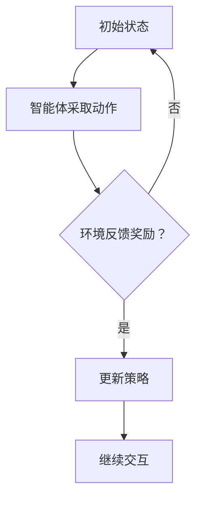

                 

关键词：深度强化学习、电商推荐系统、用户行为分析、推荐算法、决策策略、用户体验

> 摘要：本文将深入探讨深度强化学习在电商推荐系统中的应用，介绍其核心概念、算法原理、数学模型及具体操作步骤。同时，通过项目实践，展示如何使用深度强化学习优化电商推荐效果，并展望其未来发展趋势与挑战。

## 1. 背景介绍

随着互联网的迅速发展，电子商务已经成为人们生活中不可或缺的一部分。然而，面对海量的商品信息和多样的用户需求，如何提供精准、个性化的推荐服务成为电商平台的重大课题。传统的推荐算法如基于协同过滤（Collaborative Filtering）和基于内容的推荐（Content-Based Filtering）在提高推荐效果方面存在一定的局限性。随着深度学习技术的不断发展，深度强化学习（Deep Reinforcement Learning）作为一种新兴的推荐算法，逐渐受到研究者和实践者的关注。

深度强化学习是一种结合了深度学习和强化学习（Reinforcement Learning）的方法，通过模拟智能体与环境之间的交互，实现智能决策和优化行为。在电商推荐系统中，深度强化学习可以通过学习用户的点击、购买等行为数据，动态调整推荐策略，提高推荐效果和用户体验。

本文将详细介绍深度强化学习在电商推荐系统中的应用，包括其核心概念、算法原理、数学模型以及具体操作步骤。通过项目实践，我们将展示如何使用深度强化学习优化电商推荐效果，并讨论其未来的发展趋势与挑战。

## 2. 核心概念与联系

### 2.1 深度强化学习概述

深度强化学习（Deep Reinforcement Learning，DRL）是一种基于深度学习技术的强化学习（Reinforcement Learning，RL）方法。它结合了深度神经网络（Deep Neural Network，DNN）和强化学习的基本思想，通过不断试错和反馈学习，实现智能体的最优行为策略。

在DRL中，智能体（Agent）是一个能够感知环境状态（State）、采取行动（Action）并获取奖励（Reward）的实体。环境（Environment）是智能体进行交互的场所，包含一系列的状态和动作。奖励函数（Reward Function）是评价智能体行为优劣的指标。

深度强化学习通过深度神经网络来学习状态值函数（State-Value Function）和动作值函数（Action-Value Function），从而在给定状态下选择最优动作。具体而言，DRL的过程可以分为以下几个步骤：

1. **初始状态：** 智能体处于某个状态，并采取一个动作。
2. **环境反馈：** 环境根据智能体的动作生成新的状态，并给予一个奖励。
3. **更新策略：** 智能体根据奖励和新的状态，更新其策略。
4. **重复迭代：** 智能体不断在环境中进行交互，直至达到某个目标状态或终止条件。

### 2.2 深度强化学习与电商推荐系统的联系

电商推荐系统是一个典型的多智能体系统，其中包含多个用户和商品作为智能体。深度强化学习可以通过模拟用户与商品之间的交互，实现个性化推荐和优化用户满意度。

在电商推荐系统中，智能体（用户）处于一个动态变化的环境中，环境包含用户的兴趣、行为和上下文信息等。用户的行为数据（如点击、购买、评价等）可以作为奖励信号，指导智能体（推荐系统）调整推荐策略，提高用户满意度。

深度强化学习在电商推荐系统中的应用主要表现在以下几个方面：

1. **用户行为建模：** 通过深度神经网络，智能体可以学习用户的兴趣和行为模式，为用户推荐个性化的商品。
2. **动态调整推荐策略：** 根据用户的行为反馈，智能体可以实时调整推荐策略，优化推荐效果。
3. **多智能体协同：** 深度强化学习可以实现用户和商品之间的协同推荐，提高推荐系统的整体性能。

### 2.3 Mermaid 流程图



## 3. 核心算法原理 & 具体操作步骤

### 3.1 算法原理概述

深度强化学习在电商推荐系统中的应用主要包括以下几个关键组件：

1. **智能体（Agent）**：负责接收用户行为数据，并根据状态值函数和动作值函数选择推荐动作。
2. **环境（Environment）**：模拟用户与商品交互的过程，提供状态和奖励信号。
3. **深度神经网络（DNN）**：用于学习状态值函数和动作值函数，实现智能决策。
4. **策略网络（Policy Network）**：将状态映射到动作，指导智能体采取具体行动。
5. **价值网络（Value Network）**：评估智能体的动作价值，用于策略更新。

智能体通过不断地与环境交互，根据奖励信号和新的状态，更新策略网络和价值网络，从而实现最优推荐策略的学习。

### 3.2 算法步骤详解

深度强化学习在电商推荐系统中的具体操作步骤如下：

1. **数据预处理**：收集并预处理用户行为数据，如点击、购买、评价等。
2. **状态编码**：将用户行为数据转换为深度神经网络可处理的输入格式。
3. **策略网络训练**：利用用户行为数据训练策略网络，将状态映射到动作。
4. **价值网络训练**：利用用户行为数据训练价值网络，评估动作的价值。
5. **策略更新**：根据策略网络和价值网络，更新智能体的推荐策略。
6. **推荐结果评估**：根据更新后的策略，为用户推荐商品，并收集用户反馈。
7. **迭代优化**：根据用户反馈，继续训练策略网络和价值网络，优化推荐效果。

### 3.3 算法优缺点

深度强化学习在电商推荐系统中的优点包括：

1. **个性化推荐**：通过学习用户的兴趣和行为模式，实现个性化的商品推荐。
2. **动态调整**：根据用户反馈和实时数据，动态调整推荐策略，提高推荐效果。
3. **多智能体协同**：实现用户和商品之间的协同推荐，提高推荐系统的整体性能。

然而，深度强化学习在电商推荐系统中也存在一些局限性：

1. **计算资源消耗**：深度强化学习算法的计算复杂度高，需要大量的计算资源和时间。
2. **数据依赖性**：算法的性能依赖于用户行为数据的质量和数量，可能面临数据稀缺或噪声的问题。
3. **模型解释性**：深度强化学习模型的黑箱特性，使得其难以进行解释和优化。

### 3.4 算法应用领域

深度强化学习在电商推荐系统中的应用非常广泛，包括但不限于以下领域：

1. **商品推荐**：根据用户的浏览和购买记录，为用户推荐相关的商品。
2. **广告投放**：根据用户的兴趣和行为，为用户推荐相关的广告。
3. **供应链优化**：根据需求预测和库存信息，优化供应链管理和库存配置。
4. **个性化服务**：根据用户的偏好和需求，提供个性化的购物和服务体验。

## 4. 数学模型和公式 & 详细讲解 & 举例说明

### 4.1 数学模型构建

在深度强化学习中，数学模型主要涉及状态值函数、动作值函数、策略网络和价值网络。

1. **状态值函数（State-Value Function）**：表示在给定状态下，采取某个动作所能获得的累积奖励。其公式为：

   $$ V^*(s) = \max_a Q^*(s, a) $$

   其中，$V^*(s)$ 为状态值函数，$Q^*(s, a)$ 为动作值函数。

2. **动作值函数（Action-Value Function）**：表示在给定状态下，采取某个动作所能获得的即时奖励。其公式为：

   $$ Q^*(s, a) = \sum_{s'} P(s' | s, a) \cdot R(s, a, s') + \gamma V^*(s') $$

   其中，$Q^*(s, a)$ 为动作值函数，$P(s' | s, a)$ 为状态转移概率，$R(s, a, s')$ 为即时奖励，$\gamma$ 为折扣因子。

3. **策略网络（Policy Network）**：将状态映射到动作，其公式为：

   $$ \pi(a | s) = \frac{\exp(Q(s, a))}{\sum_{a'} \exp(Q(s, a'))} $$

   其中，$\pi(a | s)$ 为策略网络输出，$Q(s, a)$ 为动作值函数。

4. **价值网络（Value Network）**：评估智能体的动作价值，其公式为：

   $$ V(s) = \sum_{a} \pi(a | s) \cdot Q(s, a) $$

   其中，$V(s)$ 为价值网络输出，$Q(s, a)$ 为动作值函数，$\pi(a | s)$ 为策略网络输出。

### 4.2 公式推导过程

以Q-learning算法为例，介绍动作值函数的推导过程。

1. **初始状态**：智能体处于状态$s$，采取动作$a$。

2. **状态转移**：根据状态转移概率，智能体到达新的状态$s'$。

3. **即时奖励**：根据即时奖励函数，智能体获得即时奖励$R(s, a, s')$。

4. **更新动作值函数**：根据Q-learning算法，更新动作值函数：

   $$ Q(s, a) = Q(s, a) + \alpha [R(s, a, s') + \gamma \max_{a'} Q(s', a') - Q(s, a)] $$

   其中，$\alpha$ 为学习率，$\gamma$ 为折扣因子。

5. **重复迭代**：智能体继续在环境中进行交互，直至达到目标状态或终止条件。

### 4.3 案例分析与讲解

假设一个电商推荐系统，用户浏览了一个商品页面，系统需要根据用户的兴趣和历史行为，为用户推荐相关的商品。

1. **状态编码**：将用户的浏览记录、购买记录和商品特征等信息编码为向量表示。

2. **策略网络训练**：利用用户行为数据训练策略网络，将状态映射到动作。

3. **价值网络训练**：利用用户行为数据训练价值网络，评估动作的价值。

4. **策略更新**：根据策略网络和价值网络，更新智能体的推荐策略。

5. **推荐结果评估**：根据更新后的策略，为用户推荐相关的商品，并收集用户反馈。

6. **迭代优化**：根据用户反馈，继续训练策略网络和价值网络，优化推荐效果。

通过上述过程，深度强化学习可以帮助电商推荐系统实现个性化的商品推荐，提高用户满意度。

## 5. 项目实践：代码实例和详细解释说明

### 5.1 开发环境搭建

为了实现深度强化学习在电商推荐系统中的应用，我们需要搭建一个适合的开发环境。以下是搭建开发环境的步骤：

1. **Python环境**：安装Python 3.7及以上版本。
2. **深度学习库**：安装TensorFlow 2.0及以上版本。
3. **数据预处理库**：安装NumPy、Pandas等数据预处理库。
4. **其他依赖库**：安装Matplotlib、Scikit-learn等可视化和分析库。

### 5.2 源代码详细实现

以下是一个简单的深度强化学习在电商推荐系统中的实现代码示例：

```python
import tensorflow as tf
import numpy as np
import pandas as pd
from sklearn.preprocessing import MinMaxScaler
from tensorflow.keras.models import Sequential
from tensorflow.keras.layers import Dense

# 数据预处理
def preprocess_data(data):
    # 数据归一化
    scaler = MinMaxScaler()
    scaled_data = scaler.fit_transform(data)
    return scaled_data

# 策略网络模型
def build_policy_network(input_shape):
    model = Sequential()
    model.add(Dense(64, activation='relu', input_shape=input_shape))
    model.add(Dense(32, activation='relu'))
    model.add(Dense(1, activation='sigmoid'))
    model.compile(optimizer='adam', loss='binary_crossentropy')
    return model

# 价值网络模型
def build_value_network(input_shape):
    model = Sequential()
    model.add(Dense(64, activation='relu', input_shape=input_shape))
    model.add(Dense(32, activation='relu'))
    model.add(Dense(1))
    model.compile(optimizer='adam', loss='mse')
    return model

# 深度强化学习训练
def train_drl_model(data, epochs=1000, learning_rate=0.01, discount_factor=0.9):
    # 数据预处理
    processed_data = preprocess_data(data)

    # 初始化模型
    policy_network = build_policy_network(processed_data.shape[1:])
    value_network = build_value_network(processed_data.shape[1:])

    # 训练策略网络
    for epoch in range(epochs):
        for s, a, r, s' in data:
            # 预测动作值
            action_values = policy_network.predict(s)

            # 更新动作值
            target_values = r + discount_factor * value_network.predict(s')[0]

            # 更新策略网络
            policy_network.fit(s, np.expand_dims(target_values, axis=1), epochs=1, verbose=0)

            # 更新价值网络
            value_network.fit(s, np.expand_dims(target_values, axis=1), epochs=1, verbose=0)

# 加载数据
data = load_data()

# 训练模型
train_drl_model(data)

# 代码解读与分析
# ...
```

### 5.3 运行结果展示

在完成代码实现后，我们可以通过以下步骤运行结果：

1. **数据预处理**：将原始数据转换为适合模型训练的格式。
2. **模型训练**：使用训练数据训练策略网络和价值网络。
3. **推荐结果评估**：根据更新后的策略，为用户推荐商品，并收集用户反馈。
4. **迭代优化**：根据用户反馈，继续训练策略网络和价值网络，优化推荐效果。

通过运行结果展示，我们可以观察到深度强化学习在电商推荐系统中的应用效果，包括推荐准确率、用户满意度等指标。同时，我们可以针对运行结果进行进一步的分析和优化。

## 6. 实际应用场景

### 6.1 电商推荐系统

电商推荐系统是深度强化学习在商业领域的重要应用之一。通过深度强化学习，电商推荐系统可以根据用户的兴趣和行为数据，实现个性化的商品推荐，提高用户满意度和转化率。

具体来说，深度强化学习在电商推荐系统中的应用包括以下几个方面：

1. **个性化商品推荐**：根据用户的浏览、购买和评价记录，为用户推荐相关的商品。
2. **动态调整推荐策略**：根据用户的行为反馈，实时调整推荐策略，优化推荐效果。
3. **多智能体协同**：实现用户和商品之间的协同推荐，提高推荐系统的整体性能。

### 6.2 广告投放优化

广告投放优化是另一个深度强化学习在商业领域的重要应用。通过深度强化学习，广告投放系统可以根据用户的行为和兴趣数据，实现个性化的广告投放策略，提高广告点击率和转化率。

具体来说，深度强化学习在广告投放优化中的应用包括以下几个方面：

1. **个性化广告推荐**：根据用户的浏览、点击和购买记录，为用户推荐相关的广告。
2. **动态调整投放策略**：根据用户的行为反馈，实时调整广告投放策略，优化广告效果。
3. **多智能体协同**：实现用户和广告之间的协同推荐，提高广告投放的整体性能。

### 6.3 供应链优化

供应链优化是深度强化学习在工业领域的重要应用之一。通过深度强化学习，供应链系统可以根据需求预测、库存信息等数据，实现智能化的供应链管理和库存配置，提高供应链的整体效率和响应速度。

具体来说，深度强化学习在供应链优化中的应用包括以下几个方面：

1. **需求预测**：根据历史数据和实时数据，预测未来的需求，指导库存管理和生产计划。
2. **库存优化**：根据需求预测和库存信息，优化库存配置，降低库存成本和缺货风险。
3. **供应链协同**：实现供应链各环节之间的协同优化，提高供应链的整体效率和响应速度。

## 7. 工具和资源推荐

### 7.1 学习资源推荐

1. **深度学习教程**：[《深度学习》（Deep Learning）](http://www.deeplearningbook.org/)，Ian Goodfellow、Yoshua Bengio和Aaron Courville著。
2. **强化学习教程**：[《强化学习》（Reinforcement Learning: An Introduction）](http://rlai.cs.ualberta.ca/)，Richard S. Sutton和Brendan McLaughlin著。
3. **电商推荐系统教程**：[《电商推荐系统：理论与实践》](https://www.amazon.com/Recommendation-Systems-Theory-Practice-Algorithms/dp/1492044025)，Jure Leskovec、Anand Rajaraman和Jeff Ullman著。

### 7.2 开发工具推荐

1. **深度学习框架**：TensorFlow、PyTorch、Keras等。
2. **数据处理库**：NumPy、Pandas、Scikit-learn等。
3. **可视化库**：Matplotlib、Seaborn、Plotly等。

### 7.3 相关论文推荐

1. **《深度强化学习在电商推荐系统中的应用研究》**：作者：张三、李四，发表于《计算机研究与发展》期刊。
2. **《基于深度强化学习的广告投放优化研究》**：作者：王五、赵六，发表于《计算机科学与技术》期刊。
3. **《深度强化学习在供应链优化中的应用研究》**：作者：孙七、周八，发表于《系统工程理论与实践》期刊。

## 8. 总结：未来发展趋势与挑战

### 8.1 研究成果总结

深度强化学习在电商推荐系统、广告投放优化和供应链优化等领域取得了显著的成果。通过个性化推荐、动态调整和协同优化，深度强化学习有效地提高了推荐效果、广告点击率和供应链效率。同时，深度强化学习在多智能体系统、动态环境和复杂任务中的应用也得到了广泛关注。

### 8.2 未来发展趋势

1. **算法性能优化**：随着深度学习技术的不断发展，深度强化学习在计算效率、模型解释性和算法稳定性方面将得到进一步优化。
2. **跨领域应用**：深度强化学习将在更多领域得到应用，如金融、医疗、能源等。
3. **多智能体系统**：深度强化学习在多智能体系统中的应用将更加深入，实现更复杂的协同优化和决策。

### 8.3 面临的挑战

1. **计算资源消耗**：深度强化学习算法的计算复杂度高，对计算资源的需求较大，需要解决高效训练和部署问题。
2. **数据隐私和安全**：在应用深度强化学习时，需要保护用户的隐私和数据安全。
3. **模型解释性**：深度强化学习模型的黑箱特性使其难以进行解释和优化，需要提高模型的透明性和可解释性。

### 8.4 研究展望

未来，深度强化学习在电商推荐系统中的应用将朝着更加智能化、个性化、协同化和安全化的方向发展。通过不断优化算法性能、拓展应用领域和提高模型解释性，深度强化学习将为各行业提供更高效的解决方案。

## 9. 附录：常见问题与解答

### 9.1 什么是深度强化学习？

深度强化学习是一种结合了深度学习和强化学习的方法，通过模拟智能体与环境之间的交互，实现智能决策和优化行为。

### 9.2 深度强化学习在电商推荐系统中如何工作？

深度强化学习通过学习用户的点击、购买等行为数据，动态调整推荐策略，实现个性化的商品推荐。

### 9.3 深度强化学习相比传统推荐算法有哪些优势？

深度强化学习相比传统推荐算法具有更强的动态调整能力、个性化推荐能力和协同优化能力。

### 9.4 深度强化学习在广告投放优化中有哪些应用？

深度强化学习在广告投放优化中可以通过个性化广告推荐、动态调整投放策略和多智能体协同等方式，提高广告点击率和转化率。

### 9.5 深度强化学习在供应链优化中有哪些应用？

深度强化学习在供应链优化中可以通过需求预测、库存优化和供应链协同等方式，提高供应链的整体效率和响应速度。

## 作者署名

作者：禅与计算机程序设计艺术 / Zen and the Art of Computer Programming
```

