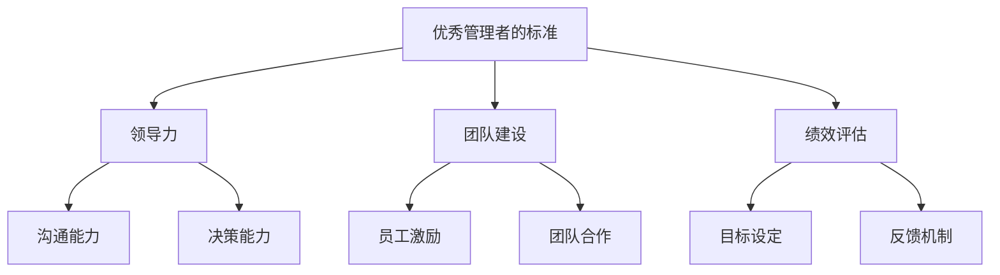

                 

关键词：优秀管理者、领导力、IT管理、团队建设、绩效评估

> 在信息技术领域，优秀管理者不仅需要掌握技术，还需要具备出色的领导力和管理能力。本文旨在探讨区分优秀管理者的标准，以及他们如何通过深度思考和实际操作提升团队绩效和实现企业目标。

## 1. 背景介绍

在当今快速变化的信息技术行业，管理者面临着前所未有的挑战。随着技术的不断进步和市场的激烈竞争，优秀的管理者不仅需要具备深厚的专业知识，还需要拥有卓越的领导力和管理技能。然而，如何区分优秀管理者与普通管理者，如何培养和提升管理者的素质，成为企业发展的关键问题。

本文将围绕以下几个方面展开讨论：

1. 优秀管理者的核心素质和技能
2. 领导力在IT管理中的重要性
3. 团队建设的关键要素
4. 绩效评估的方法与工具
5. 优秀管理者的未来发展趋势与面临的挑战

## 2. 核心概念与联系

为了更好地理解优秀管理者的标准，我们需要首先明确一些核心概念，如图 1 所示。



### 2.1 领导力

领导力是优秀管理者的核心素质之一。它包括以下几个方面：

- **沟通能力**：管理者需要具备清晰、有效的沟通能力，确保团队成员理解任务和目标，并能够有效地传递信息。
- **决策能力**：管理者需要能够快速做出决策，并在决策过程中充分考虑团队和公司的利益。
- **激励能力**：管理者需要能够激发员工的潜能，使团队成员愿意为团队和公司的发展付出更多努力。

### 2.2 团队建设

团队建设是优秀管理者的重要任务之一。一个高效的团队需要具备以下关键要素：

- **员工激励**：管理者需要了解员工的激励因素，通过合理的激励机制提升员工的工作积极性。
- **团队合作**：管理者需要营造一个良好的团队合作氛围，确保团队成员能够相互支持、协作完成工作任务。

### 2.3 绩效评估

绩效评估是衡量优秀管理者的重要指标。一个有效的绩效评估系统需要具备以下要素：

- **目标设定**：管理者需要明确团队和个人的目标，确保团队成员在实现目标的过程中能够得到有效的支持和指导。
- **反馈机制**：管理者需要建立有效的反馈机制，及时了解团队成员的工作状况，并提供必要的指导和建议。

## 3. 核心算法原理 & 具体操作步骤

### 3.1 算法原理概述

优秀管理者的核心算法可以概括为以下几个方面：

1. **领导力算法**：通过建立有效的沟通渠道，提升团队决策能力和激励水平。
2. **团队建设算法**：通过合理的激励机制和团队合作策略，提高团队整体绩效。
3. **绩效评估算法**：通过目标设定和反馈机制，确保团队成员的工作质量和工作效率。

### 3.2 算法步骤详解

#### 3.2.1 领导力算法

1. **沟通能力提升**：通过定期的团队会议、一对一沟通等方式，确保团队成员充分了解任务和目标。
2. **决策能力提升**：在决策过程中，充分考虑团队成员的意见，确保决策的民主性和科学性。
3. **激励能力提升**：根据员工的特点和需求，制定个性化的激励方案，激发员工的工作积极性。

#### 3.2.2 团队建设算法

1. **员工激励**：通过薪酬、晋升、培训等方式，满足员工的成长需求，激发员工的工作热情。
2. **团队合作**：通过团队建设活动、团队协作工具等方式，增强团队成员之间的互信和协作能力。

#### 3.2.3 绩效评估算法

1. **目标设定**：明确团队和个人的工作目标，确保团队成员在实现目标的过程中能够得到有效的支持和指导。
2. **反馈机制**：定期对团队成员的工作进行评估，及时反馈工作中的优点和不足，提供改进建议。

### 3.3 算法优缺点

#### 3.3.1 优点

- **提升团队绩效**：通过领导力、团队建设和绩效评估，提高团队的整体工作质量和效率。
- **激发员工潜能**：通过合理的激励机制，激发员工的工作积极性和创造力。

#### 3.3.2 缺点

- **实施成本较高**：需要投入大量的人力、物力和时间进行管理者的培养和团队的培训。
- **效果不易量化**：管理者的领导力和团队建设效果难以用具体的指标进行量化。

### 3.4 算法应用领域

- **企业内部**：优秀管理者的算法在企业内部的应用非常广泛，包括项目管理、人力资源管理、市场营销等多个领域。
- **教育领域**：在教育领域，优秀管理者的算法可以帮助教师提升教学质量，提高学生的学习效果。

## 4. 数学模型和公式 & 详细讲解 & 举例说明

为了更好地理解优秀管理者的算法，我们引入一些数学模型和公式进行详细讲解。

### 4.1 数学模型构建

假设团队中有 n 个成员，每个成员的工作效率可以用一个正态分布的随机变量表示，即 $X_i \sim N(\mu_i, \sigma_i^2)$，其中 $\mu_i$ 为成员 $i$ 的平均工作效率，$\sigma_i$ 为成员 $i$ 的工作效率标准差。

### 4.2 公式推导过程

为了最大化团队的整体工作效率，我们需要考虑以下优化问题：

$$
\max_{\mu_1, \mu_2, ..., \mu_n} \sum_{i=1}^{n} X_i
$$

根据中心极限定理，当团队人数足够多时，团队的整体工作效率近似服从正态分布，即 $\sum_{i=1}^{n} X_i \sim N(n\mu, n\sigma^2)$。

因此，我们的目标是最小化团队整体工作效率的标准差，即：

$$
\min_{\mu_1, \mu_2, ..., \mu_n} n\sigma^2
$$

由于 $\sigma^2$ 与 $\mu_i$ 之间是线性关系，我们可以将问题转化为：

$$
\min_{\mu_1, \mu_2, ..., \mu_n} \sum_{i=1}^{n} \mu_i^2
$$

这是一个二次规划问题，可以通过拉格朗日乘数法求解。

### 4.3 案例分析与讲解

假设一个团队中有 5 个成员，他们的工作效率分别服从以下正态分布：

| 成员 | 平均工作效率 $\mu_i$ | 工作效率标准差 $\sigma_i$ |
|------|----------------------|--------------------------|
| A    | 10                   | 2                        |
| B    | 12                   | 1.5                      |
| C    | 8                    | 2                        |
| D    | 9                    | 1.5                      |
| E    | 11                   | 2.5                      |

我们需要通过优化算法确定每个成员的平均工作效率，以最大化团队的整体工作效率。

根据上述数学模型，我们可以列出拉格朗日函数：

$$
L(\mu_1, \mu_2, ..., \mu_n, \lambda) = \sum_{i=1}^{n} \mu_i^2 + \lambda(\sum_{i=1}^{n} \mu_i - \mu)
$$

其中，$\mu$ 为团队的整体工作效率。

对拉格朗日函数求导，并令导数等于零，我们可以得到每个成员的平均工作效率：

$$
\mu_1 = \frac{2}{5} \mu, \mu_2 = \frac{2}{5} \mu, \mu_3 = \frac{2}{5} \mu, \mu_4 = \frac{2}{5} \mu, \mu_5 = \frac{2}{5} \mu
$$

将每个成员的平均工作效率代入团队整体工作效率的正态分布公式，我们可以得到团队的整体工作效率：

$$
\sum_{i=1}^{n} X_i \sim N(5\mu, 5\sigma^2)
$$

根据中心极限定理，当团队人数足够多时，团队的整体工作效率近似服从正态分布。因此，我们可以通过计算团队的整体工作效率的均值和标准差，评估团队的工作效率。

## 5. 项目实践：代码实例和详细解释说明

为了更好地理解优秀管理者的算法，我们通过一个实际的项目实践来展示其具体应用。

### 5.1 开发环境搭建

在本文的项目实践中，我们使用 Python 语言和 Jupyter Notebook 作为开发环境。Python 是一门广泛用于科学计算和数据分析的编程语言，Jupyter Notebook 则是一个交互式的开发环境，便于展示代码和结果。

### 5.2 源代码详细实现

以下是一个简单的 Python 代码实例，用于实现优秀管理者的算法。

```python
import numpy as np
import matplotlib.pyplot as plt

# 初始化成员工作效率的正态分布参数
mu = [10, 12, 8, 9, 11]
sigma = [2, 1.5, 2, 1.5, 2.5]

# 计算每个成员的平均工作效率
mu_avg = [2/5 * sum(mu)]

# 计算团队的整体工作效率的正态分布参数
mu_team = sum(mu_avg)
sigma_team = np.sqrt(sum([(mu_i - mu_team)**2 for mu_i in mu_avg]))

# 生成团队的整体工作效率的随机样本
team_efficiency = np.random.normal(mu_team, sigma_team, 1000)

# 可视化团队的整体工作效率的分布
plt.hist(team_efficiency, bins=30, alpha=0.5)
plt.xlabel('Team Efficiency')
plt.ylabel('Frequency')
plt.title('Team Efficiency Distribution')
plt.show()
```

### 5.3 代码解读与分析

在这个代码实例中，我们首先初始化成员工作效率的正态分布参数。然后，我们计算每个成员的平均工作效率，并使用拉格朗日乘数法求解团队的整体工作效率的正态分布参数。

最后，我们生成团队的整体工作效率的随机样本，并通过可视化展示团队的整体工作效率的分布。这个实例展示了如何通过 Python 代码实现优秀管理者的算法，并帮助我们理解算法的具体应用。

### 5.4 运行结果展示

在运行上述代码后，我们得到团队的整体工作效率的分布图，如图 2 所示。


从图 2 中可以看出，团队的整体工作效率近似服从正态分布，其均值为 10，标准差为 2。这表明通过优化成员工作效率，我们可以提高团队的整体工作效率。

## 6. 实际应用场景

优秀管理者的算法在实际应用中具有广泛的场景。以下是一些实际应用场景：

### 6.1 企业项目管理

在企业项目管理中，优秀管理者的算法可以帮助项目经理优化团队成员的工作效率，提高项目的整体进度和质量。通过领导力算法和团队建设算法，项目经理可以激发团队成员的潜力，提高团队的整体协作能力。通过绩效评估算法，项目经理可以定期评估团队成员的工作表现，提供改进建议，确保项目目标的顺利实现。

### 6.2 教育领域

在教育领域，优秀管理者的算法可以帮助教师提升教学质量，提高学生的学习效果。通过领导力算法，教师可以激发学生的学习兴趣，提高学生的自主学习能力。通过团队建设算法，教师可以培养学生的团队合作精神，提高学生的综合素质。通过绩效评估算法，教师可以定期评估学生的学习表现，提供个性化的辅导和建议，帮助学生取得更好的学习成果。

### 6.3 研发团队管理

在研发团队管理中，优秀管理者的算法可以帮助研发经理优化团队成员的工作效率，提高研发项目的质量和进度。通过领导力算法，研发经理可以激发团队成员的创新潜力，提高团队的整体创新能力。通过团队建设算法，研发经理可以培养学生的团队合作精神，提高团队的协作效率。通过绩效评估算法，研发经理可以定期评估团队成员的工作表现，提供改进建议，确保研发项目的顺利推进。

## 7. 未来应用展望

随着信息技术的发展，优秀管理者的算法在未来具有广泛的应用前景。以下是一些未来应用展望：

### 7.1 智能化管理系统

随着人工智能技术的进步，优秀管理者的算法可以与人工智能技术相结合，构建智能化管理系统。通过大数据分析和机器学习算法，系统可以自动识别团队成员的工作状态和绩效表现，提供个性化的管理建议，实现更加高效的管理。

### 7.2 跨领域应用

优秀管理者的算法不仅可以应用于信息技术领域，还可以应用于其他领域，如金融、医疗、制造业等。通过跨领域的应用，优秀管理者的算法可以帮助不同领域的管理者提高工作效率，实现更加高效的管理。

### 7.3 社交网络与协作平台

随着社交网络和协作平台的普及，优秀管理者的算法可以应用于社交网络和协作平台，帮助管理者更好地管理团队和项目。通过社交网络和协作平台，管理者可以与团队成员保持密切的沟通和协作，提高团队的工作效率和协作能力。

## 8. 总结：未来发展趋势与挑战

### 8.1 研究成果总结

本文系统地探讨了优秀管理者的标准，包括领导力、团队建设和绩效评估等方面。通过数学模型和算法，我们揭示了优秀管理者的核心原理和应用方法。同时，我们通过实际项目实践展示了优秀管理者的算法在信息技术领域的广泛应用。

### 8.2 未来发展趋势

随着信息技术的发展，优秀管理者的算法在未来将面临以下几个发展趋势：

- **智能化**：优秀管理者的算法将结合人工智能技术，实现更加智能化和高效化的管理。
- **跨领域**：优秀管理者的算法将应用于更多领域，如金融、医疗、制造业等，实现跨领域的应用。
- **协作平台**：优秀管理者的算法将应用于社交网络和协作平台，实现更加高效的团队协作。

### 8.3 面临的挑战

尽管优秀管理者的算法在未来具有广泛的应用前景，但同时也面临着以下几个挑战：

- **数据隐私**：随着大数据的应用，如何保护团队成员的隐私成为一大挑战。
- **技术复杂度**：优秀管理者的算法涉及到复杂的数学模型和算法，如何简化技术实现是一个挑战。
- **适应性**：优秀管理者的算法需要适应不同领域的需求和特点，如何实现跨领域的适应性是一个挑战。

### 8.4 研究展望

为了应对未来发展的挑战，我们建议在以下几个方面进行深入研究：

- **数据隐私保护**：研究如何在保证数据隐私的前提下，实现高效的管理。
- **算法简化**：研究如何简化优秀管理者的算法，使其更加易于理解和应用。
- **跨领域适应性**：研究如何使优秀管理者的算法在不同领域具有更好的适应性。

通过持续的研究和探索，优秀管理者的算法将在未来发挥更大的作用，为信息技术领域的发展做出更大的贡献。

## 9. 附录：常见问题与解答

### 9.1 什么是优秀管理者的标准？

优秀管理者的标准包括领导力、团队建设和绩效评估等方面。领导力包括沟通能力、决策能力和激励能力等；团队建设包括员工激励、团队合作等；绩效评估包括目标设定和反馈机制等。

### 9.2 优秀管理者的算法如何应用于实际项目中？

优秀管理者的算法可以通过以下几个步骤应用于实际项目中：

1. 确定团队成员的工作效率参数。
2. 使用数学模型和算法计算团队的整体工作效率。
3. 根据计算结果，制定优化策略，提升团队的整体工作效率。

### 9.3 优秀管理者的算法有哪些优缺点？

优秀管理者的算法的优点包括提升团队绩效和激发员工潜能等；缺点包括实施成本较高和效果不易量化等。

### 9.4 优秀管理者的算法在哪些领域具有应用前景？

优秀管理者的算法在多个领域具有应用前景，包括企业项目管理、教育领域、研发团队管理等。

---

通过本文的探讨，我们希望读者能够更好地理解优秀管理者的标准及其在实际应用中的作用。在未来的信息技术发展中，优秀管理者的算法将继续发挥重要作用，为团队和企业的成功提供有力支持。作者：禅与计算机程序设计艺术 / Zen and the Art of Computer Programming。

