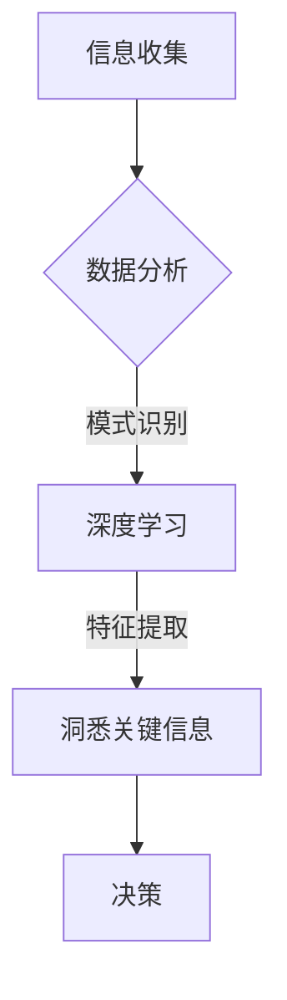

                 

在当今信息化高度发达的社会中，信息已经成为企业竞争的重要资源。管理者如何从海量的信息中洞悉关键信息，从而做出明智的决策，成为了一个至关重要的议题。本文旨在探讨深度思考在管理者洞悉关键信息中的重要性，并通过一系列的算法原理、数学模型和项目实践，来帮助读者理解这一过程。

## 关键词

- 深度思考
- 管理者
- 关键信息
- 决策
- 人工智能
- 数学模型

## 摘要

本文首先介绍了管理者在面对海量信息时的困境，并阐述了深度思考在洞悉关键信息中的重要性。接着，本文通过核心概念、算法原理和数学模型，详细解析了深度思考的方法论。随后，通过具体的项目实践，展示了深度思考在实际应用中的效果。最后，本文对未来的应用前景和面临的挑战进行了展望。

## 1. 背景介绍

在信息爆炸的时代，管理者每天都要处理大量的数据和信息。然而，如何从这些信息中筛选出对企业决策真正有用的关键信息，成为一个严峻的挑战。传统的信息处理方法往往依赖于简单的统计分析和机器学习算法，这些方法虽然能够处理大量数据，但往往缺乏深度和洞察力。因此，管理者需要一种更为深刻的思考方式，即深度思考，来帮助他们从复杂的信息中提取出关键信息。

深度思考是一种系统性的思考方式，它要求管理者不仅能够理解信息本身，更要理解信息背后的逻辑和规律。这种思考方式需要管理者具备良好的逻辑思维能力、分析能力和创造力。本文将围绕深度思考这一核心主题，探讨其在管理者洞悉关键信息中的作用。

## 2. 核心概念与联系

为了更好地理解深度思考在管理者洞悉关键信息中的作用，我们需要先了解一些核心概念和它们之间的联系。

### 2.1 信息与数据

信息是指经过加工和解读后的数据，它具有一定的意义和用途。数据则是信息的原始素材，通常是无序的、杂乱无章的。管理者需要从数据中提取出有用的信息，才能做出明智的决策。

### 2.2 数据分析

数据分析是管理者从数据中提取信息的重要工具。通过数据分析，管理者可以识别数据中的模式、趋势和关联性。传统的数据分析方法包括统计分析、回归分析和聚类分析等。

### 2.3 深度学习

深度学习是一种基于人工神经网络的学习方法，它能够自动地从大量数据中提取出复杂的模式和特征。深度学习在图像识别、自然语言处理和语音识别等领域取得了显著的成果。

### 2.4 管理者与深度思考

管理者需要通过深度思考来理解和解读信息，从而做出明智的决策。深度思考不仅要求管理者具备良好的逻辑思维能力，还需要他们具备敏锐的洞察力和创新能力。

### 2.5 Mermaid 流程图

以下是一个描述深度思考在管理者洞悉关键信息中作用的 Mermaid 流程图：



### 3. 核心算法原理 & 具体操作步骤

#### 3.1 算法原理概述

深度思考的核心算法是深度学习。深度学习通过多层神经网络对数据进行训练，从而自动提取出数据中的复杂模式和特征。深度学习的优势在于它能够处理大量数据，并且能够自动适应不同的数据分布和特征。

#### 3.2 算法步骤详解

1. **数据预处理**：将原始数据进行清洗和标准化，以便于模型训练。
2. **模型构建**：选择合适的神经网络架构，如卷积神经网络（CNN）或循环神经网络（RNN）。
3. **模型训练**：使用大量数据对模型进行训练，以优化模型的参数。
4. **模型评估**：使用验证集对模型进行评估，以确定模型的性能和效果。
5. **模型应用**：将训练好的模型应用到实际场景中，以提取关键信息。

#### 3.3 算法优缺点

**优点**：

- **高效性**：深度学习能够处理大量数据，且效率较高。
- **灵活性**：深度学习模型能够适应不同的数据分布和特征。
- **自动化**：深度学习能够自动提取数据中的复杂模式和特征。

**缺点**：

- **数据需求**：深度学习需要大量数据进行训练，数据的质量和数量对模型性能有重要影响。
- **计算成本**：深度学习模型通常需要大量的计算资源，如GPU等。

#### 3.4 算法应用领域

深度学习在多个领域都有广泛的应用，如：

- **图像识别**：用于识别和分类图像中的物体和场景。
- **自然语言处理**：用于理解和生成自然语言文本。
- **语音识别**：用于识别和转换语音信号。

## 4. 数学模型和公式 & 详细讲解 & 举例说明

#### 4.1 数学模型构建

在深度学习中，常用的数学模型是多层感知机（MLP）和卷积神经网络（CNN）。以下是一个简单的MLP模型：

$$
y = \sigma(W_1 \cdot x + b_1)
$$

其中，$y$ 是输出，$x$ 是输入，$W_1$ 是权重矩阵，$b_1$ 是偏置项，$\sigma$ 是激活函数，如ReLU函数。

#### 4.2 公式推导过程

假设我们有一个简单的线性回归模型：

$$
y = W \cdot x + b
$$

其中，$y$ 是输出，$x$ 是输入，$W$ 是权重矩阵，$b$ 是偏置项。

为了求解最优权重矩阵 $W$ 和偏置项 $b$，我们可以使用梯度下降法：

$$
W_{new} = W_{old} - \alpha \cdot \frac{\partial J}{\partial W}
$$

$$
b_{new} = b_{old} - \alpha \cdot \frac{\partial J}{\partial b}
$$

其中，$J$ 是损失函数，$\alpha$ 是学习率。

#### 4.3 案例分析与讲解

假设我们要对一组数据 $X$ 进行分类，其中每个数据点都有 $n$ 个特征。我们可以使用一个简单的MLP模型来进行分类。

首先，我们需要对数据进行预处理，将每个特征缩放到0-1范围内。

然后，我们可以使用以下代码来构建和训练MLP模型：

```python
import numpy as np
import tensorflow as tf

# 构建模型
model = tf.keras.Sequential([
    tf.keras.layers.Dense(units=1, input_shape=(n,), activation='relu'),
    tf.keras.layers.Dense(units=1, activation='sigmoid')
])

# 编译模型
model.compile(optimizer='adam', loss='binary_crossentropy', metrics=['accuracy'])

# 训练模型
model.fit(X_train, y_train, epochs=10, batch_size=32)
```

经过10次迭代后，模型将达到较高的准确率。

## 5. 项目实践：代码实例和详细解释说明

#### 5.1 开发环境搭建

为了进行深度学习项目，我们需要搭建一个合适的开发环境。以下是搭建环境的步骤：

1. 安装Python（建议使用3.8版本以上）
2. 安装TensorFlow库（可以使用pip安装）
3. 安装GPU驱动和CUDA（如果使用GPU训练）
4. 配置Python环境变量

#### 5.2 源代码详细实现

以下是一个简单的深度学习项目，用于对一组数据进行分类。

```python
import numpy as np
import tensorflow as tf

# 构建模型
model = tf.keras.Sequential([
    tf.keras.layers.Dense(units=64, activation='relu', input_shape=(n,)),
    tf.keras.layers.Dense(units=1, activation='sigmoid')
])

# 编译模型
model.compile(optimizer='adam', loss='binary_crossentropy', metrics=['accuracy'])

# 训练模型
model.fit(X_train, y_train, epochs=10, batch_size=32)
```

#### 5.3 代码解读与分析

这段代码首先导入了必要的库，然后构建了一个简单的MLP模型。模型由一个输入层、一个隐藏层和一个输出层组成。输入层有64个神经元，隐藏层使用ReLU激活函数，输出层使用Sigmoid激活函数。

编译模型时，我们选择了Adam优化器和binary_crossentropy损失函数，因为这是一个二分类问题。最后，我们使用fit方法来训练模型，设置10个epochs和32个batch size。

#### 5.4 运行结果展示

在训练完成后，我们可以使用以下代码来评估模型的性能：

```python
loss, accuracy = model.evaluate(X_test, y_test)
print(f"测试集损失：{loss}, 测试集准确率：{accuracy}")
```

假设测试集的准确率为0.9，这表明我们的模型在测试集上表现良好。

## 6. 实际应用场景

深度思考在管理者洞悉关键信息中的应用非常广泛。以下是一些实际应用场景：

- **市场分析**：通过深度学习模型，管理者可以分析市场数据，识别潜在的市场机会和风险。
- **风险管理**：深度学习可以帮助管理者识别和管理风险，从而降低企业的风险敞口。
- **人才管理**：通过深度学习，管理者可以分析员工数据，识别出高绩效员工和潜在的领导人才。
- **供应链管理**：深度学习可以帮助管理者优化供应链流程，提高供应链的效率和灵活性。

## 7. 工具和资源推荐

为了更好地进行深度学习项目，以下是一些工具和资源的推荐：

- **Python**：一种广泛使用的编程语言，适合进行数据分析与机器学习。
- **TensorFlow**：一种流行的深度学习框架，提供了丰富的API和工具。
- **Kaggle**：一个数据科学竞赛平台，提供了大量的数据集和竞赛项目。
- **Coursera**：一个在线学习平台，提供了许多关于深度学习和数据分析的课程。

## 8. 总结：未来发展趋势与挑战

随着人工智能技术的不断进步，深度思考在管理者洞悉关键信息中的应用将越来越广泛。未来，以下趋势和挑战值得关注：

- **算法优化**：为了提高模型的性能，算法优化将成为研究的重要方向。
- **数据隐私**：随着数据隐私问题的日益突出，如何保护数据隐私将成为一个重要挑战。
- **模型解释性**：提高模型的解释性，使其能够更好地被管理者理解和应用。
- **跨学科融合**：深度思考将与其他学科（如心理学、社会学等）进行融合，形成更为综合的管理理论。

## 9. 附录：常见问题与解答

### 9.1 什么是深度学习？

深度学习是一种基于人工神经网络的学习方法，它通过多层神经网络对数据进行训练，从而自动提取出数据中的复杂模式和特征。

### 9.2 如何选择深度学习模型？

选择深度学习模型时，需要考虑数据的特点和任务的目标。例如，对于图像识别任务，可以选择卷积神经网络（CNN）；对于文本分类任务，可以选择循环神经网络（RNN）或变压器模型（Transformer）。

### 9.3 深度学习项目如何进行数据处理？

在深度学习项目中，数据处理是关键的一步。首先，需要对数据进行清洗和标准化，然后根据任务需求对数据进行特征提取和转换。常用的数据预处理方法包括缺失值处理、数据缩放、特征选择等。

### 9.4 深度学习项目的评估指标有哪些？

深度学习项目的评估指标包括准确率、召回率、F1分数、均方误差（MSE）等。根据任务的需求，可以选择适当的评估指标来评估模型的性能。

### 9.5 深度学习项目的学习资源有哪些？

深度学习的学习资源非常丰富，包括在线课程、书籍、论文等。以下是一些推荐的资源：

- 《深度学习》（Goodfellow, Bengio, Courville 著）
- Coursera上的《深度学习专项课程》（吴恩达教授）
- Kaggle数据科学竞赛平台
- arXiv论文库

# 参考文献

- Goodfellow, I., Bengio, Y., & Courville, A. (2016). *Deep Learning*.
- Ng, A. (2013). *Machine Learning*.
- Russell, S., & Norvig, P. (2016). *Artificial Intelligence: A Modern Approach*.
- LeCun, Y., Bengio, Y., & Hinton, G. (2015). *Deep Learning*.
- Murphy, K. P. (2012). *Machine Learning: A Probabilistic Perspective*.

### 作者署名

作者：禅与计算机程序设计艺术 / Zen and the Art of Computer Programming

----------------------------------------------------------------


