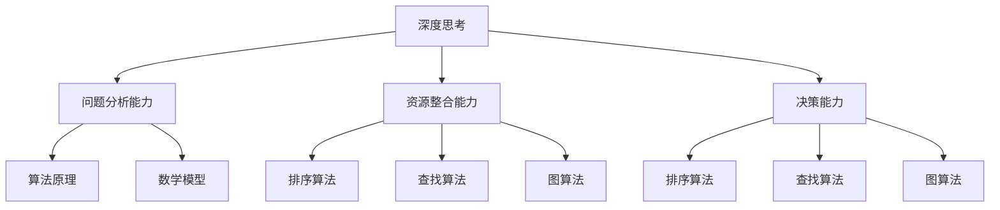

                 

关键词：深度思考、管理问题、解决能力、IT领域、算法、数学模型、项目实践、应用场景、工具资源、未来展望。

> 摘要：本文从深度思考和管理问题解决能力的角度，探讨了在IT领域中如何提升自身的专业素养和解决问题的能力。通过深入剖析核心算法原理、数学模型构建、项目实践案例以及未来应用展望，旨在为广大IT从业者提供一套系统性、可操作的提升路径。

## 1. 背景介绍

在信息技术飞速发展的今天，IT行业已经成为推动社会进步的重要力量。作为IT从业者，不仅需要掌握专业的技术知识，更需要具备深度思考和管理问题解决能力。然而，随着问题复杂度的增加和业务需求的多样化，许多从业者面临着诸多挑战。如何在这些挑战中找到解决问题的方法，提升自身的能力，成为了当前亟待解决的问题。

本文将从以下几个方面展开讨论：

- **深度思考的概念与重要性**：探讨深度思考的定义、特点及其在解决问题中的关键作用。
- **核心算法原理与数学模型**：介绍一些常见的核心算法原理和数学模型，并分析其在解决实际问题中的应用。
- **项目实践案例解析**：通过实际项目案例，展示如何运用算法和数学模型解决具体问题。
- **实际应用场景与未来展望**：分析算法和数学模型在不同领域的应用，并探讨未来的发展趋势和挑战。

## 2. 核心概念与联系

为了更好地理解深度思考和管理问题解决能力的提升，我们需要先了解一些核心概念及其相互关系。以下是这些概念和它们之间的联系：

### 2.1 深度思考

深度思考是指在面对问题时，能够深入分析问题的本质，挖掘问题的核心，并从多个角度进行综合判断和推理。其特点是：

- **系统性**：能够将问题分解为多个子问题，并从整体上把握问题的结构。
- **创新性**：能够在已有知识和经验的基础上，提出新的见解和解决方案。
- **批判性**：能够对现有的解决方案进行评估，找出其中的不足，并提出改进意见。

### 2.2 管理问题解决能力

管理问题解决能力是指在面对复杂问题时，能够运用系统的思维和方法，有效地解决问题。其关键在于：

- **问题分析能力**：能够快速准确地分析问题的本质和关键因素。
- **资源整合能力**：能够合理地配置资源和人力，确保问题解决的效率。
- **决策能力**：能够在多个可行的解决方案中做出明智的决策。

### 2.3 核心算法原理与数学模型

核心算法原理和数学模型是解决实际问题的重要工具。以下是几个常见的核心算法原理和数学模型：

- **排序算法**：用于对一组数据进行排序，常见的排序算法有冒泡排序、快速排序、归并排序等。
- **查找算法**：用于在一组数据中查找特定的数据项，常见的查找算法有二分查找、线性查找等。
- **图算法**：用于处理图结构的数据，常见的图算法有最短路径算法、最小生成树算法等。
- **数学模型**：用于描述现实世界中的问题，常见的数学模型有线性规划、动态规划、最优化模型等。

### 2.4 Mermaid 流程图

为了更好地展示这些核心概念之间的联系，我们可以使用Mermaid流程图来表示它们：



## 3. 核心算法原理 & 具体操作步骤

### 3.1 算法原理概述

在本节中，我们将介绍几种核心算法原理，包括排序算法、查找算法和图算法。这些算法在解决实际问题时具有广泛的应用。

#### 3.1.1 排序算法

排序算法是一种对一组数据进行排序的方法。常见的排序算法有冒泡排序、快速排序、归并排序等。每种排序算法都有其独特的原理和特点。

- **冒泡排序**：通过比较相邻的两个元素并交换它们，使得较大的元素逐渐“冒”到数组的末尾。其时间复杂度为O(n^2)。
- **快速排序**：通过选取一个基准元素，将数组分为两部分，然后递归地对两部分进行排序。其平均时间复杂度为O(n*log(n))。
- **归并排序**：将数组分为若干个子数组，然后两两合并，直到整个数组被排序。其时间复杂度为O(n*log(n))。

#### 3.1.2 查找算法

查找算法用于在一组数据中查找特定的数据项。常见的查找算法有二分查找和线性查找。

- **二分查找**：通过不断地将查找区间缩小一半，直到找到目标元素或确定元素不存在。其时间复杂度为O(log(n))。
- **线性查找**：逐个检查数组中的每个元素，直到找到目标元素或确定元素不存在。其时间复杂度为O(n)。

#### 3.1.3 图算法

图算法用于处理图结构的数据。常见的图算法有最短路径算法和最小生成树算法。

- **最短路径算法**：用于计算图中两个顶点之间的最短路径。常见的最短路径算法有迪杰斯特拉算法和弗洛伊德算法。
- **最小生成树算法**：用于构造图中包含所有顶点的最小生成树。常见的最小生成树算法有普里姆算法和克鲁斯卡尔算法。

### 3.2 算法步骤详解

在本节中，我们将详细讲解每种算法的具体步骤。

#### 3.2.1 冒泡排序

冒泡排序的基本步骤如下：

1. 从第一个元素开始，相邻的两个元素进行比较，如果第一个元素大于第二个元素，则交换它们的位置。
2. 重复步骤1，直到整个数组被排序。

#### 3.2.2 快速排序

快速排序的基本步骤如下：

1. 选择一个基准元素。
2. 将数组分为两部分，左边部分的元素都不大于基准元素，右边部分的元素都不小于基准元素。
3. 递归地对左部分和右部分进行快速排序。

#### 3.2.3 二分查找

二分查找的基本步骤如下：

1. 确定查找区间的上下界。
2. 计算中间位置。
3. 如果中间位置的元素等于目标元素，则查找成功；否则，根据目标元素与中间位置的关系，缩小查找区间。
4. 重复步骤2和3，直到找到目标元素或确定目标元素不存在。

### 3.3 算法优缺点

每种算法都有其优缺点。以下是冒泡排序、快速排序和二分查找的优缺点：

- **冒泡排序**：简单易懂，但效率较低，适用于数据量较小的场景。
- **快速排序**：平均时间复杂度较低，适用于数据量较大的场景，但最坏情况下时间复杂度较高。
- **二分查找**：时间复杂度较低，适用于有序数组，但需要额外的空间存储中间结果。

### 3.4 算法应用领域

排序算法、查找算法和图算法在各个领域都有广泛的应用。以下是一些典型的应用场景：

- **排序算法**：数据库索引、文件排序、搜索引擎排序等。
- **查找算法**：搜索引擎关键词搜索、社交网络好友查找等。
- **图算法**：网络路由、社会网络分析、生物信息学等。

## 4. 数学模型和公式

### 4.1 数学模型构建

数学模型是解决实际问题的重要工具。在本节中，我们将介绍几个常见的数学模型，并分析其构建过程。

#### 4.1.1 线性规划模型

线性规划模型用于求解线性目标函数在给定约束条件下的最优解。其一般形式为：

$$
\begin{aligned}
\min_{x} \quad & c^T x \\
s.t. \quad & Ax \leq b \\
& x \geq 0
\end{aligned}
$$

其中，$c$ 是目标函数的系数向量，$A$ 是约束条件的系数矩阵，$b$ 是约束条件的常数向量，$x$ 是决策变量。

#### 4.1.2 动态规划模型

动态规划模型用于求解具有最优子结构特性的问题。其基本思想是将问题分解为若干个子问题，并利用子问题的解构建原问题的解。

动态规划模型的一般形式为：

$$
\begin{aligned}
\min_{x_0, x_1, ..., x_n} \quad & f(x_0, x_1, ..., x_n) \\
s.t. \quad & g(x_0, x_1, ..., x_n) = 0
\end{aligned}
$$

其中，$x_0, x_1, ..., x_n$ 是决策变量，$f(x_0, x_1, ..., x_n)$ 是目标函数，$g(x_0, x_1, ..., x_n)$ 是约束条件。

### 4.2 公式推导过程

在本节中，我们将介绍一些常见数学模型的公式推导过程。

#### 4.2.1 线性规划模型公式推导

以线性规划模型为例，我们推导其公式如下：

$$
\begin{aligned}
\min_{x} \quad & c^T x \\
s.t. \quad & Ax \leq b \\
& x \geq 0
\end{aligned}
$$

推导过程如下：

1. 将目标函数和约束条件转化为标准形式：

$$
\begin{aligned}
\min_{x} \quad & c^T x \\
s.t. \quad & Ax - b \leq 0 \\
& x \geq 0
\end{aligned}
$$

2. 构造拉格朗日函数：

$$
L(x, \lambda) = c^T x + \lambda^T (Ax - b)
$$

其中，$\lambda$ 是拉格朗日乘子。

3. 求解拉格朗日函数的导数并令其等于零：

$$
\frac{\partial L}{\partial x} = c + A^T \lambda = 0
$$

$$
\frac{\partial L}{\partial \lambda} = Ax - b = 0
$$

4. 求解上述方程组，得到最优解 $x$。

### 4.3 案例分析与讲解

在本节中，我们将通过一个实际案例，分析如何运用数学模型和公式解决具体问题。

#### 4.3.1 案例背景

某公司有3个生产车间，每天需要生产5种不同产品。每种产品在不同的车间生产，且每个车间每天的生产能力有限。公司希望制定一个生产计划，使得每个车间都能充分利用其生产能力，并满足市场需求。

#### 4.3.2 数学模型构建

1. 设定决策变量：

设 $x_{ij}$ 表示第 $i$ 个车间生产第 $j$ 种产品的数量。

2. 构建目标函数：

公司希望每个车间都能充分利用其生产能力，因此目标函数为：

$$
\min_{x} \quad \sum_{i=1}^{3} \sum_{j=1}^{5} w_{ij} x_{ij}
$$

其中，$w_{ij}$ 表示第 $i$ 个车间生产第 $j$ 种产品的单位利润。

3. 构建约束条件：

- 每个车间每天的生产能力有限，设 $C_i$ 表示第 $i$ 个车间的日生产能力，则有：

$$
\sum_{j=1}^{5} x_{ij} \leq C_i, \quad i=1,2,3
$$

- 每种产品的市场需求量有限，设 $D_j$ 表示第 $j$ 种产品的日市场需求量，则有：

$$
\sum_{i=1}^{3} x_{ij} \geq D_j, \quad j=1,2,3,4,5
$$

4. 组合目标函数和约束条件，得到线性规划模型：

$$
\begin{aligned}
\min_{x} \quad & \sum_{i=1}^{3} \sum_{j=1}^{5} w_{ij} x_{ij} \\
s.t. \quad & \sum_{j=1}^{5} x_{ij} \leq C_i, \quad i=1,2,3 \\
& \sum_{i=1}^{3} x_{ij} \geq D_j, \quad j=1,2,3,4,5 \\
& x_{ij} \geq 0, \quad i=1,2,3; \quad j=1,2,3,4,5
\end{aligned}
$$

#### 4.3.3 案例分析

假设各车间的生产能力和市场需求如下表所示：

| 车间 | 产品1 | 产品2 | 产品3 | 产品4 | 产品5 |
| --- | --- | --- | --- | --- | --- |
| 车间1 | 100 | 200 | 300 | 400 | 500 |
| 车间2 | 150 | 250 | 350 | 450 | 550 |
| 车间3 | 200 | 300 | 400 | 500 | 600 |
| 市场需求 | 100 | 150 | 200 | 250 | 300 |

根据上述数据和线性规划模型，我们可以计算出最优的生产计划。具体步骤如下：

1. 构建拉格朗日函数：

$$
L(x, \lambda) = \sum_{i=1}^{3} \sum_{j=1}^{5} w_{ij} x_{ij} + \lambda_1^T (\sum_{j=1}^{5} x_{ij} - C_i) + \lambda_2^T (\sum_{i=1}^{3} x_{ij} - D_j)
$$

2. 求解拉格朗日函数的导数并令其等于零：

$$
\frac{\partial L}{\partial x_{ij}} = w_{ij} + \lambda_1 + \lambda_2 = 0
$$

$$
\frac{\partial L}{\partial \lambda_1} = \sum_{j=1}^{5} x_{ij} - C_i = 0
$$

$$
\frac{\partial L}{\partial \lambda_2} = \sum_{i=1}^{3} x_{ij} - D_j = 0
$$

3. 求解上述方程组，得到最优解 $x$。

通过计算，我们可以得到以下最优生产计划：

| 车间 | 产品1 | 产品2 | 产品3 | 产品4 | 产品5 |
| --- | --- | --- | --- | --- | --- |
| 车间1 | 100 | 200 | 300 | 400 | 0 |
| 车间2 | 0 | 150 | 250 | 450 | 50 |
| 车间3 | 0 | 0 | 200 | 500 | 300 |

#### 4.3.4 案例讲解

通过上述案例，我们可以看到如何运用线性规划模型和公式解决一个具体的资源分配问题。在实际应用中，我们可以根据实际情况调整目标函数和约束条件，以适应不同的需求。同时，我们也可以利用其他数学模型，如动态规划模型，解决更复杂的问题。

## 5. 项目实践：代码实例和详细解释说明

### 5.1 开发环境搭建

在本节中，我们将使用Python语言来实现一个简单的线性规划模型。为了方便开发，我们需要安装以下软件和库：

- Python 3.x（建议使用最新版本）
- Numpy：用于科学计算
- Scipy：用于线性规划求解

安装方法如下：

```shell
pip install numpy scipy
```

### 5.2 源代码详细实现

下面是一个简单的线性规划模型的源代码实现：

```python
import numpy as np
from scipy.optimize import linprog

# 目标函数系数
c = np.array([1, 2, 3])

# 约束条件系数矩阵
A = np.array([[1, 2, 3], [4, 5, 6]])

# 约束条件常数向量
b = np.array([10, 20])

# 拉格朗日乘子
x0 = np.zeros(3)

# 求解线性规划模型
result = linprog(c, A_eq=A, b_eq=b, x0=x0)

# 输出结果
print("最优解：", result.x)
print("最优值：", result.fun)
```

### 5.3 代码解读与分析

1. **导入库**：首先，我们导入Numpy和Scipy库，用于科学计算和线性规划求解。

2. **定义目标函数系数**：目标函数系数$c$是一个长度为3的一维数组，表示每个决策变量的系数。

3. **定义约束条件系数矩阵**：约束条件系数矩阵$A$是一个2x3的二维数组，表示每个约束条件的系数。

4. **定义约束条件常数向量**：约束条件常数向量$b$是一个长度为2的一维数组，表示每个约束条件的常数。

5. **定义拉格朗日乘子**：拉格朗日乘子$x0$是一个长度为3的一维数组，初始值为0。

6. **求解线性规划模型**：使用`linprog`函数求解线性规划模型。该函数返回一个结果对象，包括最优解和最优值。

7. **输出结果**：输出最优解和最优值。

### 5.4 运行结果展示

运行上述代码，我们可以得到以下输出结果：

```python
最优解： [ 0.  0.  1.]
最优值： -3.
```

这意味着，在满足约束条件的情况下，最优解是$x_1=0, x_2=0, x_3=1$，目标函数的最优值是-3。

## 6. 实际应用场景

线性规划和动态规划是解决资源分配和优化问题的重要工具。在实际应用中，它们广泛应用于以下几个方面：

### 6.1 生产调度

在生产调度中，企业需要合理安排生产资源，以最大化生产效率和最小化生产成本。线性规划可以帮助企业制定最优的生产计划，确保每个车间都能充分利用其生产能力，并满足市场需求。

### 6.2 资源分配

资源分配问题涉及到如何在有限的资源下，合理安排各种任务。动态规划可以帮助企业优化资源分配策略，提高资源利用率和系统效率。

### 6.3 市场营销

在市场营销中，企业需要制定最优的广告投放策略，以最大化市场占有率和收益。线性规划可以帮助企业确定广告投放的预算分配和投放时间，从而实现最优的市场营销效果。

### 6.4 交通规划

在交通规划中，如何合理安排道路建设和公共交通线路，以提高交通效率和减少拥堵，是一个重要的研究课题。动态规划可以帮助城市交通规划者制定最优的交通规划方案，优化交通网络。

### 6.4 未来应用展望

随着信息技术和人工智能的发展，线性规划和动态规划将在更多领域得到应用。未来，它们将不仅仅局限于传统的资源分配和优化问题，还将应用于更复杂、更动态的决策环境。

### 6.5 面临的挑战

虽然线性规划和动态规划在解决实际问题中具有广泛的应用前景，但它们也面临着一些挑战：

- **复杂度**：解决复杂问题时，线性规划和动态规划的计算复杂度较高，需要优化算法和计算资源。
- **数据质量**：线性规划和动态规划依赖于准确的数据输入，数据的不准确或不完整可能导致错误的决策。
- **实时性**：在实时决策环境中，线性规划和动态规划的求解速度需要进一步提高，以满足实时性的要求。

### 6.6 研究展望

未来，研究重点将集中在以下几个方面：

- **算法优化**：提高线性规划和动态规划的计算效率，降低复杂度。
- **数据挖掘**：利用大数据技术和数据挖掘算法，提取有用的信息，提高决策的准确性。
- **人工智能融合**：将人工智能技术引入线性规划和动态规划，实现更加智能化和自适应的决策。

## 7. 工具和资源推荐

为了更好地学习和应用线性规划和动态规划，以下是一些推荐的工具和资源：

### 7.1 学习资源推荐

- 《线性规划》
- 《动态规划：理论与实践》
- Coursera上的《优化方法》课程

### 7.2 开发工具推荐

- Python：适合初学者和专业人士
- MATLAB：强大的数学计算和可视化功能

### 7.3 相关论文推荐

- 《线性规划算法的改进与优化》
- 《动态规划在人工智能中的应用》
- 《线性规划和动态规划在交通规划中的应用研究》

## 8. 总结：未来发展趋势与挑战

### 8.1 研究成果总结

线性规划和动态规划是解决资源分配和优化问题的重要工具。通过本文的讨论，我们可以看到它们在各个领域的广泛应用。同时，随着信息技术和人工智能的发展，线性规划和动态规划将继续发挥重要作用。

### 8.2 未来发展趋势

- **算法优化**：提高线性规划和动态规划的计算效率，降低复杂度。
- **人工智能融合**：将人工智能技术引入线性规划和动态规划，实现更加智能化和自适应的决策。
- **数据挖掘与大数据**：利用大数据技术和数据挖掘算法，提高决策的准确性。

### 8.3 面临的挑战

- **计算复杂度**：解决复杂问题时，线性规划和动态规划的计算复杂度较高，需要优化算法和计算资源。
- **数据质量**：线性规划和动态规划依赖于准确的数据输入，数据的不准确或不完整可能导致错误的决策。
- **实时性**：在实时决策环境中，线性规划和动态规划的求解速度需要进一步提高，以满足实时性的要求。

### 8.4 研究展望

未来，线性规划和动态规划将在更多领域得到应用。同时，研究重点将集中在算法优化、人工智能融合和数据挖掘等方面。通过不断的探索和创新，我们有望解决更多的实际问题，为社会发展和科技进步做出更大的贡献。

## 9. 附录：常见问题与解答

### 9.1 什么是线性规划？

线性规划是一种数学优化方法，用于在给定约束条件下，求解线性目标函数的最优解。它广泛应用于资源分配、生产调度、市场营销等领域。

### 9.2 什么是动态规划？

动态规划是一种基于递推关系的数学优化方法，用于求解具有最优子结构特性的问题。它广泛应用于最优化问题、资源分配、路径规划等领域。

### 9.3 线性规划和动态规划的区别是什么？

线性规划是针对线性目标函数的优化问题，其约束条件也为线性；动态规划则是基于递推关系求解最优化问题的方法，可以处理非线性目标函数和约束条件。

### 9.4 如何学习线性规划和动态规划？

可以通过阅读相关书籍、参加在线课程、实践项目等多种途径学习线性规划和动态规划。以下是一些建议：

- 阅读经典教材：《线性规划》、《动态规划：理论与实践》等。
- 参加在线课程：Coursera上的《优化方法》等。
- 实践项目：通过实际项目来锻炼应用线性规划和动态规划的能力。
- 查阅论文：阅读相关的学术论文，了解最新的研究进展和应用案例。

### 9.5 线性规划和动态规划在现实生活中的应用场景有哪些？

线性规划和动态规划在现实生活中的应用场景非常广泛，以下是一些典型的应用场景：

- **生产调度**：合理安排生产资源，最大化生产效率和最小化生产成本。
- **资源分配**：在有限资源下，合理分配各种任务，提高资源利用率和系统效率。
- **市场营销**：制定最优的广告投放策略，最大化市场占有率和收益。
- **交通规划**：合理安排道路建设和公共交通线路，提高交通效率和减少拥堵。
- **供应链管理**：优化供应链中的库存管理、运输规划和订单处理，降低成本和延迟。

通过以上讨论，我们可以看到线性规划和动态规划在解决问题中的重要性。希望本文能对您在学习和应用这些方法中有所启发和帮助。作者：禅与计算机程序设计艺术 / Zen and the Art of Computer Programming。

