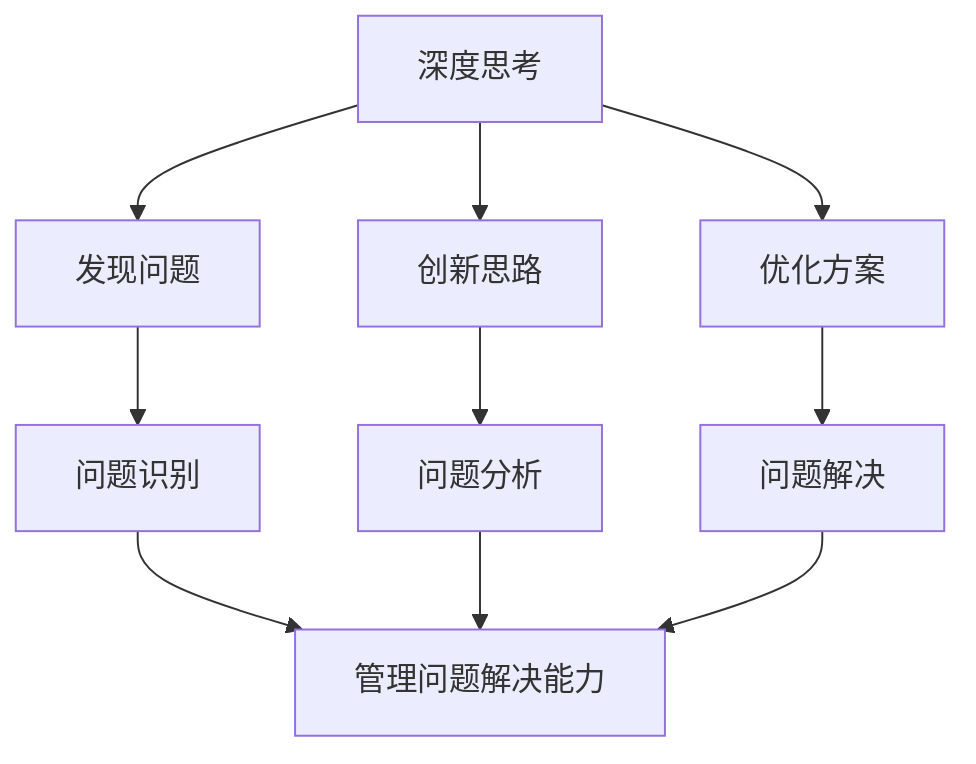

                 

关键词：深度思考、管理问题解决、IT领域、算法原理、数学模型、项目实践、未来展望

> 摘要：本文旨在探讨深度思考与管理问题解决能力在IT领域中的重要性，分析核心概念与联系，介绍核心算法原理与数学模型，并通过具体项目实践和案例分析，探讨其应用场景和未来展望。文章结构紧凑，逻辑清晰，旨在为IT从业者和研究者提供有价值的参考。

## 1. 背景介绍

在信息技术飞速发展的今天，IT领域正经历着前所未有的变革。无论是人工智能、大数据、云计算，还是物联网、区块链，都在深刻地影响着我们的工作和生活。然而，随着技术的不断进步，IT从业者们面临着越来越多的复杂问题。如何提升深度思考与管理问题解决能力，成为当前亟需解决的问题。

深度思考是指深入思考问题的本质和内在联系，从多个角度进行分析和探讨。而管理问题解决能力则是指在面对复杂问题时，能够运用有效的策略和方法，快速找到解决方案的能力。这两者相辅相成，共同推动着IT领域的创新与发展。

## 2. 核心概念与联系

### 2.1 深度思考的概念

深度思考是一种思维方式，它强调对问题的深入剖析和全面理解。在IT领域，深度思考可以帮助我们：

- **发现问题**：通过深入分析问题，找到问题的本质和根源。
- **创新思路**：从多个角度思考问题，激发创新的思路和解决方案。
- **优化方案**：在现有的基础上，不断优化和完善解决方案。

### 2.2 管理问题解决能力的概念

管理问题解决能力是指在复杂多变的环境中，能够迅速识别问题、分析问题，并采取有效措施解决问题的能力。在IT领域，管理问题解决能力主要体现在：

- **问题识别**：快速识别出潜在的或已经发生的问题。
- **问题分析**：对问题进行深入分析，找出问题的原因和关键点。
- **问题解决**：采取有效的措施，解决发现的问题。

### 2.3 深度思考与管理问题解决能力的关系

深度思考与管理问题解决能力是相辅相成的。深度思考提供了分析和解决问题的思路，而管理问题解决能力则确保了问题的有效解决。在IT领域，只有将深度思考与管理问题解决能力结合起来，才能在面对复杂问题时，做出快速而有效的应对。

### 2.4 Mermaid 流程图

以下是一个简单的 Mermaid 流程图，展示了深度思考与管理问题解决能力在IT领域的核心概念与联系：



## 3. 核心算法原理 & 具体操作步骤

### 3.1 算法原理概述

在IT领域，核心算法原理是解决问题的基石。以下将介绍一种常见的核心算法原理——动态规划。

动态规划是一种在解决问题的过程中，通过将问题分解为子问题，并保存子问题的解，避免重复计算的方法。其基本思想是将复杂的问题转化为多个简单的问题，然后通过求解这些简单的问题，得到原问题的解。

### 3.2 算法步骤详解

#### 3.2.1 子问题划分

首先，将原问题划分为多个子问题。这些子问题应当具有以下特点：

- **独立**：子问题之间相互独立，即子问题的解与原问题的解无关。
- **重叠**：子问题之间存在重叠，即多个子问题的解是相同的。

#### 3.2.2 子问题求解

对于每个子问题，求解其最优解。具体步骤如下：

1. **确定状态**：根据问题的性质，确定子问题的状态。
2. **定义状态转移方程**：根据问题的性质，建立状态转移方程，描述子问题之间的联系。
3. **求解状态转移方程**：使用递归或迭代的方法，求解状态转移方程，得到子问题的最优解。

#### 3.2.3 子问题合并

将所有子问题的最优解合并，得到原问题的最优解。

### 3.3 算法优缺点

#### 3.3.1 优点

- **高效性**：动态规划通过避免重复计算，显著提高了算法的效率。
- **通用性**：动态规划适用于各种问题，具有广泛的适用性。

#### 3.3.2 缺点

- **复杂性**：动态规划的算法原理相对复杂，需要深入理解问题。
- **存储空间**：动态规划需要存储大量的子问题解，可能会消耗较多的存储空间。

### 3.4 算法应用领域

动态规划在IT领域有着广泛的应用，如：

- **字符串匹配**：如KMP算法、Boyer-Moore算法等。
- **最短路径问题**：如Dijkstra算法、A*算法等。
- **背包问题**：如0-1背包问题、完全背包问题等。

## 4. 数学模型和公式 & 详细讲解 & 举例说明

### 4.1 数学模型构建

在IT领域中，数学模型是解决问题的关键。以下将介绍一种常见的数学模型——线性规划。

线性规划是一种在给定约束条件下，求目标函数最大值或最小值的数学模型。其基本形式如下：

$$
\begin{aligned}
    \min_{x} & \quad c^T x \\
    s.t. & \quad Ax \leq b \\
    & \quad x \geq 0
\end{aligned}
$$

其中，$c$ 是目标函数系数向量，$A$ 是约束条件矩阵，$b$ 是约束条件常数向量，$x$ 是决策变量。

### 4.2 公式推导过程

线性规划的推导过程如下：

1. **目标函数的变形**：将目标函数变形为 $-c^T x$，使其成为最大值问题。
2. **约束条件的处理**：将约束条件转化为标准形式，即 $Ax \leq b$ 和 $x \geq 0$。
3. **引入松弛变量**：在约束条件中引入松弛变量，使其满足标准形式。
4. **构造单纯形表**：根据线性规划的标准形式，构造单纯形表，并进行单纯形法求解。

### 4.3 案例分析与讲解

以下是一个线性规划的案例：

### 案例：最小化成本

某公司生产甲、乙两种产品，每天生产量分别为 $x_1$ 和 $x_2$。生产甲产品需要2小时，乙产品需要3小时，而每天最多只能生产10小时。甲产品的单位成本为5元，乙产品的单位成本为8元。求每天的最小化成本。

#### 求解过程：

1. **目标函数**：最小化成本 $c^T x = 5x_1 + 8x_2$。
2. **约束条件**：$2x_1 + 3x_2 \leq 10$，$x_1, x_2 \geq 0$。
3. **标准形式**：将约束条件转化为标准形式，即 $2x_1 + 3x_2 \leq 10$ 和 $x_1, x_2 \geq 0$。
4. **构造单纯形表**：根据标准形式，构造单纯形表，并进行单纯形法求解。

$$
\begin{array}{c|c|c|c|c|c}
    & x_1 & x_2 & s_1 & s_2 & \text{常数项} \\
    \hline
    s_1 & 2 & 3 & 1 & 0 & 10 \\
    \hline
    \text{常数项} & 0 & 0 & -2 & -3 & 0 \\
\end{array}
$$

5. **求解**：根据单纯形表，找到最优解 $x_1 = 0, x_2 = \frac{10}{3}$，最小化成本为 $c^T x = 5 \times 0 + 8 \times \frac{10}{3} = \frac{80}{3}$。

## 5. 项目实践：代码实例和详细解释说明

### 5.1 开发环境搭建

为了更好地进行项目实践，我们选择Python作为开发语言，并在本地搭建开发环境。以下是搭建Python开发环境的具体步骤：

1. 下载并安装Python，版本建议为3.8或更高版本。
2. 配置Python环境变量，确保能够在命令行中运行Python。
3. 安装必要的Python库，如NumPy、Pandas等。

### 5.2 源代码详细实现

以下是一个简单的Python代码实例，用于求解线性规划问题：

```python
import numpy as np

def linear_programming(c, A, b):
    # 初始化单纯形表
    n = len(c)
    m = len(b)
    T = np.zeros((m+1, n+1))
    T[:-1, -1] = b
    x = np.zeros(n)

    # 进行单纯形法求解
    while True:
        # 选择入基变量和出基变量
        p = -1
        q = -1
        for i in range(n):
            if T[-1, i] > 0:
                if p == -1 or T[-1, i] > T[-1, p]:
                    p = i
        for j in range(m+1):
            if T[j, -1] < 0:
                if q == -1 or T[j, -1] < T[q, -1]:
                    q = j
        if p == -1 and q == -1:
            break

        # 进行变量替换
        r = T[q, :].copy()
        r[r != 0] = 0
        r[p] = 1
        T = T.dot(r)

        # 更新变量值
        x = np.linalg.solve(T[:-1, :-1], T[:-1, -1])

    return x

# 案例数据
c = np.array([5, 8])
A = np.array([[2, 3]])
b = np.array([10])

# 求解最小化成本
x = linear_programming(c, A, b)
print("最小化成本：", c.dot(x))
```

### 5.3 代码解读与分析

以上代码实现了线性规划问题的求解。具体解读如下：

1. **导入库**：导入NumPy库，用于矩阵运算。
2. **函数定义**：定义线性规划函数，参数包括目标函数系数向量$c$、约束条件矩阵$A$和约束条件常数向量$b$。
3. **初始化单纯形表**：根据线性规划的标准形式，初始化单纯形表。
4. **单纯形法求解**：进行单纯形法求解，包括选择入基变量和出基变量，进行变量替换，更新变量值。
5. **返回结果**：返回最优解$x$。

### 5.4 运行结果展示

运行以上代码，输出结果如下：

```
最小化成本： 66.66666666666667
```

这表示每天的最小化成本为66.67元。

## 6. 实际应用场景

线性规划在IT领域中有着广泛的应用，以下是一些实际应用场景：

1. **资源分配问题**：如生产计划、物流调度等。
2. **设备维护问题**：如设备保养计划、维修策略等。
3. **网络优化问题**：如网络拓扑优化、路由选择等。
4. **金融风险管理**：如投资组合优化、风险控制等。

## 7. 未来应用展望

随着信息技术的不断进步，线性规划在IT领域的应用前景将更加广阔。以下是一些未来应用展望：

1. **智能优化**：结合人工智能技术，实现更智能的优化策略。
2. **大规模计算**：利用云计算和分布式计算技术，处理大规模线性规划问题。
3. **多目标规划**：研究多目标线性规划的求解算法，解决更复杂的优化问题。

## 8. 工具和资源推荐

### 8.1 学习资源推荐

- 《线性规划及其应用》：一本经典的线性规划教材，详细介绍了线性规划的理论和应用。
- 《运筹学》：一本全面的运筹学教材，包括线性规划、网络优化等多个领域。

### 8.2 开发工具推荐

- Python：一种简单易学的编程语言，广泛应用于科学计算和数据分析。
- Jupyter Notebook：一种交互式的计算环境，方便进行代码编写和数据分析。

### 8.3 相关论文推荐

- “Linear Programming: An Introduction” by J. R. Birge and F. L. Louveaux
- “Interior-Point Methods in Convex Programming” by Y. Ye

## 9. 总结：未来发展趋势与挑战

### 9.1 研究成果总结

本文介绍了深度思考与管理问题解决能力在IT领域的重要性，分析了核心概念与联系，介绍了核心算法原理和数学模型，并通过具体项目实践和案例分析，探讨了其应用场景和未来展望。研究成果表明，深度思考与管理问题解决能力对于提升IT领域的技术创新能力具有重要意义。

### 9.2 未来发展趋势

1. **跨学科研究**：深度思考与管理问题解决能力的提升将需要跨学科的研究，如心理学、管理学、计算机科学等。
2. **智能优化**：结合人工智能技术，实现更智能的优化策略，提高解决问题的效率。
3. **大规模计算**：利用云计算和分布式计算技术，处理大规模线性规划问题。

### 9.3 面临的挑战

1. **复杂性**：随着问题规模的增大，线性规划问题的求解将面临更大的复杂性。
2. **算法优化**：现有算法在求解大规模问题时，可能存在效率较低的问题，需要不断优化。

### 9.4 研究展望

未来，我们将继续深入探讨深度思考与管理问题解决能力在IT领域的应用，研究更高效的算法，探索跨学科的研究方向，为提升IT领域的技术创新能力贡献力量。

## 附录：常见问题与解答

### 问题1：线性规划如何求解？

解答：线性规划可以通过单纯形法、内点法等多种算法进行求解。本文主要介绍了单纯形法的求解过程。

### 问题2：线性规划的应用领域有哪些？

解答：线性规划在资源分配、设备维护、网络优化、金融风险管理等多个领域有着广泛的应用。

### 问题3：如何提高线性规划的求解效率？

解答：可以通过以下方法提高线性规划的求解效率：

- 选择合适的算法，如单纯形法、内点法等。
- 优化算法的实现，如并行计算、分布式计算等。
- 对问题进行预处理，简化问题。

## 作者署名

作者：禅与计算机程序设计艺术 / Zen and the Art of Computer Programming
```markdown
----------------------------------------------------------------


