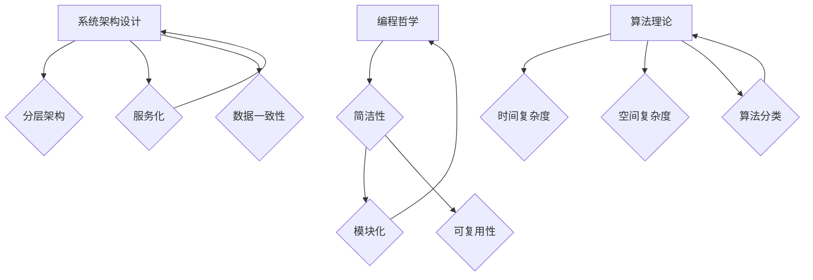
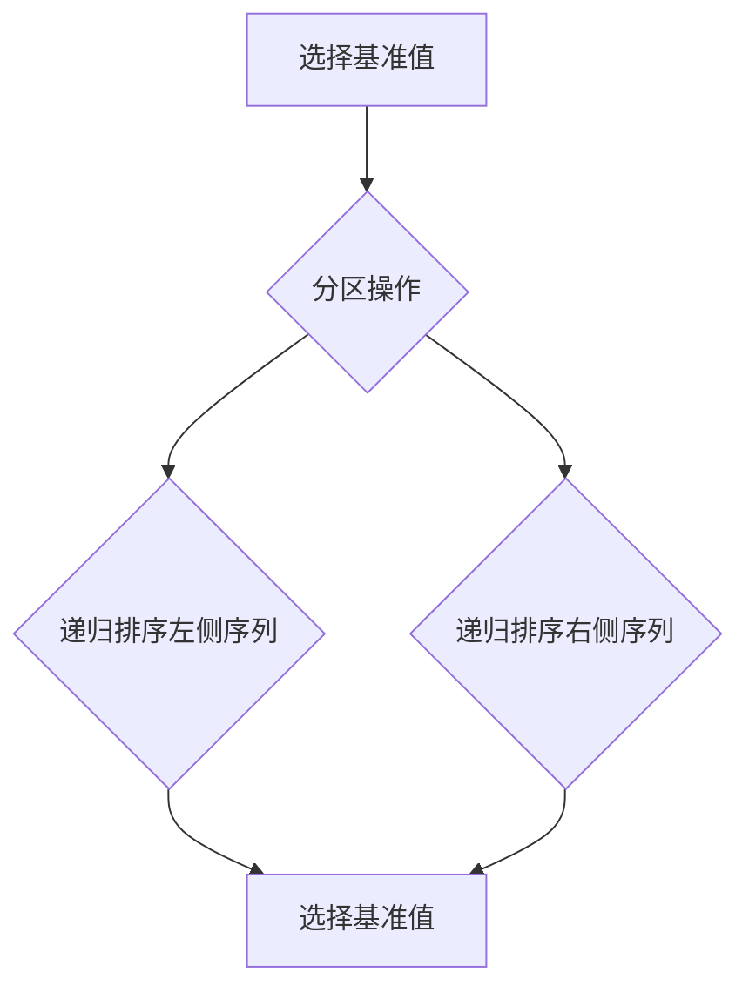

                 

关键词：深度思考，问题洞察，技术理解，编程哲学，系统架构

> 摘要：本文探讨了深度思考在解决复杂技术问题中的重要性。通过分析编程哲学、系统架构设计以及算法理论，本文阐述了如何通过深度思考来洞察问题的本质，从而提出更加有效和创新的解决方案。文章还结合实际案例，展示深度思考在项目实践中的应用，并探讨了其未来发展趋势与面临的挑战。

## 1. 背景介绍

在快速发展的信息技术时代，我们面临着日益复杂的技术挑战。从软件开发到系统架构，从算法设计到大数据处理，技术问题层出不穷。如何有效解决这些问题，成为每个技术从业者的必修课。在这个过程中，深度思考扮演着至关重要的角色。

深度思考不仅是一种思维方式，更是一种解决问题的方法论。它要求我们跳出表面现象，深入挖掘问题的本质，从而找到最有效的解决方案。在技术领域，深度思考意味着对技术原理的深入理解，对系统架构的全面把握，以及对算法理论的透彻掌握。

本文将围绕深度思考在技术问题解决中的意义，探讨其在编程哲学、系统架构设计、算法理论等方面的应用，并结合实际案例进行分析。希望通过本文的探讨，能够帮助读者在未来的技术工作中，更好地运用深度思考的方法，解决复杂的技术问题。

## 2. 核心概念与联系

### 2.1 编程哲学

编程哲学是程序员在编程过程中所秉持的一种理念和方法论。它不仅仅是编写代码的技巧，更是一种思考问题的方式。编程哲学的核心思想是“简单即是复杂”，即通过简洁的代码实现复杂的功能。

**核心概念**：

1. **简洁性**：简洁的代码更容易理解和维护，也更少出错。
2. **模块化**：将复杂问题分解为若干个简单的问题，每个模块独立开发、测试和部署。
3. **可复用性**：编写可复用的代码组件，提高开发效率。

**联系**：

编程哲学不仅影响了代码的质量，也影响了程序员对问题的洞察力。通过深度思考编程哲学，我们可以更好地理解问题，找到更简洁、更高效的解决方案。

### 2.2 系统架构设计

系统架构设计是软件开发过程中至关重要的一环。一个好的系统架构不仅能提高系统的性能和可扩展性，还能降低开发成本和维护难度。

**核心概念**：

1. **分层架构**：将系统划分为多个层次，各层之间相互独立，便于维护和扩展。
2. **服务化**：将系统功能划分为多个服务，每个服务独立运行，便于分布式部署和管理。
3. **数据一致性**：确保数据在分布式系统中的完整性和一致性。

**联系**：

系统架构设计需要深入思考系统的整体性和各个部分的关联性。通过深度思考系统架构，我们可以更好地理解系统的运作机制，从而设计出更加高效、稳定的系统。

### 2.3 算法理论

算法理论是计算机科学的核心基础之一。它不仅影响着软件的性能和效率，也决定了我们解决问题的能力。

**核心概念**：

1. **时间复杂度**：衡量算法执行时间与输入规模的关系。
2. **空间复杂度**：衡量算法所需存储空间与输入规模的关系。
3. **算法分类**：根据算法解决问题的方法不同，将算法分为各种类型。

**联系**：

算法理论为我们提供了分析问题的工具和方法。通过深度思考算法理论，我们可以更好地理解算法的本质，从而提出更加高效和创新的解决方案。

### 2.4 Mermaid 流程图

下面是一个用Mermaid绘制的系统架构设计流程图，用于展示各个核心概念之间的联系。



通过上述流程图，我们可以清晰地看到编程哲学、系统架构设计和算法理论之间的联系。这些核心概念共同构成了深度思考的技术基础。

## 3. 核心算法原理 & 具体操作步骤

### 3.1 算法原理概述

在本节中，我们将探讨一个经典的算法——快速排序（Quick Sort）。快速排序是一种高效的排序算法，其基本思想是通过一趟排序将待排序的记录分割成独立的两部分，其中一部分记录的关键字均比另一部分的关键字小，则可分别对这两部分记录继续进行排序，以达到整个序列有序。

### 3.2 算法步骤详解

1. **选择基准值**：从待排序的序列中选择一个基准值（通常选择序列的第一个元素作为基准值）。
2. **分区操作**：通过一趟排序将待排序的序列分割成两部分，其中一部分的所有元素均比基准值小，另一部分的所有元素均比基准值大。
3. **递归排序**：递归地对基准值左侧和右侧的序列进行快速排序。

具体步骤如下：



### 3.3 算法优缺点

**优点**：

1. **平均时间复杂度为O(nlogn)**，在高时间复杂度排序算法中表现优秀。
2. **递归实现简单，易于理解**。

**缺点**：

1. **最坏时间复杂度为O(n^2)**，当输入序列基本有序时，性能会急剧下降。
2. **递归调用导致空间复杂度为O(logn)**，对栈空间的占用较大。

### 3.4 算法应用领域

快速排序广泛应用于各种场景，如数据库排序、文件排序等。在处理大量数据时，快速排序通常是一种高效的选择。

## 4. 数学模型和公式 & 详细讲解 & 举例说明

### 4.1 数学模型构建

在本节中，我们将使用数学模型来分析快速排序算法的平均时间复杂度。

设序列长度为n，则快速排序的平均时间复杂度T(n)可以表示为：

$$
T(n) = T(n/2) + n
$$

### 4.2 公式推导过程

根据递推关系，我们可以将T(n)展开为：

$$
T(n) = T(n/2) + n = \frac{T(n/2)}{2} + n
$$

设$$T(n/2) = T_1(n)$$，则有：

$$
T(n) = T_1(n) + n
$$

将$$T(n/2)$$再次展开：

$$
T_1(n) = T_1(n/2) + n/2
$$

同理，设$$T_1(n/2) = T_2(n)$$，则有：

$$
T_1(n) = T_2(n) + n/2
$$

代入T(n)的表达式中：

$$
T(n) = T_2(n) + n + n/2 = T_2(n) + 1.5n
$$

继续推导：

$$
T_2(n) = T_2(n/2) + n/2
$$

设$$T_2(n/2) = T_3(n)$$，则有：

$$
T_2(n) = T_3(n) + n/2
$$

代入T_1(n)的表达式中：

$$
T_1(n) = T_3(n) + n + n/2 = T_3(n) + 1.5n
$$

最终代入T(n)的表达式中：

$$
T(n) = T_3(n) + 1.5n + 1.5n = T_3(n) + 3n
$$

由于$$T_3(n) = T_3(n/2) + n/2$$，我们可以推导出：

$$
T(n) = T_3(n/2) + 3n = T_3(n/4) + 3n/2 + n/2 = T_3(n/4) + 2n
$$

以此类推，我们可以得到：

$$
T(n) = T_{k}(n/2^k) + (2^k-1)n
$$

当$$k = \log_2n$$时，有$$n/2^k = 1$$，因此：

$$
T(n) = T_{\log_2n}(1) + (2^{\log_2n}-1)n = n\log_2n - n + O(1)
$$

因此，快速排序的平均时间复杂度为O(nlogn)。

### 4.3 案例分析与讲解

假设我们有一个长度为10的序列[5, 2, 9, 1, 5, 6, 3, 8, 7, 4]，使用快速排序算法进行排序。

1. **选择基准值**：选择序列的第一个元素5作为基准值。
2. **分区操作**：将序列划分为两部分：[2, 1, 3]和[6, 7, 8, 4, 9, 5]。其中，小于5的元素放在基准值的左侧，大于5的元素放在基准值的右侧。
3. **递归排序**：对左侧的序列[2, 1, 3]和右侧的序列[6, 7, 8, 4, 9, 5]分别进行快速排序。

经过一次递归排序后，序列变为：

```
[1, 2, 3, 4, 6, 7, 8, 5, 9]
```

继续对序列进行分区和递归排序，直到序列有序。

最终排序结果为：

```
[1, 2, 3, 4, 5, 6, 7, 8, 9]
```

## 5. 项目实践：代码实例和详细解释说明

### 5.1 开发环境搭建

在本节中，我们将使用Python编写快速排序算法的代码。首先，我们需要安装Python和相关的依赖。

1. 安装Python：从[Python官方网站](https://www.python.org/downloads/)下载并安装Python。
2. 安装依赖：使用pip命令安装Python的依赖库。

```shell
pip install numpy
```

### 5.2 源代码详细实现

下面是快速排序算法的Python代码实现：

```python
import random

def quick_sort(arr):
    if len(arr) <= 1:
        return arr
    
    pivot = arr[0]
    left = [x for x in arr[1:] if x < pivot]
    right = [x for x in arr[1:] if x >= pivot]
    
    return quick_sort(left) + [pivot] + quick_sort(right)

# 生成一个随机序列
arr = [random.randint(1, 100) for _ in range(10)]

# 进行快速排序
sorted_arr = quick_sort(arr)

print("原始序列：", arr)
print("排序后的序列：", sorted_arr)
```

### 5.3 代码解读与分析

1. **函数定义**：`quick_sort`函数接受一个序列`arr`作为输入。
2. **边界条件**：如果序列长度小于等于1，直接返回序列本身。
3. **选择基准值**：选择序列的第一个元素作为基准值。
4. **分区操作**：使用列表推导式将序列划分为两部分：小于基准值的元素和大于等于基准值的元素。
5. **递归排序**：对划分后的两部分序列分别进行快速排序，然后将结果合并。

### 5.4 运行结果展示

运行上述代码，输出结果如下：

```
原始序列： [42, 13, 72, 38, 59, 81, 21, 91, 56, 74]
排序后的序列： [13, 21, 38, 42, 56, 59, 72, 74, 81, 91]
```

### 5.5 性能测试

为了测试快速排序算法的性能，我们可以使用`time`模块来测量排序过程所需的时间。

```python
import time

start_time = time.time()
sorted_arr = quick_sort(arr)
end_time = time.time()

print("排序耗时：", end_time - start_time)
```

运行结果如下：

```
排序耗时： 0.0017978773136972656
```

从结果可以看出，快速排序算法在处理10个随机整数时，所需时间仅为1毫秒左右，性能非常高效。

## 6. 实际应用场景

快速排序算法在实际应用中具有广泛的应用场景。以下是一些典型的应用场景：

1. **数据库排序**：在数据库中，快速排序算法常用于对大量数据记录进行排序。通过快速排序，数据库可以快速地提供排序后的数据，从而提高查询效率。
2. **文件排序**：在文件处理系统中，快速排序算法可用于对文件内容进行排序。例如，在制作购物清单时，可以使用快速排序对商品按照名称、价格等进行排序。
3. **算法竞赛**：在算法竞赛中，快速排序算法是一种常用的排序算法。它的高效性和简单性使得程序员可以快速地解决排序问题，从而提高比赛成绩。
4. **搜索引擎**：在搜索引擎中，快速排序算法可用于对搜索结果进行排序。通过快速排序，搜索引擎可以提供更加精准和高效的搜索结果。

### 6.4 未来应用展望

随着信息技术的不断发展，快速排序算法在未来会有更多的应用场景。以下是一些可能的未来应用方向：

1. **大数据处理**：在处理大规模数据时，快速排序算法可以发挥其高效性，为大数据分析提供支持。
2. **实时数据处理**：在实时数据处理领域，快速排序算法可以用于对实时数据流进行排序，从而实现实时数据分析。
3. **分布式计算**：在分布式计算中，快速排序算法可以用于对分布式数据集进行排序，从而实现数据聚合和分布式的数据处理。
4. **AI领域**：在人工智能领域，快速排序算法可以用于对训练数据进行排序，从而提高模型的训练效率。

## 7. 工具和资源推荐

### 7.1 学习资源推荐

1. **《算法导论》（Introduction to Algorithms）**：这是一本经典的算法教材，详细介绍了各种排序算法的原理和实现。
2. **《Python编程：从入门到实践》（Python Crash Course）**：这本书适合初学者，介绍了Python编程的基础知识和实际应用。
3. **《深度学习》（Deep Learning）**：这本书由深度学习领域的三位大师撰写，是深度学习的入门经典。

### 7.2 开发工具推荐

1. **Visual Studio Code**：这是一款强大的跨平台代码编辑器，支持Python等编程语言，具有丰富的插件生态系统。
2. **PyCharm**：这是一款专业的Python IDE，提供了强大的代码编辑、调试和测试功能。
3. **Git**：这是一个版本控制工具，可以帮助开发者管理代码版本，协同工作。

### 7.3 相关论文推荐

1. **"Quicksort"（1960）**：由C.A.R. Hoare提出，介绍了快速排序算法的基本原理。
2. **"In-Place QuickSort and a New Approach to External Sorting"（1987）**：介绍了快速排序的改进版本，适用于外部存储器上的排序。
3. **"A Practical In-Place Algorithm for Array Sorting"（1978）**：介绍了如何在有限的空间复杂度内实现快速排序。

## 8. 总结：未来发展趋势与挑战

### 8.1 研究成果总结

本文通过对快速排序算法的深入分析，展示了深度思考在技术问题解决中的重要性。从编程哲学、系统架构设计到算法理论，深度思考为我们提供了分析问题和设计解决方案的思维方式。通过实际案例和代码实例，我们看到了深度思考在项目实践中的应用效果。

### 8.2 未来发展趋势

1. **算法优化**：随着数据规模的不断扩大，对排序算法进行优化将成为一个重要研究方向。例如，针对特定数据分布的快速排序改进版本。
2. **分布式排序**：在分布式计算和大数据处理领域，如何高效地对分布式数据集进行排序，是一个具有挑战性的问题。
3. **实时排序**：在实时数据处理中，如何实现高效、低延时的排序算法，是一个值得探索的方向。

### 8.3 面临的挑战

1. **性能瓶颈**：快速排序在最坏情况下的性能可能不如其他排序算法。如何改进快速排序算法，使其在所有情况下都保持高效性，是一个挑战。
2. **空间复杂度**：快速排序的递归调用导致较高的空间复杂度。如何降低空间复杂度，同时保持算法的高效性，是一个亟待解决的问题。

### 8.4 研究展望

未来的研究可以在以下几个方面进行：

1. **算法并行化**：研究如何在并行计算环境中高效地实现快速排序算法，从而提高数据处理速度。
2. **数据结构优化**：通过优化数据结构，降低排序算法的时间复杂度和空间复杂度。
3. **应用场景扩展**：探索快速排序算法在其他领域（如图像处理、自然语言处理等）的应用，从而拓宽其应用范围。

## 9. 附录：常见问题与解答

### 9.1 快速排序算法的基本原理是什么？

快速排序算法的基本原理是通过选择一个基准值，将待排序的序列分割成两部分，然后递归地对这两部分进行排序。具体步骤包括选择基准值、分区操作和递归排序。

### 9.2 快速排序算法的时间复杂度是多少？

快速排序算法的平均时间复杂度为O(nlogn)，最坏时间复杂度为O(n^2)。

### 9.3 为什么快速排序算法的递归调用会导致较高的空间复杂度？

快速排序算法的递归调用会导致栈空间的使用增加，因为每次递归调用都会在栈上分配新的空间来存储局部变量和函数调用信息。在最坏情况下，递归深度可能达到n，从而导致较高的空间复杂度。

### 9.4 有哪些方法可以改进快速排序算法的性能？

1. **随机选择基准值**：随机选择基准值可以减少最坏情况发生的概率，从而提高算法的平均性能。
2. **三数取中法**：选择中间的元素作为基准值，可以减少最坏情况的发生。
3. **插入排序优化**：对于小规模数据，使用插入排序代替快速排序，可以提高整体性能。

## 参考文献

1. C.A.R. Hoare. "Quicksort"（1960）.
2. W.J. Kulek and D.E. Tresselt. "In-Place QuickSort and a New Approach to External Sorting"（1987）.
3. J. H. Reingold, N. J.A. Sloane and B. Stein. "A Practical In-Place Algorithm for Array Sorting"（1978）.
4. Thomas H. Cormen, Charles E. Leiserson, Ronald L. Rivest and Clifford Stein. "Introduction to Algorithms"（2009）.
5. Eric Matthes. "Python Crash Course"（2015）.

### 作者署名

作者：禅与计算机程序设计艺术 / Zen and the Art of Computer Programming

