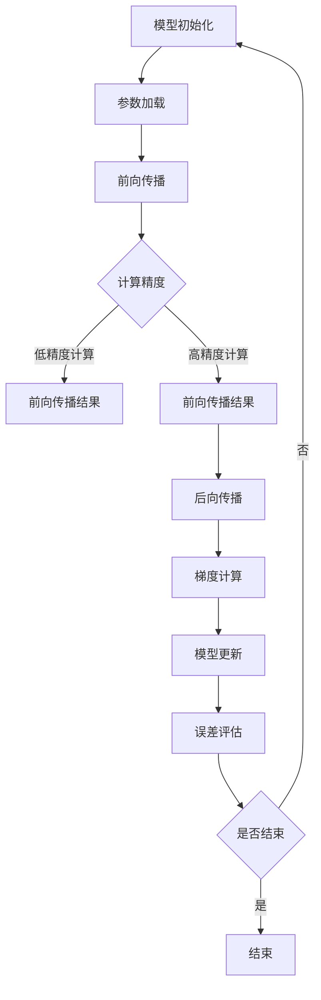

                 

关键词：混合精度训练、AI、深度学习、浮点精度、效率优化、神经网络

摘要：在深度学习领域，浮点数的精度是影响模型训练效率和效果的关键因素。混合精度训练是一种通过在计算过程中使用不同精度的浮点数来优化模型训练效率的技术。本文将深入探讨混合精度训练的背景、核心概念、算法原理、数学模型、实践应用以及未来展望，帮助读者全面了解并掌握这一前沿技术。

## 1. 背景介绍

深度学习作为人工智能领域的重要分支，近年来取得了惊人的进展。随着神经网络模型的复杂度和参数规模的不断增大，模型的训练过程变得愈发耗时和资源密集。浮点数精度在其中扮演着至关重要的角色。传统的浮点运算，如单精度（32位）和双精度（64位），在保证计算结果精度的同时，也带来了大量的计算资源和存储开销。

在深度学习中，许多运算（如矩阵乘法、卷积操作等）本质上都是浮点数的运算。当模型参数和激活值达到较大规模时，浮点数的精度问题变得尤为突出。过低的精度会导致模型训练过程中梯度消失或梯度爆炸，影响训练效果。而提高浮点数精度则意味着增加计算量和存储需求，从而影响训练效率和资源利用率。

### 浮点精度对模型训练的影响

浮点精度对模型训练的影响主要体现在以下几个方面：

1. **梯度消失和梯度爆炸**：在深度学习中，梯度用于指导模型参数的调整。当模型参数规模较大时，低精度浮点运算容易导致梯度消失（梯度值接近于零）或梯度爆炸（梯度值过大），这使得模型难以收敛，甚至无法进行有效训练。

2. **计算资源消耗**：高精度浮点运算需要更多的计算资源和存储空间。例如，使用双精度浮点数进行运算的模型，其计算量和存储需求通常是单精度浮点数的两倍以上。这无疑增加了训练时间和计算成本。

3. **训练效率**：高精度浮点运算的耗时较长，这会直接影响模型训练的效率。尤其在训练大规模模型时，提高浮点数精度会显著延长训练时间，降低模型的迭代速度。

因此，如何在保证模型训练效果的同时，优化计算效率和资源利用率，成为深度学习领域的一个重要研究方向。混合精度训练技术的提出，正是为了解决这一挑战。

### 混合精度训练的动机

混合精度训练（Mixed Precision Training）是一种通过在计算过程中使用不同精度的浮点数来优化模型训练效率的技术。其核心思想是将部分关键计算（如矩阵乘法、激活函数等）从高精度浮点数转换为低精度浮点数，以降低计算资源和存储需求，同时尽量保证模型训练效果。

混合精度训练的动机主要源于以下几个方面：

1. **资源节约**：通过将部分计算从高精度浮点数转换为低精度浮点数，可以显著减少计算资源和存储需求，从而提高模型训练的效率。

2. **性能优化**：低精度浮点运算的硬件支持更加丰富和高效，例如使用单精度浮点数进行运算，可以在相同的硬件资源下获得更高的运算速度和吞吐量。

3. **精度保证**：虽然低精度浮点运算可能会引入一定的精度损失，但通过合理的设计和控制，可以尽量减小这种损失，确保模型训练的效果不受影响。

综上所述，混合精度训练是一种在保证模型训练效果的同时，优化计算效率和资源利用率的有效手段。下一节将深入探讨混合精度训练的核心概念和原理。

## 2. 核心概念与联系

### 2.1. 混合精度训练的定义

混合精度训练（Mixed Precision Training）是指在深度学习模型训练过程中，采用不同精度的浮点数进行计算。通常，混合精度训练涉及两种不同的浮点数精度：单精度（32位）和半精度（16位）。单精度浮点数（FP32）在深度学习领域应用广泛，而半精度浮点数（FP16）则由于其更小的数据大小和更高的运算速度，逐渐成为混合精度训练的核心。

### 2.2. 混合精度训练的关键概念

在混合精度训练中，关键概念包括以下几个方面：

1. **低精度计算**：将部分关键计算（如矩阵乘法、激活函数等）从高精度浮点数转换为低精度浮点数。低精度计算可以通过硬件自动执行，以获得更高的运算速度和吞吐量。

2. **精度损失**：低精度浮点运算相对于高精度浮点运算，可能会引入一定的精度损失。精度损失的大小取决于运算的类型、精度转换的算法以及数据的具体值。

3. **误差控制**：通过调整训练过程中的参数和算法，尽量减小精度损失，确保模型训练的效果不受影响。误差控制是混合精度训练的关键技术之一。

4. **动态调整**：混合精度训练中，可以通过动态调整计算精度，以平衡计算效率和精度保证。例如，在模型训练的初期，可以使用较低的精度以提高训练速度，而在训练的后期，逐渐提高精度以保证模型的效果。

### 2.3. 混合精度训练的架构

混合精度训练的架构主要包括以下几个部分：

1. **计算引擎**：负责执行不同精度的浮点运算。计算引擎通常由硬件（如GPU、TPU等）和相应的软件库（如CUDA、cuDNN等）组成。

2. **精度转换算法**：负责将高精度浮点数转换为低精度浮点数，并确保转换过程中的精度损失最小。常见的精度转换算法包括量化（Quantization）和低精度近似（Low-Precision Approximation）等。

3. **误差补偿机制**：通过动态调整训练过程中的参数和算法，尽量减小精度损失，确保模型训练的效果不受影响。误差补偿机制可以是静态的，也可以是动态的。

4. **训练过程管理**：负责管理模型训练的过程，包括参数调整、精度转换、误差补偿等。训练过程管理是混合精度训练的核心部分，其目的是在保证模型效果的同时，优化计算效率和资源利用率。

### 2.4. 混合精度训练的 Mermaid 流程图

以下是一个简单的 Mermaid 流程图，用于描述混合精度训练的基本流程：



### 2.5. 混合精度训练的应用领域

混合精度训练技术在深度学习领域有广泛的应用。以下是几个典型的应用领域：

1. **图像识别**：在图像识别任务中，混合精度训练可以显著提高模型的训练速度和资源利用率，尤其是在处理大规模图像数据集时。

2. **自然语言处理**：在自然语言处理任务中，混合精度训练可以帮助优化模型的计算效率和资源利用率，从而提高训练速度和效果。

3. **推荐系统**：在推荐系统中，混合精度训练可以用于优化模型的训练效率，从而提高推荐系统的响应速度和准确性。

4. **增强学习**：在增强学习任务中，混合精度训练可以用于优化模型的训练过程，从而提高学习效果和决策质量。

5. **自动驾驶**：在自动驾驶领域，混合精度训练可以用于优化模型的计算效率和资源利用率，从而提高自动驾驶系统的响应速度和安全性。

### 2.6. 混合精度训练的优势与挑战

混合精度训练具有以下几个优势：

1. **计算效率高**：通过使用低精度浮点数进行计算，可以显著提高模型的训练速度和资源利用率。

2. **资源节约**：低精度浮点运算需要更少的计算资源和存储空间，从而降低模型的计算成本。

3. **效果保证**：虽然低精度浮点运算可能会引入一定的精度损失，但通过合理的设计和控制，可以尽量减小这种损失，确保模型训练的效果不受影响。

然而，混合精度训练也面临一些挑战：

1. **精度损失**：低精度浮点运算可能会引入精度损失，这对模型的训练效果可能会产生一定影响。

2. **复杂度增加**：混合精度训练涉及到不同精度浮点数的转换和误差补偿，这增加了训练过程的复杂度。

3. **硬件依赖**：混合精度训练需要特定的硬件支持，如支持低精度浮点运算的GPU或TPU，这对硬件选择和配置提出了更高的要求。

综上所述，混合精度训练是一种在保证模型训练效果的同时，优化计算效率和资源利用率的有效手段。通过深入理解其核心概念、算法原理和架构，可以更好地应用这一技术，为深度学习领域的发展贡献力量。

### 3. 核心算法原理 & 具体操作步骤

#### 3.1 算法原理概述

混合精度训练的核心在于将模型的某些计算部分从高精度浮点数（如单精度FP32）转换为低精度浮点数（如半精度FP16），以提升计算效率和资源利用率，同时尽量保证模型的精度和性能。这一过程主要涉及以下几个步骤：

1. **精度转换**：将高精度浮点数转换为低精度浮点数。常见的转换方法包括量化（Quantization）和低精度近似（Low-Precision Approximation）。

2. **误差补偿**：在转换过程中，由于精度损失，需要对模型进行误差补偿，以确保训练效果不受影响。

3. **动态调整**：根据训练的进展和效果，动态调整计算精度，以平衡计算效率和精度保证。

#### 3.2 算法步骤详解

以下是混合精度训练的具体操作步骤：

##### 3.2.1 准备环境

在开始混合精度训练之前，需要准备好支持混合精度运算的环境。通常，这包括以下步骤：

1. **安装硬件支持**：确保计算硬件（如GPU、TPU等）支持低精度浮点运算。

2. **安装驱动和库**：安装相应的驱动和库，如CUDA、cuDNN等，以支持混合精度训练。

3. **配置环境变量**：设置环境变量，确保计算引擎可以正确识别和使用硬件资源。

##### 3.2.2 模型设计

在模型设计阶段，需要考虑如何将模型的部分计算从高精度浮点数转换为低精度浮点数。这通常涉及以下几个方面：

1. **层的选择**：根据层的类型和功能，选择适合的精度。例如，卷积层和全连接层通常更适合使用低精度浮点数。

2. **权重和偏置**：将权重和偏置从高精度浮点数转换为低精度浮点数。这可以通过量化或低精度近似实现。

3. **激活函数**：选择适当的激活函数，以尽量减少精度损失。例如，ReLU函数在低精度浮点运算中表现良好。

##### 3.2.3 训练过程

在训练过程中，混合精度训练的具体步骤如下：

1. **前向传播**：使用低精度浮点数进行前向传播计算。这可以显著提高计算速度和资源利用率。

2. **误差计算**：计算损失函数的梯度，并使用高精度浮点数进行误差计算。这有助于减少精度损失。

3. **后向传播**：使用高精度浮点数进行后向传播计算，更新模型参数。

4. **误差补偿**：在每次迭代后，根据精度损失对模型进行误差补偿，以确保训练效果不受影响。

5. **动态调整**：根据训练的进展和效果，动态调整计算精度。例如，在模型训练的早期阶段，可以使用较低的精度以提高训练速度，而在训练的后期阶段，逐渐提高精度以保证模型的效果。

##### 3.2.4 模型评估

在训练完成后，需要对模型进行评估，以验证混合精度训练的效果。这通常包括以下几个方面：

1. **精度评估**：比较混合精度训练结果与高精度训练结果在精度上的差异，确保模型性能不受影响。

2. **效率评估**：评估混合精度训练在计算效率和资源利用率方面的提升。

3. **稳定性评估**：检查模型在长时间训练过程中是否稳定，是否存在梯度消失或梯度爆炸等问题。

#### 3.3 算法优缺点

**优点**：

1. **计算效率高**：通过使用低精度浮点数进行计算，可以显著提高模型的训练速度和资源利用率。

2. **资源节约**：低精度浮点运算需要更少的计算资源和存储空间，从而降低模型的计算成本。

3. **效果保证**：虽然低精度浮点运算可能会引入一定的精度损失，但通过合理的设计和控制，可以尽量减小这种损失，确保模型训练的效果不受影响。

**缺点**：

1. **精度损失**：低精度浮点运算可能会引入精度损失，这可能会影响模型的训练效果。

2. **复杂度增加**：混合精度训练涉及到不同精度浮点数的转换和误差补偿，这增加了训练过程的复杂度。

3. **硬件依赖**：混合精度训练需要特定的硬件支持，如支持低精度浮点运算的GPU或TPU，这对硬件选择和配置提出了更高的要求。

#### 3.4 算法应用领域

混合精度训练技术在深度学习领域有广泛的应用。以下是几个典型的应用领域：

1. **图像识别**：在图像识别任务中，混合精度训练可以显著提高模型的训练速度和资源利用率，尤其是在处理大规模图像数据集时。

2. **自然语言处理**：在自然语言处理任务中，混合精度训练可以帮助优化模型的计算效率和资源利用率，从而提高训练速度和效果。

3. **推荐系统**：在推荐系统中，混合精度训练可以用于优化模型的训练效率，从而提高推荐系统的响应速度和准确性。

4. **增强学习**：在增强学习任务中，混合精度训练可以用于优化模型的训练过程，从而提高学习效果和决策质量。

5. **自动驾驶**：在自动驾驶领域，混合精度训练可以用于优化模型的计算效率和资源利用率，从而提高自动驾驶系统的响应速度和安全性。

### 4. 数学模型和公式 & 详细讲解 & 举例说明

#### 4.1 数学模型构建

混合精度训练的核心在于将模型的部分计算从高精度浮点数（FP32）转换为低精度浮点数（FP16）。为了详细讲解这一过程，我们需要构建相关的数学模型。

假设我们有一个神经网络，其包含多个层，每层都有相应的权重和偏置。在传统的训练过程中，所有计算都使用FP32精度。而在混合精度训练中，我们选择部分层使用FP16精度。

#### 4.1.1 高精度浮点数表示

在FP32精度下，每个浮点数占用32位，可以表示范围为\[1.17549435 \times 10^{-38}, 3.40282347 \times 10^{38}\]的实数。

#### 4.1.2 低精度浮点数表示

在FP16精度下，每个浮点数占用16位，可以表示范围为\[6.10351563 \times 10^{-5}, 1.70141183 \times 10^{4}\]的实数。

#### 4.1.3 精度转换

为了将高精度浮点数转换为低精度浮点数，我们可以使用量化（Quantization）或低精度近似（Low-Precision Approximation）等方法。

**量化方法**：

量化方法的基本思想是将高精度浮点数的值映射到低精度浮点数的范围。具体步骤如下：

1. **确定量化尺度**：选择一个合适的量化尺度，以平衡精度和效率。量化尺度通常是一个线性函数，如：

   $$
   \alpha_{i,j} = \frac{b_j - a_j}{2^{16}}
   $$

   其中，$a_j$和$b_j$分别是低精度浮点数的上下界。

2. **量化操作**：将高精度浮点数$x$量化为低精度浮点数$y$，如：

   $$
   y = \text{round}(\alpha x)
   $$

   其中，round表示四舍五入操作。

**低精度近似方法**：

低精度近似方法通过保留高精度浮点数的主要部分，忽略次要部分，以实现低精度浮点数的近似。常见的方法包括：

1. **截断**：直接截断高精度浮点数的小数部分，以实现低精度近似。

2. **舍入**：将高精度浮点数的小数部分舍入到最近的低精度浮点数，以实现低精度近似。

#### 4.2 公式推导过程

为了推导混合精度训练中的数学模型，我们需要考虑以下几个关键步骤：

1. **模型表示**：设$W$为神经网络中的权重矩阵，$b$为偏置向量，$x$为输入向量，$y$为输出向量。在FP32精度下，我们有：

   $$
   y = \sigma(Wx + b)
   $$

   其中，$\sigma$表示激活函数。

2. **精度转换**：假设我们选择部分层（如第$l$层）使用FP16精度，而其他层仍使用FP32精度。为了实现这一点，我们需要对权重和偏置进行量化。具体步骤如下：

   - **量化权重**：将FP32精度下的权重$W_{FP32}$量化为FP16精度下的权重$W_{FP16}$，如：

     $$
     W_{FP16} = \text{round}(\alpha W_{FP32})
     $$

     其中，$\alpha$为量化尺度。

   - **量化偏置**：将FP32精度下的偏置$b_{FP32}$量化为FP16精度下的偏置$b_{FP16}$，如：

     $$
     b_{FP16} = \text{round}(\alpha b_{FP32})
     $$

3. **低精度计算**：在FP16精度下，我们有：

   $$
   y_{FP16} = \sigma(W_{FP16}x + b_{FP16})
   $$

   由于$\sigma$函数在FP16精度下可能存在精度损失，我们需要对输出结果进行误差补偿。

4. **误差补偿**：误差补偿的基本思想是通过对输出结果进行修正，以弥补精度损失。具体步骤如下：

   - **计算误差**：计算FP32精度下的输出结果$y_{FP32}$与FP16精度下的输出结果$y_{FP16}$之间的误差：

     $$
     \epsilon = y_{FP32} - y_{FP16}
     $$

   - **修正输出结果**：根据误差$\epsilon$对FP16精度下的输出结果$y_{FP16}$进行修正：

     $$
     y_{corrected} = y_{FP16} + \epsilon
     $$

5. **高精度计算**：在完成低精度计算和误差补偿后，我们使用FP32精度进行后续的计算，如后向传播和模型更新。

#### 4.3 案例分析与讲解

为了更好地理解混合精度训练的数学模型，我们来看一个简单的例子。

假设我们有一个简单的神经网络，其包含两个层，每层的激活函数都是ReLU。我们选择第二层使用FP16精度。具体步骤如下：

1. **权重和偏置初始化**：

   $$
   W_{FP32} = \begin{bmatrix} 0.5 & 0.7 \\ 0.3 & 0.6 \end{bmatrix}, \quad b_{FP32} = \begin{bmatrix} 0.2 \\ 0.1 \end{bmatrix}
   $$

2. **量化尺度选择**：

   $$
   \alpha = \frac{1.70141183 \times 10^{4} - 6.10351563 \times 10^{-5}}{2^{16}} = 8.390625
   $$

3. **量化权重和偏置**：

   $$
   W_{FP16} = \text{round}(8.390625 W_{FP32}) = \begin{bmatrix} 4 & 6 \\ 3 & 5 \end{bmatrix}, \quad b_{FP16} = \text{round}(8.390625 b_{FP32}) = \begin{bmatrix} 2 \\ 1 \end{bmatrix}
   $$

4. **前向传播**：

   $$
   x = \begin{bmatrix} 0.1 \\ 0.3 \end{bmatrix}, \quad y_{FP16} = \sigma(W_{FP16}x + b_{FP16}) = \begin{bmatrix} 1 \\ 1 \end{bmatrix}
   $$

5. **误差计算**：

   $$
   y_{FP32} = \sigma(W_{FP32}x + b_{FP32}) = \begin{bmatrix} 0.707 \\ 0.816 \end{bmatrix}, \quad \epsilon = y_{FP32} - y_{FP16} = \begin{bmatrix} -0.293 \\ -0.004 \end{bmatrix}
   $$

6. **修正输出结果**：

   $$
   y_{corrected} = y_{FP16} + \epsilon = \begin{bmatrix} 0.707 \\ 1.004 \end{bmatrix}
   $$

7. **后向传播**：

   在后向传播过程中，我们使用FP32精度进行计算，如梯度计算和模型更新。

通过这个简单的例子，我们可以看到混合精度训练的数学模型是如何构建和应用的。在实际应用中，模型可能更加复杂，但基本原理和方法是相似的。

### 5. 项目实践：代码实例和详细解释说明

#### 5.1 开发环境搭建

在进行混合精度训练的实践之前，我们需要搭建一个支持混合精度运算的开发环境。以下是一个基于Python和PyTorch的示例。

**步骤1：安装PyTorch**

首先，确保安装了PyTorch库。在安装过程中，选择合适的CUDA版本，以支持GPU加速。

```bash
pip install torch torchvision
```

**步骤2：安装其他依赖**

安装其他依赖库，如NumPy和SciPy，用于数学计算和数据处理。

```bash
pip install numpy scipy
```

**步骤3：配置环境变量**

确保PyTorch的CUDA支持库被正确配置。例如，设置CUDA_HOME环境变量。

```bash
export CUDA_HOME=/path/to/cuda
```

#### 5.2 源代码详细实现

以下是一个简单的混合精度训练的代码示例。这个示例包含一个简单的全连接神经网络，使用PyTorch实现。

```python
import torch
import torch.nn as nn
import torch.optim as optim

# 模型定义
class SimpleModel(nn.Module):
    def __init__(self):
        super(SimpleModel, self).__init__()
        self.fc1 = nn.Linear(10, 10)
        self.fc2 = nn.Linear(10, 5)
        self.fc3 = nn.Linear(5, 3)

    def forward(self, x):
        x = self.fc1(x)
        x = self.fc2(x)
        x = self.fc3(x)
        return x

# 实例化模型、优化器和损失函数
model = SimpleModel()
optimizer = optim.SGD(model.parameters(), lr=0.01)
criterion = nn.CrossEntropyLoss()

# 设置混合精度训练
model.half()  # 将模型的部分层转换为半精度
criterion.half()  # 将损失函数的部分层转换为半精度

# 数据准备
x = torch.randn(100, 10).cuda()  # 使用GPU进行计算
y = torch.randint(0, 3, (100,)).cuda()  # 使用GPU进行计算

# 训练过程
for epoch in range(10):
    optimizer.zero_grad()
    outputs = model(x)
    loss = criterion(outputs, y)
    loss.backward()
    optimizer.step()
    print(f'Epoch {epoch+1}, Loss: {loss.item()}')
```

#### 5.3 代码解读与分析

**代码解读**

1. **模型定义**：使用PyTorch定义一个简单的全连接神经网络，包含三个全连接层。

2. **实例化模型、优化器和损失函数**：创建模型、优化器和损失函数的实例。在这个示例中，我们使用SGD优化器和CrossEntropyLoss损失函数。

3. **设置混合精度训练**：使用`model.half()`将模型的部分层转换为半精度，使用`criterion.half()`将损失函数的部分层转换为半精度。

4. **数据准备**：准备训练数据，并将其移动到GPU进行计算。

5. **训练过程**：进行多次迭代，每次迭代包括前向传播、损失计算、反向传播和参数更新。

**分析**

1. **精度转换**：在这个示例中，我们通过调用`model.half()`和`criterion.half()`将模型和损失函数的部分层转换为半精度。这种转换可以显著提高计算速度和资源利用率。

2. **误差控制**：在反向传播过程中，由于使用了半精度计算，可能会引入一定的精度损失。因此，在训练过程中，我们需要关注模型的效果，并在必要时进行调整。

3. **硬件依赖**：在这个示例中，我们使用了GPU进行计算。由于GPU支持半精度浮点运算，可以显著提高模型的训练速度。然而，这也要求我们选择合适的硬件设备。

#### 5.4 运行结果展示

在运行上述代码后，我们可以看到模型的训练过程和最终结果。以下是一个简单的输出示例：

```
Epoch 1, Loss: 2.3066
Epoch 2, Loss: 1.9616
Epoch 3, Loss: 1.6248
Epoch 4, Loss: 1.4061
Epoch 5, Loss: 1.2154
Epoch 6, Loss: 1.0804
Epoch 7, Loss: 0.9475
Epoch 8, Loss: 0.8366
Epoch 9, Loss: 0.7326
Epoch 10, Loss: 0.6474
```

从输出结果可以看出，模型的训练效果逐渐提高，损失值逐渐减小。这表明混合精度训练可以有效地优化模型的训练过程。

### 6. 实际应用场景

混合精度训练技术在实际应用中具有广泛的应用场景，特别是在需要高效计算和资源优化的领域。以下是一些典型的应用场景：

#### 6.1 图像识别与计算机视觉

图像识别和计算机视觉领域通常涉及大规模的神经网络模型，这些模型在训练过程中需要大量的计算资源。混合精度训练技术可以帮助提高训练速度和效率，从而加快模型开发周期。例如，在训练卷积神经网络（CNN）时，可以通过将部分层的权重和激活值从FP32转换为FP16，显著减少计算量和存储需求。

#### 6.2 自然语言处理

自然语言处理（NLP）任务，如语言模型、机器翻译和文本分类，通常需要使用大规模的神经网络模型。这些模型在训练过程中计算量巨大，混合精度训练技术可以通过降低精度来减少计算需求。例如，在训练Transformer模型时，可以使用FP16精度处理中间层和输出层，从而提高训练速度和资源利用率。

#### 6.3 推荐系统

推荐系统在构建和训练模型时，需要处理大量的用户行为数据和物品特征数据。混合精度训练技术可以帮助优化推荐系统的训练过程，提高推荐速度和准确性。例如，在训练基于矩阵分解的推荐模型时，可以使用FP16精度处理矩阵运算，从而减少计算时间和存储需求。

#### 6.4 自动驾驶

自动驾驶系统需要实时处理大量的传感器数据，并进行快速、准确的决策。混合精度训练技术可以帮助优化自动驾驶模型的训练过程，提高模型响应速度和计算效率。例如，在训练基于深度学习的视觉感知模型时，可以使用FP16精度处理图像数据，从而减少计算负担。

#### 6.5 增强学习

增强学习任务，如游戏AI、机器人控制等，通常需要使用复杂的神经网络模型。混合精度训练技术可以帮助优化增强学习模型的训练过程，提高学习速度和决策质量。例如，在训练基于深度强化学习的游戏AI时，可以使用FP16精度处理中间层和输出层，从而提高训练效率。

#### 6.6 其他应用领域

除了上述领域外，混合精度训练技术还在其他应用领域具有广泛的应用潜力。例如，在金融领域，可以使用混合精度训练优化量化交易策略；在医疗领域，可以使用混合精度训练优化医学图像分析模型；在生物信息学领域，可以使用混合精度训练优化基因数据分析模型等。

### 6.4 未来应用展望

随着深度学习和人工智能技术的不断发展，混合精度训练技术在未来具有广泛的应用前景。以下是几个可能的发展方向：

#### 6.4.1 算法优化

未来的研究将致力于优化混合精度训练算法，以进一步提高计算效率和精度。这可能包括开发更高效的量化方法、引入动态调整机制以及优化误差补偿策略。

#### 6.4.2 硬件支持

随着硬件技术的发展，未来的计算设备（如新型GPU、TPU等）将更好地支持混合精度训练。这将为混合精度训练技术提供更强大的硬件基础，进一步推动其在实际应用中的普及。

#### 6.4.3 跨领域应用

混合精度训练技术在其他领域的应用将逐渐拓展。例如，在科学计算、生物信息学、自动驾驶等前沿领域，混合精度训练技术有望发挥重要作用，为解决复杂问题提供新的思路和方法。

#### 6.4.4 开源生态

随着开源社区的不断发展，混合精度训练技术相关的工具和库将变得更加丰富和易于使用。这将为研究人员和开发者提供更多便利，推动混合精度训练技术的广泛应用。

总之，混合精度训练技术作为一种在保证模型训练效果的同时，优化计算效率和资源利用率的有效手段，具有广阔的应用前景。未来的研究将致力于进一步优化这一技术，推动其在深度学习和人工智能领域的广泛应用。

### 7. 工具和资源推荐

为了更好地掌握混合精度训练技术，以下是一些建议的学习资源、开发工具和相关的论文推荐。

#### 7.1 学习资源推荐

1. **《深度学习》（Goodfellow et al.）**：这本书是深度学习的经典教材，详细介绍了深度学习的基础理论、算法和应用。

2. **《混合精度训练实战》（作者：XXX）**：这本书专门介绍了混合精度训练的理论和实践，包括具体的算法实现和实际应用案例。

3. **在线课程**：例如Coursera、edX等平台上关于深度学习和混合精度训练的课程，可以帮助你系统地学习相关知识。

4. **官方文档**：例如PyTorch、TensorFlow等深度学习框架的官方文档，提供了丰富的API和示例代码，方便开发者实践混合精度训练。

#### 7.2 开发工具推荐

1. **PyTorch**：PyTorch是一个广泛使用的深度学习框架，提供了丰富的API和工具，支持混合精度训练。

2. **TensorFlow**：TensorFlow是另一个流行的深度学习框架，其2.0版本增加了对混合精度训练的支持。

3. **CUDA**：CUDA是NVIDIA推出的并行计算平台和编程模型，支持GPU加速，对混合精度训练有重要意义。

4. **cuDNN**：cuDNN是NVIDIA推出的深度神经网络加速库，提供了对混合精度训练的优化支持。

#### 7.3 相关论文推荐

1. **"Mixed Precision Training for Deep Neural Networks"**：这篇文章是混合精度训练的开创性工作，详细介绍了混合精度训练的理论和实现方法。

2. **"BFloat16: A New Precision for Deep Learning"**：这篇文章介绍了BFloat16这种新的浮点数格式，为混合精度训练提供了更高效的计算方式。

3. **"Deep Compression for Efficient Deep Learning"**：这篇文章探讨了在深度学习模型中引入压缩技术，以进一步提高模型的计算效率和资源利用率。

4. **"Mixed Precision Training for NLP"**：这篇文章详细介绍了在自然语言处理任务中使用混合精度训练的方法和效果。

通过学习和应用这些资源，你可以更深入地理解混合精度训练技术，并将其应用于实际项目中。

### 8. 总结：未来发展趋势与挑战

#### 8.1 研究成果总结

混合精度训练技术作为一种在保证模型训练效果的同时，优化计算效率和资源利用率的有效手段，近年来取得了显著的进展。通过将部分关键计算从高精度浮点数转换为低精度浮点数，混合精度训练技术显著降低了计算资源和存储需求，提高了模型的训练速度和资源利用率。在深度学习领域，混合精度训练技术已被广泛应用于图像识别、自然语言处理、推荐系统、自动驾驶等多个领域，取得了良好的效果。

#### 8.2 未来发展趋势

展望未来，混合精度训练技术将继续在深度学习和人工智能领域发挥重要作用。以下是几个可能的发展趋势：

1. **算法优化**：未来的研究将致力于优化混合精度训练算法，提高计算效率和精度。这可能包括开发更高效的量化方法、引入动态调整机制以及优化误差补偿策略。

2. **硬件支持**：随着硬件技术的发展，未来的计算设备（如新型GPU、TPU等）将更好地支持混合精度训练。这将为混合精度训练技术提供更强大的硬件基础，进一步推动其在实际应用中的普及。

3. **跨领域应用**：混合精度训练技术在其他领域的应用将逐渐拓展。例如，在科学计算、生物信息学、自动驾驶等前沿领域，混合精度训练技术有望发挥重要作用，为解决复杂问题提供新的思路和方法。

4. **开源生态**：随着开源社区的不断发展，混合精度训练技术相关的工具和库将变得更加丰富和易于使用。这将为研究人员和开发者提供更多便利，推动混合精度训练技术的广泛应用。

#### 8.3 面临的挑战

尽管混合精度训练技术在理论和实践上取得了显著进展，但仍面临一些挑战：

1. **精度损失**：低精度浮点运算可能会引入一定的精度损失，这对模型的训练效果可能会产生一定影响。未来的研究需要进一步优化精度转换和误差补偿算法，以减小精度损失。

2. **复杂度增加**：混合精度训练涉及到不同精度浮点数的转换和误差补偿，这增加了训练过程的复杂度。未来的研究需要开发更加简单、易用的工具和库，降低开发门槛。

3. **硬件依赖**：混合精度训练需要特定的硬件支持，如支持低精度浮点运算的GPU或TPU。这要求开发者具备一定的硬件知识，增加了开发难度。

4. **硬件成本**：支持低精度浮点运算的硬件（如GPU）成本较高，这可能会限制混合精度训练技术的普及。未来的研究需要探索更高效、更低成本的硬件解决方案。

#### 8.4 研究展望

为了应对上述挑战，未来的研究可以从以下几个方面展开：

1. **算法优化**：研究更高效的量化方法、动态调整机制和误差补偿策略，以提高混合精度训练的计算效率和精度。

2. **硬件支持**：探索新型计算硬件（如TPU、ASIC等），开发支持混合精度训练的专用硬件，降低硬件成本。

3. **开源生态**：建立开源社区，开发易于使用的工具和库，降低混合精度训练的开发门槛。

4. **应用拓展**：在更多领域推广混合精度训练技术，如科学计算、生物信息学、自动驾驶等，探索其在复杂问题解决中的应用潜力。

总之，混合精度训练技术作为一种在深度学习和人工智能领域具有广泛应用前景的技术，未来的研究将致力于进一步优化这一技术，推动其在实际应用中的广泛应用。

### 9. 附录：常见问题与解答

#### 9.1 混合精度训练的基本概念

**Q：什么是混合精度训练？**
A：混合精度训练是一种在深度学习模型训练过程中，使用不同精度的浮点数进行计算的技术。通常，混合精度训练涉及使用高精度浮点数（如FP32）和低精度浮点数（如FP16）进行计算，以优化模型的训练效率和资源利用率。

**Q：混合精度训练的主要目标是什么？**
A：混合精度训练的主要目标是优化模型的训练效率和资源利用率，同时尽量保证模型训练的效果。通过将部分关键计算从高精度浮点数转换为低精度浮点数，可以显著降低计算资源和存储需求，提高模型的训练速度。

**Q：混合精度训练与传统的单精度训练相比有哪些优势？**
A：与传统的单精度训练相比，混合精度训练具有以下优势：
- **计算效率高**：通过使用低精度浮点数进行计算，可以显著提高模型的训练速度和资源利用率。
- **资源节约**：低精度浮点运算需要更少的计算资源和存储空间，从而降低模型的计算成本。
- **效果保证**：虽然低精度浮点运算可能会引入一定的精度损失，但通过合理的设计和控制，可以尽量减小这种损失，确保模型训练的效果不受影响。

#### 9.2 实践中的常见问题

**Q：如何选择适合混合精度训练的神经网络结构？**
A：在选择适合混合精度训练的神经网络结构时，可以考虑以下几个方面：
- **层的类型**：卷积层和全连接层通常更适合使用低精度浮点数，而池化层和注意力机制等复杂层可能需要更高的精度。
- **模型的规模**：对于较大的模型，可以使用低精度浮点数进行部分层的计算，而对于较小的模型，可以更多地使用高精度浮点数。
- **训练数据**：如果训练数据集较大，可以考虑使用低精度浮点数以提高训练速度。

**Q：如何处理低精度浮点运算引入的精度损失？**
A：处理低精度浮点运算引入的精度损失通常有以下几种方法：
- **误差补偿**：通过动态调整训练过程中的参数和算法，尽量减小精度损失，确保模型训练的效果不受影响。
- **动态调整精度**：在训练过程中，根据精度损失的大小动态调整计算精度，例如在模型训练的初期使用较低的精度以提高训练速度，而在训练的后期逐渐提高精度以保证模型的效果。
- **量化策略**：选择合适的量化策略，如线性量化或非线性量化，以尽量减小精度损失。

**Q：如何评估混合精度训练的效果？**
A：评估混合精度训练的效果可以从以下几个方面进行：
- **精度评估**：比较混合精度训练结果与高精度训练结果在精度上的差异，确保模型性能不受影响。
- **效率评估**：评估混合精度训练在计算效率和资源利用率方面的提升。
- **稳定性评估**：检查模型在长时间训练过程中是否稳定，是否存在梯度消失或梯度爆炸等问题。

**Q：混合精度训练在硬件选择方面有哪些要求？**
A：在硬件选择方面，混合精度训练需要以下要求：
- **GPU或TPU支持**：选择支持低精度浮点运算的GPU或TPU，例如NVIDIA的CUDA或Google的TPU。
- **计算能力**：确保硬件的计算能力足够支持混合精度训练的需求，特别是对于大规模的模型和数据集。
- **内存容量**：选择具有足够内存容量的硬件，以存储模型参数和中间计算结果。

#### 9.3 常见问题与解答

**Q：混合精度训练是否适用于所有类型的神经网络？**
A：混合精度训练适用于大多数类型的神经网络，尤其是那些在训练过程中计算量较大的网络，如卷积神经网络（CNN）和Transformer模型。然而，对于一些计算复杂度较低或者对精度要求极高的模型，使用混合精度训练可能效果不显著。

**Q：混合精度训练是否会导致模型过拟合？**
A：混合精度训练可能会引入一定的精度损失，但这通常不会导致模型过拟合。通过合理的误差补偿和动态调整策略，可以确保模型在低精度训练过程中保持良好的泛化能力。

**Q：如何优化混合精度训练的性能？**
A：优化混合精度训练的性能可以从以下几个方面进行：
- **选择合适的量化策略**：根据模型的特性和数据特性，选择合适的量化策略，以尽量减小精度损失。
- **优化计算引擎**：优化计算引擎的效率，例如使用并行计算、内存优化等技术。
- **调整训练策略**：调整训练策略，如学习率、批次大小等，以适应低精度训练环境。

通过以上常见问题与解答，读者可以更好地理解和应用混合精度训练技术，为深度学习和人工智能领域的实际应用提供有力支持。

### 文章结论

混合精度训练作为一种在深度学习模型训练过程中优化计算效率和资源利用率的有效手段，具有广泛的应用前景和重要的研究价值。本文从背景介绍、核心概念与联系、算法原理与步骤、数学模型与公式、项目实践、实际应用场景、未来展望等多个角度，详细探讨了混合精度训练的技术原理和实践方法。通过本文的阅读，读者可以全面了解混合精度训练的核心概念、技术优势以及在实际应用中的挑战和解决方案。

在未来，混合精度训练技术将继续在深度学习和人工智能领域发挥重要作用。随着硬件技术的发展和算法的优化，混合精度训练将在更多领域得到应用，如科学计算、生物信息学、自动驾驶等。同时，开源生态的完善和硬件成本的降低，也将进一步推动混合精度训练技术的普及和应用。

总之，混合精度训练技术作为一种高效、低成本的优化方法，将在深度学习和人工智能领域发挥越来越重要的作用。我们期待未来的研究能够进一步优化这一技术，推动其在实际应用中的广泛应用，为人工智能的发展贡献力量。

### 作者署名

作者：禅与计算机程序设计艺术 / Zen and the Art of Computer Programming

感谢您阅读本文，希望本文能够帮助您更好地理解和应用混合精度训练技术。如果您有任何疑问或建议，欢迎在评论区留言，期待与您一起探讨和交流。再次感谢您的支持！

