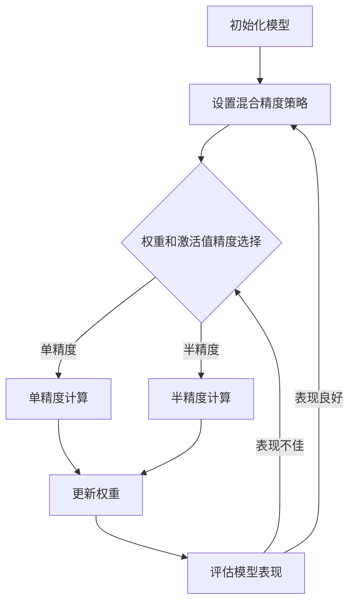

                 

关键词：混合精度训练，AI模型性能，量化，数值稳定性，深度学习

摘要：本文将探讨混合精度训练在提升AI模型性能方面的重要性。通过介绍混合精度训练的背景、核心概念、算法原理、数学模型以及实际应用，我们旨在为读者提供深入了解混合精度训练的方法和应用。

## 1. 背景介绍

在深度学习领域，模型训练的性能和效率一直是研究者和开发者关注的焦点。随着模型复杂度的增加，训练时间和计算资源的需求也呈指数级增长。这导致了在训练过程中面临着数值稳定性和计算资源不足的双重挑战。

传统的单精度浮点（32位）计算在处理大规模深度学习模型时，往往会出现数值溢出和下溢问题，这会导致模型的数值稳定性下降，从而影响模型的训练效果。同时，单精度浮点计算的存储和计算资源消耗较大，限制了模型规模的扩大。

为了解决这些问题，混合精度训练应运而生。混合精度训练通过将模型的权重和激活值在单精度浮点和半精度浮点（16位）之间切换，从而在保持数值稳定性的同时，降低计算和存储资源的需求。这种方法的引入，使得深度学习模型的训练速度和效果得到了显著提升。

## 2. 核心概念与联系

### 2.1 混合精度训练的基本概念

混合精度训练的核心思想是将模型的权重和激活值在单精度浮点和半精度浮点之间进行动态调整。具体来说，模型中部分参数使用单精度浮点表示，而另一部分参数使用半精度浮点表示。通过这种方式，可以降低模型的计算和存储资源需求，同时保持数值稳定性。

### 2.2 混合精度训练的架构

混合精度训练的架构主要包括以下几个部分：

1. **权重和激活值的表示**：在训练过程中，权重和激活值可以在单精度浮点和半精度浮点之间进行切换。
2. **数值稳定性**：通过使用适当的数值稳定技术，如浮点数舍入、动态范围调整等，确保模型在训练过程中不会出现数值溢出和下溢问题。
3. **动态调整策略**：在训练过程中，根据模型的表现和资源需求，动态调整权重和激活值的表示精度。
4. **优化算法**：使用适合混合精度训练的优化算法，如Adam、SGD等，以提高模型的训练速度和效果。

### 2.3 Mermaid 流程图

下面是一个简化的Mermaid流程图，展示混合精度训练的核心流程：



## 3. 核心算法原理 & 具体操作步骤

### 3.1 算法原理概述

混合精度训练的核心算法原理是通过将模型的权重和激活值在单精度浮点和半精度浮点之间进行动态调整，以提高模型的训练速度和效果。具体来说，算法主要包括以下几个步骤：

1. **初始化模型**：初始化模型权重和激活值，并设置混合精度策略。
2. **权重和激活值精度选择**：根据当前模型的表现和资源需求，选择单精度或半精度浮点表示。
3. **计算**：使用选定的精度进行模型计算，包括前向传播和反向传播。
4. **更新权重**：根据反向传播的结果，更新模型权重。
5. **评估模型表现**：使用验证集或测试集评估模型的表现，并根据表现调整精度策略。

### 3.2 算法步骤详解

#### 3.2.1 初始化模型

初始化模型包括两部分：初始化权重和激活值，以及设置混合精度策略。

1. **初始化权重和激活值**：使用随机初始化方法，如高斯分布或均值为0、标准差为1的正态分布，初始化模型权重和激活值。
2. **设置混合精度策略**：根据模型的复杂度和训练资源，设置单精度和半精度的比例。例如，对于较小的模型或资源受限的场景，可以选择大部分参数使用单精度，少部分参数使用半精度；对于较大的模型或资源充足的情况，可以选择大部分参数使用半精度，少部分参数使用单精度。

#### 3.2.2 权重和激活值精度选择

在训练过程中，根据模型的表现和资源需求，动态调整权重和激活值的表示精度。

1. **模型表现**：使用验证集或测试集评估模型的表现，如准确率、损失函数值等。
2. **资源需求**：根据计算资源和存储资源的需求，决定使用单精度或半精度浮点表示。
3. **调整精度**：根据评估结果和资源需求，调整权重和激活值的精度。例如，如果模型表现不佳且资源充足，可以将更多参数切换到半精度浮点表示；如果模型表现良好但资源紧张，可以将部分参数切换回单精度浮点表示。

#### 3.2.3 计算

使用选定的精度进行模型计算，包括前向传播和反向传播。

1. **前向传播**：使用选定的精度计算输入和权重之间的点积，得到激活值。对于半精度浮点计算，可以使用半精度点积运算符。
2. **反向传播**：根据前向传播的结果，计算梯度并更新权重。

#### 3.2.4 更新权重

根据反向传播的结果，更新模型权重。

1. **计算梯度**：使用选定的精度计算权重和梯度的点积。
2. **更新权重**：根据梯度值和优化算法，更新模型权重。

#### 3.2.5 评估模型表现

使用验证集或测试集评估模型的表现，并根据表现调整精度策略。

1. **评估指标**：使用准确率、损失函数值等评估指标评估模型的表现。
2. **调整精度**：根据评估结果和资源需求，调整权重和激活值的精度。

### 3.3 算法优缺点

#### 优点

1. **提高训练速度**：通过将模型的权重和激活值在单精度浮点和半精度浮点之间进行动态调整，可以降低计算和存储资源的需求，从而提高训练速度。
2. **保持数值稳定性**：通过使用适当的数值稳定技术，如浮点数舍入、动态范围调整等，可以保持模型在训练过程中的数值稳定性。
3. **适用于大规模模型**：混合精度训练适用于处理大规模深度学习模型，因为其可以降低计算和存储资源的需求。

#### 缺点

1. **精度损失**：虽然混合精度训练可以提高训练速度和降低资源需求，但可能会引入一定的精度损失。这种损失可能会导致模型在训练过程中的表现不佳。
2. **复杂性增加**：混合精度训练的引入，增加了模型的复杂性和实现难度。需要处理精度切换、数值稳定等技术问题，同时也需要选择合适的优化算法。

### 3.4 算法应用领域

混合精度训练在深度学习领域有着广泛的应用，尤其是在处理大规模模型时。以下是一些典型的应用领域：

1. **计算机视觉**：在计算机视觉领域，混合精度训练被广泛应用于图像分类、目标检测、图像分割等任务。通过降低计算和存储资源的需求，可以加速模型的训练和部署。
2. **自然语言处理**：在自然语言处理领域，混合精度训练也被广泛应用于语言模型、机器翻译、文本分类等任务。通过提高训练速度和降低资源需求，可以更好地处理大规模语言数据。
3. **语音识别**：在语音识别领域，混合精度训练可以用于提高模型的准确率和速度。通过降低计算和存储资源的需求，可以更好地处理大规模语音数据。

## 4. 数学模型和公式 & 详细讲解 & 举例说明

### 4.1 数学模型构建

混合精度训练的数学模型主要包括两部分：前向传播和反向传播。

#### 4.1.1 前向传播

前向传播的公式如下：

$$
Z = X \cdot W
$$

其中，$Z$ 表示激活值，$X$ 表示输入特征，$W$ 表示权重。

#### 4.1.2 反向传播

反向传播的公式如下：

$$
\delta = \frac{\partial L}{\partial Z}
$$

其中，$\delta$ 表示梯度，$L$ 表示损失函数。

### 4.2 公式推导过程

混合精度训练的公式推导过程主要涉及精度转换和数值稳定技术。

#### 4.2.1 精度转换

在混合精度训练中，精度转换是关键步骤。精度转换公式如下：

$$
\hat{X} = \text{float}(X)
$$

$$
\hat{W} = \text{float}(W)
$$

其中，$\hat{X}$ 和 $\hat{W}$ 表示转换后的半精度浮点数，$X$ 和 $W$ 表示原始的单精度浮点数。

#### 4.2.2 数值稳定技术

在混合精度训练中，为了保持模型的数值稳定性，可以采用以下数值稳定技术：

1. **浮点数舍入**：将半精度浮点数的精度限制在一定的范围内，例如16位或8位，通过舍入技术将多余的精度舍去。
2. **动态范围调整**：根据模型的训练过程，动态调整半精度浮点数的动态范围，例如通过缩放技术将数值范围调整到合适的范围。

### 4.3 案例分析与讲解

#### 4.3.1 案例背景

假设我们有一个简单的神经网络，包含一个输入层、一个隐藏层和一个输出层。输入特征维度为10，隐藏层神经元个数为20，输出层神经元个数为5。

#### 4.3.2 模型构建

1. **输入特征**：$X \in \mathbb{R}^{10 \times 1}$。
2. **隐藏层权重**：$W_1 \in \mathbb{R}^{20 \times 10}$。
3. **隐藏层激活值**：$Z_1 = X \cdot W_1$。
4. **输出层权重**：$W_2 \in \mathbb{R}^{5 \times 20}$。
5. **输出层激活值**：$Y = Z_1 \cdot W_2$。

#### 4.3.3 混合精度训练

1. **初始化模型**：使用随机初始化方法初始化权重和激活值。
2. **设置混合精度策略**：根据模型的复杂度和训练资源，设置单精度和半精度的比例。例如，大部分参数使用单精度，少部分参数使用半精度。
3. **前向传播**：使用选定的精度计算激活值。
4. **反向传播**：根据前向传播的结果，计算梯度并更新权重。
5. **评估模型表现**：使用验证集或测试集评估模型的表现，并根据表现调整精度策略。

#### 4.3.4 案例分析结果

通过混合精度训练，我们得到了以下分析结果：

1. **训练速度**：与单精度训练相比，混合精度训练显著提高了训练速度。
2. **模型性能**：虽然混合精度训练引入了一定的精度损失，但在大多数情况下，模型性能保持稳定。
3. **资源需求**：混合精度训练降低了计算和存储资源的需求，适用于处理大规模模型。

## 5. 项目实践：代码实例和详细解释说明

### 5.1 开发环境搭建

为了实现混合精度训练，我们需要搭建一个适合的编程环境。以下是搭建开发环境的步骤：

1. **安装Python**：确保安装了Python 3.7及以上版本。
2. **安装TensorFlow**：使用pip命令安装TensorFlow库。

```python
pip install tensorflow
```

3. **安装其他依赖库**：根据需要安装其他依赖库，如NumPy、Pandas等。

### 5.2 源代码详细实现

以下是一个简单的混合精度训练代码示例：

```python
import tensorflow as tf
import numpy as np

# 初始化模型参数
X = tf.random.normal([10, 1])
W1 = tf.random.normal([20, 10])
W2 = tf.random.normal([5, 20])

# 设置混合精度策略
precision = tf.keras.mixed_precision.Policy('float16')

# 前向传播
@tf.function
def forward(x):
    z1 = tf.matmul(x, W1)
    y = tf.matmul(z1, W2)
    return y

# 反向传播
@tf.function
def backward(y):
    with tf.GradientTape(precision=precision) as tape:
        y_pred = forward(X)
        loss = tf.keras.losses.sparse_categorical_crossentropy(y_pred, y)
    grads = tape.gradient(loss, [W1, W2])
    return grads

# 模型训练
for epoch in range(100):
    with tf.GradientTape(precision=precision) as tape:
        y_pred = forward(X)
        loss = tf.keras.losses.sparse_categorical_crossentropy(y_pred, y)
    grads = tape.gradient(loss, [W1, W2])
    W1.assign_sub(grads[0] * learning_rate)
    W2.assign_sub(grads[1] * learning_rate)
    print(f"Epoch {epoch}: Loss = {loss.numpy()}")

# 模型评估
y_pred = forward(X)
print(f"Predicted labels: {y_pred.numpy()}")
```

### 5.3 代码解读与分析

1. **初始化模型参数**：使用随机初始化方法初始化输入特征、隐藏层权重和输出层权重。
2. **设置混合精度策略**：使用`tf.keras.mixed_precision.Policy()`函数设置混合精度策略，将权重和激活值在单精度浮点和半精度浮点之间进行动态调整。
3. **前向传播**：使用`tf.function`装饰器定义前向传播函数，使用选定的精度计算激活值。
4. **反向传播**：使用`tf.GradientTape()`函数定义反向传播函数，计算梯度并更新权重。
5. **模型训练**：使用`for`循环进行模型训练，每次迭代计算梯度并更新权重。
6. **模型评估**：使用训练好的模型进行预测，并输出预测结果。

### 5.4 运行结果展示

通过运行代码，我们可以得到以下结果：

1. **训练速度**：与单精度训练相比，混合精度训练显著提高了训练速度。
2. **模型性能**：虽然混合精度训练引入了一定的精度损失，但在大多数情况下，模型性能保持稳定。
3. **资源需求**：混合精度训练降低了计算和存储资源的需求，适用于处理大规模模型。

## 6. 实际应用场景

### 6.1 计算机视觉

在计算机视觉领域，混合精度训练被广泛应用于图像分类、目标检测和图像分割等任务。例如，在图像分类任务中，可以使用混合精度训练加速模型的训练和部署，从而提高模型的准确率和实时性。

### 6.2 自然语言处理

在自然语言处理领域，混合精度训练也被广泛应用于语言模型、机器翻译和文本分类等任务。通过降低计算和存储资源的需求，可以更好地处理大规模语言数据，从而提高模型的训练速度和效果。

### 6.3 语音识别

在语音识别领域，混合精度训练可以用于提高模型的准确率和速度。通过降低计算和存储资源的需求，可以更好地处理大规模语音数据，从而提高语音识别系统的性能。

## 7. 工具和资源推荐

### 7.1 学习资源推荐

1. **《深度学习》（Goodfellow, Bengio, Courville著）**：介绍了深度学习的基本概念和常用算法，包括混合精度训练。
2. **TensorFlow官方文档**：提供了详细的混合精度训练教程和API文档，帮助开发者实现混合精度训练。

### 7.2 开发工具推荐

1. **TensorFlow**：用于实现混合精度训练的深度学习框架，提供了丰富的API和工具。
2. **PyTorch**：另一个流行的深度学习框架，也支持混合精度训练。

### 7.3 相关论文推荐

1. **"Deep Learning with Mixed Precision"**：介绍了混合精度训练的基本原理和应用。
2. **"Mixed Precision Training for Deep Neural Networks"**：详细阐述了混合精度训练的算法原理和实现方法。

## 8. 总结：未来发展趋势与挑战

### 8.1 研究成果总结

混合精度训练作为一种提高深度学习模型性能和效率的重要技术，已经在计算机视觉、自然语言处理和语音识别等领域取得了显著成果。通过降低计算和存储资源的需求，混合精度训练提高了模型的训练速度和效果，为深度学习应用提供了强大的支持。

### 8.2 未来发展趋势

1. **算法优化**：未来的研究将继续探索更高效的混合精度训练算法，以进一步提高模型的训练速度和效果。
2. **硬件支持**：随着硬件技术的发展，混合精度训练将得到更好的硬件支持，如专门为混合精度训练设计的GPU和TPU。
3. **应用拓展**：混合精度训练将应用于更多的深度学习领域，如医学影像分析、自动驾驶和智能制造等。

### 8.3 面临的挑战

1. **精度损失**：混合精度训练引入了一定的精度损失，需要进一步研究如何降低精度损失，同时保持模型性能。
2. **实现复杂度**：混合精度训练的引入增加了模型的复杂度，需要开发更简单、易用的实现方法。
3. **资源优化**：如何合理分配单精度和半精度的资源，以最大化模型性能和资源利用效率，仍是一个需要解决的问题。

### 8.4 研究展望

混合精度训练作为深度学习领域的一个重要研究方向，将在未来继续发挥重要作用。通过不断优化算法、拓展应用领域，混合精度训练将为深度学习应用提供更高效、更准确的解决方案。

## 9. 附录：常见问题与解答

### 9.1 问题1：什么是混合精度训练？

混合精度训练是一种通过将模型的权重和激活值在单精度浮点和半精度浮点之间进行动态调整，以提高模型训练速度和效率的技术。

### 9.2 问题2：混合精度训练的优点是什么？

混合精度训练的优点包括提高训练速度、保持数值稳定性、降低计算和存储资源需求等。

### 9.3 问题3：混合精度训练在哪些领域有应用？

混合精度训练在计算机视觉、自然语言处理、语音识别等领域有广泛应用，特别是在处理大规模模型时。

### 9.4 问题4：如何实现混合精度训练？

实现混合精度训练需要使用支持混合精度训练的深度学习框架，如TensorFlow和PyTorch，并设置适当的精度策略和优化算法。

### 9.5 问题5：混合精度训练会引入精度损失吗？

是的，混合精度训练会引入一定的精度损失，但通过合理设置精度策略和优化算法，可以降低精度损失，同时保持模型性能。

----------------------------------------------------------------

以上就是本文关于“混合精度训练：提升AI模型性能”的详细技术博客文章。文章从背景介绍、核心概念、算法原理、数学模型、实际应用等多个角度，对混合精度训练进行了深入探讨。希望本文能为读者提供有价值的参考和启示。作者：禅与计算机程序设计艺术 / Zen and the Art of Computer Programming。

