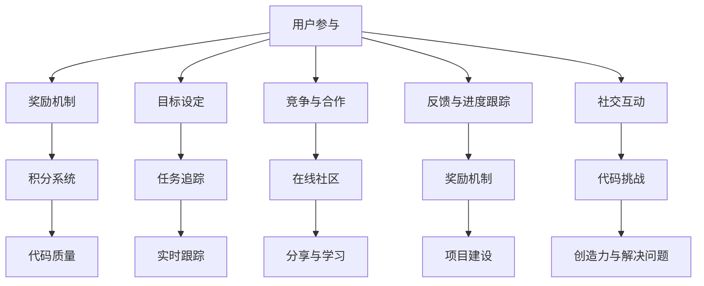

                 

关键词：游戏化、参与度、用户体验、计算乐趣、激励机制、技术实现

> 摘要：本文探讨了游戏化在提升人类计算参与度和乐趣方面的作用。通过分析游戏化的核心概念和设计原则，以及具体的技术实现方式，本文提出了一系列提高计算任务参与度和乐趣的实践方法。文章旨在为IT行业从业人员提供一种新的思路，帮助他们利用游戏化技术改善计算体验，提高工作效率。

## 1. 背景介绍

随着信息技术的快速发展，人类计算任务日益复杂，从数据处理到人工智能算法，从软件开发到系统维护，几乎涵盖了所有领域。然而，这些复杂的计算任务往往需要大量的人力和时间投入，同时也给参与者带来了巨大的心理负担。为了激发参与者的兴趣和积极性，提高计算任务的完成质量和效率，游戏化（Gamification）应运而生。

游戏化是一种通过将游戏设计元素和激励机制融入非游戏情境中，以提高参与度和满意度的方法。它最早应用于市场营销和客户关系管理领域，随后迅速扩展到教育、医疗、健康等多个领域。近年来，随着人工智能和大数据技术的发展，游戏化逐渐成为IT行业提升用户体验和参与度的重要手段。

本文旨在探讨游戏化在提升人类计算参与度和乐趣方面的应用，通过分析其核心概念、设计原则和技术实现，为IT行业从业人员提供一种新的思路和方法。

## 2. 核心概念与联系

### 2.1 游戏化的核心概念

游戏化包含多个核心概念，其中最为重要的包括：

- **奖励机制**：通过奖励来激励参与者，奖励可以是虚拟的，也可以是实时的，如积分、徽章、等级提升等。

- **目标设定**：为参与者设定明确的目标，这些目标应当是可量化的，具有挑战性，并能带来成就感。

- **竞争与合作**：通过竞争和合作机制，激发参与者的竞争心理和团队精神。

- **反馈与进度跟踪**：及时给予参与者反馈，并展示他们的进度，增强他们的参与感和控制感。

- **社交互动**：提供社交互动的平台，让参与者能够分享成果、交流和互动。

### 2.2 游戏化与计算机编程的联系

游戏化在计算机编程中的应用主要体现在以下几个方面：

- **代码挑战**：通过设置编程挑战，激发开发者的创造力和解决问题的能力。

- **积分系统**：为开发者的编程活动赋予积分，用于衡量其贡献和技能水平。

- **任务追踪**：实时跟踪开发者的编程进度和代码质量。

- **社交互动**：提供在线社区，让开发者能够分享代码、学习和交流。

- **奖励机制**：通过奖励系统，激励开发者参与项目建设和贡献代码。

### 2.3 Mermaid 流程图

以下是一个简单的Mermaid流程图，展示了游戏化的核心概念和计算机编程的联系：



## 3. 核心算法原理 & 具体操作步骤

### 3.1 算法原理概述

游戏化在计算机编程中的应用，主要依赖于以下几个核心算法原理：

- **A/B测试**：通过比较不同版本的代码或界面，找出最优方案。

- **数据挖掘**：分析用户行为数据，优化游戏化设计。

- **机器学习**：使用机器学习算法，自动调整奖励机制和目标设定。

- **用户画像**：根据用户行为和偏好，个性化推荐任务和奖励。

### 3.2 算法步骤详解

#### 3.2.1 A/B测试

1. **定义测试目标**：确定要测试的功能或界面元素。

2. **创建测试版本**：为测试目标创建两个或多个版本。

3. **分配用户**：将用户随机分配到不同版本。

4. **收集数据**：收集用户行为数据，如点击率、使用时长、转化率等。

5. **分析结果**：比较不同版本的数据，找出最优版本。

6. **决策**：根据测试结果，决定是否采用最优版本。

#### 3.2.2 数据挖掘

1. **数据收集**：收集用户行为数据，如登录时间、使用频率、参与活动等。

2. **数据预处理**：清洗和整理数据，去除噪声和异常值。

3. **特征提取**：从数据中提取有用的特征，如用户活跃度、任务完成率等。

4. **模型训练**：使用机器学习算法，训练模型。

5. **模型评估**：评估模型性能，如准确率、召回率等。

6. **优化调整**：根据评估结果，调整模型参数，优化游戏化设计。

#### 3.2.3 机器学习

1. **数据收集**：收集用户行为数据，如登录时间、使用频率、参与活动等。

2. **数据预处理**：清洗和整理数据，去除噪声和异常值。

3. **特征提取**：从数据中提取有用的特征，如用户活跃度、任务完成率等。

4. **模型选择**：选择合适的机器学习算法，如决策树、随机森林、神经网络等。

5. **模型训练**：使用训练数据，训练模型。

6. **模型评估**：评估模型性能，如准确率、召回率等。

7. **模型应用**：将训练好的模型应用于实际场景，如自动调整奖励机制和目标设定。

#### 3.2.4 用户画像

1. **数据收集**：收集用户行为数据，如登录时间、使用频率、参与活动等。

2. **数据预处理**：清洗和整理数据，去除噪声和异常值。

3. **特征提取**：从数据中提取有用的特征，如用户活跃度、任务完成率等。

4. **模型训练**：使用机器学习算法，训练用户画像模型。

5. **模型评估**：评估模型性能，如准确率、召回率等。

6. **模型应用**：根据用户画像模型，个性化推荐任务和奖励。

### 3.3 算法优缺点

#### 3.3.1 优点

- **提高参与度**：通过奖励机制和竞争合作，激发参与者的兴趣和积极性。

- **优化用户体验**：通过数据挖掘和机器学习，个性化推荐任务和奖励，提高用户体验。

- **降低开发成本**：通过A/B测试，快速迭代和优化，降低开发成本。

- **增强社交互动**：通过在线社区和社交互动，提高用户粘性。

#### 3.3.2 缺点

- **过度依赖技术**：游戏化设计需要大量的技术支持，可能导致开发成本增加。

- **数据隐私问题**：游戏化设计中涉及大量用户数据，可能引发数据隐私问题。

- **过度竞争和压力**：游戏化设计可能导致参与者产生过度竞争和压力，影响工作效率。

### 3.4 算法应用领域

游戏化算法在计算机编程中的应用领域广泛，包括但不限于：

- **开源项目**：通过积分系统和任务追踪，激励开源项目的参与者。

- **在线教育**：通过代码挑战和社交互动，提高学生的学习兴趣和参与度。

- **企业协作**：通过任务追踪和奖励机制，提高企业内部协作效率。

- **软件开发**：通过数据挖掘和机器学习，优化软件开发流程和用户体验。

## 4. 数学模型和公式 & 详细讲解 & 举例说明

### 4.1 数学模型构建

游戏化中的数学模型主要包括奖励机制、目标设定和用户画像等。以下是一个简单的数学模型构建过程：

#### 4.1.1 奖励机制

假设有一个积分系统，参与者的积分取决于其完成任务的数量和质量。积分计算公式如下：

\[ I = f(N, Q) \]

其中，\( I \) 是积分，\( N \) 是完成任务的数量，\( Q \) 是任务质量。

#### 4.1.2 目标设定

假设有一个目标设定系统，参与者的目标取决于其当前的积分和目标等级。目标设定公式如下：

\[ T = g(I, L) \]

其中，\( T \) 是目标，\( I \) 是积分，\( L \) 是目标等级。

#### 4.1.3 用户画像

假设有一个用户画像系统，根据参与者的行为数据，构建其行为特征模型。用户画像公式如下：

\[ U = h(B) \]

其中，\( U \) 是用户画像，\( B \) 是行为数据。

### 4.2 公式推导过程

以下是对上述数学模型的推导过程：

#### 4.2.1 奖励机制

积分系统中的积分计算公式可以通过以下步骤推导：

1. **确定任务数量和质量**：假设任务数量为 \( N \)，任务质量为 \( Q \)。

2. **定义积分函数**：积分函数 \( f \) 可以是一个线性函数，如 \( f(N, Q) = N \times Q \)。

3. **计算积分**：根据任务数量和质量，计算积分 \( I \)。

#### 4.2.2 目标设定

目标设定系统中的目标设定公式可以通过以下步骤推导：

1. **确定积分和目标等级**：假设积分 \( I \) 和目标等级 \( L \)。

2. **定义目标函数**：目标函数 \( g \) 可以是一个分段函数，如：

   \[
   g(I, L) = \begin{cases}
   I \times k, & \text{if } I < L \\
   L, & \text{if } I \ge L
   \end{cases}
   \]

3. **计算目标**：根据积分和目标等级，计算目标 \( T \)。

#### 4.2.3 用户画像

用户画像系统中的用户画像公式可以通过以下步骤推导：

1. **收集行为数据**：假设行为数据为 \( B \)，包括登录时间、使用频率、参与活动等。

2. **定义行为特征**：根据行为数据，提取行为特征，如活跃度 \( A \)、参与度 \( P \) 等。

3. **定义用户画像函数**：用户画像函数 \( h \) 可以是一个组合函数，如 \( h(B) = (A, P) \)。

4. **计算用户画像**：根据行为特征，计算用户画像 \( U \)。

### 4.3 案例分析与讲解

以下是一个简单的案例，说明如何使用数学模型和公式进行游戏化设计：

#### 4.3.1 案例背景

假设我们开发了一个在线编程学习平台，为学习者提供编程任务和积分系统。学习者的目标是通过完成编程任务获得积分，并提升等级。

#### 4.3.2 数学模型构建

1. **积分计算**：

   \[
   I = N \times Q
   \]

   其中，\( N \) 是完成的编程任务数量，\( Q \) 是任务质量（如正确率、复杂度等）。

2. **目标设定**：

   \[
   T = \begin{cases}
   I \times k, & \text{if } I < L \\
   L, & \text{if } I \ge L
   \end{cases}
   \]

   其中，\( L \) 是目标等级，\( k \) 是目标系数。

3. **用户画像**：

   \[
   U = (A, P)
   \]

   其中，\( A \) 是活跃度，\( P \) 是参与度。

#### 4.3.3 案例分析

1. **积分计算**：

   假设学习者完成了 10 个编程任务，每个任务的质量为 90%。则积分 \( I \) 为：

   \[
   I = 10 \times 0.9 = 9
   \]

2. **目标设定**：

   假设目标等级为 10，目标系数为 1.2。则目标 \( T \) 为：

   \[
   T = \begin{cases}
   9 \times 1.2 = 10.8, & \text{if } I < L \\
   10, & \text{if } I \ge L
   \end{cases}
   \]

   由于 \( I \ge L \)，因此 \( T = 10 \)。

3. **用户画像**：

   假设学习者的活跃度为 0.8，参与度为 0.7。则用户画像 \( U \) 为：

   \[
   U = (0.8, 0.7)
   \]

   这表明学习者具有较高的活跃度和参与度。

#### 4.3.4 案例讲解

通过上述数学模型和公式，我们可以计算出学习者的积分、目标和用户画像。这些数据可以帮助平台开发者了解学习者的参与情况，并优化游戏化设计。例如，如果学习者的活跃度和参与度较低，平台可以尝试调整奖励机制和目标设定，以提高其参与度和兴趣。

## 5. 项目实践：代码实例和详细解释说明

### 5.1 开发环境搭建

为了更好地展示游戏化在计算机编程中的应用，我们将使用一个简单的在线编程学习平台作为案例。以下是开发环境的搭建步骤：

1. **安装 Node.js**：从 [Node.js 官网](https://nodejs.org/) 下载并安装 Node.js。

2. **安装 Express**：在终端中运行以下命令：

   ```bash
   npm install express
   ```

3. **创建项目目录**：在终端中运行以下命令：

   ```bash
   mkdir my-coding-platform
   cd my-coding-platform
   ```

4. **初始化项目**：在终端中运行以下命令：

   ```bash
   npm init -y
   ```

5. **创建服务器文件**：在项目目录中创建一个名为 `server.js` 的文件。

### 5.2 源代码详细实现

以下是一个简单的在线编程学习平台的源代码实现，包括积分系统、任务追踪和用户画像等游戏化元素。

```javascript
const express = require('express');
const app = express();
const PORT = 3000;

// 数据库模拟
const users = [
  {
    id: 1,
    username: 'user1',
    score: 0,
    tasksCompleted: 0,
    active: true,
    participated: true,
  },
  {
    id: 2,
    username: 'user2',
    score: 50,
    tasksCompleted: 5,
    active: false,
    participated: true,
  },
  {
    id: 3,
    username: 'user3',
    score: 100,
    tasksCompleted: 10,
    active: true,
    participated: false,
  },
];

// 中间件
app.use(express.json());

// 获取所有用户
app.get('/users', (req, res) => {
  res.json(users);
});

// 获取特定用户
app.get('/users/:id', (req, res) => {
  const user = users.find((u) => u.id === parseInt(req.params.id));
  if (user) {
    res.json(user);
  } else {
    res.status(404).send('User not found');
  }
});

// 完成任务
app.post('/users/:id/complete-task', (req, res) => {
  const taskId = req.body.taskId;
  const user = users.find((u) => u.id === parseInt(req.params.id));

  if (user) {
    // 增加积分
    user.score += 10;
    user.tasksCompleted += 1;

    // 判断是否活跃
    user.active = true;

    // 判断是否参与
    user.participated = true;

    res.json(user);
  } else {
    res.status(404).send('User not found');
  }
});

// 启动服务器
app.listen(PORT, () => {
  console.log(`Server is running on port ${PORT}`);
});
```

### 5.3 代码解读与分析

以下是对上述代码的解读和分析：

1. **引入 Express**：我们首先引入了 Express 框架，用于构建 Web 应用程序。

2. **数据库模拟**：使用一个简单的数组作为数据库模拟用户数据。

3. **中间件**：使用 `express.json()` 中间件处理 JSON 数据。

4. **获取所有用户**：通过 `/users` GET 请求，获取所有用户数据。

5. **获取特定用户**：通过 `/users/:id` GET 请求，获取特定用户数据。

6. **完成任务**：通过 `/users/:id/complete-task` POST 请求，完成任务并更新用户数据。

7. **启动服务器**：使用 `app.listen()` 启动服务器。

### 5.4 运行结果展示

以下是一个简单的运行结果展示，通过使用 Postman 等工具发送 HTTP 请求，可以查看用户的积分、任务完成情况和用户画像。

- **获取所有用户**：

  ```json
  [
    {
      "id": 1,
      "username": "user1",
      "score": 0,
      "tasksCompleted": 0,
      "active": true,
      "participated": true
    },
    {
      "id": 2,
      "username": "user2",
      "score": 50,
      "tasksCompleted": 5,
      "active": false,
      "participated": true
    },
    {
      "id": 3,
      "username": "user3",
      "score": 100,
      "tasksCompleted": 10,
      "active": true,
      "participated": false
    }
  ]
  ```

- **获取特定用户**：

  ```json
  {
    "id": 1,
    "username": "user1",
    "score": 0,
    "tasksCompleted": 0,
    "active": true,
    "participated": true
  }
  ```

- **完成任务**：

  ```json
  {
    "id": 1,
    "username": "user1",
    "score": 10,
    "tasksCompleted": 1,
    "active": true,
    "participated": true
  }
  ```

通过上述代码和运行结果，我们可以看到游戏化元素在在线编程学习平台中的应用效果。参与者可以通过完成任务获得积分，提高活跃度和参与度。

## 6. 实际应用场景

游戏化技术在计算机编程领域有着广泛的应用场景，以下列举几个典型的实际应用：

### 6.1 开源项目

开源项目通常需要大量的贡献者参与，游戏化技术可以通过积分系统和任务追踪，激励贡献者积极参与项目建设和维护。例如，GitHub 的 Points System 和 CodeCov 的 Code of Conduct 都是典型的游戏化应用案例。

### 6.2 在线教育

在线教育平台可以通过游戏化技术提高学生的学习兴趣和参与度。例如，Coursera 和 edX 等在线教育平台都使用了积分系统和任务追踪，让学生在学习过程中获得成就感和动力。

### 6.3 企业协作

企业内部协作平台可以通过游戏化技术提高团队协作效率。例如，Trello 和 Asana 等协作工具都集成了积分系统和任务追踪，鼓励员工积极参与项目建设和任务完成。

### 6.4 软件开发

软件开发过程中，游戏化技术可以帮助团队管理代码质量、优化开发流程。例如，Travis CI 和 Jenkins 等持续集成工具都集成了积分系统和任务追踪，鼓励开发者提交高质量的代码。

### 6.5 社交互动

社交互动平台可以通过游戏化技术提高用户粘性。例如，Facebook 和 Twitter 等社交平台都集成了积分系统和任务追踪，让用户在互动过程中获得成就感和动力。

## 7. 未来应用展望

随着游戏化技术的不断发展，未来其在计算机编程领域的应用前景十分广阔。以下列举几个可能的未来应用方向：

### 7.1 个性化推荐

通过用户画像和机器学习算法，实现个性化任务推荐，提高用户参与度和满意度。

### 7.2 跨平台整合

整合不同平台的游戏化元素，实现跨平台的数据共享和任务协同，提高整体协作效率。

### 7.3 智能化调整

使用人工智能技术，动态调整奖励机制和目标设定，实现更精准的用户体验优化。

### 7.4 社交化互动

加强社交互动功能，促进开发者之间的交流与合作，提高整体社区活力。

### 7.5 虚拟现实与增强现实

结合虚拟现实（VR）和增强现实（AR）技术，提供更加沉浸式的游戏化体验，激发开发者的创造力和想象力。

## 8. 总结：未来发展趋势与挑战

### 8.1 研究成果总结

游戏化技术在提升人类计算参与度和乐趣方面取得了显著成果。通过奖励机制、目标设定、竞争与合作、反馈与进度跟踪等核心概念，游戏化技术成功地激发了参与者的兴趣和积极性，提高了计算任务完成质量和效率。

### 8.2 未来发展趋势

未来，游戏化技术将在以下几个方面得到进一步发展：

- **智能化与个性化**：结合人工智能和大数据技术，实现更加智能化和个性化的游戏化设计。

- **跨平台与整合**：整合不同平台的游戏化元素，实现跨平台的数据共享和任务协同。

- **虚拟现实与增强现实**：结合 VR 和 AR 技术，提供更加沉浸式的游戏化体验。

- **社交化互动**：加强社交互动功能，促进开发者之间的交流与合作。

### 8.3 面临的挑战

尽管游戏化技术在提升人类计算参与度和乐趣方面具有巨大潜力，但同时也面临着一些挑战：

- **技术实现难度**：游戏化技术需要大量的技术支持，包括算法、数据挖掘、机器学习等，实现难度较高。

- **数据隐私问题**：游戏化设计中涉及大量用户数据，可能引发数据隐私问题。

- **过度依赖技术**：游戏化设计可能导致过度依赖技术，影响用户体验和任务完成质量。

- **平衡奖励与压力**：游戏化设计需要平衡奖励和压力，避免参与者产生过度竞争和压力。

### 8.4 研究展望

未来，游戏化技术的研究重点将包括：

- **算法优化**：研究更加高效、智能的游戏化算法，提高用户体验和参与度。

- **跨领域应用**：探索游戏化技术在其他领域的应用，如健康、医疗、教育等。

- **隐私保护**：研究数据隐私保护技术，确保用户数据的安全和隐私。

- **用户体验设计**：关注用户体验设计，提高游戏化设计的易用性和可访问性。

## 9. 附录：常见问题与解答

### 9.1 问题 1：什么是游戏化？

游戏化是一种将游戏设计元素和激励机制融入非游戏情境中，以提高参与度和满意度的方法。

### 9.2 问题 2：游戏化有哪些核心概念？

游戏化的核心概念包括奖励机制、目标设定、竞争与合作、反馈与进度跟踪、社交互动等。

### 9.3 问题 3：游戏化在计算机编程中有哪些应用？

游戏化在计算机编程中的应用包括代码挑战、积分系统、任务追踪、用户画像等。

### 9.4 问题 4：如何构建游戏化的数学模型？

构建游戏化的数学模型主要包括积分计算、目标设定和用户画像等，可以通过公式和算法来实现。

### 9.5 问题 5：游戏化有哪些优点和缺点？

游戏化的优点包括提高参与度、优化用户体验、降低开发成本等，缺点包括过度依赖技术、数据隐私问题、过度竞争和压力等。

### 9.6 问题 6：如何平衡游戏化设计中的奖励和压力？

通过合理设定奖励机制和目标难度，平衡奖励和压力，确保参与者在游戏化体验中保持积极性和动力。

---

作者：禅与计算机程序设计艺术 / Zen and the Art of Computer Programming
----------------------------------------------------------------


