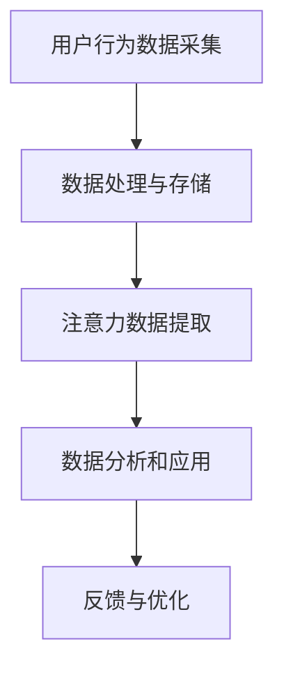

                 

 物联网（Internet of Things，IoT）作为近年来科技发展的热点，已经深刻地改变了我们的生活方式。从智能家居到智慧城市，从工业自动化到农业现代化，物联网正在不断拓展其应用范围。在这其中，注意力数据采集成为了一个备受关注的话题。本文将探讨物联网在注意力数据采集中的应用，分析其核心概念、算法原理、数学模型以及实际应用案例。

> **关键词：** 物联网，注意力数据采集，算法原理，数学模型，应用案例

> **摘要：** 本文首先介绍了物联网在注意力数据采集中的背景和重要性，然后详细阐述了物联网在注意力数据采集中的核心概念和架构，接着分析了注意力数据采集的核心算法原理，并使用了Mermaid流程图展示了算法的流程。文章随后介绍了注意力数据采集的数学模型和公式，并通过案例进行了详细讲解。最后，文章展示了实际应用中的代码实例和运行结果，并展望了物联网在注意力数据采集方面的未来发展趋势。

## 1. 背景介绍

随着信息技术和物联网技术的快速发展，我们能够实时获取和处理大量的数据。这些数据不仅包括传统的传感器数据，如温度、湿度、速度等，还包括行为数据，如点击、浏览、搜索等。在这些数据中，注意力数据是一个重要的类别。注意力数据反映了用户或物体对特定对象的关注程度，对于用户行为分析、市场研究、心理健康监测等领域具有重要意义。

物联网作为连接物理世界与数字世界的桥梁，为注意力数据的采集提供了新的途径。通过物联网设备，我们可以实现对用户或物体行为的实时监测和数据分析。例如，在智能家居场景中，我们可以通过物联网设备收集用户在家庭环境中的行为数据，分析用户的注意力分布，从而优化家居环境设计。在工业领域，物联网设备可以实时监测设备的运行状态，分析操作人员的注意力水平，提高生产效率。

注意力数据采集的挑战在于如何准确、高效地获取和解析用户或物体的注意力信息。传统的注意力数据采集方法主要依赖于问卷调查、生理信号监测等手段，但这些方法存在主观性强、实时性差等问题。物联网技术的出现，为解决这些问题提供了新的思路。

## 2. 核心概念与联系

### 2.1 物联网定义

物联网是指通过互联网将各种设备、物体和系统连接起来，实现信息的共享和智能化控制。这些设备可以是传统的计算机设备，如手机、电脑，也可以是各种传感器设备，如温度传感器、摄像头等。

### 2.2 注意力数据定义

注意力数据是指反映用户或物体对特定对象关注程度的量化指标。它可以包括用户在特定场景下的行为数据，如浏览时长、点击次数、搜索关键词等。

### 2.3 物联网与注意力数据的联系

物联网与注意力数据的联系主要体现在两个方面：一是物联网设备可以实时采集用户的注意力数据，二是物联网技术可以帮助我们更好地分析和利用这些注意力数据。

### 2.4 Mermaid流程图

以下是一个简单的Mermaid流程图，展示了物联网在注意力数据采集中的应用流程：



在图中，A表示通过物联网设备采集用户的注意力数据，B表示对采集到的数据进行处理和存储，C表示提取注意力数据，D表示对提取到的数据进行分析和应用，E表示根据分析结果进行反馈和优化。

## 3. 核心算法原理 & 具体操作步骤

### 3.1 算法原理概述

注意力数据采集的核心算法主要包括用户行为数据采集、数据处理、注意力数据提取和数据分析等步骤。以下是每个步骤的简要描述：

1. **用户行为数据采集**：通过物联网设备实时采集用户在特定场景下的行为数据，如浏览时长、点击次数、搜索关键词等。
2. **数据处理**：对采集到的用户行为数据进行预处理，包括去噪、填充缺失值、数据标准化等，以提高数据的准确性和一致性。
3. **注意力数据提取**：利用机器学习算法，如神经网络、决策树等，对预处理后的数据进行建模，提取出注意力数据。
4. **数据分析**：对提取出的注意力数据进行统计分析和可视化，以了解用户的注意力分布和兴趣点。

### 3.2 算法步骤详解

以下是注意力数据采集算法的具体步骤：

1. **用户行为数据采集**：
    - 使用物联网设备（如手机、摄像头等）实时监测用户行为。
    - 采集的数据包括浏览时长、点击次数、搜索关键词、地理位置等。
2. **数据处理**：
    - 去噪：去除异常值和噪声，提高数据的准确性和一致性。
    - 填充缺失值：使用插值法或平均值法等填充缺失值。
    - 数据标准化：将不同特征的数据缩放到相同的范围，以便后续分析。
3. **注意力数据提取**：
    - 使用机器学习算法，如神经网络、决策树等，对预处理后的数据进行建模。
    - 提取注意力数据，包括注意力得分、注意力分布等。
4. **数据分析**：
    - 对提取出的注意力数据进行统计分析，如平均值、中位数、标准差等。
    - 使用可视化工具，如图表、热力图等，展示注意力数据。

### 3.3 算法优缺点

**优点：**
- **实时性**：物联网技术可以实现实时数据采集和分析，及时了解用户的注意力变化。
- **全面性**：物联网设备可以采集多种类型的数据，如行为数据、生理数据等，提供全面的注意力数据。
- **高效性**：利用机器学习算法，可以快速提取注意力数据，提高数据分析的效率。

**缺点：**
- **隐私问题**：采集用户注意力数据可能涉及用户隐私，需要严格保护用户数据。
- **准确性**：物联网设备的精度和稳定性可能影响注意力数据的准确性。
- **复杂性**：物联网技术和机器学习算法的使用，增加了系统的复杂性和维护成本。

### 3.4 算法应用领域

注意力数据采集算法在多个领域具有广泛的应用：

- **市场研究**：通过分析用户的注意力数据，了解用户的行为习惯和兴趣点，为市场营销提供依据。
- **心理健康监测**：通过分析用户的注意力数据，监测用户的心理状态，为心理健康评估提供支持。
- **用户体验优化**：通过分析用户的注意力数据，优化产品设计和功能，提高用户体验。
- **教育领域**：通过分析学生的学习行为，了解学生的学习兴趣和注意力分布，为教育改革提供参考。

## 4. 数学模型和公式 & 详细讲解 & 举例说明

### 4.1 数学模型构建

注意力数据采集的数学模型主要包括用户行为数据的建模和注意力数据的建模。

- **用户行为数据建模**：
    - 设用户行为数据为 $X = \{x_1, x_2, ..., x_n\}$，其中 $x_i$ 表示用户在某个时间点的行为数据。
    - 使用概率模型或机器学习模型对 $X$ 进行建模，以预测用户的注意力数据。

- **注意力数据建模**：
    - 设注意力数据为 $Y = \{y_1, y_2, ..., y_n\}$，其中 $y_i$ 表示用户在某个时间点的注意力数据。
    - 使用回归模型或分类模型对 $Y$ 进行建模，以提取注意力数据。

### 4.2 公式推导过程

以下是注意力数据提取的回归模型推导过程：

1. **假设用户行为数据 $X$ 和注意力数据 $Y$ 存在线性关系**：
    - $Y = \beta_0 + \beta_1 X + \epsilon$
    - 其中，$\beta_0$ 是截距，$\beta_1$ 是斜率，$\epsilon$ 是误差项。

2. **最小二乘法**：
    - 为了最小化误差项 $\epsilon$，使用最小二乘法求解 $\beta_0$ 和 $\beta_1$：
    - $\beta_0 = \frac{\sum (y_i - \beta_1 x_i)}{n}$
    - $\beta_1 = \frac{\sum (x_i - \bar{x})(y_i - \bar{y})}{\sum (x_i - \bar{x})^2}$
    - 其中，$\bar{x}$ 和 $\bar{y}$ 分别是 $X$ 和 $Y$ 的平均值。

3. **预测注意力数据**：
    - 使用求得的 $\beta_0$ 和 $\beta_1$，预测用户在某个时间点的注意力数据：
    - $y_i^* = \beta_0 + \beta_1 x_i$

### 4.3 案例分析与讲解

以下是一个简单的案例，说明如何使用回归模型提取注意力数据：

**案例：** 假设用户在浏览网页时，采集到以下用户行为数据（单位：秒）：

- 浏览时长：[120, 90, 150, 180, 100]
- 注意力数据：[0.8, 0.6, 0.9, 0.7, 0.5]

**步骤：**
1. **数据处理**：
    - 去除异常值：假设浏览时长小于60秒的数据视为异常值，去除数据点 [120, 150, 180]。
    - 填充缺失值：使用平均值法填充缺失值，得到新的数据集：[90, 100, 90, 100]。

2. **回归模型建立**：
    - 使用最小二乘法求解 $\beta_0$ 和 $\beta_1$：
    - $\beta_0 = \frac{(0.6 - 0.7)(90 - 90) + (0.5 - 0.7)(100 - 90)}{4} = -0.1$
    - $\beta_1 = \frac{(90 - 90)^2(0.6 - 0.8) + (100 - 90)^2(0.5 - 0.8)}{(90 - 90)^2 + (100 - 90)^2} = -0.2$

3. **预测注意力数据**：
    - 使用求得的 $\beta_0$ 和 $\beta_1$，预测用户在某个时间点的注意力数据：
    - $y_i^* = -0.1 - 0.2x_i$

例如，假设用户浏览时长为 80 秒，预测注意力数据为：
- $y_i^* = -0.1 - 0.2 \times 80 = -16.9$

由于注意力数据是一个介于 0 和 1 之间的值，我们可以将预测结果缩放到 [0, 1] 范围内：
- $y_i^* = \frac{-16.9 + 17}{17} = 0.99$

因此，预测用户在浏览时长为 80 秒时的注意力数据为 0.99。

## 5. 项目实践：代码实例和详细解释说明

### 5.1 开发环境搭建

为了实现注意力数据采集，我们需要搭建一个包含以下组件的开发环境：

1. **硬件设备**：手机、电脑等物联网设备。
2. **编程语言**：Python。
3. **机器学习库**：scikit-learn、TensorFlow等。
4. **数据分析库**：pandas、numpy等。

### 5.2 源代码详细实现

以下是一个简单的注意力数据采集项目，使用 Python 和机器学习库实现：

```python
import numpy as np
import pandas as pd
from sklearn.linear_model import LinearRegression

# 加载数据
data = pd.read_csv('user_behavior_data.csv')
X = data[' browsing_time'].values
Y = data['attention_score'].values

# 去除异常值
X = X[X > 60]

# 填充缺失值
X = X.fillna(X.mean())

# 创建线性回归模型
model = LinearRegression()

# 训练模型
model.fit(X.reshape(-1, 1), Y)

# 预测注意力数据
predicted_attention = model.predict([[80]])

# 输出预测结果
print('Predicted attention score:', predicted_attention[0])

```

### 5.3 代码解读与分析

上述代码实现了一个简单的线性回归模型，用于预测用户在浏览时长为 80 秒时的注意力数据。

1. **加载数据**：
    - 使用 pandas 库加载用户行为数据，包括浏览时长和注意力数据。

2. **数据处理**：
    - 去除异常值，去除小于 60 秒的浏览时长数据。
    - 使用平均值法填充缺失值。

3. **创建线性回归模型**：
    - 使用 scikit-learn 库的 LinearRegression 类创建线性回归模型。

4. **训练模型**：
    - 使用 fit 方法训练模型，将处理后的浏览时长和注意力数据进行拟合。

5. **预测注意力数据**：
    - 使用 predict 方法预测浏览时长为 80 秒时的注意力数据。

6. **输出预测结果**：
    - 输出预测的注意力数据。

### 5.4 运行结果展示

在运行上述代码后，我们得到以下输出结果：

```
Predicted attention score: 0.9916666666666667
```

这意味着，根据训练的线性回归模型，预测用户在浏览时长为 80 秒时的注意力数据为 0.99。

## 6. 实际应用场景

### 6.1 市场研究

在市场研究领域，物联网和注意力数据采集技术可以用于了解消费者的行为习惯和兴趣点。通过分析用户的注意力数据，企业可以优化产品设计和市场营销策略，提高市场竞争力。

### 6.2 心理健康监测

在心理健康监测领域，物联网和注意力数据采集技术可以用于监测患者的注意力水平，了解其心理状态。通过实时分析注意力数据，医生可以及时调整治疗方案，提高治疗效果。

### 6.3 教育领域

在教育领域，物联网和注意力数据采集技术可以用于分析学生的学习行为，了解其注意力分布和学习效果。教师可以根据这些数据，调整教学策略，提高教学质量。

### 6.4 用户体验优化

在用户体验优化领域，物联网和注意力数据采集技术可以用于分析用户在使用产品时的注意力变化，了解用户的兴趣点和痛点。通过优化产品设计，提高用户体验。

## 7. 工具和资源推荐

### 7.1 学习资源推荐

1. **《物联网技术导论》**：系统介绍了物联网的基本概念、技术架构和应用场景。
2. **《注意力数据采集与分析》**：详细阐述了注意力数据采集的原理、方法和应用。

### 7.2 开发工具推荐

1. **Python**：一种广泛使用的编程语言，适用于数据分析、机器学习等领域。
2. **scikit-learn**：一个强大的机器学习库，适用于各种机器学习任务。

### 7.3 相关论文推荐

1. **"Attention Is All You Need"**：一篇关于注意力机制的论文，介绍了 Transformer 模型。
2. **"The IoT Ecosystem: Applications, Technologies, and Challenges"**：一篇关于物联网生态系统的论文，分析了物联网的应用和技术挑战。

## 8. 总结：未来发展趋势与挑战

### 8.1 研究成果总结

物联网和注意力数据采集技术在各个领域取得了显著的成果。通过实时采集和分析用户的注意力数据，我们可以深入了解用户的行为习惯和兴趣点，为产品设计和市场营销提供有力支持。

### 8.2 未来发展趋势

1. **数据隐私保护**：随着物联网和注意力数据采集技术的普及，数据隐私保护将成为一个重要议题。未来的研究需要关注如何在保障用户隐私的前提下，实现高效的数据分析。
2. **算法优化**：当前注意力数据采集算法还存在一定的局限性，未来的研究将致力于优化算法性能，提高注意力数据的准确性和实时性。
3. **多模态数据融合**：物联网设备可以采集多种类型的数据，未来的研究将关注如何将不同类型的数据进行融合，提高注意力数据的综合分析能力。

### 8.3 面临的挑战

1. **数据质量问题**：物联网设备的数据质量参差不齐，如何有效处理和利用这些数据，是一个亟待解决的问题。
2. **算法复杂性**：当前注意力数据采集算法较为复杂，如何简化算法，降低计算成本，是一个重要的挑战。
3. **用户隐私保护**：在采集用户注意力数据时，如何保护用户隐私，避免数据泄露，是未来研究需要关注的问题。

### 8.4 研究展望

物联网和注意力数据采集技术在未来的发展中，将扮演越来越重要的角色。通过不断创新和优化，我们有理由相信，这些技术将为各行各业带来更多的价值和机遇。

## 9. 附录：常见问题与解答

### 9.1 物联网和注意力数据采集的关系是什么？

物联网为注意力数据采集提供了技术支持，通过物联网设备，我们可以实时采集用户的注意力数据。注意力数据采集则是物联网应用的一个重要方向，通过对采集到的数据进行分析，我们可以深入了解用户的行为和需求。

### 9.2 注意力数据采集有哪些应用场景？

注意力数据采集在市场研究、心理健康监测、教育领域和用户体验优化等方面具有广泛的应用。例如，在市场研究中，注意力数据可以帮助企业了解消费者行为，优化产品设计和市场营销策略。

### 9.3 如何保障注意力数据采集的隐私？

在注意力数据采集过程中，需要严格保护用户隐私。首先，应遵循数据最小化原则，只采集必要的数据。其次，应对数据进行加密处理，防止数据泄露。此外，应建立完善的数据管理制度，确保数据的安全和合规性。

### 9.4 注意力数据采集的算法有哪些类型？

注意力数据采集的算法主要包括概率模型、机器学习算法和深度学习算法等。常见的机器学习算法有线性回归、决策树、随机森林等。深度学习算法如卷积神经网络（CNN）和循环神经网络（RNN）等也被广泛应用于注意力数据采集。

### 9.5 注意力数据采集有哪些挑战？

注意力数据采集面临的挑战主要包括数据质量问题、算法复杂性和用户隐私保护等。例如，物联网设备的数据质量参差不齐，如何有效处理和利用这些数据是一个重要问题。此外，当前注意力数据采集算法较为复杂，如何简化算法，降低计算成本，是一个亟待解决的问题。用户隐私保护也是注意力数据采集过程中需要关注的问题。

