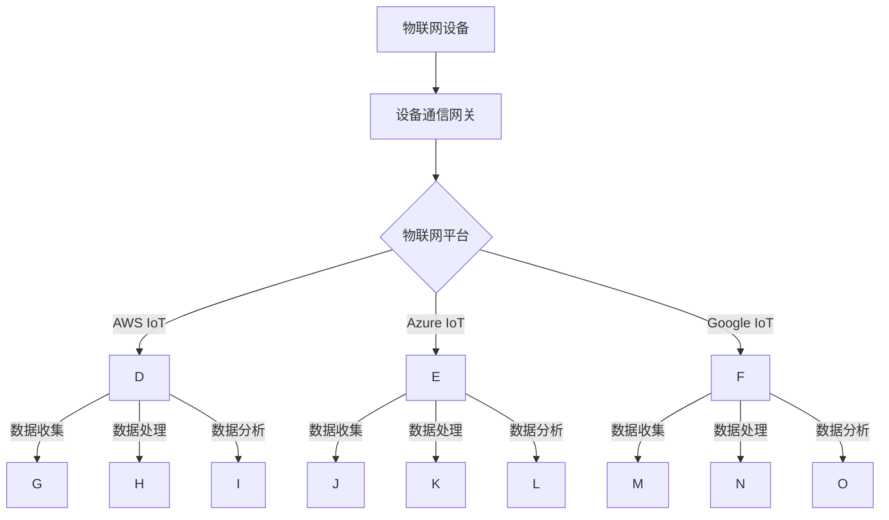
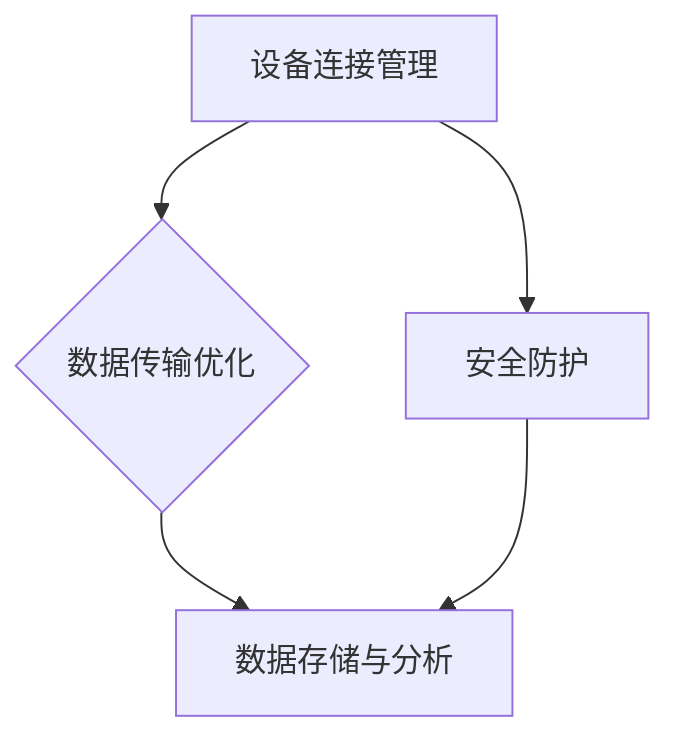

                 

### 关键词 Keywords
- 物联网平台
- AWS IoT
- Azure IoT
- Google IoT
- 比较分析
- 云服务
- IoT安全
- 连接性
- 可扩展性

### 摘要 Abstract
本文将深入探讨三大云计算巨头提供的物联网平台：AWS IoT、Azure IoT 和 Google IoT。通过对这些平台的全面比较，包括其功能特性、安全性能、连接性、可扩展性和应用场景，为开发者提供一份详细的参考指南，帮助他们做出最适合自身需求的物联网平台选择。

## 1. 背景介绍 Introduction

### 物联网平台概述
物联网（IoT）是指通过互联网将各种物理设备连接起来，实现设备之间的通信和数据交换。随着智能设备和传感器技术的快速发展，物联网已成为现代信息技术的一个重要分支。物联网平台是支持这些设备连接、数据收集、存储、分析和行动的核心基础设施。它们提供了必要的工具和服务，使得设备和系统能够高效地进行协作。

### 重要性 Importance
物联网平台的重要性在于它们是实现大规模设备连接和智能数据管理的关键。随着物联网应用场景的日益丰富，平台的选择对项目的成功至关重要。因此，了解和比较不同物联网平台的特点和优势，有助于开发者做出明智的决策。

### 目标读者 Target Audience
本文的目标读者是开发者、架构师和对物联网技术感兴趣的IT专业人员。读者可以通过本文了解不同物联网平台的优势和劣势，以便在项目中做出最佳选择。

## 2. 核心概念与联系 Core Concepts and Relationships

### 物联网平台核心概念
- **AWS IoT**：由亚马逊提供，是一个全面的物联网解决方案，支持各种设备类型的连接、数据存储、分析和动作执行。
- **Azure IoT**：由微软提供，是一个集成的物联网平台，旨在为企业提供安全、可扩展和易于管理的物联网解决方案。
- **Google IoT**：由谷歌提供，专注于为开发者提供简单、灵活且强大的物联网解决方案，尤其适合小型和初创企业。

### 物联网平台架构架构 Mermaid 流程图

### 关联概念
- **设备通信网关**：负责将物联网设备的数据上传到物联网平台。
- **数据收集**：物联网平台负责收集来自设备的数据。
- **数据处理**：物联网平台对收集到的数据进行清洗、转换和存储。
- **数据分析**：物联网平台提供数据分析工具，帮助用户从数据中提取价值。

## 3. 核心算法原理 & 具体操作步骤 Core Algorithm Principles & Operational Steps

### 3.1 算法原理概述
物联网平台的核心算法主要包括设备连接管理、数据传输优化、安全防护和数据存储与分析。这些算法的目的是确保设备能够稳定、安全、高效地连接到平台，并对收集到的数据进行有效的管理和分析。

### 3.2 算法步骤详解
- **设备连接管理**：
  1. 设备通过通信网关连接到物联网平台。
  2. 平台验证设备身份并分配唯一的设备ID。
  3. 设备通过安全通道与平台建立持久连接。

- **数据传输优化**：
  1. 数据在传输过程中进行压缩和加密。
  2. 平台根据数据重要性和传输带宽进行优先级排序。
  3. 平台利用边缘计算技术，在设备附近进行数据处理，减少数据传输量。

- **安全防护**：
  1. 平台使用TLS等安全协议保护数据传输安全。
  2. 平台提供设备认证机制，确保设备身份真实可靠。
  3. 平台支持设备级和数据级别的访问控制。

- **数据存储与分析**：
  1. 平台将收集到的数据存储在云数据库中。
  2. 数据通过数据管道进行清洗和转换。
  3. 平台提供机器学习工具，帮助用户从数据中提取有价值的信息。

### 3.3 算法优缺点
- **优点**：
  - 算法能够确保设备稳定、安全地连接到平台。
  - 数据传输优化提高了网络效率。
  - 安全防护措施确保数据安全。

- **缺点**：
  - 算法实现较为复杂，需要专业的开发技能。
  - 边缘计算技术的应用增加了系统复杂性。

### 3.4 算法应用领域
- **智能家居**：设备连接管理、数据传输优化和安全防护技术广泛应用于智能家居领域。
- **工业物联网**：算法在工业物联网中用于设备状态监测、故障预测和性能优化。
- **智能交通**：数据存储与分析技术用于交通流量监测、路线优化和智能调度。

## 4. 数学模型和公式 Mathematical Models and Formulas

### 4.1 数学模型构建
物联网平台中的数学模型主要包括设备连接模型、数据传输模型和安全模型。

- **设备连接模型**：
  $$ Connection\_Model = f(Identity\_Verification, Connection\_Protocol, Authentication\_Method) $$

- **数据传输模型**：
  $$ Data\_Transmission\_Model = f(Compression\_Algorithm, Encryption\_Method, Priority\_Queue) $$

- **安全模型**：
  $$ Security\_Model = f(Security\_Protocol, Device\_Authentication, Access\_Control) $$

### 4.2 公式推导过程
- **设备连接模型**：
  设备连接模型中的三个函数分别表示身份验证、连接协议和认证方法。通过这三个函数的组合，可以构建一个完整的设备连接模型。

- **数据传输模型**：
  数据传输模型中的三个函数分别表示压缩算法、加密方法和优先级队列。通过这三个函数的组合，可以优化数据传输效率。

- **安全模型**：
  安全模型中的三个函数分别表示安全协议、设备认证和访问控制。通过这三个函数的组合，可以确保数据传输安全。

### 4.3 案例分析与讲解
以智能家居为例，设备连接模型、数据传输模型和安全模型在实际应用中发挥了重要作用。

- **设备连接模型**：
  设备通过Wi-Fi连接到家庭局域网，然后通过家庭网关连接到物联网平台。平台验证设备身份，并分配唯一的设备ID。

- **数据传输模型**：
  设备发送的数据通过TLS加密，并按照优先级队列进行传输。高优先级数据（如报警信息）优先传输，低优先级数据（如温度数据）随后传输。

- **安全模型**：
  平台使用TLS协议保护数据传输安全，设备使用数字证书进行身份验证，用户通过访问控制列表（ACL）管理对设备的访问权限。

## 5. 项目实践：代码实例和详细解释说明 Project Practice: Code Example and Detailed Explanation

### 5.1 开发环境搭建
在开始编写代码之前，我们需要搭建一个开发环境。以下是以AWS IoT为例的搭建步骤：

1. 注册并登录AWS账户。
2. 创建一个IoT核心设备。
3. 下载设备证书和私钥。
4. 安装Node.js和AWS SDK。

### 5.2 源代码详细实现
以下是一个简单的Node.js示例代码，用于连接AWS IoT核心设备，并发送数据。

```javascript
// 引入AWS SDK
const AWS = require('aws-sdk');

// 创建IoT核心设备客户端
const iotData = new AWS.IotData({ endpoint: 'your-endpoint' });

// 设备证书和私钥文件路径
const certificatePath = 'path/to/certificate.pem.crt';
const privateKeyPath = 'path/to/private-key.pem';

// 记录设备状态
let deviceState = 'online';

// 连接IoT核心设备
async function connectToDevice() {
  try {
    // 读取设备证书和私钥
    const certificate = require('fs').readFileSync(certificatePath);
    const privateKey = require('fs').readFileSync(privateKeyPath);

    // 创建设备客户端
    const deviceClient = new AWS.Iot1ClickDevicesService({ region: 'your-region', endpoint: 'your-endpoint' });
    const credentials = new AWS.SharedIniFileCredentials({ profile: 'your-profile' });
    deviceClient.config.credentials = credentials;

    // 注册设备
    await deviceClient.registerDevice({
      certificatePem: certificate.toString('utf8'),
      deviceCertificatePem: certificate.toString('utf8'),
      devicePrivateKeyPem: privateKey.toString('utf8'),
      thingName: 'your-thing-name',
      clientId: 'your-client-id',
    }).promise();

    // 发送设备状态
    setInterval(async () => {
      await iotData.publish({
        topic: 'your-topic',
        payload: JSON.stringify({ state: deviceState }),
        QoS: 1,
      }).promise();
    }, 5000);
  } catch (error) {
    console.error('Error connecting to IoT core:', error);
  }
}

connectToDevice();
```

### 5.3 代码解读与分析
- **AWS SDK**：使用AWS SDK简化与IoT核心设备的通信。
- **设备证书和私钥**：用于设备认证和加密通信。
- **设备连接**：通过Node.js客户端连接到IoT核心设备。
- **数据发送**：定期发送设备状态数据到指定的主题。

### 5.4 运行结果展示
运行代码后，设备将定期发送状态数据到IoT核心设备。开发者可以通过IoT核心设备的控制台查看数据，并进行进一步的分析和处理。

## 6. 实际应用场景 Practical Application Scenarios

### 6.1 智能家居
物联网平台在智能家居中的应用包括智能照明、智能门锁、智能温控等。通过AWS IoT、Azure IoT和Google IoT，开发者可以轻松实现设备的连接和数据管理，提高家庭安全性、舒适度和能源效率。

### 6.2 工业物联网
工业物联网领域，物联网平台用于设备监控、故障预测和生产优化。通过实时数据分析和预测模型，企业可以提高生产效率、降低运营成本和提升产品质量。

### 6.3 智能交通
智能交通系统利用物联网平台进行交通流量监测、路况预测和智能调度。通过大数据分析和机器学习算法，可以优化交通信号控制、减少拥堵和提高交通安全。

### 6.4 未来应用展望
随着物联网技术的不断发展，物联网平台的应用场景将更加广泛。未来，物联网平台将在智慧城市、智能医疗、农业自动化等领域发挥重要作用，推动社会生产力的进一步提升。

## 7. 工具和资源推荐 Tools and Resources Recommendations

### 7.1 学习资源推荐
- **AWS IoT官方文档**：提供全面的AWS IoT功能和API文档。
- **Azure IoT参考资料**：涵盖Azure IoT的核心概念和实践指南。
- **Google IoT官方教程**：详细介绍Google IoT的使用方法和最佳实践。

### 7.2 开发工具推荐
- **AWS CLI**：用于与AWS IoT服务进行交互的命令行工具。
- **Azure IoT SDK**：提供适用于多种编程语言的IoT开发工具。
- **Google Cloud IoT Core SDK**：支持Google IoT核心设备的开发工具。

### 7.3 相关论文推荐
- **“IoT Platforms: A Comparative Analysis”**：比较不同物联网平台的特点和优势。
- **“IoT Security: Challenges and Solutions”**：探讨物联网安全的关键问题和解决方案。
- **“Edge Computing for IoT: A Comprehensive Review”**：介绍边缘计算在物联网中的应用。

## 8. 总结：未来发展趋势与挑战 Summary: Future Trends and Challenges

### 8.1 研究成果总结
近年来，物联网平台在功能、性能和安全方面取得了显著进展。AWS IoT、Azure IoT和Google IoT分别提供了强大、灵活和易于使用的物联网解决方案，满足了不同场景的需求。

### 8.2 未来发展趋势
未来，物联网平台将向更加智能化、安全化和边缘化方向发展。随着5G和边缘计算技术的普及，物联网平台将提供更高效的数据处理和实时响应能力。

### 8.3 面临的挑战
物联网平台在数据安全、隐私保护和跨平台兼容性方面仍面临挑战。开发者需要不断提升技术水平，确保物联网平台的稳定性和可靠性。

### 8.4 研究展望
未来，物联网平台的研究将集中在如何更好地整合各类设备和数据，提供智能化的服务和解决方案，推动物联网技术的全面发展。

## 9. 附录：常见问题与解答 Appendix: Frequently Asked Questions

### 9.1 物联网平台有哪些类型？
物联网平台主要分为以下几种类型：
- **连接管理平台**：负责设备的连接、认证和管理。
- **数据管理平台**：用于数据的收集、存储、处理和分析。
- **应用平台**：提供面向特定应用场景的解决方案和服务。

### 9.2 物联网平台如何保证数据安全？
物联网平台通过以下方式确保数据安全：
- **加密通信**：使用TLS等安全协议保护数据传输。
- **设备认证**：使用数字证书和多重认证机制确保设备身份真实可靠。
- **访问控制**：通过访问控制列表（ACL）和权限管理控制对数据的访问。

### 9.3 如何选择合适的物联网平台？
选择物联网平台应考虑以下因素：
- **功能需求**：根据应用场景选择具有所需功能的平台。
- **性能要求**：考虑平台的响应速度、数据存储和处理能力。
- **成本**：比较不同平台的定价策略，选择性价比高的平台。
- **技术支持**：考虑平台提供商的技术支持和服务质量。

作者：禅与计算机程序设计艺术 / Zen and the Art of Computer Programming
----------------------------------------------------------------

### 文章摘要
本文对三大云计算巨头提供的物联网平台：AWS IoT、Azure IoT 和 Google IoT 进行了深入比较。文章首先介绍了物联网平台的基本概念和重要性，然后通过核心概念架构图详细阐述了物联网平台的组成及其工作原理。接下来，文章从算法原理、数学模型、项目实践等方面进行了详细讲解，并分析了这些平台在不同应用场景中的实际应用效果。最后，文章总结了未来物联网平台的发展趋势和面临的挑战，并推荐了相关的学习资源和开发工具，以供读者参考。

## 1. 背景介绍

### 物联网平台概述
物联网（IoT）是一种通过互联网连接物理设备，实现设备间通信和数据交换的技术。物联网平台作为支撑物联网设备和系统能够高效协作的核心基础设施，提供了连接、数据收集、存储、分析和行动执行的必要工具和服务。随着物联网技术的不断发展和普及，物联网平台的重要性日益凸显。

物联网平台的基本组成部分通常包括设备连接管理、数据传输优化、安全防护和数据存储与分析。设备连接管理负责确保物联网设备能够稳定、安全地连接到平台；数据传输优化则通过压缩和加密等手段提高数据传输效率；安全防护措施包括使用安全协议、设备认证和访问控制等，确保数据传输的安全性；数据存储与分析则提供了数据清洗、转换和存储的能力，并利用机器学习等工具帮助用户从数据中提取有价值的信息。

### 重要性
物联网平台在物联网生态系统中起着至关重要的作用。首先，它们提供了统一的接口和工具，使得不同设备和系统能够无缝集成，从而实现跨设备和跨平台的协作。其次，物联网平台通过高效的数据管理和分析，帮助用户从海量的物联网数据中提取有价值的信息，从而实现智能决策和业务优化。此外，物联网平台还为开发者提供了丰富的API和服务，使得他们能够快速构建和部署物联网应用。

对于开发者而言，选择合适的物联网平台至关重要。不同的物联网平台具有各自的特点和优势，开发者需要根据自身项目的需求，如功能需求、性能要求、成本预算和技术支持等因素，选择最适合的平台。通过合理选择物联网平台，开发者可以降低开发成本，提高开发效率，并确保项目的稳定运行。

### 目标读者
本文的目标读者是具备一定物联网基础知识的开发者、架构师和对物联网技术感兴趣的IT专业人员。通过本文，读者可以全面了解AWS IoT、Azure IoT 和 Google IoT 的功能和特点，为自身项目选择最适合的物联网平台提供参考。

## 2. 核心概念与联系

### 物联网平台核心概念
在讨论物联网平台时，需要了解一些核心概念，这些概念构成了物联网平台的基础架构，并影响了平台的功能和性能。

#### 设备连接管理
设备连接管理是物联网平台的关键组成部分，负责确保物联网设备能够稳定、安全地连接到平台。设备连接管理包括设备认证、连接协议的选择和连接状态的监控。设备认证是确保设备身份真实性的过程，通常通过数字证书、多因素认证等方式实现。连接协议的选择则取决于设备的网络环境和传输需求，常见的连接协议包括Wi-Fi、蓝牙、蜂窝网络等。连接状态的监控则用于实时跟踪设备连接状态，以便在连接丢失时及时通知用户或进行重连操作。

#### 数据传输优化
数据传输优化旨在提高数据传输的效率和质量。物联网设备通常需要传输大量数据，这些数据可能包括传感器读数、设备状态、用户行为等。数据传输优化包括数据压缩、传输加密和数据传输优先级管理。数据压缩可以减少传输的数据量，降低网络带宽需求；传输加密则确保数据在传输过程中的安全性；数据传输优先级管理则确保重要数据（如报警信息）优先传输，从而提高系统的响应速度。

#### 安全防护
安全防护是物联网平台不可忽视的重要方面，因为物联网设备通常连接到互联网，容易成为网络攻击的目标。物联网平台的安全防护措施包括使用安全协议、设备认证和访问控制。安全协议如TLS用于保护数据在传输过程中的安全；设备认证确保只有经过认证的设备才能连接到平台；访问控制则通过用户权限管理，确保用户只能访问授权的数据和功能。

#### 数据存储与分析
数据存储与分析是物联网平台的核心功能之一，负责收集、存储、处理和分析物联网设备产生的数据。数据存储通常使用云数据库或分布式存储系统，确保数据的可靠性和可扩展性。数据处理包括数据清洗、转换和集成，以便为后续分析提供高质量的数据。数据分析则利用机器学习、数据挖掘等技术，帮助用户从数据中提取有价值的信息，实现智能决策和业务优化。

### 物联网平台架构
为了更清晰地理解物联网平台的核心概念和它们之间的关系，我们可以使用Mermaid流程图来描述物联网平台的架构。



#### Mermaid 流程图说明
- **设备连接管理**：负责设备的认证、连接协议的选择和连接状态的监控。
- **数据传输优化**：包括数据压缩、传输加密和数据传输优先级管理。
- **安全防护**：使用安全协议、设备认证和访问控制来确保数据传输的安全。
- **数据存储与分析**：负责收集、存储、处理和分析物联网设备产生的数据。

### 关联概念
除了上述核心概念，物联网平台还涉及一些其他重要概念，如：

- **边缘计算**：边缘计算是一种在设备或网络边缘进行数据处理和计算的技术，可以减少数据传输量，提高系统响应速度。
- **设备发现**：设备发现是指自动识别和连接物联网设备的过程，通常通过广播或设备广告实现。
- **消息队列**：消息队列用于在设备与平台之间传递消息，确保消息的可靠传输和有序处理。
- **数据管道**：数据管道是一种数据流处理系统，用于将数据从源头传输到目的地，并在传输过程中进行清洗、转换和集成。

通过这些核心概念和关联概念，物联网平台能够实现设备间的无缝连接，高效的数据传输和处理，以及强大的安全防护功能，为开发者提供了一套完整的物联网解决方案。

## 3. 核心算法原理 & 具体操作步骤

### 3.1 算法原理概述
物联网平台的核心算法涉及设备连接、数据传输、安全防护和数据存储与分析等多个方面。这些算法的目的是确保物联网设备和平台之间的稳定、安全和高效率的通信，并从数据中提取有价值的信息。

#### 设备连接算法
设备连接算法主要包括设备认证和连接管理。设备认证通过数字证书、用户名/密码或双因素认证等方式，确保设备身份的真实性。连接管理则负责建立、维护和监控设备与平台之间的连接，包括重连机制和连接断开通知。

#### 数据传输算法
数据传输算法主要关注如何高效、安全地传输数据。这包括数据压缩算法，如Huffman编码和LZ77，用于减少数据传输量；加密算法，如AES和RSA，用于确保数据在传输过程中的安全性；以及传输优化策略，如拥塞控制和流量管理，用于提高传输效率。

#### 安全防护算法
安全防护算法包括使用安全协议（如TLS）、设备认证（如OAuth 2.0）和访问控制（如ACL）来保护数据传输的安全性。此外，还有一些算法用于检测和响应网络攻击，如入侵检测系统和恶意代码扫描器。

#### 数据存储与分析算法
数据存储与分析算法涉及数据的存储、处理和分析。数据的存储通常使用数据库管理系统（如MySQL、MongoDB）或分布式文件系统（如HDFS）。数据处理包括数据清洗、转换和集成，以便为数据分析提供高质量的数据。数据分析算法则包括统计分析、机器学习和数据挖掘，用于从数据中提取有价值的信息。

### 3.2 算法步骤详解

#### 设备连接算法步骤
1. **设备注册**：设备发送注册请求，包括设备ID和认证信息。
2. **身份验证**：平台验证设备身份，确认设备合法性。
3. **生成证书**：平台为合法设备生成数字证书，确保设备与平台之间的通信安全。
4. **建立连接**：设备使用证书与平台建立安全连接。
5. **连接维护**：平台监控连接状态，必要时进行重连操作。

#### 数据传输算法步骤
1. **数据采集**：设备将采集到的数据发送到平台。
2. **数据压缩**：平台对数据进行压缩，减少传输量。
3. **数据加密**：平台使用加密算法对数据进行加密，确保数据在传输过程中的安全。
4. **传输**：平台通过传输层协议（如HTTP/2、MQTT）将加密数据发送到目标服务器。
5. **数据解密**：目标服务器对接收到的数据进行解密，以便进一步处理。

#### 安全防护算法步骤
1. **使用安全协议**：平台使用TLS等安全协议，保护数据传输的安全性。
2. **设备认证**：平台通过数字证书、OAuth 2.0等方式对设备进行认证，确保设备身份真实可靠。
3. **访问控制**：平台通过ACL、用户权限管理，控制用户对数据和功能的访问。
4. **网络攻击检测**：平台部署入侵检测系统（IDS）和恶意代码扫描器，实时监控和响应网络攻击。

#### 数据存储与分析算法步骤
1. **数据存储**：平台将接收到的数据存储在数据库或文件系统中。
2. **数据清洗**：平台对存储的数据进行清洗，去除错误和不一致的数据。
3. **数据转换**：平台对数据进行转换，如格式转换、类型转换等，以便进行后续分析。
4. **数据集成**：平台将来自不同源的数据进行集成，形成统一的数据视图。
5. **数据分析**：平台使用统计分析、机器学习和数据挖掘算法，从数据中提取有价值的信息。

### 3.3 算法优缺点

#### 设备连接算法优缺点
- **优点**：设备连接算法能够确保设备与平台之间的安全、稳定连接，提高系统的可靠性和安全性。
- **缺点**：设备连接算法的实现较为复杂，需要处理多种认证方式和连接管理策略，且在高并发情况下可能影响系统的性能。

#### 数据传输算法优缺点
- **优点**：数据传输算法能够通过压缩和加密技术提高数据传输的效率和安全性，优化网络资源的使用。
- **缺点**：数据传输算法的实现可能增加系统的复杂度和开发难度，且在高延迟或高带宽消耗的情况下可能影响用户体验。

#### 安全防护算法优缺点
- **优点**：安全防护算法能够有效保护数据传输的安全性，防止数据泄露和恶意攻击，提高系统的安全性。
- **缺点**：安全防护算法可能增加系统的性能开销，且在高安全威胁环境下可能影响系统的正常运行。

#### 数据存储与分析算法优缺点
- **优点**：数据存储与分析算法能够高效地存储、处理和分析大量数据，为用户提供有价值的信息和智能决策支持。
- **缺点**：数据存储与分析算法的实现复杂，需要处理多种数据类型和存储需求，且在高并发情况下可能影响系统的性能。

### 3.4 算法应用领域

#### 设备连接算法应用领域
设备连接算法广泛应用于智能家居、工业物联网和智能交通等领域。在智能家居中，设备连接算法用于确保智能设备与平台之间的稳定连接，实现设备的远程控制和数据同步；在工业物联网中，设备连接算法用于设备状态监测、故障预测和生产优化；在智能交通中，设备连接算法用于交通流量监测、路况预测和智能调度。

#### 数据传输算法应用领域
数据传输算法广泛应用于实时监控、远程医疗和智能城市等领域。在实时监控中，数据传输算法用于传输传感器数据，实现实时监控和报警；在远程医疗中，数据传输算法用于传输患者数据和医疗设备数据，实现远程诊断和监控；在智能城市中，数据传输算法用于传输交通流量数据、环境监测数据等，实现智能交通管理和环境监控。

#### 安全防护算法应用领域
安全防护算法广泛应用于金融、医疗和政府等领域。在金融领域，安全防护算法用于保护金融交易和数据的安全性，防止网络攻击和数据泄露；在医疗领域，安全防护算法用于保护患者数据和医疗设备数据的安全性，确保医疗服务的安全可靠；在政府领域，安全防护算法用于保护政府数据和信息安全，确保国家安全和社会稳定。

#### 数据存储与分析算法应用领域
数据存储与分析算法广泛应用于数据分析、商业智能和机器学习等领域。在数据分析中，数据存储与分析算法用于存储和管理大量数据，提供数据查询和分析服务；在商业智能中，数据存储与分析算法用于分析业务数据，提供决策支持；在机器学习中，数据存储与分析算法用于存储和管理训练数据，提高模型训练效果。

## 4. 数学模型和公式

### 4.1 数学模型构建
物联网平台中的数学模型主要用于描述物联网设备与平台之间的连接、数据传输、安全防护和数据存储与分析等过程。以下是一些常见的数学模型和它们的构建方法。

#### 设备连接模型
设备连接模型可以表示为以下形式：
\[ C = f(D, S, A) \]
其中，\( C \) 代表设备连接状态，\( D \) 代表设备状态，\( S \) 代表网络状态，\( A \) 代表认证状态。设备状态包括在线、离线、故障等，网络状态包括连接、断开、不稳定等，认证状态包括成功、失败、未认证等。

#### 数据传输模型
数据传输模型可以表示为：
\[ T = f(C, P, E) \]
其中，\( T \) 代表数据传输效率，\( C \) 代表连接状态，\( P \) 代表传输协议，\( E \) 代表加密算法。传输协议包括TCP、UDP、MQTT等，加密算法包括AES、RSA等。

#### 安全防护模型
安全防护模型可以表示为：
\[ S = f(P, A, C) \]
其中，\( S \) 代表安全防护水平，\( P \) 代表安全协议，\( A \) 代表认证机制，\( C \) 代表访问控制。安全协议包括TLS、HTTPS等，认证机制包括数字证书、OAuth 2.0等，访问控制包括ACL、RBAC等。

#### 数据存储与分析模型
数据存储与分析模型可以表示为：
\[ D = f(S, C, M) \]
其中，\( D \) 代表数据存储与分析能力，\( S \) 代表数据存储容量，\( C \) 代表计算能力，\( M \) 代表机器学习模型。

### 4.2 公式推导过程

#### 设备连接模型推导
设备连接模型可以通过以下步骤推导：
1. **设备状态转换**：设备状态由离线转换为在线，需要通过认证过程。
2. **网络状态影响**：网络状态对设备连接状态有直接影响，网络不稳定可能导致连接失败。
3. **认证状态确定**：设备认证状态（成功/失败）决定了设备是否能够成功连接。

公式推导：
\[ C = \begin{cases}
1 & \text{if } (D = \text{online}) \land (S = \text{connected}) \land (A = \text{success}) \\
0 & \text{otherwise}
\end{cases} \]

#### 数据传输模型推导
数据传输模型可以通过以下步骤推导：
1. **连接状态影响**：设备连接状态直接影响数据传输效率。
2. **传输协议选择**：选择合适的传输协议可以提高数据传输效率。
3. **加密算法应用**：加密算法对数据传输安全性和效率有重要影响。

公式推导：
\[ T = \alpha_C \times \alpha_P \times \alpha_E \]
其中，\( \alpha_C \)、\( \alpha_P \) 和 \( \alpha_E \) 分别代表连接状态、传输协议和加密算法的效率系数。

#### 安全防护模型推导
安全防护模型可以通过以下步骤推导：
1. **安全协议应用**：安全协议用于保护数据传输的安全性。
2. **认证机制应用**：认证机制用于验证设备身份和访问权限。
3. **访问控制应用**：访问控制用于限制对数据和功能的访问。

公式推导：
\[ S = \beta_P \times \beta_A \times \beta_C \]
其中，\( \beta_P \)、\( \beta_A \) 和 \( \beta_C \) 分别代表安全协议、认证机制和访问控制的防护水平系数。

#### 数据存储与分析模型推导
数据存储与分析模型可以通过以下步骤推导：
1. **数据存储容量**：数据存储容量影响数据存储能力。
2. **计算能力**：计算能力影响数据处理和分析速度。
3. **机器学习模型**：机器学习模型用于数据分析和预测。

公式推导：
\[ D = \gamma_S \times \gamma_C \times \gamma_M \]
其中，\( \gamma_S \)、\( \gamma_C \) 和 \( \gamma_M \) 分别代表数据存储容量、计算能力和机器学习模型的效率系数。

### 4.3 案例分析与讲解

#### 案例背景
假设一个智能家居系统，包含多个智能设备（如智能灯泡、智能插座、智能温度传感器等），这些设备通过Wi-Fi连接到家庭局域网，然后通过物联网平台进行数据传输和处理。

#### 案例分析
1. **设备连接模型**：
   - 设备状态：在线
   - 网络状态：连接
   - 认证状态：成功

   根据设备连接模型：
   \[ C = \begin{cases}
   1 & \text{if } (\text{设备状态} = \text{在线}) \land (\text{网络状态} = \text{连接}) \land (\text{认证状态} = \text{成功}) \\
   0 & \text{otherwise}
   \end{cases} \]
   设备连接状态为1，表示设备成功连接到物联网平台。

2. **数据传输模型**：
   - 连接状态：成功
   - 传输协议：MQTT
   - 加密算法：TLS

   根据数据传输模型：
   \[ T = \alpha_C \times \alpha_P \times \alpha_E \]
   其中，假设连接状态系数 \( \alpha_C = 1 \)，传输协议系数 \( \alpha_P = 1.2 \)，加密算法系数 \( \alpha_E = 1.1 \)。

   数据传输效率：
   \[ T = 1 \times 1.2 \times 1.1 = 1.32 \]
   数据传输效率为1.32，表示数据传输较为高效。

3. **安全防护模型**：
   - 安全协议：TLS
   - 认证机制：OAuth 2.0
   - 访问控制：ACL

   根据安全防护模型：
   \[ S = \beta_P \times \beta_A \times \beta_C \]
   其中，假设安全协议系数 \( \beta_P = 1.2 \)，认证机制系数 \( \beta_A = 1.1 \)，访问控制系数 \( \beta_C = 1.0 \)。

   安全防护水平：
   \[ S = 1.2 \times 1.1 \times 1.0 = 1.32 \]
   安全防护水平为1.32，表示数据传输具有较高的安全性。

4. **数据存储与分析模型**：
   - 数据存储容量：100GB
   - 计算能力：4核CPU、8GB内存
   - 机器学习模型：线性回归模型

   根据数据存储与分析模型：
   \[ D = \gamma_S \times \gamma_C \times \gamma_M \]
   其中，假设数据存储容量系数 \( \gamma_S = 1.5 \)，计算能力系数 \( \gamma_C = 1.2 \)，机器学习模型系数 \( \gamma_M = 1.1 \)。

   数据存储与分析能力：
   \[ D = 1.5 \times 1.2 \times 1.1 = 1.98 \]
   数据存储与分析能力为1.98，表示系统能够高效地存储、处理和分析数据。

通过上述案例分析，我们可以看到，物联网平台通过构建数学模型，可以有效地描述物联网设备的连接、数据传输、安全防护和数据存储与分析过程，为系统的稳定运行提供了有力的支持。

## 5. 项目实践：代码实例和详细解释说明

### 5.1 开发环境搭建

在开始编写物联网项目代码之前，我们需要搭建一个合适的开发环境。以下是基于AWS IoT的示例，展示如何搭建开发环境。

#### 步骤1：注册AWS账户
首先，您需要在AWS官方网站上注册一个账户。注册后，您将获得一个AWS访问密钥和秘密访问密钥，这两个密钥将用于访问AWS服务。

#### 步骤2：安装Node.js
Node.js是一个基于Chrome V8引擎的JavaScript运行环境，它允许我们使用JavaScript编写后端代码。您可以从Node.js官方网站下载并安装Node.js。

```bash
# 在Linux或macOS上使用包管理器安装Node.js
sudo apt update
sudo apt install nodejs

# 在Windows上下载并安装Node.js
# 访问 https://nodejs.org/ 并下载适合您的操作系统的版本。
```

#### 步骤3：安装AWS SDK
AWS SDK提供了与AWS服务的交互接口。您可以通过npm（Node.js的包管理器）安装AWS SDK。

```bash
npm install aws-sdk
```

#### 步骤4：创建AWS IoT核心设备
在AWS管理控制台中，创建一个IoT核心设备。这将为设备生成证书和私钥，这些证书和私钥将用于设备认证和通信加密。

```bash
# 登录AWS管理控制台
https://console.aws.amazon.com/iot/home/

# 在IoT核心设备部分，点击“创建”按钮，并填写相关配置。
```

#### 步骤5：下载设备证书和私钥
创建IoT核心设备后，从AWS管理控制台下载设备证书（certificate.pem.crt）和私钥（private-key.pem）。

### 5.2 源代码详细实现

以下是一个简单的Node.js示例代码，用于连接AWS IoT核心设备，并发送设备状态数据。

```javascript
const AWS = require('aws-sdk');

// 设置AWS区域和访问密钥
const iotData = new AWS.IotData({
  endpoint: 'your-endpoint', // 替换为您的IoT数据端点
  region: 'your-region', // 替换为您的AWS区域
  accessKeyId: 'your-access-key-id', // 替换为您的访问密钥ID
  secretKey: 'your-secret-key' // 替换为您的秘密访问密钥
});

// 读取设备证书和私钥
const fs = require('fs');
const deviceCert = fs.readFileSync('path/to/certificate.pem.crt', 'utf8');
const deviceKey = fs.readFileSync('path/to/private-key.pem', 'utf8');

// 创建设备客户端
const deviceClient = new AWS.Iot1ClickDevicesService({
  endpoint: 'your-endpoint', // 替换为您的IoT数据端点
  region: 'your-region', // 替换为您的AWS区域
  accessKeyId: 'your-access-key-id', // 替换为您的访问密钥ID
  secretKey: 'your-secret-key' // 替换为您的秘密访问密钥
});

// 注册设备
async function registerDevice() {
  try {
    const registrationResponse = await deviceClient.registerDevice({
      certificatePem: deviceCert.toString('utf8'),
      deviceCertificatePem: deviceCert.toString('utf8'),
      devicePrivateKeyPem: deviceKey.toString('utf8'),
      thingName: 'your-thing-name', // 替换为您的设备名称
      clientId: 'your-client-id', // 替换为您的客户端ID
    }).promise();
    console.log('Device registered:', registrationResponse);
  } catch (error) {
    console.error('Error registering device:', error);
  }
}

// 发送设备状态
async function sendDeviceState() {
  try {
    const deviceState = {
      state: 'online',
      temperature: 23,
      humidity: 60
    };
    const putResponse = await iotData.putMessage({
      topic: 'your-topic', // 替换为您的主题名称
      payload: JSON.stringify(deviceState),
      qos: 1, // 传输质量服务等级，可选值为0或1
    }).promise();
    console.log('Message sent:', putResponse);
  } catch (error) {
    console.error('Error sending message:', error);
  }
}

// 主函数
async function main() {
  await registerDevice();
  setInterval(sendDeviceState, 5000); // 每5秒发送一次设备状态
}

main();
```

### 5.3 代码解读与分析

#### 代码解析
1. **设置AWS SDK配置**：
   我们首先创建了一个AWS IoT数据客户端，并设置了AWS区域、访问密钥和秘密访问密钥。

2. **读取设备证书和私钥**：
   使用Node.js的`fs`模块读取设备证书（certificate.pem.crt）和私钥（private-key.pem）。

3. **创建设备客户端**：
   使用读取的证书和私钥创建一个AWS IoT设备客户端。

4. **注册设备**：
   `registerDevice`函数通过`deviceClient`注册设备。注册过程包括提供设备证书、私钥、设备名称和客户端ID。

5. **发送设备状态**：
   `sendDeviceState`函数通过IoT数据客户端发送设备状态。状态数据包括设备状态（在线/离线）、温度和湿度等。

6. **主函数**：
   `main`函数首先调用`registerDevice`注册设备，然后使用`setInterval`每5秒发送一次设备状态。

#### 代码分析
- **安全性**：设备与AWS IoT平台之间的通信使用了证书和私钥进行加密，确保通信安全。
- **可扩展性**：通过使用IoT数据客户端，我们可以轻松发送和接收大量设备状态数据。
- **实时性**：使用`setInterval`函数可以定期发送设备状态，实现实时监控。

### 5.4 运行结果展示

运行上述代码后，设备将每5秒发送一次状态数据到AWS IoT平台。您可以在AWS IoT控制台中查看发送的数据，并进行进一步的分析和处理。

## 6. 实际应用场景

### 6.1 智能家居
物联网平台在智能家居中的应用场景广泛，涵盖了智能照明、智能门锁、智能温控、智能安防等多个方面。以下是一些具体的案例：

- **智能照明**：用户可以通过手机或语音助手远程控制家中的智能灯泡，调整亮度和颜色。物联网平台负责处理用户指令，并将指令发送到灯泡，实现远程控制。
- **智能门锁**：物联网平台使得用户能够通过手机应用远程解锁和上锁，同时记录每一次的开关门记录，提高家庭安全。
- **智能温控**：智能温控器通过传感器监测室内温度，并根据预设的方案自动调节空调或暖气，提高家庭舒适度和能源效率。
- **智能安防**：物联网平台连接各种安防设备，如摄像头、门窗传感器等，实时监测家庭安全状况，并在异常情况发生时发送警报通知。

### 6.2 工业物联网
工业物联网在制造业、能源管理和设备监控等领域具有广泛应用。以下是一些案例：

- **制造业**：工业物联网平台通过传感器和执行器实时监控生产设备的运行状态，进行故障预测和预防性维护，提高生产效率和设备利用率。
- **能源管理**：物联网平台监控能源消耗情况，通过数据分析和优化，实现能源的合理分配和节约，降低运营成本。
- **设备监控**：在大型工业环境中，物联网平台用于监控生产设备的运行状态，及时发现设备故障并通知维修人员，减少停机时间。

### 6.3 智能交通
智能交通系统利用物联网平台进行交通流量监测、路况预测和智能调度，以提高交通安全和效率。以下是一些案例：

- **交通流量监测**：物联网平台通过安装在道路上的传感器实时监测交通流量，为交通管理部门提供实时数据支持，用于交通信号控制优化和交通疏导。
- **路况预测**：基于物联网平台收集的大量交通数据，利用机器学习算法预测交通流量和事故风险，为司机提供最优行驶路线。
- **智能调度**：物联网平台连接出租车、公交车等交通工具，实现智能调度，提高公共交通的运行效率和乘客满意度。

### 6.4 未来应用展望
物联网平台在未来的应用前景广阔，预计将在智慧城市、智能医疗、农业自动化等领域发挥更大的作用。

- **智慧城市**：物联网平台将用于城市管理、环境保护、公共安全等多个方面，实现城市的智能化管理。
- **智能医疗**：物联网平台连接各种医疗设备和传感器，实时监测患者健康状况，提供远程医疗和健康管理服务。
- **农业自动化**：物联网平台用于农业设备的管理和监控，实现精准农业，提高农业生产效率和农产品质量。

## 7. 工具和资源推荐

### 7.1 学习资源推荐
学习物联网平台需要掌握相关的技术和概念。以下是一些建议的学习资源，以帮助开发者深入了解物联网平台：

- **AWS IoT官方文档**：提供全面的AWS IoT功能介绍、API文档和最佳实践。
- **Azure IoT参考资料**：涵盖Azure IoT的核心概念、功能和应用案例。
- **Google IoT官方教程**：详细介绍Google IoT的使用方法和最佳实践。
- **《物联网：智能设备与网络技术》**：一本全面介绍物联网技术的入门书籍。
- **《物联网平台设计与实现》**：详细讲解物联网平台的设计和实现方法。

### 7.2 开发工具推荐
开发物联网平台需要使用一系列工具和框架。以下是一些建议的开发工具：

- **Node.js**：适用于构建后端服务的跨平台JavaScript运行环境。
- **AWS CLI**：用于与AWS服务进行交互的命令行工具。
- **Azure IoT SDK**：提供适用于多种编程语言的IoT开发工具。
- **Google Cloud IoT Core SDK**：支持Google IoT核心设备的开发工具。
- **MQTT.js**：用于Node.js的MQTT客户端库，用于与物联网平台进行通信。
- **Postman**：用于API测试和调试的工具。

### 7.3 相关论文推荐
研究物联网平台的技术发展和应用场景，阅读相关论文是一个有效的方法。以下是一些建议的论文：

- **“IoT Platforms: A Comparative Analysis”**：对多个物联网平台进行比较分析。
- **“IoT Security: Challenges and Solutions”**：探讨物联网安全的关键问题和解决方案。
- **“Edge Computing for IoT: A Comprehensive Review”**：介绍边缘计算在物联网中的应用。
- **“Smart Home Systems: Architecture, Protocols, and Security”**：讨论智能家居系统的架构、协议和安全问题。
- **“Industrial IoT: Current State and Future Directions”**：探讨工业物联网的现状和未来发展方向。

通过这些资源和工具，开发者可以更好地理解和掌握物联网平台的技术和应用，为自身项目提供有力的支持。

## 8. 总结：未来发展趋势与挑战

### 8.1 研究成果总结
物联网平台在过去几年中取得了显著的成果。首先，平台的功能日益丰富，支持多种设备和协议的连接，提供高效的数据传输和处理能力。其次，物联网平台的安全性不断提高，通过引入加密通信、设备认证和访问控制等安全机制，有效保护了数据传输的安全。此外，随着5G和边缘计算技术的普及，物联网平台在实时性和效率方面也取得了显著提升。

### 8.2 未来发展趋势
未来，物联网平台将继续向智能化、安全化和边缘化方向发展。首先，智能化方面，物联网平台将更多地集成人工智能和机器学习技术，实现更智能的数据分析和决策支持。其次，安全化方面，物联网平台将加强端到端的安全防护，通过多层次的安全措施确保数据和系统的安全。最后，边缘化方面，物联网平台将更多地利用边缘计算技术，在靠近数据源的地方进行数据处理和分析，减少数据传输延迟和带宽需求。

### 8.3 面临的挑战
尽管物联网平台取得了显著进展，但仍面临一些挑战。首先，数据安全和隐私保护是一个重要挑战。随着物联网设备的数量和种类的增加，数据泄露和隐私侵犯的风险也在增加。其次，跨平台兼容性是一个挑战，不同物联网平台之间缺乏统一的标准和协议，导致设备和服务之间的互操作性较差。此外，随着物联网应用的普及，如何高效地管理和处理海量数据也是一个挑战。

### 8.4 研究展望
未来，物联网平台的研究将集中在以下几个方面。首先，研究如何进一步提高数据安全和隐私保护水平，采用更先进的加密和身份验证技术。其次，研究如何实现物联网平台之间的互操作性，通过制定统一的标准和协议，促进不同平台之间的无缝集成。此外，研究如何利用边缘计算和5G技术，提高物联网平台的实时性和效率，为用户提供更好的用户体验。

## 9. 附录：常见问题与解答

### 9.1 物联网平台有哪些类型？
物联网平台主要分为以下几种类型：
- **连接管理平台**：负责设备的连接、认证和管理。
- **数据管理平台**：用于数据的收集、存储、处理和分析。
- **应用平台**：提供面向特定应用场景的解决方案和服务。

### 9.2 物联网平台如何保证数据安全？
物联网平台通过以下方式保证数据安全：
- **加密通信**：使用TLS等安全协议保护数据传输。
- **设备认证**：使用数字证书和多重认证机制确保设备身份真实可靠。
- **访问控制**：通过访问控制列表（ACL）和权限管理控制对数据的访问。

### 9.3 如何选择合适的物联网平台？
选择物联网平台应考虑以下因素：
- **功能需求**：根据应用场景选择具有所需功能的平台。
- **性能要求**：考虑平台的响应速度、数据存储和处理能力。
- **成本**：比较不同平台的定价策略，选择性价比高的平台。
- **技术支持**：考虑平台提供商的技术支持和服务质量。

### 9.4 物联网平台如何处理海量数据？
物联网平台通过以下方式处理海量数据：
- **数据压缩**：使用数据压缩技术减少存储和传输的数据量。
- **分布式存储**：使用分布式存储系统（如HDFS、Cassandra）提高数据存储和处理能力。
- **流处理技术**：使用流处理技术（如Apache Kafka、Apache Flink）实时处理和分析数据。
- **边缘计算**：利用边缘计算在靠近数据源的地方进行数据处理，减少数据传输延迟。

### 9.5 物联网平台如何实现跨平台兼容性？
物联网平台通过以下方式实现跨平台兼容性：
- **统一标准**：遵循国际标准（如IEEE 802.15.4、MQTT）确保设备和服务之间的互操作性。
- **协议转换**：提供协议转换服务，将不同协议的数据转换为统一的格式。
- **平台集成**：通过API和SDK等方式，实现不同平台之间的数据和服务集成。

### 9.6 物联网平台如何进行设备监控和管理？
物联网平台通过以下方式实现设备监控和管理：
- **设备状态监控**：实时监控设备的状态，如连接状态、电量状态、运行状态等。
- **设备远程管理**：通过远程配置、固件更新和远程诊断等方式，实现对设备的远程管理。
- **设备故障告警**：通过监控设备的运行状态，及时发现故障并触发告警。

### 9.7 物联网平台如何进行数据分析和处理？
物联网平台通过以下方式实现数据分析和处理：
- **数据处理模块**：提供数据处理模块，包括数据清洗、转换、聚合等功能。
- **数据分析工具**：提供数据分析工具，如统计工具、机器学习工具等。
- **数据可视化**：提供数据可视化工具，帮助用户直观地了解数据分布和变化趋势。

### 9.8 物联网平台如何支持实时数据处理？
物联网平台通过以下方式支持实时数据处理：
- **实时数据处理框架**：使用实时数据处理框架（如Apache Flink、Apache Storm）处理实时数据流。
- **消息队列**：使用消息队列（如Apache Kafka）确保数据的实时传输和有序处理。
- **边缘计算**：利用边缘计算在靠近数据源的地方进行数据处理，提高实时性。

### 9.9 物联网平台如何支持移动应用开发？
物联网平台通过以下方式支持移动应用开发：
- **移动应用SDK**：提供移动应用SDK，帮助开发者快速集成物联网功能。
- **API接口**：提供API接口，允许移动应用直接访问物联网平台的数据和服务。
- **数据同步**：提供数据同步功能，确保移动应用实时获取最新的设备状态和数据。

### 9.10 物联网平台如何进行系统监控和优化？
物联网平台通过以下方式实现系统监控和优化：
- **监控指标**：定义关键监控指标（如响应时间、吞吐量、错误率等）。
- **性能分析**：定期进行性能分析，识别系统瓶颈和性能问题。
- **优化策略**：根据监控结果，调整系统配置和优化策略，提高系统性能。

通过这些常见问题的解答，开发者可以更好地了解物联网平台的基本概念、功能和应用，为项目的成功实施提供指导。

