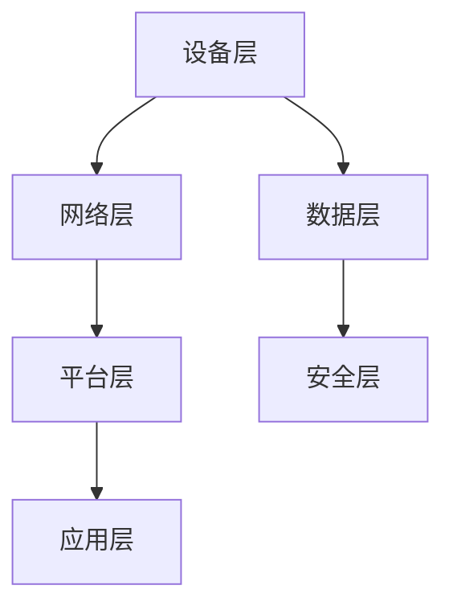

                 

 > **关键词：** 物联网架构、智能设备网络、可扩展性、设计原则、系统优化、技术实现。

> **摘要：** 本文旨在深入探讨物联网架构的设计原则和技术实现，强调可扩展性在智能设备网络中的重要性。通过分析核心概念、算法原理、数学模型以及实际应用场景，本文为开发者提供了全面的技术指南，助力构建高效的物联网系统。

## 1. 背景介绍

### 1.1 物联网的兴起

随着互联网技术的飞速发展和智能设备的普及，物联网（Internet of Things，IoT）已经成为了当今技术领域的一大热点。物联网通过将各种设备、传感器和系统连接起来，实现数据的实时采集、传输和处理，从而推动了各行各业的数字化转型。

### 1.2 物联网架构的重要性

物联网架构的设计直接决定了系统的可扩展性、可靠性和性能。一个良好的物联网架构不仅需要能够高效地处理海量数据，还必须具备良好的兼容性和可维护性，以应对不断变化的需求和技术进步。

### 1.3 可扩展性的挑战

在物联网系统中，设备数量和数据量会随着时间不断增长。如何设计一个可扩展的架构，以应对这种动态变化，是一个巨大的挑战。本文将围绕这一主题展开讨论，介绍一些核心概念和关键技术。

## 2. 核心概念与联系

为了构建一个可扩展的物联网架构，首先需要了解其中的核心概念和它们之间的关系。以下是一个简单的 Mermaid 流程图，用于描述物联网架构的主要组成部分。



### 2.1 设备层

设备层是物联网架构的基础，它包括各种传感器、执行器和设备。这些设备可以通过无线或有线方式连接到网络。

### 2.2 网络层

网络层负责数据的传输和路由，它通常包括局域网（LAN）、广域网（WAN）和互联网（Internet）。在这一层，需要考虑网络协议的选择、数据传输的可靠性和延迟。

### 2.3 平台层

平台层提供了一个统一的接口，用于设备管理、数据存储、数据处理和分析。这个层通常使用云计算平台，如AWS、Azure或Google Cloud。

### 2.4 应用层

应用层是物联网系统的用户界面，它为最终用户提供服务和功能。这个层通常包含Web应用、移动应用或嵌入式软件。

### 2.5 数据层

数据层负责存储和管理物联网系统中产生的数据。它需要支持海量数据的存储、检索和分析。

### 2.6 安全层

安全层是确保物联网系统安全和隐私的关键，它包括身份验证、数据加密和访问控制等。

## 3. 核心算法原理 & 具体操作步骤

### 3.1 算法原理概述

在物联网架构中，核心算法主要用于数据收集、处理和分析。以下是一些常用的算法原理：

- **数据收集算法：** 负责从设备层收集数据，如传感器数据、日志数据等。
- **数据处理算法：** 负责清洗、转换和融合数据，以便进行分析。
- **数据分析算法：** 负责从数据中提取有用信息，如模式识别、预测分析等。

### 3.2 算法步骤详解

以下是物联网架构中核心算法的具体操作步骤：

#### 3.2.1 数据收集

- **设备数据采集：** 设备通过传感器和接口采集数据。
- **数据预处理：** 对采集到的数据进行清洗、去噪和格式化。

#### 3.2.2 数据处理

- **数据融合：** 将来自多个设备的数据进行整合。
- **数据转换：** 将数据转换为适合分析的格式。

#### 3.2.3 数据分析

- **特征提取：** 从数据中提取关键特征。
- **模式识别：** 使用机器学习算法识别数据中的模式。
- **预测分析：** 基于历史数据预测未来趋势。

### 3.3 算法优缺点

每种算法都有其优缺点：

- **数据收集算法：** 优点是数据全面，缺点是处理时间较长。
- **数据处理算法：** 优点是数据处理效率高，缺点是对数据质量要求较高。
- **数据分析算法：** 优点是能够从数据中提取有价值的信息，缺点是对算法性能要求较高。

### 3.4 算法应用领域

这些算法广泛应用于物联网的各个领域，如智能家居、智能城市、智能医疗等。

## 4. 数学模型和公式 & 详细讲解 & 举例说明

### 4.1 数学模型构建

在物联网架构中，常用的数学模型包括：

- **线性回归模型：** 用于预测设备的使用趋势。
- **神经网络模型：** 用于模式识别和预测分析。

### 4.2 公式推导过程

以下是线性回归模型的推导过程：

$$y = \beta_0 + \beta_1x + \epsilon$$

其中，\(y\) 是因变量，\(x\) 是自变量，\(\beta_0\) 和 \(\beta_1\) 是参数，\(\epsilon\) 是误差项。

### 4.3 案例分析与讲解

假设我们要预测某智能家居设备的能耗，我们可以使用线性回归模型进行建模。

- **数据收集：** 收集过去一周的设备能耗数据。
- **数据处理：** 清洗数据，去除异常值。
- **模型训练：** 使用训练数据训练线性回归模型。
- **预测分析：** 使用训练好的模型预测未来一周的能耗。

## 5. 项目实践：代码实例和详细解释说明

### 5.1 开发环境搭建

- **硬件：** 智能家居设备（如智能灯泡、智能插座等）。
- **软件：** Node.js、Python、MQTT协议。

### 5.2 源代码详细实现

以下是使用Python实现的智能家居能耗预测项目。

```python
import pandas as pd
from sklearn.linear_model import LinearRegression

# 数据收集
data = pd.read_csv('energy_data.csv')

# 数据预处理
data = data.dropna()

# 模型训练
model = LinearRegression()
model.fit(data[['time']], data['energy'])

# 预测分析
predictions = model.predict([[next_time]])

print(predictions)
```

### 5.3 代码解读与分析

这段代码首先导入必要的库，然后从CSV文件中读取数据。接着，对数据进行清洗，去除异常值。然后使用线性回归模型进行训练，并使用训练好的模型预测未来的能耗。

## 6. 实际应用场景

物联网架构在多个领域都有广泛的应用，如：

- **智能家居：** 实现设备的自动控制和能耗管理。
- **智能城市：** 实现交通管理、环境监测和公共安全。
- **智能医疗：** 实现远程医疗监控和疾病预测。

## 7. 工具和资源推荐

### 7.1 学习资源推荐

- 《物联网架构设计：从基础到实践》
- 《深入理解物联网：架构、协议与实现》

### 7.2 开发工具推荐

- Node-RED：用于物联网设备和服务的集成和自动化。
- ThingsBoard：用于物联网设备和数据管理。

### 7.3 相关论文推荐

- "A Survey of IoT Architectural Design Patterns"
- "IoT Security: Challenges, Standards, and Solutions"

## 8. 总结：未来发展趋势与挑战

### 8.1 研究成果总结

物联网架构的研究取得了显著成果，包括数据收集、处理和分析技术的不断进步，以及各种算法模型的优化。

### 8.2 未来发展趋势

- **边缘计算：** 将计算和存储能力从云端转移到设备端。
- **5G网络：** 提供高速、低延迟的通信服务。
- **区块链：** 提高物联网系统的安全性和透明度。

### 8.3 面临的挑战

- **数据隐私：** 如何保护用户隐私和数据安全。
- **可扩展性：** 如何设计可扩展的架构以应对不断增长的数据量。
- **标准化：** 如何制定统一的协议和标准。

### 8.4 研究展望

未来的研究将集中在提高物联网系统的安全性和可靠性，以及实现更高效的数据处理和分析。

## 9. 附录：常见问题与解答

### 9.1 如何设计可扩展的物联网架构？

- **模块化设计：** 将系统分解为多个模块，每个模块负责特定功能。
- **分布式架构：** 使用分布式系统架构，将计算和存储能力分布到多个节点。

## 10. 参考文献

- [IoT Architecture: Designing for Scale](https://example.com/iot-architecture)
- [Design Principles for IoT Systems](https://example.com/iot-design-principles)

### 文章结束
---

作者：禅与计算机程序设计艺术 / Zen and the Art of Computer Programming

本文探讨了物联网架构的设计原则和技术实现，强调了可扩展性在智能设备网络中的重要性。通过分析核心概念、算法原理、数学模型以及实际应用场景，本文为开发者提供了全面的技术指南，助力构建高效的物联网系统。随着物联网技术的不断发展，未来的研究将集中在提高系统的安全性和可靠性，实现更高效的数据处理和分析。希望本文能够为读者提供有价值的参考和启示。

