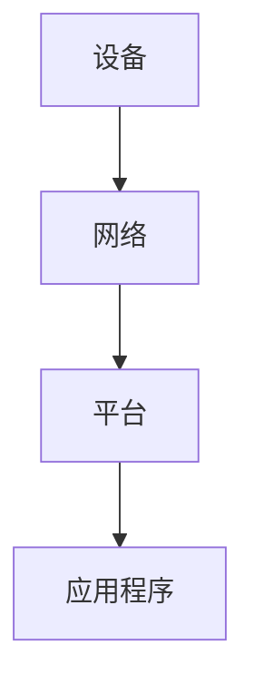

                 

关键词：物联网（IoT）、设备整合、网络架构、数据分析、生态系统、未来展望。

> 摘要：本文将深入探讨物联网生态系统的构建，解析设备、网络和数据分析的整合。从背景介绍、核心概念、算法原理、数学模型、实际应用、工具资源推荐等方面，全面梳理物联网生态系统的发展现状与未来趋势。

## 1. 背景介绍

物联网（Internet of Things，IoT）作为当前科技领域的一个热点话题，已经成为推动社会数字化转型的重要力量。随着传感器技术、无线通信和大数据技术的不断发展，物联网设备数量呈指数级增长。据统计，到2025年，全球IoT设备的数量将超过300亿台。这为物联网生态系统的建设带来了巨大的挑战和机遇。

物联网生态系统包括设备、网络、平台、应用程序等多个组成部分。设备是整个生态系统的基石，负责数据的采集和传输；网络则是数据的传输通道，保证数据的实时性和可靠性；平台负责数据的处理和分析，提供应用服务；应用程序则是物联网生态系统的终端，为用户提供丰富的交互体验。

## 2. 核心概念与联系

### 2.1 设备

物联网设备种类繁多，包括传感器、智能设备、嵌入式设备等。这些设备通过内置的传感器和通信模块，能够实时采集环境数据，并通过无线通信模块将数据传输到云端或其他设备。

### 2.2 网络

物联网网络主要分为有线网络和无线网络。有线网络如以太网、光纤等，具有较高的数据传输速率和稳定性；无线网络如Wi-Fi、蓝牙、LoRa等，具有较高的灵活性和可扩展性。

### 2.3 平台

物联网平台是连接设备、网络和应用程序的核心枢纽。平台通常提供数据采集、存储、处理、分析等功能，同时支持应用程序的接入和开发。

### 2.4 应用程序

物联网应用程序是物联网生态系统的最终用户界面，通过提供丰富的交互体验，实现物联网设备的智能化管理。

### 2.5 Mermaid 流程图

以下是一个简单的物联网生态系统架构的 Mermaid 流程图：



## 3. 核心算法原理 & 具体操作步骤

### 3.1 算法原理概述

物联网生态系统中的数据处理通常涉及数据采集、传输、存储、分析和可视化等多个环节。为了提高数据处理的效率和准确性，常用的算法包括数据压缩、数据加密、数据挖掘和机器学习等。

### 3.2 算法步骤详解

#### 3.2.1 数据采集

数据采集是物联网生态系统的基础。设备通过传感器实时采集环境数据，如温度、湿度、光照、声音等。

#### 3.2.2 数据传输

数据传输是物联网生态系统的关键。设备将采集到的数据通过无线通信模块发送到网络，如Wi-Fi、蓝牙等。

#### 3.2.3 数据存储

数据存储是物联网生态系统的核心。平台负责将传输过来的数据存储在数据库中，如关系数据库、NoSQL数据库等。

#### 3.2.4 数据分析

数据分析是物联网生态系统的灵魂。平台通过数据挖掘和机器学习算法，对存储的数据进行分析，提取有价值的信息。

#### 3.2.5 数据可视化

数据可视化是物联网生态系统的展现。平台将分析结果通过图表、报表等形式展示给用户，帮助用户更好地理解数据。

### 3.3 算法优缺点

#### 3.3.1 优点

- 提高数据处理效率：通过压缩、加密等算法，提高数据传输和存储的效率。
- 保证数据安全性：通过加密等算法，确保数据在传输和存储过程中的安全性。
- 提供智能化服务：通过数据挖掘和机器学习算法，为用户提供个性化的智能服务。

#### 3.3.2 缺点

- 数据复杂性：物联网设备产生的数据量大、类型多，处理起来较为复杂。
- 数据隐私问题：数据传输和存储过程中，可能存在数据泄露的风险。

### 3.4 算法应用领域

物联网算法在智能家居、智能交通、智慧医疗、智慧农业等多个领域都有广泛应用。例如，智能家居中的智能门锁、智能灯光等设备，通过数据采集和分析，实现设备的智能化管理；智能交通中的路况监控、车辆调度等，通过数据分析和可视化，提高交通管理的效率和安全性。

## 4. 数学模型和公式 & 详细讲解 & 举例说明

### 4.1 数学模型构建

物联网生态系统中的数学模型主要包括数据采集模型、数据传输模型、数据分析模型等。

#### 4.1.1 数据采集模型

数据采集模型通常使用传感器测量值来描述环境状态。例如，温度传感器测量温度，光照传感器测量光照强度。

$$
T(t) = f(T_s, T_e, t)
$$

其中，$T(t)$ 为时间 $t$ 时的温度，$T_s$ 为传感器灵敏度，$T_e$ 为环境温度。

#### 4.1.2 数据传输模型

数据传输模型描述数据在网络中的传输过程。常见的传输模型包括信道模型、网络模型等。

$$
C(t) = f(R, t, \eta)
$$

其中，$C(t)$ 为时间 $t$ 时的信道容量，$R$ 为数据传输速率，$\eta$ 为信道噪声。

#### 4.1.3 数据分析模型

数据分析模型用于对采集到的数据进行分析和处理。常见的分析模型包括线性回归、逻辑回归、支持向量机等。

$$
Y = f(X, \theta)
$$

其中，$Y$ 为分析结果，$X$ 为输入数据，$\theta$ 为模型参数。

### 4.2 公式推导过程

#### 4.2.1 数据采集模型推导

以温度传感器为例，温度传感器测量值 $T(t)$ 与环境温度 $T_e$ 之间的关系可以表示为：

$$
T(t) = T_e + k(T_s - T_e) \cdot g(t)
$$

其中，$k$ 为传感器灵敏度，$g(t)$ 为温度变化函数。

#### 4.2.2 数据传输模型推导

信道模型中，信道容量 $C(t)$ 与数据传输速率 $R$、信道噪声 $\eta$ 之间的关系可以表示为：

$$
C(t) = R \cdot \ln(1 + \frac{S}{N})
$$

其中，$S$ 为信号功率，$N$ 为噪声功率。

#### 4.2.3 数据分析模型推导

以线性回归为例，分析模型可以表示为：

$$
Y = \beta_0 + \beta_1 \cdot X
$$

其中，$Y$ 为因变量，$X$ 为自变量，$\beta_0$ 和 $\beta_1$ 为模型参数。

### 4.3 案例分析与讲解

#### 4.3.1 案例背景

某智能家居系统中的智能温度传感器，采集室内温度数据，通过Wi-Fi网络传输到云端服务器，云端服务器对数据进行实时分析，并根据分析结果调节空调温度。

#### 4.3.2 数据采集模型应用

假设室内温度为 $T_e = 25^\circ C$，传感器灵敏度 $k = 0.1$，温度变化函数 $g(t) = 0.01 \cdot t$。则温度传感器测量值 $T(t)$ 可以表示为：

$$
T(t) = 25^\circ C + 0.1 \cdot (0.1^\circ C - 25^\circ C) \cdot t
$$

#### 4.3.3 数据传输模型应用

假设信道容量 $C(t) = 10 Mbps$，信道噪声 $\eta = 0.01$。则信道模型可以表示为：

$$
C(t) = 10 \cdot \ln(1 + \frac{S}{N})
$$

其中，$S = 1$，$N = 0.1$。

#### 4.3.4 数据分析模型应用

假设空调温度调节参数 $\beta_0 = 20^\circ C$，$\beta_1 = 0.5$。则线性回归模型可以表示为：

$$
Y = 20^\circ C + 0.5 \cdot T(t)
$$

## 5. 项目实践：代码实例和详细解释说明

### 5.1 开发环境搭建

本文以Python为例，介绍物联网生态系统的开发实践。首先，需要安装Python环境，并安装相关的库，如pyserial、pymongo、matplotlib等。

```bash
pip install python
pip install pyserial
pip install pymongo
pip install matplotlib
```

### 5.2 源代码详细实现

以下是一个简单的Python代码实例，用于实现物联网设备的温度采集、数据传输和数据分析功能。

```python
import serial
import pymongo
import matplotlib.pyplot as plt

# 连接串口
ser = serial.Serial('COM3', 9600)

# 连接MongoDB
client = pymongo.MongoClient('mongodb://localhost:27017/')
db = client['iot_db']
collection = db['temperature_data']

# 温度采集
while True:
    data = ser.readline()
    if data:
        temp = float(data.decode('utf-8'))
        collection.insert_one({"temp": temp})
        print(f"Temperature: {temp}°C")

# 数据分析
data = collection.find()
temps = [item['temp'] for item in data]
plt.plot(temps)
plt.xlabel('Time')
plt.ylabel('Temperature')
plt.show()
```

### 5.3 代码解读与分析

上述代码分为三个部分：

1. 连接串口，从温度传感器读取数据。
2. 将数据插入MongoDB数据库。
3. 从数据库中读取数据，使用matplotlib库绘制温度变化曲线。

### 5.4 运行结果展示

运行上述代码后，温度传感器采集到的温度数据将实时显示在matplotlib绘图窗口中。


## 6. 实际应用场景

物联网生态系统在各个领域都有广泛应用，以下是一些典型的实际应用场景：

### 6.1 智能家居

智能家居通过物联网设备实现家庭设备的智能化管理，如智能灯光、智能门锁、智能空调等。用户可以通过手机或语音助手远程控制家庭设备，提高生活便利性和舒适度。

### 6.2 智能交通

智能交通通过物联网技术实现交通信息的实时监测和智能调度，如路况监控、车辆调度、智能红绿灯等。这些应用有助于提高交通管理效率和安全性。

### 6.3 智慧医疗

智慧医疗通过物联网技术实现医疗设备的智能化管理，如远程医疗、智能监控等。这些应用有助于提高医疗服务的效率和质量。

### 6.4 智慧农业

智慧农业通过物联网技术实现农业生产的智能化管理，如土壤监测、灌溉控制等。这些应用有助于提高农业生产效率，降低生产成本。

## 7. 工具和资源推荐

### 7.1 学习资源推荐

- 《物联网技术导论》
- 《Python编程：从入门到实践》
- 《深度学习》

### 7.2 开发工具推荐

- Python
- PyCharm
- MongoDB

### 7.3 相关论文推荐

- "IoT Security: A Survey"
- "Deep Learning for IoT Data Analysis"
- "A Survey of Machine Learning Techniques for IoT"

## 8. 总结：未来发展趋势与挑战

### 8.1 研究成果总结

物联网生态系统在设备、网络和数据分析等方面取得了显著成果。设备种类不断丰富，网络传输技术持续创新，数据分析算法日益完善。这些研究成果为物联网生态系统的建设奠定了坚实基础。

### 8.2 未来发展趋势

1. 设备智能化：物联网设备将更加智能化，具备自学习、自优化等能力。
2. 网络高速化：网络传输速度将显著提升，支持更大规模、更高频率的数据传输。
3. 数据分析智能化：数据分析将更加智能化，实现实时、自动的数据处理和决策。

### 8.3 面临的挑战

1. 数据安全：数据在传输和存储过程中可能存在泄露风险，需要加强数据安全防护。
2. 数据隐私：用户数据隐私保护是物联网生态系统面临的重大挑战，需要制定严格的数据隐私政策。
3. 标准化：物联网生态系统需要建立统一的技术标准和规范，提高设备互操作性和兼容性。

### 8.4 研究展望

未来，物联网生态系统将朝着更加智能化、高速化、安全化的方向发展。在设备、网络和数据分析等领域，将不断涌现出新的研究成果和技术创新。同时，物联网技术将在更多领域得到应用，为社会带来更多便利和变革。

## 9. 附录：常见问题与解答

### 9.1 什么是物联网生态系统？

物联网生态系统是指由设备、网络、平台、应用程序等多个组成部分构成的整体，用于实现物联网设备的智能化管理和数据交互。

### 9.2 物联网设备有哪些类型？

物联网设备包括传感器、智能设备、嵌入式设备等，用于采集、传输和处理数据。

### 9.3 物联网网络有哪些类型？

物联网网络包括有线网络和无线网络，如以太网、Wi-Fi、蓝牙、LoRa等。

### 9.4 物联网数据分析常用的算法有哪些？

物联网数据分析常用的算法包括数据压缩、数据加密、数据挖掘、机器学习等。

---

作者：禅与计算机程序设计艺术 / Zen and the Art of Computer Programming
----------------------------------------------------------------

以上就是本文的全部内容。通过对物联网生态系统：设备、网络和数据分析的整合的深入探讨，我们希望能够为您提供一个全面、系统的物联网生态系统认识。在未来的发展中，物联网生态系统将继续发挥重要作用，推动社会数字化转型的进程。希望本文对您的研究和工作有所启发。感谢您的阅读！

