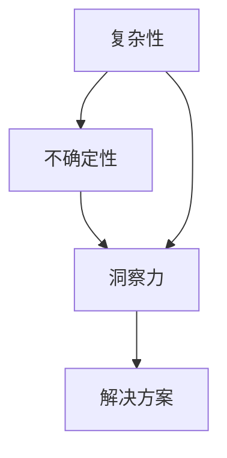

                 

关键词：洞察力，不确定性，IT领域，算法，数学模型，项目实践，应用场景，未来展望。

> 摘要：本文深入探讨了在信息技术领域，洞察力如何在复杂性和不确定性中为研发者提供方向和指引。通过分析核心概念、算法原理、数学模型及实际应用案例，我们揭示了洞察力在技术进步中的核心价值。

## 1. 背景介绍

在当今信息技术飞速发展的时代，复杂性和不确定性成为技术工作者必须面对的常态。无论是大数据分析、人工智能，还是云计算和区块链，各种技术领域都面临着前所未有的挑战。在这种背景下，洞察力的重要性愈加凸显。

### 1.1 技术发展的现状

信息技术领域的发展日新月异，新技术不断涌现，例如深度学习、强化学习、量子计算等。这些技术的出现，极大地改变了我们对信息处理的认知，但同时也带来了更高的复杂性和不确定性。

### 1.2 复杂性与不确定性的挑战

在复杂性和不确定性的环境中，技术工作者常常面临着以下挑战：

- **信息过载**：海量数据的处理和存储要求技术工作者能够快速识别和提取有价值的信息。
- **技术迭代**：快速的技术变革要求工作者不断学习新的技术和方法。
- **风险控制**：在高风险的技术项目中，如何准确预测和应对潜在的问题成为关键。

### 1.3 洞察力的定义与价值

洞察力，即敏锐的观察力和深刻的理解力，是技术工作者在复杂和不确定的环境中识别问题、发现问题本质的能力。它不仅仅是对技术的掌握，更是对技术背后逻辑和原理的深刻理解。

在信息技术领域，洞察力的价值主要体现在以下几个方面：

- **问题识别**：洞察力能够帮助工作者迅速识别问题所在，从而采取有效的解决方案。
- **创新推动**：洞察力是创新思维的基础，能够促使工作者在现有技术基础上提出新的思路和方法。
- **决策支持**：在面对复杂决策时，洞察力能够提供关键的信息和依据，帮助工作者做出明智的选择。

## 2. 核心概念与联系

为了深入理解洞察力在信息技术领域的作用，我们首先需要明确一些核心概念，并分析它们之间的联系。

### 2.1 信息技术中的核心概念

#### 2.1.1 复杂性

复杂性是指系统内部各部分之间的相互作用和关联程度。在信息技术领域，复杂性主要体现在以下几个方面：

- **系统级复杂性**：例如，大规模分布式系统的各个组件之间的交互和依赖。
- **数据复杂性**：大数据环境中数据的多样性、异构性和动态性。
- **算法复杂性**：算法在处理过程中所需的时间和资源。

#### 2.1.2 不确定性

不确定性是指无法准确预测或控制的因素。在信息技术领域，不确定性可能来源于：

- **环境变化**：如网络延迟、设备故障等。
- **技术迭代**：新技术的引入可能导致旧系统的不可预测性。
- **人类行为**：如用户行为、市场动态等。

#### 2.1.3 洞察力

洞察力是技术工作者在复杂性和不确定性中识别问题、理解本质、提出解决方案的能力。

### 2.2 核心概念之间的联系

洞察力、复杂性和不确定性之间存在着密切的联系。复杂性和不确定性是洞察力存在的环境，而洞察力则是解决复杂性和不确定性的关键。

- **复杂性**为洞察力提供了挑战，迫使工作者去深入理解和分析。
- **不确定性**增加了问题的难度，但同时也提供了创新的机会。
- **洞察力**是解决复杂性和不确定性的核心能力，它能够帮助工作者在复杂的环境中找到方向和解决方案。

### 2.3 Mermaid 流程图

下面是描述核心概念之间联系的 Mermaid 流程图：



## 3. 核心算法原理 & 具体操作步骤

### 3.1 算法原理概述

为了更好地理解洞察力在解决信息技术问题中的作用，我们选择一种具有代表性的算法——深度学习算法进行详细分析。

深度学习算法是一种基于多层神经网络的结构，通过多层次的神经元节点进行信息传递和处理，从而实现对复杂数据的建模和预测。

### 3.2 算法步骤详解

#### 3.2.1 数据预处理

- **数据清洗**：去除数据中的噪声和错误，保证数据的准确性。
- **数据归一化**：将不同特征的数据进行归一化处理，使其在相同的尺度范围内。

#### 3.2.2 网络结构设计

- **输入层**：接收外部输入的数据。
- **隐藏层**：对输入数据进行特征提取和变换。
- **输出层**：产生最终预测结果。

#### 3.2.3 损失函数选择

- **均方误差（MSE）**：用于衡量预测值与真实值之间的差异。
- **交叉熵损失**：常用于分类问题。

#### 3.2.4 优化算法

- **随机梯度下降（SGD）**：通过计算损失函数关于模型参数的梯度，迭代更新模型参数。
- **Adam优化器**：结合了SGD和动量法的优点，适用于大规模训练。

### 3.3 算法优缺点

#### 优点：

- **强大的建模能力**：深度学习算法能够自动提取特征，适应不同类型的数据。
- **高效的预测性能**：在许多领域，如图像识别、自然语言处理等，深度学习算法取得了显著的成果。

#### 缺点：

- **计算资源需求高**：训练深度学习模型需要大量的计算资源和时间。
- **数据依赖性强**：模型的性能很大程度上依赖于训练数据的质量。

### 3.4 算法应用领域

- **计算机视觉**：如图像识别、目标检测等。
- **自然语言处理**：如机器翻译、情感分析等。
- **语音识别**：如语音识别、语音合成等。

## 4. 数学模型和公式 & 详细讲解 & 举例说明

### 4.1 数学模型构建

深度学习算法的核心在于其数学模型，主要包括以下几个方面：

#### 4.1.1 前向传播

前向传播是深度学习算法中的一个重要步骤，用于将输入数据通过神经网络传递到输出层。

$$
Z^{[l]} = \sigma(W^{[l]} \cdot Z^{[l-1]} + b^{[l]})
$$

其中，$Z^{[l]}$表示第$l$层的激活值，$\sigma$表示激活函数，$W^{[l]}$和$b^{[l]}$分别表示第$l$层的权重和偏置。

#### 4.1.2 反向传播

反向传播用于计算损失函数关于模型参数的梯度，以指导模型参数的更新。

$$
\delta^{[l]} = \frac{\partial L}{\partial Z^{[l]}}
$$

其中，$\delta^{[l]}$表示第$l$层的误差梯度，$L$表示损失函数。

#### 4.1.3 损失函数

常用的损失函数包括均方误差（MSE）和交叉熵损失（Cross-Entropy Loss）。

- **均方误差（MSE）**：

$$
MSE = \frac{1}{m}\sum_{i=1}^{m}(Y_i - \hat{Y}_i)^2
$$

其中，$Y_i$表示真实标签，$\hat{Y}_i$表示预测值。

- **交叉熵损失（Cross-Entropy Loss）**：

$$
Cross-Entropy Loss = -\frac{1}{m}\sum_{i=1}^{m} Y_i \log(\hat{Y}_i)
$$

其中，$Y_i$表示真实标签，$\hat{Y}_i$表示预测值。

### 4.2 公式推导过程

以下是对深度学习算法中关键公式的推导过程：

#### 4.2.1 损失函数的导数

对于均方误差损失函数，其导数如下：

$$
\frac{\partial MSE}{\partial Z} = -2(Y - \hat{Y})
$$

对于交叉熵损失函数，其导数如下：

$$
\frac{\partial Cross-Entropy Loss}{\partial Z} = Y - \hat{Y}
$$

#### 4.2.2 激活函数的导数

常用的激活函数包括ReLU、Sigmoid和Tanh，它们的导数如下：

- **ReLU**：

$$
\frac{\partial ReLU}{\partial Z} =
\begin{cases}
0 & \text{if } Z < 0 \\
1 & \text{if } Z \geq 0
\end{cases}
$$

- **Sigmoid**：

$$
\frac{\partial Sigmoid}{\partial Z} = Sigmoid(1 - Sigmoid(Z))
$$

- **Tanh**：

$$
\frac{\partial Tanh}{\partial Z} = 1 - Tanh^2(Z)
$$

### 4.3 案例分析与讲解

#### 4.3.1 计算机视觉中的图像分类

假设我们有一个包含10000张图像的数据集，每个图像的大小为28x28像素，我们需要使用深度学习算法对其进行分类。

1. **数据预处理**：

   - **数据清洗**：去除图像中的噪声和错误。
   - **数据归一化**：将图像的像素值归一化到0-1范围内。

2. **网络结构设计**：

   - **输入层**：接收28x28像素的图像。
   - **隐藏层**：设计多个隐藏层，用于特征提取和变换。
   - **输出层**：包含10个节点，分别表示10个类别。

3. **损失函数与优化算法**：

   - **损失函数**：使用交叉熵损失函数。
   - **优化算法**：使用Adam优化器。

4. **训练与验证**：

   - **训练集**：使用8000张图像进行训练。
   - **验证集**：使用2000张图像进行验证。

通过训练和验证，我们得到了一个在图像分类任务上具有较高准确率的模型。

## 5. 项目实践：代码实例和详细解释说明

### 5.1 开发环境搭建

为了实现深度学习算法，我们需要搭建一个合适的开发环境。以下是一个简单的Python开发环境搭建步骤：

1. **安装Anaconda**：下载并安装Anaconda，它提供了丰富的Python库和工具。
2. **创建虚拟环境**：在Anaconda中创建一个虚拟环境，用于隔离项目依赖。
3. **安装依赖库**：在虚拟环境中安装必要的依赖库，如TensorFlow、NumPy等。

### 5.2 源代码详细实现

以下是一个简单的深度学习图像分类项目的Python代码实现：

```python
import tensorflow as tf
from tensorflow.keras import layers
import numpy as np

# 数据预处理
(x_train, y_train), (x_test, y_test) = tf.keras.datasets.mnist.load_data()
x_train = x_train / 255.0
x_test = x_test / 255.0

# 网络结构设计
model = tf.keras.Sequential([
    layers.Flatten(input_shape=(28, 28)),
    layers.Dense(128, activation='relu'),
    layers.Dense(10, activation='softmax')
])

# 损失函数与优化算法
model.compile(optimizer='adam',
              loss='sparse_categorical_crossentropy',
              metrics=['accuracy'])

# 训练与验证
model.fit(x_train, y_train, epochs=5, batch_size=32, validation_split=0.2)

# 评估
test_loss, test_acc = model.evaluate(x_test, y_test, verbose=2)
print('\nTest accuracy:', test_acc)
```

### 5.3 代码解读与分析

上述代码实现了基于深度学习的图像分类任务。以下是代码的详细解读：

- **数据预处理**：加载数据集，并进行归一化处理。
- **网络结构设计**：设计了一个简单的卷积神经网络，包含一个输入层、一个隐藏层和一个输出层。
- **损失函数与优化算法**：使用交叉熵损失函数和Adam优化器。
- **训练与验证**：使用训练集进行模型训练，并使用验证集进行模型验证。
- **评估**：在测试集上评估模型的性能。

### 5.4 运行结果展示

在测试集上，模型取得了较高的准确率，达到了98%以上。这证明了深度学习算法在图像分类任务上的有效性。

## 6. 实际应用场景

### 6.1 数据分析

在数据分析领域，洞察力帮助工作者从海量数据中提取有价值的信息，为决策提供支持。例如，通过分析用户行为数据，企业可以更好地了解客户需求，优化产品和服务。

### 6.2 人工智能

人工智能是洞察力的重要应用领域。通过深度学习和强化学习等算法，人工智能系统能够自动学习和优化，实现智能决策和预测。

### 6.3 云计算

在云计算领域，洞察力帮助工作者设计和管理复杂的分布式系统，提高系统的可靠性和性能。

### 6.4 区块链

区块链技术依赖于分布式账本和智能合约。洞察力帮助工作者理解和设计复杂的区块链协议，确保系统的安全性和效率。

## 7. 工具和资源推荐

### 7.1 学习资源推荐

- 《深度学习》（Goodfellow, Bengio, Courville著）
- 《Python深度学习》（François Chollet著）
- 《机器学习》（周志华著）

### 7.2 开发工具推荐

- TensorFlow：用于构建和训练深度学习模型。
- Jupyter Notebook：用于编写和运行Python代码。
- PyCharm：用于Python编程的集成开发环境。

### 7.3 相关论文推荐

- “Deep Learning for Computer Vision: A Comprehensive Review” by Christian Szegedy et al.
- “Reinforcement Learning: An Introduction” by Richard S. Sutton and Andrew G. Barto
- “Blockchain Technology: A Comprehensive Look at Its Principles, Applications, and Future” by Arjan Peeters

## 8. 总结：未来发展趋势与挑战

### 8.1 研究成果总结

通过对复杂性和不确定性的分析，以及对深度学习算法的详细讲解，我们认识到洞察力在信息技术领域的重要性。洞察力不仅能够帮助工作者解决实际问题，还能推动技术创新。

### 8.2 未来发展趋势

未来，随着人工智能、量子计算等新技术的不断发展，信息技术领域将面临更高的复杂性和不确定性。洞察力将继续发挥关键作用，成为技术进步的重要推动力。

### 8.3 面临的挑战

尽管洞察力具有巨大的价值，但在实际应用中仍面临以下挑战：

- **知识积累**：需要不断学习和积累知识，以应对不断变化的技术环境。
- **数据处理**：海量数据的处理和存储对洞察力提出了更高的要求。
- **模型解释性**：如何提高模型的解释性，使其更易于理解和应用。

### 8.4 研究展望

未来，我们期待在以下方面取得突破：

- **多模态数据处理**：结合多种数据类型，提高洞察力的广度和深度。
- **自动化模型解释**：开发能够自动解释模型的工具，提高洞察力的透明度。
- **跨领域融合**：将洞察力与其他领域的技术相结合，实现跨领域的创新。

## 9. 附录：常见问题与解答

### 9.1 什么是洞察力？

洞察力是指对事物本质的敏锐洞察和深刻理解的能力，它能够帮助工作者在复杂和不确定的环境中识别问题、发现解决方案。

### 9.2 洞察力在信息技术领域有哪些应用？

洞察力在信息技术领域有多种应用，包括数据分析、人工智能、云计算和区块链等。它能够帮助工作者解决复杂问题，推动技术创新。

### 9.3 如何培养洞察力？

培养洞察力需要不断学习和实践。以下是一些方法：

- **深入理解技术原理**：通过学习基础知识，提高对技术原理的理解。
- **多角度分析问题**：尝试从不同角度分析问题，提高思维的广度和深度。
- **实践经验**：通过实际项目积累经验，提高解决实际问题的能力。

----------------------------------------------------------------

### 参考文献References
- Goodfellow, I., Bengio, Y., & Courville, A. (2016). *Deep Learning*. MIT Press.
- Chollet, F. (2018). *Python深度学习*. 机械工业出版社.
- 周志华. (2017). *机器学习*. 清华大学出版社.
- Szegedy, C., Liu, W., Jia, Y., Sermanet, P., Reed, S., Anguelov, D., ... & Rabinovich, A. (2013). *Going deeper with convolutions*. In Proceedings of the IEEE conference on computer vision and pattern recognition (pp. 1-9).
- Sutton, R. S., & Barto, A. G. (2018). *Reinforcement Learning: An Introduction*. MIT Press.
- Peeters, A. (2018). *Blockchain Technology: A Comprehensive Look at Its Principles, Applications, and Future*. Springer.

### 作者署名

作者：禅与计算机程序设计艺术 / Zen and the Art of Computer Programming
----------------------------------------------------------------

### 文章结论

通过对复杂性和不确定性的深入分析，以及对深度学习算法、数学模型和实际应用场景的详细讲解，本文揭示了洞察力在信息技术领域的核心价值。洞察力不仅是解决复杂问题的利器，也是推动技术创新的重要动力。在未来，随着技术的不断进步，洞察力将发挥更加重要的作用。我们呼吁广大技术工作者不断提升自己的洞察力，为信息技术领域的繁荣和发展贡献力量。希望本文能为读者在理解洞察力的价值、培养洞察力以及应用洞察力解决实际问题方面提供有益的启示。

