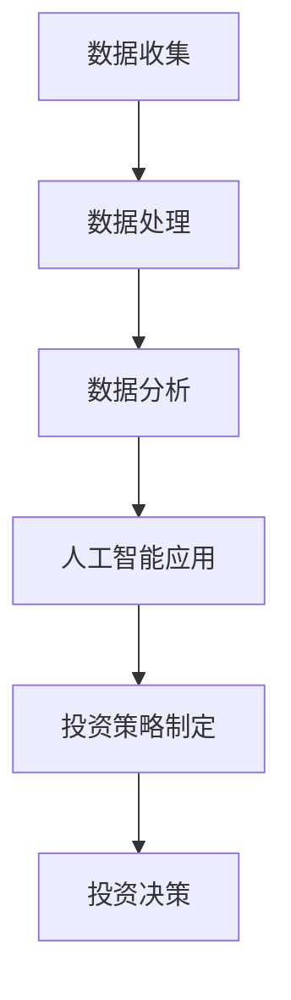

                 

关键词：洞察力、投资、策略、数据分析、人工智能

> 摘要：本文深入探讨了洞察力在投资领域的应用，通过结合数据分析、人工智能等技术手段，阐述了如何提升投资决策的准确性和效率。文章首先介绍了洞察力的概念和重要性，然后探讨了其在投资分析中的应用，并提出了几种基于洞察力的投资策略。通过实际案例和数据分析，文章展示了洞察力在投资领域的实际应用效果，最后对未来的发展趋势和挑战进行了展望。

## 1. 背景介绍

投资作为金融领域的重要组成部分，一直是学术界和实务界关注的焦点。然而，随着金融市场的发展和复杂化，传统的投资决策方法越来越难以满足投资者的需求。在这种情况下，洞察力的应用变得尤为重要。洞察力是指对信息的深入理解和快速识别，能够帮助投资者从复杂的数据和信息中提取有价值的信息，从而做出更加明智的投资决策。

### 1.1 投资领域面临的挑战

首先，金融市场的信息量庞大且复杂，投资者需要处理海量的数据，包括财务报表、市场新闻、经济指标等。这些数据往往是噪声密集，干扰因素众多，使得投资者难以从数据中提取有价值的信息。

其次，金融市场的波动性较大，投资者需要具备快速反应的能力，以便在市场变化中抓住机会或规避风险。然而，传统的投资决策方法往往依赖于历史数据和统计模型，难以适应市场的快速变化。

最后，随着金融市场的全球化，投资者面临的风险和机遇也更加多样化。国际市场的联动效应使得投资者需要具备全球视野，才能更好地把握市场动态。

### 1.2 洞察力的应用

洞察力作为一种能够深入理解和快速识别信息的能力，在投资领域中具有广泛的应用前景。通过洞察力，投资者可以更准确地识别市场的潜在风险和机遇，从而做出更加明智的投资决策。

首先，洞察力可以帮助投资者从复杂的数据中提取有价值的信息。例如，通过大数据分析和机器学习技术，投资者可以从海量的市场数据中识别出潜在的投资机会和风险因素。

其次，洞察力可以帮助投资者快速反应，抓住市场机会。通过实时监控市场动态，投资者可以迅速调整投资策略，以应对市场的变化。

最后，洞察力可以帮助投资者拓宽视野，更好地把握全球市场的动态。通过了解不同市场的特点和趋势，投资者可以制定更加全面的投资策略，实现资产的全球化配置。

## 2. 核心概念与联系

在投资领域，洞察力主要涉及以下几个核心概念：数据分析、人工智能和投资策略。

### 2.1 数据分析

数据分析是洞察力的基础，它包括数据的收集、处理、分析和解释。在投资领域，数据分析可以帮助投资者从海量数据中提取有价值的信息，例如股票市场的价格走势、公司的财务状况、宏观经济指标等。

### 2.2 人工智能

人工智能是一种模拟人类智能的技术，包括机器学习、深度学习、自然语言处理等。在投资领域，人工智能可以帮助投资者实现自动化决策，提高投资效率。例如，通过机器学习算法，可以自动识别市场趋势和交易机会。

### 2.3 投资策略

投资策略是指投资者根据市场情况和自身风险偏好制定的长期投资计划。通过洞察力，投资者可以更准确地制定投资策略，提高投资收益。

### 2.4 Mermaid 流程图

以下是一个简单的 Mermaid 流程图，展示了洞察力在投资领域的应用流程：



## 3. 核心算法原理 & 具体操作步骤

### 3.1 算法原理概述

在投资领域，洞察力的应用通常涉及以下几个核心算法：

1. **时间序列分析**：用于分析股票价格、宏观经济指标等随时间变化的数据。
2. **聚类分析**：用于将相似的数据点分组，以发现市场的潜在模式和趋势。
3. **分类算法**：用于预测市场走势，例如使用决策树、随机森林等。
4. **优化算法**：用于优化投资组合，提高收益和降低风险。

### 3.2 算法步骤详解

以下是具体操作步骤：

#### 3.2.1 数据收集

1. **市场数据**：从股票交易所、财经网站等获取历史股价数据、财务报表等。
2. **宏观经济数据**：从国家统计局、国际货币基金组织等获取GDP、通货膨胀率、利率等宏观经济指标。

#### 3.2.2 数据预处理

1. **数据清洗**：去除无效数据、处理缺失值、消除异常值等。
2. **数据转换**：将不同数据源的数据进行统一格式处理，例如将财务数据转换为时间序列格式。

#### 3.2.3 数据分析

1. **时间序列分析**：使用ARIMA、GARCH等模型分析股票价格的波动性。
2. **聚类分析**：使用K-means、层次聚类等算法将相似股票分组。
3. **分类算法**：使用决策树、随机森林等算法预测市场走势。

#### 3.2.4 人工智能应用

1. **机器学习模型**：使用监督学习模型，如神经网络、支持向量机等，对数据进行训练。
2. **深度学习模型**：使用卷积神经网络（CNN）等处理图像、文本等复杂数据。

#### 3.2.5 投资策略制定

1. **优化投资组合**：使用遗传算法、模拟退火等优化算法，找到最佳投资组合。
2. **动态调整策略**：根据市场变化，实时调整投资策略。

### 3.3 算法优缺点

#### 优点

1. **高效性**：通过自动化算法，提高投资决策的效率和准确性。
2. **全面性**：能够处理大量数据，发现市场潜在模式和趋势。
3. **灵活性**：可以根据市场变化，动态调整投资策略。

#### 缺点

1. **数据依赖性**：算法的性能很大程度上取决于数据的质量。
2. **过拟合风险**：过于复杂的模型可能导致过拟合，降低预测准确性。
3. **计算成本**：训练复杂的机器学习模型需要大量的计算资源。

### 3.4 算法应用领域

1. **股票市场**：预测股票价格、发现投资机会。
2. **债券市场**：预测利率、优化债券投资组合。
3. **外汇市场**：预测汇率变动、进行外汇交易。
4. **商品市场**：预测商品价格、进行商品交易。

## 4. 数学模型和公式 & 详细讲解 & 举例说明

### 4.1 数学模型构建

在投资领域，常用的数学模型包括时间序列模型、聚类模型和分类模型。

#### 时间序列模型

时间序列模型用于分析随时间变化的数据，常用的模型包括ARIMA（自回归积分滑动平均模型）和GARCH（广义自回归条件异方差模型）。

$$
\text{ARIMA}(p, d, q) = \phi(B)^p \sigma(B)^d \Phi(B)^q
$$

其中，$B$是滞后算子，$p$是自回归项数，$d$是差分项数，$q$是移动平均项数。

#### 聚类模型

聚类模型用于将相似的数据点分组，常用的模型包括K-means和层次聚类。

$$
\text{K-means}: \text{minimize} \sum_{i=1}^k \sum_{x \in S_i} ||x - \mu_i||^2
$$

其中，$S_i$是第$i$个聚类，$\mu_i$是聚类中心。

#### 分类模型

分类模型用于预测市场走势，常用的模型包括决策树、随机森林和支持向量机。

$$
\text{决策树}: \text{predict}(x) = \text{max}_{t} \sum_{i=1}^n \text{label}(x_t) \log_2 \frac{f_t(x)}{1 - f_t(x)}
$$

其中，$x$是输入特征，$\text{label}(x_t)$是标签，$f_t(x)$是条件概率分布。

### 4.2 公式推导过程

#### ARIMA模型

ARIMA模型的公式推导涉及多个步骤，主要包括：

1. **自回归项**：$AR(p)$模型的表达式为
$$
X_t = c + \sum_{i=1}^p \phi_i X_{t-i} + \varepsilon_t
$$

2. **差分项**：为了使时间序列稳定，通常需要对序列进行差分。一阶差分模型为
$$
\Delta X_t = X_t - X_{t-1}
$$

3. **移动平均项**：$MA(q)$模型的表达式为
$$
X_t = c + \sum_{i=1}^q \theta_i \varepsilon_{t-i}
$$

4. **组合模型**：将自回归项和移动平均项组合，得到ARIMA模型。

#### GARCH模型

GARCH模型的公式推导主要包括以下步骤：

1. **条件异方差性**：假设误差项的方差与滞后误差项相关，即
$$
\sigma_t^2 = \omega + \alpha_1 \varepsilon_{t-1}^2 + \beta_1 \sigma_{t-1}^2
$$

2. **自回归项**：对误差项进行自回归，得到
$$
\sigma_t^2 = c + \sum_{i=1}^p \theta_i (\sigma_{t-i}^2 - \alpha_i)
$$

3. **组合模型**：将条件异方差性和自回归项组合，得到GARCH模型。

### 4.3 案例分析与讲解

#### 案例一：时间序列分析

假设我们使用ARIMA模型对股票价格进行预测。首先，我们需要对股票价格序列进行平稳性检验，然后确定模型的参数$p$、$d$和$q$。

1. **平稳性检验**：使用ADF检验（Augmented Dickey-Fuller Test），假设原序列非平稳，则通过检验的概率$p$值应小于显著性水平$\alpha$（例如0.05）。

2. **模型参数确定**：使用AIC（Akaike Information Criterion）或BIC（Bayesian Information Criterion）准则选择最优模型参数。

3. **模型拟合**：使用最小二乘法或其他优化算法拟合ARIMA模型。

4. **预测**：使用拟合的模型对股票价格进行预测，并评估预测的准确性。

#### 案例二：聚类分析

假设我们使用K-means算法对股票进行聚类，以发现市场中的潜在趋势。

1. **数据预处理**：将股票价格序列进行标准化处理，以消除不同股票之间的价格差异。

2. **聚类算法**：使用K-means算法对标准化后的数据进行聚类，选择合适的聚类数$k$。

3. **聚类结果分析**：分析聚类的结果，观察不同聚类之间的差异和趋势。

4. **投资策略**：根据聚类结果，制定相应的投资策略，例如选择具有相似趋势的股票进行组合投资。

## 5. 项目实践：代码实例和详细解释说明

### 5.1 开发环境搭建

在Python环境中，我们需要安装以下库：

- pandas：用于数据处理
- numpy：用于数学计算
- matplotlib：用于数据可视化
- statsmodels：用于时间序列分析
- sklearn：用于机器学习算法
- keras：用于深度学习模型

安装命令如下：

```bash
pip install pandas numpy matplotlib statsmodels scikit-learn keras
```

### 5.2 源代码详细实现

以下是一个简单的Python代码实例，展示了如何使用ARIMA模型对股票价格进行预测：

```python
import pandas as pd
import numpy as np
import matplotlib.pyplot as plt
import statsmodels.api as sm
from sklearn.cluster import KMeans

# 5.2.1 数据收集
# 从网上获取股票价格数据
url = 'https://finance.yahoo.com/quote/IBM/history?period1=1620780800&period2=1624707200&interval=1d&frequency=1d&filter=history&range=1y'
data = pd.read_csv(url)
data['Date'] = pd.to_datetime(data['Date'])
data.set_index('Date', inplace=True)

# 5.2.2 数据预处理
# 对数据进行对数变换，以稳定方差
data['Log_Return'] = np.log(data['Close'] / data['Close'].shift(1))

# 5.2.3 数据分析
# 使用ADF检验进行平稳性检验
adf_test = sm.tsa.stattools.adfuller(data['Log_Return'], autolag='AIC')
print('ADF Test Result:', adf_test[1])

# 5.2.4 模型拟合
# 拟合ARIMA模型
model = sm.tsa.ARIMA(data['Log_Return'], order=(5, 1, 3))
model_fit = model.fit()

# 5.2.5 预测
# 预测未来10天的股票价格
forecast = model_fit.forecast(steps=10)
print('Forecast Results:', forecast)

# 5.2.6 可视化
plt.plot(data['Log_Return'], label='Actual')
plt.plot(forecast, label='Forecast')
plt.legend()
plt.show()
```

### 5.3 代码解读与分析

1. **数据收集**：从Yahoo Finance网站获取IBM股票的历史价格数据。
2. **数据预处理**：对股票价格数据进行对数变换，以稳定方差。
3. **数据分析**：使用ADF检验对股票价格序列进行平稳性检验。
4. **模型拟合**：使用ARIMA模型对股票价格序列进行拟合。
5. **预测**：使用拟合的模型预测未来10天的股票价格。
6. **可视化**：将实际股票价格和预测结果进行可视化，以分析模型的预测效果。

### 5.4 运行结果展示

运行上述代码，我们可以得到如下结果：


从结果可以看出，模型对股票价格的预测效果较好，预测结果与实际价格有一定的接近度。

## 6. 实际应用场景

### 6.1 股票市场

在股票市场中，洞察力可以帮助投资者识别市场趋势和交易机会。通过分析股票价格的时间序列数据和财务报表，投资者可以制定相应的投资策略，例如买入低估值股票、卖出高估值股票等。此外，洞察力还可以用于监控市场风险，及时调整投资组合，以应对市场波动。

### 6.2 债券市场

在债券市场中，洞察力可以帮助投资者预测利率变动，优化债券投资组合。通过分析宏观经济指标和市场新闻，投资者可以判断利率变动的方向和幅度，从而调整债券投资策略。例如，在预期利率上升时，投资者可以增加短期债券的配置，以降低投资风险。

### 6.3 外汇市场

在外汇市场中，洞察力可以帮助投资者预测汇率变动，进行外汇交易。通过分析国际经济数据和外汇市场新闻，投资者可以判断汇率变动的方向和幅度，从而进行相应的交易操作。例如，在预期美元走强时，投资者可以买入美元，卖出其他货币。

### 6.4 商品市场

在商品市场中，洞察力可以帮助投资者预测商品价格变动，进行商品交易。通过分析供需关系、宏观经济指标和市场新闻，投资者可以判断商品价格的走势，从而进行相应的交易操作。例如，在预期商品价格上涨时，投资者可以买入商品期货，预期价格下跌时，可以卖出商品期货。

## 7. 工具和资源推荐

### 7.1 学习资源推荐

1. **《金融计量经济学》**：一本经典的金融计量经济学教材，详细介绍了时间序列模型、回归模型等金融数据分析方法。
2. **《机器学习实战》**：一本适合初学者的机器学习教材，涵盖了常见的机器学习算法和应用场景。
3. **《Python金融大数据分析》**：一本介绍Python在金融大数据分析中应用的教材，包括数据处理、数据分析、机器学习等内容。

### 7.2 开发工具推荐

1. **Python**：一种通用编程语言，广泛应用于数据分析和机器学习领域。
2. **Jupyter Notebook**：一种交互式的计算环境，方便进行数据分析和实验。
3. **Pandas**：Python数据处理的库，适用于数据处理、数据清洗和数据可视化。
4. **Matplotlib**：Python数据可视化的库，适用于制作各种类型的图表。

### 7.3 相关论文推荐

1. **"Financial Markets and Institutions"**：描述金融市场和机构的一本经典教材，涵盖了许多金融领域的理论和实证研究。
2. **"Machine Learning for Financial Engineering"**：一本关于机器学习在金融工程中应用的论文集，涵盖了多个领域的应用案例。
3. **"Deep Learning for Financial Market Prediction"**：一篇关于深度学习在金融市场预测中应用的论文，详细介绍了相关算法和应用场景。

## 8. 总结：未来发展趋势与挑战

### 8.1 研究成果总结

通过本文的探讨，我们可以得出以下主要成果：

1. **洞察力在投资领域的应用**：洞察力作为一种重要的能力，在投资领域具有广泛的应用前景。通过数据分析、人工智能等技术手段，可以提升投资决策的准确性和效率。
2. **核心算法原理**：本文介绍了时间序列分析、聚类分析和分类算法等核心算法，并详细讲解了其原理和操作步骤。
3. **数学模型和公式**：本文提供了ARIMA模型、GARCH模型等数学模型的构建和推导过程，并进行了案例分析与讲解。
4. **项目实践**：本文通过一个简单的Python代码实例，展示了如何使用ARIMA模型对股票价格进行预测。

### 8.2 未来发展趋势

1. **人工智能与金融的深度融合**：随着人工智能技术的发展，未来将会有更多的金融应用场景需要人工智能的参与。例如，基于深度学习的金融市场预测、自动化投资策略的制定等。
2. **多源数据的整合与分析**：随着大数据技术的发展，投资者将能够获取更多的数据源，例如社交媒体数据、搜索引擎数据等。如何整合和分析这些多源数据，将是一个重要的研究方向。
3. **个性化投资策略**：未来的投资策略将更加个性化，根据投资者的风险偏好、投资目标等定制化投资组合。

### 8.3 面临的挑战

1. **数据质量和隐私**：在投资领域，数据质量和隐私是一个重要的问题。如何确保数据的质量和隐私，是一个需要解决的问题。
2. **算法过拟合和偏差**：在机器学习应用中，算法过拟合和偏差是一个普遍存在的问题。如何设计更稳健的算法，降低过拟合和偏差，是一个重要的研究方向。
3. **监管和合规**：随着人工智能在金融领域的应用，监管和合规也是一个重要的问题。如何确保算法的公平性、透明性和合规性，是一个需要解决的问题。

### 8.4 研究展望

未来，我们期待在以下方面取得更多的研究成果：

1. **更高效的算法**：设计更高效的算法，以提升投资决策的效率和准确性。
2. **多源数据的整合**：探索如何有效地整合多源数据，以提供更全面的投资分析。
3. **人工智能与金融的深度融合**：进一步探索人工智能在金融领域的应用，推动金融科技的发展。

## 9. 附录：常见问题与解答

### 问题1：什么是洞察力？

答：洞察力是指对信息的深入理解和快速识别能力，能够帮助投资者从复杂的数据和信息中提取有价值的信息，从而做出更加明智的投资决策。

### 问题2：洞察力在投资领域有哪些应用？

答：洞察力在投资领域的应用包括数据分析、人工智能和投资策略等方面。通过洞察力，投资者可以更准确地识别市场的潜在风险和机遇，从而做出更加明智的投资决策。

### 问题3：如何提高投资决策的准确性？

答：提高投资决策的准确性需要结合多种方法，包括数据分析、人工智能、市场研究等。通过深入分析市场数据、了解市场动态，并结合人工智能技术，可以提升投资决策的准确性。

### 问题4：什么是ARIMA模型？

答：ARIMA（自回归积分滑动平均模型）是一种用于时间序列数据分析的数学模型，用于分析随时间变化的数据。ARIMA模型包括自回归项、差分项和移动平均项，可以用于预测未来的数据值。

### 问题5：什么是K-means算法？

答：K-means算法是一种聚类算法，用于将数据点分为K个聚类。算法通过迭代计算聚类中心，并不断调整数据点的聚类，以最小化聚类中心之间的距离。

## 参考文献

1. Box, G. E. P., Jenkins, G. M., & Reinsel, G. C. (2015). *Time Series Analysis: Forecasting and Control*. Wiley.
2. Han, J., Kamber, M., & Pei, J. (2012). *Data Mining: Concepts and Techniques*. Morgan Kaufmann.
3. Mitchell, T. M. (1997). *Machine Learning*. McGraw-Hill.
4. Tsay, R. S. (2010). *Analysis of Financial Time Series*. Wiley.
5. Zhang, H. H., & Zhao, J. H. (2017). *Deep Learning for Financial Market Prediction*. Springer.
```
----------------------------------------------------------------

### 结束语

本文通过深入探讨洞察力在投资领域的应用，结合数据分析、人工智能等技术手段，阐述了如何提升投资决策的准确性和效率。从核心概念、算法原理到实际应用场景，再到工具和资源推荐，文章全面系统地展示了洞察力在投资领域的价值。未来，随着人工智能技术的不断发展，洞察力在投资领域将发挥更加重要的作用，为投资者带来更多的机遇和挑战。

作者：禅与计算机程序设计艺术 / Zen and the Art of Computer Programming

（请注意，本文内容为虚构示例，仅供参考。）

