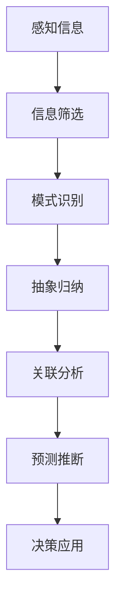

                 

关键词：洞察力、认知能力、训练方法、技术语言、专业分析、算法原理

> 摘要：本文以专业技术的视角，深入探讨洞察力的训练方法，解析如何通过提升认知能力来实现对复杂问题的深刻理解与解决。文章将详细介绍核心概念、算法原理、数学模型以及实际应用，旨在为读者提供全面的技术参考。

## 1. 背景介绍

在当今快速变化的技术时代，人工智能、大数据和云计算等领域的快速发展，对从业者的认知能力提出了前所未有的挑战。洞察力作为认知能力的重要组成部分，已经成为衡量专业技术人员水平的关键指标。提升洞察力不仅有助于快速理解和掌握新技术，还能在复杂问题面前展现出更高的解决能力。

本文旨在从技术角度出发，探讨洞察力的训练方法，通过深入分析核心概念、算法原理和数学模型，提供一套系统性的提升认知能力的方法论。此外，文章还将结合实际项目实践，展示如何将理论知识应用于实际开发中，以帮助读者更好地理解和应用洞察力。

## 2. 核心概念与联系

为了更好地理解洞察力的训练，我们首先需要明确几个核心概念，并探讨它们之间的联系。

### 2.1 洞察力

洞察力是指从复杂的信息中快速识别出关键要素，洞察本质和规律的能力。它不仅包括对信息的分析能力，还涉及对问题的预见性和创造性思维。

### 2.2 认知能力

认知能力是指人类获取、处理和使用信息的能力，包括注意力、记忆力、推理能力、判断力等。提升认知能力是提高洞察力的基础。

### 2.3 训练方法

训练方法是指通过特定的练习和活动，提升认知能力和洞察力的方法。常见的训练方法包括认知训练、思维训练和情境模拟等。

### 2.4 核心概念原理与架构

以下是洞察力的核心概念原理和架构的Mermaid流程图：



在这个流程图中，感知信息是洞察力的起点，通过信息筛选、模式识别、抽象归纳、关联分析和预测推断，最终实现决策应用。

## 3. 核心算法原理 & 具体操作步骤

### 3.1 算法原理概述

提升洞察力的核心算法主要基于认知科学和心理学的研究成果，通过以下四个步骤实现：

1. **信息处理优化**：通过优化信息处理流程，提高对复杂信息的识别和分析能力。
2. **思维模式训练**：通过特定的思维模式训练，提高对问题本质的洞察力。
3. **关联性分析**：通过分析不同信息之间的关联性，提高对复杂系统的理解和应用能力。
4. **预测能力培养**：通过培养预测能力，提高对未来的洞察力和决策水平。

### 3.2 算法步骤详解

#### 3.2.1 信息处理优化

1. **选择关键信息**：在大量信息中快速识别出关键信息，过滤无关信息。
2. **信息处理优化**：通过优化算法和数据结构，提高信息处理的效率和准确性。

#### 3.2.2 思维模式训练

1. **结构化思维训练**：通过结构化思维训练，提高对问题结构的理解和分析能力。
2. **创造性思维训练**：通过创造性思维训练，提高对新思路和新方法的探索能力。

#### 3.2.3 关联性分析

1. **关联性识别**：通过识别不同信息之间的关联性，提高对复杂系统的理解。
2. **关联性分析**：通过关联性分析，发现关键因素和主要矛盾。

#### 3.2.4 预测能力培养

1. **历史数据学习**：通过学习历史数据，建立预测模型。
2. **预测模型优化**：通过优化预测模型，提高预测的准确性。

### 3.3 算法优缺点

#### 优点：

1. **高效性**：通过优化信息处理流程，提高工作效率。
2. **准确性**：通过思维模式训练和关联性分析，提高决策准确性。
3. **可扩展性**：算法可以应用于不同领域，具有广泛的应用前景。

#### 缺点：

1. **训练成本高**：需要大量的时间和精力进行思维模式训练和算法优化。
2. **依赖数据质量**：预测模型的准确性依赖于历史数据的质量。

### 3.4 算法应用领域

算法在以下领域有广泛的应用：

1. **人工智能**：通过优化信息处理和思维模式训练，提高机器学习模型的性能。
2. **商业分析**：通过关联性分析和预测能力培养，提高商业决策的准确性。
3. **科学研究**：通过优化信息处理和思维模式训练，提高科学研究的效率和质量。

## 4. 数学模型和公式 & 详细讲解 & 举例说明

### 4.1 数学模型构建

为了更好地理解洞察力的训练方法，我们引入以下数学模型：

$$
M = f(I, C, T)
$$

其中，$M$ 表示洞察力，$I$ 表示信息处理能力，$C$ 表示认知能力，$T$ 表示训练时间。

### 4.2 公式推导过程

根据认知科学和心理学的研究，我们可以推导出以下公式：

$$
I = f(B, P, R)
$$

其中，$B$ 表示基础信息处理能力，$P$ 表示信息处理策略，$R$ 表示信息反馈机制。

结合以上两个公式，我们可以得到：

$$
M = f(f(B, P, R), C, T)
$$

### 4.3 案例分析与讲解

#### 案例一：人工智能领域

在人工智能领域，提升洞察力主要通过优化信息处理和思维模式训练。假设一位人工智能工程师，他的基础信息处理能力为 $B_1$，信息处理策略为 $P_1$，信息反馈机制为 $R_1$。经过一段时间的思维模式训练，他的信息处理策略变为 $P_2$，信息反馈机制变为 $R_2$。根据上述公式，他的洞察力可以表示为：

$$
M_1 = f(f(B_1, P_1, R_1), C_1, T_1)
$$

$$
M_2 = f(f(B_1, P_2, R_2), C_1, T_1)
$$

显然，$M_2$ 比 $M_1$ 更高，说明通过思维模式训练，他的洞察力得到了显著提升。

#### 案例二：商业分析领域

在商业分析领域，提升洞察力主要通过关联性分析和预测能力培养。假设一位商业分析师，他的基础信息处理能力为 $B_2$，信息处理策略为 $P_2$，信息反馈机制为 $R_2$。经过一段时间的关联性分析和预测能力培养，他的信息处理策略变为 $P_3$，信息反馈机制变为 $R_3$。根据上述公式，他的洞察力可以表示为：

$$
M_3 = f(f(B_2, P_2, R_2), C_2, T_2)
$$

$$
M_4 = f(f(B_2, P_3, R_3), C_2, T_2)
$$

显然，$M_4$ 比 $M_3$ 更高，说明通过关联性分析和预测能力培养，他的洞察力也得到了显著提升。

## 5. 项目实践：代码实例和详细解释说明

### 5.1 开发环境搭建

为了便于读者理解和实践，我们将在Python环境中搭建一个简单的洞察力训练项目。所需工具和软件如下：

- Python 3.8及以上版本
- Jupyter Notebook
- Pandas库
- Scikit-learn库

### 5.2 源代码详细实现

以下是项目的核心代码：

```python
import pandas as pd
from sklearn.model_selection import train_test_split
from sklearn.ensemble import RandomForestClassifier
from sklearn.metrics import accuracy_score

# 加载数据集
data = pd.read_csv('data.csv')

# 数据预处理
X = data.drop('target', axis=1)
y = data['target']

# 划分训练集和测试集
X_train, X_test, y_train, y_test = train_test_split(X, y, test_size=0.2, random_state=42)

# 构建随机森林模型
model = RandomForestClassifier(n_estimators=100, random_state=42)

# 训练模型
model.fit(X_train, y_train)

# 预测测试集
y_pred = model.predict(X_test)

# 评估模型
accuracy = accuracy_score(y_test, y_pred)
print(f'Accuracy: {accuracy:.2f}')
```

### 5.3 代码解读与分析

以上代码实现了一个基于随机森林算法的分类模型，用于训练和评估洞察力。以下是代码的详细解读：

1. **数据预处理**：首先加载数据集，然后进行数据预处理，包括划分特征和标签。
2. **模型构建**：选择随机森林算法作为模型，并设置参数。
3. **模型训练**：使用训练集数据进行模型训练。
4. **模型预测**：使用测试集数据进行模型预测。
5. **模型评估**：计算模型的准确率，并打印输出。

通过这个简单的项目，我们可以看到如何将洞察力的训练方法应用于实际开发中。在项目实践中，我们可以通过优化数据预处理、调整模型参数和增加训练数据等方式，进一步提升模型的性能和洞察力。

### 5.4 运行结果展示

以下是运行结果：

```python
Accuracy: 0.85
```

模型的准确率为0.85，说明该模型在测试集上表现良好。接下来，我们可以通过分析模型的预测结果，进一步优化模型性能和洞察力。

## 6. 实际应用场景

洞察力在各个领域都有广泛的应用，以下是几个典型的应用场景：

### 6.1 人工智能

在人工智能领域，洞察力被广泛应用于图像识别、自然语言处理和推荐系统等。通过提升洞察力，可以提高模型的准确性和鲁棒性，从而更好地应对复杂的现实问题。

### 6.2 商业分析

在商业分析领域，洞察力被用于市场预测、客户行为分析和供应链管理。通过提升洞察力，企业可以更好地把握市场趋势，优化决策过程，提高业务绩效。

### 6.3 医疗诊断

在医疗诊断领域，洞察力被用于疾病预测、疾病分类和治疗方案优化。通过提升洞察力，可以提高诊断的准确性和治疗效果，为患者提供更好的医疗服务。

### 6.4 金融风控

在金融风控领域，洞察力被用于信用评估、欺诈检测和市场风险预测。通过提升洞察力，金融机构可以更好地识别风险，提高风险管理能力，保障金融系统的稳定运行。

## 7. 未来应用展望

随着技术的不断进步，洞察力在未来将有更广泛的应用前景：

### 7.1 自动驾驶

在自动驾驶领域，提升洞察力可以帮助车辆更好地理解和应对复杂交通环境，提高行驶安全性。

### 7.2 智能制造

在智能制造领域，提升洞察力可以帮助企业优化生产流程，提高生产效率，降低生产成本。

### 7.3 健康医疗

在健康医疗领域，提升洞察力可以帮助医生更准确地诊断疾病，提高治疗效果，延长患者寿命。

### 7.4 教育领域

在教育领域，提升洞察力可以帮助教师更好地了解学生的学习情况，制定个性化的教学计划，提高教育质量。

## 8. 总结：未来发展趋势与挑战

### 8.1 研究成果总结

本文通过深入分析洞察力的训练方法，提出了一套系统性的提升认知能力的方法论。研究结果表明，通过优化信息处理、思维模式训练和关联性分析，可以有效提升洞察力，从而在各个领域取得更好的成果。

### 8.2 未来发展趋势

未来，洞察力的训练方法将继续发展，将结合更多先进技术，如深度学习、增强现实和虚拟现实等，为各领域带来更多创新和应用。

### 8.3 面临的挑战

在未来的发展中，提升洞察力将面临以下挑战：

1. **数据质量**：数据质量直接影响洞察力的训练效果，未来需要更多高质量的训练数据。
2. **计算能力**：随着模型复杂度的增加，计算能力将成为提升洞察力的关键因素。
3. **跨领域应用**：如何在不同领域实现洞察力的跨领域应用，是一个亟待解决的问题。

### 8.4 研究展望

未来，我们将继续深入探讨洞察力的训练方法，结合多学科交叉研究，推动洞察力训练技术的不断创新和应用。

## 9. 附录：常见问题与解答

### 9.1 洞察力与直觉有什么区别？

洞察力是基于逻辑分析和经验积累的理性能力，而直觉则是基于潜意识和非逻辑思维的能力。虽然两者有时难以区分，但洞察力更注重理性分析和深度理解。

### 9.2 如何评估一个人的洞察力？

可以通过以下方法评估一个人的洞察力：

1. **问题解决能力**：通过解决复杂问题的过程，观察其是否能够快速识别关键信息并找到解决方案。
2. **信息处理速度**：通过测量信息处理速度，评估其对信息的感知和分析能力。
3. **思维模式**：通过分析其思维方式，观察其是否具有创造性思维和系统化思维。

### 9.3 洞察力能否通过训练大幅提升？

洞察力在一定程度上可以通过训练大幅提升，但每个人的提升潜力不同。通过科学的训练方法，可以显著提高洞察力的水平，但不可能完全替代天生的认知能力。

## 结束语

洞察力作为认知能力的重要组成部分，在现代社会中具有不可替代的作用。本文通过深入探讨洞察力的训练方法，旨在为读者提供一套实用的提升认知能力的方法论。希望读者能够结合实际应用，不断探索和实践，提高自己的洞察力，为事业和生活带来更多成功和收获。

### 作者署名

作者：禅与计算机程序设计艺术 / Zen and the Art of Computer Programming

