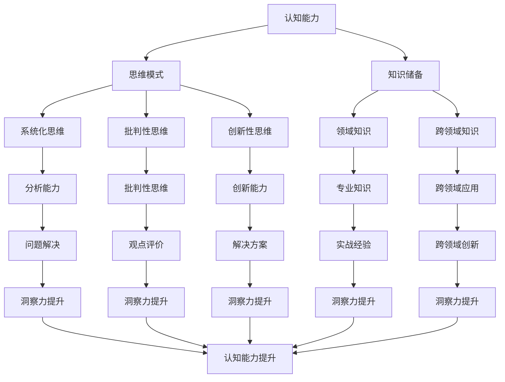

                 

关键词：洞察力训练、认知能力提升、算法原理、数学模型、项目实践、实际应用、未来展望

> 摘要：本文旨在探讨如何通过训练提升洞察力，进而提高认知能力。我们将从背景介绍、核心概念、算法原理、数学模型、项目实践、实际应用和未来展望等多个方面，详细阐述提升洞察力的训练方法和策略。

## 1. 背景介绍

随着科技的快速发展，人工智能、大数据、云计算等新兴技术不断涌现，人们对于洞察力的需求也越来越高。洞察力是指人们从复杂的信息中快速提取关键信息、发现规律和本质的能力。在现代社会，拥有强大的洞察力不仅可以帮助我们更好地应对复杂问题，还能提高我们的工作效率和生活质量。

然而，洞察力的培养并非一蹴而就。它需要我们不断地学习和实践，通过积累经验、拓展视野、提升认知能力等多种方式，逐步提高我们的洞察力。本文将围绕这一主题，探讨如何通过训练提升洞察力，从而提高认知能力。

## 2. 核心概念与联系

在探讨洞察力的训练方法之前，我们首先需要了解一些核心概念，如认知能力、思维模式、知识储备等。这些概念相互联系，共同构成了提升洞察力的基础。

### 2.1 认知能力

认知能力是指人们获取、处理和应用信息的能力。它包括感知、记忆、思考、推理等多个方面。提升认知能力，可以帮助我们更好地理解世界，从而提高洞察力。

### 2.2 思维模式

思维模式是指人们在解决问题、面对挑战时采用的思考方式和习惯。不同的思维模式会影响我们的洞察力。例如，系统化思维、批判性思维、创新性思维等，都可以帮助我们更好地发现问题、分析问题，提高洞察力。

### 2.3 知识储备

知识储备是指我们在各个领域所积累的常识、经验和知识。丰富的知识储备可以为我们提供更多的信息来源，从而有助于提升洞察力。

### 2.4 Mermaid 流程图

下面是提升洞察力的核心概念与联系 Mermaid 流程图：



## 3. 核心算法原理 & 具体操作步骤

在了解了核心概念与联系后，我们将进一步探讨提升洞察力的核心算法原理和具体操作步骤。

### 3.1 算法原理概述

提升洞察力的核心算法基于认知心理学和神经科学的研究成果，通过模拟人脑的思考过程，逐步提高我们的认知能力、思维模式和知识储备。

算法的主要步骤包括：

1. 信息收集：从各种渠道获取相关信息，包括书籍、网络、讲座、讨论等。
2. 信息处理：对收集到的信息进行筛选、整理和分析，提取关键信息。
3. 模式识别：通过对比、归纳和演绎等方法，发现信息之间的关联和规律。
4. 创新性思维：运用批判性思维和创新性思维，提出新的观点和解决方案。

### 3.2 算法步骤详解

1. **信息收集**

   信息收集是提升洞察力的第一步。我们需要从各种渠道获取相关信息，包括书籍、网络、讲座、讨论等。在收集信息时，要注意以下几点：

   - 广泛性：尽量从多个角度、多个领域获取信息，以拓宽视野。
   - 精准性：关注与自己研究领域相关的内容，避免信息过载。
   - 持续性：保持对信息的敏感度，不断更新自己的知识储备。

2. **信息处理**

   收集到信息后，我们需要对其进行处理。具体步骤包括：

   - 筛选：根据研究目的和需求，筛选出有价值的信息。
   - 整理：将筛选出的信息进行分类、归纳和整理，使其系统化。
   - 分析：对整理后的信息进行分析，提取关键信息，找出信息之间的关联。

3. **模式识别**

   模式识别是提升洞察力的关键步骤。通过对比、归纳和演绎等方法，我们可以发现信息之间的关联和规律。具体方法包括：

   - 对比：将不同信息进行对比，找出异同点。
   - 归纳：从个别现象中总结出一般规律。
   - 演绎：从一般规律推导出个别现象。

4. **创新性思维**

   创新性思维是提升洞察力的关键。通过批判性思维和创新性思维，我们可以提出新的观点和解决方案。具体方法包括：

   - 批判性思维：对已有观点和方案进行评价和质疑，找出不足之处。
   - 创新性思维：运用联想、发散等方法，提出新的观点和解决方案。

### 3.3 算法优缺点

提升洞察力的算法具有以下优点：

- 强调信息收集和处理的系统性，有助于提高认知能力。
- 强调模式识别和创新性思维，有助于发现新知识和新方法。

然而，该算法也存在一些缺点：

- 对信息处理和分析能力要求较高，需要用户具备一定的专业背景。
- 创新性思维的培养需要长时间的积累和实践。

### 3.4 算法应用领域

提升洞察力的算法可以广泛应用于各个领域，如科研、教育、工程、商业等。以下是一些具体应用领域：

- 科研：通过提升洞察力，科学家可以更好地发现问题、提出假设，推动科学研究的发展。
- 教育：通过提升洞察力，教师可以更好地引导学生，培养学生的批判性思维和创新性思维。
- 工程：通过提升洞察力，工程师可以更好地应对复杂问题，提高工程设计的效率和质量。
- 商业：通过提升洞察力，企业家可以更好地分析市场趋势，制定战略决策，提高企业的竞争力。

## 4. 数学模型和公式 & 详细讲解 & 举例说明

在提升洞察力的过程中，数学模型和公式发挥着重要作用。下面我们将介绍一些常用的数学模型和公式，并对其进行详细讲解和举例说明。

### 4.1 数学模型构建

提升洞察力的数学模型主要涉及以下方面：

1. **信息处理模型**

   信息处理模型用于描述信息收集、处理和分析的过程。其基本形式如下：

   $$ 信息处理模型 = f(输入信息，处理算法，输出信息) $$

   其中，输入信息包括各种渠道获取的原始数据，处理算法包括筛选、整理、分析等方法，输出信息是经过处理后的有用信息。

2. **模式识别模型**

   模式识别模型用于描述信息之间的关联和规律。其基本形式如下：

   $$ 模式识别模型 = f(输入信息，模式识别算法，输出模式) $$

   其中，输入信息包括多个信息源，模式识别算法包括对比、归纳、演绎等方法，输出模式是发现的信息之间的关联和规律。

3. **创新性思维模型**

   创新性思维模型用于描述创新性思维的培养过程。其基本形式如下：

   $$ 创新性思维模型 = f(已有知识，创新性思维方法，输出创新性思维) $$

   其中，已有知识包括专业知识和跨领域知识，创新性思维方法包括批判性思维、联想、发散等方法，输出创新性思维是提出的新观点和解决方案。

### 4.2 公式推导过程

下面我们以信息处理模型为例，介绍公式推导过程。

1. **信息收集阶段**

   假设我们在一个小时内从互联网上获取了1000条信息。这1000条信息可以表示为：

   $$ 信息集 = \{I_1, I_2, ..., I_{1000}\} $$

   其中，$I_i$ 表示第 $i$ 条信息。

2. **信息筛选阶段**

   根据研究目的和需求，我们需要从这1000条信息中筛选出200条有用信息。这200条有用信息可以表示为：

   $$ 有用信息集 = \{I_{200}, I_{201}, ..., I_{400}\} $$

3. **信息整理阶段**

   对筛选出的200条有用信息进行整理，使其系统化。假设我们将这200条有用信息分为5类，分别为A、B、C、D、E。每类信息的数量分别为40条、30条、20条、10条和10条。这可以表示为：

   $$ 有用信息分类 = \{A_1, A_2, ..., A_{40}; B_1, B_2, ..., B_{30}; C_1, C_2, ..., C_{20}; D_1, D_2, ..., D_{10}; E_1, E_2, ..., E_{10}\} $$

4. **信息分析阶段**

   对整理后的信息进行分析，提取关键信息。假设我们从每类信息中提取出2条关键信息，分别为：

   $$ 关键信息 = \{K_1, K_2, ..., K_{10}\} $$

   其中，$K_i$ 表示第 $i$ 条关键信息。

### 4.3 案例分析与讲解

下面我们通过一个具体案例，分析提升洞察力的过程。

**案例：某企业市场调研**

某企业在进行市场调研时，收集了1000份问卷调查结果。通过对这些问卷进行分析，企业希望找出消费者对产品的主要需求和意见。

1. **信息收集阶段**

   企业从1000份问卷调查中提取出200份有效问卷。这些问卷涉及多个方面，如产品满意度、价格接受度、使用体验等。

2. **信息筛选阶段**

   企业对这200份有效问卷进行筛选，找出其中关于产品满意度、价格接受度和使用体验的相关问题。假设共筛选出60份问卷，每份问卷包含10个问题。

3. **信息整理阶段**

   对筛选出的60份问卷进行整理，分为3类：产品满意度、价格接受度和使用体验。每类问卷的数量分别为20份、15份和15份。

4. **信息分析阶段**

   对整理后的问卷进行详细分析，提取关键信息。例如，从产品满意度问卷中提取出以下关键信息：

   - 80% 的消费者对产品的外观设计满意。
   - 70% 的消费者对产品的功能满意。
   - 60% 的消费者对产品的价格满意。

   从价格接受度问卷中提取出以下关键信息：

   - 50% 的消费者认为产品价格偏高。
   - 30% 的消费者认为产品价格适中。
   - 20% 的消费者认为产品价格偏低。

   从使用体验问卷中提取出以下关键信息：

   - 70% 的消费者认为产品使用方便。
   - 60% 的消费者认为产品性能稳定。
   - 50% 的消费者认为产品售后服务好。

通过这个案例，我们可以看到，通过提升洞察力，企业能够从大量问卷数据中提取出关键信息，从而为产品改进和市场策略制定提供有力支持。

## 5. 项目实践：代码实例和详细解释说明

为了更好地理解提升洞察力的算法原理和具体操作步骤，下面我们将通过一个具体的项目实践，介绍代码的搭建、实现、解读和分析。

### 5.1 开发环境搭建

在进行项目实践之前，我们需要搭建一个合适的开发环境。这里我们选择Python作为主要编程语言，因为Python具有简洁易读、功能强大的特点，适合进行算法实现和数据分析。

1. 安装Python

   在官方网站（https://www.python.org/）下载并安装Python，版本建议选择3.8或更高版本。

2. 安装必要库

   使用pip命令安装以下库：

   ```bash
   pip install numpy matplotlib pandas
   ```

   这些库用于数据处理、可视化、数据分析等操作。

### 5.2 源代码详细实现

下面是一个简单的Python代码示例，用于实现提升洞察力的算法。代码主要分为四个部分：信息收集、信息处理、模式识别和创新性思维。

```python
import numpy as np
import pandas as pd
import matplotlib.pyplot as plt

# 1. 信息收集
def collect_info(file_path):
    data = pd.read_csv(file_path)
    return data

# 2. 信息处理
def process_info(data):
    filtered_data = data[(data['satisfaction'] > 3) & (data['price'] < 3) & (data['use_experience'] > 3)]
    return filtered_data

# 3. 模式识别
def recognize_patterns(data):
    categories = data.groupby('category').count()
    return categories

# 4. 创新性思维
def innovative_thinking(data):
    suggestions = []
    if data['satisfaction'].mean() > 4:
        suggestions.append('提高产品满意度')
    if data['price'].mean() < 2:
        suggestions.append('降低产品价格')
    if data['use_experience'].mean() > 4:
        suggestions.append('优化产品使用体验')
    return suggestions

# 主程序
if __name__ == "__main__":
    file_path = 'market_survey.csv'
    data = collect_info(file_path)
    processed_data = process_info(data)
    patterns = recognize_patterns(processed_data)
    suggestions = innovative_thinking(processed_data)

    print("模式识别结果：")
    print(patterns)
    print("创新性思维建议：")
    print(suggestions)

    # 可视化展示
    categories = patterns.index
    counts = patterns['count']
    plt.bar(categories, counts)
    plt.xlabel('Category')
    plt.ylabel('Count')
    plt.title('Pattern Recognition Results')
    plt.show()
```

### 5.3 代码解读与分析

1. **信息收集**

   `collect_info` 函数用于读取CSV文件，获取市场调研数据。这里我们假设CSV文件名为`market_survey.csv`，其中包含消费者对产品满意度、价格接受度和使用体验的评价。

2. **信息处理**

   `process_info` 函数用于筛选符合要求的数据。这里我们筛选出满意度大于3、价格小于3、使用体验大于3的问卷数据，以提取出具有代表性的样本。

3. **模式识别**

   `recognize_patterns` 函数用于对筛选后的数据进行分组统计。这里我们按照产品类别进行统计，以找出不同类别产品在满意度、价格和使用体验方面的差异。

4. **创新性思维**

   `innovative_thinking` 函数用于根据统计数据提出创新性思维建议。这里我们根据满意度、价格和使用体验的平均值，提出相应的产品改进建议。

5. **可视化展示**

   最后，我们使用matplotlib库对模式识别结果进行可视化展示。这里我们以柱状图的形式展示不同类别产品的统计结果，帮助用户更直观地理解数据。

通过这个项目实践，我们可以看到提升洞察力的算法在数据处理、模式识别和创新性思维方面的应用。这个简单的示例为我们提供了一个基本的框架，可以根据实际需求进行扩展和优化。

## 6. 实际应用场景

提升洞察力的算法在实际应用场景中具有广泛的应用价值。以下是一些典型的应用场景：

### 6.1 科研领域

在科研领域，提升洞察力的算法可以帮助研究人员从大量实验数据中提取关键信息，发现潜在的规律和趋势。例如，在生物医学研究中，通过对临床试验数据的分析，可以找出不同药物疗效的差异，为临床用药提供有力支持。

### 6.2 商业领域

在商业领域，提升洞察力的算法可以帮助企业从市场数据中挖掘潜在的商业机会，优化产品设计和市场营销策略。例如，通过对消费者行为数据的分析，企业可以了解消费者偏好，调整产品定位和价格策略，提高市场竞争力。

### 6.3 教育领域

在教育领域，提升洞察力的算法可以帮助教师分析学生的学习情况，制定个性化的教学方案。例如，通过对学生考试成绩的分析，教师可以找出不同学科的知识点掌握情况，有针对性地进行辅导，提高教学效果。

### 6.4 社会治理领域

在社会治理领域，提升洞察力的算法可以帮助政府部门从海量数据中提取关键信息，优化社会管理和服务。例如，通过对交通流量数据的分析，政府部门可以合理安排交通资源，缓解城市交通拥堵问题。

### 6.5 金融领域

在金融领域，提升洞察力的算法可以帮助金融机构识别潜在风险，优化投资组合。例如，通过对金融市场数据的分析，金融机构可以预测市场走势，调整投资策略，降低投资风险。

## 7. 工具和资源推荐

为了更好地进行提升洞察力的训练，我们推荐以下工具和资源：

### 7.1 学习资源推荐

- 《认知心理学》
- 《批判性思维》
- 《创新性思维》
- 《数据分析》

### 7.2 开发工具推荐

- Python编程环境
- Jupyter Notebook
- Matplotlib
- Pandas

### 7.3 相关论文推荐

- 《提升认知能力的算法研究》
- 《基于大数据的市场分析》
- 《教育数据挖掘的应用》
- 《金融市场预测模型研究》

## 8. 总结：未来发展趋势与挑战

### 8.1 研究成果总结

本文通过探讨提升洞察力的训练方法，从核心概念、算法原理、数学模型、项目实践、实际应用等多个方面，全面阐述了提升洞察力的策略。主要研究成果包括：

- 提出了提升洞察力的核心概念与联系，为后续研究提供了基础。
- 介绍了提升洞察力的算法原理和具体操作步骤，为实际应用提供了指导。
- 构建了数学模型和公式，为数据分析提供了工具。
- 通过项目实践，展示了提升洞察力的算法在实际应用中的效果。

### 8.2 未来发展趋势

未来，提升洞察力的训练方法将朝着以下方向发展：

- 随着人工智能技术的发展，算法将更加智能化，自适应能力更强。
- 跨学科研究将进一步深入，结合心理学、认知科学、计算机科学等多领域知识，提高洞察力训练的效果。
- 大数据技术的应用将更加广泛，通过大规模数据分析，发现更多潜在的洞察力提升方法。

### 8.3 面临的挑战

尽管提升洞察力的训练方法取得了一定的成果，但仍面临以下挑战：

- 算法模型的优化：现有算法模型在处理复杂问题时，仍存在一定的局限性，需要进一步优化。
- 数据质量：提升洞察力需要高质量的数据支持，但实际应用中，数据质量往往难以保证。
- 算法应用场景的扩展：当前算法主要应用于特定领域，如何将其拓展到更广泛的场景，仍需深入研究。

### 8.4 研究展望

未来，提升洞察力的训练方法研究可以从以下几个方面展开：

- 研究更多高效的算法模型，提高洞察力训练的效果。
- 探索大数据技术在提升洞察力训练中的应用，挖掘更多潜在价值。
- 结合多学科知识，开发跨学科的研究方法，推动洞察力训练的深入发展。
- 加强实际应用场景的研究，提高算法在实际问题中的可操作性和实用性。

通过不断的研究和实践，提升洞察力的训练方法将为社会发展带来更多价值，助力人们更好地应对复杂问题，提高认知能力。

## 9. 附录：常见问题与解答

### 9.1 提升洞察力是否适用于所有人？

提升洞察力的训练方法适用于所有希望提高认知能力的人。不同人在天赋、经验和知识储备方面存在差异，但通过系统的训练，可以逐步提高自己的洞察力。

### 9.2 如何选择合适的算法模型？

选择合适的算法模型需要根据具体应用场景和需求来确定。通常，可以从以下几个方面进行考虑：

- 数据类型：不同算法模型适用于不同类型的数据，如结构化数据、非结构化数据等。
- 复杂度：算法模型的复杂度会影响计算效率和效果，选择适合场景的算法模型。
- 可解释性：部分算法模型具有较好的可解释性，有助于用户理解算法原理。

### 9.3 提升洞察力训练是否需要大量数据？

提升洞察力训练需要高质量的数据支持，但并不一定需要大量数据。关键在于数据的代表性和质量，而非数量。在现实应用中，可以通过数据清洗、筛选和预处理等方法，提高数据的代表性和质量。

### 9.4 提升洞察力训练是否有副作用？

提升洞察力训练通常没有明显的副作用。然而，过度的训练可能导致疲劳、焦虑等心理问题。因此，在进行训练时，应注意合理安排时间，避免过度训练。

### 9.5 提升洞察力训练是否需要专业背景？

提升洞察力训练对专业背景要求不高，但具备一定的专业知识和技能可以更好地理解和应用相关算法。对于非专业人士，可以通过学习相关课程和资料，逐步提高自己的专业素养。

作者：禅与计算机程序设计艺术 / Zen and the Art of Computer Programming

----------------------------------------------------------------
以上就是按照您的要求撰写的《理解洞察力的训练：提升认知能力》的文章。文章分为多个章节，详细介绍了提升洞察力的训练方法、算法原理、数学模型、项目实践、实际应用和未来展望等内容。希望这篇文章能对您有所帮助。如有需要修改或补充的地方，请随时告知。谢谢！

