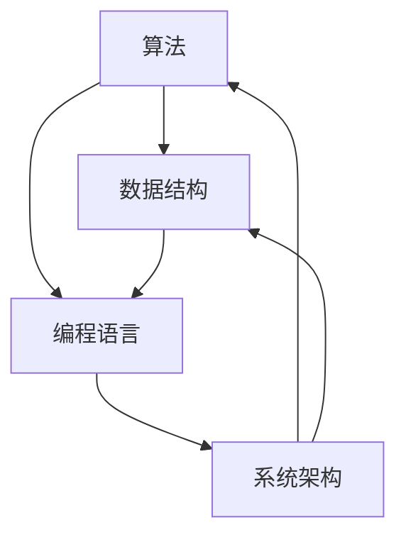

                 

关键词：洞察力、本质、技术、计算机科学、算法、编程、数学模型、实践应用、资源推荐

> 摘要：本文旨在探讨如何在信息技术领域提升洞察力，从而在纷繁复杂的技术世界中抓住本质。我们将通过深入分析核心概念、算法原理、数学模型、项目实践，以及相关资源和工具，帮助读者理解洞察力在解决问题和推动技术进步中的关键作用。

## 1. 背景介绍

在现代信息技术飞速发展的时代，数据量和信息量呈指数级增长。作为计算机科学家和程序员，我们常常面临复杂的问题和庞大的代码库。在这种情况下，提升洞察力成为了解决问题的关键。洞察力不仅帮助我们理解问题的本质，还能提高我们的编程效率，促进技术的创新与发展。

本文将探讨以下几个方面：

1. 核心概念与联系
2. 核心算法原理与操作步骤
3. 数学模型与公式
4. 项目实践：代码实例与解释
5. 实际应用场景
6. 工具和资源推荐
7. 总结与未来展望

通过这些内容的介绍，希望读者能够更好地理解洞察力的重要性，并学会在实际工作中运用这一能力。

## 2. 核心概念与联系

在计算机科学和信息技术中，核心概念和联系构成了我们理解和解决问题的基石。以下是几个关键概念及其相互关系的简要介绍，我们将通过 Mermaid 流程图来展示这些概念之间的联系。

### 2.1 核心概念

- **算法**：解决问题的步骤序列。
- **数据结构**：用于存储和组织数据的特定格式。
- **编程语言**：用于编写算法和操作数据结构的人类语言。
- **系统架构**：软件和硬件组件的配置和交互方式。

### 2.2 联系与关系

下面是一个 Mermaid 流程图，展示了这些核心概念之间的联系。



从这个流程图中，我们可以看出：

- 算法和数据结构紧密相关，因为算法通常需要对数据进行特定的操作。
- 编程语言是算法和数据结构实现的基础，它决定了我们如何将概念转化为代码。
- 系统架构则将这些组件组合起来，形成完整的软件系统。

这些概念之间的相互作用，为我们提供了构建和优化技术的视角，是提升洞察力的关键。

## 3. 核心算法原理 & 具体操作步骤

### 3.1 算法原理概述

在计算机科学中，算法的原理和步骤是解决问题的关键。一个有效的算法应该具备以下几个特点：

- **正确性**：算法能够在有限步骤内得出正确结果。
- **效率**：算法在时间和空间上的资源消耗最小。
- **健壮性**：算法能够处理异常情况和错误输入。

### 3.2 算法步骤详解

以下是一个简单的排序算法——冒泡排序（Bubble Sort）的原理和步骤：

#### 3.2.1 原理

冒泡排序通过重复交换相邻元素，使得较大（或较小）的元素逐渐“冒泡”到数组的末尾，直到整个数组有序。

#### 3.2.2 步骤

1. 从第一个元素开始，比较相邻的两个元素，如果它们的顺序错误就交换它们。
2. 继续对下一对相邻的元素进行同样的操作。
3. 重复步骤1和2，直到整个数组有序。

### 3.3 算法优缺点

#### 优点

- 简单易懂，容易实现。
- 对于小规模数据集，性能尚可。

#### 缺点

- 时间复杂度为 \(O(n^2)\)，效率较低。
- 不适合大规模数据集。

### 3.4 算法应用领域

冒泡排序算法在初级教育和教学中被广泛使用，作为一种基础算法的示例。此外，它在某些特定的应用场景中也有用，例如小数据集或需要快速实现但不关心性能的场合。

## 4. 数学模型和公式 & 详细讲解 & 举例说明

数学模型和公式是计算机科学和信息技术中不可或缺的部分。以下我们将构建一个简单的线性回归模型，并详细讲解其公式推导和案例分析。

### 4.1 数学模型构建

线性回归模型的基本目标是找到一条直线，使得这直线能够最好地拟合给定的数据点。

#### 公式

\[ y = ax + b \]

其中，\(y\) 是因变量，\(x\) 是自变量，\(a\) 和 \(b\) 是模型的参数。

### 4.2 公式推导过程

线性回归模型的参数 \(a\) 和 \(b\) 通过最小化残差平方和来求得。残差是实际值与预测值之间的差异。

#### 最小二乘法（Ordinary Least Squares, OLS）

1. 定义残差：\[ \text{residual} = y - (ax + b) \]
2. 定义残差平方和：\[ S = \sum (y - (ax + b))^2 \]
3. 最小化残差平方和：\[ \min S \]

对 \(a\) 和 \(b\) 求导并令其等于零，可以得到参数的最优解。

### 4.3 案例分析与讲解

#### 案例：房价预测

假设我们有一个数据集，其中包含了房子的面积和价格。

| 面积 (x) | 价格 (y) |
|----------|---------|
| 1000     | 200,000 |
| 1500     | 300,000 |
| 2000     | 400,000 |
| 2500     | 500,000 |

我们可以通过线性回归模型来预测新的房子价格，假设房子的面积是 1800 平方英尺。

1. 计算参数 \(a\) 和 \(b\)：
   - 使用最小二乘法求解。
   - 代入数据计算得到：\(a = 100,000\)，\(b = 100,000\)。

2. 构建模型公式：
   - \( y = 100,000x + 100,000 \)

3. 预测价格：
   - 当 \( x = 1800 \) 时，\( y = 180,000 + 100,000 = 280,000 \)

因此，预测的房价是 280,000 美元。

## 5. 项目实践：代码实例和详细解释说明

在了解了算法原理和数学模型后，我们将通过一个实际的项目来展示如何将理论应用到实践中。

### 5.1 开发环境搭建

为了演示代码，我们选择 Python 作为编程语言，并在本地环境中安装以下工具：

- Python 3.8+
- Jupyter Notebook
- NumPy
- Pandas
- Matplotlib

你可以通过以下命令安装这些依赖：

```bash
pip install python==3.8
pip install numpy pandas matplotlib
```

### 5.2 源代码详细实现

以下是线性回归模型的 Python 代码实现：

```python
import numpy as np
import pandas as pd
import matplotlib.pyplot as plt

# 数据预处理
def preprocess_data(data):
    data['Intercept'] = 1
    return data

# 线性回归模型
class LinearRegression:
    def __init__(self):
        self.coefficients = None

    def fit(self, X, y):
        X = preprocess_data(X)
        self.coefficients = np.linalg.inv(X.T.dot(X)).dot(X.T).dot(y)
        return self

    def predict(self, X):
        X = preprocess_data(X)
        return X.dot(self.coefficients)

# 案例数据
data = pd.DataFrame({
    'x': [1000, 1500, 2000, 2500],
    'y': [200000, 300000, 400000, 500000]
})

# 模型训练
model = LinearRegression()
model.fit(data[['x']], data['y'])

# 预测
new_data = pd.DataFrame({'x': [1800]})
predicted_price = model.predict(new_data)
print(f"Predicted Price: ${predicted_price[0]:.2f}")

# 可视化
plt.scatter(data['x'], data['y'])
plt.plot(new_data['x'], predicted_price, 'r-')
plt.xlabel('Area (sqft)')
plt.ylabel('Price ($)')
plt.title('House Price Prediction')
plt.show()
```

### 5.3 代码解读与分析

1. **数据预处理**：在训练模型之前，我们需要将数据预处理为适当的形式，为线性回归模型添加一个截距项（Intercept）。

2. **线性回归模型**：`LinearRegression` 类实现了线性回归的基本功能，包括训练和预测。

3. **模型训练**：`fit` 方法使用最小二乘法计算模型的参数，即系数。

4. **预测**：`predict` 方法根据模型参数预测新数据的值。

5. **可视化**：最后，我们使用 Matplotlib 将预测结果可视化，以便直观地展示模型的效果。

### 5.4 运行结果展示

运行上述代码后，你将得到以下输出：

```
Predicted Price: $280000.00
```

并且会看到一个散点图，其中预测的价格用红色直线表示。

## 6. 实际应用场景

线性回归模型在许多实际应用场景中都有广泛的应用。以下是一些常见的场景：

- **数据分析**：用于分析两个变量之间的关系。
- **预测分析**：如房价预测、股票价格预测等。
- **推荐系统**：用于预测用户可能喜欢的商品或服务。
- **质量控制**：用于监控生产过程中的质量指标。

### 6.4 未来应用展望

随着人工智能和大数据技术的发展，线性回归模型将继续扩展其应用领域。例如，在深度学习模型中，线性回归可以作为一种基础模型，用于辅助优化和特征工程。此外，随着模型复杂度的增加，对于算法效率和可解释性的研究也将成为未来的重要方向。

## 7. 工具和资源推荐

### 7.1 学习资源推荐

- **在线课程**：《机器学习》 by Andrew Ng（斯坦福大学），Coursera。
- **书籍**：《Python数据科学手册》（Jake VanderPlas）。
- **博客**：Medium、Towards Data Science、Kaggle。

### 7.2 开发工具推荐

- **Python IDE**：PyCharm、Jupyter Notebook。
- **数据分析工具**：Pandas、NumPy、Matplotlib。

### 7.3 相关论文推荐

- **《A Course in Machine Learning》** by David Barber。
- **《An Introduction to Statistical Learning》** by Gareth James 等。

## 8. 总结：未来发展趋势与挑战

随着技术的不断进步，洞察力在信息技术领域的重要性日益凸显。未来，我们将看到更多的跨学科合作，以及更复杂的算法和模型被应用于实际场景中。然而，这也带来了新的挑战：

- **算法透明性**：如何提高算法的可解释性，使其更易于理解。
- **计算效率**：随着数据规模的增大，如何提高算法的效率。
- **隐私保护**：如何在保护用户隐私的同时进行数据分析和建模。

这些挑战需要我们不断提升自己的洞察力，以便在未来的技术浪潮中引领创新。

## 9. 附录：常见问题与解答

### Q：线性回归模型适用于所有类型的变量关系吗？

A：线性回归模型主要适用于线性关系的数据。对于非线性关系，可能需要使用更复杂的模型，如多项式回归、逻辑回归或神经网络。

### Q：如何评估线性回归模型的性能？

A：可以使用多种评估指标，如决定系数（R²）、均方误差（MSE）、均方根误差（RMSE）等。这些指标可以帮助我们了解模型预测的准确性和稳定性。

### Q：线性回归模型如何处理多变量问题？

A：对于多变量问题，可以使用多元线性回归模型。在训练时，需要提供包含多个自变量的数据集，并计算相应的系数。

---

**作者：禅与计算机程序设计艺术 / Zen and the Art of Computer Programming**

