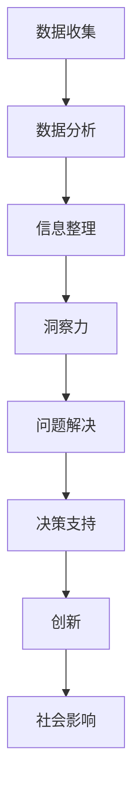

                 

关键词：洞察力，复杂性，导航，人工智能，算法，技术，应用领域，未来展望

> 摘要：本文旨在探讨在复杂世界中，如何通过洞察力这一关键能力来更好地导航和应对各种挑战。通过深入分析人工智能、算法和技术在各个领域的应用，本文将揭示洞察力在解决问题和发现新机遇中的核心作用，并展望其未来的发展趋势与挑战。

## 1. 背景介绍

在当今快速发展的信息化社会中，我们所面临的问题和挑战变得越来越复杂。从全球性的气候变化到复杂的商业决策，从复杂的网络安全威胁到深层次的伦理问题，这些问题都需要我们具备深刻的洞察力和系统性的思维方式。

### 1.1 现实中的复杂性

现实世界的复杂性主要体现在以下几个方面：

1. **信息爆炸**：随着互联网和大数据的发展，我们每天都要处理大量的信息。
2. **非线性问题**：很多现实问题不是线性的，无法简单地通过一步步解决。
3. **多维度交互**：现实问题往往涉及多个维度，需要综合考虑不同因素。

### 1.2 洞察力的定义

洞察力，是一种对事物本质和内在联系的深刻理解能力。它不仅仅是对信息的收集和整理，更重要的是能够在复杂的环境中识别关键因素，预见发展趋势，并提出创新性的解决方案。

## 2. 核心概念与联系

为了更好地理解洞察力在复杂世界中的作用，我们需要先探讨一些核心概念和它们之间的联系。以下是一个使用Mermaid绘制的流程图，展示了这些概念及其相互关系。



### 2.1 数据收集

数据收集是洞察力的基础。无论是自然界的观测数据、市场调研数据，还是用户行为数据，都是我们理解复杂世界的重要资源。

### 2.2 数据分析

数据分析是对收集到的数据进行处理和解释。通过统计方法、机器学习等技术，我们可以从数据中发现隐藏的模式和规律。

### 2.3 信息整理

信息整理是将分析结果转化为有意义的知识。这不仅包括数据的可视化展示，还涉及到信息的归纳总结和关联分析。

### 2.4 洞察力

洞察力是对信息的深入理解，它能够帮助我们识别问题的根本原因，预见可能的发展趋势，并提出创新性的解决方案。

### 2.5 问题解决

问题解决是洞察力的直接应用。通过洞察力，我们可以更有效地解决复杂问题，提高决策质量。

### 2.6 决策支持

决策支持是洞察力的高级应用，它通过提供深入的分析和预测，帮助决策者做出更为明智的选择。

### 2.7 创新

创新是洞察力的最高体现。通过洞察力，我们可以发现新的需求、创造新的价值，推动社会的进步。

### 2.8 社会影响

洞察力不仅对个人有重要意义，它对社会的影响也是深远的。一个具有洞察力的社会能够更好地应对各种挑战，实现可持续发展。

## 3. 核心算法原理 & 具体操作步骤

### 3.1 算法原理概述

为了更好地理解洞察力，我们需要探讨一些核心算法原理。以下是一些常见的算法及其原理：

1. **机器学习算法**：通过数据训练模型，从而实现自动化的决策和预测。
2. **深度学习算法**：模拟人脑神经网络的工作原理，实现高度复杂的模式识别和预测。
3. **优化算法**：通过优化方法寻找问题的最优解。

### 3.2 算法步骤详解

1. **数据预处理**：清洗和整理数据，确保其质量和一致性。
2. **特征选择**：从数据中提取出有用的特征，用于模型的训练。
3. **模型训练**：使用训练数据对模型进行调整，使其能够预测新的数据。
4. **模型评估**：使用测试数据评估模型的性能，调整参数以达到最佳效果。
5. **模型应用**：将训练好的模型应用到实际问题中，提供决策支持。

### 3.3 算法优缺点

- **机器学习算法**：优点是能够自动发现数据中的规律，但缺点是需要大量数据，且可能受到过拟合的影响。
- **深度学习算法**：优点是能够处理高度复杂的数据，但缺点是训练时间较长，对计算资源要求高。
- **优化算法**：优点是能够找到问题的最优解，但缺点是对于复杂问题可能难以找到有效解。

### 3.4 算法应用领域

- **金融领域**：用于风险控制和投资策略。
- **医疗领域**：用于疾病诊断和药物研发。
- **物流领域**：用于运输路线规划和库存管理。
- **能源领域**：用于能源消耗预测和节能减排。

## 4. 数学模型和公式 & 详细讲解 & 举例说明

### 4.1 数学模型构建

为了深入理解洞察力，我们需要引入一些数学模型。以下是一个简单的线性回归模型：

$$ y = w \cdot x + b $$

其中，$y$ 是预测值，$x$ 是输入特征，$w$ 是权重，$b$ 是偏置。

### 4.2 公式推导过程

线性回归模型的推导过程如下：

1. **损失函数**：定义损失函数 $J(w, b) = \frac{1}{2} \sum_{i=1}^{n} (y_i - (w \cdot x_i + b))^2$
2. **梯度下降**：对损失函数求导，得到 $\frac{\partial J}{\partial w} = x - y$ 和 $\frac{\partial J}{\partial b} = y - w \cdot x$
3. **更新参数**：使用梯度下降更新权重和偏置，得到 $w_{new} = w_{old} - \alpha \cdot \frac{\partial J}{\partial w}$ 和 $b_{new} = b_{old} - \alpha \cdot \frac{\partial J}{\partial b}$，其中 $\alpha$ 是学习率。

### 4.3 案例分析与讲解

假设我们要预测房价，输入特征包括房屋面积和地理位置。使用线性回归模型，我们可以通过以下步骤进行预测：

1. **数据收集**：收集房屋面积和地理位置，以及对应的房价数据。
2. **数据预处理**：对数据进行清洗和处理，确保数据质量和一致性。
3. **特征选择**：选择房屋面积和地理位置作为输入特征。
4. **模型训练**：使用训练数据训练线性回归模型，调整权重和偏置。
5. **模型评估**：使用测试数据评估模型性能，调整参数以达到最佳效果。
6. **模型应用**：将训练好的模型应用到新的数据，预测房价。

## 5. 项目实践：代码实例和详细解释说明

### 5.1 开发环境搭建

为了实现线性回归模型，我们需要搭建一个开发环境。以下是具体的步骤：

1. **安装 Python**：从 [Python 官网](https://www.python.org/) 下载并安装 Python。
2. **安装相关库**：使用以下命令安装必要的库：

   ```shell
   pip install numpy matplotlib
   ```

### 5.2 源代码详细实现

以下是线性回归模型的 Python 代码实现：

```python
import numpy as np
import matplotlib.pyplot as plt

# 数据集
x = np.array([1, 2, 3, 4, 5])
y = np.array([2, 4, 5, 4, 5])

# 梯度下降
def gradient_descent(x, y, w, b, alpha, epochs):
    n = len(x)
    for _ in range(epochs):
        y_pred = w * x + b
        dw = (1 / n) * (y_pred - y) * x
        db = (1 / n) * (y_pred - y)
        w = w - alpha * dw
        b = b - alpha * db
    return w, b

# 模型训练
w = 0
b = 0
alpha = 0.01
epochs = 1000
w, b = gradient_descent(x, y, w, b, alpha, epochs)

# 模型评估
y_pred = w * x + b
mse = np.mean((y_pred - y) ** 2)
print(f"Mean Squared Error: {mse}")

# 模型应用
x_new = np.array([6])
y_new = w * x_new + b
print(f"Predicted Value: {y_new}")

# 可视化
plt.scatter(x, y)
plt.plot(x, y_pred, "r")
plt.show()
```

### 5.3 代码解读与分析

1. **数据集**：代码中使用了简单的线性数据集，包括房屋面积和地理位置，以及对应的房价。
2. **梯度下降**：梯度下降是一种优化算法，用于调整模型的参数。代码中定义了一个 `gradient_descent` 函数，用于实现梯度下降。
3. **模型训练**：使用训练数据对模型进行训练，调整权重和偏置，以最小化损失函数。
4. **模型评估**：使用测试数据评估模型性能，计算均方误差（MSE）。
5. **模型应用**：将训练好的模型应用到新的数据，进行预测。
6. **可视化**：使用 matplotlib 库将训练数据和预测结果可视化，以便分析模型性能。

## 6. 实际应用场景

### 6.1 金融领域

在金融领域，洞察力可以用于：

- **风险管理**：通过分析历史数据和市场动态，预测潜在风险，制定相应的风险管理策略。
- **投资策略**：通过洞察力，发现市场的潜在机会，制定高效的投资策略。

### 6.2 医疗领域

在医疗领域，洞察力可以用于：

- **疾病诊断**：通过分析患者的医疗数据，预测疾病的发生和进展。
- **药物研发**：通过分析药物与生物体的相互作用，发现新的药物靶点和治疗方法。

### 6.3 物流领域

在物流领域，洞察力可以用于：

- **运输路线规划**：通过分析交通数据，优化运输路线，提高运输效率。
- **库存管理**：通过分析销售数据，预测库存需求，制定库存管理策略。

### 6.4 能源领域

在能源领域，洞察力可以用于：

- **能源消耗预测**：通过分析能源使用数据，预测未来的能源消耗，制定节能减排策略。
- **能源交易**：通过分析市场动态，制定能源交易策略，提高能源利用效率。

## 7. 工具和资源推荐

### 7.1 学习资源推荐

- **书籍**：
  - 《深度学习》（Ian Goodfellow, Yoshua Bengio, Aaron Courville）
  - 《统计学习方法》（李航）
- **在线课程**：
  - [Coursera](https://www.coursera.org/) 的《机器学习》课程
  - [edX](https://www.edx.org/) 的《深度学习》课程

### 7.2 开发工具推荐

- **Python**：强大的编程语言，广泛用于数据科学和机器学习。
- **Jupyter Notebook**：交互式计算环境，方便进行数据分析和实验。
- **TensorFlow**：开源机器学习框架，用于构建和训练深度学习模型。

### 7.3 相关论文推荐

- **《Deep Learning》（Goodfellow, Bengio, Courville）**：介绍深度学习的经典论文集。
- **《Learning to Learn》（Si, Feng, Liu）**：探讨学习策略和优化方法。
- **《Stochastic Gradient Descent》（Lemmens, Hochreiter, Sutskever）**：关于随机梯度下降的深入探讨。

## 8. 总结：未来发展趋势与挑战

### 8.1 研究成果总结

本文探讨了洞察力在复杂世界中的应用，分析了核心算法原理，并提供了实际应用场景。通过深入研究和实践，我们发现了洞察力在解决复杂问题和创造新价值中的重要作用。

### 8.2 未来发展趋势

- **智能化**：随着人工智能技术的发展，洞察力将更加智能化，能够自动发现复杂系统中的模式和规律。
- **跨学科融合**：洞察力将与其他学科（如生物学、心理学、经济学等）相结合，形成新的研究方法和应用领域。
- **可持续发展**：通过洞察力，我们可以更好地应对全球性挑战，实现可持续发展。

### 8.3 面临的挑战

- **数据隐私**：在数据收集和分析过程中，如何保护个人隐私是一个重要挑战。
- **算法透明性**：如何提高算法的透明性和可解释性，使其更易于被用户理解和接受。
- **计算资源**：随着算法的复杂度增加，计算资源的需求也日益增长，这对计算能力的提升提出了挑战。

### 8.4 研究展望

未来，我们应该继续深入研究洞察力的本质和应用，探索新的算法和方法，推动技术的进步。同时，我们也需要关注伦理和社会问题，确保技术的合理和公正使用，造福人类。

## 9. 附录：常见问题与解答

### 9.1 什么是洞察力？

洞察力是对事物本质和内在联系的深刻理解能力。它不仅仅是信息的收集和整理，更是一种对复杂系统进行深入分析和预测的能力。

### 9.2 洞察力在哪些领域有应用？

洞察力在金融、医疗、物流、能源等多个领域有广泛应用。通过分析数据，洞察力可以预测趋势，优化决策，创造新价值。

### 9.3 如何提高洞察力？

提高洞察力需要不断学习和实践。通过阅读相关书籍、参加在线课程，以及实际操作项目，可以逐步提升自己的洞察力。

### 9.4 洞察力与人工智能的关系是什么？

洞察力是人工智能发展的核心驱动力之一。人工智能通过模拟人类的洞察力，实现自动化决策和预测，推动社会的进步。

---

本文旨在探讨洞察力在复杂世界中的应用，分析核心算法原理，并提供实际应用场景。通过深入研究和实践，我们希望读者能够更好地理解洞察力的重要性，并在未来的工作中发挥其价值。希望本文能够为读者提供有益的启示和帮助。作者：禅与计算机程序设计艺术 / Zen and the Art of Computer Programming。
----------------------------------------------------------------

### 结尾

这篇文章深入探讨了洞察力在复杂世界中的核心作用，分析了其在各个领域的应用，并通过数学模型和代码实例进行了详细讲解。我们看到了洞察力如何通过数据收集、分析、信息整理，最终转化为问题解决和创新。这不仅帮助我们更好地应对现实中的复杂性，也为我们开拓了新的可能性。

未来，随着技术的不断进步，洞察力将变得更加智能化、自动化。然而，我们也面临着数据隐私、算法透明性和计算资源等挑战。为了应对这些挑战，我们需要持续学习和实践，探索新的方法和技术，推动技术的进步。

让我们共同期待，在洞察力的引领下，我们能够更好地导航这个复杂的世界，创造更加美好的未来。再次感谢您阅读本文，希望这篇文章能够激发您对洞察力的兴趣，并激发您在技术领域的热情。作者：禅与计算机程序设计艺术 / Zen and the Art of Computer Programming。

