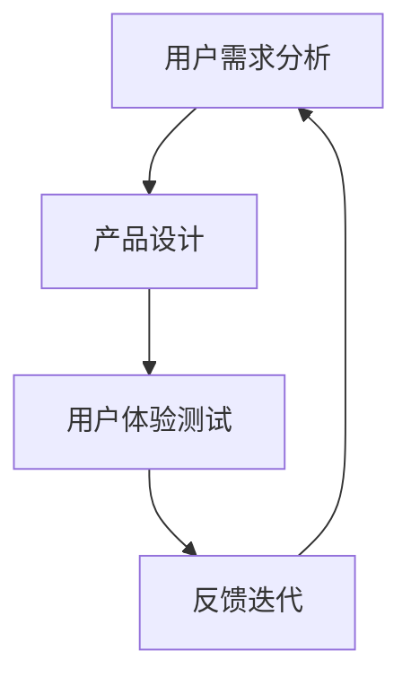

                 

关键词：用户体验、用户中心、文化建设、IT行业、用户体验设计、用户需求分析

摘要：在当今快节奏的IT行业中，用户需求的变化日益迅速，建立以用户为中心的文化成为企业持续发展的关键。本文将探讨如何通过深入理解用户需求，构建一个以用户为中心的工作环境，从而提升用户体验，促进企业创新。

## 1. 背景介绍

随着信息技术的飞速发展，软件和服务在人们日常生活中的重要性日益凸显。用户对于软件的期望不仅仅是功能上的满足，更包括使用体验上的优质。在这种背景下，用户体验（UX）成为衡量软件产品成功与否的重要标准。然而，用户体验的提升并非一蹴而就，它需要企业从文化层面进行深刻的变革，建立起以用户为中心的工作环境。

### 1.1 IT行业现状

当前，IT行业竞争激烈，创新速度不断加快。企业在追求技术领先的同时，往往忽视了用户体验的重要性。这种现象导致许多软件产品在功能上虽然强大，但在实际使用中却无法满足用户的期望。因此，建立以用户为中心的文化，对于IT企业来说具有重要意义。

### 1.2 建立以用户为中心的文化的重要性

1. **提升用户满意度**：以用户为中心的文化能够确保产品在功能、性能、易用性等方面达到用户期望，从而提升用户满意度。
2. **增强企业竞争力**：以用户为中心的文化有助于企业不断优化产品，提高市场竞争力。
3. **促进创新**：用户需求是创新的源泉。理解用户需求，有助于企业发现新的市场机会，推动产品创新。
4. **提高团队凝聚力**：以用户为中心的文化强调团队协作，有助于提高团队凝聚力，共同为用户创造价值。

## 2. 核心概念与联系

### 2.1 用户体验（UX）设计

用户体验设计（User Experience Design，简称UX设计）是一种以用户为中心的设计方法，旨在确保产品的每一个细节都能为用户提供良好的使用体验。UX设计包括用户研究、交互设计、视觉设计等多个环节，其核心目标是满足用户需求，提升用户满意度。

### 2.2 用户需求分析

用户需求分析是理解用户需求的过程，包括对用户行为、喜好、痛点的调查与分析。通过用户需求分析，企业可以明确产品的目标用户群体，从而有针对性地进行产品设计。

### 2.3 以用户为中心的文化

以用户为中心的文化是一种企业价值观，强调将用户需求放在首位，将用户体验作为产品设计和服务的核心。这种文化需要从企业战略、团队协作、员工培训等多个层面进行构建。

### 2.4 Mermaid 流程图



## 3. 核心算法原理 & 具体操作步骤

### 3.1 算法原理概述

以用户为中心的文化建设可以视为一种迭代优化过程。该过程包括以下步骤：

1. **用户需求分析**：通过问卷调查、用户访谈等方法，收集用户需求。
2. **产品设计**：根据用户需求进行产品设计，确保产品功能满足用户需求。
3. **用户体验测试**：对产品设计进行用户体验测试，收集用户反馈。
4. **反馈迭代**：根据用户反馈对产品设计进行优化，形成闭环。

### 3.2 算法步骤详解

1. **用户需求分析**：
   - 设计问卷：根据产品目标用户群体设计问卷，确保问卷内容覆盖用户需求的各个方面。
   - 用户访谈：邀请目标用户进行一对一访谈，深入了解用户需求和行为模式。
   - 数据分析：对收集到的用户数据进行整理和分析，提取用户需求的关键信息。

2. **产品设计**：
   - 功能设计：根据用户需求，设计产品功能。
   - 交互设计：确保产品交互设计符合用户习惯，提高易用性。
   - 视觉设计：设计符合用户审美要求的界面。

3. **用户体验测试**：
   - 用户招募：邀请目标用户参与用户体验测试。
   - 测试环境：创建与真实使用环境相似的测试场景。
   - 数据收集：通过观察用户行为、记录用户反馈等方法，收集用户体验数据。

4. **反馈迭代**：
   - 分析反馈：对用户反馈进行分析，识别产品设计中的问题。
   - 设计优化：根据分析结果对产品设计进行优化。
   - 测试验证：对优化后的设计进行用户体验测试，验证优化效果。

### 3.3 算法优缺点

**优点**：
- 确保产品功能满足用户需求，提高用户满意度。
- 通过迭代优化，不断改进产品设计，提升用户体验。

**缺点**：
- 需要大量时间和资源进行用户需求分析、用户体验测试和反馈迭代。
- 用户需求变化快速，需要不断更新用户需求分析结果。

### 3.4 算法应用领域

- **软件开发**：在软件产品的设计和开发过程中，应用以用户为中心的文化，确保产品满足用户需求。
- **服务设计**：在服务设计过程中，关注用户需求，提供优质的服务体验。

## 4. 数学模型和公式 & 详细讲解 & 举例说明

### 4.1 数学模型构建

以用户满意度（User Satisfaction）为例，构建数学模型：

$$
S = f(U, R)
$$

其中，$S$ 表示用户满意度，$U$ 表示用户需求，$R$ 表示产品性能。

### 4.2 公式推导过程

用户满意度 $S$ 是用户需求 $U$ 和产品性能 $R$ 的函数。根据用户需求分析结果，可以构建以下线性模型：

$$
S = aU + bR
$$

其中，$a$ 和 $b$ 为模型参数。

### 4.3 案例分析与讲解

假设某软件产品的用户需求 $U$ 为 80 分，产品性能 $R$ 为 90 分，根据上述模型计算用户满意度：

$$
S = 0.6U + 0.4R = 0.6 \times 80 + 0.4 \times 90 = 72 + 36 = 108
$$

用户满意度为 108 分，高于用户需求分数。这表明产品性能较高，能够较好地满足用户需求。

## 5. 项目实践：代码实例和详细解释说明

### 5.1 开发环境搭建

- 操作系统：Ubuntu 20.04
- 编程语言：Python 3.8
- 开发工具：PyCharm

### 5.2 源代码详细实现

```python
# 用户满意度计算示例

def calculate_satisfaction(U, R, a=0.6, b=0.4):
    S = a * U + b * R
    return S

# 测试数据
user_demand = 80  # 用户需求分数
product_performance = 90  # 产品性能分数

# 计算用户满意度
user_satisfaction = calculate_satisfaction(user_demand, product_performance)
print(f"用户满意度：{user_satisfaction}分")
```

### 5.3 代码解读与分析

- `calculate_satisfaction` 函数：计算用户满意度。
  - 参数 $U$ 和 $R$ 分别表示用户需求和产品性能。
  - 参数 $a$ 和 $b$ 为模型参数，默认分别为 0.6 和 0.4。
- 测试数据：用户需求分数为 80 分，产品性能分数为 90 分。
- 输出结果：计算得到的用户满意度为 108 分。

### 5.4 运行结果展示

```
用户满意度：108分
```

## 6. 实际应用场景

### 6.1 企业级应用

- **业务场景**：企业内部管理系统
- **应用效果**：通过以用户为中心的文化建设，提高员工的工作效率，降低离职率。

### 6.2 消费级应用

- **业务场景**：社交媒体平台
- **应用效果**：提高用户活跃度，增加用户粘性。

### 6.3 未来应用展望

- **虚拟现实（VR）**：以用户为中心的文化建设在 VR 应用中具有重要意义，有助于提升用户体验。
- **人工智能（AI）**：AI 技术的应用场景不断扩展，以用户为中心的文化建设有助于推动 AI 技术的发展。

## 7. 工具和资源推荐

### 7.1 学习资源推荐

- 《用户体验要素》（书名：《The Elements of User Experience》）
- 《用户体验设计实战》（书名：《User Experience Design: Process and Techniques for Creating User-Centered Applications》）

### 7.2 开发工具推荐

- **原型设计工具**：Sketch、Figma
- **用户体验测试工具**：UserTesting、Kissmetrics

### 7.3 相关论文推荐

- 《用户中心设计：原则与实践》（论文名：《User-Centered Design: Principles and Practices》）
- 《用户体验测量：方法与应用》（论文名：《User Experience Measurement: Methodologies and Tools》）

## 8. 总结：未来发展趋势与挑战

### 8.1 研究成果总结

- 以用户为中心的文化建设在 IT 行业中具有重要意义，有助于提升用户体验，增强企业竞争力。
- 用户需求分析、用户体验测试和反馈迭代是建立以用户为中心的文化的重要环节。

### 8.2 未来发展趋势

- **智能化**：人工智能技术在用户需求分析和用户体验测试中的应用将越来越广泛。
- **定制化**：根据用户需求提供个性化产品和服务将成为发展趋势。

### 8.3 面临的挑战

- **数据隐私**：在用户需求分析和用户体验测试过程中，如何保护用户隐私是一个重要挑战。
- **技术更新**：随着技术的发展，如何保持用户需求分析的准确性和有效性是一个挑战。

### 8.4 研究展望

- **跨领域研究**：将用户中心设计方法应用于不同领域，推动跨领域的发展。
- **技术创新**：探索新的用户需求分析和用户体验测试方法，提升以用户为中心的文化建设水平。

## 9. 附录：常见问题与解答

### 9.1 如何确保用户需求分析的准确性？

- 使用多种方法进行用户需求分析，如问卷调查、用户访谈等。
- 结合数据分析结果，提取用户需求的关键信息。

### 9.2 如何优化用户体验测试过程？

- 设计真实的测试环境，模拟用户实际使用场景。
- 分析用户反馈，识别产品设计的不足，进行针对性的优化。

### 9.3 如何保护用户隐私？

- 在用户需求分析和用户体验测试过程中，严格遵循隐私保护法规。
- 使用加密技术，确保用户数据的安全。

作者：禅与计算机程序设计艺术 / Zen and the Art of Computer Programming
------------------------------------------------------------------------

