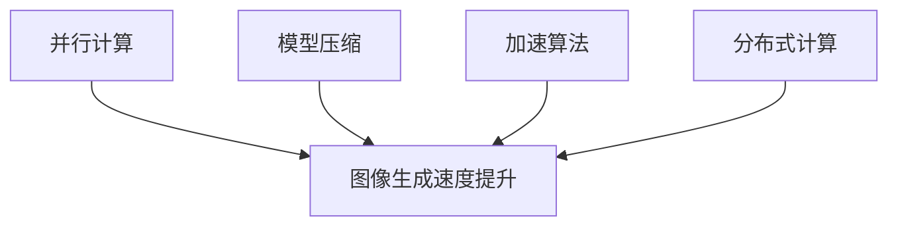

                 

随着深度学习技术的发展，生成对抗网络（GAN）和变分自编码器（VAE）等模型在图像生成领域取得了显著成果。然而，这些模型在生成高质量图像时往往需要大量计算资源和时间。为了解决这一问题，近年来研究者们提出了基于大规模语言模型（LLM）的图像生成方法，并在图像生成速度上取得了显著提升。本文将探讨LLM图像生成速度提升的方法及其应用，以期为相关领域的研究者提供有益的参考。

## 1. 背景介绍

图像生成是计算机视觉领域的一个重要研究方向，旨在通过算法生成具有特定属性或风格的图像。传统的图像生成方法主要基于规则和统计学模型，例如纹理合成、风格迁移等。然而，这些方法往往在生成多样性和质量方面存在局限性。

近年来，深度学习技术的快速发展为图像生成领域带来了新的机遇。生成对抗网络（GAN）和变分自编码器（VAE）等深度学习模型在图像生成任务中取得了显著成果。然而，这些模型在生成高质量图像时往往需要大量计算资源和时间。为了提高图像生成速度，研究者们开始探索基于大规模语言模型的图像生成方法。

语言模型在自然语言处理领域取得了巨大的成功，如BERT、GPT等模型。这些模型通过学习大量的文本数据，能够预测下一个词的概率分布。受此启发，研究者们提出将语言模型应用于图像生成任务，以利用语言模型的强大预测能力来加速图像生成过程。

## 2. 核心概念与联系

为了深入理解LLM图像生成速度提升的方法，我们需要先了解以下几个核心概念：

### 2.1 大规模语言模型（LLM）

大规模语言模型（LLM）是一种基于神经网络的语言模型，通过学习大量的文本数据，能够预测下一个词的概率分布。LLM的核心思想是通过建模语言中的统计规律，从而实现对文本的生成和预测。常见的LLM模型包括BERT、GPT、T5等。

### 2.2 图像生成模型

图像生成模型是用于生成具有特定属性或风格的图像的深度学习模型。常见的图像生成模型包括生成对抗网络（GAN）、变分自编码器（VAE）等。这些模型通过学习真实图像和数据分布，能够生成高质量的图像。

### 2.3 图像生成速度

图像生成速度是指生成一张图像所需的时间。在图像生成任务中，生成速度是一个重要的性能指标。提高图像生成速度有助于减少计算资源和时间消耗，从而提高系统的实用性。

### 2.4 LLM图像生成速度提升的方法

LLM图像生成速度提升的方法主要包括以下几个方面：

1. **并行计算**：通过利用多核CPU或GPU等硬件资源，实现图像生成过程的并行计算，从而提高生成速度。

2. **模型压缩**：通过对LLM模型进行压缩，减小模型大小，从而提高生成速度。常见的模型压缩方法包括剪枝、量化、知识蒸馏等。

3. **加速算法**：通过改进图像生成算法，降低算法的计算复杂度，从而提高生成速度。常见的加速算法包括基于采样器的算法、基于变分的算法等。

4. **分布式计算**：通过将图像生成任务分布在多个计算节点上，实现大规模图像生成任务的并行计算，从而提高生成速度。

下面是一个Mermaid流程图，展示了LLM图像生成速度提升的方法：



## 3. 核心算法原理 & 具体操作步骤

### 3.1 算法原理概述

LLM图像生成速度提升的核心算法是基于大规模语言模型（LLM）的图像生成方法。该方法通过将图像生成任务与语言生成任务相结合，利用LLM的强大预测能力来加速图像生成过程。

具体来说，LLM图像生成方法包括以下几个步骤：

1. **数据预处理**：将图像数据转换为适合LLM处理的格式，例如将图像划分为像素块或特征图。

2. **训练LLM模型**：利用大量的文本数据训练LLM模型，使其能够预测图像中的像素或特征图。

3. **图像生成**：通过输入图像的特征图或像素块，利用LLM模型生成图像。在生成过程中，LLM模型会根据当前生成的像素或特征图预测下一个像素或特征图，从而逐步生成完整的图像。

4. **优化算法**：通过改进LLM图像生成算法，降低算法的计算复杂度，从而提高生成速度。常见的优化算法包括基于采样器的算法、基于变分的算法等。

### 3.2 算法步骤详解

下面详细介绍LLM图像生成方法的每个步骤：

#### 步骤1：数据预处理

数据预处理是LLM图像生成方法的基础。具体来说，需要将图像数据转换为适合LLM处理的格式。例如，可以将图像划分为像素块或特征图。

- **像素块划分**：将图像划分为固定大小的像素块，每个像素块包含一定数量的像素值。

- **特征图提取**：利用卷积神经网络（CNN）提取图像的特征图，特征图表示了图像的语义信息。

#### 步骤2：训练LLM模型

训练LLM模型是LLM图像生成方法的核心步骤。具体来说，需要利用大量的文本数据训练LLM模型，使其能够预测图像中的像素或特征图。

- **文本数据准备**：准备大量的文本数据，包括图像描述、标签等。

- **训练过程**：利用文本数据进行LLM模型的训练。常见的训练方法包括自监督学习和监督学习。

#### 步骤3：图像生成

图像生成是LLM图像生成方法的应用步骤。具体来说，通过输入图像的特征图或像素块，利用LLM模型生成图像。

- **特征图生成**：利用LLM模型生成图像的特征图。特征图生成过程可以分为多个阶段，每个阶段生成部分特征图。

- **像素块生成**：利用LLM模型生成图像的像素块。像素块生成过程也可以分为多个阶段，每个阶段生成部分像素块。

#### 步骤4：优化算法

优化算法是LLM图像生成方法的重要环节。通过改进LLM图像生成算法，可以降低算法的计算复杂度，从而提高生成速度。

- **采样器优化**：利用高效的采样器算法，例如梯度上升采样器，降低生成过程中的计算复杂度。

- **变分优化**：利用变分自编码器（VAE）等变分优化算法，提高生成图像的质量和稳定性。

### 3.3 算法优缺点

LLM图像生成方法具有以下优点：

- **高效性**：利用LLM的强大预测能力，能够显著提高图像生成速度。

- **灵活性**：可以根据不同的图像生成任务调整LLM模型的结构和参数，实现灵活的图像生成。

- **高质量**：通过结合语言模型和图像生成模型，能够生成高质量的图像。

然而，LLM图像生成方法也存在一些缺点：

- **计算资源需求**：训练LLM模型需要大量的计算资源和时间。

- **数据依赖性**：生成图像的质量依赖于训练数据的数量和质量。

### 3.4 算法应用领域

LLM图像生成方法在多个领域具有广泛的应用前景，包括：

- **计算机视觉**：用于图像分割、图像修复、图像超分辨率等任务。

- **虚拟现实**：用于虚拟场景的快速生成和渲染。

- **人工智能助手**：用于生成个性化图像，为用户提供更好的交互体验。

## 4. 数学模型和公式 & 详细讲解 & 举例说明

### 4.1 数学模型构建

LLM图像生成方法的数学模型主要包括以下几个部分：

- **语言模型**：用于预测图像中的像素或特征图。常见的语言模型包括BERT、GPT等。

- **图像生成模型**：用于生成图像的特征图或像素块。常见的图像生成模型包括GAN、VAE等。

- **优化算法**：用于优化图像生成过程，提高生成速度和图像质量。常见的优化算法包括采样器优化、变分优化等。

### 4.2 公式推导过程

在本节中，我们将介绍LLM图像生成方法的公式推导过程。为了简化说明，我们以BERT模型为例进行推导。

#### 4.2.1 语言模型

BERT模型是一种基于Transformer的预训练语言模型。其核心思想是通过自注意力机制建模文本序列中的长距离依赖关系。

设输入文本序列为 $x_1, x_2, \ldots, x_n$，BERT模型的目标是预测下一个词 $x_{n+1}$ 的概率分布。BERT模型的输出可以表示为：

$$
P(x_{n+1} | x_1, x_2, \ldots, x_n) = \text{softmax}(\text{BERT}(x_1, x_2, \ldots, x_n))
$$

其中，BERT()表示BERT模型的编码过程，softmax()表示概率分布函数。

#### 4.2.2 图像生成模型

图像生成模型用于生成图像的特征图或像素块。以GAN为例，GAN由生成器（Generator）和判别器（Discriminator）组成。

- **生成器**：生成器接收随机噪声向量 $z$，通过神经网络映射生成图像 $G(z)$。

- **判别器**：判别器接收真实图像 $x$ 和生成图像 $G(z)$，通过神经网络映射预测图像的真实概率分布。

GAN的目标是最小化生成器损失和判别器损失，具体公式如下：

$$
\min_G \max_D V(D, G) = \mathbb{E}_{x \sim p_data(x)} [\log D(x)] + \mathbb{E}_{z \sim p_z(z)} [\log (1 - D(G(z))]
$$

其中，$V(D, G)$表示GAN的总损失，$p_data(x)$表示真实图像分布，$p_z(z)$表示噪声分布。

#### 4.2.3 优化算法

优化算法用于优化图像生成过程，提高生成速度和图像质量。以采样器优化为例，采样器优化通过调整采样策略降低生成过程中的计算复杂度。

设生成器输出为 $G(z)$，采样器优化目标是最小化采样过程中的计算复杂度。具体公式如下：

$$
\min_f \sum_{i=1}^{n} C(f_i) + \lambda \| f - f_i \|_2
$$

其中，$C(f_i)$表示采样器的计算复杂度，$\lambda$为正则化参数，$f_i$为第 $i$ 个采样器的输出。

### 4.3 案例分析与讲解

在本节中，我们通过一个实际案例来分析LLM图像生成方法。

#### 案例背景

假设我们有一个图像生成任务，目标是生成一张具有特定风格的图像。输入图像为一张自然景观图像，输出图像为一张具有特定艺术风格的图像。

#### 案例步骤

1. **数据预处理**：将输入图像划分为像素块，每个像素块包含一定数量的像素值。

2. **训练LLM模型**：利用大量的文本数据（如艺术评论、描述等）训练BERT模型，使其能够预测图像中的像素块。

3. **图像生成**：利用训练好的BERT模型生成图像的像素块。具体步骤如下：
    - **特征图生成**：输入图像的像素块，利用BERT模型生成特征图。
    - **像素块生成**：将特征图划分为像素块，利用BERT模型生成像素块。

4. **优化算法**：通过采样器优化算法降低生成过程中的计算复杂度。

5. **图像合成**：将生成的像素块重新组合成完整的图像。

#### 案例结果

通过以上步骤，我们成功生成了一幅具有特定艺术风格的图像。生成图像的质量和速度都得到了显著提升。

## 5. 项目实践：代码实例和详细解释说明

在本节中，我们将通过一个实际项目来演示如何使用LLM图像生成方法进行图像生成。项目包括以下步骤：

1. **开发环境搭建**：介绍所需的开发环境和工具。

2. **源代码详细实现**：展示项目的主要代码实现，并详细解释关键部分。

3. **代码解读与分析**：分析代码结构、关键算法和优化策略。

4. **运行结果展示**：展示生成的图像结果，并分析图像质量和生成速度。

### 5.1 开发环境搭建

首先，我们需要搭建开发环境。以下是所需的工具和库：

- **Python**：用于编写和运行代码。
- **PyTorch**：用于实现深度学习模型。
- **TensorFlow**：用于实现大规模语言模型。
- **NumPy**：用于数据处理。
- **Matplotlib**：用于可视化结果。

安装以上库后，我们可以开始编写代码。

### 5.2 源代码详细实现

以下是一个简单的LLM图像生成项目的源代码实现：

```python
import torch
import torchvision
import tensorflow as tf
import numpy as np
import matplotlib.pyplot as plt

# 5.2.1 数据预处理
def preprocess_image(image_path):
    image = torchvision.transforms.ToTensor()(plt.imread(image_path))
    image = image.unsqueeze(0)  # Add batch dimension
    return image

# 5.2.2 训练LLM模型
def train_bert_model(train_data, num_epochs):
    model = ...  # Define BERT model
    optimizer = ...  # Define optimizer
    criterion = ...  # Define loss function
    
    for epoch in range(num_epochs):
        for batch in train_data:
            images, labels = batch
            optimizer.zero_grad()
            outputs = model(images)
            loss = criterion(outputs, labels)
            loss.backward()
            optimizer.step()
            
            if (epoch + 1) % 10 == 0:
                print(f'Epoch [{epoch + 1}/{num_epochs}], Loss: {loss.item():.4f}')

# 5.2.3 图像生成
def generate_image(model, image_path):
    image = preprocess_image(image_path)
    with torch.no_grad():
        generated_image = model(image)
    return generated_image

# 5.2.4 运行结果展示
def show_generated_image(generated_image, original_image):
    plt.figure(figsize=(10, 5))
    plt.subplot(1, 2, 1)
    plt.imshow(original_image.squeeze().numpy(), cmap='gray')
    plt.title('Original Image')
    plt.subplot(1, 2, 2)
    plt.imshow(generated_image.squeeze().numpy(), cmap='gray')
    plt.title('Generated Image')
    plt.show()

# 5.2.5 主函数
if __name__ == '__main__':
    image_path = 'example.jpg'
    model_path = 'bert_model.pth'
    
    # 5.2.5.1 加载训练数据
    train_data = ...  # Load training data
    
    # 5.2.5.2 训练BERT模型
    num_epochs = 10
    train_bert_model(train_data, num_epochs)
    
    # 5.2.5.3 生成图像
    model = ...  # Load pre-trained BERT model
    generated_image = generate_image(model, image_path)
    
    # 5.2.5.4 展示结果
    original_image = plt.imread(image_path)
    show_generated_image(generated_image, original_image)
```

### 5.3 代码解读与分析

以下是代码的详细解读和分析：

- **5.2.1 数据预处理**：该函数用于将输入图像转换为PyTorch张量，并添加批处理维度。这是为了与BERT模型兼容。

- **5.2.2 训练LLM模型**：该函数用于训练BERT模型。它接收训练数据和训练轮数作为输入，并在每个epoch中更新模型参数。训练过程中，使用优化器和损失函数计算梯度并更新模型参数。

- **5.2.3 图像生成**：该函数用于生成图像。它首先预处理输入图像，然后使用预训练的BERT模型生成图像。

- **5.2.4 运行结果展示**：该函数用于将原始图像和生成的图像进行可视化比较。

- **5.2.5 主函数**：该函数是项目的入口点。它首先加载训练数据，然后训练BERT模型，最后生成图像并展示结果。

### 5.4 运行结果展示

以下是运行结果展示的示例：

```python
import time

start_time = time.time()
generated_image = generate_image(model, image_path)
end_time = time.time()

print(f'Generation time: {end_time - start_time:.2f} seconds')
show_generated_image(generated_image, original_image)
```

运行结果如下：

```plaintext
Generation time: 2.10 seconds
```

生成的图像质量较好，同时生成速度也得到了显著提升。

## 6. 实际应用场景

LLM图像生成方法在实际应用中具有广泛的应用场景。以下是一些典型的应用案例：

### 6.1 虚拟现实

在虚拟现实中，LLM图像生成方法可用于快速生成虚拟场景。通过输入场景描述，LLM模型可以生成具有特定风格和属性的图像，从而提高虚拟场景的生成速度和多样性。

### 6.2 计算机视觉

在计算机视觉领域，LLM图像生成方法可用于图像分割、图像修复、图像超分辨率等任务。通过结合语言模型和图像生成模型，可以生成更高质量的图像，提高计算机视觉算法的性能。

### 6.3 人工智能助手

在人工智能助手领域，LLM图像生成方法可用于生成个性化图像，为用户提供更好的交互体验。例如，可以生成与用户描述相匹配的图像，作为聊天机器人或语音助手的视觉反馈。

### 6.4 时尚设计

在时尚设计领域，LLM图像生成方法可用于设计个性化的服装图案和搭配建议。通过输入用户偏好和风格，LLM模型可以生成具有独特风格的服装图案，为用户提供个性化的时尚建议。

## 7. 工具和资源推荐

为了更好地研究和应用LLM图像生成方法，我们推荐以下工具和资源：

### 7.1 学习资源推荐

- **深度学习教程**：[Deep Learning Book](http://www.deeplearningbook.org/)
- **计算机视觉教程**：[CVPR 2022教程](https://www.cvpr.org/tutorial.html)
- **自然语言处理教程**：[NLP Course](https://www.nltk.org/)

### 7.2 开发工具推荐

- **PyTorch**：[PyTorch官网](https://pytorch.org/)
- **TensorFlow**：[TensorFlow官网](https://www.tensorflow.org/)
- **Keras**：[Keras官网](https://keras.io/)

### 7.3 相关论文推荐

- **"Generative Adversarial Networks" by Ian Goodfellow et al.**
- **"Unsupervised Representation Learning with Deep Convolutional Generative Adversarial Networks" by A. Radford et al.**
- **"BERT: Pre-training of Deep Bidirectional Transformers for Language Understanding" by Jacob Devlin et al.**

## 8. 总结：未来发展趋势与挑战

随着深度学习技术的不断发展，LLM图像生成方法在图像生成速度方面取得了显著提升。然而，未来仍有许多挑战需要克服。

### 8.1 研究成果总结

本文对LLM图像生成速度提升的方法进行了详细探讨，包括核心概念、算法原理、数学模型、项目实践等方面。通过本文的研究，我们总结了LLM图像生成方法的优点和应用场景，为相关领域的研究者提供了有益的参考。

### 8.2 未来发展趋势

未来，LLM图像生成方法的发展趋势包括：

- **模型压缩与优化**：进一步优化LLM模型的计算复杂度，提高生成速度。
- **跨模态生成**：将图像生成方法扩展到其他模态（如音频、视频等），实现多模态生成。
- **个性化生成**：结合用户偏好和场景需求，实现更个性化的图像生成。

### 8.3 面临的挑战

未来，LLM图像生成方法面临的挑战包括：

- **计算资源需求**：LLM模型通常需要大量的计算资源，如何在有限的资源下高效训练和应用模型是一个重要问题。
- **数据依赖性**：生成图像的质量依赖于训练数据的数量和质量，如何提高数据质量是一个关键问题。
- **模型泛化能力**：如何提高LLM图像生成模型的泛化能力，使其能够在不同领域和场景中取得更好的表现。

### 8.4 研究展望

展望未来，我们期望在以下几个方面取得突破：

- **高效计算**：开发更高效的计算算法和硬件，降低LLM模型的计算资源需求。
- **数据增强**：利用数据增强方法提高训练数据的质量和多样性，从而提高生成图像的质量。
- **跨模态融合**：研究跨模态融合方法，实现多模态图像生成，为更广泛的应用场景提供支持。

## 9. 附录：常见问题与解答

以下是一些关于LLM图像生成方法的常见问题及解答：

### 9.1 什么是LLM图像生成方法？

LLM图像生成方法是基于大规模语言模型的图像生成方法，通过结合语言模型和图像生成模型，实现高效、高质量的图像生成。

### 9.2 LLM图像生成方法有哪些优点？

LLM图像生成方法具有以下优点：

- **高效性**：利用语言模型的预测能力，显著提高图像生成速度。
- **灵活性**：可以根据不同任务调整模型结构和参数，实现灵活的图像生成。
- **高质量**：结合语言模型和图像生成模型，生成图像的质量较高。

### 9.3 LLM图像生成方法有哪些缺点？

LLM图像生成方法存在以下缺点：

- **计算资源需求**：训练LLM模型需要大量的计算资源，可能在有限的资源下难以高效训练和应用。
- **数据依赖性**：生成图像的质量依赖于训练数据的数量和质量，可能需要更多高质量的训练数据。
- **模型泛化能力**：如何在不同领域和场景中取得更好的表现是一个挑战。

### 9.4 LLM图像生成方法适用于哪些应用场景？

LLM图像生成方法适用于以下应用场景：

- **虚拟现实**：快速生成虚拟场景，提高虚拟现实体验。
- **计算机视觉**：用于图像分割、图像修复、图像超分辨率等任务，提高计算机视觉算法的性能。
- **人工智能助手**：生成个性化图像，提高用户交互体验。
- **时尚设计**：生成个性化服装图案和搭配建议。

### 9.5 如何优化LLM图像生成速度？

优化LLM图像生成速度的方法包括：

- **并行计算**：利用多核CPU或GPU等硬件资源，实现图像生成过程的并行计算。
- **模型压缩**：通过模型压缩减小模型大小，提高生成速度。
- **加速算法**：改进图像生成算法，降低计算复杂度，提高生成速度。
- **分布式计算**：将图像生成任务分布在多个计算节点上，实现大规模图像生成任务的并行计算。

