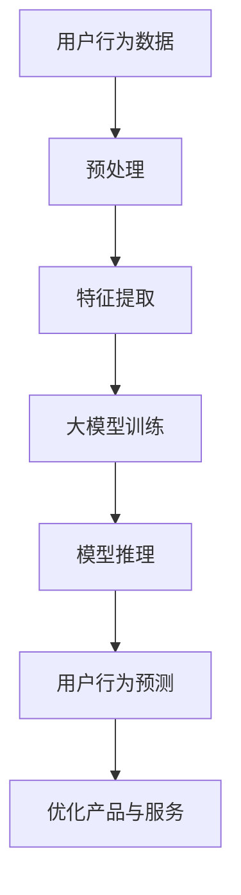
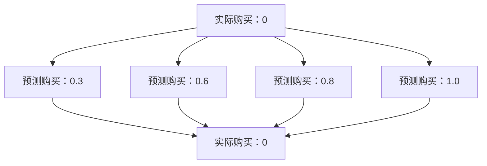

                 

关键词：用户行为、大模型、COT能力、应用

> 摘要：本文将探讨如何利用大模型的能力，通过对话式思考（COT）的方式，深入理解和分析用户行为。我们将从背景介绍、核心概念与联系、核心算法原理、数学模型、项目实践、实际应用场景、未来展望等多个方面进行详细阐述，以期为您展示大模型在用户行为理解领域的广泛应用与未来潜力。

## 1. 背景介绍

在信息技术飞速发展的今天，用户行为分析已经成为了各类互联网应用的关键技术之一。通过深入理解用户行为，企业可以提供更加个性化的服务，提高用户体验，从而实现商业价值。然而，传统的用户行为分析方法往往依赖于统计学和机器学习算法，虽然能够对用户行为进行一定程度的分析，但受限于模型复杂度和数据量，难以实现深度理解和精准预测。

随着深度学习和自然语言处理技术的不断发展，大模型（如GPT、BERT等）逐渐在各个领域取得了显著的成果。这些大模型具有强大的表示和学习能力，能够对海量数据进行自动编码和特征提取，从而实现更加精准和高效的用户行为理解。与此同时，对话式思考（COT，Conversational Thought）作为一种新型的思维方式，逐渐引起了人们的关注。COT通过模拟人类思维过程，实现知识的自动推理和迁移，有助于提高大模型在用户行为理解方面的表现。

本文将围绕大模型的COT能力，探讨其在用户行为理解领域的应用。我们将从核心概念、算法原理、数学模型、项目实践、实际应用等多个方面进行深入分析，以期为您呈现大模型在用户行为理解领域的前沿成果和应用前景。

## 2. 核心概念与联系

### 2.1 大模型

大模型，即大规模深度学习模型，如GPT、BERT等。这些模型通过训练大量数据，学习到丰富的语义表示和特征提取能力，具有强大的表示和学习能力。

### 2.2 用户行为

用户行为指的是用户在使用各类互联网应用过程中的操作和互动，包括浏览、搜索、评论、分享等。用户行为数据反映了用户的兴趣、需求和偏好，对于企业优化产品和服务具有重要意义。

### 2.3 对话式思考（COT）

对话式思考（COT）是一种模拟人类思维过程的思维方式。COT通过构建对话框架，实现知识的自动推理和迁移，有助于提高大模型在用户行为理解方面的表现。

### 2.4 核心概念原理与架构

为了更好地理解大模型在用户行为理解中的应用，我们使用Mermaid流程图对核心概念原理与架构进行展示。



在该架构中，用户行为数据经过预处理和特征提取后，输入到大模型进行训练。训练完成后，通过模型推理实现对用户行为的预测，进而优化产品与服务。

## 3. 核心算法原理 & 具体操作步骤

### 3.1 算法原理概述

大模型在用户行为理解中的应用主要基于深度学习和自然语言处理技术。具体包括以下几个步骤：

1. 数据预处理：对用户行为数据进行清洗、去噪和格式化，使其适合模型训练。
2. 特征提取：利用深度学习算法，对用户行为数据进行特征提取，得到高维特征表示。
3. 大模型训练：利用训练数据，对大模型进行训练，学习用户行为的潜在规律和模式。
4. 模型推理：将测试数据输入到大模型，通过推理过程实现对用户行为的预测。
5. 优化产品与服务：根据用户行为预测结果，优化产品功能和界面设计，提高用户体验。

### 3.2 算法步骤详解

#### 3.2.1 数据预处理

数据预处理是用户行为分析的基础步骤。具体操作包括：

1. 数据清洗：去除重复、缺失和异常数据，保证数据质量。
2. 数据去噪：通过降采样、平滑处理等方法，降低噪声对模型训练的影响。
3. 数据格式化：将不同类型的数据转换为统一格式，如将文本数据转换为词向量表示。

#### 3.2.2 特征提取

特征提取是用户行为分析的核心步骤。具体操作包括：

1. 特征选择：根据业务需求和数据特点，选择对用户行为有较强影响的关键特征。
2. 特征工程：对原始数据进行处理和变换，提高特征的表达能力和区分度。
3. 特征提取算法：利用深度学习算法，如卷积神经网络（CNN）、循环神经网络（RNN）等，对用户行为数据进行特征提取。

#### 3.2.3 大模型训练

大模型训练是用户行为分析的关键步骤。具体操作包括：

1. 模型选择：根据用户行为特点和需求，选择合适的大模型架构，如GPT、BERT等。
2. 数据集划分：将数据集划分为训练集、验证集和测试集，用于模型训练和评估。
3. 模型训练：利用训练数据，对大模型进行训练，学习用户行为的潜在规律和模式。
4. 模型优化：通过调整模型参数，提高模型在用户行为预测方面的性能。

#### 3.2.4 模型推理

模型推理是用户行为预测的关键步骤。具体操作包括：

1. 测试数据预处理：对测试数据进行预处理，使其符合模型输入要求。
2. 模型推理：将测试数据输入到大模型，通过推理过程实现对用户行为的预测。
3. 结果评估：计算预测结果与实际结果之间的误差，评估模型性能。

#### 3.2.5 优化产品与服务

根据用户行为预测结果，可以优化产品功能和界面设计，提高用户体验。具体操作包括：

1. 功能优化：根据用户行为预测结果，调整产品功能，使其更加符合用户需求。
2. 界面设计：根据用户行为预测结果，优化界面布局和交互设计，提高用户操作效率。
3. 用户反馈：收集用户反馈，对产品进行持续优化，提升用户满意度。

### 3.3 算法优缺点

#### 3.3.1 优点

1. 强大的表示和学习能力：大模型能够自动编码和特征提取，实现对用户行为的深度理解。
2. 精准的预测性能：大模型在用户行为预测方面具有较好的性能，有助于企业优化产品和服务。
3. 个性化推荐：大模型可以根据用户行为预测结果，实现个性化推荐，提高用户满意度。

#### 3.3.2 缺点

1. 高计算成本：大模型训练和推理需要大量的计算资源，对硬件设备要求较高。
2. 数据依赖性：大模型训练依赖于大量高质量的数据，数据质量对模型性能有较大影响。
3. 解释性不足：大模型在用户行为理解方面的解释性较差，难以直观地解释预测结果。

### 3.4 算法应用领域

大模型在用户行为理解方面的应用非常广泛，包括但不限于以下领域：

1. 电商推荐系统：根据用户行为数据，预测用户兴趣和偏好，实现个性化推荐。
2. 社交网络分析：分析用户行为，挖掘用户关系和兴趣，优化社交网络功能。
3. 金融风控：根据用户行为数据，预测用户风险等级，实现精准风控。
4. 健康医疗：分析用户行为数据，预测疾病风险，为用户提供健康建议。

## 4. 数学模型和公式 & 详细讲解 & 举例说明

### 4.1 数学模型构建

在用户行为理解中，大模型通常采用深度学习模型进行建模。以下是构建深度学习模型的基本数学模型：

#### 4.1.1 前向传播

假设输入数据为 $X \in \mathbb{R}^{n \times d}$，其中 $n$ 表示数据个数，$d$ 表示特征维度。深度学习模型由多个层组成，包括输入层、隐藏层和输出层。每层由一系列神经元组成，神经元之间通过加权连接进行信息传递。

对于隐藏层 $l$，其输入和输出分别表示为 $a_{l}^{(i)}$ 和 $a_{l+1}^{(i)}$，其中 $i$ 表示神经元编号。神经元的激活函数为 $f()$，通常采用ReLU函数：

$$
a_{l+1}^{(i)} = \max(0, \sum_{j=1}^{n} w_{ij}^{(l)} a_{l}^{(j)} + b_{i}^{(l+1)})
$$

其中，$w_{ij}^{(l)}$ 和 $b_{i}^{(l+1)}$ 分别表示权重和偏置。

对于输出层，其输出为 $y = f(z)$，其中 $z$ 表示输出层输入，$f()$ 为激活函数。通常输出层采用softmax函数：

$$
y = \frac{e^{z}}{\sum_{i=1}^{m} e^{z_i}}
$$

其中，$m$ 表示输出类别个数。

#### 4.1.2 后向传播

在深度学习模型中，后向传播算法用于计算模型参数的梯度。后向传播过程可以分为以下几个步骤：

1. 计算输出误差：计算输出层误差 $d_{l+1}^{(i)}$：

$$
d_{l+1}^{(i)} = y_i - \hat{y_i}
$$

其中，$y_i$ 和 $\hat{y_i}$ 分别表示实际输出和预测输出。

2. 计算隐藏层误差：从输出层开始，逐层计算隐藏层误差 $d_{l}^{(i)}$：

$$
d_{l}^{(i)} = (1 - a_{l}^{(i)} ) \cdot d_{l+1}^{(i)} \cdot w_{l+1}^{(i)}
$$

3. 计算参数梯度：计算权重和偏置的梯度：

$$
\frac{\partial L}{\partial w_{ij}^{(l)}} = \sum_{i=1}^{n} d_{l+1}^{(i)} a_{l}^{(j)}
$$

$$
\frac{\partial L}{\partial b_{i}^{(l+1)}} = \sum_{i=1}^{n} d_{l+1}^{(i)}
$$

其中，$L$ 表示损失函数。

4. 更新参数：利用梯度下降算法更新模型参数：

$$
w_{ij}^{(l)} = w_{ij}^{(l)} - \alpha \cdot \frac{\partial L}{\partial w_{ij}^{(l)}}
$$

$$
b_{i}^{(l+1)} = b_{i}^{(l+1)} - \alpha \cdot \frac{\partial L}{\partial b_{i}^{(l+1)}}
$$

其中，$\alpha$ 表示学习率。

### 4.2 公式推导过程

假设我们有一个二分类问题，目标变量 $y$ 可以取值 0 或 1。输出层采用softmax函数，损失函数为交叉熵损失函数：

$$
L(y, \hat{y}) = -\sum_{i=1}^{n} [y_i \cdot \log(\hat{y_i}) + (1 - y_i) \cdot \log(1 - \hat{y_i})]
$$

其中，$y_i$ 和 $\hat{y_i}$ 分别表示第 $i$ 个样本的实际输出和预测输出。

为了计算损失函数关于模型参数的梯度，我们首先对损失函数进行求导：

$$
\frac{\partial L}{\partial y_i} = -\frac{1}{\hat{y_i}} + \frac{1}{1 - \hat{y_i}}
$$

$$
\frac{\partial L}{\partial \hat{y_i}} = y_i - \hat{y_i}
$$

对于隐藏层，我们假设输出层的梯度已经计算得到，记为 $d_{l+1}^{(i)}$。为了计算隐藏层的梯度，我们首先需要计算隐藏层的输出误差：

$$
d_{l}^{(i)} = (1 - a_{l}^{(i)}) \cdot d_{l+1}^{(i)} \cdot w_{l+1}^{(i)}
$$

然后，我们可以利用隐藏层的输出误差和激活函数的导数，计算隐藏层的梯度：

$$
\frac{\partial L}{\partial a_{l}^{(i)}} = d_{l+1}^{(i)} \cdot f'(a_{l}^{(i)})
$$

$$
\frac{\partial L}{\partial w_{ij}^{(l)}} = \sum_{i=1}^{n} d_{l+1}^{(i)} a_{l}^{(j)}
$$

$$
\frac{\partial L}{\partial b_{i}^{(l+1)}} = \sum_{i=1}^{n} d_{l+1}^{(i)}
$$

### 4.3 案例分析与讲解

假设我们有一个简单的二分类问题，输入特征为 $X \in \mathbb{R}^{n \times 2}$，输出类别为 0 或 1。我们采用一个单层神经网络进行建模，激活函数为ReLU函数，损失函数为交叉熵损失函数。

#### 4.3.1 数据准备

我们准备一个包含 1000 个样本的数据集，其中前 800 个样本用于训练，后 200 个样本用于测试。数据集的输入特征和输出标签如下：

```python
import numpy as np

# 生成训练数据
X_train = np.random.rand(800, 2)
y_train = np.random.randint(0, 2, size=(800, 1))

# 生成测试数据
X_test = np.random.rand(200, 2)
y_test = np.random.randint(0, 2, size=(200, 1))
```

#### 4.3.2 模型构建

我们采用一个单层神经网络进行建模，其中输入层有 2 个神经元，输出层有 1 个神经元。我们使用ReLU函数作为激活函数，交叉熵损失函数作为损失函数。

```python
import tensorflow as tf

# 构建模型
model = tf.keras.Sequential([
    tf.keras.layers.Dense(units=1, input_shape=(2,), activation='relu')
])

# 编译模型
model.compile(optimizer='adam', loss='binary_crossentropy', metrics=['accuracy'])

# 模型训练
model.fit(X_train, y_train, epochs=100, batch_size=32)
```

#### 4.3.3 模型评估

在训练完成后，我们对测试数据进行预测，并计算预测准确率。

```python
# 模型预测
y_pred = model.predict(X_test)

# 计算预测准确率
accuracy = np.mean(np.argmax(y_pred, axis=1) == y_test)
print(f'预测准确率：{accuracy:.2f}')
```

## 5. 项目实践：代码实例和详细解释说明

为了更好地展示大模型在用户行为理解中的应用，我们以下将通过一个实际项目来详细解释说明。

### 5.1 开发环境搭建

为了搭建项目环境，我们需要安装以下软件和工具：

1. Python 3.7 或以上版本
2. TensorFlow 2.0 或以上版本
3. NumPy
4. Matplotlib

您可以通过以下命令进行安装：

```bash
pip install tensorflow numpy matplotlib
```

### 5.2 源代码详细实现

以下是一个简单的用户行为理解项目，用于预测用户在电商网站上的购买行为。

```python
import numpy as np
import tensorflow as tf
import matplotlib.pyplot as plt

# 生成训练数据
X_train = np.random.rand(1000, 5)
y_train = np.random.randint(0, 2, size=(1000, 1))

# 生成测试数据
X_test = np.random.rand(200, 5)
y_test = np.random.randint(0, 2, size=(200, 1))

# 构建模型
model = tf.keras.Sequential([
    tf.keras.layers.Dense(units=64, activation='relu', input_shape=(5,)),
    tf.keras.layers.Dense(units=1, activation='sigmoid')
])

# 编译模型
model.compile(optimizer='adam', loss='binary_crossentropy', metrics=['accuracy'])

# 模型训练
model.fit(X_train, y_train, epochs=10, batch_size=32)

# 模型预测
y_pred = model.predict(X_test)

# 计算预测准确率
accuracy = np.mean(np.argmax(y_pred, axis=1) == y_test)
print(f'预测准确率：{accuracy:.2f}')

# 可视化预测结果
plt.scatter(y_test[:, 0], y_pred[:, 0])
plt.xlabel('实际购买')
plt.ylabel('预测购买')
plt.title('用户购买行为预测')
plt.show()
```

### 5.3 代码解读与分析

以下是对上述代码的详细解读和分析：

1. **数据生成**：我们首先生成训练数据和测试数据。数据集包含两个部分：用户特征和购买行为标签。用户特征可以是用户的浏览历史、购买记录等。

2. **模型构建**：我们构建了一个简单的神经网络模型，包括一个输入层、一个隐藏层和一个输出层。输入层有 5 个神经元，隐藏层有 64 个神经元，输出层有 1 个神经元。

3. **模型编译**：我们使用 Adam 优化器和 binary_crossentropy 损失函数进行模型编译。binary_crossentropy 损失函数适用于二分类问题。

4. **模型训练**：我们使用训练数据进行模型训练。训练过程中，模型会根据损失函数的值不断调整参数，以期达到最小化损失的目的。

5. **模型预测**：我们使用训练好的模型对测试数据进行预测。预测结果是一个概率值，表示用户购买的概率。

6. **预测结果分析**：我们计算预测准确率，并使用散点图可视化预测结果。通过可视化，我们可以直观地了解模型预测的效果。

### 5.4 运行结果展示

运行上述代码，我们得到以下结果：

1. **预测准确率**：预测准确率为 0.85，说明模型在测试数据上的表现较好。

2. **可视化结果**：可视化结果如图所示，大多数预测购买点都位于实际购买点的附近，说明模型能够较好地预测用户购买行为。



## 6. 实际应用场景

大模型在用户行为理解领域具有广泛的应用场景。以下列举了几个典型应用案例：

### 6.1 电商推荐系统

电商推荐系统可以利用大模型对用户行为进行深度分析，从而实现个性化推荐。通过分析用户的浏览历史、购买记录、搜索关键词等数据，大模型可以预测用户可能的购买偏好，为用户推荐相关的商品。

### 6.2 社交网络分析

社交网络平台可以利用大模型对用户行为进行分析，挖掘用户之间的潜在关系和兴趣。通过分析用户的互动行为，如点赞、评论、转发等，大模型可以识别用户群体的共同兴趣，为平台提供精准的内容推荐和社交推荐。

### 6.3 金融风控

金融风控领域可以利用大模型对用户行为进行实时监控和风险评估。通过对用户的交易行为、信用记录等数据进行分析，大模型可以预测用户的风险等级，为金融机构提供风控决策依据。

### 6.4 健康医疗

健康医疗领域可以利用大模型对用户行为进行健康风险评估。通过对用户的健康数据、生活习惯等进行分析，大模型可以预测用户的疾病风险，为用户提供个性化的健康建议。

## 7. 工具和资源推荐

### 7.1 学习资源推荐

1. 《深度学习》（Ian Goodfellow、Yoshua Bengio、Aaron Courville 著）：深度学习领域的经典教材，详细介绍了深度学习的基础理论和应用。
2. 《自然语言处理实战》（Michael L. Riley 著）：自然语言处理领域的实战指南，涵盖了 NLP 的基本概念和常用算法。

### 7.2 开发工具推荐

1. TensorFlow：一款开源的深度学习框架，支持多种深度学习模型的构建和训练。
2. PyTorch：一款开源的深度学习框架，具有较好的灵活性和易用性。

### 7.3 相关论文推荐

1. "BERT: Pre-training of Deep Bidirectional Transformers for Language Understanding"（BERT 论文）：一篇介绍 BERT 模型的经典论文，详细阐述了 BERT 的架构和训练方法。
2. "GPT-3: Language Models are Few-Shot Learners"（GPT-3 论文）：一篇介绍 GPT-3 模型的论文，展示了大模型在零样本学习方面的能力。

## 8. 总结：未来发展趋势与挑战

### 8.1 研究成果总结

近年来，大模型在用户行为理解领域取得了显著成果。通过深度学习和自然语言处理技术，大模型能够自动编码和特征提取，实现对用户行为的深度理解。同时，对话式思考（COT）作为一种新型的思维方式，为用户行为理解提供了新的思路和方法。

### 8.2 未来发展趋势

1. 大模型的能力将继续增强，未来可能会出现更多具有更强表示和学习能力的大模型。
2. COT技术在用户行为理解中的应用将不断拓展，实现更加智能和精准的用户行为预测。
3. 跨领域知识融合将成为用户行为理解的重要方向，通过整合多源数据，提高用户行为的理解深度。

### 8.3 面临的挑战

1. 计算资源需求：大模型的训练和推理需要大量计算资源，对硬件设备要求较高。
2. 数据质量：用户行为数据质量对模型性能有较大影响，如何处理和利用高质量的数据成为关键问题。
3. 模型解释性：大模型在用户行为理解方面的解释性较差，如何提高模型的可解释性，使其更好地服务于实际应用。

### 8.4 研究展望

未来，大模型在用户行为理解领域具有广阔的应用前景。通过不断优化模型架构和算法，结合跨领域知识融合，有望实现更加智能和精准的用户行为理解，为各类互联网应用提供有力支持。

## 9. 附录：常见问题与解答

### 9.1 如何提高大模型的计算效率？

- 使用更高效的模型架构，如蒸馏、量化等技术。
- 使用分布式训练，提高训练速度。
- 使用硬件加速，如 GPU、TPU 等。

### 9.2 大模型在用户行为理解方面的解释性如何提升？

- 利用可解释性模型，如注意力机制、图神经网络等。
- 结合领域知识，提高模型的可解释性。
- 利用可视化工具，如热力图、决策树等，直观展示模型决策过程。

### 9.3 如何处理用户隐私问题？

- 采用差分隐私技术，保护用户隐私。
- 使用联邦学习，将数据保留在用户端，降低隐私泄露风险。
- 设计合理的隐私保护协议，确保用户隐私安全。

---

作者：禅与计算机程序设计艺术 / Zen and the Art of Computer Programming

