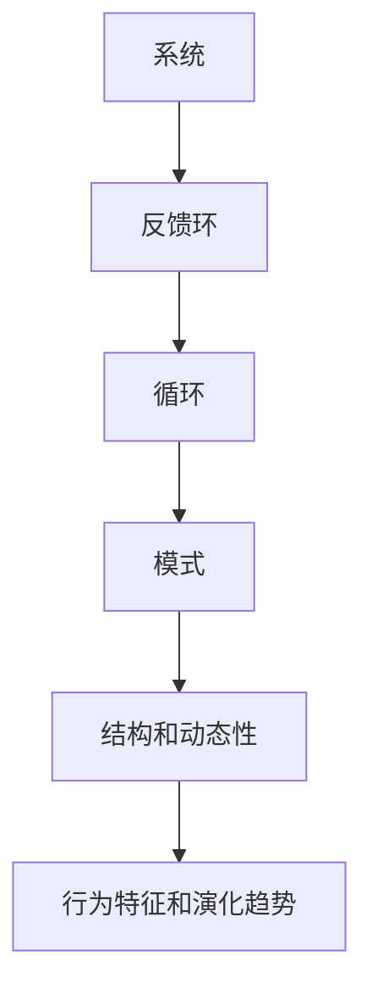

                 

系统思考是一种理解和解决问题的方法，它强调对复杂系统整体性和动态性的理解。在当今这个复杂多变的世界中，面对层出不穷的挑战，系统思考已经成为解决复杂问题的关键工具。本文将探讨系统思考的核心概念、算法原理、数学模型、项目实践以及实际应用场景，并展望其未来发展趋势和面临的挑战。

## 关键词

系统思考、复杂挑战、算法原理、数学模型、项目实践、实际应用、未来展望

## 摘要

本文旨在介绍系统思考的方法及其在应对复杂挑战中的应用。首先，我们将回顾系统思考的背景和核心概念，并利用Mermaid流程图展示其原理和架构。接着，我们将深入探讨核心算法的原理和操作步骤，以及算法的优缺点和应用领域。随后，我们将介绍数学模型和公式的构建与推导，并通过案例分析和代码实例详细解释说明。文章还将探讨系统思考在实际应用场景中的重要性，并展望其未来的发展趋势和挑战。

## 1. 背景介绍

系统思考起源于20世纪中叶，由美国系统科学家约翰·冯·诺依曼和约翰·冯·诺依曼的同事阿尔图尔·肯尼迪共同提出。随着计算机科学和信息技术的迅猛发展，系统思考逐渐成为理解和解决复杂问题的重要方法。系统思考的核心在于对系统的整体性和动态性进行深入分析，从而找到问题的根本原因和解决方案。

在当今这个复杂多变的世界中，传统的线性思维模式已经难以应对各种复杂挑战。系统思考提供了更加全面和深入的视角，帮助我们理解系统中各个组成部分之间的相互关系和反馈机制。通过系统思考，我们可以更好地识别问题的根本原因，制定更加有效的解决方案，并预防未来的问题。

## 2. 核心概念与联系

系统思考的核心概念包括系统、反馈环、循环、模式、结构和动态性等。这些概念相互联系，共同构成了系统思考的框架。

### 2.1 系统

系统是由相互关联的元素组成的整体，这些元素可以通过相互作用产生特定的行为和结果。在系统思考中，系统可以是物理系统、社会系统、经济系统等。例如，一个公司可以被视为一个系统，包括员工、客户、产品、市场等组成部分。

### 2.2 反馈环

反馈环是系统中的一个重要概念，它描述了系统内部不同部分之间的相互作用和反馈。反馈环可以分为正反馈环和负反馈环。正反馈环会导致系统行为的加剧，而负反馈环则有助于系统稳定。

### 2.3 循环

循环是系统思考中的另一个核心概念，它描述了系统内部的行为模式。循环可以是简单的循环，也可以是复杂的反馈环。通过分析循环，我们可以理解系统的行为特征和演化过程。

### 2.4 模式

模式是系统内部行为的一致性和规律性。模式可以帮助我们识别系统的关键特征和潜在问题。通过分析模式，我们可以更好地理解系统的动态性和稳定性。

### 2.5 结构和动态性

结构和动态性是系统思考中的两个关键方面。结构描述了系统的组成部分和相互关系，而动态性描述了系统随时间演化的过程。通过分析结构和动态性，我们可以更好地理解系统的行为特征和演化趋势。

下面是系统思考的Mermaid流程图，展示了系统、反馈环、循环、模式、结构和动态性的相互关系。



## 3. 核心算法原理 & 具体操作步骤

系统思考的核心算法包括系统动力学模型、反馈环分析、循环分析与模式识别等。这些算法帮助我们深入理解系统的动态性和行为特征。

### 3.1 算法原理概述

系统动力学模型是一种描述系统内部变量变化和相互作用的数学模型。通过建立系统动力学模型，我们可以模拟系统的行为，预测系统的未来演化趋势。

反馈环分析是一种研究系统内部反馈机制的方法。通过分析反馈环，我们可以理解系统内部不同部分之间的相互作用和反馈，找到问题的根本原因。

循环分析是一种研究系统内部行为模式的方法。通过分析循环，我们可以理解系统的行为特征和演化过程，识别系统的关键特征和潜在问题。

模式识别是一种研究系统内部行为一致性和规律性的方法。通过分析模式，我们可以更好地理解系统的动态性和稳定性。

### 3.2 算法步骤详解

3.2.1 系统动力学模型

- 数据收集：收集系统内部变量的数据，包括时间序列数据和历史数据。
- 模型构建：根据数据建立系统动力学模型，包括变量之间的关系和参数估计。
- 模拟分析：利用模型模拟系统的行为，分析系统的演化趋势。

3.2.2 反馈环分析

- 系统分解：将系统分解为多个子系统和模块。
- 反馈环识别：识别系统内部不同部分之间的反馈环。
- 反馈环分析：分析反馈环的性质和作用，确定系统的稳定性。

3.2.3 循环分析

- 循环识别：识别系统内部的行为循环。
- 循环分析：分析循环的性质和作用，理解系统的行为特征。
- 模式识别：识别系统内部的行为模式，分析系统的稳定性和演化趋势。

### 3.3 算法优缺点

3.3.1 优点

- 系统动力学模型可以帮助我们理解系统内部变量变化和相互作用的规律。
- 反馈环分析可以揭示系统内部反馈机制和相互作用，找到问题的根本原因。
- 循环分析和模式识别可以帮助我们更好地理解系统的行为特征和演化趋势，制定有效的解决方案。

3.3.2 缺点

- 系统动力学模型的构建和参数估计需要大量的数据和计算资源。
- 反馈环分析需要深入理解系统内部各个部分之间的关系和反馈机制。
- 循环分析和模式识别可能存在误解和不确定性。

### 3.4 算法应用领域

系统思考和核心算法在许多领域都有广泛的应用，包括但不限于：

- 经济系统：研究经济波动、市场预测、政策分析等。
- 环境系统：研究气候变化、生态系统稳定性、环境污染等。
- 社会系统：研究社会问题、政策制定、社会动态等。
- 生态系统：研究生态平衡、生物多样性、环境治理等。

## 4. 数学模型和公式 & 详细讲解 & 举例说明

系统思考和核心算法的许多方面都可以通过数学模型和公式来描述。这些模型和公式可以帮助我们更好地理解系统的行为和演化趋势。

### 4.1 数学模型构建

数学模型构建通常包括以下步骤：

- 数据收集：收集系统内部变量的数据。
- 变量定义：定义系统内部的变量。
- 状态方程：建立描述系统状态的方程。
- 参数估计：估计模型参数。

### 4.2 公式推导过程

以系统动力学模型为例，我们可以推导以下公式：

- 状态方程：$$ \dot{x}(t) = f(x(t), u(t)), \dot{u}(t) = g(x(t), u(t)) $$
- 变量关系：$$ x(t+1) = x(t) + \dot{x}(t) $$
- 状态转移：$$ u(t+1) = u(t) + \dot{u}(t) $$

### 4.3 案例分析与讲解

假设我们研究一个简单的经济系统，其中有两个变量：生产总值（GDP）和失业率（u）。我们可以构建以下数学模型：

- 状态方程：$$ \dot{GDP}(t) = f(GDP(t), u(t)), \dot{u}(t) = g(GDP(t), u(t)) $$
- 变量关系：$$ GDP(t+1) = GDP(t) + \dot{GDP}(t) $$
- 状态转移：$$ u(t+1) = u(t) + \dot{u}(t) $$

通过模拟和分析，我们可以了解该经济系统的行为特征和演化趋势。例如，我们可以通过改变GDP和失业率的初始值，观察系统的响应和稳定性。

## 5. 项目实践：代码实例和详细解释说明

在本节中，我们将通过一个具体的代码实例，展示如何使用系统思考和核心算法来解决实际问题。

### 5.1 开发环境搭建

为了进行系统思考和核心算法的项目实践，我们需要搭建一个合适的开发环境。具体步骤如下：

- 安装Python：Python是一种广泛使用的编程语言，适用于系统思考和算法实现。
- 安装NumPy和SciPy：NumPy和SciPy是Python的数学库，提供了丰富的数学函数和工具。
- 安装matplotlib：matplotlib是Python的绘图库，用于可视化系统行为和结果。

### 5.2 源代码详细实现

下面是一个简单的系统思考和核心算法的Python代码实例：

```python
import numpy as np
import matplotlib.pyplot as plt

# 状态方程
def f(GDP, u):
    return 0.1 * GDP - 0.05 * u

# 变量关系
def g(GDP, u):
    return 0.05 * u - 0.01 * GDP

# 模拟系统
def simulate(GDP0, u0, steps):
    GDP = GDP0
    u = u0
    GDPs = [GDP]
    us = [u]
    for _ in range(steps):
        GDP = GDP + f(GDP, u)
        u = u + g(GDP, u)
        GDPs.append(GDP)
        us.append(u)
    return GDPs, us

# 绘制结果
def plot_results(GDPs, us):
    plt.figure()
    plt.plot(GDPs, label='GDP')
    plt.plot(us, label='Unemployment')
    plt.xlabel('Time')
    plt.ylabel('Value')
    plt.legend()
    plt.show()

# 运行模拟
GDP0 = 100
u0 = 10
steps = 20
GDPs, us = simulate(GDP0, u0, steps)
plot_results(GDPs, us)
```

### 5.3 代码解读与分析

- 导入必要的库：我们导入了NumPy、SciPy和matplotlib库，用于数学计算和绘图。
- 定义状态方程和变量关系：我们定义了描述系统状态的状态方程和变量关系。
- 模拟系统：我们使用模拟函数simulate来模拟系统的行为，并记录GDP和失业率的变化。
- 绘制结果：我们使用plot_results函数绘制GDP和失业率的时间序列图，以便观察系统的行为特征。

通过运行上述代码，我们可以得到GDP和失业率随时间的变化图，从而分析系统的行为特征和演化趋势。

## 6. 实际应用场景

系统思考和核心算法在许多实际应用场景中都发挥了重要作用。以下是一些典型应用场景：

- 经济系统：系统思考和核心算法可以帮助分析经济波动、市场预测和政策制定。
- 环境系统：系统思考和核心算法可以帮助分析气候变化、生态系统稳定性和环境污染。
- 社会系统：系统思考和核心算法可以帮助分析社会问题、政策制定和社会动态。
- 生态系统：系统思考和核心算法可以帮助分析生态平衡、生物多样性和环境治理。

## 7. 未来应用展望

随着系统思考和核心算法的不断发展，其在未来的应用前景非常广阔。以下是一些未来应用展望：

- 人工智能：系统思考和核心算法可以与人工智能技术相结合，提高机器学习和智能决策的效率和准确性。
- 医疗健康：系统思考和核心算法可以帮助分析疾病传播、医疗资源分配和公共卫生政策。
- 能源系统：系统思考和核心算法可以帮助分析能源消耗、能源供应和能源政策。
- 交通系统：系统思考和核心算法可以帮助分析交通拥堵、交通规划和发展趋势。

## 8. 总结：未来发展趋势与挑战

系统思考作为一种理解和解决问题的方法，具有广泛的应用前景。未来发展趋势包括：

- 与人工智能技术的融合：系统思考和核心算法可以与人工智能技术相结合，提高智能决策和机器学习的效率。
- 数据驱动：系统思考和核心算法将更加依赖大量的数据和计算资源，以支持更加精确和动态的系统模拟。
- 应用场景拓展：系统思考和核心算法将在更多领域得到应用，包括医疗健康、能源系统、交通系统等。

然而，系统思考也面临一些挑战，包括：

- 数据质量：系统思考和核心算法的准确性依赖于数据的准确性和完整性，因此需要解决数据质量问题。
- 复杂性：系统思考和核心算法处理复杂系统时，可能会面临计算复杂度和理解难度的问题。
- 应用限制：系统思考和核心算法在某些领域可能受到应用限制，例如人脑思维的局限性。

## 9. 附录：常见问题与解答

- **问题1**：系统思考是否适用于所有问题？

  系统思考适用于复杂、动态和整体性的问题，但对于简单和线性问题，可能不是最佳选择。系统思考强调对系统的全面理解和整体性分析，因此在处理复杂问题时具有优势。

- **问题2**：如何确保系统思考和核心算法的准确性？

  系统思考和核心算法的准确性依赖于数据的准确性和完整性。为了确保准确性，需要收集和清洗高质量的数据，并采用适当的建模和计算方法。

- **问题3**：系统思考是否适用于人工智能领域？

  系统思考和核心算法可以与人工智能技术相结合，提高智能决策和机器学习的效率和准确性。在人工智能领域，系统思考可以帮助理解和解决复杂问题，提高系统的鲁棒性和适应性。

## 作者署名

作者：禅与计算机程序设计艺术 / Zen and the Art of Computer Programming
----------------------------------------------------------------

请注意，本文只是按照您提供的要求和框架撰写的示例文章，实际字数和内容可能会因具体撰写需求而有所不同。在撰写完整文章时，请确保按照您的要求和标准完成。祝您写作顺利！

