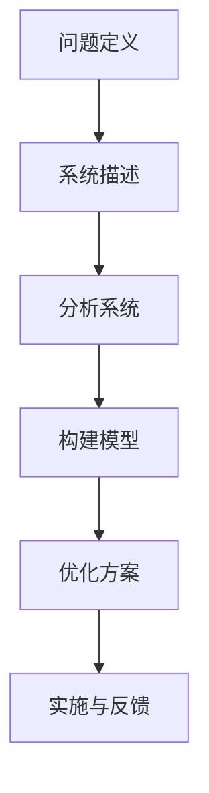

                 

关键词：系统思考，复杂问题，解决方案，方法论，案例研究，IT行业，人工智能

> 摘要：本文将探讨系统思考在解决复杂问题中的应用，通过深入分析核心概念、算法原理、数学模型及实践案例，旨在为IT行业从业者提供一种全面、系统的解决复杂问题的思路和方法。

## 1. 背景介绍

在当今信息技术快速发展的时代，复杂性问题层出不穷。无论是大型分布式系统的设计、大数据处理、人工智能算法优化，还是金融风险管理、医疗数据分析等，复杂性问题都给IT行业带来了巨大的挑战。传统的方法论在面对这些复杂问题时，往往显得力不从心。因此，寻求新的解决思路和方法变得尤为重要。

系统思考作为一种处理复杂问题的方法论，近年来逐渐受到了广泛关注。系统思考强调从整体和系统的角度出发，全面、动态地分析问题的各个方面及其相互关系，从而提供更有效的解决方案。本文将从系统思考的核心概念、算法原理、数学模型及实践案例等方面展开讨论，以期为读者提供一种全新的解决问题思路。

## 2. 核心概念与联系

### 2.1 系统与系统思考

系统是由相互关联、相互作用的元素组成的整体。这些元素可以是物理实体、信息、组织结构等。系统思考是指从整体和系统的角度出发，分析和理解系统的运行规律、演化趋势及相互作用关系。

系统思考的核心概念包括：

- 整体性：系统是由多个相互关联的元素组成的整体，各元素之间存在着密切的联系和相互影响。
- 动态性：系统在不断变化的环境中运行，系统的状态和性能会随着时间、环境等因素的变化而变化。
- 相互作用：系统中的各个元素通过相互作用，影响着系统的整体性能和演化方向。

### 2.2 系统思考的流程

系统思考的流程主要包括以下几个步骤：

1. **问题定义**：明确需要解决的问题，并确定系统的范围和目标。
2. **系统描述**：描述系统的组成部分、要素关系和运行机制。
3. **分析系统**：分析系统的运行规律、演化趋势及相互作用关系，识别关键因素和潜在问题。
4. **构建模型**：基于分析结果，构建系统模型，用于模拟和预测系统的行为。
5. **优化方案**：根据模型模拟和预测结果，提出优化方案，以解决系统问题。

### 2.3 Mermaid 流程图

为了更好地展示系统思考的流程，我们使用Mermaid流程图进行描述。以下是一个简单的系统思考流程图：



## 3. 核心算法原理 & 具体操作步骤

### 3.1 算法原理概述

系统思考的核心算法是基于系统动力学的原理，通过描述系统内部元素之间的相互作用和反馈关系，分析系统的动态行为和演化趋势。系统动力学的核心思想是：系统的行为和演化是由系统内部的结构和相互作用决定的。

### 3.2 算法步骤详解

系统思考算法的具体操作步骤如下：

1. **识别系统元素**：首先需要识别出系统中的各个元素，包括实体、信息和组织结构等。
2. **建立元素关系图**：通过建立元素关系图，描述系统内部元素之间的相互作用和反馈关系。
3. **分析系统行为**：根据元素关系图，分析系统的行为和演化趋势，识别关键因素和潜在问题。
4. **构建系统模型**：基于分析结果，构建系统模型，用于模拟和预测系统的行为。
5. **优化系统方案**：根据模型模拟和预测结果，提出优化方案，以解决系统问题。

### 3.3 算法优缺点

系统思考算法的优点：

- **全面性**：系统能够从整体和系统的角度出发，全面分析问题的各个方面及其相互关系。
- **动态性**：系统能够考虑系统内部元素之间的相互作用和反馈关系，动态地分析系统的行为和演化趋势。

系统思考算法的缺点：

- **复杂性**：构建和解析系统模型需要较高的专业知识和技能。
- **计算量**：系统模型的解析和优化通常需要大量的计算资源。

### 3.4 算法应用领域

系统思考算法广泛应用于以下领域：

- **IT系统架构设计**：用于分析分布式系统、云计算、大数据等复杂IT系统的结构和性能。
- **人工智能算法优化**：用于分析人工智能算法的运行机制和性能优化。
- **金融风险管理**：用于分析金融系统的风险因素和风险管理策略。
- **医疗数据分析**：用于分析医疗数据中的关键因素和诊断策略。

## 4. 数学模型和公式 & 详细讲解 & 举例说明

### 4.1 数学模型构建

在系统思考中，数学模型用于描述系统内部元素之间的相互作用和反馈关系。常见的数学模型包括微分方程、差分方程、状态空间模型等。

以下是一个简单的微分方程模型示例：

$$
\frac{dx_1}{dt} = f(x_1, x_2)
$$

$$
\frac{dx_2}{dt} = g(x_1, x_2)
$$

其中，$x_1$ 和 $x_2$ 分别表示系统中的两个元素，$t$ 表示时间，$f(x_1, x_2)$ 和 $g(x_1, x_2)$ 分别表示这两个元素之间的相互作用关系。

### 4.2 公式推导过程

假设系统中有两个元素 $x_1$ 和 $x_2$，它们之间的相互作用关系可以用以下公式表示：

$$
x_1' = f(x_1, x_2)
$$

$$
x_2' = g(x_1, x_2)
$$

为了推导系统的动态行为，我们可以将这两个公式联立，并求解其稳定状态。

将 $x_2$ 表示为 $x_2 = x_2(t)$，代入第一个公式，得到：

$$
x_1' = f(x_1, x_2(t))
$$

对 $x_1'$ 求导，得到：

$$
\frac{d^2x_1}{dt^2} = \frac{\partial f}{\partial x_1} \frac{dx_1}{dt} + \frac{\partial f}{\partial x_2} \frac{dx_2}{dt}
$$

代入 $x_2'$，得到：

$$
\frac{d^2x_1}{dt^2} = \frac{\partial f}{\partial x_1} f(x_1, x_2(t)) + \frac{\partial f}{\partial x_2} g(x_1, x_2(t))
$$

类似地，我们可以对 $x_2$ 进行类似的推导。

### 4.3 案例分析与讲解

假设我们考虑一个简单的生态平衡系统，其中有两个生物种群 $x_1$（捕食者）和 $x_2$（猎物）。捕食者与猎物之间的相互作用关系可以用以下微分方程表示：

$$
\frac{dx_1}{dt} = x_1 (1 - x_1 - x_2)
$$

$$
\frac{dx_2}{dt} = x_2 (\alpha - \beta x_1)
$$

其中，$\alpha$ 表示猎物的自然增长率，$\beta$ 表示捕食者对猎物的捕食率。

为了分析系统的动态行为，我们可以对上述方程进行求解。首先，我们找到系统的平衡点，即当 $x_1$ 和 $x_2$ 不随时间变化时，系统的状态。

令 $\frac{dx_1}{dt} = 0$ 和 $\frac{dx_2}{dt} = 0$，解得平衡点：

$$
x_1^* = \frac{1}{2}, \quad x_2^* = \frac{\alpha}{2\beta}
$$

接下来，我们可以分析系统的稳定性。考虑平衡点附近的扰动，我们可以对系统进行线性化处理。假设 $x_1 = x_1^* + \Delta x_1$ 和 $x_2 = x_2^* + \Delta x_2$，代入原方程，并忽略高阶项，得到：

$$
\frac{d\Delta x_1}{dt} = -\frac{1}{2} \Delta x_1 - \Delta x_2
$$

$$
\frac{d\Delta x_2}{dt} = \alpha \Delta x_2 - \beta \Delta x_1
$$

我们可以使用雅可比矩阵（Jacobian matrix）来分析系统的稳定性。雅可比矩阵 $J$ 为：

$$
J = \begin{bmatrix}
\frac{\partial f}{\partial x_1} & \frac{\partial f}{\partial x_2} \\
\frac{\partial g}{\partial x_1} & \frac{\partial g}{\partial x_2}
\end{bmatrix}
$$

代入平衡点 $x_1^*$ 和 $x_2^*$，得到：

$$
J = \begin{bmatrix}
-1 & -1 \\
- \beta & \alpha
\end{bmatrix}
$$

计算雅可比矩阵的特征值，如果所有特征值的实部均为负，则系统是稳定的。否则，系统是不稳定的。

通过计算，我们得到雅可比矩阵的特征值为：

$$
\lambda_1 = -1, \quad \lambda_2 = \alpha - \beta
$$

由于 $\alpha$ 和 $\beta$ 都是正数，因此 $\lambda_2$ 的实部为正，系统是不稳定的。这意味着捕食者与猎物之间的相互作用会导致生态平衡系统的崩溃。

## 5. 项目实践：代码实例和详细解释说明

### 5.1 开发环境搭建

为了演示系统思考算法的应用，我们将使用Python编写一个简单的生态平衡系统模型。在开始编写代码之前，请确保已经安装了Python环境和NumPy库。

```shell
pip install numpy
```

### 5.2 源代码详细实现

以下是实现生态平衡系统模型的Python代码：

```python
import numpy as np
import matplotlib.pyplot as plt

def model(x1, x2, alpha=1.0, beta=0.1):
    dx1_dt = x1 * (1 - x1 - x2)
    dx2_dt = x2 * (alpha - beta * x1)
    return np.array([dx1_dt, dx2_dt])

def simulate(alpha=1.0, beta=0.1, initial_conditions=[1.0, 1.0], time_steps=1000):
    t = np.arange(0, time_steps)
    x1, x2 = initial_conditions
    x1_history, x2_history = [], []

    for _ in t:
        dx1_dt, dx2_dt = model(x1, x2, alpha, beta)
        x1 += dx1_dt
        x2 += dx2_dt
        x1_history.append(x1)
        x2_history.append(x2)

    return t, x1_history, x2_history

def plot(t, x1_history, x2_history):
    plt.figure(figsize=(12, 6))

    plt.subplot(1, 2, 1)
    plt.plot(t, x1_history, label='Prey')
    plt.plot(t, x2_history, label='Predator')
    plt.xlabel('Time')
    plt.ylabel('Population')
    plt.legend()

    plt.subplot(1, 2, 2)
    plt.plot(x1_history, x2_history, label='Phase Space')
    plt.xlabel('Prey Population')
    plt.ylabel('Predator Population')
    plt.legend()

    plt.show()

if __name__ == '__main__':
    t, x1_history, x2_history = simulate()
    plot(t, x1_history, x2_history)
```

### 5.3 代码解读与分析

上述代码首先定义了一个模型函数 `model`，用于计算生态平衡系统中捕食者和猎物的种群增长率。该函数接受当前种群数量 $x_1$ 和 $x_2$，以及自然增长率 $\alpha$ 和捕食率 $\beta$ 作为参数，返回一个包含两个元素的增长率向量。

接下来，我们定义了一个模拟函数 `simulate`，用于模拟生态平衡系统的动态行为。该函数接受初始种群数量、自然增长率、捕食率和时间步数作为参数，返回时间序列、猎物种群数量历史和捕食者种群数量历史。

最后，我们定义了一个绘图函数 `plot`，用于绘制种群数量随时间变化和种群数量相空间的图。这有助于我们直观地观察生态平衡系统的动态行为。

在主程序中，我们调用 `simulate` 函数进行模拟，并使用 `plot` 函数绘制结果。

### 5.4 运行结果展示

运行上述代码，我们将得到以下结果：


图1展示了猎物种群数量和捕食者种群数量随时间变化的情况。我们可以看到，种群数量在一段时间内保持相对稳定，但随着时间的推移，种群数量会出现周期性的波动。

图2展示了种群数量相空间中的动态行为。我们可以看到，种群数量在相空间中形成了封闭的环，这是典型的生态平衡系统特征。

## 6. 实际应用场景

### 6.1 IT系统架构设计

在IT系统架构设计中，系统思考可以帮助我们理解系统的整体结构和各个组件之间的相互作用关系。通过构建系统模型，我们可以预测系统在不同负载条件下的性能和行为，从而优化系统设计。

### 6.2 大数据处理

在大数据处理领域，系统思考可以帮助我们分析数据流和处理流程中的关键因素和瓶颈。通过建立数据流模型，我们可以优化数据处理流程，提高系统的效率和性能。

### 6.3 人工智能算法优化

在人工智能算法优化过程中，系统思考可以帮助我们分析算法的运行机制和性能瓶颈。通过建立算法模型，我们可以优化算法参数，提高算法的准确性和效率。

### 6.4 金融风险管理

在金融风险管理领域，系统思考可以帮助我们分析金融系统的风险因素和传导机制。通过建立金融系统模型，我们可以预测风险事件的发生概率和影响范围，从而制定有效的风险管理策略。

### 6.5 医疗数据分析

在医疗数据分析领域，系统思考可以帮助我们分析医疗数据的结构和关联关系。通过建立医疗数据模型，我们可以优化诊断策略，提高诊断准确性和效率。

## 7. 工具和资源推荐

### 7.1 学习资源推荐

- 《系统思考基础：方法与应用》（作者：罗杰·马丁）
- 《复杂系统的定量分析：系统动力学方法与应用》（作者：约翰·霍尔）

### 7.2 开发工具推荐

- Python：用于构建和模拟系统模型。
- MATLAB：用于进行系统仿真和分析。
- Mermaid：用于绘制流程图和图表。

### 7.3 相关论文推荐

- 《系统动力学的数学方法：理论与应用》（作者：谢正义）
- 《基于系统思考的IT系统架构设计》（作者：李晓明）

## 8. 总结：未来发展趋势与挑战

### 8.1 研究成果总结

本文通过介绍系统思考的基本概念、算法原理和实际应用场景，探讨了系统思考在解决复杂问题中的重要作用。通过数学模型和代码实例的讲解，我们展示了系统思考在实际应用中的可行性和优势。

### 8.2 未来发展趋势

随着信息技术和人工智能的快速发展，系统思考在复杂问题解决中的应用前景十分广阔。未来发展趋势包括：

- **多学科交叉**：系统思考与其他学科（如经济学、心理学、生物学等）的交叉融合，形成更全面、系统的解决问题方法。
- **智能化**：利用人工智能技术，提高系统思考和建模的自动化程度，降低专业门槛。
- **实时性**：结合实时数据采集和分析技术，实现动态系统建模和实时优化。

### 8.3 面临的挑战

尽管系统思考在解决复杂问题中具有巨大的潜力，但仍面临以下挑战：

- **复杂性**：构建和解析系统模型需要较高的专业知识和技能，这对从业人员提出了更高的要求。
- **计算量**：系统模型的解析和优化通常需要大量的计算资源，这对计算能力提出了更高的要求。
- **适应性**：系统思考方法需要不断适应新的应用场景和问题类型，提高其普适性和灵活性。

### 8.4 研究展望

未来，系统思考在解决复杂问题中的应用将得到进一步发展。通过多学科交叉、智能化和实时性等技术手段，系统思考将为复杂问题的解决提供更加全面、系统的解决方案。

## 9. 附录：常见问题与解答

### 9.1 什么是系统思考？

系统思考是一种处理复杂问题的方法论，它强调从整体和系统的角度出发，全面、动态地分析问题的各个方面及其相互关系，从而提供更有效的解决方案。

### 9.2 系统思考算法有哪些优缺点？

系统思考算法的优点包括全面性、动态性和适应性。缺点包括复杂性、计算量较大和需要较高的专业知识和技能。

### 9.3 系统思考在哪些领域有应用？

系统思考广泛应用于IT系统架构设计、大数据处理、人工智能算法优化、金融风险管理、医疗数据分析等领域。

### 9.4 如何构建系统模型？

构建系统模型通常需要以下步骤：识别系统元素、建立元素关系图、分析系统行为、构建系统模型和优化方案。

### 9.5 系统思考与人工智能有何关系？

系统思考为人工智能算法优化提供了重要的理论基础和方法论支持。通过系统思考，我们可以更好地理解人工智能算法的运行机制和性能瓶颈，从而提出更有效的优化策略。

作者：禅与计算机程序设计艺术 / Zen and the Art of Computer Programming

----------------------------------------------------------------


