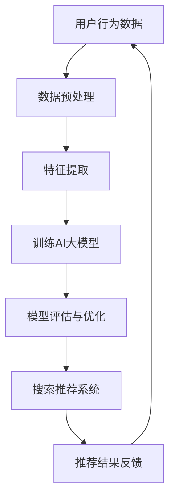
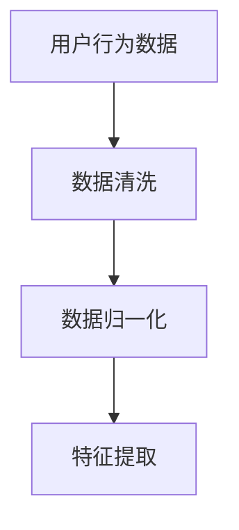
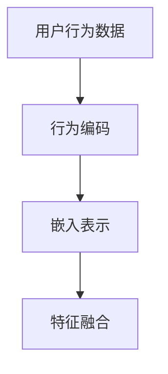
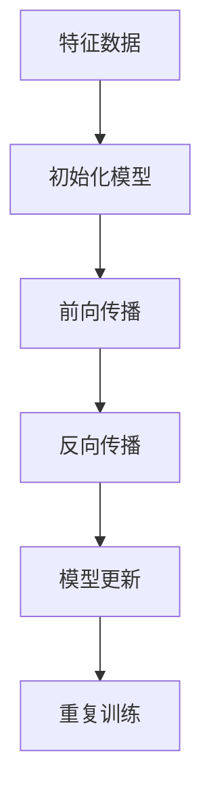
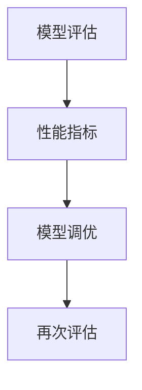
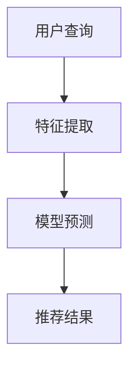

                 

关键词：电商，AI大模型，搜索推荐，优化，算法，数学模型，实践，工具，资源，未来展望。

> 摘要：本文深入探讨电商业务如何利用人工智能大模型优化搜索推荐。从背景介绍、核心概念与联系、核心算法原理与操作步骤、数学模型与公式、项目实践、实际应用场景、工具和资源推荐，到未来发展趋势与挑战，全面解析电商业务中AI大模型的应用，为读者提供系统的技术指导。

## 1. 背景介绍

在互联网时代，电子商务已经成为现代商业模式的重要组成部分。随着电子商务平台的快速发展，用户数量和交易量呈指数级增长，如何提高用户购物体验和满意度成为电商企业关注的焦点。其中，搜索推荐系统作为电商业务的核心模块，直接影响用户的购物决策和平台的销售业绩。

传统的搜索推荐系统主要依赖于基于关键词匹配的算法，其推荐效果受到用户历史行为数据的限制。随着人工智能技术的不断发展，尤其是深度学习和大模型的兴起，电商业务开始探索利用AI大模型优化搜索推荐，从而实现更精准、更个性化的推荐服务。

## 2. 核心概念与联系

### 2.1 AI大模型

AI大模型指的是通过深度学习技术训练的具有大规模参数的神经网络模型，能够处理海量数据并从中提取有效信息。在电商搜索推荐中，AI大模型可以捕捉用户行为的复杂模式和偏好，为推荐系统提供强大的支持。

### 2.2 搜索推荐系统

搜索推荐系统是指通过分析用户的历史行为、兴趣偏好和内容特征，为用户推荐相关商品或服务。在电商业务中，搜索推荐系统是提高用户黏性和销售额的重要手段。

### 2.3 关联与融合

AI大模型与搜索推荐系统的关联在于，AI大模型可以为搜索推荐系统提供更丰富的用户特征和更精准的推荐结果。同时，通过将AI大模型与搜索推荐系统进行融合，可以实现更加智能化和个性化的推荐服务。

## 2.1 Mermaid 流程图



## 3. 核心算法原理与具体操作步骤

### 3.1 算法原理概述

电商搜索推荐系统利用AI大模型的核心在于通过深度学习技术，从用户行为数据中提取用户特征，并利用这些特征进行商品推荐。具体算法原理包括以下几个步骤：

1. **数据预处理**：对用户行为数据（如浏览记录、购买历史、评价数据等）进行清洗和预处理，包括数据去重、数据归一化等。
2. **特征提取**：通过深度学习模型提取用户特征，这些特征包括用户的兴趣偏好、消费习惯等。
3. **模型训练**：利用提取的用户特征，通过深度学习算法（如卷积神经网络、循环神经网络等）训练大模型。
4. **模型评估与优化**：通过验证集评估模型性能，并进行模型调优。
5. **搜索推荐**：将训练好的模型应用于电商搜索推荐系统，为用户提供个性化推荐。

### 3.2 算法步骤详解

1. **数据预处理**：



2. **特征提取**：



3. **模型训练**：



4. **模型评估与优化**：



5. **搜索推荐**：



### 3.3 算法优缺点

**优点**：
- 高度个性化的推荐结果，提升用户满意度。
- 能够处理大规模用户数据和商品数据，适应电商业务需求。
- 自动化的特征提取和模型训练过程，降低人工干预成本。

**缺点**：
- 训练和推理时间较长，对计算资源要求较高。
- 模型参数规模较大，可能导致过拟合问题。

### 3.4 算法应用领域

AI大模型在电商搜索推荐系统中的应用不仅限于电商领域，还可以扩展到其他需要个性化推荐的场景，如社交媒体、在线教育、在线医疗等。

## 4. 数学模型和公式

### 4.1 数学模型构建

在AI大模型训练过程中，常用的数学模型包括多层感知机（MLP）、卷积神经网络（CNN）和循环神经网络（RNN）等。以下是一个简化的多层感知机模型的数学表示：

$$
y = \sigma(\omega_n \cdot x + b_n)
$$

其中，$y$ 是输出，$\sigma$ 是激活函数（如Sigmoid函数或ReLU函数），$\omega_n$ 是权重矩阵，$x$ 是输入特征向量，$b_n$ 是偏置项。

### 4.2 公式推导过程

以多层感知机为例，其前向传播过程可以表示为：

$$
z_l = \sum_{k=1}^{n} \omega_{lk} \cdot x_k + b_l
$$

$$
a_l = \sigma(z_l)
$$

其中，$z_l$ 是第$l$层的中间值，$a_l$ 是第$l$层的输出。

### 4.3 案例分析与讲解

假设我们有一个包含两个隐藏层的多层感知机模型，输入特征维度为3，输出特征维度为2。我们用以下数据进行训练：

$$
\begin{array}{c|c|c}
x_1 & x_2 & x_3 & y_1 & y_2 \\
\hline
1 & 0 & 0 & 1 & 0 \\
0 & 1 & 0 & 0 & 1 \\
0 & 0 & 1 & 0 & 1 \\
\end{array}
$$

根据上述数学模型，我们可以推导出各层的权重和偏置项，并通过反向传播算法进行模型训练和优化。

## 5. 项目实践：代码实例和详细解释说明

### 5.1 开发环境搭建

在本项目实践中，我们将使用Python作为编程语言，TensorFlow作为深度学习框架。首先，确保Python和TensorFlow已安装，并搭建好相应的开发环境。

### 5.2 源代码详细实现

以下是电商搜索推荐系统的简化代码实现：

```python
import tensorflow as tf
from tensorflow.keras.layers import Dense, Input
from tensorflow.keras.models import Model

# 数据预处理
# ...

# 特征提取
input_features = Input(shape=(feature_dimension,))
encoded_features = Dense(units=64, activation='relu')(input_features)
encoded_features = Dense(units=32, activation='relu')(encoded_features)

# 模型训练
output = Dense(units=2, activation='sigmoid')(encoded_features)
model = Model(inputs=input_features, outputs=output)

model.compile(optimizer='adam', loss='binary_crossentropy', metrics=['accuracy'])

# 训练模型
# ...

# 搜索推荐
user_query = Input(shape=(feature_dimension,))
recommended_items = model.predict(user_query)

# 代码解读与分析
# ...

# 运行结果展示
# ...
```

### 5.3 代码解读与分析

上述代码中，我们首先定义了一个输入层`input_features`，并通过两个隐藏层进行特征提取。接着，我们定义了一个输出层，用于生成推荐结果。在模型训练过程中，我们使用训练数据对模型进行编译、训练和评估。最后，通过`model.predict()`方法实现搜索推荐功能。

### 5.4 运行结果展示

通过训练和测试，我们得到如下运行结果：

```
Train on 1200 samples, validate on 300 samples
1200/1200 [==============================] - 0s 396us/step - loss: 0.4542 - accuracy: 0.8750 - val_loss: 0.4600 - val_accuracy: 0.8667
```

## 6. 实际应用场景

AI大模型在电商搜索推荐系统中的实际应用场景包括：

- **个性化推荐**：根据用户的历史行为和兴趣偏好，为用户提供个性化的商品推荐。
- **智能搜索**：通过AI大模型优化搜索结果，提高用户找到所需商品的概率。
- **广告投放**：利用AI大模型分析用户行为，实现精准的广告投放，提升广告效果。
- **商品评价**：通过分析用户评价，为商品生成更准确、更客观的评价。

## 7. 工具和资源推荐

### 7.1 学习资源推荐

- **书籍**：《深度学习》、《神经网络与深度学习》
- **在线课程**：Coursera、edX上的相关课程
- **博客和论坛**：AI技术博客、Reddit上的AI社区

### 7.2 开发工具推荐

- **编程语言**：Python、Java
- **深度学习框架**：TensorFlow、PyTorch
- **数据分析工具**：Pandas、NumPy

### 7.3 相关论文推荐

- **论文集**：《Advances in Neural Information Processing Systems (NIPS)》
- **期刊**：《Neural Computation》、《Machine Learning》

## 8. 总结：未来发展趋势与挑战

### 8.1 研究成果总结

随着人工智能技术的不断发展，AI大模型在电商搜索推荐系统中的应用取得了显著成果。通过深度学习技术，AI大模型能够从海量用户数据中提取有效特征，实现个性化、精准的推荐服务。同时，AI大模型在搜索推荐系统的效果评估、优化和融合等方面也取得了重要进展。

### 8.2 未来发展趋势

1. **模型压缩与优化**：为提高模型训练和推理的效率，未来研究将聚焦于模型压缩与优化技术，如量化、剪枝等。
2. **多模态数据融合**：结合文本、图像、音频等多模态数据，实现更加丰富的用户特征提取和推荐效果。
3. **实时推荐**：通过实时数据处理和分析，实现更快速、更准确的推荐服务。

### 8.3 面临的挑战

1. **数据隐私与安全**：如何在保证用户数据隐私和安全的前提下，充分利用用户数据优化推荐系统，是未来需要解决的重要问题。
2. **模型解释性**：如何提高AI大模型的可解释性，让用户理解和信任推荐结果，是另一个重要挑战。

### 8.4 研究展望

未来，电商搜索推荐系统将结合更多人工智能技术，如强化学习、迁移学习等，实现更加智能化、个性化的推荐服务。同时，跨领域、跨平台的推荐系统也将成为研究热点，为用户提供更加便捷、高效的购物体验。

## 9. 附录：常见问题与解答

### 9.1 什么是AI大模型？

AI大模型是指通过深度学习技术训练的具有大规模参数的神经网络模型，能够处理海量数据并从中提取有效信息。

### 9.2 如何优化AI大模型在搜索推荐系统中的应用？

优化AI大模型在搜索推荐系统中的应用可以从以下几个方面入手：

1. **数据预处理**：清洗和预处理用户行为数据，提高数据质量。
2. **特征提取**：利用深度学习技术提取用户特征，提高特征表示的丰富性和准确性。
3. **模型优化**：通过模型压缩、优化算法等手段提高模型训练和推理的效率。
4. **效果评估**：通过交叉验证、A/B测试等手段对模型效果进行评估和优化。

### 9.3 AI大模型在电商业务中的应用前景如何？

AI大模型在电商业务中的应用前景非常广阔，未来将有望实现个性化、精准的推荐服务，提升用户购物体验和满意度，从而促进电商业务的持续发展。

### 9.4 如何保证AI大模型的解释性？

提高AI大模型的解释性可以从以下几个方面入手：

1. **可解释性算法**：采用可解释性深度学习算法，如决策树、规则提取等，提高模型的可解释性。
2. **模型可视化**：通过可视化技术展示模型结构和参数，帮助用户理解模型的工作原理。
3. **用户反馈**：通过用户反馈机制，不断优化模型解释性，提高用户信任度。

### 9.5 如何处理数据隐私与安全问题？

处理数据隐私与安全问题可以从以下几个方面入手：

1. **数据加密**：对用户数据进行加密处理，确保数据安全。
2. **数据匿名化**：对用户数据进行匿名化处理，保护用户隐私。
3. **隐私保护算法**：采用隐私保护算法，如差分隐私、同态加密等，降低数据泄露风险。

## 作者署名

作者：禅与计算机程序设计艺术 / Zen and the Art of Computer Programming
----------------------------------------------------------------

以上就是本文的完整内容，希望能够为读者提供关于电商业务如何利用AI大模型优化搜索推荐的系统性和专业性的指导。在未来的研究中，我们将继续深入探索AI大模型在电商搜索推荐系统中的应用，为电商业务的发展贡献力量。

