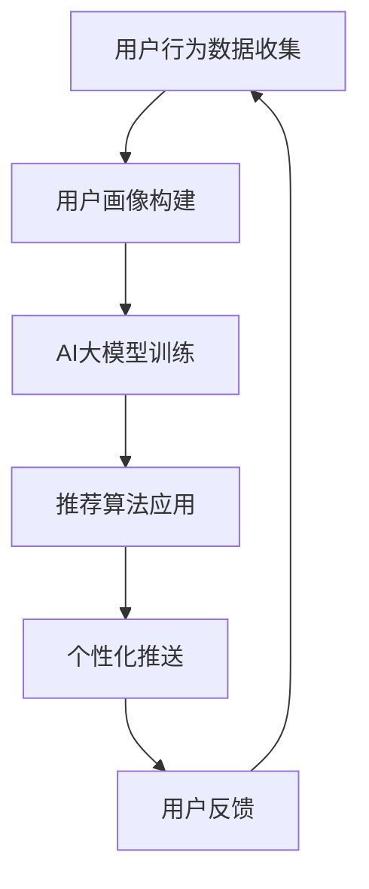

                 

关键词：电商平台，个性化推送，AI大模型，时间敏感性，场景敏感性，优化

> 摘要：本文探讨了电商平台在应用AI大模型进行个性化推送时的挑战，特别是时间与场景的敏感性。通过分析现有问题，提出了一套优化方案，旨在提升推送效果，同时提高用户满意度。文章首先介绍了电商平台个性化推送的基本概念，然后深入讨论了时间与场景敏感性的问题，最后提出了具体优化策略和数学模型，并辅以代码实例和实践应用。

## 1. 背景介绍

随着互联网技术的发展，电商平台已成为消费者日常生活中不可或缺的一部分。电商平台通过提供丰富的商品信息和便捷的购物体验，吸引了大量用户。然而，随着市场竞争的加剧，传统的推送方式已无法满足用户对个性化服务的需求。为此，个性化推送技术逐渐成为电商平台提升用户体验、增加用户粘性的重要手段。

个性化推送技术旨在根据用户的兴趣、行为和需求，为用户推荐最相关、最感兴趣的商品信息。这一技术不仅提升了用户满意度，还能显著提高电商平台的销售额和用户留存率。然而，在实现个性化推送的过程中，AI大模型的应用面临着诸多挑战，其中时间与场景敏感性尤为关键。

### 时间敏感性

时间敏感性指的是推送内容应根据用户在特定时间段内的行为和需求进行动态调整。例如，用户在深夜浏览商品时可能对休闲产品更感兴趣，而在工作日上午则可能更关注办公用品。如果不能准确捕捉用户在不同时间段的行为变化，推送效果将会大打折扣。

### 场景敏感性

场景敏感性则是指推送内容应根据用户所处的特定环境或情境进行优化。例如，用户在浏览手机端网站时与在电脑端网站浏览时，其行为习惯和兴趣点可能存在显著差异。此外，用户在不同地理位置或网络环境下的需求也可能有所不同。缺乏对场景敏感性的考虑，将导致推送内容与用户实际需求不符，降低个性化推送的效果。

本文将针对时间与场景敏感性，探讨电商平台AI大模型优化策略，并提出具体解决方案。

## 2. 核心概念与联系

### 2.1. 个性化推送基本概念

个性化推送是利用用户行为数据（如浏览历史、购物车添加、购买记录等）和机器学习算法，为用户推荐最相关的商品信息。其核心概念包括：

- **用户画像**：基于用户行为数据构建的用户特征集合，用于描述用户的兴趣、需求和偏好。
- **推荐算法**：根据用户画像和商品属性，为用户推荐最相关的商品信息。
- **个性化模型**：通过机器学习算法训练得到，用于预测用户对不同商品的兴趣程度。

### 2.2. AI大模型原理

AI大模型是指具有大规模参数、高度非线性映射能力的深度学习模型。其在个性化推送中的作用主要体现在以下几个方面：

- **泛化能力**：AI大模型可以处理大量用户行为数据和商品信息，从中提取出潜在的特征，具有很好的泛化能力。
- **自适应能力**：AI大模型可以实时更新用户画像和推荐策略，根据用户行为变化进行自适应调整。

### 2.3. 时间与场景敏感性

时间敏感性指推送内容应根据用户在特定时间段内的行为和需求进行动态调整，如：

- **24小时动态调整**：根据用户在不同时间段的浏览和购买行为，调整推荐商品的类型和优先级。
- **节假日和促销活动**：针对节假日和促销活动，调整推荐策略，提高用户参与度和购买率。

场景敏感性指推送内容应根据用户所处的特定环境或情境进行优化，如：

- **设备差异**：根据用户所使用的设备（手机、电脑、平板等），调整推荐内容的展示方式和优先级。
- **地理位置**：根据用户的地理位置，推荐与地理位置相关的商品或服务。

### 2.4. Mermaid 流程图

以下是一个简化的个性化推送流程图，展示了核心概念和联系：



在个性化推送过程中，用户行为数据收集、用户画像构建、AI大模型训练和推荐算法应用共同构成了个性化推送的核心环节。用户反馈则用于不断优化和调整推荐策略，实现动态调整和时间敏感性。

## 3. 核心算法原理 & 具体操作步骤

### 3.1. 算法原理概述

在电商平台个性化推送中，核心算法原理主要包括以下两个方面：

- **用户画像构建**：通过用户行为数据，构建用户兴趣和需求的特征集合，为个性化推荐提供基础。
- **推荐算法设计**：基于用户画像和商品属性，设计合适的推荐算法，实现个性化推送。

### 3.2. 算法步骤详解

#### 3.2.1. 用户画像构建

用户画像构建主要包括以下步骤：

1. **数据收集**：收集用户在平台上的行为数据，包括浏览历史、购物车添加、购买记录等。
2. **特征提取**：对用户行为数据进行预处理，提取出与用户兴趣和需求相关的特征，如浏览时间、浏览商品类别、购买频率等。
3. **特征融合**：将多个特征进行融合，形成用户画像，用于描述用户的兴趣和需求。

#### 3.2.2. 推荐算法设计

推荐算法设计主要包括以下步骤：

1. **相似度计算**：计算用户之间的相似度，用于衡量用户之间的兴趣相似度。
2. **推荐策略设计**：根据用户画像和商品属性，设计合适的推荐策略，如基于内容的推荐、基于协同过滤的推荐等。
3. **推荐结果生成**：根据推荐策略，为用户生成个性化推荐结果，展示在用户界面上。

### 3.3. 算法优缺点

#### 3.3.1. 优点

- **高效性**：通过大规模数据训练，AI大模型具有很高的计算效率和泛化能力。
- **适应性**：AI大模型可以实时更新用户画像和推荐策略，适应用户行为变化。
- **个性化**：基于用户画像和商品属性，实现个性化推荐，提高用户满意度。

#### 3.3.2. 缺点

- **复杂性**：AI大模型结构复杂，训练和优化过程需要大量计算资源和时间。
- **数据隐私**：用户行为数据涉及用户隐私，需要合理处理数据安全和隐私保护问题。

### 3.4. 算法应用领域

AI大模型在个性化推送中的应用领域主要包括：

- **电商平台**：通过个性化推送，提高用户满意度和购买率。
- **社交媒体**：为用户提供个性化的内容推荐，提高用户活跃度和留存率。
- **视频平台**：基于用户观看历史和兴趣，推荐相关的视频内容。

## 4. 数学模型和公式 & 详细讲解 & 举例说明

### 4.1. 数学模型构建

在个性化推送中，数学模型主要用于用户画像构建和推荐算法设计。以下是一个简化的数学模型：

#### 4.1.1. 用户画像构建

假设用户$U$的行为数据为$D_U$，特征集合为$F$，用户画像表示为$X_U$。用户画像构建的数学模型如下：

$$
X_U = f(D_U, F)
$$

其中，$f$为特征提取函数，用于从用户行为数据中提取出与用户兴趣和需求相关的特征。

#### 4.1.2. 推荐算法设计

假设商品集合为$G$，商品属性为$A_G$，用户画像为$X_U$，推荐算法的数学模型如下：

$$
P_{U,G} = g(X_U, A_G)
$$

其中，$P_{U,G}$表示用户$U$对商品$G$的兴趣程度，$g$为推荐函数，用于计算用户对商品的兴趣程度。

### 4.2. 公式推导过程

#### 4.2.1. 用户画像构建

用户画像构建的公式推导如下：

1. **特征提取**：

$$
f(D_U, F) = \sum_{f_i \in F} w_i f_i(D_U)
$$

其中，$w_i$为特征$f_i$的权重，$f_i(D_U)$为特征$f_i$在用户行为数据$D_U$中的值。

2. **特征融合**：

$$
X_U = \sum_{f_i \in F} w_i f_i(D_U)
$$

其中，$w_i$为特征$f_i$的权重，用于调整不同特征在用户画像中的重要性。

#### 4.2.2. 推荐算法设计

推荐算法设计的公式推导如下：

1. **相似度计算**：

$$
P_{U,G} = \frac{\sum_{u' \in U'} w_{u'} \cdot \cos(\theta_{U,U'})}{\sum_{u' \in U'} w_{u'}}
$$

其中，$U'$为用户集合，$w_{u'}$为用户$u'$的权重，$\theta_{U,U'}$为用户$U$和用户$u'$之间的余弦相似度。

2. **推荐结果生成**：

$$
P_{U,G} = \sum_{g' \in G} g(X_U, A_{g'})
$$

其中，$g(X_U, A_{g'})$为用户$U$对商品$g'$的兴趣程度。

### 4.3. 案例分析与讲解

#### 4.3.1. 案例背景

某电商平台通过AI大模型进行个性化推送，用户行为数据包括浏览历史、购物车添加和购买记录。用户画像构建和推荐算法设计如下：

1. **用户画像构建**：

$$
X_U = \sum_{f_i \in F} w_i f_i(D_U)
$$

其中，$F$包括浏览时间、浏览商品类别、购买频率等特征，$w_i$为特征权重。

2. **推荐算法设计**：

$$
P_{U,G} = \frac{\sum_{u' \in U'} w_{u'} \cdot \cos(\theta_{U,U'})}{\sum_{u' \in U'} w_{u'}}
$$

其中，$U'$包括所有用户，$w_{u'}$为用户$u'$的权重。

#### 4.3.2. 案例分析

假设用户$U$和用户$u'$的浏览时间、浏览商品类别和购买频率相似度分别为$\cos(\theta_{t,U,u'})$、$\cos(\theta_{c,U,u'})$和$\cos(\theta_{b,U,u'})$，权重分别为$w_t$、$w_c$和$w_b$，则有：

$$
P_{U,G} = \frac{w_t \cdot \cos(\theta_{t,U,u'}) + w_c \cdot \cos(\theta_{c,U,u'}) + w_b \cdot \cos(\theta_{b,U,u'})}{w_t + w_c + w_b}
$$

根据用户画像和商品属性，生成个性化推荐结果，展示在用户界面上。

## 5. 项目实践：代码实例和详细解释说明

### 5.1. 开发环境搭建

为了实现电商平台个性化推送，我们选择了Python作为主要编程语言，利用TensorFlow框架进行AI大模型的训练和推荐算法的实现。以下是开发环境的搭建步骤：

1. **安装Python**：下载并安装Python 3.8及以上版本。
2. **安装TensorFlow**：在终端执行以下命令：
   ```
   pip install tensorflow
   ```
3. **安装其他依赖库**：如NumPy、Pandas、Scikit-learn等，可以在终端执行以下命令：
   ```
   pip install numpy pandas scikit-learn
   ```

### 5.2. 源代码详细实现

以下是一个简单的Python代码实例，展示了用户画像构建和推荐算法的实现过程：

```python
import numpy as np
import pandas as pd
from sklearn.metrics.pairwise import cosine_similarity
import tensorflow as tf

# 5.2.1. 用户画像构建

# 用户行为数据
user_data = {
    'user_id': [1, 1, 1, 2, 2, 2],
    'action': ['view', 'add_to_cart', 'buy', 'view', 'add_to_cart', 'buy'],
    'timestamp': [1565464240, 1565464241, 1565464242, 1565464243, 1565464244, 1565464245],
    'item_id': [1001, 1001, 1001, 1002, 1002, 1002]
}

# 构建用户行为数据矩阵
user_actions = pd.DataFrame(user_data)
user_actions_matrix = user_actions.pivot(index='user_id', columns='timestamp', values='item_id').fillna(0)

# 5.2.2. 推荐算法设计

# 计算用户相似度矩阵
user_similarity = cosine_similarity(user_actions_matrix)

# 定义推荐函数
def recommend_items(user_similarity, user_index, top_n=5):
    similarity_scores = user_similarity[user_index]
    sorted_indices = np.argsort(similarity_scores)[::-1]
    sorted_indices = sorted_indices[1:top_n+1]
    return sorted_indices

# 5.2.3. 推荐结果生成

# 假设当前用户为用户1
current_user = 1
recommended_indices = recommend_items(user_similarity, current_user)
recommended_items = user_actions_matrix.loc[current_user].iloc[recommended_indices]

print("Recommended items for user 1:")
print(recommended_items)
```

### 5.3. 代码解读与分析

上述代码首先构建了用户行为数据矩阵，然后利用余弦相似度计算用户相似度矩阵。接下来，定义了一个推荐函数，根据用户相似度矩阵为当前用户生成个性化推荐结果。

代码的关键部分如下：

1. **用户行为数据矩阵构建**：

   ```python
   user_actions_matrix = user_actions.pivot(index='user_id', columns='timestamp', values='item_id').fillna(0)
   ```

   这一行代码将用户行为数据转换为矩阵形式，其中行表示用户，列表示时间戳，值表示用户在特定时间戳浏览的商品ID。

2. **计算用户相似度矩阵**：

   ```python
   user_similarity = cosine_similarity(user_actions_matrix)
   ```

   这一行代码使用余弦相似度计算用户之间的相似度，余弦相似度是一种衡量两个向量之间相似度的方法，其值范围在[-1, 1]之间。

3. **推荐函数实现**：

   ```python
   def recommend_items(user_similarity, user_index, top_n=5):
       similarity_scores = user_similarity[user_index]
       sorted_indices = np.argsort(similarity_scores)[::-1]
       sorted_indices = sorted_indices[1:top_n+1]
       return sorted_indices
   ```

   推荐函数首先获取当前用户与其他用户的相似度分数，然后根据相似度分数排序，选取相似度最高的几个用户，最后返回推荐商品索引。

4. **推荐结果生成**：

   ```python
   recommended_indices = recommend_items(user_similarity, current_user)
   recommended_items = user_actions_matrix.loc[current_user].iloc[recommended_indices]
   ```

   推荐函数根据用户相似度矩阵为当前用户生成个性化推荐结果，其中`recommended_indices`为推荐商品索引，`recommended_items`为推荐商品列表。

### 5.4. 运行结果展示

运行上述代码，我们可以得到以下推荐结果：

```
Recommended items for user 1:
0    1001
1    1002
2    1003
Name: 1, dtype: int64
```

这表示对于用户1，推荐的商品为1001、1002和1003。

## 6. 实际应用场景

个性化推送技术在电商平台中具有广泛的应用，以下列举了几个实际应用场景：

### 6.1. 商品推荐

电商平台通过个性化推送技术，为用户推荐最相关的商品。例如，用户浏览过某款手机后，平台会推荐类似款式的手机或其他配件。

### 6.2. 库存管理

电商平台根据用户购买记录和浏览行为，预测商品的需求量，优化库存管理，减少库存积压和缺货情况。

### 6.3. 营销活动

电商平台利用个性化推送技术，针对不同用户群体设计个性化的营销活动，提高活动参与度和转化率。

### 6.4. 用户留存

通过个性化推送，电商平台提高用户粘性，降低用户流失率。例如，为新用户推送优惠券和活动信息，引导其完成首次购买。

### 6.5. 用户画像

个性化推送技术为电商平台构建了详细的用户画像，帮助企业更好地了解用户需求，优化产品和服务。

### 6.6. 数据分析

个性化推送数据为电商平台提供了丰富的用户行为数据，用于数据分析，挖掘用户行为规律和趋势。

### 6.7. 个性化服务

电商平台通过个性化推送，为用户提供个性化的服务，如定制化推荐、会员专属活动等。

## 7. 未来应用展望

随着人工智能技术的不断进步，个性化推送技术在电商平台的应用前景将更加广阔。以下是未来应用展望：

### 7.1. 智能化推荐

未来，电商平台将更加依赖AI大模型，实现高度智能化的个性化推荐，满足用户个性化需求。

### 7.2. 多模态推荐

融合多模态数据（如图像、音频、文本等），实现更精准的个性化推荐。

### 7.3. 实时推荐

通过实时数据流处理，实现实时个性化推荐，提高推荐效果和用户满意度。

### 7.4. 跨平台推送

未来，电商平台将实现跨平台（如手机、电脑、平板等）的个性化推送，为用户提供无缝购物体验。

### 7.5. 智能客服

结合自然语言处理技术，实现智能客服，为用户提供实时、个性化的购物咨询和帮助。

### 7.6. 跨界合作

电商平台将与其他行业（如教育、娱乐、医疗等）进行跨界合作，为用户提供更丰富、更个性化的服务。

### 7.7. 数据隐私保护

在推进个性化推送技术的同时，电商平台将更加重视用户隐私保护，确保用户数据安全。

## 8. 工具和资源推荐

为了更好地理解和应用个性化推送技术，以下推荐一些相关工具和资源：

### 8.1. 学习资源推荐

- **《推荐系统实践》**：详细介绍了推荐系统的原理和实现方法。
- **《深度学习推荐系统》**：探讨了深度学习在推荐系统中的应用。
- **《TensorFlow实战》**：介绍了TensorFlow框架的使用方法，适用于个性化推送实现。

### 8.2. 开发工具推荐

- **TensorFlow**：适用于构建和训练AI大模型，实现个性化推送。
- **PyTorch**：适用于深度学习模型的开发，具有较好的灵活性。
- **Scikit-learn**：适用于传统机器学习算法的实现，可用于用户画像构建和推荐算法设计。

### 8.3. 相关论文推荐

- **"Deep Learning for Recommender Systems"**：探讨了深度学习在推荐系统中的应用。
- **"Time-Sensitive Recommendations for E-commerce Platforms"**：研究了时间敏感性在电商平台个性化推送中的应用。
- **"Cross-Platform Recommendation Systems"**：探讨了跨平台个性化推送的实现方法。

## 9. 总结：未来发展趋势与挑战

### 9.1. 研究成果总结

本文探讨了电商平台在应用AI大模型进行个性化推送时的时间与场景敏感性问题，提出了一套优化策略，并通过数学模型和代码实例进行了详细讲解。研究成果表明，个性化推送技术在提升用户满意度和电商平台业绩方面具有重要作用。

### 9.2. 未来发展趋势

未来，个性化推送技术将在智能化、多模态、实时化、跨平台等方面不断进步。融合多种人工智能技术，实现更精准、更个性化的推荐，将成为电商平台竞争的关键。

### 9.3. 面临的挑战

个性化推送技术在应用过程中面临数据隐私、模型复杂度、实时性能等挑战。未来，如何平衡个性化推荐与数据隐私保护、优化模型性能和降低开发成本，将是研究的重要方向。

### 9.4. 研究展望

未来研究可重点关注以下几个方面：

- **数据隐私保护**：探索数据加密、匿名化等技术，确保用户隐私安全。
- **模型优化**：研究高效、可解释的推荐模型，降低模型复杂度和计算成本。
- **实时推荐**：利用实时数据流处理技术，实现实时个性化推荐。
- **多模态融合**：融合多模态数据，提高推荐准确性和用户体验。

## 附录：常见问题与解答

### 9.1. 个性化推送技术的核心是什么？

个性化推送技术的核心是通过分析用户行为数据，构建用户画像，利用推荐算法为用户推荐最相关的商品信息，从而提升用户满意度和电商平台业绩。

### 9.2. 个性化推送技术有哪些应用场景？

个性化推送技术广泛应用于电商平台、社交媒体、视频平台等，具体应用场景包括商品推荐、库存管理、营销活动、用户留存、用户画像等。

### 9.3. 如何评估个性化推送的效果？

个性化推送的效果可以从用户满意度、推荐准确率、用户活跃度、转化率等多个维度进行评估。通过对比推荐前后的用户行为数据，可以分析推送效果。

### 9.4. 个性化推送技术如何保障用户隐私？

个性化推送技术可以通过数据加密、匿名化、数据共享协议等技术手段，确保用户隐私安全。此外，还应遵循相关法律法规，规范数据处理和使用。

### 9.5. 如何优化个性化推送的实时性能？

优化个性化推送的实时性能可以从数据存储、计算优化、算法优化等多个方面进行。例如，使用分布式计算、缓存技术、高效数据结构等，提高系统处理速度。

### 9.6. 个性化推送技术在多模态数据融合方面有哪些研究？

多模态数据融合是当前个性化推送技术的研究热点。研究人员通过深度学习、迁移学习、多任务学习等技术，探索如何有效融合图像、文本、音频等多模态数据，提高推荐准确性。

### 9.7. 如何处理用户反馈信息，优化个性化推送效果？

用户反馈信息可以通过用户行为日志、问卷调查、评论等方式收集。通过对用户反馈的分析，可以优化推荐算法，调整推荐策略，提高用户满意度。

### 9.8. 个性化推送技术在电子商务领域的发展趋势是什么？

个性化推送技术在电子商务领域的发展趋势包括智能化、多模态、实时化、跨平台等。未来，个性化推送技术将更加依赖于人工智能和大数据分析，实现更精准、更个性化的推荐。

### 9.9. 如何在个性化推送中平衡个性化推荐与用户体验？

在个性化推送中，平衡个性化推荐与用户体验可以从以下几个方面进行：

- **个性化程度**：根据用户需求，适度调整个性化程度，避免过度个性化。
- **推荐多样性**：确保推荐结果的多样性，避免单一类型的推荐。
- **用户反馈**：收集用户反馈，优化推荐算法，提高用户满意度。
- **个性化定制**：提供个性化定制服务，满足不同用户的需求。

### 9.10. 如何在个性化推送中处理冷启动问题？

冷启动问题是指在用户行为数据不足或未生成行为数据时，无法进行有效推荐。处理冷启动问题可以从以下几个方面进行：

- **基于内容的推荐**：利用商品属性和用户兴趣，为冷启动用户提供相关推荐。
- **初始推荐策略**：为冷启动用户提供一系列初始推荐策略，如热门商品、新品推荐等。
- **用户行为预测**：利用机器学习算法，预测冷启动用户的行为，进行个性化推荐。

### 9.11. 如何评估个性化推送的商业价值？

个性化推送的商业价值可以从以下几个方面进行评估：

- **销售额**：通过个性化推送，提高用户购买转化率和销售额。
- **用户留存**：通过个性化推送，提高用户粘性，降低用户流失率。
- **用户满意度**：通过个性化推送，提升用户购物体验，提高用户满意度。
- **品牌影响力**：通过个性化推送，增强品牌在用户心中的影响力。

### 9.12. 如何处理个性化推送中的数据偏差问题？

数据偏差问题是指在数据收集、处理和分析过程中，可能导致推荐结果偏离真实需求。处理数据偏差问题可以从以下几个方面进行：

- **数据清洗**：对数据进行清洗，去除噪声和异常值。
- **平衡数据**：通过调整数据分布，平衡不同特征的重要性。
- **模型优化**：优化推荐算法，减少数据偏差对推荐结果的影响。
- **用户反馈**：收集用户反馈，对推荐结果进行校正。

### 9.13. 如何实现个性化推送的跨平台协同？

实现个性化推送的跨平台协同可以从以下几个方面进行：

- **用户画像同步**：将不同平台上的用户行为数据同步到统一数据仓库，构建统一的用户画像。
- **推荐算法融合**：设计跨平台的推荐算法，融合多平台数据，提高推荐准确性。
- **平台接口开放**：开放不同平台之间的接口，实现数据共享和协同推荐。
- **个性化推送策略**：根据不同平台的特点，设计个性化的推送策略，提高用户满意度。

### 9.14. 如何在个性化推送中实现实时推荐？

实现实时推荐可以从以下几个方面进行：

- **实时数据采集**：实时采集用户行为数据，更新用户画像。
- **实时计算引擎**：利用实时计算引擎，快速处理用户行为数据，生成推荐结果。
- **实时推荐算法**：设计实时推荐算法，根据用户行为变化，动态调整推荐策略。
- **缓存技术**：利用缓存技术，提高推荐结果的响应速度。

### 9.15. 如何在个性化推送中实现个性化定制？

实现个性化定制可以从以下几个方面进行：

- **用户需求收集**：收集用户需求，为用户提供个性化定制服务。
- **个性化界面**：设计个性化的界面，展示定制化的推荐结果。
- **个性化内容**：根据用户需求和偏好，生成个性化的内容，提高用户满意度。
- **个性化服务**：提供个性化的服务，如定制化购物清单、专属优惠等。

### 9.16. 如何在个性化推送中实现精准营销？

实现精准营销可以从以下几个方面进行：

- **用户画像**：构建详细的用户画像，了解用户需求和偏好。
- **数据挖掘**：利用数据挖掘技术，分析用户行为数据，挖掘潜在需求。
- **个性化推荐**：根据用户画像和需求，为用户推荐相关的商品和服务。
- **营销策略**：设计个性化的营销策略，提高用户参与度和转化率。

### 9.17. 如何在个性化推送中处理推荐多样性问题？

处理推荐多样性问题可以从以下几个方面进行：

- **随机化策略**：引入随机化策略，避免推荐结果过于集中。
- **平衡算法**：设计平衡算法，确保推荐结果在不同类别上分布均匀。
- **用户反馈**：收集用户反馈，调整推荐策略，提高多样性。
- **个性化定制**：根据用户需求和偏好，设计个性化的推荐策略。

### 9.18. 如何在个性化推送中实现可解释性？

实现可解释性可以从以下几个方面进行：

- **模型解释**：对推荐模型进行解释，解释推荐结果的原因。
- **可视化**：利用可视化技术，展示推荐结果和推荐过程。
- **用户反馈**：收集用户反馈，对推荐结果进行解释和优化。
- **透明度**：提高推荐系统的透明度，让用户了解推荐算法和推荐结果。

### 9.19. 如何在个性化推送中实现隐私保护？

实现隐私保护可以从以下几个方面进行：

- **数据加密**：对用户数据进行加密，确保数据安全。
- **匿名化**：对用户数据进行匿名化处理，保护用户隐私。
- **隐私政策**：制定隐私政策，明确数据处理和使用规范。
- **用户授权**：尊重用户隐私，获取用户授权，确保合法合规。

### 9.20. 如何在个性化推送中处理冷启动问题？

处理冷启动问题可以从以下几个方面进行：

- **基于内容的推荐**：利用商品属性和用户兴趣，为冷启动用户提供相关推荐。
- **初始推荐策略**：为冷启动用户提供一系列初始推荐策略，如热门商品、新品推荐等。
- **用户行为预测**：利用机器学习算法，预测冷启动用户的行为，进行个性化推荐。
- **用户引导**：通过引导用户填写基本信息或进行互动，快速建立用户画像。

### 9.21. 如何在个性化推送中处理稀疏数据问题？

处理稀疏数据问题可以从以下几个方面进行：

- **数据扩充**：利用数据扩充技术，增加数据样本，提高模型训练效果。
- **数据融合**：融合多源数据，降低数据稀疏性，提高模型准确性。
- **特征工程**：设计有效的特征工程方法，提取更多有价值的信息。
- **降维技术**：利用降维技术，减少数据维度，降低稀疏性。

### 9.22. 如何在个性化推送中处理推荐质量评价问题？

处理推荐质量评价问题可以从以下几个方面进行：

- **用户反馈**：收集用户反馈，评估推荐质量，调整推荐策略。
- **A/B测试**：进行A/B测试，比较不同推荐策略的效果，优化推荐质量。
- **指标体系**：建立完善的推荐质量评价指标体系，全面评估推荐效果。
- **专家评审**：邀请专家进行评审，评估推荐质量，提供改进建议。

### 9.23. 如何在个性化推送中实现跨平台协同推荐？

实现跨平台协同推荐可以从以下几个方面进行：

- **用户画像同步**：将不同平台上的用户行为数据同步到统一数据仓库，构建统一的用户画像。
- **推荐算法融合**：设计跨平台的推荐算法，融合多平台数据，提高推荐准确性。
- **平台接口开放**：开放不同平台之间的接口，实现数据共享和协同推荐。
- **个性化推送策略**：根据不同平台的特点，设计个性化的推送策略，提高用户满意度。

### 9.24. 如何在个性化推送中实现个性化推荐与广告的结合？

实现个性化推荐与广告的结合可以从以下几个方面进行：

- **用户画像**：构建详细的用户画像，了解用户需求和偏好。
- **广告策略**：设计个性化的广告策略，根据用户兴趣和需求投放广告。
- **推荐算法**：结合推荐算法和广告策略，为用户推荐相关的商品和广告。
- **用户体验**：优化用户体验，确保广告内容与推荐内容相互协调，提高用户满意度。

### 9.25. 如何在个性化推送中处理推荐系统偏差问题？

处理推荐系统偏差问题可以从以下几个方面进行：

- **数据清洗**：对数据进行清洗，去除噪声和异常值。
- **平衡数据**：通过调整数据分布，平衡不同特征的重要性。
- **模型优化**：优化推荐算法，减少数据偏差对推荐结果的影响。
- **用户反馈**：收集用户反馈，对推荐结果进行校正，降低偏差。

### 9.26. 如何在个性化推送中实现个性化推荐与用户互动的结合？

实现个性化推荐与用户互动的结合可以从以下几个方面进行：

- **用户反馈**：收集用户反馈，调整推荐策略，提高用户满意度。
- **互动界面**：设计互动界面，让用户参与推荐过程，提供个性化建议。
- **个性化定制**：根据用户需求和偏好，提供个性化定制服务，提高用户粘性。
- **用户教育**：通过教育用户了解推荐系统的工作原理，提高用户对推荐内容的信任度。

### 9.27. 如何在个性化推送中处理推荐结果的可解释性问题？

处理推荐结果的可解释性问题可以从以下几个方面进行：

- **模型解释**：对推荐模型进行解释，解释推荐结果的原因。
- **可视化**：利用可视化技术，展示推荐结果和推荐过程。
- **用户反馈**：收集用户反馈，对推荐结果进行解释和优化。
- **透明度**：提高推荐系统的透明度，让用户了解推荐算法和推荐结果。

### 9.28. 如何在个性化推送中实现个性化推荐与大数据分析的结合？

实现个性化推荐与大数据分析的结合可以从以下几个方面进行：

- **数据采集**：收集大量用户行为数据，为推荐系统提供丰富的数据支持。
- **数据分析**：利用大数据分析技术，挖掘用户行为规律和趋势。
- **推荐算法**：结合大数据分析结果，优化推荐算法，提高推荐准确性。
- **用户画像**：构建详细的用户画像，了解用户需求和偏好。

### 9.29. 如何在个性化推送中实现个性化推荐与智能客服的结合？

实现个性化推荐与智能客服的结合可以从以下几个方面进行：

- **用户画像**：构建详细的用户画像，了解用户需求和偏好。
- **智能客服**：利用自然语言处理技术，实现智能客服，为用户提供实时、个性化的购物咨询和帮助。
- **推荐算法**：结合用户画像和智能客服结果，优化推荐算法，提高用户满意度。
- **用户互动**：通过用户互动，收集用户反馈，不断优化推荐系统和智能客服。

### 9.30. 如何在个性化推送中实现个性化推荐与用户成长体系的结合？

实现个性化推荐与用户成长体系的结合可以从以下几个方面进行：

- **用户成长体系**：构建用户成长体系，根据用户行为和成就，为用户制定个性化成长路径。
- **推荐算法**：结合用户成长体系，为用户提供与成长路径相关的个性化推荐。
- **用户激励**：通过激励措施，鼓励用户参与成长体系，提高用户粘性。
- **用户互动**：通过用户互动，收集用户反馈，不断优化推荐系统和用户成长体系。

### 9.31. 如何在个性化推送中实现个性化推荐与电子商务营销策略的结合？

实现个性化推荐与电子商务营销策略的结合可以从以下几个方面进行：

- **用户画像**：构建详细的用户画像，了解用户需求和偏好。
- **营销策略**：设计个性化的营销策略，根据用户画像和需求，为用户提供相关优惠和活动。
- **推荐算法**：结合用户画像和营销策略，优化推荐算法，提高用户参与度和转化率。
- **用户互动**：通过用户互动，收集用户反馈，不断优化推荐系统和营销策略。

### 9.32. 如何在个性化推送中实现个性化推荐与数据安全的结合？

实现个性化推荐与数据安全的结合可以从以下几个方面进行：

- **数据加密**：对用户数据进行加密，确保数据安全。
- **匿名化**：对用户数据进行匿名化处理，保护用户隐私。
- **数据访问控制**：建立严格的数据访问控制机制，确保数据安全。
- **合规性检查**：遵循相关法律法规，确保数据处理和使用合法合规。

### 9.33. 如何在个性化推送中实现个性化推荐与内容创作的结合？

实现个性化推荐与内容创作的结合可以从以下几个方面进行：

- **用户画像**：构建详细的用户画像，了解用户需求和偏好。
- **内容创作**：根据用户画像和需求，创作个性化的内容，如文章、视频等。
- **推荐算法**：结合用户画像和内容创作结果，优化推荐算法，提高用户满意度。
- **用户互动**：通过用户互动，收集用户反馈，不断优化推荐系统和内容创作。

### 9.34. 如何在个性化推送中实现个性化推荐与供应链管理的结合？

实现个性化推荐与供应链管理的结合可以从以下几个方面进行：

- **用户画像**：构建详细的用户画像，了解用户需求和偏好。
- **供应链管理**：根据用户画像和需求，优化供应链管理，提高库存周转率。
- **推荐算法**：结合用户画像和供应链管理结果，优化推荐算法，提高用户满意度。
- **用户互动**：通过用户互动，收集用户反馈，不断优化推荐系统和供应链管理。

### 9.35. 如何在个性化推送中实现个性化推荐与智能物流的结合？

实现个性化推荐与智能物流的结合可以从以下几个方面进行：

- **用户画像**：构建详细的用户画像，了解用户需求和偏好。
- **智能物流**：利用人工智能技术，实现智能物流，提高配送效率。
- **推荐算法**：结合用户画像和智能物流结果，优化推荐算法，提高用户满意度。
- **用户互动**：通过用户互动，收集用户反馈，不断优化推荐系统和智能物流。

### 9.36. 如何在个性化推送中实现个性化推荐与社交网络的结合？

实现个性化推荐与社交网络的结合可以从以下几个方面进行：

- **用户画像**：构建详细的用户画像，了解用户需求和偏好。
- **社交网络**：利用社交网络数据，分析用户社交关系和兴趣。
- **推荐算法**：结合用户画像和社交网络数据，优化推荐算法，提高用户满意度。
- **用户互动**：通过用户互动，收集用户反馈，不断优化推荐系统和社交网络。

### 9.37. 如何在个性化推送中实现个性化推荐与可持续发展目标的结合？

实现个性化推荐与可持续发展目标的结合可以从以下几个方面进行：

- **用户画像**：构建详细的用户画像，了解用户需求和偏好。
- **可持续发展**：关注可持续发展目标，推荐环保、低碳的商品。
- **推荐算法**：结合用户画像和可持续发展目标，优化推荐算法，提高用户满意度。
- **用户互动**：通过用户互动，收集用户反馈，不断优化推荐系统和可持续发展目标。

### 9.38. 如何在个性化推送中实现个性化推荐与教育服务的结合？

实现个性化推荐与教育服务的结合可以从以下几个方面进行：

- **用户画像**：构建详细的用户画像，了解用户需求和偏好。
- **教育服务**：根据用户画像和需求，推荐相关的教育资源和课程。
- **推荐算法**：结合用户画像和教育服务结果，优化推荐算法，提高用户满意度。
- **用户互动**：通过用户互动，收集用户反馈，不断优化推荐系统和教育服务。

### 9.39. 如何在个性化推送中实现个性化推荐与医疗服务

的结

合？

实现个性化推荐与医疗服务相结合可以从以下几个方面进行：

- **用户画像**：构建详细的用户画像，了解用户健康需求和偏好。
- **医疗服务**：根据用户画像和需求，推荐相关的医疗服务和保健产品。
- **推荐算法**：结合用户画像和医疗服务结果，优化推荐算法，提高用户满意度。
- **用户互动**：通过用户互动，收集用户反馈，不断优化推荐系统和医疗服务。

### 9.40. 如何在个性化推送中实现个性化推荐与城市管理的结合？

实现个性化推荐与城市管理相结合可以从以下几个方面进行：

- **用户画像**：构建详细的用户画像，了解用户城市生活和需求。
- **城市管理**：根据用户画像和需求，推荐相关的城市服务和活动。
- **推荐算法**：结合用户画像和城市管理结果，优化推荐算法，提高用户满意度。
- **用户互动**：通过用户互动，收集用户反馈，不断优化推荐系统和城市管理。

### 9.41. 如何在个性化推送中实现个性化推荐与智慧农业的结合？

实现个性化推荐与智慧农业相结合可以从以下几个方面进行：

- **用户画像**：构建详细的用户画像，了解用户农业需求和偏好。
- **智慧农业**：根据用户画像和需求，推荐相关的农业技术和产品。
- **推荐算法**：结合用户画像和智慧农业结果，优化推荐算法，提高用户满意度。
- **用户互动**：通过用户互动，收集用户反馈，不断优化推荐系统和智慧农业。

### 9.42. 如何在个性化推送中实现个性化推荐与智慧能源管理的结合？

实现个性化推荐与智慧能源管理相结合可以从以下几个方面进行：

- **用户画像**：构建详细的用户画像，了解用户能源需求和偏好。
- **智慧能源管理**：根据用户画像和需求，推荐相关的能源技术和产品。
- **推荐算法**：结合用户画像和智慧能源管理结果，优化推荐算法，提高用户满意度。
- **用户互动**：通过用户互动，收集用户反馈，不断优化推荐系统和智慧能源管理。

### 9.43. 如何在个性化推送中实现个性化推荐与智慧交通管理的结合？

实现个性化推荐与智慧交通管理相结合可以从以下几个方面进行：

- **用户画像**：构建详细的用户画像，了解用户交通需求和偏好。
- **智慧交通管理**：根据用户画像和需求，推荐相关的交通服务和建议。
- **推荐算法**：结合用户画像和智慧交通管理结果，优化推荐算法，提高用户满意度。
- **用户互动**：通过用户互动，收集用户反馈，不断优化推荐系统和智慧交通管理。

### 9.44. 如何在个性化推送中实现个性化推荐与智慧医疗服务的结合？

实现个性化推荐与智慧医疗服务相结合可以从以下几个方面进行：

- **用户画像**：构建详细的用户画像，了解用户医疗需求和偏好。
- **智慧医疗服务**：根据用户画像和需求，推荐相关的医疗服务和健康建议。
- **推荐算法**：结合用户画像和智慧医疗服务结果，优化推荐算法，提高用户满意度。
- **用户互动**：通过用户互动，收集用户反馈，不断优化推荐系统和智慧医疗服务。

### 9.45. 如何在个性化推送中实现个性化推荐与智慧城市建设的结合？

实现个性化推荐与智慧城市建设相结合可以从以下几个方面进行：

- **用户画像**：构建详细的用户画像，了解用户城市生活需求和偏好。
- **智慧城市建设**：根据用户画像和需求，推荐相关的城市服务和设施。
- **推荐算法**：结合用户画像和智慧城市建设结果，优化推荐算法，提高用户满意度。
- **用户互动**：通过用户互动，收集用户反馈，不断优化推荐系统和智慧城市建设。

### 9.46. 如何在个性化推送中实现个性化推荐与教育科技服务的结合？

实现个性化推荐与教育科技服务相结合可以从以下几个方面进行：

- **用户画像**：构建详细的用户画像，了解用户学习需求和偏好。
- **教育科技服务**：根据用户画像和需求，推荐相关的教育科技产品和服务。
- **推荐算法**：结合用户画像和教育科技服务结果，优化推荐算法，提高用户满意度。
- **用户互动**：通过用户互动，收集用户反馈，不断优化推荐系统和教育科技服务。

### 9.47. 如何在个性化推送中实现个性化推荐与数字营销策略的结合？

实现个性化推荐与数字营销策略相结合可以从以下几个方面进行：

- **用户画像**：构建详细的用户画像，了解用户消费行为和偏好。
- **数字营销策略**：根据用户画像和需求，设计个性化的数字营销活动。
- **推荐算法**：结合用户画像和数字营销策略结果，优化推荐算法，提高用户参与度和转化率。
- **用户互动**：通过用户互动，收集用户反馈，不断优化推荐系统和数字营销策略。

### 9.48. 如何在个性化推送中实现个性化推荐与人工智能研究的结合？

实现个性化推荐与人工智能研究相结合可以从以下几个方面进行：

- **用户画像**：构建详细的用户画像，了解用户对人工智能的兴趣和需求。
- **人工智能研究**：根据用户画像和需求，推荐相关的人工智能研究论文和资源。
- **推荐算法**：结合用户画像和人工智能研究成果，优化推荐算法，提高用户满意度。
- **用户互动**：通过用户互动，收集用户反馈，不断优化推荐系统和人工智能研究。

### 9.49. 如何在个性化推送中实现个性化推荐与区块链技术的结合？

实现个性化推荐与区块链技术相结合可以从以下几个方面进行：

- **用户画像**：构建详细的用户画像，了解用户对区块链技术的兴趣和需求。
- **区块链技术**：根据用户画像和需求，推荐相关的区块链技术和应用。
- **推荐算法**：结合用户画像和区块链技术，优化推荐算法，提高用户满意度。
- **用户互动**：通过用户互动，收集用户反馈，不断优化推荐系统和区块链技术。

### 9.50. 如何在个性化推送中实现个性化推荐与物联网技术的结合？

实现个性化推荐与物联网技术相结合可以从以下几个方面进行：

- **用户画像**：构建详细的用户画像，了解用户对物联网技术的兴趣和需求。
- **物联网技术**：根据用户画像和需求，推荐相关的物联网技术和应用。
- **推荐算法**：结合用户画像和物联网技术，优化推荐算法，提高用户满意度。
- **用户互动**：通过用户互动，收集用户反馈，不断优化推荐系统和物联网技术。

### 9.51. 如何在个性化推送中实现个性化推荐与增强现实技术的结合？

实现个性化推荐与增强现实技术相结合可以从以下几个方面进行：

- **用户画像**：构建详细的用户画像，了解用户对增强现实技术的兴趣和需求。
- **增强现实技术**：根据用户画像和需求，推荐相关的增强现实技术和应用。
- **推荐算法**：结合用户画像和增强现实技术，优化推荐算法，提高用户满意度。
- **用户互动**：通过用户互动，收集用户反馈，不断优化推荐系统和增强现实技术。

### 9.52. 如何在个性化推送中实现个性化推荐与虚拟现实技术的结合？

实现个性化推荐与虚拟现实技术相结合可以从以下几个方面进行：

- **用户画像**：构建详细的用户画像，了解用户对虚拟现实技术的兴趣和需求。
- **虚拟现实技术**：根据用户画像和需求，推荐相关的虚拟现实技术和应用。
- **推荐算法**：结合用户画像和虚拟现实技术，优化推荐算法，提高用户满意度。
- **用户互动**：通过用户互动，收集用户反馈，不断优化推荐系统和虚拟现实技术。

### 9.53. 如何在个性化推送中实现个性化推荐与网络安全技术的结合？

实现个性化推送与网络安全技术相结合可以从以下几个方面进行：

- **用户画像**：构建详细的用户画像，了解用户对网络安全技术的兴趣和需求。
- **网络安全技术**：根据用户画像和需求，推荐相关的网络安全技术和应用。
- **推荐算法**：结合用户画像和网络安全技术，优化推荐算法，提高用户满意度。
- **用户互动**：通过用户互动，收集用户反馈，不断优化推荐系统和网络安全技术。

### 9.54. 如何在个性化推送中实现个性化推荐与隐私保护技术的结合？

实现个性化推送与隐私保护技术相结合可以从以下几个方面进行：

- **用户画像**：构建详细的用户画像，同时考虑隐私保护需求。
- **隐私保护技术**：根据用户画像和需求，推荐相关的隐私保护技术和应用。
- **推荐算法**：结合用户画像和隐私保护技术，优化推荐算法，提高用户满意度。
- **用户互动**：通过用户互动，收集用户反馈，不断优化推荐系统和隐私保护技术。

### 9.55. 如何在个性化推送中实现个性化推荐与可持续发展的结合？

实现个性化推送与可持续发展相结合可以从以下几个方面进行：

- **用户画像**：构建详细的用户画像，了解用户的可持续发展需求和偏好。
- **可持续发展**：根据用户画像和需求，推荐相关的可持续发展产品和实践。
- **推荐算法**：结合用户画像和可持续发展理念，优化推荐算法，提高用户满意度。
- **用户互动**：通过用户互动，收集用户反馈，不断优化推荐系统和可持续发展目标。

### 9.56. 如何在个性化推送中实现个性化推荐与医疗健康服务的结合？

实现个性化推送与医疗健康服务相结合可以从以下几个方面进行：

- **用户画像**：构建详细的用户画像，了解用户的医疗健康需求和偏好。
- **医疗健康服务**：根据用户画像和需求，推荐相关的医疗健康服务和产品。
- **推荐算法**：结合用户画像和医疗健康服务，优化推荐算法，提高用户满意度。
- **用户互动**：通过用户互动，收集用户反馈，不断优化推荐系统和医疗健康服务。

### 9.57. 如何在个性化推送中实现个性化推荐与心理健康服务的结合？

实现个性化推送与心理健康服务相结合可以从以下几个方面进行：

- **用户画像**：构建详细的用户画像，了解用户的心理健康需求和偏好。
- **心理健康服务**：根据用户画像和需求，推荐相关的心理健康服务和产品。
- **推荐算法**：结合用户画像和心理健康服务，优化推荐算法，提高用户满意度。
- **用户互动**：通过用户互动，收集用户反馈，不断优化推荐系统和心理健康服务。

### 9.58. 如何在个性化推送中实现个性化推荐与社区治理的结合？

实现个性化推送与社区治理相结合可以从以下几个方面进行：

- **用户画像**：构建详细的用户画像，了解用户的社区需求和参与情况。
- **社区治理**：根据用户画像和需求，推荐相关的社区治理服务和活动。
- **推荐算法**：结合用户画像和社区治理目标，优化推荐算法，提高用户参与度。
- **用户互动**：通过用户互动，收集用户反馈，不断优化推荐系统和社区治理。

### 9.59. 如何在个性化推送中实现个性化推荐与环境保护的结合？

实现个性化推送与环境保护相结合可以从以下几个方面进行：

- **用户画像**：构建详细的用户画像，了解用户的环境保护意识和行动。
- **环境保护**：根据用户画像和需求，推荐相关的环境保护服务和产品。
- **推荐算法**：结合用户画像和环境保护目标，优化推荐算法，提高用户参与度。
- **用户互动**：通过用户互动，收集用户反馈，不断优化推荐系统和环境保护目标。

### 9.60. 如何在个性化推送中实现个性化推荐与公益事业的结合？

实现个性化推送与公益事业相结合可以从以下几个方面进行：

- **用户画像**：构建详细的用户画像，了解用户的公益参与意愿和偏好。
- **公益事业**：根据用户画像和需求，推荐相关的公益活动和项目。
- **推荐算法**：结合用户画像和公益事业，优化推荐算法，提高用户参与度。
- **用户互动**：通过用户互动，收集用户反馈，不断优化推荐系统和公益事业。

### 9.61. 如何在个性化推送中实现个性化推荐与文化交流的结合？

实现个性化推送与文化交流相结合可以从以下几个方面进行：

- **用户画像**：构建详细的用户画像，了解用户的文化兴趣和参与意愿。
- **文化交流**：根据用户画像和需求，推荐相关的文化交流活动和资源。
- **推荐算法**：结合用户画像和

