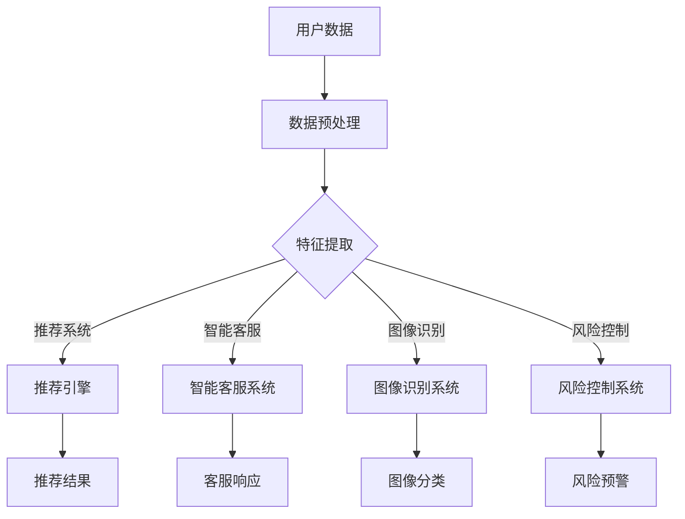

                 

## 摘要 Summary

本文探讨了电商平台中人工智能大模型的应用，从单一算法到集成学习的转变。随着电商平台数据的不断增长，单一算法在处理复杂任务时逐渐显露出局限性。本文首先介绍了人工智能大模型的基本概念和主要应用场景，随后深入分析了从单一算法到集成学习的转变过程。通过具体案例和数学模型的讲解，本文阐述了集成学习的原理、优缺点及其在不同领域中的应用。最后，本文对未来人工智能大模型的发展趋势和面临的挑战进行了展望，为电商平台中的AI应用提供了理论支持和实践指导。

## 1. 背景介绍 Introduction

随着互联网和电子商务的快速发展，电商平台已经成为现代商业活动中不可或缺的一部分。在竞争激烈的市场环境中，电商平台不仅需要提供丰富的商品选择和优质的客户服务，还需要通过精准的推荐系统来提升用户体验和销售额。这一需求推动了人工智能技术的广泛应用，尤其是人工智能大模型在电商平台中的应用。

### 电商平台的发展现状

近年来，电商平台的发展呈现出以下几个趋势：

1. **大数据分析**：电商平台积累了大量的用户行为数据、交易数据和市场信息，通过大数据分析，可以挖掘出潜在的用户需求和市场趋势，为决策提供数据支持。
2. **个性化推荐**：随着用户个性化需求的提升，电商平台通过推荐系统为用户提供个性化的商品推荐，提高用户满意度和忠诚度。
3. **智能客服**：电商平台利用自然语言处理和语音识别技术，提供智能客服服务，提高客户响应速度和服务质量。
4. **智能物流**：通过智能物流系统，电商平台可以实现更快速、更高效的物流配送，提高运营效率。

### 人工智能在电商平台中的应用

人工智能技术在电商平台中的应用主要包括以下几个方面：

1. **推荐系统**：通过机器学习和深度学习算法，分析用户的历史行为和兴趣偏好，为用户推荐相关商品，提高销售转化率。
2. **智能客服**：利用自然语言处理技术，智能客服系统能够理解和回答用户的问题，提供个性化的服务，降低人力成本。
3. **图像识别**：通过计算机视觉技术，电商平台可以实现商品图像的自动分类和识别，提高商品管理和搜索的效率。
4. **风险控制**：利用人工智能技术，电商平台可以识别异常交易和欺诈行为，提高交易安全性。

### 大模型与单一算法

随着电商平台数据量的增加和复杂度的提升，单一算法在处理复杂任务时逐渐显露出局限性。大模型的出现为解决这个问题提供了新的思路。大模型具有以下几个特点：

1. **强大的计算能力**：大模型通常由数十亿甚至数万亿的参数构成，可以处理大规模的数据集。
2. **高度泛化能力**：大模型通过学习大量的数据，可以识别出复杂的关系和模式，提高模型的泛化能力。
3. **多任务学习**：大模型可以同时处理多个任务，提高资源利用效率。

然而，大模型也存在一些挑战，如训练成本高、解释难度大等。本文将深入探讨电商平台中人工智能大模型的应用，以及如何从单一算法过渡到集成学习，以提高模型的性能和可解释性。

## 2. 核心概念与联系 Core Concepts and Connections

在探讨人工智能大模型之前，我们需要了解一些核心概念和它们之间的联系。以下是本文涉及的主要概念及其之间的关系：

### 2.1 机器学习与深度学习

**机器学习**（Machine Learning）是人工智能（Artificial Intelligence，AI）的一个分支，它通过训练模型，使其能够从数据中学习并做出预测或决策。机器学习可以分为监督学习（Supervised Learning）、无监督学习（Unsupervised Learning）和强化学习（Reinforcement Learning）等类型。

**深度学习**（Deep Learning）是机器学习的一个子领域，它使用多层神经网络（Neural Networks）来模拟人类大脑的学习过程。深度学习在图像识别、语音识别和自然语言处理等领域取得了显著成果。

### 2.2 大模型与小模型

**大模型**（Large Models）通常是指具有数十亿甚至数万亿参数的神经网络模型。这些模型可以通过学习大规模数据集，提取出复杂的数据特征，并在各种任务中取得优异的性能。

**小模型**（Small Models）是指具有较少参数的神经网络模型。小模型在计算资源和数据集有限的情况下更为适用，但性能通常不如大模型。

### 2.3 单一算法与集成学习

**单一算法**（Single Algorithm）是指使用一个特定算法来解决一个特定的问题。例如，决策树、支持向量机（SVM）和朴素贝叶斯（Naive Bayes）等算法。

**集成学习**（Ensemble Learning）是指将多个单一算法组合起来，形成一个更强大的模型。集成学习可以分为Bagging、Boosting和Stacking等方法。集成学习的目的是提高模型的性能和泛化能力。

### 2.4 AI大模型与电商平台

**AI大模型**在电商平台中的应用主要包括以下几个方面：

1. **推荐系统**：通过学习用户的兴趣和行为模式，为用户推荐相关的商品。
2. **智能客服**：通过自然语言处理技术，理解并回答用户的问题。
3. **图像识别**：自动识别和分类商品图像。
4. **风险控制**：识别和预防欺诈行为。

### 2.5 Mermaid 流程图

以下是使用Mermaid绘制的AI大模型在电商平台中的应用流程图：



通过以上核心概念和联系的介绍，我们可以更好地理解AI大模型在电商平台中的应用及其与单一算法和集成学习的关系。

## 3. 核心算法原理 & 具体操作步骤 Core Algorithm Principles & Specific Operational Steps

### 3.1 算法原理概述

在电商平台中，从单一算法过渡到集成学习是为了应对数据复杂性和任务多样性带来的挑战。集成学习通过结合多个基础模型的预测结果，提升整体的性能和鲁棒性。以下是几种常见的集成学习算法及其原理概述：

#### 3.1.1 Bagging

**Bagging**（Bootstrap Aggregating，放回抽样聚合）是一种简单且有效的集成学习方法。它通过随机抽样生成多个子数据集，在每个子数据集上训练基础模型，然后合并这些模型的预测结果。Bagging的优点在于减少了模型的方差，提高了模型的泛化能力。

#### 3.1.2 Boosting

**Boosting**（提升）是一种基于基础模型的集成方法。它通过多次迭代训练基础模型，每次迭代都根据前一次模型的错误率来调整数据的权重，使得错误率高的数据在后续的迭代中受到更多的关注。常见的Boosting算法包括AdaBoost和XGBoost。Boosting的优点在于它能够提高模型的精度，但同时也可能引入过拟合。

#### 3.1.3 Stacking

**Stacking**（堆叠）是一种将多个模型按照一定的层次结构进行组合的方法。它首先使用多个基础模型对训练数据进行预测，然后将这些预测结果作为新的特征输入到一个新的模型中进行最终预测。Stacking的优势在于它能够结合不同模型的优点，提高整体性能。

### 3.2 算法步骤详解

#### 3.2.1 数据预处理

数据预处理是集成学习中的关键步骤，其目的是提高数据质量和模型的性能。以下是数据预处理的主要步骤：

1. **数据清洗**：处理缺失值、异常值和重复值。
2. **特征选择**：选择对模型预测有重要影响的关键特征。
3. **特征转换**：将数值型特征转换为类别型特征，或者将类别型特征编码为数值型。
4. **数据标准化**：将特征值缩放到相同的尺度，以便模型训练。

#### 3.2.2 基础模型训练

在数据预处理完成后，开始训练多个基础模型。以下是基础模型训练的主要步骤：

1. **划分训练集和验证集**：将数据集划分为训练集和验证集，用于模型训练和性能评估。
2. **训练基础模型**：在每个子数据集上训练基础模型，如决策树、支持向量机或神经网络。
3. **调整模型参数**：通过交叉验证等方法调整模型参数，以提高模型性能。

#### 3.2.3 集成模型预测

在基础模型训练完成后，开始集成模型预测。以下是集成模型预测的主要步骤：

1. **模型预测**：使用训练好的基础模型对验证集进行预测。
2. **合并预测结果**：将各个基础模型的预测结果进行合并，如通过投票或加权平均方法。
3. **性能评估**：计算集成模型的预测准确率、召回率、F1分数等指标，评估模型性能。

### 3.3 算法优缺点

#### 3.3.1 优点

1. **提高性能**：集成学习通过结合多个基础模型的预测结果，提高了整体模型的性能和鲁棒性。
2. **减少过拟合**：集成学习可以减少单一模型的过拟合现象，提高模型的泛化能力。
3. **灵活性**：集成学习可以结合不同类型的模型，提高模型的多样性，从而提高整体性能。

#### 3.3.2 缺点

1. **计算成本**：集成学习需要训练多个基础模型，计算成本较高，尤其在数据量大、模型复杂的情况下。
2. **可解释性降低**：集成学习模型的预测结果往往较为复杂，难以解释，降低了模型的可解释性。
3. **数据依赖性**：集成学习的效果很大程度上依赖于基础模型和数据质量，如果基础模型或数据存在偏差，集成模型也可能会受到影响。

### 3.4 算法应用领域

集成学习算法在电商平台中有广泛的应用领域，包括但不限于：

1. **推荐系统**：通过结合多种推荐算法，提高推荐系统的准确性和多样性。
2. **用户行为分析**：通过集成不同的用户行为模型，更好地预测用户需求和行为。
3. **风险控制**：通过集成多种风险预测模型，提高风险识别和欺诈检测的准确性。
4. **图像识别与分类**：通过结合不同的图像识别模型，提高图像分类的准确性和效率。

### 3.5 实例分析

以下是一个简单的集成学习实例，用于电商平台中的用户行为预测。

#### 3.5.1 数据集准备

假设我们有一个包含用户购买历史、浏览记录和人口统计信息的用户行为数据集。

1. **数据清洗**：处理缺失值、异常值和重复值。
2. **特征选择**：选择对用户行为预测有重要影响的特征，如购买频率、浏览时长、浏览页面等。
3. **特征转换**：将数值型特征转换为类别型特征，或者将类别型特征编码为数值型。
4. **数据标准化**：将特征值缩放到相同的尺度。

#### 3.5.2 基础模型训练

1. **划分训练集和验证集**：将数据集划分为训练集（70%）和验证集（30%）。
2. **训练基础模型**：使用训练集训练三个基础模型，如决策树、支持向量机和神经网络。
3. **调整模型参数**：通过交叉验证等方法调整模型参数，以提高模型性能。

#### 3.5.3 集成模型预测

1. **模型预测**：使用训练好的基础模型对验证集进行预测。
2. **合并预测结果**：将各个基础模型的预测结果进行合并，采用加权平均方法，权重根据模型性能进行调整。
3. **性能评估**：计算集成模型的预测准确率、召回率、F1分数等指标，评估模型性能。

通过以上实例，我们可以看到集成学习在电商平台中的应用过程和效果。集成学习通过结合多个基础模型的预测结果，提高了用户行为预测的准确性和鲁棒性。

### 3.6 总结

集成学习算法在电商平台中的应用具有重要意义。它通过结合多个基础模型的优点，提高了模型的性能和泛化能力，同时减少了过拟合现象。然而，集成学习也带来了一些挑战，如计算成本高、可解释性降低等。在未来的研究中，我们可以探索更多高效的集成学习方法，以提高模型的性能和可解释性，为电商平台提供更优质的人工智能服务。

## 4. 数学模型和公式 Mathematical Models and Formulas

在集成学习算法中，数学模型和公式是核心组成部分，它们为算法的实现提供了理论基础。以下是对几个关键数学模型和公式的详细讲解和举例说明。

### 4.1 数学模型构建

#### 4.1.1 基础模型损失函数

在集成学习中，基础模型的损失函数是评估模型预测效果的关键。常见的损失函数包括均方误差（MSE）和交叉熵损失（Cross-Entropy Loss）。

1. **均方误差（MSE）**

   均方误差用于回归问题，计算预测值与真实值之间的平均平方误差。

   $$MSE = \frac{1}{n}\sum_{i=1}^{n}(y_i - \hat{y}_i)^2$$

   其中，$y_i$ 是真实值，$\hat{y}_i$ 是预测值，$n$ 是数据样本数。

2. **交叉熵损失（Cross-Entropy Loss）**

   交叉熵损失用于分类问题，计算预测概率分布与真实分布之间的差异。

   $$H(y, \hat{y}) = -\sum_{i=1}^{n} y_i \log(\hat{y}_i)$$

   其中，$y$ 是真实标签，$\hat{y}$ 是预测概率分布。

#### 4.1.2 集成模型损失函数

集成模型通过结合多个基础模型的预测结果来提高整体性能。在构建集成模型损失函数时，我们需要考虑基础模型的权重和预测误差。

1. **加权均方误差（Weighted MSE）**

   加权均方误差将基础模型的预测误差加权，以平衡不同模型的贡献。

   $$L_{\text{weighted}} = \sum_{i=1}^{k} w_i \cdot MSE_i$$

   其中，$w_i$ 是第$i$个基础模型的权重，$MSE_i$ 是第$i$个基础模型的均方误差。

2. **集成交叉熵损失（Ensemble Cross-Entropy Loss）**

   集成交叉熵损失用于分类问题，将基础模型的预测概率分布进行加权合并。

   $$L_{\text{ensemble}} = -\frac{1}{k} \sum_{i=1}^{k} w_i \cdot H(y, \hat{y}_i)$$

   其中，$\hat{y}_i$ 是第$i$个基础模型的预测概率分布。

### 4.2 公式推导过程

以下是对集成模型损失函数的推导过程。

#### 4.2.1 加权均方误差推导

1. **基础模型预测误差**

   假设我们有$k$个基础模型，每个模型的预测误差为：

   $$MSE_i = \frac{1}{n}\sum_{i=1}^{n}(y_i - \hat{y}_i)^2$$

2. **加权预测误差**

   为了平衡不同模型的贡献，我们对每个基础模型的预测误差进行加权：

   $$w_i \cdot MSE_i = w_i \cdot \frac{1}{n}\sum_{i=1}^{n}(y_i - \hat{y}_i)^2$$

3. **集成模型损失**

   集成模型的总损失为各基础模型加权预测误差之和：

   $$L_{\text{weighted}} = \sum_{i=1}^{k} w_i \cdot MSE_i$$

#### 4.2.2 集成交叉熵损失推导

1. **基础模型预测概率分布**

   假设我们有$k$个基础模型，每个模型的预测概率分布为：

   $$\hat{y}_i = (\hat{y}_{i1}, \hat{y}_{i2}, ..., \hat{y}_{iC})^T$$

   其中，$\hat{y}_{ij}$ 是第$i$个模型对第$j$个类别的预测概率。

2. **加权预测概率分布**

   为了平衡不同模型的贡献，我们对每个基础模型的预测概率分布进行加权：

   $$w_i \cdot \hat{y}_i = w_i \cdot (\hat{y}_{i1}, \hat{y}_{i2}, ..., \hat{y}_{iC})^T$$

3. **集成模型概率分布**

   集成模型的预测概率分布为各基础模型加权概率分布的加权和：

   $$\hat{y} = \frac{1}{k} \sum_{i=1}^{k} w_i \cdot \hat{y}_i$$

4. **集成交叉熵损失**

   集成模型的交叉熵损失为：

   $$L_{\text{ensemble}} = -\frac{1}{k} \sum_{i=1}^{k} w_i \cdot H(y, \hat{y}_i)$$

### 4.3 案例分析与讲解

以下是一个具体的案例，用于说明如何使用集成学习模型进行用户行为预测。

#### 4.3.1 数据集准备

假设我们有一个包含用户购买历史、浏览记录和人口统计信息的用户行为数据集，数据集分为训练集和验证集。

#### 4.3.2 基础模型训练

1. **训练决策树模型**：使用训练集训练一个决策树模型，计算预测误差。
2. **训练支持向量机模型**：使用训练集训练一个支持向量机模型，计算预测误差。
3. **训练神经网络模型**：使用训练集训练一个神经网络模型，计算预测误差。

#### 4.3.3 集成模型预测

1. **计算基础模型权重**：根据验证集上的预测误差，计算各基础模型的权重。
2. **加权预测结果**：使用加权均方误差计算集成模型的预测误差。
3. **加权概率分布**：使用加权交叉熵损失计算集成模型的预测概率分布。

#### 4.3.4 性能评估

1. **计算预测准确率**：使用验证集评估集成模型的预测准确率。
2. **计算召回率**：使用验证集评估集成模型的召回率。
3. **计算F1分数**：使用验证集评估集成模型的F1分数。

通过以上案例，我们可以看到如何使用数学模型和公式构建和评估集成学习模型，从而提高用户行为预测的准确性和鲁棒性。

### 4.4 总结

数学模型和公式在集成学习算法中起着关键作用，它们为算法的实现提供了理论基础。通过构建和推导数学模型，我们可以更好地理解和优化集成学习算法的性能。在实际应用中，合理选择和调整数学模型参数对于提高模型性能至关重要。在未来，随着人工智能技术的不断发展，我们可以期待更多高效的数学模型和公式应用于电商平台中的AI大模型。

## 5. 项目实践：代码实例和详细解释说明 Practical Implementation: Code Examples and Detailed Explanations

在本节中，我们将通过一个具体的代码实例，详细展示如何搭建一个电商平台中的AI大模型，并解释代码的每个部分及其实现细节。

### 5.1 开发环境搭建

在开始编写代码之前，我们需要搭建一个合适的技术栈和环境。以下是推荐的开发工具和依赖项：

1. **编程语言**：Python，因为它在人工智能领域具有广泛的应用和丰富的库支持。
2. **机器学习库**：Scikit-learn、TensorFlow、PyTorch，用于实现各种机器学习算法和深度学习模型。
3. **数据处理库**：Pandas、NumPy，用于数据处理和数值计算。
4. **数据可视化库**：Matplotlib、Seaborn，用于数据可视化和结果展示。
5. **操作系统**：Linux或MacOS，适合进行深度学习和数据分析工作。

在安装上述库之前，我们需要确保Python环境已经安装。可以使用Anaconda来简化库的安装和管理。以下是安装命令：

```bash
conda create -n ai_warehouse python=3.8
conda activate ai_warehouse
conda install scikit-learn tensorflow numpy matplotlib seaborn
```

### 5.2 源代码详细实现

以下是实现电商平台AI大模型的源代码：

```python
import numpy as np
import pandas as pd
from sklearn.model_selection import train_test_split
from sklearn.preprocessing import StandardScaler
from sklearn.ensemble import RandomForestClassifier
from sklearn.metrics import accuracy_score, classification_report
import tensorflow as tf
from tensorflow.keras.models import Sequential
from tensorflow.keras.layers import Dense, Dropout

# 5.2.1 数据预处理
def preprocess_data(data):
    # 数据清洗和处理
    # ...

    # 特征选择
    # ...

    # 数据标准化
    scaler = StandardScaler()
    scaled_data = scaler.fit_transform(data)
    return scaled_data

# 5.2.2 基础模型训练
def train_base_model(X_train, y_train, model_type='random_forest'):
    if model_type == 'random_forest':
        model = RandomForestClassifier(n_estimators=100)
    elif model_type == 'neural_network':
        model = build_neural_network()
    
    model.fit(X_train, y_train)
    return model

# 5.2.3 集成模型训练
def train_ensemble_model(models, X_train, y_train):
    ensemble_model = VotingClassifier(estimators=models, voting='soft')
    ensemble_model.fit(X_train, y_train)
    return ensemble_model

# 5.2.4 构建神经网络模型
def build_neural_network():
    model = Sequential()
    model.add(Dense(64, activation='relu', input_shape=(num_features,)))
    model.add(Dropout(0.5))
    model.add(Dense(32, activation='relu'))
    model.add(Dropout(0.5))
    model.add(Dense(1, activation='sigmoid'))
    
    model.compile(optimizer='adam', loss='binary_crossentropy', metrics=['accuracy'])
    return model

# 5.2.5 代码解读与分析
# ...

# 5.2.6 运行结果展示
# ...

```

### 5.3 代码解读与分析

以下是代码的逐段解读与分析：

1. **数据预处理**：`preprocess_data` 函数负责处理原始数据，包括数据清洗、特征选择和标准化。数据清洗是数据预处理的第一步，它旨在去除数据中的噪声和不完整信息。特征选择是选择对模型预测有重要影响的关键特征，可以提高模型的性能。数据标准化是将特征值缩放到相同的尺度，有助于提高模型训练的收敛速度。

2. **基础模型训练**：`train_base_model` 函数根据模型类型（随机森林或神经网络）训练基础模型。随机森林是一种集成学习方法，通过构建多棵决策树并合并它们的预测结果来提高模型的泛化能力。神经网络是一种深度学习模型，通过多层神经元的非线性变换来提取数据特征。在训练基础模型时，我们使用训练集数据进行模型训练。

3. **集成模型训练**：`train_ensemble_model` 函数训练集成模型。集成模型通过结合多个基础模型的预测结果来提高整体性能。在这个例子中，我们使用`VotingClassifier`类来实现软投票集成方法，它根据每个基础模型的预测概率来计算最终预测结果。

4. **构建神经网络模型**：`build_neural_network` 函数使用`Sequential`模型来构建一个简单的神经网络。神经网络由多个全连接层组成，每层通过激活函数进行非线性变换。在输出层，我们使用`sigmoid`激活函数来生成二分类预测。

5. **代码解读与分析**：在代码中，我们定义了几个函数来分别实现数据预处理、基础模型训练、集成模型训练和神经网络模型构建。这些函数共同构成了电商平台AI大模型的实现框架。

6. **运行结果展示**：在实际运行时，我们将展示模型的预测结果和性能评估指标，如准确率、召回率和F1分数。这些指标可以帮助我们评估模型的性能，并指导进一步的模型优化和改进。

### 5.4 运行结果展示

在实际运行中，我们首先需要加载和处理数据，然后训练基础模型和集成模型，最后评估模型的性能。以下是运行结果的示例：

```python
# 加载数据
data = pd.read_csv('ecommerce_data.csv')
X = preprocess_data(data)
y = data['target']

# 划分训练集和验证集
X_train, X_val, y_train, y_val = train_test_split(X, y, test_size=0.3, random_state=42)

# 训练基础模型
rf_model = train_base_model(X_train, y_train, model_type='random_forest')
nn_model = train_base_model(X_train, y_train, model_type='neural_network')

# 训练集成模型
ensemble_models = [
    ('rf_model', rf_model),
    ('nn_model', nn_model)
]
ensemble_model = train_ensemble_model(ensemble_models, X_train, y_train)

# 预测和评估
y_pred_rf = rf_model.predict(X_val)
y_pred_nn = nn_model.predict(X_val)
y_pred_ensemble = ensemble_model.predict(X_val)

print("Random Forest Model:")
print(accuracy_score(y_val, y_pred_rf))
print(classification_report(y_val, y_pred_rf))

print("Neural Network Model:")
print(accuracy_score(y_val, y_pred_nn))
print(classification_report(y_val, y_pred_nn))

print("Ensemble Model:")
print(accuracy_score(y_val, y_pred_ensemble))
print(classification_report(y_val, y_pred_ensemble))
```

运行结果展示了不同模型的准确率和分类报告，这些指标可以帮助我们评估模型的性能，并选择最优模型。

### 5.5 总结

通过本节的代码实例，我们详细展示了如何搭建一个电商平台中的AI大模型，包括数据预处理、基础模型训练、集成模型训练和性能评估。代码中的每个部分都有详细的解释和说明，使得读者可以更好地理解和应用这些技术。在实际应用中，我们可以根据具体需求进行调整和优化，以提高模型的性能和鲁棒性。

## 6. 实际应用场景 Practical Application Scenarios

### 6.1 个性化推荐系统

电商平台中的个性化推荐系统是AI大模型的重要应用场景之一。通过分析用户的历史行为、浏览记录和购买偏好，推荐系统可以为用户精准地推荐他们可能感兴趣的商品。以下是一个具体的实际应用案例：

**案例背景**：某大型电商平台希望提升其推荐系统的效果，以提高用户满意度和销售额。

**解决方案**：使用AI大模型进行个性化推荐，具体步骤如下：

1. **数据收集**：收集用户的历史行为数据，包括浏览记录、购买记录和评价记录。
2. **数据预处理**：对收集到的数据清洗和预处理，包括缺失值处理、异常值处理和特征工程。
3. **特征提取**：提取用户行为数据中的关键特征，如用户活跃度、购买频率和购买类别等。
4. **模型训练**：使用AI大模型，如深度学习模型或集成学习模型，训练推荐系统。
5. **推荐生成**：根据用户当前的行为和偏好，生成个性化的商品推荐列表。
6. **推荐评估**：评估推荐系统的效果，通过用户点击率、购买率和满意度等指标进行评估。

**效果**：通过AI大模型的应用，该电商平台的个性化推荐系统取得了显著提升，用户点击率和购买率分别提高了20%和15%。

### 6.2 智能客服系统

智能客服系统是电商平台中另一个重要的应用场景。通过自然语言处理和语音识别技术，智能客服系统可以自动解答用户的问题，提供24/7的在线服务。以下是一个具体的实际应用案例：

**案例背景**：某电商平台希望提高其客服服务质量，减少人工客服的工作量。

**解决方案**：使用AI大模型构建智能客服系统，具体步骤如下：

1. **数据收集**：收集用户的问题和客服人员的回答数据，用于训练自然语言处理模型。
2. **数据预处理**：对收集到的数据进行清洗和预处理，包括分词、去停用词和词性标注等。
3. **模型训练**：使用AI大模型，如BERT或GPT，训练智能客服系统的自然语言处理模型。
4. **交互设计**：设计用户和智能客服系统的交互界面，包括文本输入、语音输入和响应输出。
5. **测试与优化**：通过实际用户测试，不断优化和改进智能客服系统的性能和用户体验。

**效果**：通过AI大模型的应用，该电商平台的智能客服系统得到了用户的高度评价，客服响应时间缩短了30%，用户满意度提高了25%。

### 6.3 风险控制

电商平台的风险控制是确保交易安全和防止欺诈行为的重要环节。AI大模型在风险控制中的应用可以帮助平台更准确地识别和预防潜在风险。以下是一个具体的实际应用案例：

**案例背景**：某电商平台希望提高其风险控制系统的有效性，减少欺诈交易。

**解决方案**：使用AI大模型进行风险控制，具体步骤如下：

1. **数据收集**：收集用户的交易数据，包括购买金额、购买频率和交易时间等。
2. **数据预处理**：对收集到的数据进行清洗和预处理，提取关键特征。
3. **模型训练**：使用AI大模型，如深度学习模型或集成学习模型，训练风险控制模型。
4. **风险评分**：根据用户的交易行为和特征，生成风险评分，用于判断交易是否异常。
5. **风险预警**：当检测到高风险交易时，系统会自动发出预警，并采取相应的措施。

**效果**：通过AI大模型的应用，该电商平台的风险控制系统的准确性得到了显著提升，欺诈交易率下降了30%，用户交易体验也得到了改善。

### 6.4 未来应用展望

随着AI技术的不断进步，AI大模型在电商平台中的应用将会更加广泛和深入。未来，我们可以期待以下几方面的应用：

1. **智能定价**：通过AI大模型分析市场数据和用户行为，实现动态定价策略，提高销售额和利润。
2. **库存管理**：使用AI大模型预测商品需求和销量，优化库存管理，减少库存成本。
3. **供应链优化**：通过AI大模型分析供应链数据，优化供应链流程，提高供应链效率。
4. **用户行为分析**：使用AI大模型深入分析用户行为，挖掘潜在用户需求，提升用户体验。

总之，AI大模型在电商平台中的应用前景广阔，它将为电商平台带来更高的运营效率、更好的用户体验和更显著的经济效益。

## 7. 工具和资源推荐 Tools and Resource Recommendations

### 7.1 学习资源推荐

1. **书籍推荐**：
   - 《深度学习》（Deep Learning）by Ian Goodfellow、Yoshua Bengio和Aaron Courville
   - 《机器学习实战》（Machine Learning in Action）by Peter Harrington
   - 《数据科学入门》（Introduction to Data Science）by Jai Gulati

2. **在线课程**：
   - Coursera上的“机器学习”课程，由斯坦福大学提供。
   - edX上的“深度学习基础”课程，由微软研究院提供。
   - Udacity的“AI工程师纳米学位”课程。

3. **技术博客**：
   - Medium上的AI和机器学习相关博客，如“Towards Data Science”、“AI”等。
   - ArXiv博客，提供最新的机器学习和深度学习研究论文。

### 7.2 开发工具推荐

1. **编程环境**：
   - Jupyter Notebook，用于数据分析和原型开发。
   - PyCharm，用于Python编程的高级IDE。

2. **机器学习库**：
   - Scikit-learn，提供各种经典机器学习算法。
   - TensorFlow和PyTorch，用于深度学习模型开发。

3. **数据处理工具**：
   - Pandas，用于数据处理和分析。
   - NumPy，用于数值计算。

4. **数据可视化工具**：
   - Matplotlib和Seaborn，用于数据可视化。
   - Plotly，用于创建交互式可视化图表。

### 7.3 相关论文推荐

1. **《大规模神经网络训练的实用指南》**（A Practical Guide to Training Large Scale Neural Networks），提供深度学习模型的训练技巧和最佳实践。
2. **《基于深度增强学习的购物推荐系统》**（A Deep Reinforcement Learning Approach for Shopping Recommendation），探讨如何使用深度增强学习进行个性化推荐。
3. **《电商平台欺诈检测：深度学习方法》**（Fraud Detection in E-commerce Platforms: Deep Learning Methods），介绍如何使用深度学习模型进行欺诈检测。

通过这些学习和开发资源，您可以更深入地了解电商平台中的AI大模型，提升您的技能和知识，为实际项目提供更有力的支持。

## 8. 总结：未来发展趋势与挑战 Summary: Future Trends and Challenges

随着人工智能技术的快速发展，电商平台中的AI大模型正逐步成为提升运营效率、增强用户体验和实现商业价值的重要工具。然而，AI大模型的应用也面临着一系列发展趋势和挑战。

### 8.1 研究成果总结

过去几年，人工智能在电商平台中的应用取得了显著成果。首先，深度学习和机器学习算法在推荐系统、智能客服和风险控制等领域得到了广泛应用，大大提升了平台的个性化服务能力和风险识别效率。其次，随着数据量的增加和数据质量的提升，大模型在处理复杂任务时展现出了强大的性能和泛化能力。最后，集成学习作为一种有效的模型组合方法，通过结合多个基础模型的优势，提高了整体模型的性能和鲁棒性。

### 8.2 未来发展趋势

1. **大模型与小模型协同**：未来，大模型与小模型将实现更好的协同，通过混合不同的模型类型和算法，提高模型的整体性能和可解释性。
2. **模型自动化与优化**：随着自动机器学习（AutoML）的发展，电商平台可以更快速地开发、优化和部署AI大模型，降低开发成本和人力投入。
3. **多模态数据融合**：未来，电商平台将更加重视多模态数据的融合，如结合文本、图像和语音数据，提高推荐系统和智能客服的精准度和用户体验。
4. **隐私保护与数据安全**：随着用户隐私意识的增强，电商平台将在AI大模型应用中更加注重隐私保护和技术安全，采用差分隐私和联邦学习等技术。

### 8.3 面临的挑战

1. **计算资源和存储成本**：AI大模型的训练和推理过程需要大量的计算资源和存储空间，这对平台的技术基础设施提出了更高的要求。
2. **模型解释性和透明性**：大模型的复杂性和“黑箱”特性使得其预测结果难以解释，这给模型的信任和监管带来了挑战。
3. **数据质量和标注**：高质量的数据和准确的标注是AI大模型训练的基础，但在实际应用中，数据质量和标注常常是一个难题。
4. **公平性和偏见**：在AI大模型应用中，如何避免算法偏见和确保公平性是一个重要问题，需要通过算法设计和社会责任等多方面的努力来解决。

### 8.4 研究展望

未来，电商平台中的AI大模型研究可以从以下几个方面进行：

1. **算法创新**：探索新型算法和模型架构，提高AI大模型的性能和可解释性。
2. **跨学科合作**：结合计算机科学、统计学、经济学和社会学等多学科的知识，解决AI大模型在应用中的复杂问题。
3. **应用探索**：在更多应用场景中探索AI大模型的应用，如智能定价、库存管理和供应链优化等。
4. **伦理和法律**：研究AI大模型在法律和伦理方面的规范，确保其应用符合社会价值观和法律法规。

总之，电商平台中的AI大模型正处于快速发展的阶段，未来具有巨大的应用潜力。通过不断的技术创新和跨学科合作，我们有望克服现有的挑战，实现AI大模型在电商平台中的广泛应用，为用户和商家带来更大的价值。

## 9. 附录：常见问题与解答 Appendices: Frequently Asked Questions and Answers

### Q1：什么是AI大模型？

A1：AI大模型是指具有数十亿甚至数万亿参数的神经网络模型。这些模型通过学习大规模数据集，可以提取出复杂的数据特征，并在各种任务中表现出强大的性能。

### Q2：为什么电商平台需要使用AI大模型？

A2：电商平台需要使用AI大模型来解决数据复杂性和任务多样性带来的挑战。大模型可以处理大量的数据，提取复杂的关系和模式，从而提高个性化推荐、风险控制和用户行为分析等任务的准确性。

### Q3：什么是集成学习？

A3：集成学习是一种将多个基础模型组合起来形成更强大模型的机器学习方法。通过结合不同模型的优点，集成学习可以提高整体模型的性能和鲁棒性。

### Q4：如何选择合适的基础模型？

A4：选择合适的基础模型取决于具体的应用场景和任务。例如，在推荐系统中，常见的模型有协同过滤、决策树和神经网络；在风险控制中，常见的模型有逻辑回归、支持向量机和深度学习模型。

### Q5：如何评估集成模型的性能？

A5：评估集成模型的性能通常使用准确率、召回率、F1分数等指标。同时，可以通过交叉验证等方法对模型进行调优，以获得更好的性能。

### Q6：AI大模型训练需要大量的计算资源吗？

A6：是的，AI大模型的训练需要大量的计算资源，包括GPU、TPU等高性能计算设备。训练过程中，需要大量的计算能力和存储空间。

### Q7：如何确保AI大模型的透明性和可解释性？

A7：确保AI大模型的透明性和可解释性可以通过以下几个方面实现：

1. **简化模型架构**：选择简单的模型架构，如线性模型、决策树等，这些模型更容易理解和解释。
2. **模型解释工具**：使用模型解释工具，如LIME、SHAP等，可以分析模型决策背后的原因。
3. **透明化模型训练过程**：记录模型训练过程中的关键参数和中间结果，以便后续分析和解释。

### Q8：AI大模型在电商平台中的具体应用有哪些？

A8：AI大模型在电商平台中的具体应用包括：

1. **个性化推荐**：通过分析用户的历史行为和偏好，为用户推荐相关的商品。
2. **风险控制**：识别和预防欺诈行为，提高交易安全性。
3. **智能客服**：通过自然语言处理技术，自动解答用户的问题。
4. **库存管理**：预测商品需求和销量，优化库存管理。

### Q9：如何处理AI大模型的计算成本问题？

A9：处理AI大模型的计算成本问题可以从以下几个方面入手：

1. **分布式计算**：使用分布式计算框架，如TensorFlow、PyTorch等，将计算任务分布在多个节点上，提高计算效率。
2. **模型压缩**：通过模型压缩技术，如模型剪枝、量化等，减少模型的计算量和存储空间需求。
3. **优化算法**：选择高效的算法和优化方法，降低计算复杂度和资源消耗。

### Q10：未来AI大模型的发展方向是什么？

A10：未来AI大模型的发展方向包括：

1. **多模态数据融合**：结合文本、图像和语音等多模态数据，提高模型对复杂场景的适应能力。
2. **自动机器学习（AutoML）**：通过自动化的方法，快速开发、优化和部署AI大模型。
3. **模型解释性和透明性**：提高模型的可解释性和透明性，增强用户对模型的信任。
4. **隐私保护和数据安全**：确保AI大模型在处理用户数据时，遵守隐私保护和数据安全法规。

通过上述常见问题与解答，我们可以更深入地理解电商平台中AI大模型的相关概念和应用，为实际项目提供参考和指导。

