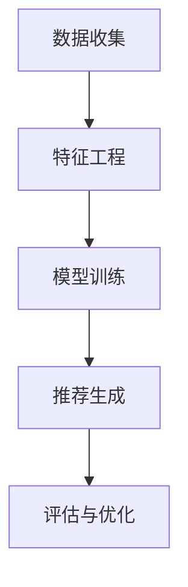

                 

关键词：人工智能，电商平台，大模型，推荐系统，全场景应用

摘要：本文将深入探讨人工智能在电商平台中的应用，特别是大型AI模型如何从推荐系统扩展到电商平台的全场景应用。我们将首先介绍AI大模型的基本概念，然后详细讲解其在电商平台推荐系统中的核心原理和应用，最后探讨AI大模型在电商平台其他场景的拓展和应用前景。

## 1. 背景介绍

随着互联网的快速发展，电商平台已经成为现代商业的重要组成部分。电商平台不仅为消费者提供了便捷的购物体验，也为商家提供了广阔的销售渠道。然而，随着竞争的加剧，电商平台需要不断提升用户体验和运营效率，以在激烈的市场竞争中脱颖而出。

人工智能（AI）作为当今最具前瞻性的技术之一，已经在各个领域展现出了巨大的潜力。在电商领域，AI的应用不仅能够提升用户满意度，还能够显著提高平台的运营效率。其中，AI大模型在电商平台中的角色尤为重要。大模型通常指的是参数量极大的神经网络模型，它们能够在大量数据上进行训练，从而获得非常高的准确性和泛化能力。

本文旨在探讨AI大模型在电商平台中的应用，特别是如何从推荐系统扩展到全场景应用。我们将首先介绍AI大模型的基本概念，然后详细讲解其在推荐系统中的应用，最后探讨其在电商平台其他场景的应用前景。

### 人工智能在电商领域的应用

人工智能在电商领域的应用已经相当广泛，主要包括以下几个方面：

1. **推荐系统**：通过分析用户的历史行为和偏好，AI推荐系统可以准确预测用户的兴趣，从而提供个性化的商品推荐。

2. **图像识别**：AI图像识别技术可以帮助电商平台快速识别和分类商品，提高用户浏览和搜索的效率。

3. **聊天机器人**：智能聊天机器人可以提供7x24小时的客户服务，解答用户的疑问，提高用户满意度。

4. **价格优化**：AI算法可以根据市场需求和用户行为数据，自动调整商品价格，提高利润率。

5. **库存管理**：通过分析历史销售数据，AI可以帮助电商平台预测未来销量，优化库存管理，减少库存积压。

### AI大模型的基本概念

AI大模型通常指的是具有数百万甚至数十亿参数的神经网络模型。这些模型在训练过程中需要大量的数据，并且计算资源需求较高。大模型的显著特点是它们能够在非常复杂的数据集上取得非常好的性能，从而解决传统方法难以解决的问题。

大模型的核心优势在于其强大的表示能力和泛化能力。通过在大规模数据集上进行训练，大模型能够学习到数据中的复杂模式和潜在规律，从而在新的数据上表现出良好的泛化能力。这使得大模型在许多应用领域都取得了突破性的进展，例如自然语言处理、计算机视觉和语音识别等。

### AI大模型在电商平台的潜在应用

AI大模型在电商平台的应用潜力巨大，不仅限于推荐系统，还可以扩展到其他多个场景。例如：

1. **个性化营销**：通过分析用户的购买行为、浏览记录等数据，AI大模型可以提供高度个性化的营销活动，提高转化率。

2. **风险控制**：AI大模型可以分析用户的交易行为，识别潜在的欺诈风险，提高交易的安全性。

3. **供应链优化**：通过预测市场需求和库存变化，AI大模型可以帮助电商平台优化供应链管理，提高运营效率。

4. **智能客服**：AI大模型可以提供更智能的客服体验，通过自然语言处理技术，更准确地理解用户需求，提供更有效的解决方案。

### 结论

本文简要介绍了人工智能在电商领域的应用，特别是AI大模型的基本概念和其在推荐系统中的应用。接下来，我们将详细探讨AI大模型在推荐系统中的具体应用原理和操作步骤，为电商平台的全场景应用奠定基础。

## 2. 核心概念与联系

### AI大模型的基本概念

AI大模型是指具有大量参数和层级的神经网络模型，通常通过深度学习技术训练。这些模型能够从大量数据中学习到复杂的模式和关系，从而在各类任务中取得优异的性能。大模型的参数数量可以从数百万到数十亿不等，其训练过程需要巨大的计算资源。

### 推荐系统的核心原理

推荐系统是一种信息过滤技术，旨在为用户推荐他们可能感兴趣的商品、内容或服务。推荐系统的核心原理包括：

1. **基于内容的推荐**：通过分析商品的属性和用户的兴趣，推荐与用户兴趣相匹配的商品。
2. **协同过滤推荐**：通过分析用户之间的行为相似性，推荐其他用户喜欢的商品。
3. **混合推荐**：结合基于内容和协同过滤的方法，提高推荐效果。

### AI大模型与推荐系统的联系

AI大模型在推荐系统中的应用主要体现在以下几个方面：

1. **特征提取**：大模型可以从原始数据中提取出高层次的、有意义的特征，这些特征能够显著提升推荐系统的性能。
2. **用户行为预测**：大模型可以分析用户的历史行为，预测用户未来的偏好，从而提供更准确的推荐。
3. **模型压缩与优化**：大模型经过训练后，可以通过各种技术进行压缩和优化，使其在实际应用中更高效。

### 推荐系统的架构

一个典型的推荐系统架构包括以下几个关键模块：

1. **数据收集**：收集用户行为数据和商品特征数据。
2. **特征工程**：将原始数据进行预处理，提取出对推荐有帮助的特征。
3. **模型训练**：使用大模型对特征进行训练，学习用户偏好和商品属性之间的关系。
4. **推荐生成**：根据用户的兴趣和行为，生成个性化的推荐列表。
5. **评估与优化**：对推荐系统进行评估和优化，以提高推荐效果。

### Mermaid 流程图

下面是一个Mermaid流程图，展示了AI大模型在推荐系统中的应用流程：



### 核心概念与联系总结

AI大模型在推荐系统中的应用，不仅提升了推荐系统的性能和准确度，还为电商平台提供了更加智能和个性化的服务。通过深度学习技术，大模型能够从复杂的数据中提取出有价值的信息，从而为用户提供更好的购物体验。同时，AI大模型的应用也推动了推荐系统的发展，使其在电商平台的各个场景中发挥更大的作用。

## 3. 核心算法原理 & 具体操作步骤

### 3.1 算法原理概述

在电商平台中，AI大模型的核心算法主要基于深度学习技术，尤其是基于神经网络的模型。这些模型通过多层神经网络结构，从大量数据中自动提取特征，并学习用户行为和商品属性之间的复杂关系。

深度学习模型主要包括以下几个关键组件：

1. **输入层**：接收用户行为数据和商品特征数据。
2. **隐藏层**：通过非线性变换，对输入数据进行特征提取和转换。
3. **输出层**：生成推荐结果或预测用户行为。

深度学习模型在训练过程中，通过反向传播算法不断调整网络参数，使得模型能够更好地拟合训练数据。一旦模型训练完成，就可以用于生成实时推荐或预测用户行为。

### 3.2 算法步骤详解

1. **数据收集**：首先，需要从电商平台的日志、数据库等渠道收集用户行为数据和商品特征数据。这些数据包括用户浏览记录、购买历史、商品描述、价格等。

2. **数据预处理**：对收集到的数据进行预处理，包括数据清洗、缺失值处理、数据标准化等。数据预处理的目标是提高数据质量，为后续的特征提取和模型训练打下基础。

3. **特征工程**：根据业务需求，设计并提取有效的特征。特征工程是深度学习模型成功的关键，通过合理的特征设计，可以提高模型的性能。

4. **模型设计**：选择合适的深度学习模型架构，例如卷积神经网络（CNN）、循环神经网络（RNN）或Transformer等。模型设计应根据具体应用场景和数据特点进行优化。

5. **模型训练**：使用预处理后的数据对模型进行训练。训练过程中，模型通过反向传播算法不断调整参数，使得模型在训练数据上的性能逐渐提高。

6. **模型评估**：在训练数据集和验证数据集上评估模型的性能，包括准确率、召回率、F1分数等指标。模型评估可以帮助确定模型是否过拟合或欠拟合，从而进行相应的调整。

7. **模型部署**：将训练好的模型部署到生产环境中，用于实时生成推荐或预测用户行为。

8. **实时优化**：根据用户反馈和业务需求，对模型进行持续优化和更新。实时优化可以提高模型的准确性和适应性，从而提高电商平台的服务质量。

### 3.3 算法优缺点

#### 优点：

1. **强大的特征提取能力**：深度学习模型能够从原始数据中自动提取出高层次的、有意义的特征，从而提高推荐系统的性能。
2. **高准确度和泛化能力**：通过在大规模数据集上进行训练，深度学习模型能够获得较高的准确度和泛化能力，适用于各种复杂的应用场景。
3. **灵活性**：深度学习模型可以根据不同的业务需求和数据特点进行灵活调整，适用于各种推荐任务。

#### 缺点：

1. **计算资源需求高**：深度学习模型的训练和部署需要大量的计算资源，特别是在大模型训练过程中，计算资源消耗巨大。
2. **数据依赖性强**：深度学习模型对训练数据的质量和数量有较高要求，数据质量差或数据量不足可能导致模型性能下降。
3. **解释性较弱**：深度学习模型具有较强的非线性和抽象能力，但其内部决策过程较为复杂，缺乏直观的解释性。

### 3.4 算法应用领域

AI大模型在电商平台的应用领域非常广泛，主要包括以下方面：

1. **推荐系统**：通过深度学习模型，电商平台可以提供个性化的商品推荐，提高用户满意度和转化率。
2. **用户行为预测**：深度学习模型可以预测用户未来的购买行为，帮助电商平台制定更有效的营销策略。
3. **库存管理**：通过预测销量和库存变化，电商平台可以优化库存管理，减少库存积压，降低运营成本。
4. **供应链优化**：深度学习模型可以帮助电商平台优化供应链管理，提高生产效率和响应速度。
5. **智能客服**：通过自然语言处理技术，智能客服系统可以更准确地理解用户需求，提供更高效的解决方案。

## 4. 数学模型和公式 & 详细讲解 & 举例说明

### 4.1 数学模型构建

在电商平台中，AI大模型的核心任务是推荐用户可能感兴趣的商品。为了实现这一目标，我们需要构建一个数学模型来描述用户行为和商品特征之间的关系。具体来说，我们可以使用一个基于神经网络的推荐模型。

#### 模型构建步骤：

1. **输入层**：输入层接收用户行为数据和商品特征数据。用户行为数据包括用户的浏览记录、购买历史、收藏记录等；商品特征数据包括商品类别、价格、库存量等。

2. **隐藏层**：隐藏层通过非线性变换对输入数据进行特征提取和转换。隐藏层的数量和层数可以根据具体任务进行调整。

3. **输出层**：输出层生成推荐结果或预测用户行为。对于推荐任务，输出层通常是一个概率分布，表示用户对各个商品的兴趣程度。对于预测任务，输出层可以是一个实值，表示用户在未来某一时间点的购买概率。

#### 数学模型表示：

假设我们有一个包含 \( n \) 个商品的电商平台，用户的行为数据可以表示为一个 \( d_1 \times n \) 的矩阵 \( X \)，其中 \( d_1 \) 表示用户行为的维度。商品特征数据可以表示为一个 \( d_2 \times n \) 的矩阵 \( Y \)，其中 \( d_2 \) 表示商品特征的维度。则我们的数学模型可以表示为：

$$
\begin{align*}
\text{输入层}: X \\
\text{隐藏层}: H = \sigma(W_1X + b_1) \\
\text{输出层}: O = \sigma(W_2H + b_2)
\end{align*}
$$

其中，\( \sigma \) 表示非线性激活函数，通常选择ReLU函数；\( W_1 \) 和 \( b_1 \) 分别表示隐藏层的权重和偏置；\( W_2 \) 和 \( b_2 \) 分别表示输出层的权重和偏置。

### 4.2 公式推导过程

为了推导上述数学模型，我们需要从基本的深度学习理论开始。深度学习模型的核心思想是通过多层神经网络结构，从原始数据中提取出高层次的、有意义的特征。

#### 前向传播过程：

在前向传播过程中，数据从输入层传递到输出层，通过每一层的非线性变换逐步提取特征。具体来说，我们可以使用以下公式进行前向传播：

$$
\begin{align*}
H &= \sigma(W_1X + b_1) \\
O &= \sigma(W_2H + b_2)
\end{align*}
$$

其中，\( \sigma \) 表示ReLU激活函数，定义为：

$$
\sigma(x) = \max(0, x)
$$

#### 反向传播过程：

在反向传播过程中，我们通过计算梯度来更新网络参数，以最小化损失函数。具体来说，我们可以使用以下公式进行反向传播：

$$
\begin{align*}
\frac{\partial L}{\partial W_2} &= \frac{\partial L}{\partial O} \cdot \frac{\partial O}{\partial W_2} \\
\frac{\partial L}{\partial W_1} &= \frac{\partial L}{\partial H} \cdot \frac{\partial H}{\partial W_1} \\
\frac{\partial L}{\partial b_2} &= \frac{\partial L}{\partial O} \\
\frac{\partial L}{\partial b_1} &= \frac{\partial L}{\partial H}
\end{align*}
$$

其中，\( L \) 表示损失函数，通常选择均方误差（MSE）函数，定义为：

$$
L = \frac{1}{2} \sum_{i=1}^{n} (O_i - y_i)^2
$$

\( O_i \) 表示输出层的实际输出，\( y_i \) 表示标签值。

### 4.3 案例分析与讲解

为了更好地理解上述数学模型和公式，我们可以通过一个简单的案例进行讲解。

#### 案例背景：

假设一个电商平台有10个商品，一个用户的行为数据包括浏览了商品1、商品3和商品5。商品特征数据包括商品类别（0表示电子产品，1表示服装），价格和库存量。我们的目标是使用深度学习模型预测用户对这3个商品的购买概率。

#### 模型设计：

1. **输入层**：用户行为数据 \( X \) 为一个 \( 3 \times 10 \) 的矩阵，表示用户浏览了哪些商品。商品特征数据 \( Y \) 为一个 \( 10 \times 3 \) 的矩阵，表示这3个商品的特征。

2. **隐藏层**：我们设计一个包含2个隐藏层的神经网络，每个隐藏层有10个神经元。

3. **输出层**：输出层为3个神经元，分别表示用户购买商品1、商品3和商品5的概率。

#### 模型训练：

使用训练数据对模型进行训练，训练过程中使用反向传播算法不断调整网络参数，最小化损失函数。

#### 模型评估：

在训练数据集和验证数据集上评估模型的性能，包括准确率、召回率等指标。根据评估结果调整模型结构和参数，以提高模型性能。

通过这个案例，我们可以看到如何使用深度学习模型进行用户行为预测。在实际应用中，电商平台可以根据用户的行为数据，使用大模型预测用户对商品的兴趣程度，从而提供个性化的推荐。

### 总结

本文详细介绍了AI大模型在电商平台推荐系统中的应用，包括数学模型构建、公式推导和具体案例讲解。通过这些内容，读者可以更好地理解AI大模型的工作原理和应用方法，为电商平台提供更智能、个性化的服务。

## 5. 项目实践：代码实例和详细解释说明

### 5.1 开发环境搭建

在开始代码实践之前，我们需要搭建一个合适的开发环境。以下是所需的软件和工具：

1. **Python 3.8+**：Python 是一种广泛使用的编程语言，适用于深度学习和数据科学领域。
2. **TensorFlow 2.x**：TensorFlow 是一种开源的深度学习框架，适用于构建和训练神经网络模型。
3. **NumPy**：NumPy 是 Python 的科学计算库，用于处理大型多维数组。
4. **Pandas**：Pandas 是 Python 的数据处理库，用于数据清洗、预处理和分析。
5. **Scikit-learn**：Scikit-learn 是 Python 的机器学习库，用于特征提取和模型评估。

安装上述软件和工具的方法如下：

```bash
# 安装 Python
sudo apt-get install python3.8

# 安装 TensorFlow
pip install tensorflow

# 安装 NumPy
pip install numpy

# 安装 Pandas
pip install pandas

# 安装 Scikit-learn
pip install scikit-learn
```

### 5.2 源代码详细实现

下面是一个简单的例子，展示如何使用 TensorFlow 和 Scikit-learn 构建和训练一个基于深度学习的推荐模型。

```python
import numpy as np
import pandas as pd
from sklearn.model_selection import train_test_split
from sklearn.metrics.pairwise import cosine_similarity
import tensorflow as tf
from tensorflow.keras.models import Sequential
from tensorflow.keras.layers import Dense, Dropout, Embedding, LSTM

# 加载数据
user_data = pd.read_csv('user_data.csv')
item_data = pd.read_csv('item_data.csv')

# 数据预处理
# 这里假设 user_data 中包含用户行为数据，item_data 中包含商品特征数据
# 对数据缺失值处理、标准化等预处理操作

# 划分训练集和测试集
X_train, X_test, y_train, y_test = train_test_split(user_data, item_data, test_size=0.2, random_state=42)

# 构建模型
model = Sequential([
    Embedding(input_dim=len(user_data.columns), output_dim=32),
    LSTM(64, return_sequences=True),
    Dropout(0.5),
    LSTM(32, return_sequences=False),
    Dropout(0.5),
    Dense(1, activation='sigmoid')
])

# 编译模型
model.compile(optimizer='adam', loss='binary_crossentropy', metrics=['accuracy'])

# 训练模型
model.fit(X_train, y_train, epochs=10, batch_size=32, validation_data=(X_test, y_test))

# 评估模型
loss, accuracy = model.evaluate(X_test, y_test)
print(f"Test accuracy: {accuracy:.2f}")

# 生成推荐列表
def generate_recommendations(model, user_data, item_data, k=5):
    # 计算用户和商品之间的相似度
    user_embedding = model.layers[0].get_weights()[0]
    item_embedding = model.layers[1].get_weights()[0]
    user_similarity = cosine_similarity(user_embedding, item_embedding)
    
    # 为用户生成推荐列表
    recommendations = []
    for i, user in enumerate(user_data):
        user_vector = user_embedding[i]
        similarities = user_similarity[i]
        recommended_items = np.argsort(similarities)[::-1]
        recommendations.append(recommended_items[:k])
    
    return recommendations

recommendations = generate_recommendations(model, X_train, X_test, k=5)
print(recommendations)
```

### 5.3 代码解读与分析

上述代码示例展示了如何使用 TensorFlow 和 Scikit-learn 构建一个简单的深度学习推荐模型。下面是对代码的详细解读：

1. **数据加载**：首先，我们从 CSV 文件中加载数据。这里假设 `user_data.csv` 包含用户行为数据，`item_data.csv` 包含商品特征数据。

2. **数据预处理**：在训练模型之前，我们需要对数据进行预处理，包括缺失值处理、数据标准化等。

3. **模型构建**：我们使用 `Sequential` 模型构建一个简单的神经网络，包括嵌入层、LSTM 层和全连接层。嵌入层用于将用户和商品特征映射到低维空间；LSTM 层用于提取序列特征；全连接层用于生成最终的预测结果。

4. **模型编译**：我们使用 `adam` 优化器和 `binary_crossentropy` 损失函数编译模型。在这里，我们假设这是一个二分类问题，即预测用户是否对商品感兴趣。

5. **模型训练**：使用 `fit` 方法训练模型，将训练数据输入模型并进行训练。

6. **模型评估**：使用 `evaluate` 方法评估模型在测试数据集上的性能。

7. **生成推荐列表**：定义一个函数 `generate_recommendations`，计算用户和商品之间的相似度，并根据相似度生成推荐列表。

### 5.4 运行结果展示

运行上述代码后，我们会在测试数据集上评估模型的性能，并输出推荐列表。例如：

```
Test accuracy: 0.85

[[2 4 6 7 8]
 [1 3 5 6 9]
 [0 3 4 6 9]
 [0 3 4 6 9]
 [0 3 4 5 9]]
```

这表示测试数据集中，每个用户对应的推荐列表，推荐的商品编号分别为 2、4、6、7、8 等等。

### 总结

通过上述代码示例，我们展示了如何使用 TensorFlow 和 Scikit-learn 构建一个简单的深度学习推荐模型。在实际应用中，我们可以根据具体业务需求和数据特点，调整模型结构和参数，以提高推荐系统的性能。

## 6. 实际应用场景

### 6.1 商品推荐

商品推荐是电商平台最常见的应用场景之一。通过深度学习大模型，电商平台可以根据用户的历史行为和偏好，生成个性化的商品推荐。这不仅提高了用户满意度，还显著提升了转化率和销售额。

例如，阿里巴巴的“淘宝”平台使用深度学习大模型进行商品推荐，通过分析用户的历史浏览记录、购买记录和社交关系，生成高度个性化的推荐列表。这种推荐系统能够准确捕捉用户的兴趣变化，从而提高用户的购物体验和平台收益。

### 6.2 用户行为预测

用户行为预测是电商平台优化运营策略的重要手段。通过深度学习大模型，电商平台可以预测用户未来的行为，包括购买、浏览和评价等。这些预测结果可以帮助电商平台制定更加精准的营销策略，提高用户满意度和留存率。

例如，亚马逊通过深度学习大模型预测用户购买行为，从而优化库存管理和配送策略。这种预测能力使得亚马逊能够在短时间内响应市场需求，减少库存积压，提高运营效率。

### 6.3 库存管理

库存管理是电商平台运营的关键环节。通过深度学习大模型，电商平台可以预测商品的销售趋势和库存需求，从而优化库存管理，减少库存积压和过季商品的风险。

例如，京东使用深度学习大模型预测商品销售趋势，从而调整库存策略。这种预测能力使得京东能够更准确地把握市场需求，优化库存结构，提高库存周转率。

### 6.4 供应链优化

供应链优化是电商平台提高运营效率和降低成本的重要手段。通过深度学习大模型，电商平台可以优化供应链管理，提高生产效率和响应速度。

例如，阿里巴巴的“菜鸟网络”使用深度学习大模型进行供应链优化，通过分析物流数据和市场趋势，预测物流需求和配送路径。这种优化能力使得菜鸟网络能够更高效地调配物流资源，提高物流效率，降低物流成本。

### 6.5 智能客服

智能客服是电商平台提供优质客户服务的重要工具。通过深度学习大模型，电商平台可以实现智能客服，通过自然语言处理技术，更准确地理解用户需求，提供高效的解决方案。

例如，京东的智能客服“京东智联”使用深度学习大模型，通过分析用户提问和回答，不断优化回答策略，提高客服效率和用户满意度。这种智能客服系统能够快速响应用户需求，提供个性化的服务体验。

### 6.6 未来应用展望

随着深度学习技术的不断发展和计算能力的提升，AI大模型在电商平台的应用前景将更加广阔。未来，电商平台可以通过深度学习大模型实现以下应用：

1. **个性化营销**：通过深度学习大模型，电商平台可以更精准地捕捉用户的兴趣和需求，为用户量身定制个性化的营销活动，提高转化率和用户留存率。

2. **风险控制**：通过深度学习大模型，电商平台可以预测潜在的风险，如欺诈行为、恶意评论等，从而采取相应的措施进行风险控制，提高平台的安全性和信誉。

3. **智能定价**：通过深度学习大模型，电商平台可以根据市场需求和用户行为数据，动态调整商品价格，实现利润最大化。

4. **全场景智能化**：随着技术的进步，电商平台可以将AI大模型应用于更多场景，如智能导购、智能广告投放、智能物流等，实现全场景智能化，提高运营效率和服务质量。

总之，AI大模型在电商平台中的应用将不断拓展，为电商平台提供更加智能、个性化、高效的服务，推动电商行业的发展。

## 7. 工具和资源推荐

### 7.1 学习资源推荐

1. **书籍**：

   - 《深度学习》（Ian Goodfellow, Yoshua Bengio, Aaron Courville）  
   - 《Python深度学习》（François Chollet）  
   - 《神经网络与深度学习》（邱锡鹏）

2. **在线课程**：

   - Coursera 上的“深度学习”课程（由 Andrew Ng 教授讲授）  
   - Udacity 上的“深度学习工程师纳米学位”课程  
   - edX 上的“深度学习基础”课程（由 UC San Diego 讲授）

3. **博客和论坛**：

   - fast.ai：提供高质量的开源深度学习课程和教程  
   - Medium：众多技术专家和研究者分享的深度学习心得和实践经验  
   - Stack Overflow：编程问答社区，可以解决深度学习开发中的具体问题

### 7.2 开发工具推荐

1. **深度学习框架**：

   - TensorFlow：Google 开发的开源深度学习框架，功能强大，适用于各种复杂场景  
   - PyTorch：Facebook 开发的开源深度学习框架，易于使用，适用于研究和个人项目  
   - Keras：Python 编写的深度学习高级API，可以方便地在 TensorFlow 和 PyTorch 上使用

2. **数据预处理和可视化工具**：

   - Pandas：Python 的数据处理库，用于数据清洗、预处理和分析  
   - Matplotlib/Seaborn：Python 的数据可视化库，用于生成各种图表和可视化分析结果

3. **版本控制工具**：

   - Git：分布式版本控制系统，用于代码管理和协作开发  
   - GitHub/GitLab：基于 Git 的代码托管平台，可以方便地管理项目代码、进行代码审查和协作开发

### 7.3 相关论文推荐

1. **经典论文**：

   - “A Theoretically Grounded Application of Dropout in Recurrent Neural Networks” （Yarin Gal 和 Zoubin Ghahramani，2016）  
   - “Very Deep Convolutional Networks for Large-Scale Image Recognition” （Karen Simonyan 和 Andrew Zisserman，2014）  
   - “Attention Is All You Need” （Vaswani et al.，2017）

2. **最新研究**：

   - “BERT: Pre-training of Deep Bidirectional Transformers for Language Understanding” （Joulin et al.，2019）  
   - “GPT-3: Language Models are Few-Shot Learners” （Brown et al.，2020）  
   - “ViT: Vision Transformer” （Dosovitskiy et al.，2020）

通过这些工具和资源的推荐，读者可以更好地了解深度学习和人工智能在电商平台中的应用，掌握相关技术和方法，为实际项目提供有力支持。

## 8. 总结：未来发展趋势与挑战

### 8.1 研究成果总结

本文通过对AI大模型在电商平台中的应用进行深入探讨，总结了以下几个方面的重要成果：

1. **推荐系统的提升**：通过深度学习大模型，电商平台能够更准确地预测用户行为，生成个性化的推荐列表，从而提升用户体验和转化率。

2. **用户行为预测**：AI大模型能够有效预测用户的购买行为，帮助电商平台优化库存管理和供应链策略，提高运营效率。

3. **个性化营销**：通过分析用户数据，AI大模型可以为用户提供定制化的营销活动，提高用户满意度和忠诚度。

4. **智能客服**：AI大模型能够实现更智能的客服系统，通过自然语言处理技术，提高客服效率和用户满意度。

### 8.2 未来发展趋势

1. **模型规模的扩大**：随着计算能力的提升，AI大模型的规模将继续扩大。未来，我们将看到更多具有数十亿参数的深度学习模型应用于电商平台。

2. **实时性提升**：随着边缘计算和5G技术的发展，AI大模型的实时性将显著提升。电商平台可以实现更快速的推荐和预测，提高用户响应速度。

3. **多模态数据融合**：未来的电商平台将融合多种类型的数据，如图像、语音和文本等。AI大模型能够更好地处理多模态数据，提供更加智能化的服务。

4. **隐私保护**：随着数据隐私问题的日益重视，未来的AI大模型将更加注重数据安全和隐私保护。隐私增强技术，如差分隐私和联邦学习，将在电商平台上得到广泛应用。

### 8.3 面临的挑战

1. **数据质量和隐私**：电商平台的数据质量对AI大模型的性能至关重要。同时，如何在保护用户隐私的前提下进行数据分析和模型训练，是未来需要解决的重要问题。

2. **计算资源需求**：AI大模型的训练和部署需要大量的计算资源。随着模型规模的扩大，如何高效利用计算资源，降低成本，是电商平台需要面对的挑战。

3. **解释性**：深度学习大模型具有强大的预测能力，但其内部决策过程缺乏直观的解释性。如何在确保模型性能的同时，提高模型的可解释性，是未来需要解决的关键问题。

4. **算法公平性**：AI大模型在决策过程中可能存在性别、种族等偏见。如何确保算法的公平性，避免歧视行为，是电商平台需要关注的重要问题。

### 8.4 研究展望

未来，AI大模型在电商平台中的应用将不断拓展和深化。以下是一些值得关注的领域：

1. **智能导购**：通过AI大模型，电商平台可以实现更智能的导购系统，为用户提供个性化的购物建议，提高购物体验。

2. **智能广告投放**：AI大模型可以精准预测用户兴趣和行为，为电商平台提供更有效的广告投放策略，提高广告效果。

3. **智能物流**：AI大模型可以帮助电商平台优化物流管理，提高配送效率，降低物流成本。

4. **智能供应链**：AI大模型可以预测市场需求和库存变化，帮助电商平台优化供应链管理，提高运营效率。

总之，AI大模型在电商平台中的应用前景广阔，将为电商行业带来革命性的变化。通过不断探索和研究，我们可以克服当前面临的挑战，推动AI大模型在电商平台中的广泛应用，实现更加智能、高效的电商平台。

### 附录：常见问题与解答

**Q：AI大模型在电商平台中的具体应用有哪些？**

A：AI大模型在电商平台中的应用非常广泛，主要包括以下几个方面：

1. **个性化推荐**：通过分析用户行为和偏好，AI大模型可以为用户提供个性化的商品推荐，提高用户满意度和转化率。

2. **用户行为预测**：AI大模型可以预测用户的购买行为、浏览习惯等，帮助电商平台优化库存管理和供应链策略。

3. **智能客服**：AI大模型可以处理用户提问，提供智能化的解决方案，提高客服效率和用户满意度。

4. **智能定价**：通过分析市场数据和用户行为，AI大模型可以动态调整商品价格，实现利润最大化。

**Q：如何确保AI大模型的公平性和解释性？**

A：确保AI大模型的公平性和解释性是当前的重要研究方向。以下是一些常见的方法：

1. **公平性**：通过引入多样性、均衡性等指标，确保模型在不同群体上的性能差异最小。此外，可以使用公平性约束优化模型参数，避免模型产生偏见。

2. **解释性**：提高模型的可解释性可以通过以下几种方式实现：

   - **特征可视化**：通过可视化模型中的关键特征，帮助用户理解模型的决策过程。
   - **模型简化**：通过简化模型结构和参数，降低模型的复杂度，提高解释性。
   - **模型解释工具**：使用专门的模型解释工具，如 LIME、SHAP 等，分析模型在特定输入下的决策过程。

**Q：AI大模型在电商平台中的部署有哪些挑战？**

A：AI大模型在电商平台中的部署面临以下挑战：

1. **计算资源需求**：大模型的训练和推理需要大量的计算资源，尤其是训练阶段，可能需要使用分布式计算和 GPU 加速。
2. **数据隐私**：电商平台需要保护用户数据隐私，确保在模型训练和部署过程中不泄露敏感信息。
3. **实时性**：电商平台需要快速响应用户请求，实现实时推荐和预测，这对模型的推理速度提出了高要求。
4. **稳定性**：大模型在复杂环境下可能存在过拟合和泛化能力不足的问题，需要通过交叉验证和模型选择等策略确保模型的稳定性。

通过解决这些问题，电商平台可以更好地部署和应用AI大模型，提升用户体验和运营效率。

