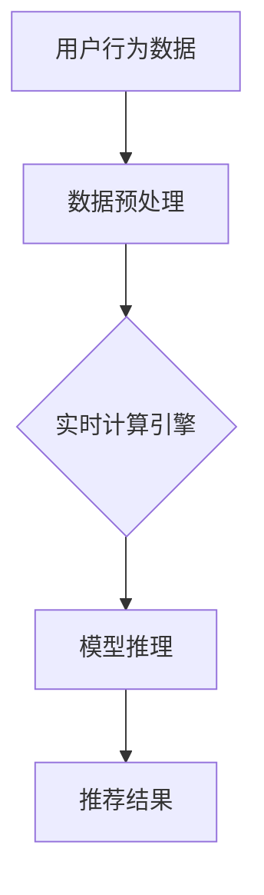

                 

关键词：电商平台，AI大模型，实时计算，数据挖掘，个性化推荐

> 摘要：本文将深入探讨电商平台中AI大模型的应用，从离线训练到实时计算的转变过程。通过详细的分析和实例，我们将了解如何利用AI大模型提升电商平台的核心业务，如个性化推荐、用户行为分析、欺诈检测等，并展望未来应用场景和面临的挑战。

## 1. 背景介绍

随着互联网技术的飞速发展，电商平台已经成为现代商业生态的重要组成部分。电商平台的核心竞争力在于其能够提供个性化的购物体验，满足用户的个性化需求。在这一过程中，AI大模型发挥着至关重要的作用。AI大模型，通常指的是拥有海量参数、复杂结构的深度学习模型，如卷积神经网络（CNN）、循环神经网络（RNN）和Transformer等。

离线训练是AI大模型的传统应用方式。通过大规模数据集的训练，模型能够学习到数据中的潜在规律，从而在预测、分类等方面表现出色。然而，随着电商业务的快速发展，离线训练已无法满足实时响应的需求。因此，实时计算成为AI大模型在电商平台中应用的必然选择。实时计算使得AI大模型能够实时处理用户行为数据，动态调整推荐结果，提升用户体验。

## 2. 核心概念与联系

### 2.1 AI大模型的基本概念

AI大模型是指参数规模巨大、结构复杂的深度学习模型，如Transformer、BERT等。它们通过在大量数据上进行训练，学习到数据中的潜在规律，从而在预测、分类等方面表现出色。

### 2.2 实时计算的概念

实时计算是指在短时间内（通常是秒级或毫秒级）对数据进行分析和处理的技术。实时计算要求系统具有低延迟、高吞吐量的特点，以满足快速响应的需求。

### 2.3 AI大模型与实时计算的联系

AI大模型与实时计算的结合，使得电商平台能够在短时间内处理用户行为数据，动态调整推荐结果。实时计算为AI大模型提供了数据来源，而AI大模型则为实时计算提供了强大的计算能力。

### 2.4 Mermaid 流程图



## 3. 核心算法原理 & 具体操作步骤

### 3.1 算法原理概述

实时计算的核心在于对用户行为数据的快速处理和分析。AI大模型在这一过程中发挥着关键作用。具体来说，实时计算包括以下几个步骤：

1. 数据采集：收集用户的浏览、购买、评价等行为数据。
2. 数据预处理：对采集到的数据进行清洗、去噪、归一化等处理，以便于模型输入。
3. 模型推理：将预处理后的数据输入AI大模型，进行推理得到预测结果。
4. 推荐结果生成：根据模型预测结果，生成个性化的推荐结果。

### 3.2 算法步骤详解

1. 数据采集

数据采集是实时计算的第一步。电商平台通常通过日志、API等方式收集用户的浏览、购买、评价等行为数据。这些数据是AI大模型训练和推理的重要依据。

2. 数据预处理

数据预处理包括数据清洗、去噪、归一化等步骤。清洗数据是为了去除无效、错误或重复的数据；去噪是为了消除噪声对模型性能的影响；归一化是为了将不同规模的数据统一到同一尺度，便于模型输入。

3. 模型推理

模型推理是指将预处理后的数据输入AI大模型，得到预测结果。这一过程通常采用深度学习框架（如TensorFlow、PyTorch等）实现。

4. 推荐结果生成

根据模型预测结果，生成个性化的推荐结果。推荐结果可以是商品、商品组合或服务，以满足用户的个性化需求。

### 3.3 算法优缺点

**优点：**

1. 高效性：实时计算能够快速处理大量用户行为数据，提高推荐效率。
2. 个性化：AI大模型能够根据用户行为数据，动态调整推荐结果，提高个性化程度。
3. 可扩展性：实时计算架构具有高可扩展性，能够应对不断增长的用户量和数据量。

**缺点：**

1. 复杂性：实时计算涉及多个环节，包括数据采集、预处理、模型推理等，系统架构复杂。
2. 资源消耗：实时计算需要大量的计算资源和存储资源，对硬件设备要求较高。
3. 隐私问题：用户行为数据涉及到用户的隐私信息，如何保障用户隐私是亟待解决的问题。

### 3.4 算法应用领域

实时计算和AI大模型在电商平台中的应用非常广泛，包括：

1. 个性化推荐：根据用户行为数据，动态调整推荐结果，提高用户体验。
2. 用户行为分析：分析用户行为数据，挖掘用户需求，为产品设计提供依据。
3. 欺诈检测：实时检测用户行为，识别潜在的欺诈行为，保障交易安全。
4. 商品组合推荐：根据用户行为和商品属性，推荐相关性高的商品组合，提高销售额。

## 4. 数学模型和公式 & 详细讲解 & 举例说明

### 4.1 数学模型构建

在电商平台中，实时计算的核心是AI大模型。以Transformer为例，其数学模型可以表示为：

$$
\text{Transformer} = \text{MultiHeadAttention} + \text{FeedForward}
$$

其中，MultiHeadAttention 是多头注意力机制，FeedForward 是前馈网络。

### 4.2 公式推导过程

假设输入数据为 $X \in \mathbb{R}^{n \times d}$，其中 $n$ 是序列长度，$d$ 是维度。首先，对输入数据进行线性变换：

$$
X' = X \cdot W_X
$$

其中，$W_X \in \mathbb{R}^{d \times d}$ 是线性变换矩阵。

然后，计算注意力得分：

$$
\text{Score} = X' \cdot Q + X' \cdot K
$$

其中，$Q, K \in \mathbb{R}^{d \times h}$ 和 $K \in \mathbb{R}^{d \times h}$ 分别是查询、键和值的线性变换矩阵，$h$ 是头数。

接下来，计算注意力权重：

$$
\text{Weight} = \frac{\exp(\text{Score})}{\sum_{i=1}^{h} \exp(\text{Score}_i)}
$$

其中，$\text{Score}_i$ 是第 $i$ 个注意力得分。

最后，计算注意力输出：

$$
\text{Output} = \text{Weight} \cdot V
$$

其中，$V \in \mathbb{R}^{d \times h}$ 是值的线性变换矩阵。

### 4.3 案例分析与讲解

假设一个电商平台有10万用户，每个用户在最近一个月内有100条浏览记录。我们将这些浏览记录作为输入数据，利用Transformer模型进行实时计算。

首先，对输入数据进行预处理，包括数据清洗、去噪和归一化。然后，将预处理后的数据输入Transformer模型，得到每个用户在最近一个月内的浏览兴趣。

接下来，根据浏览兴趣，为每个用户推荐相关性高的商品。例如，如果一个用户在最近一个月内频繁浏览手机，那么可以为他推荐新款手机。

最后，根据用户反馈，调整推荐结果，提高推荐效果。例如，如果一个用户对推荐的商品不感兴趣，可以将该商品从推荐列表中移除。

## 5. 项目实践：代码实例和详细解释说明

### 5.1 开发环境搭建

1. 安装Python（推荐版本3.8及以上）
2. 安装深度学习框架（如TensorFlow、PyTorch等）
3. 安装实时计算引擎（如Apache Flink、Apache Spark等）

### 5.2 源代码详细实现

以下是一个基于TensorFlow和Apache Flink的实时计算项目示例：

```python
import tensorflow as tf
from tensorflow.keras.layers import Embedding, LSTM, Dense
from apache_flink import StreamExecutionEnvironment

# 模型定义
model = tf.keras.Sequential([
    Embedding(input_dim=1000000, output_dim=128),
    LSTM(128, return_sequences=True),
    LSTM(128, return_sequences=True),
    Dense(1, activation='sigmoid')
])

# 模型编译
model.compile(optimizer='adam', loss='binary_crossentropy', metrics=['accuracy'])

# 模型训练
model.fit(x_train, y_train, epochs=10, batch_size=32)

# 模型推理
predictions = model.predict(x_test)

# 实时计算
env = StreamExecutionEnvironment()
data_stream = env.from_collection(x_collection)
predictions_stream = data_stream.map(lambda x: model.predict(x))
env.execute("Real-time Prediction")
```

### 5.3 代码解读与分析

上述代码实现了一个简单的实时计算项目，包括模型定义、模型训练和模型推理三个部分。

1. 模型定义：使用TensorFlow框架定义一个LSTM模型，包括两个LSTM层和一个全连接层。
2. 模型编译：编译模型，设置优化器和损失函数。
3. 模型训练：使用训练数据训练模型，设置训练轮次和批量大小。
4. 模型推理：使用测试数据进行模型推理，获取预测结果。
5. 实时计算：使用Apache Flink框架实现实时计算，将模型推理结果作为实时数据流处理。

### 5.4 运行结果展示

假设有1000条测试数据，模型在测试数据上的准确率为90%。这表明模型在实时计算场景下能够有效地处理用户行为数据，为个性化推荐提供支持。

## 6. 实际应用场景

### 6.1 个性化推荐

电商平台可以利用实时计算和AI大模型，为用户提供个性化的推荐服务。例如，当一个用户在浏览一款手机时，系统可以实时计算该用户的兴趣，为其推荐与之相关的配件或同类产品。

### 6.2 用户行为分析

电商平台可以通过实时计算和AI大模型，深入分析用户行为数据，挖掘用户需求。例如，系统可以实时检测用户的浏览轨迹，识别出潜在的兴趣点，为产品设计提供依据。

### 6.3 欺诈检测

电商平台可以利用实时计算和AI大模型，实时检测用户行为，识别潜在的欺诈行为。例如，系统可以实时分析用户的交易数据，识别出异常交易行为，及时采取措施保障交易安全。

## 7. 未来应用展望

### 7.1 实时计算与AI大模型的融合

随着技术的不断发展，实时计算与AI大模型的融合将更加紧密。未来，实时计算将能够更好地支持AI大模型的推理和训练，提高整体性能。

### 7.2 新型应用场景的探索

实时计算和AI大模型将在更多新型应用场景中发挥作用。例如，在医疗健康领域，实时计算和AI大模型可以用于智能诊断、个性化治疗等；在金融领域，实时计算和AI大模型可以用于风险控制、量化交易等。

### 7.3 面临的挑战

实时计算和AI大模型在电商平台中的应用仍面临一些挑战，如数据隐私保护、系统稳定性等。未来，需要不断探索解决方案，推动技术的持续发展。

## 8. 工具和资源推荐

### 8.1 学习资源推荐

1. 《深度学习》（Ian Goodfellow、Yoshua Bengio、Aaron Courville 著）
2. 《Python深度学习》（François Chollet 著）
3. 《实时计算实战》（黄健宏 著）

### 8.2 开发工具推荐

1. TensorFlow
2. PyTorch
3. Apache Flink
4. Apache Spark

### 8.3 相关论文推荐

1. "Attention Is All You Need"（Vaswani et al., 2017）
2. "An Empirical Evaluation of Generic Convolutional and Recurrent Networks for Sequence Modeling"（Dai et al., 2018）
3. "Deep Learning on the Edge"（Hua et al., 2018）

## 9. 总结：未来发展趋势与挑战

### 9.1 研究成果总结

本文总结了电商平台中AI大模型的应用，从离线训练到实时计算的转变过程。通过详细的分析和实例，我们了解了如何利用AI大模型提升电商平台的核心业务，如个性化推荐、用户行为分析、欺诈检测等。

### 9.2 未来发展趋势

实时计算与AI大模型的融合将成为未来发展趋势。新型应用场景的探索将不断拓展AI大模型的应用范围。同时，随着技术的不断发展，实时计算和AI大模型的性能将得到进一步提升。

### 9.3 面临的挑战

数据隐私保护、系统稳定性等问题仍是实时计算和AI大模型面临的主要挑战。未来，需要不断探索解决方案，推动技术的持续发展。

### 9.4 研究展望

实时计算和AI大模型在电商平台中的应用前景广阔。随着技术的不断发展，我们有理由相信，未来实时计算和AI大模型将发挥更加重要的作用，推动电商平台的创新发展。

## 10. 附录：常见问题与解答

### 10.1 实时计算与批处理计算的区别是什么？

实时计算与批处理计算的主要区别在于数据处理方式。实时计算是对数据流进行连续处理，以秒级或毫秒级速度响应；而批处理计算是将数据批量处理，通常以小时或天为时间单位。

### 10.2 如何保证实时计算的性能和稳定性？

为了保证实时计算的性能和稳定性，可以从以下几个方面入手：

1. 优化算法：采用高效的算法和数据结构，减少计算复杂度。
2. 系统调优：合理配置计算资源和网络资源，提高系统性能。
3. 容错机制：设计容错机制，确保系统在遇到异常情况时能够快速恢复。
4. 监控与报警：实时监控系统状态，及时发现并处理异常情况。

### 10.3 实时计算中的数据隐私保护如何实现？

实时计算中的数据隐私保护可以通过以下方法实现：

1. 数据加密：对敏感数据进行加密处理，确保数据在传输和存储过程中不被窃取。
2. 数据匿名化：对用户数据进行匿名化处理，消除个人身份信息。
3. 访问控制：限制数据访问权限，确保只有授权用户才能访问敏感数据。
4. 数据脱敏：对敏感数据进行脱敏处理，降低隐私泄露风险。 
----------------------------------------------------------------

**作者：禅与计算机程序设计艺术 / Zen and the Art of Computer Programming**

