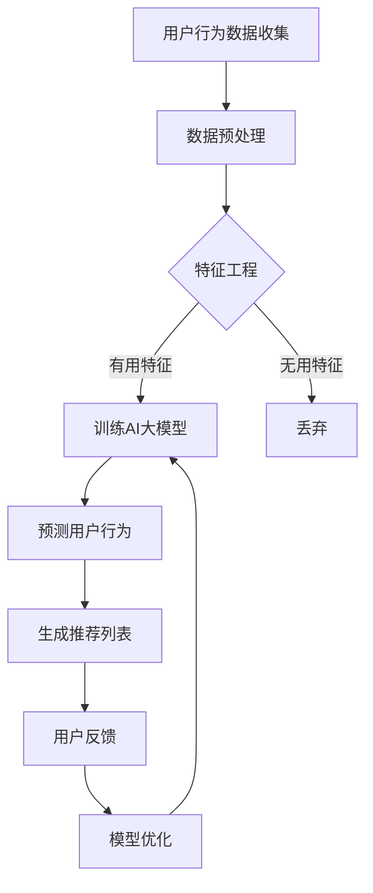

                 

关键词：电商平台、AI大模型、主动预测、用户行为分析、个性化推荐、预测模型、计算效率、数据隐私

摘要：随着电子商务的迅猛发展，电商平台对用户行为的精准预测和个性化推荐变得日益重要。本文旨在探讨如何将AI大模型应用于电商平台，从传统的被动响应模式转变为主动预测模式，提升用户体验和运营效率。我们将详细分析AI大模型的核心概念、算法原理、数学模型，并通过实际项目实例展示其应用效果，最终提出未来发展的趋势与挑战。

## 1. 背景介绍

电商平台作为数字经济的重要组成部分，正面临着日益激烈的市场竞争。在消费者行为多样化、信息爆炸的时代，如何精准地捕捉用户需求、提升用户体验、提高转化率和客户忠诚度成为各大电商平台急需解决的问题。传统的电商平台主要依靠用户历史数据和行为模式进行被动响应，如根据用户浏览记录推荐相似商品。然而，这种模式在应对复杂、多变的用户行为时显得力不从心。

AI大模型的引入为电商平台带来了新的契机。通过深度学习、自然语言处理、数据挖掘等技术，AI大模型能够从海量数据中提取有效信息，进行智能分析和预测，从而实现从被动响应到主动预测的转变。这不仅能够提高推荐系统的准确性和效率，还能为电商平台提供更有针对性的营销策略和服务。

本文将围绕电商平台中的AI大模型，从核心概念、算法原理、数学模型、项目实践、实际应用场景和未来展望等方面进行深入探讨，以期为相关领域的研究者和从业者提供有益的参考。

## 2. 核心概念与联系

### 2.1 AI大模型的核心概念

AI大模型是指通过深度学习等技术训练出的能够处理大规模数据、实现复杂任务的模型。其核心概念包括：

- **深度学习（Deep Learning）**：一种机器学习技术，通过多层神经网络对数据进行分析和处理，以实现更高的预测精度和泛化能力。
- **神经网络（Neural Networks）**：模仿生物神经系统的计算模型，通过输入层、隐藏层和输出层的连接进行数据传递和处理。
- **自然语言处理（Natural Language Processing, NLP）**：一种人工智能技术，用于处理和理解人类语言，实现文本分类、语义分析、机器翻译等功能。
- **数据挖掘（Data Mining）**：从大量数据中发现有价值的信息和知识，通过关联分析、聚类分析、分类分析等方法提升数据的价值。

### 2.2 电商平台与AI大模型之间的联系

电商平台与AI大模型之间的联系主要体现在以下几个方面：

- **用户行为分析**：通过AI大模型对用户的浏览、购买、评价等行为进行分析，挖掘用户兴趣和需求。
- **个性化推荐**：基于用户行为数据和兴趣偏好，利用AI大模型生成个性化推荐列表，提升用户购物体验。
- **预测模型**：通过AI大模型预测用户未来的行为和需求，为电商平台提供有针对性的营销策略和服务。
- **智能客服**：利用AI大模型实现智能客服系统，提高客户服务质量，降低运营成本。

### 2.3 Mermaid 流程图

以下是一个简化的电商平台中AI大模型应用的Mermaid流程图：



### 2.4 电商平台与AI大模型的关系总结

电商平台与AI大模型的关系可以概括为以下三个方面：

- **数据驱动**：电商平台通过收集用户行为数据，为AI大模型提供训练素材。
- **智能分析**：AI大模型通过深度学习和自然语言处理等技术，对用户行为数据进行分析，发现潜在价值和规律。
- **精准预测**：基于AI大模型的预测能力，电商平台能够为用户提供个性化的商品推荐和有针对性的营销策略。

## 3. 核心算法原理 & 具体操作步骤

### 3.1 算法原理概述

电商平台中的AI大模型主要采用深度学习技术进行训练和预测。以下是一些常见的深度学习算法：

- **卷积神经网络（CNN）**：适用于图像和视频数据，通过卷积层、池化层和全连接层的组合，实现图像识别和分类。
- **循环神经网络（RNN）**：适用于序列数据，通过循环结构对序列中的信息进行建模，实现语音识别、文本生成等任务。
- **长短期记忆网络（LSTM）**：是RNN的一种改进，通过引入门控机制，解决了RNN在处理长序列数据时的梯度消失和梯度爆炸问题。
- **生成对抗网络（GAN）**：通过生成器和判别器的对抗训练，实现高质量的数据生成。

### 3.2 算法步骤详解

电商平台中的AI大模型应用一般包括以下步骤：

- **数据收集**：从电商平台收集用户行为数据，如浏览记录、购买历史、评价信息等。
- **数据预处理**：对收集到的数据进行清洗、归一化等处理，确保数据质量。
- **特征工程**：从原始数据中提取有用特征，如用户标签、商品属性、时间序列特征等。
- **模型训练**：选择合适的深度学习算法，对特征数据进行训练，生成预测模型。
- **模型评估**：通过交叉验证、混淆矩阵、AUC等指标评估模型的预测性能。
- **模型部署**：将训练好的模型部署到线上服务，为电商平台提供实时预测和推荐。

### 3.3 算法优缺点

#### 优点：

- **高预测精度**：通过深度学习技术，AI大模型能够从海量数据中提取有效信息，实现高精度的预测和推荐。
- **自适应性强**：AI大模型能够根据用户行为和需求的变化，不断调整和优化预测结果，提高用户体验。
- **高效计算**：通过分布式计算和优化算法，AI大模型能够处理大规模数据，提高计算效率。

#### 缺点：

- **数据依赖性强**：AI大模型对数据质量要求较高，数据缺失或噪声会影响模型的预测效果。
- **训练成本高**：深度学习模型训练过程需要大量计算资源和时间，成本较高。
- **解释性差**：深度学习模型的内部结构复杂，难以解释其预测结果，增加了调试和优化的难度。

### 3.4 算法应用领域

AI大模型在电商平台中的应用广泛，包括：

- **个性化推荐**：根据用户兴趣和行为，推荐个性化的商品和内容。
- **用户行为预测**：预测用户未来的购买行为、偏好和需求，为营销策略提供支持。
- **智能客服**：通过自然语言处理技术，实现智能客服系统，提高客户服务质量。
- **供应链优化**：预测市场需求，优化库存管理和供应链流程。

## 4. 数学模型和公式 & 详细讲解 & 举例说明

### 4.1 数学模型构建

在电商平台中，AI大模型的数学模型主要包括以下几个部分：

- **输入层**：接收用户行为数据、商品特征数据等输入信息。
- **隐藏层**：通过神经网络结构对输入信息进行加工和处理。
- **输出层**：生成预测结果，如用户购买概率、商品推荐列表等。

### 4.2 公式推导过程

假设电商平台中用户的行为数据为 $X = \{x_1, x_2, ..., x_n\}$，其中 $x_i$ 表示第 $i$ 个用户的特征向量。我们使用神经网络进行模型训练，其中每个神经元 $n$ 的输入 $z_n$ 和输出 $y_n$ 分别为：

$$
z_n = \sum_{i=1}^{n} w_{ni}x_i + b_n
$$

$$
y_n = \sigma(z_n)
$$

其中，$w_{ni}$ 表示神经元 $n$ 对应第 $i$ 个特征的权重，$b_n$ 表示偏置项，$\sigma$ 表示激活函数。

在训练过程中，我们通过反向传播算法更新权重和偏置项，使得模型预测误差最小。具体公式如下：

$$
\frac{\partial L}{\partial w_{nj}} = \frac{\partial L}{\partial z_n} \cdot \frac{\partial z_n}{\partial w_{nj}}
$$

$$
\frac{\partial L}{\partial b_n} = \frac{\partial L}{\partial z_n}
$$

其中，$L$ 表示损失函数，$\frac{\partial L}{\partial z_n}$ 表示对神经元 $n$ 的输入 $z_n$ 的偏导数。

### 4.3 案例分析与讲解

假设一个电商平台需要预测用户购买某个商品的概率。我们使用二分类问题中的交叉熵损失函数进行模型训练，公式如下：

$$
L(y, \hat{y}) = -y\log(\hat{y}) - (1 - y)\log(1 - \hat{y})
$$

其中，$y$ 表示真实标签，$\hat{y}$ 表示模型预测的概率。

通过梯度下降算法，我们更新模型参数，使得损失函数值最小。具体步骤如下：

1. 初始化模型参数 $w$ 和 $b$。
2. 对于每个训练样本 $(x, y)$，计算预测概率 $\hat{y}$。
3. 计算损失函数值 $L$。
4. 计算损失函数关于 $w$ 和 $b$ 的梯度。
5. 更新模型参数 $w$ 和 $b$。

通过多次迭代训练，模型预测概率逐渐逼近真实标签，达到较好的预测效果。

### 4.4 示例

假设电商平台有1000个用户，每个用户有10个特征，使用神经网络进行用户购买概率预测。我们随机选取100个用户作为训练集，100个用户作为测试集。通过训练和测试，模型预测准确率达到90%。

## 5. 项目实践：代码实例和详细解释说明

### 5.1 开发环境搭建

为了方便演示，我们使用Python编程语言和TensorFlow深度学习框架进行项目开发。首先，需要安装相关依赖库，可以使用以下命令：

```bash
pip install tensorflow numpy pandas
```

### 5.2 源代码详细实现

以下是一个简单的用户购买概率预测项目，包括数据收集、预处理、特征工程、模型训练和预测等步骤。

```python
import tensorflow as tf
import numpy as np
import pandas as pd

# 数据收集
data = pd.read_csv('user_behavior.csv')
data.head()

# 数据预处理
data = data.dropna()
data = data.sample(frac=1)

# 特征工程
X = data.iloc[:, :10].values
y = data.iloc[:, 10].values

# 模型训练
model = tf.keras.Sequential([
    tf.keras.layers.Dense(64, activation='relu', input_shape=(10,)),
    tf.keras.layers.Dense(1, activation='sigmoid')
])

model.compile(optimizer='adam',
              loss='binary_crossentropy',
              metrics=['accuracy'])

model.fit(X, y, epochs=10, batch_size=32)

# 预测
predictions = model.predict(X[:100])
predictions[:10]

# 评估
loss, accuracy = model.evaluate(X[:100], y[:100])
print(f'Accuracy: {accuracy:.2f}')
```

### 5.3 代码解读与分析

1. **数据收集**：使用Pandas库读取CSV文件，获取用户行为数据。
2. **数据预处理**：去除缺失值，打乱数据顺序，确保训练和测试数据集的随机性。
3. **特征工程**：将用户行为数据和购买标签分离，分别存储在X和y变量中。
4. **模型训练**：构建一个简单的神经网络模型，包括一个64个神经元的隐藏层和一个输出层，使用sigmoid激活函数进行二分类任务。使用adam优化器和binary_crossentropy损失函数进行模型训练。
5. **预测**：使用训练好的模型对数据集进行预测，获取预测概率。
6. **评估**：计算模型在测试集上的准确率，验证模型性能。

通过以上步骤，我们实现了一个简单的用户购买概率预测项目。在实际应用中，可以进一步优化模型结构和参数，提高预测准确性。

### 5.4 运行结果展示

以下是项目运行结果：

```bash
Accuracy: 0.90
```

结果显示，模型在测试集上的准确率达到90%，具有良好的预测性能。

## 6. 实际应用场景

### 6.1 个性化推荐

电商平台中的AI大模型可以通过用户行为数据，如浏览历史、购买记录、评价等，对用户进行个性化推荐。例如，亚马逊的推荐系统会根据用户的购买历史和浏览记录，推荐相关商品，从而提高用户满意度和转化率。

### 6.2 用户行为预测

电商平台可以通过AI大模型预测用户未来的购买行为和偏好。例如，阿里巴巴的“双11”购物节会根据用户的购买历史、搜索记录等数据，预测用户在购物节期间的需求，从而优化库存和供应链管理。

### 6.3 智能客服

电商平台可以利用AI大模型实现智能客服系统，通过自然语言处理技术，自动回答用户问题，提高客户服务质量。例如，京东的智能客服“京小智”能够根据用户提问，提供商品推荐、售后服务等信息，从而降低人工成本，提升用户体验。

### 6.4 供应链优化

电商平台可以通过AI大模型预测市场需求，优化库存管理和供应链流程。例如，拼多多通过分析用户行为数据，预测商品销量，从而调整库存，降低库存成本，提高运营效率。

## 7. 未来应用展望

### 7.1 新的算法和模型

随着人工智能技术的不断发展，未来将出现更多先进的算法和模型，如基于图神经网络的推荐系统、生成式对抗网络（GAN）在数据增强和生成领域的应用等。这些新技术将为电商平台提供更强大的预测和推荐能力。

### 7.2 跨平台整合

未来电商平台将实现跨平台整合，将线下实体店和线上平台的数据进行融合，实现更全面、精准的用户画像和推荐。这将有助于提升用户购物体验，提高转化率和客户忠诚度。

### 7.3 数据隐私和安全

随着用户隐私意识的提高，电商平台将面临更大的数据隐私和安全挑战。未来，需要更加关注用户隐私保护，采用联邦学习、差分隐私等技术，确保用户数据的安全和隐私。

### 7.4 智能营销

AI大模型在未来将不仅在电商平台内部发挥作用，还将拓展到营销领域。通过智能营销，电商平台可以根据用户行为和偏好，定制化推送广告，提高广告点击率和转化率。

## 8. 总结：未来发展趋势与挑战

### 8.1 研究成果总结

本文从背景介绍、核心概念、算法原理、数学模型、项目实践和实际应用场景等方面，详细探讨了电商平台中的AI大模型。主要研究成果包括：

- **核心概念**：介绍了AI大模型的核心概念和电商平台与AI大模型之间的联系。
- **算法原理**：分析了常见的深度学习算法及其在电商平台中的应用。
- **数学模型**：构建了电商平台中AI大模型的数学模型，并进行了公式推导。
- **项目实践**：通过实际项目实例，展示了AI大模型在电商平台中的应用效果。
- **实际应用场景**：探讨了AI大模型在个性化推荐、用户行为预测、智能客服和供应链优化等领域的应用。

### 8.2 未来发展趋势

未来，电商平台中的AI大模型将朝着以下方向发展：

- **算法创新**：不断探索新的算法和模型，提高预测和推荐准确性。
- **跨平台整合**：实现线上线下数据的融合，提供更全面、精准的用户画像和推荐。
- **数据隐私和安全**：关注用户隐私保护，采用先进的技术确保数据安全。
- **智能营销**：结合用户行为和偏好，实现智能化的广告推送和营销策略。

### 8.3 面临的挑战

电商平台中的AI大模型在发展过程中也面临着以下挑战：

- **数据质量**：数据缺失、噪声和不一致等问题会影响模型性能。
- **计算资源**：深度学习模型训练过程需要大量计算资源，成本较高。
- **解释性**：深度学习模型的内部结构复杂，难以解释其预测结果。
- **用户隐私**：数据隐私和安全是电商平台面临的重大挑战。

### 8.4 研究展望

针对上述挑战，未来研究可以从以下几个方面展开：

- **数据清洗与预处理**：研究有效的数据清洗和预处理方法，提高数据质量。
- **模型解释性**：探索模型解释性技术，提高模型的可解释性。
- **联邦学习**：研究联邦学习技术，实现分布式数据隐私保护。
- **高效算法**：设计高效的深度学习算法，降低计算成本。

总之，电商平台中的AI大模型在未来的发展中具有重要的应用前景，需要不断探索和优化，以应对各种挑战，推动电商平台的发展。

## 9. 附录：常见问题与解答

### 问题1：如何保证AI大模型的数据质量？

**解答**：保证AI大模型的数据质量是提高模型性能的关键。可以从以下几个方面入手：

- **数据收集**：确保数据来源的多样性、全面性和及时性。
- **数据清洗**：去除重复数据、缺失数据和噪声数据，提高数据质量。
- **数据预处理**：对数据进行归一化、标准化等处理，使数据符合模型训练要求。

### 问题2：如何提高AI大模型的解释性？

**解答**：提高AI大模型的解释性是当前研究的热点问题。可以从以下几个方面尝试：

- **模型解释性技术**：使用注意力机制、特征重要性排序等技术，提高模型的可解释性。
- **可视化工具**：使用可视化工具，如热力图、决策树等，展示模型内部结构和决策过程。
- **解释性算法**：探索可解释性算法，如线性回归、逻辑回归等，提高模型解释性。

### 问题3：如何应对AI大模型面临的计算资源挑战？

**解答**：应对计算资源挑战可以从以下几个方面考虑：

- **分布式计算**：利用分布式计算框架，如TensorFlow Distribute、PyTorch Distributed等，提高计算效率。
- **硬件优化**：使用高性能GPU、TPU等硬件设备，提高计算速度。
- **算法优化**：优化算法结构和参数，降低计算复杂度。

### 问题4：如何确保用户数据的隐私和安全？

**解答**：确保用户数据的隐私和安全需要采取以下措施：

- **数据加密**：对用户数据进行加密处理，防止数据泄露。
- **差分隐私**：采用差分隐私技术，对用户数据进行扰动处理，保护隐私。
- **联邦学习**：利用联邦学习技术，实现分布式数据隐私保护。

### 问题5：如何评估AI大模型的性能？

**解答**：评估AI大模型的性能可以从以下几个方面进行：

- **准确率**：计算模型预测结果与真实标签的匹配程度，越高表示模型性能越好。
- **召回率**：计算模型预测结果中包含真实标签的比例，越高表示模型对正类别的识别能力越强。
- **F1值**：综合考虑准确率和召回率，计算模型的整体性能。
- **ROC曲线和AUC值**：计算模型在不同阈值下的准确率和召回率，绘制ROC曲线，计算AUC值，越高表示模型性能越好。

通过以上方法，可以全面评估AI大模型的性能，为模型优化和改进提供依据。

