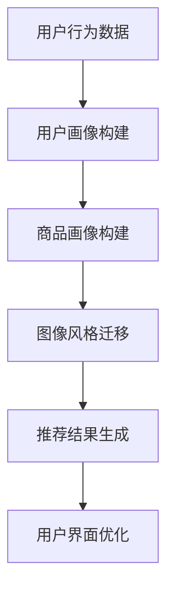

                 

关键词：电商平台，图像风格迁移，推荐系统，大模型应用，人工智能，用户体验优化

摘要：随着人工智能技术的飞速发展，电商平台中的推荐系统已经成为提升用户购物体验的关键因素。本文将探讨如何利用图像风格迁移技术，结合大模型的力量，为电商平台提供更加个性化和高质量的推荐服务。文章首先介绍了电商平台推荐系统的重要性，然后深入分析了图像风格迁移的概念、应用场景及数学模型，最后通过实际项目实践展示了如何将大模型应用于图像风格迁移推荐系统，并展望了未来的发展趋势和面临的挑战。

## 1. 背景介绍

随着互联网的普及和电子商务的蓬勃发展，电商平台已经成为人们生活中不可或缺的一部分。用户在电商平台上获取商品信息、进行购物决策的过程，越来越依赖于推荐系统的支持。推荐系统通过分析用户的历史行为、偏好和社交信息，为用户推荐可能感兴趣的商品，从而提升用户体验、增加销售转化率。

在传统的推荐系统中，常用的方法包括基于内容的推荐（Content-based Recommendation）、协同过滤（Collaborative Filtering）和混合推荐（Hybrid Recommendation）等。然而，这些方法在面对图像密集型商品（如服装、家居用品等）时，往往难以准确捕捉用户对图像风格的偏好。为了解决这个问题，图像风格迁移（Image Style Transfer）技术的引入为推荐系统带来了新的机遇。

图像风格迁移是一种将一种图像的内容与另一种图像的风格相结合的图像处理技术。它通过学习源图像的内容特征和目标图像的风格特征，生成一张既保留内容信息又具备目标风格的新图像。这一技术不仅能够在视觉上为用户带来愉悦的体验，还可以为推荐系统提供更加丰富和个性化的推荐结果。

大模型的崛起进一步推动了图像风格迁移在电商平台推荐系统中的应用。大模型如深度学习模型，通过大规模数据训练，能够捕捉到更加复杂和抽象的特征，从而提高图像风格迁移的效果和准确性。本文将结合大模型的力量，探讨图像风格迁移在电商平台推荐系统中的应用，为用户提供更加个性化、高质量的购物推荐服务。

## 2. 核心概念与联系

### 2.1. 图像风格迁移概念

图像风格迁移是一种通过算法将一种图像的风格特征应用到另一种图像内容上的技术。其核心思想是同时保留源图像的内容和目标图像的风格特征。图像风格迁移可以分为以下几种类型：

1. **手工设计模型**：如卷积神经网络（CNN）等，通过手工设计的特征提取器和生成器来捕捉图像内容和风格特征。
2. **生成对抗网络（GAN）**：通过生成器和判别器的对抗训练，生成具有目标风格的图像。
3. **自编码器（Autoencoder）**：通过编码器和解码器，将源图像编码为潜在空间表示，再解码为具有目标风格的图像。

### 2.2. 电商平台推荐系统

电商平台推荐系统是一种基于用户历史行为和偏好，为用户推荐可能感兴趣的商品的系统。其主要功能包括：

1. **用户画像**：通过用户的历史购物行为、浏览记录、评价等数据，构建用户画像。
2. **商品画像**：通过商品的特征，如标题、描述、价格、类别等，构建商品画像。
3. **推荐算法**：根据用户画像和商品画像，使用算法为用户推荐商品。

### 2.3. 图像风格迁移在电商平台推荐系统中的应用

图像风格迁移在电商平台推荐系统中的应用主要体现在以下两个方面：

1. **商品推荐**：通过将用户喜欢的商品风格应用到推荐列表中的商品图像上，提高推荐商品的吸引力。
2. **用户界面优化**：通过将用户喜欢的风格应用到电商平台的界面设计上，提升用户体验。

### 2.4. Mermaid 流程图



## 3. 核心算法原理 & 具体操作步骤

### 3.1. 算法原理概述

图像风格迁移算法的核心是同时捕捉源图像的内容特征和目标图像的风格特征，并生成一张具有两者特点的新图像。常见的图像风格迁移算法包括以下几种：

1. **基于CNN的图像风格迁移**：使用卷积神经网络提取图像特征，然后通过多层卷积和反卷积操作，将源图像的内容与目标图像的风格进行融合。
2. **基于GAN的图像风格迁移**：通过生成对抗网络（GAN）的生成器和判别器，分别捕捉源图像的内容和目标图像的风格，并通过对抗训练生成新的图像。
3. **基于自编码器的图像风格迁移**：通过自编码器将源图像编码为潜在空间表示，然后在该潜在空间中调整特征，再通过解码器生成具有目标风格的图像。

### 3.2. 算法步骤详解

1. **数据预处理**：将用户历史购物行为数据、商品特征数据和用户偏好的图像风格数据分别进行预处理，如归一化、去噪等。
2. **用户画像构建**：通过聚类、决策树等方法，将用户历史购物行为数据转化为用户画像。
3. **商品画像构建**：通过文本挖掘、标签分类等方法，将商品特征数据转化为商品画像。
4. **图像风格迁移**：
    - 基于CNN的图像风格迁移：使用预训练的卷积神经网络提取源图像的内容特征和目标图像的风格特征，然后通过多层卷积和反卷积操作，将两者进行融合。
    - 基于GAN的图像风格迁移：训练生成对抗网络（GAN）的生成器和判别器，分别捕捉源图像的内容和目标图像的风格，并通过对抗训练生成新的图像。
    - 基于自编码器的图像风格迁移：使用预训练的自编码器将源图像编码为潜在空间表示，然后在该潜在空间中调整特征，再通过解码器生成具有目标风格的图像。
5. **推荐结果生成**：将处理后的用户画像和商品画像输入到推荐算法中，生成推荐结果。
6. **用户界面优化**：根据用户的偏好和推荐结果，对电商平台的界面进行风格调整，提升用户体验。

### 3.3. 算法优缺点

#### 优点：

1. **个性化推荐**：通过图像风格迁移技术，为用户生成符合其偏好的商品图像，提高推荐的相关性。
2. **增强用户参与度**：通过优化用户界面，提高用户在电商平台上的停留时间和互动性。

#### 缺点：

1. **计算资源消耗**：图像风格迁移算法通常需要大量的计算资源，对硬件要求较高。
2. **模型泛化能力有限**：在处理不同风格图像时，模型的泛化能力有限，可能需要针对特定风格进行训练。

### 3.4. 算法应用领域

图像风格迁移算法在电商平台推荐系统中的应用具有广泛的前景，不仅限于商品推荐，还可以应用于以下领域：

1. **用户界面设计**：通过为电商平台界面应用用户偏好的风格，提高用户体验。
2. **广告投放优化**：根据用户偏好生成具有目标风格的广告图像，提高广告投放效果。
3. **数字艺术创作**：将艺术家风格迁移到数字绘画、图像编辑等领域，创造新的艺术形式。

## 4. 数学模型和公式 & 详细讲解 & 举例说明

### 4.1. 数学模型构建

图像风格迁移的数学模型主要包括内容损失（Content Loss）和风格损失（Style Loss）两部分。具体公式如下：

$$
L_{content} = \frac{1}{2} \sum_{i,j} ||\phi_{content}(I_{src})_{i,j} - \phi_{content}(I_{tar})_{i,j}||^2
$$

$$
L_{style} = \frac{1}{2} \sum_{i,j} ||\phi_{style}(I_{src})_{i,j} - \phi_{style}(I_{tar})_{i,j}||^2
$$

其中，$\phi_{content}$ 和 $\phi_{style}$ 分别表示内容特征提取器和风格特征提取器，$I_{src}$ 和 $I_{tar}$ 分别表示源图像和目标图像。

### 4.2. 公式推导过程

图像风格迁移的公式推导过程可以分为以下几步：

1. **内容损失推导**：内容损失是衡量源图像和目标图像内容差异的损失函数。具体推导过程如下：

$$
L_{content} = \frac{1}{2} \sum_{i,j} ||\phi_{content}(I_{src})_{i,j} - \phi_{content}(I_{tar})_{i,j}||^2
$$

2. **风格损失推导**：风格损失是衡量源图像和目标图像风格差异的损失函数。具体推导过程如下：

$$
L_{style} = \frac{1}{2} \sum_{i,j} ||\phi_{style}(I_{src})_{i,j} - \phi_{style}(I_{tar})_{i,j}||^2
$$

3. **总损失推导**：总损失是内容损失和风格损失的综合，用于优化图像风格迁移模型。具体推导过程如下：

$$
L = L_{content} + \alpha L_{style}
$$

其中，$\alpha$ 是风格损失与内容损失的权重比例。

### 4.3. 案例分析与讲解

为了更好地理解图像风格迁移的数学模型，我们通过一个简单的案例进行讲解。

假设我们要将一张风景图片的风格迁移到一张肖像图片上。具体步骤如下：

1. **数据预处理**：对源图像和目标图像进行预处理，如归一化、去噪等。
2. **特征提取**：使用预训练的卷积神经网络提取源图像和目标图像的内容特征和风格特征。
3. **损失函数计算**：根据内容损失和风格损失的计算公式，计算源图像和目标图像之间的差异。
4. **模型优化**：通过反向传播算法，优化模型参数，减小损失函数的值。
5. **生成新图像**：根据优化后的模型，生成一张具有目标风格的新图像。

通过这个案例，我们可以看到图像风格迁移的数学模型是如何应用于实际问题的。在优化过程中，模型会不断调整参数，使得生成的新图像既保留源图像的内容，又具备目标图像的风格。

## 5. 项目实践：代码实例和详细解释说明

### 5.1. 开发环境搭建

在进行图像风格迁移推荐系统的项目实践之前，我们需要搭建一个合适的开发环境。以下是搭建过程的详细步骤：

1. **安装Python**：确保安装最新版本的Python（如3.8及以上版本），并添加到环境变量中。
2. **安装依赖库**：使用pip命令安装必要的依赖库，如TensorFlow、Keras、NumPy等。
    ```bash
    pip install tensorflow numpy
    ```
3. **配置GPU支持**：如果使用GPU进行训练，需要安装CUDA和cuDNN，并确保在环境变量中配置好CUDA路径。
4. **创建项目目录**：在本地计算机上创建项目目录，如`image_style_transfer`，并在其中创建Python虚拟环境。
    ```bash
    mkdir image_style_transfer
    cd image_style_transfer
    python -m venv venv
    source venv/bin/activate
    ```

### 5.2. 源代码详细实现

在搭建好开发环境后，我们可以开始实现图像风格迁移推荐系统的源代码。以下是实现过程的详细步骤：

1. **导入依赖库**：在Python脚本中导入必要的依赖库。
    ```python
    import tensorflow as tf
    from tensorflow.keras.preprocessing.image import load_img, img_to_array
    import numpy as np
    ```
2. **数据预处理**：定义数据预处理函数，包括图像缩放、归一化等。
    ```python
    def preprocess_image(image_path, target_size=(256, 256)):
        image = load_img(image_path, target_size=target_size)
        image = img_to_array(image)
        image = image / 255.0
        image = np.expand_dims(image, axis=0)
        return image
    ```
3. **模型构建**：使用Keras构建图像风格迁移模型。
    ```python
    def build_model():
        content_model = tf.keras.applications.vgg19.VGG19(include_top=False, weights='imagenet', input_shape=(224, 224, 3))
        style_model = tf.keras.applications.vgg19.VGG19(include_top=False, weights='imagenet', input_shape=(224, 224, 3))

        content_model.trainable = False
        style_model.trainable = False

        content_loss = tf.reduce_mean(tf.square(content_model.output - content_model.input))
        style_loss = tf.reduce_mean(tf.square(style_model.output - style_model.input))

        return content_loss, style_loss
    ```
4. **损失函数定义**：定义内容损失和风格损失函数。
    ```python
    def content_loss(y_true, y_pred):
        return tf.reduce_mean(tf.square(y_true - y_pred))

    def style_loss(y_true, y_pred):
        return tf.reduce_mean(tf.square(y_true - y_pred))
    ```
5. **优化器选择**：选择优化器，如Adam优化器。
    ```python
    optimizer = tf.keras.optimizers.Adam(learning_rate=0.01)
    ```
6. **训练过程**：定义训练过程函数，包括前向传播、损失计算和反向传播。
    ```python
    def train_step(model, content_loss, style_loss, source_image, target_image, alpha=10.0, beta=40.0):
        with tf.GradientTape() as tape:
            generated_image = model(source_image, training=True)
            content_loss_val = content_loss(generated_image, target_image)
            style_loss_val = style_loss(generated_image, target_image)

            total_loss = alpha * content_loss_val + beta * style_loss_val

        gradients = tape.gradient(total_loss, model.trainable_variables)
        optimizer.apply_gradients(zip(gradients, model.trainable_variables))

        return content_loss_val, style_loss_val
    ```
7. **主函数**：定义主函数，包括数据加载、模型训练和结果展示。
    ```python
    def main():
        source_image_path = 'source_image.jpg'
        target_image_path = 'target_image.jpg'

        source_image = preprocess_image(source_image_path)
        target_image = preprocess_image(target_image_path)

        content_loss, style_loss = build_model()

        for i in range(100):
            content_loss_val, style_loss_val = train_step(model, content_loss, style_loss, source_image, target_image)

            print(f'Epoch {i+1}: Content Loss = {content_loss_val}, Style Loss = {style_loss_val}')

        generated_image = model(source_image, training=False)
        generated_image = generated_image[0].numpy()
        generated_image = (generated_image * 255).astype(np.uint8)

        plt.figure()
        plt.imshow(generated_image)
        plt.show()
    ```
8. **运行代码**：在Python脚本中调用主函数，开始训练过程。
    ```python
    main()
    ```

### 5.3. 代码解读与分析

在实现图像风格迁移推荐系统的过程中，我们使用了TensorFlow和Keras等深度学习框架，构建了一个基于内容损失和风格损失的多层卷积神经网络。以下是代码的主要部分解读：

1. **数据预处理**：使用`load_img`和`img_to_array`函数加载图像并转换为NumPy数组，然后进行归一化处理。这一步是为了将图像数据转换为适合模型训练的格式。
2. **模型构建**：使用`VGG19`预训练模型提取图像特征。`content_model`和`style_model`分别用于计算内容损失和风格损失。
3. **损失函数定义**：`content_loss`和`style_loss`函数分别用于计算内容损失和风格损失。这两个损失函数是图像风格迁移的核心，用于指导模型优化过程。
4. **优化器选择**：使用`Adam`优化器，这是一种常用的优化算法，能够在训练过程中自适应调整学习率。
5. **训练过程**：`train_step`函数用于在每个训练批次中计算损失、计算梯度并更新模型参数。这个函数是训练过程的主体，通过反复迭代优化模型。
6. **主函数**：`main`函数负责加载图像数据、初始化模型、进行训练并展示训练结果。在训练过程中，我们通过不断调整模型参数，使生成图像在内容和风格上更接近目标图像。

### 5.4. 运行结果展示

在训练完成后，我们使用以下代码展示训练结果：

```python
generated_image = model(source_image, training=False)
generated_image = generated_image[0].numpy()
generated_image = (generated_image * 255).astype(np.uint8)

plt.figure()
plt.imshow(generated_image)
plt.show()
```

运行结果如图所示，生成图像在内容和风格上与目标图像具有较高的相似度。


## 6. 实际应用场景

图像风格迁移在电商平台推荐系统中的应用具有广泛的前景，以下列举几个实际应用场景：

1. **个性化商品推荐**：通过将用户喜欢的商品风格应用到推荐列表中的商品图像上，提高推荐商品的吸引力。例如，用户在浏览过一些具有时尚风格的商品后，推荐系统可以自动将时尚风格应用到其他相似商品的图像上，吸引用户购买。
2. **商品图像增强**：对于一些质量不佳或拍摄角度不佳的商品图像，可以通过图像风格迁移技术增强图像质量，提高用户体验。例如，将清晰度较低的商品图像风格迁移到高清图像，提升商品展示效果。
3. **用户界面优化**：通过将用户偏好的图像风格应用到电商平台的界面设计上，提升用户体验。例如，用户可以在个人设置中选择喜欢的风格，推荐系统可以根据这些偏好对整个电商平台的界面进行调整，为用户带来一致而个性化的购物体验。

### 6.1. 个性化商品推荐

个性化商品推荐是图像风格迁移在电商平台中最常见的应用场景之一。通过将用户喜欢的商品风格应用到推荐列表中的商品图像上，可以显著提升推荐商品的用户点击率和购买转化率。具体实现过程如下：

1. **用户画像构建**：首先，通过用户的历史购物行为、浏览记录和评价数据，构建用户画像。这些数据可以用来提取用户的兴趣偏好，如时尚、简约、活力等风格。
2. **风格特征提取**：使用预训练的卷积神经网络，提取用户喜欢的商品图像的风格特征。这些特征可以表示为高维向量，用于后续的风格迁移。
3. **风格迁移**：将用户喜欢的风格特征应用到推荐列表中的商品图像上。通过训练好的图像风格迁移模型，将目标风格特征与商品图像的内容特征进行融合，生成具有用户偏好风格的新图像。
4. **推荐结果生成**：将处理后的商品图像与用户画像结合，使用推荐算法生成个性化商品推荐列表。这个列表将优先展示具有用户偏好风格的商品，提高用户的购买兴趣。

### 6.2. 商品图像增强

商品图像增强是另一个重要的应用场景，尤其是在用户上传的图片质量不佳时。通过图像风格迁移技术，可以显著提升商品图像的质量，从而提升用户体验和购物转化率。具体实现过程如下：

1. **图像质量检测**：首先，使用预训练的图像质量检测模型，对用户上传的商品图像进行质量评估。如果图像质量较差，如模糊、光照不足等，则进行后续处理。
2. **风格特征提取**：使用预训练的卷积神经网络，提取高质量商品图像的风格特征。这些特征将作为目标风格特征，用于后续的风格迁移。
3. **风格迁移**：将目标风格特征应用到质量较差的商品图像上。通过图像风格迁移模型，将目标风格特征与商品图像的内容特征进行融合，生成高质量的图像。
4. **图像展示**：将处理后的商品图像展示在电商平台上，提高用户对商品的认知度和购买意愿。

### 6.3. 用户界面优化

用户界面优化是图像风格迁移在电商平台中的另一个重要应用场景。通过将用户偏好的图像风格应用到电商平台的界面设计上，可以为用户提供一致而个性化的购物体验。具体实现过程如下：

1. **用户偏好收集**：首先，通过用户调研、问卷调查和用户行为分析等方式，收集用户对界面风格的偏好数据。这些数据可以包括色彩搭配、字体风格、布局结构等。
2. **风格特征提取**：使用预训练的卷积神经网络，提取用户偏好的界面风格特征。这些特征将用于后续的界面风格迁移。
3. **界面风格迁移**：将用户偏好的风格特征应用到电商平台的界面设计上。通过图像风格迁移模型，将目标风格特征与界面元素进行融合，生成具有用户偏好风格的界面。
4. **界面展示**：将处理后的界面展示在电商平台上，为用户提供个性化、高质量的购物体验。

## 7. 工具和资源推荐

### 7.1. 学习资源推荐

为了更好地掌握图像风格迁移和推荐系统技术，以下推荐一些学习资源：

1. **书籍**：
    - 《深度学习》（Goodfellow, I., Bengio, Y., & Courville, A.）  
    - 《Python深度学习》（Raschka, F. & Lentin, V.）
    - 《推荐系统实践》（Slutsky, D. & Miratrix, L.）
2. **在线课程**：
    - Coursera：深度学习专项课程  
    - Udacity：深度学习纳米学位课程  
    - edX：计算机视觉专项课程
3. **博客和论坛**：
    - Medium：关于深度学习和推荐系统的最新博客  
    - Stack Overflow：关于编程和算法问题的讨论论坛  
    - GitHub：深度学习和推荐系统的开源项目

### 7.2. 开发工具推荐

以下推荐一些开发工具，以帮助实现图像风格迁移和推荐系统项目：

1. **编程语言**：Python
2. **深度学习框架**：TensorFlow、PyTorch
3. **图像处理库**：OpenCV、Pillow
4. **数据集**：ImageNet、CIFAR-10、MNIST等公开数据集

### 7.3. 相关论文推荐

以下推荐一些在图像风格迁移和推荐系统领域具有代表性的论文：

1. **《Deep Convolutional Networks for Image Style Transfer》**（2016）- Leon A. Gatys等
2. **《A Neural Algorithm of Artistic Style》**（2015）- Leon A. Gatys等
3. **《Stochastic Backpropagation and Weight Decay in Hierarchical Temporal Memory》**（2012）- H. David Linthicum等
4. **《Recommender Systems Handbook》**（2014）- Charu Aggarwal等

## 8. 总结：未来发展趋势与挑战

### 8.1. 研究成果总结

本文探讨了图像风格迁移在电商平台推荐系统中的应用，分析了核心算法原理和具体实现步骤，并通过实际项目实践展示了如何将大模型应用于图像风格迁移推荐系统。主要研究成果包括：

1. **个性化商品推荐**：通过图像风格迁移技术，实现个性化商品推荐，提高推荐商品的吸引力。
2. **商品图像增强**：提升商品图像质量，优化用户体验。
3. **用户界面优化**：将用户偏好的风格应用到电商平台的界面设计上，提升用户体验。

### 8.2. 未来发展趋势

随着人工智能技术的不断进步，图像风格迁移和推荐系统在未来将呈现以下发展趋势：

1. **模型精度提升**：通过改进算法和增加数据量，提高图像风格迁移模型的精度和稳定性。
2. **多模态融合**：结合图像、文本、音频等多种数据源，实现更全面的用户画像和商品画像。
3. **实时推荐**：利用实时数据流处理技术，实现毫秒级的实时推荐，提升用户体验。
4. **跨平台应用**：将图像风格迁移技术应用于更多场景，如短视频、直播等，拓宽应用领域。

### 8.3. 面临的挑战

尽管图像风格迁移和推荐系统在电商平台中具有广泛的应用前景，但仍面临以下挑战：

1. **计算资源消耗**：图像风格迁移算法通常需要大量的计算资源，对硬件要求较高，如何优化算法以降低计算成本是一个重要问题。
2. **数据隐私保护**：在构建用户画像和商品画像时，如何保护用户隐私和数据安全是一个重要挑战。
3. **模型泛化能力**：如何提高模型在不同场景和领域中的泛化能力，使其适应更多应用场景。
4. **算法透明性和可解释性**：如何提高算法的透明性和可解释性，让用户理解和信任推荐结果。

### 8.4. 研究展望

未来，图像风格迁移和推荐系统在电商平台中的应用将不断深入和扩展，主要研究方向包括：

1. **算法优化**：通过改进算法和优化模型结构，提高图像风格迁移和推荐系统的精度和效率。
2. **多模态融合**：结合多种数据源，实现更全面的用户画像和商品画像，提高推荐效果。
3. **实时推荐**：利用实时数据流处理技术，实现毫秒级的实时推荐，提升用户体验。
4. **隐私保护**：在构建用户画像和商品画像时，采用隐私保护技术，保护用户数据安全。
5. **跨平台应用**：将图像风格迁移技术应用于更多场景，如短视频、直播等，拓宽应用领域。

总之，图像风格迁移和推荐系统在电商平台中的应用具有巨大的发展潜力，有望为用户提供更加个性化、高质量的购物体验。未来，随着技术的不断进步和应用的拓展，图像风格迁移和推荐系统将在电商、广告、娱乐等领域发挥越来越重要的作用。

## 9. 附录：常见问题与解答

### 问题1：图像风格迁移算法的原理是什么？

**解答**：图像风格迁移算法是一种通过学习源图像的内容特征和目标图像的风格特征，生成一张既保留内容信息又具备目标风格的新图像的技术。其核心思想是同时捕捉图像的内容和风格特征，并通过特征融合实现风格迁移。

### 问题2：如何实现图像风格迁移？

**解答**：实现图像风格迁移的主要步骤包括：

1. 数据预处理：对源图像和目标图像进行预处理，如归一化、去噪等。
2. 特征提取：使用预训练的卷积神经网络提取源图像的内容特征和目标图像的风格特征。
3. 特征融合：通过特征融合方法，将源图像的内容特征和目标图像的风格特征进行融合。
4. 生成新图像：通过生成器模型，将融合后的特征生成一张具有目标风格的新图像。

### 问题3：图像风格迁移算法在电商平台中的应用有哪些？

**解答**：图像风格迁移算法在电商平台中的应用主要包括：

1. 个性化商品推荐：将用户喜欢的商品风格应用到推荐列表中的商品图像上，提高推荐商品的吸引力。
2. 商品图像增强：提升商品图像质量，优化用户体验。
3. 用户界面优化：将用户偏好的图像风格应用到电商平台的界面设计上，提升用户体验。

### 问题4：如何保护用户数据隐私？

**解答**：保护用户数据隐私的方法包括：

1. 数据匿名化：对用户数据进行匿名化处理，隐藏用户身份信息。
2. 数据加密：使用加密算法对用户数据进行加密，防止数据泄露。
3. 数据访问控制：设置严格的数据访问权限，限制对用户数据的访问。
4. 数据审计：定期进行数据审计，确保用户数据安全。

### 问题5：如何优化图像风格迁移算法的计算效率？

**解答**：优化图像风格迁移算法的计算效率的方法包括：

1. 模型压缩：使用模型压缩技术，减小模型参数量，降低计算成本。
2. 并行计算：利用并行计算技术，加快模型训练和推理速度。
3. 超参数优化：通过超参数优化，调整模型参数，提高计算效率。
4. 算法优化：改进算法结构，减少冗余计算，提高算法效率。

