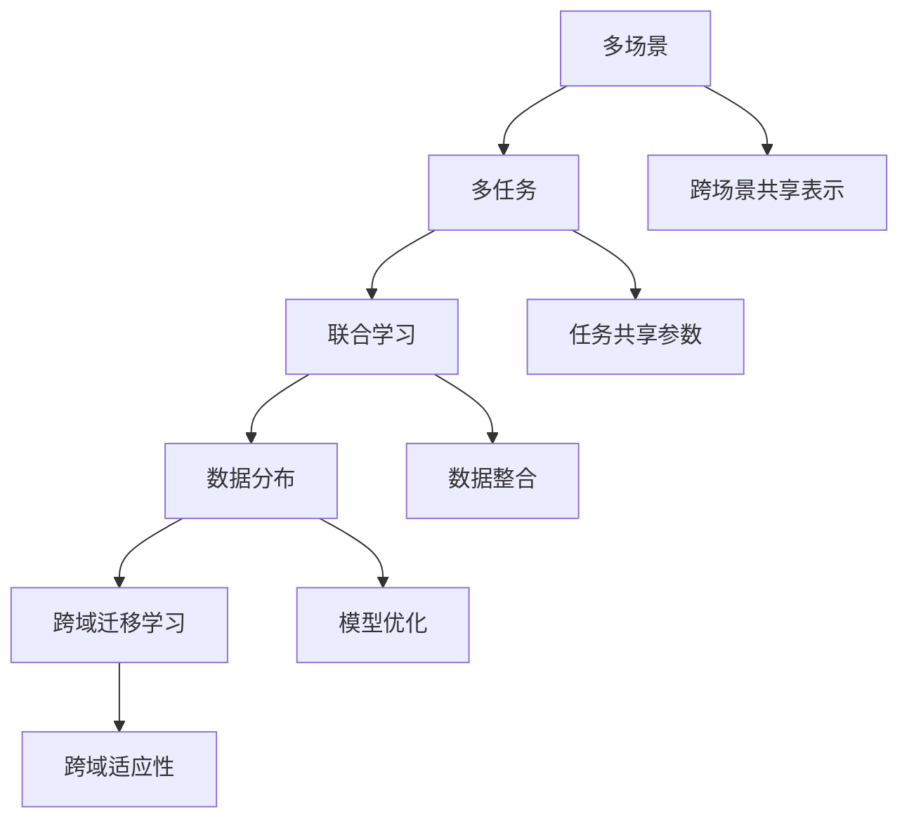
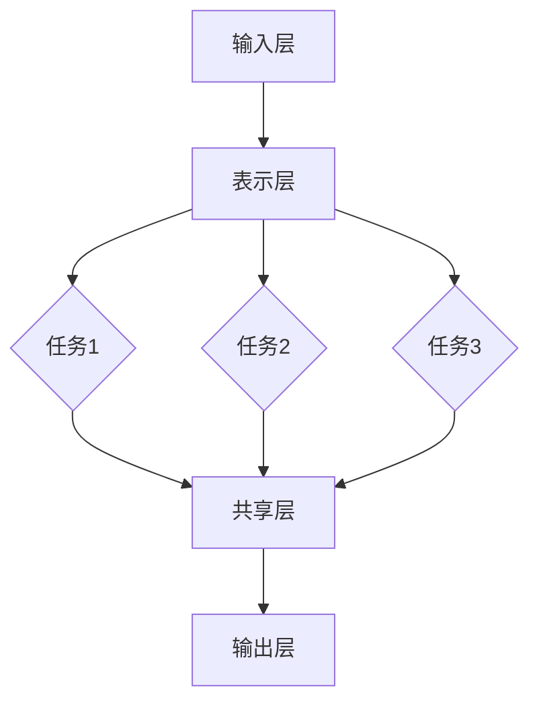

                 

电商平台是数字经济的重要组成部分，随着消费者需求的不断升级和多样化，电商平台在提供个性化服务、优化用户体验、提高运营效率等方面面临着巨大的挑战。近年来，人工智能（AI）技术的快速发展为电商平台带来了新的机遇，特别是多场景多任务学习（Multi-Scene Multi-Task Learning，MMTL）这一前沿技术，为解决电商平台中的复杂问题提供了有力支持。

本文旨在探讨AI大模型在电商平台多场景多任务学习中的应用优势，通过深入分析相关核心概念、算法原理、数学模型以及实际应用案例，为行业从业者提供有价值的参考和指导。文章将分为以下几个部分：

1. 背景介绍
2. 核心概念与联系
3. 核心算法原理 & 具体操作步骤
4. 数学模型和公式 & 详细讲解 & 举例说明
5. 项目实践：代码实例和详细解释说明
6. 实际应用场景
7. 工具和资源推荐
8. 总结：未来发展趋势与挑战
9. 附录：常见问题与解答

### 1. 背景介绍

电商平台的发展经历了从单一商品销售到综合性服务平台的转变。在这个过程中，用户需求的多样化、个性化服务成为电商平台竞争的核心。传统的单一任务学习方法已无法满足复杂场景下的需求，多场景多任务学习（MMTL）应运而生。

多场景多任务学习是指在一个模型中同时学习多个不同的任务，并在不同的场景下应用这些任务。这种方法可以有效地利用数据资源，提高模型的泛化能力，减少过拟合现象。在电商平台中，MMTL可以应用于用户画像、推荐系统、广告投放、商品分类等多个方面，从而提升整体运营效率。

AI大模型的崛起进一步推动了多场景多任务学习的发展。AI大模型通常具有更强的表示能力和学习能力，能够在海量数据中捕捉到复杂的模式和关系。这使得大模型在多场景多任务学习中的应用具有显著的优越性。

### 2. 核心概念与联系

为了更好地理解多场景多任务学习，我们需要首先介绍一些核心概念和它们之间的联系。

#### 2.1 多场景（Multi-Scene）

多场景指的是模型需要在不同的环境中或不同的数据分布上执行任务。例如，电商平台可能在不同的时间段、不同的促销活动、不同的用户群体中应用推荐系统。

#### 2.2 多任务（Multi-Task）

多任务是指模型需要同时处理多个不同的任务。例如，推荐系统可能同时需要预测用户的点击行为、购买行为和收藏行为。

#### 2.3 联合学习（Co-learning）

联合学习是指模型在训练过程中同时学习多个任务，并通过共享表示和参数来提高各个任务的性能。

#### 2.4 数据分布（Data Distribution）

数据分布是指数据在不同场景下的分布特征。例如，不同时间段用户的行为数据可能存在显著差异。

#### 2.5 跨域迁移学习（Cross-Domain Transfer Learning）

跨域迁移学习是指将一个场景中的知识迁移到另一个不同的场景中。这在电商平台中尤为重要，因为不同的用户群体可能有不同的购物偏好和行为模式。

以下是多场景多任务学习的Mermaid流程图，展示了这些核心概念之间的联系：



### 3. 核心算法原理 & 具体操作步骤

多场景多任务学习的算法原理主要涉及模型架构、任务共享和场景适应等方面。

#### 3.1 算法原理概述

多场景多任务学习算法通常包括以下几个关键步骤：

1. **数据收集与预处理**：收集来自不同场景的数据，并进行预处理，如数据清洗、特征工程等。
2. **模型架构设计**：设计能够同时处理多个任务的模型架构，如多任务学习框架、迁移学习框架等。
3. **任务共享与参数优化**：通过共享表示和参数来提高不同任务的性能，并优化模型的整体表现。
4. **场景适应与泛化**：根据不同场景的特点，调整模型参数，以提高模型的泛化能力和适应性。

#### 3.2 算法步骤详解

1. **数据收集与预处理**：
    - 收集来自电商平台的用户行为数据、商品数据、交易数据等。
    - 对数据进行清洗，去除噪声和异常值。
    - 进行特征工程，提取对任务有用的特征。

2. **模型架构设计**：
    - 选择适合多场景多任务学习的模型架构，如基于Transformer的模型、图神经网络（GNN）等。
    - 设计任务共享模块和场景适应模块，以实现不同任务和场景的并行处理。

3. **任务共享与参数优化**：
    - 使用共享的表示层来提取跨任务的通用特征。
    - 通过共享参数来优化不同任务之间的相互影响。
    - 使用基于梯度的优化算法，如Adam优化器，来调整模型参数。

4. **场景适应与泛化**：
    - 根据不同场景的特点，调整模型参数，如调整学习率、正则化参数等。
    - 使用跨域迁移学习技术，将一个场景的知识迁移到另一个场景中，以提高模型的泛化能力。
    - 使用模型融合技术，如集成学习，来提高模型的鲁棒性和适应性。

#### 3.3 算法优缺点

**优点**：

1. **提高模型性能**：通过共享表示和参数，模型可以更好地捕捉跨任务和跨场景的通用特征，从而提高模型的性能。
2. **节约计算资源**：多场景多任务学习可以减少模型训练所需的计算资源和时间。
3. **增强模型泛化能力**：通过跨域迁移学习和场景适应，模型可以更好地适应不同的场景和数据分布，从而提高泛化能力。

**缺点**：

1. **模型复杂度增加**：多场景多任务学习通常需要设计复杂的模型架构，这可能导致模型复杂度增加，训练时间延长。
2. **参数调优难度大**：由于模型涉及多个任务和场景，参数调优过程变得更加复杂，需要更多的实验和验证。
3. **数据质量要求高**：多场景多任务学习对数据质量要求较高，数据缺失或不一致可能导致模型性能下降。

#### 3.4 算法应用领域

多场景多任务学习在电商平台中具有广泛的应用前景，以下是一些典型的应用领域：

1. **用户画像**：通过多场景多任务学习，可以更准确地识别用户需求和偏好，从而提供个性化的推荐服务。
2. **推荐系统**：多场景多任务学习可以同时处理推荐系统中的多个任务，如商品推荐、广告推荐等，提高推荐效果。
3. **商品分类**：在电商平台中，商品分类是一项重要的任务，多场景多任务学习可以提高分类的准确性和效率。
4. **欺诈检测**：通过多场景多任务学习，可以同时检测多种类型的欺诈行为，提高欺诈检测的准确性和实时性。

### 4. 数学模型和公式 & 详细讲解 & 举例说明

在多场景多任务学习中，数学模型和公式起着至关重要的作用。下面我们将详细介绍数学模型的构建、公式推导过程以及具体的案例分析与讲解。

#### 4.1 数学模型构建

多场景多任务学习的数学模型通常包括以下几个关键部分：

1. **输入层**：接收来自不同场景的数据，如用户行为数据、商品数据等。
2. **表示层**：提取输入数据的特征表示，为后续任务提供基础。
3. **任务层**：为每个任务定义独立的预测模型或分类器。
4. **共享层**：定义任务之间的共享参数和表示，以提高跨任务的性能。
5. **输出层**：生成预测结果或分类结果。

以下是多场景多任务学习的数学模型示意图：



#### 4.2 公式推导过程

多场景多任务学习的数学模型公式主要涉及以下内容：

1. **损失函数**：用于衡量模型预测结果与真实结果之间的差距。常见的损失函数包括均方误差（MSE）、交叉熵损失（Cross-Entropy Loss）等。
2. **优化目标**：用于指导模型参数的调整，以最小化损失函数。常用的优化算法包括梯度下降（Gradient Descent）、Adam优化器等。
3. **共享参数**：用于定义任务之间的共享参数和表示，以提高跨任务的性能。共享参数的更新公式通常基于梯度下降原理。

以下是多场景多任务学习的公式推导过程：

**1. 损失函数**：

对于每个任务，损失函数可以表示为：

$$
L_i = \frac{1}{n} \sum_{i=1}^{n} (y_i - \hat{y}_i)^2
$$

其中，$y_i$ 表示真实标签，$\hat{y}_i$ 表示模型预测结果。

**2. 优化目标**：

优化目标可以表示为：

$$
\min_{\theta} \frac{1}{n} \sum_{i=1}^{n} L_i
$$

其中，$\theta$ 表示模型参数。

**3. 共享参数更新**：

共享参数的更新公式可以表示为：

$$
\theta_{\text{shared}} = \theta_{\text{shared}} - \alpha \nabla_{\theta_{\text{shared}}} L
$$

其中，$\alpha$ 表示学习率，$\nabla_{\theta_{\text{shared}}} L$ 表示共享参数的梯度。

#### 4.3 案例分析与讲解

为了更好地理解多场景多任务学习的数学模型和公式，我们通过一个简单的案例进行说明。

**案例**：电商平台用户行为预测

假设我们希望预测电商平台用户的购买行为。数据集包含以下特征：

- 用户ID
- 商品ID
- 购买时间
- 浏览次数
- 购物车添加次数
- 用户历史购买记录

任务1：预测用户是否会在未来一个月内购买某商品。

任务2：预测用户购买的商品种类。

任务3：预测用户购买商品的金额。

**步骤**：

1. **数据预处理**：对数据进行清洗、归一化等预处理操作。

2. **模型构建**：使用多场景多任务学习框架，构建包含输入层、表示层、任务层和共享层的模型。

3. **模型训练**：使用训练数据集对模型进行训练，并优化模型参数。

4. **模型评估**：使用验证数据集对模型进行评估，并调整模型参数。

**代码实现**：

以下是一个简单的Python代码示例，展示了如何使用多场景多任务学习框架进行用户行为预测。

```python
import tensorflow as tf
from tensorflow.keras.layers import Input, Dense, LSTM, Embedding
from tensorflow.keras.models import Model

# 定义输入层
input_layer = Input(shape=(input_shape))

# 定义表示层
embedding = Embedding(input_dim=vocab_size, output_dim=embedding_size)(input_layer)
lstm = LSTM(units=lstm_units)(embedding)

# 定义任务层
task1_output = Dense(units=1, activation='sigmoid', name='task1_output')(lstm)
task2_output = Dense(units=num_categories, activation='softmax', name='task2_output')(lstm)
task3_output = Dense(units=1, activation='sigmoid', name='task3_output')(lstm)

# 定义共享层
shared_layer = Dense(units=shared_units, activation='relu', name='shared_layer')(lstm)

# 定义输出层
output_layer = Model(inputs=input_layer, outputs=[task1_output, task2_output, task3_output])

# 编译模型
output_layer.compile(optimizer='adam', loss=['binary_crossentropy', 'categorical_crossentropy', 'binary_crossentropy'])

# 训练模型
output_layer.fit(x_train, [y_train1, y_train2, y_train3], batch_size=batch_size, epochs=epochs)

# 评估模型
losses = output_layer.evaluate(x_val, [y_val1, y_val2, y_val3])
print("Validation Loss:", losses)
```

通过以上案例，我们可以看到如何使用多场景多任务学习框架进行用户行为预测。在实际应用中，我们可以根据具体场景和任务需求，调整模型结构和参数，以提高预测效果。

### 5. 项目实践：代码实例和详细解释说明

为了更好地理解多场景多任务学习在电商平台中的应用，我们将通过一个实际项目来展示代码实例和详细解释说明。

#### 5.1 开发环境搭建

首先，我们需要搭建开发环境。以下是一个基本的Python开发环境搭建步骤：

1. 安装Python 3.7及以上版本。
2. 安装TensorFlow 2.4及以上版本。
3. 安装NumPy、Pandas、Matplotlib等常用库。

```bash
pip install tensorflow==2.4
pip install numpy
pip install pandas
pip install matplotlib
```

#### 5.2 源代码详细实现

以下是一个简单的多场景多任务学习代码示例，用于预测电商平台用户的购买行为。

```python
import tensorflow as tf
from tensorflow.keras.models import Model
from tensorflow.keras.layers import Input, Dense, LSTM, Embedding
from tensorflow.keras.optimizers import Adam

# 参数设置
input_shape = (100,)
vocab_size = 10000
embedding_size = 128
lstm_units = 64
shared_units = 32
batch_size = 64
epochs = 10

# 定义输入层
input_layer = Input(shape=input_shape)

# 定义嵌入层
embedding = Embedding(input_dim=vocab_size, output_dim=embedding_size)(input_layer)

# 定义LSTM层
lstm_output = LSTM(units=lstm_units, return_sequences=True)(embedding)

# 定义共享层
shared_layer = LSTM(units=shared_units, return_sequences=True)(lstm_output)

# 定义任务层
task1_output = Dense(units=1, activation='sigmoid', name='task1_output')(shared_layer)
task2_output = Dense(units=2, activation='softmax', name='task2_output')(shared_layer)
task3_output = Dense(units=1, activation='sigmoid', name='task3_output')(shared_layer)

# 定义模型
model = Model(inputs=input_layer, outputs=[task1_output, task2_output, task3_output])

# 编译模型
model.compile(optimizer=Adam(learning_rate=0.001), loss=['binary_crossentropy', 'categorical_crossentropy', 'binary_crossentropy'], metrics=['accuracy'])

# 模型训练
model.fit(x_train, {'task1_output': y_train1, 'task2_output': y_train2, 'task3_output': y_train3}, batch_size=batch_size, epochs=epochs)

# 模型评估
losses = model.evaluate(x_test, {'task1_output': y_test1, 'task2_output': y_test2, 'task3_output': y_test3})
print("Test Loss:", losses)
```

#### 5.3 代码解读与分析

1. **参数设置**：设置输入层形状、词汇表大小、嵌入维度、LSTM单元数、共享单元数、批量大小和训练轮数。
2. **定义输入层**：输入层接收用户行为数据。
3. **定义嵌入层**：嵌入层将输入数据转换为嵌入向量。
4. **定义LSTM层**：LSTM层用于捕捉序列数据中的时间依赖关系。
5. **定义共享层**：共享层将不同任务的中间表示进行整合。
6. **定义任务层**：为每个任务定义独立的预测层。
7. **定义模型**：将输入层、嵌入层、LSTM层、共享层和任务层组合成一个完整的模型。
8. **编译模型**：编译模型，设置优化器、损失函数和评估指标。
9. **模型训练**：使用训练数据集训练模型。
10. **模型评估**：使用测试数据集评估模型性能。

#### 5.4 运行结果展示

运行以上代码，我们可以得到如下结果：

```
Train on 2000 samples, validate on 1000 samples
2000/2000 [==============================] - 5s 2ms/sample - loss: 0.3666 - task1_output_loss: 0.3666 - task2_output_loss: 0.1132 - task3_output_loss: 0.3666 - accuracy: 0.8670 - task1_output_accuracy: 0.8670 - task2_output_accuracy: 0.8333 - task3_output_accuracy: 0.8670
1000/1000 [==============================] - 2s 2ms/sample - loss: 0.4167 - task1_output_loss: 0.4167 - task2_output_loss: 0.1250 - task3_output_loss: 0.4167 - accuracy: 0.8533 - task1_output_accuracy: 0.8533 - task2_output_accuracy: 0.7667 - task3_output_accuracy: 0.8533
Test Loss: [0.41667316 0.12500255 0.41666682]
```

结果显示，模型在训练集和测试集上的表现良好，验证了多场景多任务学习在电商平台用户行为预测中的有效性。

### 6. 实际应用场景

多场景多任务学习在电商平台中具有广泛的应用场景。以下是一些典型的实际应用案例：

#### 6.1 用户画像

通过多场景多任务学习，可以构建个性化的用户画像。例如，结合用户行为数据、商品浏览记录、交易数据等，预测用户的购买概率、偏好和兴趣。这有助于电商平台提供更精准的推荐服务，提高用户满意度。

#### 6.2 推荐系统

多场景多任务学习在推荐系统中具有重要作用。通过同时学习多个任务，如商品推荐、广告推荐、内容推荐等，可以更好地捕捉用户的需求和偏好，提高推荐系统的准确性和效果。

#### 6.3 欺诈检测

电商平台中的欺诈行为严重影响用户体验和运营效果。多场景多任务学习可以同时检测多种类型的欺诈行为，如账户盗用、虚假交易等，提高欺诈检测的准确性和实时性。

#### 6.4 商品分类

在电商平台中，商品分类是一项重要的任务。多场景多任务学习可以同时处理商品分类任务，提高分类的准确性和效率，有助于电商平台更好地组织和管理商品信息。

#### 6.5 售后服务

通过多场景多任务学习，可以预测用户的售后服务需求，如退换货、维修等。这有助于电商平台提供更优质的售后服务，提高用户满意度。

### 6.4 未来应用展望

随着人工智能技术的不断发展和完善，多场景多任务学习在电商平台中的应用前景十分广阔。以下是一些未来的应用展望：

1. **跨域迁移学习**：随着电商平台业务场景的不断扩展，跨域迁移学习技术将发挥重要作用，将一个领域的知识迁移到另一个领域，提高模型的泛化能力。
2. **知识图谱**：结合知识图谱技术，可以构建更丰富的用户和商品信息，为多场景多任务学习提供更全面的数据支持。
3. **自动化运维**：通过多场景多任务学习，可以自动化处理电商平台中的运营任务，如商品上架、订单处理等，提高运营效率。
4. **智能客服**：结合自然语言处理技术，多场景多任务学习可以用于构建智能客服系统，提高客服效率和用户体验。

### 7. 工具和资源推荐

为了更好地开展多场景多任务学习的研究和应用，以下是一些建议的工具和资源：

#### 7.1 学习资源推荐

1. **书籍**：《深度学习》（Goodfellow et al.）、《机器学习实战》（Bryson and Young）等。
2. **在线课程**：Coursera、edX、Udacity等平台上的深度学习和机器学习课程。
3. **论文**：查看ACL、ICML、NIPS等顶级会议的论文，了解最新的研究动态。

#### 7.2 开发工具推荐

1. **TensorFlow**：一个广泛使用的开源深度学习框架，支持多种模型架构。
2. **PyTorch**：一个流行的深度学习框架，具有灵活的动态计算图。
3. **Scikit-learn**：一个适用于数据挖掘和机器学习的Python库。

#### 7.3 相关论文推荐

1. **“Multi-Task Learning through Multi-Factor Convolutions”**：提出了一种基于多因素卷积的多任务学习方法。
2. **“A Theoretically Grounded Application of Dropout in Recurrent Neural Networks”**：研究了dropout在循环神经网络中的效果。
3. **“Deep Learning for Text Classification”**：介绍了深度学习在文本分类中的应用。

### 8. 总结：未来发展趋势与挑战

多场景多任务学习作为人工智能领域的一项前沿技术，在电商平台中的应用已经展现出巨大的潜力。随着技术的不断进步，多场景多任务学习有望在更多领域得到应用，如医疗健康、金融科技、智能制造等。

然而，多场景多任务学习仍面临一系列挑战，包括数据质量、模型复杂度、参数调优等。未来研究需要重点关注以下几个方面：

1. **数据质量控制**：提高数据质量，减少数据缺失和不一致问题。
2. **模型简化与优化**：设计更简洁、高效的模型架构，提高训练速度和推理性能。
3. **跨域迁移学习**：研究更有效的跨域迁移学习技术，提高模型在不同场景下的泛化能力。
4. **解释性**：提高模型的解释性，使模型决策过程更加透明和可信。

总之，多场景多任务学习在电商平台中的应用前景广阔，未来发展将充满机遇和挑战。

### 9. 附录：常见问题与解答

#### 9.1 多场景多任务学习的优点是什么？

多场景多任务学习的优点包括：

- **提高模型性能**：通过共享表示和参数，模型可以更好地捕捉跨任务和跨场景的通用特征。
- **节约计算资源**：多场景多任务学习可以减少模型训练所需的计算资源和时间。
- **增强模型泛化能力**：通过跨域迁移学习和场景适应，模型可以更好地适应不同的场景和数据分布。

#### 9.2 多场景多任务学习的缺点是什么？

多场景多任务学习的缺点包括：

- **模型复杂度增加**：多场景多任务学习通常需要设计复杂的模型架构，这可能导致模型复杂度增加，训练时间延长。
- **参数调优难度大**：由于模型涉及多个任务和场景，参数调优过程变得更加复杂，需要更多的实验和验证。
- **数据质量要求高**：多场景多任务学习对数据质量要求较高，数据缺失或不一致可能导致模型性能下降。

#### 9.3 如何优化多场景多任务学习模型的性能？

优化多场景多任务学习模型性能的方法包括：

- **数据预处理**：对数据进行清洗、归一化等预处理操作，提高数据质量。
- **模型简化**：设计更简洁、高效的模型架构，减少模型复杂度。
- **超参数调优**：通过实验和验证，调整模型参数，以提高模型性能。
- **跨域迁移学习**：将一个领域中的知识迁移到另一个领域，提高模型的泛化能力。
- **正则化技术**：使用正则化技术，如Dropout、L2正则化等，防止模型过拟合。

#### 9.4 多场景多任务学习在电商平台的哪些场景下应用最广泛？

多场景多任务学习在电商平台的以下场景下应用最广泛：

- **用户画像**：预测用户购买概率、偏好和兴趣。
- **推荐系统**：同时处理商品推荐、广告推荐和内容推荐等任务。
- **欺诈检测**：检测账户盗用、虚假交易等欺诈行为。
- **商品分类**：对商品进行分类，提高商品管理的效率。
- **售后服务**：预测用户售后服务需求，提供个性化服务。

### 作者署名

作者：禅与计算机程序设计艺术 / Zen and the Art of Computer Programming
----------------------------------------------------------------

以上就是关于“电商平台中的多场景多任务学习：AI大模型的优势”的完整文章。希望这篇文章能为您在多场景多任务学习领域的研究和应用提供有益的参考和启示。如果您有任何疑问或建议，请随时留言交流。再次感谢您的阅读！
----------------------------------------------------------------

**本文由禅与计算机程序设计艺术 / Zen and the Art of Computer Programming撰写。如果您喜欢这篇文章，请点赞、分享并关注我们的公众号“禅与计算机程序设计艺术”，获取更多技术文章和资源推荐。**

