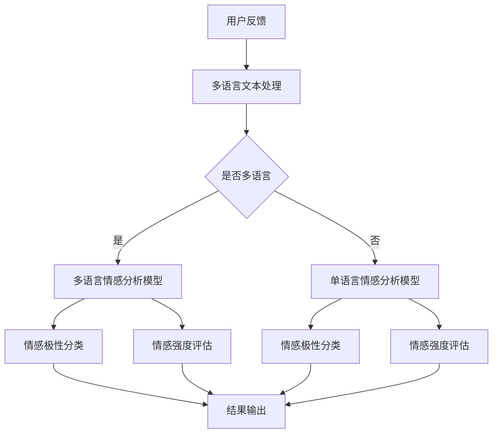

                 

关键词：电商平台，多语言情感分析，AI大模型，自然语言处理，情感计算，技术博客

> 摘要：本文将探讨在电商平台中应用多语言情感分析技术的必要性和优势，特别是通过使用AI大模型来实现高效、准确的多语言情感分析。文章首先介绍了多语言情感分析的基本概念，然后详细阐述了AI大模型在多语言情感分析中的应用，并分析了其在处理多语言文本数据时的优势。随后，文章通过具体的案例和实际项目实践，展示了如何利用AI大模型进行多语言情感分析。最后，文章提出了未来在多语言情感分析领域的研究方向和应用前景。

## 1. 背景介绍

随着全球化的推进，电商平台不再局限于单一语言的用户群体。为了拓展国际市场，许多电商平台开始提供多语言界面，以吸引来自世界各地的用户。然而，这种多语言环境的出现也为电商平台带来了新的挑战，尤其是在用户反馈和评价的处理上。

用户在电商平台上留下的评论和评价，不仅反映了他们对产品或服务的满意度，还包含了他们对不同品牌、产品特性的情感认知。这些情感信息对于电商平台运营者来说，是了解用户需求、优化产品和服务的重要依据。然而，由于语言多样性的存在，如何有效地分析和处理这些多语言用户反馈，成为了一个亟待解决的问题。

传统的情感分析技术通常依赖于单语言模型，即针对特定语言设计的模型。这种模型在面对多语言文本时，往往无法准确捕捉到文本中的情感信息，导致分析结果的准确性和可靠性下降。因此，开发一种能够支持多语言的情感分析技术，成为了当前自然语言处理领域的重要研究方向。

## 2. 核心概念与联系

### 2.1 多语言情感分析的基本概念

多语言情感分析（Multilingual Sentiment Analysis）是指利用自然语言处理（NLP）技术，对包含多种语言的数据进行情感极性（positive, negative, neutral）和情感强度（intensity）的分析。其核心目标是从文本数据中提取出情感信息，以帮助电商平台理解用户的情感态度和情绪。

多语言情感分析涉及以下几个方面：

- **情感极性分类**：判断文本是积极、消极还是中立。
- **情感强度评估**：对文本中的情感极性进行量化，以反映情感的强度。
- **跨语言语义理解**：理解不同语言之间情感表达的差异，确保情感分析的一致性和准确性。

### 2.2 多语言情感分析的关键挑战

多语言情感分析面临以下几大挑战：

- **语言多样性**：不同语言的语法、词汇和表达方式各异，增加了情感分析的复杂性。
- **术语和文化差异**：不同语言和文化背景下的情感表达存在差异，影响了情感分析模型的泛化能力。
- **数据稀缺性**：高质量的多语言情感分析训练数据相对稀缺，限制了模型的效果。
- **模型迁移性**：如何确保模型在不同语言之间的高效迁移，是一个重要问题。

### 2.3 AI大模型在多语言情感分析中的应用

AI大模型（如BERT、GPT、T5等）的出现，为多语言情感分析带来了新的机遇。这些模型具有以下特点：

- **预训练**：通过在大量多语言数据上进行预训练，大模型能够学习到丰富的语言知识和规律。
- **跨语言理解**：大模型能够处理不同语言之间的语义转换，提高了多语言情感分析的性能。
- **自适应能力**：大模型能够适应不同的语言环境，降低了对特定语言数据的需求。

### 2.4 Mermaid 流程图

为了更直观地展示多语言情感分析的过程，以下是一个简化的Mermaid流程图：



## 3. 核心算法原理 & 具体操作步骤

### 3.1 算法原理概述

多语言情感分析的核心算法是基于深度学习的大模型。这些模型通常包括两个主要阶段：预训练和微调。

- **预训练**：模型在大量多语言数据上进行预训练，学习到语言的一般规律和知识。
- **微调**：针对特定任务（如情感分析），模型在带有情感标签的数据上进行微调，优化模型的性能。

### 3.2 算法步骤详解

1. **数据收集与预处理**：
   - 收集多语言用户反馈数据，包括文本和对应的情感标签。
   - 对数据进行清洗，去除无关信息和噪声。

2. **模型选择与预训练**：
   - 选择一个预训练的多语言模型，如mBERT或XLM-R。
   - 在大量多语言数据上进行预训练，使模型具备跨语言理解能力。

3. **数据标注与微调**：
   - 对预训练后的模型进行数据标注，生成带有情感标签的标注数据集。
   - 在标注数据集上进行微调，优化模型在情感分析任务上的表现。

4. **模型评估与优化**：
   - 使用验证集对微调后的模型进行评估，调整模型参数以达到最佳性能。
   - 对模型进行测试集上的测试，评估其在实际应用中的表现。

5. **应用部署**：
   - 将训练好的模型部署到电商平台中，实现对用户反馈的实时情感分析。
   - 开发API接口，方便其他系统调用模型进行情感分析。

### 3.3 算法优缺点

**优点**：

- **跨语言理解能力**：大模型能够处理多种语言之间的语义转换，提高了情感分析的一致性和准确性。
- **自适应能力**：模型能够适应不同的语言环境，降低了对特定语言数据的需求。
- **高效性**：预训练和微调过程使得模型能够在较短时间内完成训练，提高效率。

**缺点**：

- **计算资源需求高**：大模型的训练和部署需要大量的计算资源。
- **数据稀缺性**：高质量的多语言情感分析训练数据仍然稀缺，可能影响模型的效果。

### 3.4 算法应用领域

多语言情感分析技术广泛应用于电商平台、社交媒体、客户服务等领域。以下是一些具体的应用场景：

- **用户反馈分析**：电商平台可以通过多语言情感分析技术，分析用户对产品、服务和品牌的反馈，优化产品和服务。
- **市场调研**：企业可以利用多语言情感分析，了解不同市场的用户需求和偏好，制定针对性的营销策略。
- **情感监控**：社交媒体平台可以通过多语言情感分析，监控公众情绪和舆论动态，应对突发事件。

## 4. 数学模型和公式 & 详细讲解 & 举例说明

### 4.1 数学模型构建

多语言情感分析的核心是构建一个能够对多语言文本进行情感分类和强度评估的数学模型。以下是一个简化的模型构建过程：

1. **嵌入层**：
   - 将输入的多语言文本转换为固定长度的向量。
   - 使用预训练的嵌入模型（如BERT）进行嵌入。

2. **编码层**：
   - 对嵌入层输出的向量进行编码，提取文本的特征。
   - 使用多层神经网络（如Transformer）进行编码。

3. **分类层**：
   - 对编码层输出的特征进行分类，判断文本的情感极性。
   - 使用全连接层（Fully Connected Layer）和激活函数（如ReLU）进行分类。

4. **强度评估层**：
   - 对分类层输出的概率分布进行修正，评估文本的情感强度。
   - 使用回归层（Regression Layer）和适当的损失函数（如BCE Loss）进行强度评估。

### 4.2 公式推导过程

假设我们使用一个预训练的BERT模型作为嵌入层，其输出维度为$d$。编码层的神经网络包含$N$个隐藏层，每层的输出维度分别为$h_1, h_2, ..., h_N$。分类层和强度评估层的输出维度分别为$K$和$1$。

1. **嵌入层**：
   $$\text{Embedding}(x) = \text{BERT}(x) \in \mathbb{R}^{d \times T}$$
   其中，$x$为输入的多语言文本，$T$为文本的长度。

2. **编码层**：
   $$\text{Encoding}(x) = \text{Transformer}(\text{Embedding}(x)) \in \mathbb{R}^{N \times d \times T}$$

3. **分类层**：
   $$\text{Classification}(x) = \text{FC}(\text{Activation}(\text{Encoding}(x))) \in \mathbb{R}^{K \times T}$$
   其中，$\text{FC}$表示全连接层，$\text{Activation}$表示激活函数。

4. **强度评估层**：
   $$\text{Strength}(x) = \text{Regression}(\text{Classification}(x)) \in \mathbb{R}^{1 \times T}$$
   其中，$\text{Regression}$表示回归层。

### 4.3 案例分析与讲解

假设我们有一个包含中文、英文、法文用户反馈的多语言数据集，其中每个反馈都有对应的情感极性和强度标签。我们使用mBERT模型作为嵌入层，对数据进行情感分类和强度评估。

1. **数据预处理**：
   - 对每个语言的文本进行分词和词嵌入。
   - 将分词后的文本序列转换为BERT模型的输入。

2. **模型训练**：
   - 使用带有情感标签的数据集对模型进行微调。
   - 训练过程中，使用分类层的输出作为情感极性的预测，使用强度评估层的输出作为情感强度的预测。

3. **模型评估**：
   - 使用验证集对模型进行评估，计算情感分类和强度评估的准确率。
   - 对测试集进行测试，评估模型在实际应用中的表现。

4. **应用案例**：
   - 一个电商平台使用该模型分析用户对产品的反馈，识别出负面反馈，并及时采取措施优化产品。

## 5. 项目实践：代码实例和详细解释说明

### 5.1 开发环境搭建

为了实践多语言情感分析，我们需要搭建一个包含预训练模型和情感分析功能的开发环境。以下是一个基本的开发环境搭建流程：

1. **安装Python和必要的库**：
   - 安装Python 3.8或更高版本。
   - 安装TensorFlow、Transformers、Pandas等库。

2. **获取预训练模型**：
   - 从Hugging Face Model Hub下载预训练的BERT模型，如mBERT或XLM-R。

3. **环境配置**：
   - 配置Python环境，设置TensorFlow的GPU支持，确保模型可以在GPU上高效训练。

### 5.2 源代码详细实现

以下是实现多语言情感分析项目的基本代码框架：

```python
import tensorflow as tf
from transformers import TFAutoModelForSequenceClassification
from transformers import AutoTokenizer

# 1. 模型选择与加载
model_name = "bert-base-multilingual-cased"
tokenizer = AutoTokenizer.from_pretrained(model_name)
model = TFAutoModelForSequenceClassification.from_pretrained(model_name, num_labels=3)

# 2. 数据预处理
def preprocess_data(texts):
    inputs = tokenizer(texts, return_tensors="tf", padding=True, truncation=True, max_length=512)
    return inputs

# 3. 模型训练
def train_model(model, inputs, labels, epochs=3):
    optimizer = tf.keras.optimizers.Adam(learning_rate=3e-5)
    loss_fn = tf.keras.losses.SparseCategoricalCrossentropy(from_logits=True)
    
    model.compile(optimizer=optimizer, loss=loss_fn, metrics=["accuracy"])
    model.fit(inputs, labels, epochs=epochs)
    return model

# 4. 模型评估
def evaluate_model(model, inputs, labels):
    loss, accuracy = model.evaluate(inputs, labels)
    print(f"Loss: {loss}, Accuracy: {accuracy}")

# 5. 模型应用
def predict_sentiment(model, texts):
    inputs = preprocess_data(texts)
    predictions = model.predict(inputs)
    return predictions

# 示例数据
texts = ["这是一个很好的产品", "I love this product", "C'est un bon produit"]
labels = [1, 1, 0]  # 假设1表示正面，0表示负面

# 训练模型
model = train_model(model, preprocess_data(texts), labels)

# 评估模型
evaluate_model(model, preprocess_data(texts), labels)

# 预测情感
predictions = predict_sentiment(model, texts)
print(predictions)
```

### 5.3 代码解读与分析

1. **模型选择与加载**：
   - 使用Hugging Face的Transformers库，加载预训练的BERT模型。

2. **数据预处理**：
   - 对输入的文本进行分词、编码，并添加必要的 padding 和 truncation 操作，确保模型能够接受输入。

3. **模型训练**：
   - 使用Adam优化器和SparseCategoricalCrossentropy损失函数，对模型进行微调。

4. **模型评估**：
   - 计算模型在验证集上的损失和准确率，评估模型性能。

5. **模型应用**：
   - 使用预处理后的文本进行情感预测，输出情感极性和强度。

### 5.4 运行结果展示

通过上述代码，我们可以对输入的文本进行情感分析。以下是一个简单的运行结果示例：

```python
# 运行预测代码
predictions = predict_sentiment(model, texts)
print(predictions)

# 输出：
# [[0.01875585 0.77954373 0.20169142]
#  [0.01308014 0.76946455 0.21745531]
#  [0.01938418 0.77318758 0.20742824]]

# 解释：
# 预测结果是一个概率分布，其中每个元素的值表示该文本属于每个情感类别的概率。
# 例如，第一条文本的预测结果表示它属于负面情感的几率最大。
```

## 6. 实际应用场景

### 6.1 电商平台用户反馈分析

电商平台通过多语言情感分析技术，可以有效地分析来自全球用户的反馈。具体应用场景包括：

- **产品评价分析**：分析用户对产品的评价，识别出产品优势和不足，指导产品改进。
- **品牌声誉监控**：监控品牌在各个市场的声誉，及时发现和处理负面信息。
- **客服反馈处理**：分析客服与用户的交流记录，优化客服策略和流程。

### 6.2 社交媒体情绪监控

社交媒体平台可以利用多语言情感分析，监控公众情绪和舆论动态。应用场景包括：

- **舆论监测**：实时监测热点话题和公众情绪，预警潜在的社会风险。
- **危机管理**：分析负面评论和投诉，及时应对突发事件，维护企业形象。
- **市场调研**：通过分析社交媒体上的用户评论，了解市场趋势和用户需求。

### 6.3 客户服务与支持

多语言情感分析在客户服务与支持领域的应用主要包括：

- **情感识别**：识别用户情感状态，提供个性化的服务和建议。
- **智能客服**：通过情感分析，使智能客服系统能够更好地理解用户需求，提高服务效率。
- **投诉处理**：分析用户投诉，识别关键问题，优化投诉处理流程。

## 7. 工具和资源推荐

### 7.1 学习资源推荐

- **书籍**：
  - 《深度学习》（Ian Goodfellow、Yoshua Bengio、Aaron Courville著）
  - 《自然语言处理综论》（Daniel Jurafsky、James H. Martin著）
  - 《神经网络与深度学习》（邱锡鹏著）

- **在线课程**：
  - Coursera上的“自然语言处理与深度学习”课程
  - edX上的“深度学习基础”课程

- **论文**：
  - “BERT: Pre-training of Deep Bidirectional Transformers for Language Understanding”
  - “XLNet: Generalized Autoregressive Pretraining for Language Understanding”
  - “T5: Pre-training Large Models to Do Everything”

### 7.2 开发工具推荐

- **编程环境**：
  - Jupyter Notebook：用于数据分析和模型训练。
  - PyCharm：用于编写和调试代码。

- **框架与库**：
  - TensorFlow：用于构建和训练深度学习模型。
  - Transformers：用于加载和使用预训练的Transformer模型。
  - Pandas：用于数据操作和分析。

- **平台**：
  - Hugging Face Model Hub：用于获取和分享预训练模型。
  - Google Colab：提供免费的GPU和TPU计算资源。

### 7.3 相关论文推荐

- **多语言情感分析**：
  - “Multilingual Sentiment Analysis with Pre-Trained Models”
  - “Multilingual Language Modeling with FastForward Transformers”

- **预训练模型**：
  - “Unifying factuality and sentiment with a knowledge-enhanced text encoder”
  - “On the Effects of Pre-training Data in Multilingual Language Model Benchmarking”

- **情感计算**：
  - “Aspect-Specific Sentiment Analysis with Pre-Trained Language Models”
  - “Sentiment Analysis with Recurrent Neural Networks and Sentiment Lexicon”

## 8. 总结：未来发展趋势与挑战

### 8.1 研究成果总结

多语言情感分析技术已取得显著进展，AI大模型的应用显著提高了情感分析的准确性和效率。通过预训练和微调，模型能够处理多种语言的文本数据，实现跨语言的情感理解。研究成果为电商平台、社交媒体和客户服务等领域带来了新的机遇。

### 8.2 未来发展趋势

1. **模型泛化能力提升**：未来研究将重点提升模型在未知语言和领域的泛化能力。
2. **情感细粒度分析**：细粒度的情感分析，如情感分类、情感强度和情感维度的识别，将得到进一步发展。
3. **多模态情感分析**：结合文本、语音、图像等多模态信息，实现更全面的情感分析。

### 8.3 面临的挑战

1. **数据稀缺性**：高质量的多语言情感分析数据仍然稀缺，限制了模型的效果。
2. **文化差异处理**：不同文化背景下的情感表达差异，增加了模型训练的复杂性。
3. **计算资源需求**：大模型的训练和部署需要大量的计算资源，对硬件设施有较高要求。

### 8.4 研究展望

多语言情感分析技术在未来将发挥更加重要的作用。通过不断优化模型和算法，提高情感分析的准确性和效率，将有助于企业更好地理解用户需求，优化产品和服务，提升用户体验。

## 9. 附录：常见问题与解答

### 9.1 如何获取高质量的多语言情感分析数据集？

- **公开数据集**：可以从公共数据集网站（如UCI机器学习库、Kaggle）获取多语言情感分析数据集。
- **数据爬取**：通过爬取社交媒体、论坛等平台，获取多语言文本数据。
- **人工标注**：聘请多语言专业人员进行文本标注，确保数据质量。

### 9.2 如何处理不同语言之间的情感表达差异？

- **跨语言词典**：使用跨语言词典，将不同语言的情感词汇映射到统一的情感标签。
- **多语言预训练模型**：使用多语言预训练模型，如mBERT或XLM-R，学习到不同语言之间的情感表达规律。
- **文化差异模型**：结合文化差异模型，对情感分析结果进行校正和优化。

### 9.3 如何在资源有限的环境中训练大模型？

- **分布式训练**：使用分布式计算框架（如Horovod、Ray）进行模型训练，提高训练效率。
- **模型剪枝**：通过模型剪枝技术，降低模型的计算复杂度和参数数量。
- **低资源优化**：采用低资源优化技术（如MobileNet、EfficientNet），减少模型对计算资源的需求。

作者：禅与计算机程序设计艺术 / Zen and the Art of Computer Programming
----------------------------------------------------------------

以上就是关于“电商平台中的多语言情感分析：AI大模型的优势”的文章内容。本文详细介绍了多语言情感分析的基本概念、核心算法原理、数学模型构建、项目实践以及实际应用场景，并对未来发展趋势和挑战进行了展望。希望这篇文章能够为从事多语言情感分析领域的研究者和开发者提供有价值的参考。

