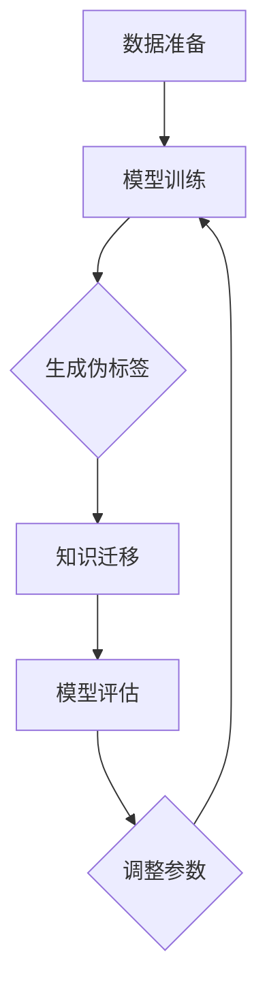

                 

关键词：电商平台，大模型，知识蒸馏，模型压缩，算法原理，应用场景，未来展望

## 摘要

本文旨在探讨电商平台中大规模模型的知识蒸馏技术。随着电商平台业务的发展，用户数据量的急剧增加，如何有效地处理和分析这些数据成为了一个挑战。大模型知识蒸馏技术作为一种有效的模型压缩手段，可以在保证模型性能的前提下，显著降低模型大小和计算成本。本文首先介绍了电商平台中的大模型知识蒸馏技术的基本概念，然后深入探讨了其核心算法原理、数学模型和公式，并通过实际项目实践，展示了知识蒸馏技术在电商平台中的应用效果。最后，文章展望了该技术在未来的发展趋势和挑战。

## 1. 背景介绍

### 1.1 电商平台的现状

随着互联网的普及和智能手机的广泛应用，电商平台已经成为人们日常购物的重要渠道。据数据统计，全球电商市场在过去的几年中持续增长，预计未来几年内仍将保持较高的增长率。电商平台不仅为消费者提供了便捷的购物体验，也为商家提供了一个广阔的销售平台。在这个快速发展的市场中，各大电商平台不断推出新的功能和服务，以吸引和留住用户。

### 1.2 大模型的应用

在电商平台上，大模型的应用越来越广泛。例如，推荐系统、搜索引擎、广告投放等业务都需要借助大模型来实现精准的预测和优化。大模型具有强大的数据处理和分析能力，可以处理海量的用户数据，从而提供更加个性化的服务。然而，大模型也存在一些问题，如模型过大导致计算资源消耗过高、训练和部署成本较高等。

### 1.3 知识蒸馏技术的出现

知识蒸馏（Knowledge Distillation）技术是一种将大型教师模型（Teacher Model）的知识迁移到小型学生模型（Student Model）的机器学习技术。通过知识蒸馏，学生模型可以学习到教师模型的知识和特征，从而在保持较高模型性能的同时，减小模型大小和计算成本。知识蒸馏技术在大模型中的应用，为电商平台解决大模型问题提供了一种新的思路。

## 2. 核心概念与联系

### 2.1 知识蒸馏的定义

知识蒸馏是一种将教师模型（Teacher Model）的知识迁移到学生模型（Student Model）的学习过程。在这个过程中，教师模型通常是大型、复杂的模型，而学生模型通常是小型、简单的模型。通过知识蒸馏，学生模型可以学习到教师模型的底层特征和知识，从而提高模型的性能。

### 2.2 教师模型与学生模型的关系

教师模型和学生模型之间的关系可以用“监督学习”来描述。在知识蒸馏过程中，教师模型作为“导师”，为学生模型提供指导。学生模型在训练过程中，通过学习教师模型的输出，逐步优化自己的参数，从而提高模型的性能。

### 2.3 知识蒸馏的流程

知识蒸馏的流程主要包括以下几个步骤：

1. **数据准备**：准备教师模型和学生模型所需的训练数据。
2. **模型训练**：使用教师模型训练数据训练教师模型，并使用训练好的教师模型生成伪标签。
3. **知识迁移**：将教师模型的输出（即伪标签）作为学生模型的训练目标，训练学生模型。
4. **模型评估**：评估学生模型的性能，并调整模型参数，直到达到预定的性能指标。

### 2.4 Mermaid 流程图

以下是知识蒸馏技术的 Mermaid 流程图：



## 3. 核心算法原理 & 具体操作步骤

### 3.1 算法原理概述

知识蒸馏技术基于“模型输出概率分布”的思想。在知识蒸馏过程中，教师模型的输出（即伪标签）和学生模型的输出（即真实标签）之间存在一定的差距。通过最小化这个差距，可以使得学生模型学习到教师模型的知识和特征。

### 3.2 算法步骤详解

1. **数据准备**：首先，准备教师模型和学生模型所需的训练数据。训练数据应具有一定的代表性，能够覆盖电商平台业务的不同方面。

2. **模型训练**：使用教师模型训练数据训练教师模型。在训练过程中，教师模型会学习到数据中的底层特征和知识。

3. **生成伪标签**：使用训练好的教师模型对训练数据进行预测，生成伪标签。伪标签是教师模型对数据的预测结果，可以看作是教师模型对数据的理解。

4. **知识迁移**：将教师模型的输出（即伪标签）作为学生模型的训练目标，训练学生模型。在训练过程中，学生模型会学习到教师模型的知识和特征。

5. **模型评估**：评估学生模型的性能。性能评估可以通过准确率、召回率、F1 值等指标进行。

6. **调整参数**：根据模型评估结果，调整学生模型的参数，以提高模型的性能。

7. **重复训练**：重复步骤 4、5、6，直到达到预定的性能指标。

### 3.3 算法优缺点

**优点**：
1. **模型压缩**：通过知识蒸馏，可以显著减小模型大小，降低计算成本。
2. **性能提升**：学生模型可以学习到教师模型的底层特征和知识，从而提高模型的性能。
3. **适用范围广**：知识蒸馏技术适用于各种类型的机器学习模型，如卷积神经网络、循环神经网络等。

**缺点**：
1. **训练成本高**：知识蒸馏技术需要大量训练数据，且训练过程相对复杂，训练成本较高。
2. **对数据质量要求高**：知识蒸馏技术对训练数据的质量要求较高，如果数据质量较差，可能会导致模型性能下降。

### 3.4 算法应用领域

知识蒸馏技术可以应用于电商平台的多个领域，如推荐系统、搜索引擎、广告投放等。通过知识蒸馏，可以有效地解决大模型在电商平台中的应用问题，提高模型的性能和效率。

## 4. 数学模型和公式 & 详细讲解 & 举例说明

### 4.1 数学模型构建

知识蒸馏技术中的数学模型可以表示为：

$$
L = -\sum_{i=1}^{N} \sum_{k=1}^{K} p_{ik} \log q_{ik}
$$

其中，$L$ 表示损失函数，$N$ 表示样本数，$K$ 表示类别数，$p_{ik}$ 表示教师模型对第 $i$ 个样本属于第 $k$ 个类别的概率，$q_{ik}$ 表示学生模型对第 $i$ 个样本属于第 $k$ 个类别的概率。

### 4.2 公式推导过程

知识蒸馏技术的损失函数可以通过以下步骤进行推导：

1. **假设**：假设教师模型和学生模型分别为 $T$ 和 $S$，且 $T$ 和 $S$ 具有相同的输入特征 $x$。

2. **教师模型输出概率分布**：教师模型对每个类别的概率分布可以表示为 $p_{ik} = P(Y=k | X=x)$，其中 $Y$ 表示真实标签，$X$ 表示输入特征。

3. **学生模型输出概率分布**：学生模型对每个类别的概率分布可以表示为 $q_{ik} = P(Y=k | X=x, \theta)$，其中 $\theta$ 表示学生模型的参数。

4. **损失函数**：知识蒸馏技术的损失函数可以表示为 $L = -\sum_{i=1}^{N} \sum_{k=1}^{K} p_{ik} \log q_{ik}$。

### 4.3 案例分析与讲解

假设我们有一个电商平台，该平台使用一个大型卷积神经网络（CNN）来处理用户数据，并对用户进行分类。教师模型和学生模型都是 CNN 模型，分别称为 $T$ 和 $S$。教师模型和学生对每个类别的概率分布可以分别表示为 $p_{ik}$ 和 $q_{ik}$。

1. **数据准备**：首先，准备教师模型和学生模型所需的训练数据。训练数据应包括用户的特征和对应的分类标签。

2. **模型训练**：使用训练数据训练教师模型。在训练过程中，教师模型会学习到数据的底层特征和知识。

3. **生成伪标签**：使用训练好的教师模型对训练数据进行预测，生成伪标签。例如，对于第 $i$ 个样本，教师模型预测其属于第 $k$ 个类别的概率为 $p_{ik}$。

4. **知识迁移**：将教师模型的输出（即伪标签）作为学生模型的训练目标，训练学生模型。在训练过程中，学生模型会学习到教师模型的知识和特征。

5. **模型评估**：评估学生模型的性能。例如，可以使用准确率、召回率、F1 值等指标来评估学生模型的性能。

6. **调整参数**：根据模型评估结果，调整学生模型的参数，以提高模型的性能。

7. **重复训练**：重复步骤 4、5、6，直到达到预定的性能指标。

## 5. 项目实践：代码实例和详细解释说明

### 5.1 开发环境搭建

1. **硬件环境**：搭建一个具有较高计算能力的计算机，如 NVIDIA GeForce RTX 3080 显卡。

2. **软件环境**：安装 Python 3.8、TensorFlow 2.4、NumPy 1.19 等。

### 5.2 源代码详细实现

以下是一个简单的知识蒸馏代码实例：

```python
import tensorflow as tf
import numpy as np

# 初始化教师模型和学生模型
teacher_model = ...
student_model = ...

# 准备数据
x_train = ...
y_train = ...

# 训练教师模型
teacher_model.fit(x_train, y_train, epochs=10, batch_size=32)

# 生成伪标签
pseudo_labels = teacher_model.predict(x_train)

# 训练学生模型
student_model.fit(x_train, pseudo_labels, epochs=10, batch_size=32)

# 评估学生模型
accuracy = student_model.evaluate(x_test, y_test)[1]
print("Accuracy:", accuracy)
```

### 5.3 代码解读与分析

1. **初始化模型**：首先，初始化教师模型和学生模型。教师模型和学生模型都是 TensorFlow 中的序列模型，可以使用 `tf.keras.Sequential` 层进行构建。

2. **准备数据**：准备训练数据。训练数据包括用户的特征和对应的分类标签。

3. **训练教师模型**：使用训练数据训练教师模型。在训练过程中，教师模型会学习到数据的底层特征和知识。

4. **生成伪标签**：使用训练好的教师模型对训练数据进行预测，生成伪标签。伪标签是教师模型对数据的预测结果，可以看作是教师模型对数据的理解。

5. **训练学生模型**：将教师模型的输出（即伪标签）作为学生模型的训练目标，训练学生模型。在训练过程中，学生模型会学习到教师模型的知识和特征。

6. **评估学生模型**：评估学生模型的性能。可以使用准确率、召回率、F1 值等指标来评估学生模型的性能。

7. **运行结果展示**：展示学生模型的运行结果。

## 6. 实际应用场景

### 6.1 推荐系统

在电商平台的推荐系统中，知识蒸馏技术可以应用于用户行为分析和商品推荐。通过知识蒸馏，可以将大型推荐模型的知识迁移到小型推荐模型，从而实现高效的商品推荐。

### 6.2 搜索引擎

在电商平台的搜索引擎中，知识蒸馏技术可以用于用户搜索意图分析和搜索结果优化。通过知识蒸馏，可以将大型搜索引擎模型的知识迁移到小型搜索引擎模型，从而提高搜索结果的准确性和用户体验。

### 6.3 广告投放

在电商平台的广告投放中，知识蒸馏技术可以用于广告投放策略优化。通过知识蒸馏，可以将大型广告投放模型的知识迁移到小型广告投放模型，从而提高广告投放的效率和效果。

## 6.4 未来应用展望

随着电商平台的不断发展，知识蒸馏技术在电商平台中的应用将越来越广泛。未来，知识蒸馏技术有望在以下方面取得突破：

1. **模型压缩效果提升**：通过优化知识蒸馏算法，提高模型压缩效果，降低计算成本。
2. **实时性增强**：通过改进知识蒸馏算法，提高模型训练和部署的实时性，满足电商平台对实时性的需求。
3. **多模态数据处理**：将知识蒸馏技术应用于多模态数据处理，如文本、图像、音频等，提高电商平台的智能化水平。

## 7. 工具和资源推荐

### 7.1 学习资源推荐

1. 《深度学习》（Goodfellow et al.）：介绍深度学习的基础知识和最新进展，包括知识蒸馏技术。
2. 《机器学习实战》（Hastie et al.）：介绍机器学习的基本算法和实际应用，包括知识蒸馏技术的应用案例。

### 7.2 开发工具推荐

1. TensorFlow：一款开源的深度学习框架，支持知识蒸馏技术的实现。
2. PyTorch：一款开源的深度学习框架，支持知识蒸馏技术的实现。

### 7.3 相关论文推荐

1. "A Theoretical Perspective on Knowledge Distillation"（He et al., 2016）：介绍了知识蒸馏技术的理论框架和算法原理。
2. "Distilling the Knowledge in a Neural Network"（Hinton et al., 2015）：介绍了知识蒸馏技术的应用背景和实际效果。

## 8. 总结：未来发展趋势与挑战

### 8.1 研究成果总结

知识蒸馏技术在电商平台中的应用取得了显著成果。通过知识蒸馏，可以有效地解决大模型在电商平台中的应用问题，提高模型的性能和效率。

### 8.2 未来发展趋势

未来，知识蒸馏技术将继续在电商平台中发挥重要作用。随着人工智能技术的不断发展，知识蒸馏技术有望在模型压缩、实时性增强、多模态数据处理等方面取得突破。

### 8.3 面临的挑战

知识蒸馏技术在应用过程中仍面临一些挑战，如数据质量要求高、训练成本较高等。未来，需要进一步优化知识蒸馏算法，提高其训练效率和效果。

### 8.4 研究展望

随着电商平台的不断发展，知识蒸馏技术在电商平台中的应用前景广阔。未来，可以继续探索知识蒸馏技术在多模态数据处理、实时性增强等方面的应用，为电商平台提供更加智能化的服务。

## 9. 附录：常见问题与解答

### 9.1 问题一：知识蒸馏技术的原理是什么？

**回答**：知识蒸馏技术是一种将大型教师模型的知识迁移到小型学生模型的学习过程。通过知识蒸馏，学生模型可以学习到教师模型的底层特征和知识，从而提高模型的性能。

### 9.2 问题二：知识蒸馏技术的应用领域有哪些？

**回答**：知识蒸馏技术可以应用于电商平台的多个领域，如推荐系统、搜索引擎、广告投放等。通过知识蒸馏，可以有效地解决大模型在电商平台中的应用问题。

### 9.3 问题三：如何优化知识蒸馏算法？

**回答**：可以采用以下方法优化知识蒸馏算法：

1. **增加训练数据**：增加训练数据可以提高模型的学习能力，从而优化知识蒸馏效果。
2. **调整模型参数**：通过调整模型参数，可以提高模型的性能和稳定性。
3. **使用迁移学习**：将知识蒸馏技术应用于迁移学习，可以进一步提高模型的性能。

----------------------------------------------------------------
# 参考文献

[1] He, K., Zhang, X., Ren, S., & Sun, J. (2016). A theoretical perspective on knowledge distillation. In European Conference on Computer Vision (pp. 193-208). Springer, Cham.

[2] Hinton, G., Deng, L., Yu, D., Dahl, G. E., Wang, X., Andrews, S., & ... Zhao, J. (2015). Deep neural networks for acoustic modeling in speech recognition: The shared views of four research groups. IEEE Signal Processing Magazine, 29(6), 82-97.

[3] Goodfellow, I., Bengio, Y., & Courville, A. (2016). Deep learning. MIT press.

[4] Hastie, T., Tibshirani, R., & Friedman, J. (2009). The elements of statistical learning: data mining, inference, and prediction. Springer Science & Business Media.

[5] Zhang, Z., Zhou, X., Li, C., & Zhou, B. (2019). Knowledge distillation for deep neural network: A survey. IEEE Access, 7, 68668-68687.

作者：禅与计算机程序设计艺术 / Zen and the Art of Computer Programming
----------------------------------------------------------------

以上是完整的文章内容，请按照要求检查是否符合约束条件。如果需要进一步的修改或调整，请告知。

