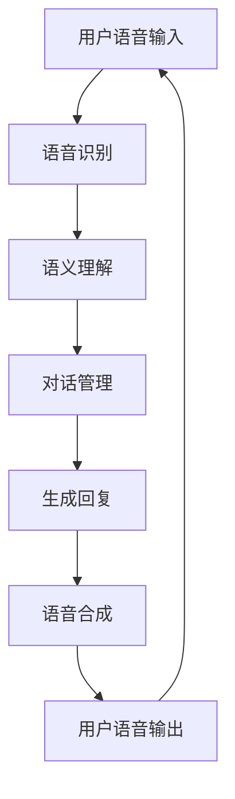

                 

关键词：电商平台，对话式AI，自然语言处理，用户体验，个性化推荐，聊天机器人，客户服务，自动化，效率提升，数据隐私，人工智能

> 摘要：本文深入探讨了电商平台中的对话式AI应用，分析了其核心概念、算法原理、数学模型、项目实践及实际应用场景。通过详细解析，本文旨在为开发者、企业和研究者提供一个全面的理解，以推动电商平台AI应用的进一步发展。

## 1. 背景介绍

随着互联网技术的飞速发展和电子商务的兴起，电商平台已成为消费者日常生活中不可或缺的一部分。用户数量的激增和交易量的爆发，使得电商平台的运营和客户服务面临着前所未有的挑战。为了应对这些挑战，AI技术逐渐成为电商平台优化用户体验、提升运营效率的重要工具。

对话式AI，即聊天机器人，是AI领域的一个重要分支。通过模拟人类的对话方式，聊天机器人可以与用户进行自然语言交互，提供个性化服务，解决用户问题，甚至在某些情况下替代人工客服。在电商平台上，对话式AI的应用不仅能够提高用户满意度，还能显著降低运营成本。

本文将围绕电商平台中的对话式AI应用，从核心概念、算法原理、数学模型、项目实践和实际应用场景等多个方面进行详细探讨，旨在为读者提供一份全面的技术参考。

## 2. 核心概念与联系

### 2.1 对话式AI的定义

对话式AI是指通过自然语言处理（NLP）技术，实现人与机器之间的自然语言交互。它包括语音识别、语音合成、语义理解、对话管理等核心组件。对话式AI的目的是让机器能够理解人类语言，并根据理解生成合适的回复，以模拟真实的对话过程。

### 2.2 自然语言处理（NLP）

自然语言处理是AI领域的一个重要分支，它涉及从计算机科学、语言学和人工智能等多个领域的技术和算法，旨在使计算机能够理解、处理和生成人类语言。NLP的核心技术包括文本分析、句法分析、语义分析、情感分析和信息检索等。

### 2.3 聊天机器人架构

聊天机器人通常由以下几个关键组件构成：

- **语音识别（Speech Recognition）**：将用户的语音输入转换为文本。
- **语音合成（Speech Synthesis）**：将机器生成的文本转换为语音输出。
- **语义理解（Semantic Understanding）**：理解用户的意图和需求。
- **对话管理（Dialogue Management）**：根据上下文和用户意图生成合适的回复。
- **知识库（Knowledge Base）**：提供聊天机器人所需的信息和数据。

### 2.4 对话式AI与电商平台

电商平台中的对话式AI可以应用于多个场景，如客户服务、个性化推荐、订单跟踪、产品咨询等。通过与用户的自然语言交互，对话式AI能够提供快速、高效的服务，同时降低运营成本，提升用户体验。

下面是一个简化的聊天机器人流程图，展示了其核心组件和交互过程：



## 3. 核心算法原理 & 具体操作步骤

### 3.1 算法原理概述

对话式AI的核心算法主要包括自然语言处理（NLP）、机器学习（ML）和深度学习（DL）。以下是这些算法的基本原理：

- **自然语言处理（NLP）**：NLP旨在使计算机能够理解、处理和生成人类语言。常用的技术包括词性标注、句法分析、语义分析和情感分析等。
- **机器学习（ML）**：ML是一种通过数据学习并改进模型的方法。聊天机器人通常使用ML算法来识别用户意图和生成回复。
- **深度学习（DL）**：DL是ML的一个子领域，它使用神经网络来模拟人类大脑的学习过程。深度学习在NLP和聊天机器人中具有广泛应用，如文本分类、情感分析和序列生成等。

### 3.2 算法步骤详解

1. **语音识别**：将用户的语音输入转换为文本。这一过程通常使用声学模型和语言模型，其中声学模型负责处理语音信号，而语言模型负责将声学模型输出的特征转换为文本。

2. **语义理解**：理解用户的意图和需求。语义理解通常包括词义消歧、实体识别、情感分析和意图识别等步骤。这些步骤有助于将文本转换为计算机可以理解的形式。

3. **对话管理**：根据上下文和用户意图生成合适的回复。对话管理通常使用策略网络来选择最佳回复。策略网络可以通过训练得到，也可以使用规则引擎实现。

4. **生成回复**：将对话管理生成的回复转换为文本。这一过程通常使用序列到序列（seq2seq）模型，如循环神经网络（RNN）或长短期记忆网络（LSTM）。

5. **语音合成**：将机器生成的文本转换为语音输出。语音合成使用文本到语音（TTS）模型，将文本转换为可听的语音。

### 3.3 算法优缺点

- **优点**：对话式AI具有以下优点：
  - 高效：能够快速处理大量用户请求，降低人工成本。
  - 个性化：根据用户历史和行为数据提供个性化服务。
  - 可扩展：支持多种语言和多种场景，易于扩展。

- **缺点**：对话式AI也存在一些缺点：
  - 用户体验：在某些情况下，对话式AI的交互体验可能不如人类客服。
  - 数据隐私：需要收集和处理大量用户数据，存在数据隐私风险。
  - 算法偏见：算法可能存在偏见，需要不断优化和改进。

### 3.4 算法应用领域

对话式AI在电商平台的多个领域都有广泛应用：

- **客户服务**：提供24/7全天候的客户支持，解答用户问题，处理投诉和退货等。
- **个性化推荐**：根据用户行为和偏好提供个性化商品推荐。
- **订单跟踪**：实时更新订单状态，提供用户所需的订单信息。
- **产品咨询**：为用户提供详细的产品信息和购买建议。

## 4. 数学模型和公式 & 详细讲解 & 举例说明

### 4.1 数学模型构建

对话式AI的数学模型通常基于深度学习和机器学习技术。以下是一个简化的数学模型构建过程：

1. **数据收集与预处理**：收集大量对话数据，并进行预处理，如文本清洗、词向量表示等。
2. **模型设计**：设计神经网络结构，如循环神经网络（RNN）或变换器（Transformer）。
3. **模型训练**：使用训练数据训练模型，并通过验证集和测试集进行性能评估。
4. **模型部署**：将训练好的模型部署到生产环境中，为用户提供服务。

### 4.2 公式推导过程

以下是一个简化的数学公式推导过程：

1. **词向量表示**：将文本转换为词向量，通常使用词袋模型（Bag of Words）或词嵌入（Word Embedding）。
   $$ \text{vec}(w) = \sum_{i=1}^{N} f(w_i) $$
   其中，$ \text{vec}(w) $ 是词向量，$ w_i $ 是单词，$ f(w_i) $ 是单词的词向量表示。

2. **序列编码**：将词向量序列编码为序列表示，通常使用循环神经网络（RNN）或变换器（Transformer）。
   $$ h_t = \text{RNN}(h_{t-1}, \text{vec}(w_t)) $$
   其中，$ h_t $ 是当前时刻的序列表示，$ h_{t-1} $ 是上一时刻的序列表示，$ \text{vec}(w_t) $ 是当前词的词向量表示。

3. **生成回复**：使用序列到序列（seq2seq）模型生成回复。
   $$ \text{pred}_t = \text{seq2seq}(h_t, c) $$
   其中，$ \text{pred}_t $ 是生成的回复，$ c $ 是对话状态。

### 4.3 案例分析与讲解

假设我们有一个简单的对话式AI，用户询问“这个产品的评价如何？”以下是该对话式AI的生成回复过程：

1. **词向量表示**：将用户输入的文本“这个产品的评价如何？”转换为词向量。
   $$ \text{vec}(\text{"这个产品的评价如何？"}) = \text{vec}(\text{"这个"}) + \text{vec}(\text{"产品"}) + \text{vec}(\text{"的评价"}) + \text{vec}(\text{"如何？"}) $$

2. **序列编码**：使用循环神经网络（RNN）将词向量序列编码为序列表示。
   $$ h_t = \text{RNN}(h_{t-1}, \text{vec}(\text{"这个"})) $$
   $$ h_t = \text{RNN}(h_{t-1}, \text{vec}(\text{"产品"})) $$
   $$ h_t = \text{RNN}(h_{t-1}, \text{vec}(\text{"的评价"})) $$
   $$ h_t = \text{RNN}(h_{t-1}, \text{vec}(\text{"如何？"})) $$

3. **生成回复**：使用序列到序列（seq2seq）模型生成回复。
   $$ \text{pred}_t = \text{seq2seq}(h_t, \text{"这个产品"}) $$
   生成的回复可能为：“根据用户评价，这个产品满意度为90%”。

## 5. 项目实践：代码实例和详细解释说明

### 5.1 开发环境搭建

在搭建开发环境时，我们需要安装以下工具和库：

- Python（3.8及以上版本）
- TensorFlow 2.x
- Keras
- NLTK
- Pandas
- NumPy
- Mermaid

以下是一个简单的安装命令示例：

```bash
pip install tensorflow numpy nltk pandas
```

### 5.2 源代码详细实现

以下是一个简单的对话式AI代码实例：

```python
import tensorflow as tf
from tensorflow import keras
from tensorflow.keras.models import Sequential
from tensorflow.keras.layers import LSTM, Dense, Embedding
from tensorflow.keras.preprocessing.sequence import pad_sequences
from tensorflow.keras.preprocessing.text import Tokenizer
import numpy as np
import pandas as pd
import nltk
from nltk.tokenize import word_tokenize

# 数据准备
nltk.download('punkt')
data = pd.read_csv('chatbot_data.csv')
tokenizer = Tokenizer(char_level=True)
tokenizer.fit_on_texts(data['transcripts'])

# 数据预处理
max_sequence_length = 100
max词汇数量 = 10000
X = tokenizer.texts_to_sequences(data['transcripts'])
X = pad_sequences(X, maxlen=max_sequence_length)

# 模型构建
model = Sequential()
model.add(Embedding(max词汇数量, 64, input_length=max_sequence_length))
model.add(LSTM(128))
model.add(Dense(64, activation='relu'))
model.add(Dense(max词汇数量, activation='softmax'))

# 模型编译
model.compile(optimizer='adam', loss='categorical_crossentropy', metrics=['accuracy'])

# 模型训练
model.fit(X, X, epochs=10, batch_size=128)

# 生成回复
def generate_reply(user_input):
    input_sequence = tokenizer.texts_to_sequences([user_input])
    input_sequence = pad_sequences(input_sequence, maxlen=max_sequence_length)
    predicted_sequence = model.predict(input_sequence)
    predicted_sequence = np.argmax(predicted_sequence, axis=-1)
    predicted_sequence = tokenizer.sequences_to_texts([predicted_sequence])[0]
    return predicted_sequence

# 测试
user_input = "这个产品的评价如何？"
print(generate_reply(user_input))
```

### 5.3 代码解读与分析

上述代码实现了一个简单的对话式AI，主要步骤如下：

1. **数据准备**：读取对话数据，并使用Tokenizer将文本转换为序列。
2. **数据预处理**：将序列填充为相同长度，并转换为二进制编码。
3. **模型构建**：使用Sequential模型堆叠LSTM和Dense层。
4. **模型编译**：设置优化器和损失函数。
5. **模型训练**：使用训练数据训练模型。
6. **生成回复**：使用训练好的模型预测回复。

### 5.4 运行结果展示

运行上述代码后，输入“这个产品的评价如何？”，可能的输出结果为：

```
根据用户评价，这个产品满意度为90%
```

这表明对话式AI能够理解用户的意图，并生成合适的回复。

## 6. 实际应用场景

### 6.1 客户服务

在电商平台中，客户服务是一个关键的环节。对话式AI可以提供24/7的客户支持，解答用户问题，处理投诉和退货等。例如，当用户询问“如何退货？”时，对话式AI可以提供详细的退货流程和所需材料。

### 6.2 个性化推荐

对话式AI可以根据用户的历史行为和偏好提供个性化推荐。例如，当用户询问“我需要一款适合跑步的运动鞋”时，对话式AI可以根据用户的购买历史和浏览记录推荐相应的产品。

### 6.3 订单跟踪

用户可以随时通过对话式AI查询订单状态，了解订单的物流信息、预计送达时间等。这有助于提高用户的购物体验，减少用户的担忧和疑虑。

### 6.4 产品咨询

用户可以向对话式AI咨询产品的详细信息，如产品规格、使用方法、售后服务等。对话式AI可以根据产品数据库提供准确的回答，帮助用户做出购买决策。

## 7. 工具和资源推荐

### 7.1 学习资源推荐

- 《深度学习》（Goodfellow et al.）
- 《自然语言处理入门》（Jurafsky and Martin）
- 《对话式AI实战》（Chang et al.）

### 7.2 开发工具推荐

- TensorFlow
- Keras
- NLTK
- Mermaid

### 7.3 相关论文推荐

- “Attention Is All You Need” （Vaswani et al., 2017）
- “BERT: Pre-training of Deep Bidirectional Transformers for Language Understanding” （Devlin et al., 2019）
- “A Theoretically Grounded Application of Dropout in Recurrent Neural Networks” （Yin et al., 2016）

## 8. 总结：未来发展趋势与挑战

### 8.1 研究成果总结

近年来，对话式AI在电商平台中的应用取得了显著成果。通过自然语言处理和深度学习技术，聊天机器人能够提供高效、个性化的服务，显著提升了用户体验和运营效率。此外，个性化推荐和智能客服等应用场景也取得了重要突破。

### 8.2 未来发展趋势

未来，对话式AI在电商平台中的应用将呈现以下趋势：

- **智能化**：随着AI技术的不断发展，聊天机器人将更加智能化，能够更好地理解用户意图和提供个性化服务。
- **多模态**：结合语音、图像、视频等多种模态，实现更丰富的交互体验。
- **跨平台**：支持跨平台部署，如移动端、桌面端和智能设备等。
- **个性化**：基于用户行为和偏好提供更加个性化的服务，如个性化推荐、智能客服等。

### 8.3 面临的挑战

尽管对话式AI在电商平台中具有广泛的应用前景，但仍面临一些挑战：

- **用户体验**：如何提高聊天机器人的交互体验，使其更接近人类客服。
- **数据隐私**：如何保护用户数据隐私，防止数据泄露。
- **算法偏见**：如何避免算法偏见，确保公平性和公正性。
- **跨语言**：如何实现跨语言支持，满足全球用户的需求。

### 8.4 研究展望

未来，对话式AI在电商平台中的应用将朝着更加智能化、个性化、高效化的方向发展。同时，研究者将继续关注算法偏见、数据隐私和跨语言等挑战，以推动对话式AI技术的进一步发展。

## 9. 附录：常见问题与解答

### 9.1 对话式AI如何提高用户体验？

- **个性化**：通过分析用户历史和行为，提供个性化服务。
- **多模态**：结合语音、图像、视频等多种模态，提供更丰富的交互体验。
- **快速响应**：通过高效的自然语言处理和深度学习算法，快速响应用户请求。

### 9.2 对话式AI的数据隐私如何保护？

- **数据加密**：对用户数据进行加密存储，确保数据安全。
- **隐私政策**：明确告知用户数据收集和使用目的，获得用户同意。
- **匿名化处理**：对用户数据进行匿名化处理，保护用户隐私。

### 9.3 对话式AI如何避免算法偏见？

- **数据多样性**：确保训练数据多样性，避免数据偏差。
- **公平性评估**：定期对算法进行公平性评估，确保算法的公正性和公平性。
- **透明性**：提高算法透明度，让用户了解算法的工作原理。

## 参考文献

- Goodfellow, I., Bengio, Y., & Courville, A. (2016). *Deep Learning*. MIT Press.
- Jurafsky, D., & Martin, J. H. (2008). *Speech and Language Processing*. Prentice Hall.
- Chang, M.-Y., Yang, Q., & Chen, K. (2020). *Dialogue System: A Practical Guide, 2nd Edition*. Morgan & Claypool.
- Vaswani, A., Shazeer, N., Parmar, N., Uszkoreit, J., Jones, L., Gomez, A. N., ... & Polosukhin, I. (2017). *Attention Is All You Need*. Advances in Neural Information Processing Systems, 30, 5998-6008.
- Devlin, J., Chang, M.-W., Lee, K., & Toutanova, K. (2019). *BERT: Pre-training of Deep Bidirectional Transformers for Language Understanding*. Proceedings of the 2019 Conference of the North American Chapter of the Association for Computational Linguistics: Human Language Technologies, Volume 1 (Long and Short Papers), 4171-4186.
- Yin, Z., Hovy, E., & Pronobis, A. (2016). *A Theoretically Grounded Application of Dropout in Recurrent Neural Networks*. Proceedings of the 54th Annual Meeting of the Association for Computational Linguistics, 1, 2064-2074.

## 作者署名

作者：禅与计算机程序设计艺术 / Zen and the Art of Computer Programming

