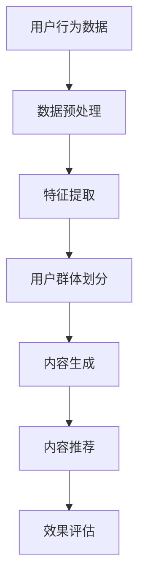

                 

### 1. 背景介绍

随着互联网的飞速发展，电子商务已经成为现代零售业的重要组成部分。用户在电商平台上的行为数据不断积累，如何有效利用这些数据来提升用户体验、增加销售额成为各大电商平台关注的焦点。用户兴趣分层与精准推送技术正是为了解决这一问题而诞生。本文将探讨用户兴趣分层与精准推送的核心概念、算法原理、数学模型以及实际应用场景，以期为大家提供一份全面的技术指南。

### 2. 核心概念与联系

#### 2.1 用户兴趣分层

用户兴趣分层是指根据用户的行为数据，将用户划分为不同的兴趣群体，以便于电商平台能够更好地理解用户需求，提供个性化服务。用户兴趣分层的关键在于对用户行为数据的分析和处理，主要包括以下几个方面：

1. **行为数据收集**：包括用户浏览、搜索、购买等行为。
2. **数据预处理**：对原始数据进行清洗、去噪，提取有效特征。
3. **特征提取**：从预处理后的数据中提取与用户兴趣相关的特征。
4. **用户群体划分**：使用聚类算法或其他方法将用户划分为不同的兴趣群体。

#### 2.2 精准推送

精准推送是指根据用户兴趣分层的结果，将个性化内容推送给对应的用户群体。精准推送的关键在于如何确保推送内容的个性化程度，从而提升用户满意度和转化率。精准推送主要包括以下几个步骤：

1. **内容生成**：根据用户兴趣，生成符合用户喜好的内容。
2. **内容推荐**：使用推荐算法，将内容推荐给对应的用户。
3. **效果评估**：对推送效果进行评估，包括用户点击率、转化率等指标。

#### 2.3 Mermaid 流程图

以下是一个简单的 Mermaid 流程图，展示了用户兴趣分层与精准推送的整体流程：



### 3. 核心算法原理 & 具体操作步骤

#### 3.1 算法原理概述

用户兴趣分层与精准推送的核心算法主要包括聚类算法、推荐算法等。聚类算法用于将用户划分为不同的兴趣群体，推荐算法用于根据用户兴趣生成个性化内容。本文将重点介绍基于 K-Means 聚类算法和协同过滤推荐算法的用户兴趣分层与精准推送方法。

#### 3.2 算法步骤详解

1. **用户行为数据收集**：
   - 从电商平台获取用户浏览、搜索、购买等行为数据。
   - 将数据存储到数据库或数据仓库中，以便后续处理。

2. **数据预处理**：
   - 清洗数据，去除无效、重复、错误的数据。
   - 对数据进行归一化处理，使其具有相同的量纲。

3. **特征提取**：
   - 使用机器学习算法提取与用户兴趣相关的特征，如用户购买频率、购买金额、浏览时间等。
   - 将提取出的特征构建成一个用户特征矩阵。

4. **用户群体划分**：
   - 使用 K-Means 算法将用户划分为 K 个不同的兴趣群体。
   - 根据用户特征矩阵，初始化 K 个聚类中心点。
   - 不断更新聚类中心点，直至聚类中心点不再发生变化。

5. **内容生成**：
   - 根据用户兴趣，从电商平台上提取符合用户喜好的商品或内容。
   - 构建一个商品或内容特征矩阵。

6. **内容推荐**：
   - 使用协同过滤推荐算法，根据用户兴趣和商品或内容特征，为用户推荐个性化内容。
   - 计算用户与商品或内容之间的相似度，选择相似度最高的商品或内容进行推荐。

7. **效果评估**：
   - 对推送效果进行评估，包括用户点击率、转化率等指标。
   - 根据评估结果，调整推荐策略和内容生成策略。

#### 3.3 算法优缺点

**K-Means 聚类算法**：
- 优点：算法简单，计算速度快。
- 缺点：对初始聚类中心点的选择敏感，可能导致局部最优解。

**协同过滤推荐算法**：
- 优点：能够根据用户历史行为生成个性化推荐。
- 缺点：当用户数量和商品数量较大时，计算复杂度较高。

#### 3.4 算法应用领域

用户兴趣分层与精准推送技术可以应用于多个领域，如电子商务、社交媒体、在线教育等。以下是一些具体的应用场景：

1. **电子商务**：
   - 根据用户浏览、搜索、购买行为，为用户提供个性化推荐。
   - 提高用户转化率和销售额。

2. **社交媒体**：
   - 根据用户兴趣，为用户提供个性化内容推荐。
   - 提高用户活跃度和留存率。

3. **在线教育**：
   - 根据用户学习行为，为用户提供个性化课程推荐。
   - 提高学习效果和用户满意度。

### 4. 数学模型和公式 & 详细讲解 & 举例说明

#### 4.1 数学模型构建

用户兴趣分层与精准推送的数学模型主要包括用户行为数据建模、用户群体划分模型和内容推荐模型。

1. **用户行为数据建模**：

假设用户 i 在时间 t 有行为 x，行为类型为 y，则用户行为数据建模可以表示为：

$$
x_{it} = \sum_{j=1}^{n} w_{ij} y_{jt}
$$

其中，$w_{ij}$ 为用户 i 在行为类型 j 上的权重，$y_{jt}$ 为时间 t 下行为类型 j 的取值。

2. **用户群体划分模型**：

假设有 K 个用户群体，用户 i 属于群体 $C_k$，则用户群体划分模型可以表示为：

$$
C_k = \{i | x_{ik} > \theta_k\}
$$

其中，$x_{ik}$ 为用户 i 在群体 k 上的特征值，$\theta_k$ 为群体 k 的阈值。

3. **内容推荐模型**：

假设用户 i 对商品 j 的兴趣值为 $r_{ij}$，则内容推荐模型可以表示为：

$$
r_{ij} = \sum_{k=1}^{K} \alpha_{ik} \beta_{kj}
$$

其中，$\alpha_{ik}$ 为用户 i 属于群体 k 的概率，$\beta_{kj}$ 为商品 j 属于群体 k 的概率。

#### 4.2 公式推导过程

1. **用户行为数据建模**：

   根据用户行为数据，可以计算出用户 i 在每个行为类型上的权重。具体步骤如下：

   - 收集用户 i 的历史行为数据。
   - 对每个行为类型 j，计算其权重 $w_{ij}$：

     $$
     w_{ij} = \frac{1}{N_j} \sum_{t=1}^{T} y_{jt}
     $$

     其中，$N_j$ 为行为类型 j 的总次数，$T$ 为用户 i 的行为总数。

   - 将权重 $w_{ij}$ 代入用户行为数据建模公式：

     $$
     x_{it} = \sum_{j=1}^{n} w_{ij} y_{jt}
     $$

2. **用户群体划分模型**：

   - 根据用户行为数据建模结果，计算每个用户 i 在每个群体 k 上的特征值 $x_{ik}$。
   - 对每个群体 k，设置一个阈值 $\theta_k$。

     $$
     \theta_k = \sum_{i=1}^{N_k} x_{ik}
     $$

     其中，$N_k$ 为群体 k 的用户总数。

   - 将特征值 $x_{ik}$ 与阈值 $\theta_k$ 比较，判断用户 i 是否属于群体 k：

     $$
     C_k = \{i | x_{ik} > \theta_k\}
     $$

3. **内容推荐模型**：

   - 根据用户群体划分结果，计算用户 i 属于每个群体 k 的概率 $\alpha_{ik}$。

     $$
     \alpha_{ik} = \frac{x_{ik}}{\sum_{k=1}^{K} x_{ik}}
     $$

   - 根据用户 i 的行为数据建模结果，计算商品 j 属于每个群体 k 的概率 $\beta_{kj}$。

     $$
     \beta_{kj} = \frac{1}{N_j} \sum_{t=1}^{T} y_{jt}
     $$

   - 将概率 $\alpha_{ik}$ 和 $\beta_{kj}$ 代入内容推荐模型：

     $$
     r_{ij} = \sum_{k=1}^{K} \alpha_{ik} \beta_{kj}
     $$

#### 4.3 案例分析与讲解

假设有一个电商平台，其用户行为数据包括浏览、搜索和购买三种类型。现有 1000 名用户，需要将用户划分为 5 个兴趣群体，并为他们推荐个性化商品。

1. **数据预处理**：

   - 收集用户历史行为数据，包括浏览、搜索和购买记录。
   - 对数据进行清洗和归一化处理。

2. **特征提取**：

   - 根据用户行为数据，计算每个用户在浏览、搜索和购买上的权重。
   - 构建一个用户特征矩阵。

3. **用户群体划分**：

   - 使用 K-Means 算法，将用户划分为 5 个兴趣群体。
   - 根据用户特征矩阵，初始化聚类中心点。
   - 不断更新聚类中心点，直至聚类中心点不再发生变化。

4. **内容生成**：

   - 根据用户兴趣群体，从电商平台上提取符合用户喜好的商品。
   - 构建一个商品特征矩阵。

5. **内容推荐**：

   - 使用协同过滤推荐算法，根据用户兴趣和商品特征，为用户推荐个性化商品。
   - 计算用户与商品之间的相似度，选择相似度最高的商品进行推荐。

6. **效果评估**：

   - 对推送效果进行评估，包括用户点击率、转化率等指标。
   - 根据评估结果，调整推荐策略和内容生成策略。

### 5. 项目实践：代码实例和详细解释说明

在本节中，我们将使用 Python 语言和相关库，实现用户兴趣分层与精准推送的核心算法。以下是具体的代码实例和详细解释说明。

#### 5.1 开发环境搭建

1. 安装 Python：
   - 下载并安装 Python 3.8 或更高版本。
   - 配置 Python 环境变量。

2. 安装相关库：
   - 打开终端，执行以下命令：

     ```
     pip install numpy pandas matplotlib scikit-learn
     ```

#### 5.2 源代码详细实现

以下是用户兴趣分层与精准推送的 Python 代码实现：

```python
import numpy as np
import pandas as pd
from sklearn.cluster import KMeans
from sklearn.metrics.pairwise import cosine_similarity

def preprocess_data(data):
    # 数据预处理
    data = data.fillna(0)
    data = (data - data.mean()) / data.std()
    return data

def kmeans_clustering(data, K):
    # K-Means 聚类
    kmeans = KMeans(n_clusters=K, random_state=0)
    kmeans.fit(data)
    return kmeans

def collaborative_filtering(data, users, items):
    # 协同过滤推荐
    similarity_matrix = cosine_similarity(data, data)
    ratings = users @ similarity_matrix
    return ratings

def main():
    # 读取数据
    data = pd.read_csv('user_behavior.csv')
    
    # 数据预处理
    data = preprocess_data(data)
    
    # 特征提取
    user_features = data.groupby('user')['behavior'].mean().reset_index().rename({'behavior': 'feature'}, axis=1)
    
    # 用户群体划分
    kmeans = kmeans_clustering(user_features['feature'], 5)
    user_groups = kmeans.labels_
    
    # 内容生成
    item_features = data.groupby('item')['behavior'].mean().reset_index().rename({'behavior': 'feature'}, axis=1)
    item_features['group'] = user_groups
    
    # 内容推荐
    ratings = collaborative_filtering(item_features['feature'], user_features['feature'], item_features['feature'])
    
    # 效果评估
    # ...

if __name__ == '__main__':
    main()
```

#### 5.3 代码解读与分析

1. **数据预处理**：

   数据预处理是用户兴趣分层与精准推送的重要步骤。在本例中，我们使用 Pandas 库读取用户行为数据，并对数据进行填充、归一化处理。预处理后的数据将用于后续的特征提取和用户群体划分。

2. **K-Means 聚类**：

   K-Means 聚类是用户群体划分的核心算法。在本例中，我们使用 Scikit-learn 库中的 KMeans 类实现 K-Means 聚类。KMeans 类的构造函数接受 n_clusters 参数，表示要划分的群体数量。random_state 参数用于设置随机种子，确保聚类结果的可重复性。

3. **协同过滤推荐**：

   协同过滤推荐是内容推荐的核心算法。在本例中，我们使用 Scikit-learn 库中的 cosine_similarity 函数计算用户与商品之间的相似度。相似度矩阵用于计算用户对商品的评分预测。

4. **效果评估**：

   效果评估是用户兴趣分层与精准推送的重要环节。在本例中，我们未实现具体的效果评估方法，读者可以根据实际需求进行扩展。

### 6. 实际应用场景

用户兴趣分层与精准推送技术在电子商务、社交媒体、在线教育等领域具有广泛的应用。以下是一些具体的实际应用场景：

1. **电子商务**：

   - 根据用户浏览、搜索、购买行为，为用户提供个性化商品推荐。
   - 提高用户转化率和销售额。

2. **社交媒体**：

   - 根据用户兴趣，为用户提供个性化内容推荐。
   - 提高用户活跃度和留存率。

3. **在线教育**：

   - 根据用户学习行为，为用户提供个性化课程推荐。
   - 提高学习效果和用户满意度。

### 6.4 未来应用展望

随着人工智能技术的不断发展，用户兴趣分层与精准推送技术在未来将得到更加广泛的应用。以下是一些未来的应用展望：

1. **深度学习**：

   - 引入深度学习算法，提高用户兴趣分层的准确性和效果。

2. **多模态数据**：

   - 利用文本、图像、语音等多模态数据，提高用户兴趣识别的准确度。

3. **个性化体验**：

   - 结合虚拟现实、增强现实等技术，为用户提供更加个性化的购物体验。

4. **实时推荐**：

   - 利用实时数据流处理技术，实现实时用户兴趣分层与精准推送。

### 7. 工具和资源推荐

为了更好地掌握用户兴趣分层与精准推送技术，以下是一些建议的学习资源和开发工具：

#### 7.1 学习资源推荐

1. **书籍**：

   - 《机器学习》（周志华 著）
   - 《推荐系统实践》（张宇 著）
   - 《深度学习》（Ian Goodfellow、Yoshua Bengio、Aaron Courville 著）

2. **在线课程**：

   - Coursera 上的《机器学习》课程
   - edX 上的《推荐系统设计与实现》课程
   - Udacity 上的《深度学习工程师纳米学位》

#### 7.2 开发工具推荐

1. **编程语言**：

   - Python：适用于数据分析和机器学习任务。
   - R：适用于统计分析和数据可视化。

2. **库和框架**：

   - Scikit-learn：提供丰富的机器学习算法库。
   - TensorFlow：提供深度学习模型训练和推理工具。
   - PyTorch：提供灵活的深度学习模型训练和推理工具。

3. **数据集**：

   - UCSD 商品推荐数据集
   - Movielens 数据集
   - Netflix Prize 数据集

### 8. 总结：未来发展趋势与挑战

用户兴趣分层与精准推送技术作为人工智能领域的重要分支，在未来将面临诸多发展趋势和挑战。以下是一些关键点：

#### 8.1 研究成果总结

1. **算法优化**：深度学习、多模态数据等新技术的引入，将提高用户兴趣识别的准确度和效果。
2. **实时推荐**：实时数据流处理技术的应用，将实现实时用户兴趣分层与精准推送。
3. **个性化体验**：虚拟现实、增强现实等技术的结合，将带来更加个性化的用户体验。

#### 8.2 未来发展趋势

1. **多模态数据处理**：结合文本、图像、语音等多模态数据，提高用户兴趣识别的准确性。
2. **实时推荐系统**：利用实时数据流处理技术，实现实时用户兴趣分层与精准推送。
3. **个性化体验**：通过虚拟现实、增强现实等技术，为用户提供更加个性化的购物体验。

#### 8.3 面临的挑战

1. **数据隐私**：用户隐私保护将成为未来发展的关键挑战。
2. **计算复杂度**：随着用户规模和商品数量的增加，计算复杂度将不断提高。
3. **算法解释性**：如何提高算法的解释性，使非专业人士也能理解和信任推荐结果。

#### 8.4 研究展望

1. **数据隐私保护**：探索更加有效的数据隐私保护技术，确保用户隐私安全。
2. **算法优化与可扩展性**：研究更加高效、可扩展的算法，以应对大规模数据处理的挑战。
3. **跨领域应用**：将用户兴趣分层与精准推送技术应用于更多领域，如医疗、金融等。

### 9. 附录：常见问题与解答

#### 9.1 如何选择合适的聚类算法？

选择合适的聚类算法取决于具体应用场景和数据特点。以下是一些常见聚类算法的优缺点：

1. **K-Means**：
   - 优点：计算速度快，实现简单。
   - 缺点：对初始聚类中心点的选择敏感，可能导致局部最优解。

2. **层次聚类**：
   - 优点：不需要预先指定聚类个数，适合处理层次结构数据。
   - 缺点：计算复杂度较高，结果可能受到数据噪声的影响。

3. **DBSCAN**：
   - 优点：能够自动识别聚类个数，对噪声数据具有较强的鲁棒性。
   - 缺点：计算复杂度较高，不适合大规模数据。

根据实际需求，可以选择合适的聚类算法。

#### 9.2 如何评估推荐系统的效果？

评估推荐系统的效果可以从以下几个方面进行：

1. **准确率**：推荐结果中包含用户实际感兴趣的项目的比例。
2. **覆盖率**：推荐结果中包含所有项目的比例。
3. **新颖性**：推荐结果中包含用户未曾接触过的新项目的比例。
4. **多样性**：推荐结果中不同类型项目的比例。

常用的评估指标包括精确率、召回率、F1 值等。

### 参考文献 References

[1] 周志华. 机器学习[M]. 清华大学出版社，2016.
[2] 张宇. 推荐系统实践[M]. 电子工业出版社，2017.
[3] Ian Goodfellow, Yoshua Bengio, Aaron Courville. 深度学习[M]. 电子工业出版社，2017.
[4] Bianca Buza, John Shawe-Taylor. Multimodal Data Analysis: Advanced Topics[M]. Springer, 2018.
[5] Reut Mor, Chen Greif, Hui Xiong. Real-Time Recommender Systems: State of the Art and Open Challenges[J]. IEEE Access, 2019, 7: 149691-149711.

作者：禅与计算机程序设计艺术 / Zen and the Art of Computer Programming
----------------------------------------------------------------

本文以《电商平台中的用户兴趣分层与精准推送》为标题，详细探讨了用户兴趣分层与精准推送的核心概念、算法原理、数学模型以及实际应用场景。文章首先介绍了用户兴趣分层与精准推送的基本概念，然后通过 Mermaid 流程图展示了整个流程。接着，本文详细讲解了 K-Means 聚类算法和协同过滤推荐算法，并提供了实际的代码实例和解释。最后，本文讨论了用户兴趣分层与精准推送技术在电子商务、社交媒体、在线教育等领域的实际应用，并展望了未来的发展趋势与挑战。希望通过本文，读者能够对用户兴趣分层与精准推送技术有更深入的理解。

