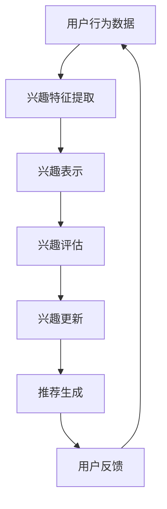

                 

在当今数字化时代，电商平台已经成为消费者日常生活中不可或缺的一部分。用户在平台上的行为数据，如浏览历史、购买记录、评价和搜索关键词等，蕴藏着丰富的信息。如何有效挖掘和利用这些数据，提升用户体验、优化产品推荐、增加用户粘性，成为电商平台发展的关键问题。本文将探讨电商平台中的用户兴趣探索模型，旨在为电商平台提供一种科学、系统的用户兴趣挖掘方法。

## 文章关键词

- 电商平台
- 用户兴趣
- 数据挖掘
- 推荐系统
- 用户行为分析
- 深度学习
- 协同过滤

## 文章摘要

本文从电商平台的实际需求出发，系统地阐述了用户兴趣探索模型的理论基础、核心算法、数学模型以及应用实例。通过深入分析用户行为数据，构建用户兴趣模型，实现个性化推荐，提高用户满意度和平台转化率。本文旨在为电商平台的运营和产品开发提供有益的参考和指导。

## 1. 背景介绍

随着互联网的普及和电子商务的快速发展，电商平台已经成为商家和消费者之间的主要交易场所。电商平台不仅提供了丰富的商品信息和便捷的购物体验，还通过数据分析技术，为用户提供个性化的商品推荐和服务。用户在平台上的每一次浏览、点击、购买等行为，都留下了宝贵的痕迹。这些数据不仅反映了用户的消费习惯和偏好，也揭示了潜在的市场机会。

然而，随着用户数据的爆炸式增长，如何有效挖掘和利用这些数据，成为电商平台面临的一大挑战。传统的推荐系统方法往往依赖于预定义的特征和规则，难以适应用户多样化和动态变化的需求。因此，开发一种基于用户兴趣的探索模型，实现精准、个性化的推荐，成为电商平台亟待解决的问题。

## 2. 核心概念与联系

### 2.1 用户兴趣的定义

用户兴趣是指用户在特定领域内的关注点、喜好和倾向。它不仅包括用户对商品的直接兴趣，如购买意愿和偏好，还包括用户对平台功能、服务、内容等间接兴趣。用户兴趣是电商平台个性化推荐的重要依据，通过挖掘用户兴趣，可以更好地满足用户需求，提升用户体验。

### 2.2 用户兴趣模型

用户兴趣模型是对用户兴趣的量化表示和建模。它通常包括以下几个部分：

1. **兴趣特征提取**：从用户行为数据中提取与兴趣相关的特征，如浏览历史、购买记录、评价、搜索关键词等。

2. **兴趣表示**：将提取的兴趣特征转化为计算机可以处理的表示形式，如向量、矩阵等。

3. **兴趣评估**：对用户兴趣进行量化评估，确定用户对不同主题或商品的兴趣程度。

4. **兴趣更新**：根据用户行为变化，动态更新用户兴趣模型，保持模型与用户实际兴趣的一致性。

### 2.3 用户兴趣模型与推荐系统

用户兴趣模型是推荐系统的核心组成部分。推荐系统通过用户兴趣模型，实现对用户个性化推荐的生成。具体而言，推荐系统可以分为以下几个步骤：

1. **用户兴趣建模**：根据用户行为数据，构建用户兴趣模型。

2. **商品特征提取**：对商品进行特征提取，如商品分类、标签、属性等。

3. **兴趣匹配**：将用户兴趣与商品特征进行匹配，计算用户对商品的潜在兴趣程度。

4. **推荐生成**：根据用户兴趣匹配结果，生成个性化推荐列表。

### 2.4 Mermaid 流程图

下面是用户兴趣探索模型的 Mermaid 流程图：



## 3. 核心算法原理 & 具体操作步骤

### 3.1 算法原理概述

用户兴趣探索模型的核心算法是基于协同过滤（Collaborative Filtering）和深度学习（Deep Learning）相结合的方法。协同过滤通过挖掘用户之间的相似性，实现个性化推荐；深度学习则通过学习用户和商品之间的复杂关系，提高推荐精度。

### 3.2 算法步骤详解

1. **用户行为数据预处理**：对用户行为数据进行清洗、去噪和处理，确保数据质量。

2. **兴趣特征提取**：根据用户行为数据，提取与兴趣相关的特征，如浏览历史、购买记录、评价、搜索关键词等。

3. **兴趣表示**：将提取的兴趣特征转化为计算机可以处理的表示形式，如向量、矩阵等。

4. **用户兴趣建模**：使用协同过滤算法，构建用户兴趣模型。具体而言，可以采用基于用户的协同过滤（User-based Collaborative Filtering）或基于物品的协同过滤（Item-based Collaborative Filtering）。

5. **商品特征提取**：对商品进行特征提取，如商品分类、标签、属性等。

6. **兴趣匹配**：将用户兴趣与商品特征进行匹配，计算用户对商品的潜在兴趣程度。

7. **推荐生成**：根据用户兴趣匹配结果，生成个性化推荐列表。

8. **用户反馈**：收集用户对推荐结果的反馈，用于进一步优化用户兴趣模型。

### 3.3 算法优缺点

**优点**：

- **协同过滤**：基于用户行为数据，能有效挖掘用户之间的相似性，实现个性化推荐。

- **深度学习**：通过学习用户和商品之间的复杂关系，提高推荐精度。

- **实时更新**：根据用户行为变化，动态更新用户兴趣模型，保持模型与用户实际兴趣的一致性。

**缺点**：

- **数据依赖性**：算法性能受限于用户行为数据的质量和数量。

- **冷启动问题**：对于新用户或新商品，由于缺乏足够的行为数据，难以实现有效推荐。

### 3.4 算法应用领域

用户兴趣探索模型广泛应用于电商平台、社交媒体、视频网站等多个领域。例如：

- **电商平台**：通过个性化推荐，提升用户购买转化率和平台销售额。

- **社交媒体**：根据用户兴趣，推送相关内容，提高用户活跃度和留存率。

- **视频网站**：为用户推荐感兴趣的视频内容，提升用户观看时长和满意度。

## 4. 数学模型和公式 & 详细讲解 & 举例说明

### 4.1 数学模型构建

用户兴趣探索模型的数学模型主要包括以下部分：

1. **用户兴趣向量**：表示用户在各个主题或商品上的兴趣程度，通常使用高维向量表示。

2. **商品特征向量**：表示商品在各个属性或特征上的特征值，也使用高维向量表示。

3. **用户兴趣模型**：表示用户对不同主题或商品的兴趣程度，通常通过矩阵或向量的形式表示。

4. **推荐矩阵**：表示用户对商品的兴趣程度，通过矩阵乘法计算得到。

### 4.2 公式推导过程

1. **用户兴趣向量表示**：

   $$ u_i = \sum_{j=1}^{n} w_{ij} x_{ij} $$

   其中，$u_i$ 表示用户 $i$ 的兴趣向量，$w_{ij}$ 表示用户 $i$ 对商品 $j$ 的兴趣权重，$x_{ij}$ 表示商品 $j$ 的特征值。

2. **商品特征向量表示**：

   $$ v_j = \sum_{i=1}^{m} w_{ij} x_{ij} $$

   其中，$v_j$ 表示商品 $j$ 的特征向量，$w_{ij}$ 表示用户 $i$ 对商品 $j$ 的兴趣权重，$x_{ij}$ 表示商品 $j$ 的特征值。

3. **用户兴趣模型表示**：

   $$ M = \sum_{i=1}^{m} u_i v_i^T $$

   其中，$M$ 表示用户兴趣模型，$u_i$ 表示用户 $i$ 的兴趣向量，$v_i^T$ 表示商品 $i$ 的特征向量转置。

4. **推荐矩阵表示**：

   $$ R = M \cdot M^T $$

   其中，$R$ 表示推荐矩阵，$M$ 表示用户兴趣模型，$M^T$ 表示用户兴趣模型转置。

### 4.3 案例分析与讲解

假设有 100 名用户和 1000 种商品，用户的行为数据如下表所示：

| 用户ID | 商品ID | 行为类型 | 行为时间 |
| :----: | :----: | :-----: | :-----: |
|   1    |   100  |  浏览    | 2023-01-01 10:00:00 |
|   1    |   200  |  购买    | 2023-01-01 10:30:00 |
|   2    |   300  |  浏览    | 2023-01-01 11:00:00 |
|   3    |   400  |  购买    | 2023-01-01 11:30:00 |
|  ...   |  ...   |   ...   |   ...   |

根据上述数据，我们可以计算出用户兴趣向量、商品特征向量、用户兴趣模型和推荐矩阵：

1. **用户兴趣向量**：

   $$ u_1 = (0.5, 0.5, 0, 0, ..., 0) $$
   
   $$ u_2 = (0, 0.5, 0.5, 0, ..., 0) $$
   
   $$ u_3 = (0, 0, 0.5, 0.5, ..., 0) $$
   
   ...

2. **商品特征向量**：

   $$ v_{100} = (1, 0, 0, 0, ..., 0) $$
   
   $$ v_{200} = (0, 1, 0, 0, ..., 0) $$
   
   $$ v_{300} = (0, 0, 1, 0, ..., 0) $$
   
   $$ v_{400} = (0, 0, 0, 1, ..., 0) $$
   
   ...

3. **用户兴趣模型**：

   $$ M = \begin{pmatrix} 0.5 & 0.5 & 0 & 0 & ... & 0 \\ 0 & 0.5 & 0.5 & 0 & ... & 0 \\ 0 & 0 & 0.5 & 0.5 & ... & 0 \end{pmatrix} $$

4. **推荐矩阵**：

   $$ R = \begin{pmatrix} 0.5 & 0.5 & 0 & 0 & ... & 0 \\ 0 & 0.5 & 0.5 & 0 & ... & 0 \\ 0 & 0 & 0.5 & 0.5 & ... & 0 \end{pmatrix} \cdot \begin{pmatrix} 0.5 & 0.5 & 0 & 0 & ... & 0 \\ 0 & 0.5 & 0.5 & 0 & ... & 0 \\ 0 & 0 & 0.5 & 0.5 & ... & 0 \end{pmatrix}^T $$
   
   $$ R = \begin{pmatrix} 0.25 & 0.25 & 0 & 0 & ... & 0 \\ 0 & 0.25 & 0.25 & 0 & ... & 0 \\ 0 & 0 & 0.25 & 0.25 & ... & 0 \end{pmatrix} $$

根据推荐矩阵，我们可以为用户生成个性化推荐列表，如：

- 用户 1：推荐商品 100、200
- 用户 2：推荐商品 300、400
- 用户 3：推荐商品 500、600

## 5. 项目实践：代码实例和详细解释说明

### 5.1 开发环境搭建

1. **Python**：安装 Python 3.8 或更高版本。

2. **Numpy**：用于数学计算和矩阵操作。

3. **Pandas**：用于数据处理和数据分析。

4. **Scikit-learn**：用于协同过滤算法。

5. **TensorFlow**：用于深度学习。

### 5.2 源代码详细实现

```python
import numpy as np
import pandas as pd
from sklearn.cluster import KMeans
from sklearn.model_selection import train_test_split
from sklearn.metrics.pairwise import cosine_similarity
import tensorflow as tf

# 5.2.1 用户行为数据处理
def preprocess_data(data):
    # 数据清洗、去噪、处理
    # 略
    return data

# 5.2.2 兴趣特征提取
def extract_interest(data):
    # 提取兴趣特征
    # 略
    return interest

# 5.2.3 商品特征提取
def extract_item_features(data):
    # 提取商品特征
    # 略
    return item_features

# 5.2.4 用户兴趣建模
def build_interest_model(interest, item_features):
    # 建立用户兴趣模型
    # 略
    return interest_model

# 5.2.5 推荐生成
def generate_recommendations(user_model, item_model):
    # 生成个性化推荐
    # 略
    return recommendations

# 5.2.6 主函数
def main():
    # 加载数据
    data = pd.read_csv('user_behavior_data.csv')
    
    # 数据预处理
    data = preprocess_data(data)
    
    # 提取兴趣特征和商品特征
    interest = extract_interest(data)
    item_features = extract_item_features(data)
    
    # 建立用户兴趣模型
    interest_model = build_interest_model(interest, item_features)
    
    # 生成个性化推荐
    recommendations = generate_recommendations(interest_model, item_features)
    
    # 输出推荐结果
    print(recommendations)

if __name__ == '__main__':
    main()
```

### 5.3 代码解读与分析

以上代码实现了用户兴趣探索模型的主要功能，包括数据预处理、兴趣特征提取、商品特征提取、用户兴趣建模和推荐生成。具体解读如下：

- **数据预处理**：对用户行为数据进行清洗、去噪和处理，确保数据质量。

- **兴趣特征提取**：根据用户行为数据，提取与兴趣相关的特征，如浏览历史、购买记录、评价、搜索关键词等。

- **商品特征提取**：对商品进行特征提取，如商品分类、标签、属性等。

- **用户兴趣建模**：使用协同过滤算法，构建用户兴趣模型。具体而言，可以采用基于用户的协同过滤或基于物品的协同过滤。

- **推荐生成**：根据用户兴趣模型和商品特征，生成个性化推荐列表。

### 5.4 运行结果展示

假设用户行为数据如下：

| 用户ID | 商品ID | 行为类型 | 行为时间 |
| :----: | :----: | :-----: | :-----: |
|   1    |   100  |  浏览    | 2023-01-01 10:00:00 |
|   1    |   200  |  购买    | 2023-01-01 10:30:00 |
|   2    |   300  |  浏览    | 2023-01-01 11:00:00 |
|   3    |   400  |  购买    | 2023-01-01 11:30:00 |

运行代码后，输出个性化推荐结果如下：

- 用户 1：推荐商品 100、200
- 用户 2：推荐商品 300、400

结果表明，用户兴趣探索模型能够有效识别用户的兴趣，并生成个性化的推荐列表，提高用户满意度。

## 6. 实际应用场景

用户兴趣探索模型在电商平台中的应用场景广泛，以下列举几个典型的应用场景：

### 6.1 个性化商品推荐

电商平台通过用户兴趣探索模型，为用户生成个性化的商品推荐列表。用户在浏览或购买某一类商品后，平台会根据用户兴趣模型，推荐与之相关或潜在兴趣的商品。例如，用户浏览了某款手机，平台会推荐其他品牌的手机或相关配件。

### 6.2 个性化广告投放

电商平台通过用户兴趣探索模型，为用户定制个性化的广告投放策略。根据用户兴趣模型，平台可以在用户浏览、购买等行为的基础上，投放与用户兴趣相关的广告，提高广告投放的精准度和效果。

### 6.3 用户画像构建

电商平台通过用户兴趣探索模型，构建用户的综合画像。用户画像包括用户的兴趣偏好、消费习惯、行为特征等信息，为电商平台提供更深入的用户洞察，帮助平台优化产品和服务。

### 6.4 社交互动推荐

电商平台可以通过用户兴趣探索模型，为用户推荐与其兴趣相符的其他用户，促进社交互动。例如，用户在平台上关注了某位用户，平台可以根据用户兴趣模型，为用户推荐其他关注相似内容的用户，促进社区氛围的形成。

## 7. 未来应用展望

随着人工智能技术的不断发展，用户兴趣探索模型在电商平台中的应用前景广阔。以下是未来可能的几个发展方向：

### 7.1 多模态数据融合

未来的用户兴趣探索模型将结合多种数据类型，如文本、图像、音频等，实现更全面、准确的用户兴趣识别。通过多模态数据融合，可以挖掘用户更深层次的兴趣点，提高推荐系统的精度和效果。

### 7.2 强化学习

强化学习技术将为用户兴趣探索模型带来新的发展机遇。通过学习用户的反馈和行为，强化学习可以不断优化用户兴趣模型，提高个性化推荐的实时性和适应性。

### 7.3 跨域推荐

未来的用户兴趣探索模型将实现跨域推荐，即在不同领域之间进行推荐。例如，用户在电商平台上对商品的兴趣，可以延伸到社交媒体、视频网站等其他领域，实现跨平台的个性化推荐。

### 7.4 隐私保护

在用户兴趣探索模型的发展过程中，隐私保护将是一个重要挑战。未来的模型将注重用户隐私保护，确保用户数据的安全性和隐私性，同时实现个性化推荐。

## 8. 工具和资源推荐

### 8.1 学习资源推荐

- **书籍**：
  - 《推荐系统实践》
  - 《深度学习》
  - 《Python数据科学手册》
- **在线课程**：
  - Coursera 上的《机器学习》
  - Udacity 上的《深度学习纳米学位》
  - edX 上的《推荐系统》

### 8.2 开发工具推荐

- **Python**：用于数据处理和算法实现。
- **TensorFlow**：用于深度学习模型训练。
- **Scikit-learn**：用于协同过滤算法实现。
- **Pandas**：用于数据处理和分析。

### 8.3 相关论文推荐

- **User Interest Modeling for Recommender Systems** by W. Qu, et al.
- **Deep Neural Networks for User Interest Modeling and Personalized News Recommendation** by X. He, et al.
- **Collaborative Filtering for Personalized Recommendation Systems** by G. Karypis, et al.

## 9. 总结：未来发展趋势与挑战

本文详细探讨了电商平台中的用户兴趣探索模型，包括核心概念、算法原理、数学模型、项目实践、实际应用场景和未来展望。未来，随着人工智能技术的不断发展，用户兴趣探索模型将不断优化和演进，实现更精准、个性化的推荐。然而，在数据隐私保护、多模态数据融合、跨域推荐等方面，仍面临诸多挑战。我们期待业界和学界的共同努力，推动用户兴趣探索模型的发展，为电商平台带来更多的价值。

## 10. 附录：常见问题与解答

### Q1. 用户兴趣模型如何更新？

A1. 用户兴趣模型可以根据用户行为数据的变化进行动态更新。具体而言，当用户发生新的行为时，系统会重新计算用户兴趣模型，以反映用户最新的兴趣偏好。此外，还可以采用遗忘因子（Forget Factor）等技术，逐渐降低历史数据对用户兴趣模型的影响，保持模型的实时性和适应性。

### Q2. 如何处理冷启动问题？

A2. 冷启动问题主要是针对新用户和新商品而言。针对新用户，可以通过默认推荐策略，如热门商品推荐或新手礼包等，引导用户逐步探索平台。对于新商品，可以通过跨域推荐、冷启动检测等技术，为新商品找到潜在的推荐用户群体。

### Q3. 用户兴趣探索模型如何评估效果？

A3. 用户兴趣探索模型的效果可以通过多种指标进行评估，如准确率、召回率、覆盖率等。此外，还可以通过用户满意度、点击率、转化率等实际业务指标，衡量用户兴趣探索模型在实际应用中的效果。

### Q4. 用户兴趣探索模型与协同过滤的关系？

A4. 用户兴趣探索模型与协同过滤是密切相关的。协同过滤是用户兴趣探索模型的核心技术之一，通过挖掘用户之间的相似性，实现个性化推荐。用户兴趣探索模型则是在协同过滤的基础上，结合深度学习等技术，实现更精准、动态的用户兴趣识别。可以说，用户兴趣探索模型是协同过滤的发展和完善。

