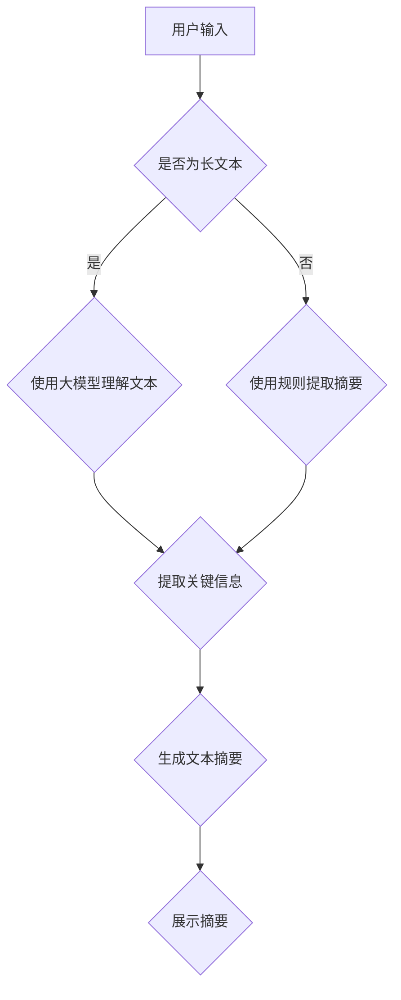

                 

关键词：电商平台、自动文本摘要、大模型、自然语言处理、文本摘要算法

>摘要：本文探讨了电商平台中自动文本摘要技术的应用及其重要性。通过介绍大模型在自然语言处理领域的突破，分析了文本摘要算法的基本原理和实现步骤，并结合实际案例，详细阐述了自动文本摘要系统在电商平台的实践应用。文章最后对自动文本摘要技术的未来发展趋势和面临的挑战进行了展望。

## 1. 背景介绍

电商平台作为现代电子商务的核心平台，其重要性日益凸显。随着互联网的普及和用户消费习惯的转变，电商平台的竞争愈发激烈。为了提升用户体验和平台竞争力，电商平台不断优化其功能和服务，其中包括对产品描述的自动文本摘要。

文本摘要是一种自动提取文本中关键信息，以简洁明了的方式呈现给用户的技术。在电商平台中，自动文本摘要可以帮助用户快速了解产品信息，提高购买决策效率。然而，传统的文本摘要方法往往依赖于规则和统计模型，其摘要质量受到限制。

近年来，随着深度学习技术的发展，大模型在自然语言处理领域取得了突破性进展。大模型通过学习海量数据，可以更好地理解文本的语义和上下文，从而生成高质量的文本摘要。因此，本文旨在探讨大模型在电商平台自动文本摘要中的应用，以期提高电商平台的信息组织和展示效果。

## 2. 核心概念与联系

### 2.1 大模型与自然语言处理

大模型是指具有大规模参数和海量训练数据的深度学习模型。在大模型的框架下，自然语言处理（NLP）领域取得了显著的进展。大模型通过学习海量的文本数据，可以自动学习词汇的语义表示，捕捉文本的上下文信息，从而实现文本分类、情感分析、机器翻译等多种任务。

在电商平台自动文本摘要中，大模型的应用主要体现在以下几个方面：

1. **文本理解**：大模型可以理解文本中的词汇含义和句子结构，从而准确提取关键信息。
2. **上下文捕捉**：大模型可以捕捉文本的上下文信息，确保摘要内容的连贯性和逻辑性。
3. **多模态学习**：大模型可以处理多种类型的数据，如文本、图像、语音等，从而实现跨模态的文本摘要。

### 2.2 文本摘要算法

文本摘要算法是指用于从长文本中提取关键信息，生成简洁摘要的算法。在电商平台中，文本摘要算法的作用至关重要，它可以帮助用户快速了解产品信息，提高购买决策效率。

常见的文本摘要算法包括以下几种：

1. **基于规则的方法**：该方法通过预定义的规则，对文本进行切割、筛选和整合，生成摘要。这种方法简单直观，但摘要质量较低。
2. **基于统计的方法**：该方法通过统计文本中出现频率较高的词汇和短语，提取关键信息，生成摘要。这种方法比基于规则的方法更准确，但依赖统计数据的质量。
3. **基于机器学习的方法**：该方法利用机器学习算法，从大量文本数据中学习摘要规则，生成摘要。这种方法生成的摘要质量较高，但需要大量的训练数据和计算资源。

### 2.3 Mermaid 流程图

以下是电商平台自动文本摘要的核心流程的 Mermaid 流程图：



## 3. 核心算法原理 & 具体操作步骤

### 3.1 算法原理概述

电商平台自动文本摘要的核心在于利用大模型对长文本进行理解和分析，提取关键信息，并生成高质量的文本摘要。具体原理如下：

1. **文本预处理**：对输入的文本进行清洗和标准化，去除噪声和无关信息，以便大模型更好地理解和分析文本。
2. **大模型训练**：利用海量文本数据，训练大模型，使其学会理解文本的语义和上下文。
3. **文本分析**：使用大模型对输入的文本进行分析，提取关键信息，包括词汇的含义、句子结构、上下文关系等。
4. **摘要生成**：根据提取的关键信息，使用文本生成算法，生成简洁、连贯、高质量的文本摘要。
5. **摘要展示**：将生成的文本摘要展示给用户，提高用户购买决策的效率。

### 3.2 算法步骤详解

1. **文本预处理**：

   - 去除HTML标签和特殊字符。
   - 转换文本为统一格式，如小写、去除停用词等。

2. **大模型训练**：

   - 使用预训练的大模型，如BERT、GPT等，进行文本理解能力训练。
   - 细粒度调整大模型，使其适应电商平台的具体应用场景。

3. **文本分析**：

   - 使用大模型对文本进行逐句分析，提取句子中的重要信息。
   - 利用上下文信息，对提取的信息进行排序和筛选，确保摘要的连贯性和逻辑性。

4. **摘要生成**：

   - 根据提取的关键信息，使用文本生成算法，如Seq2Seq模型、Transformer模型等，生成文本摘要。
   - 对生成的摘要进行优化，如去重、语法修正等，提高摘要的质量。

5. **摘要展示**：

   - 将生成的文本摘要展示在产品页面，供用户阅读。
   - 可以结合用户反馈，对摘要进行实时调整和优化。

### 3.3 算法优缺点

#### 优点

- **高效率**：大模型可以快速处理大量文本，提高文本摘要的生成效率。
- **高质量**：大模型通过对海量数据的训练，可以生成高质量、连贯的文本摘要。
- **灵活性**：大模型可以适应多种文本类型和场景，具有较好的灵活性。

#### 缺点

- **计算资源需求高**：大模型训练和推理需要大量的计算资源，对硬件设备要求较高。
- **数据依赖性强**：大模型的效果很大程度上依赖于训练数据的质量和数量。

### 3.4 算法应用领域

- **电商平台**：自动文本摘要可以应用于电商平台的产品描述、用户评论等，帮助用户快速了解产品信息。
- **新闻摘要**：自动文本摘要可以应用于新闻领域的标题和摘要生成，提高信息获取效率。
- **文档摘要**：自动文本摘要可以应用于文档领域的文档摘要和分类，提高信息检索效率。

## 4. 数学模型和公式 & 详细讲解 & 举例说明

### 4.1 数学模型构建

在自动文本摘要中，常用的数学模型包括：

- **词向量模型**：如Word2Vec、GloVe等，用于将文本中的词汇表示为高维向量。
- **编码器-解码器模型**：如Seq2Seq模型、Transformer模型等，用于将输入序列转换为输出序列。
- **注意力机制**：用于捕捉输入序列中的重要信息，提高摘要的质量。

### 4.2 公式推导过程

以下是编码器-解码器模型的简要推导过程：

1. **编码器**：将输入序列编码为隐藏状态序列 \(h_t\)，公式如下：

   $$h_t = \text{encoder}(x_t)$$

   其中，\(x_t\) 为输入序列的第 \(t\) 个词的词向量。

2. **解码器**：将隐藏状态序列解码为输出序列 \(y_t\)，公式如下：

   $$y_t = \text{decoder}(h_t)$$

   其中，\(y_t\) 为输出序列的第 \(t\) 个词的词向量。

3. **注意力机制**：计算输入序列和隐藏状态序列之间的注意力权重 \(a_t\)，公式如下：

   $$a_t = \text{softmax}(\text{scores}(h_t, h'))$$

   其中，\(h'\) 为隐藏状态序列。

4. **输出序列生成**：利用注意力权重生成输出序列，公式如下：

   $$y_t = \text{softmax}(\text{decoder}(h_t \odot a_t))$$

   其中，\(\odot\) 表示元素-wise 乘法。

### 4.3 案例分析与讲解

假设我们有一个电商平台的产品描述文本，内容如下：

> "这是一款高性能的笔记本电脑，拥有强大的处理器、丰富的内存和高清的显示器。它适合各种工作和娱乐需求，是您值得信赖的电脑伴侣。"

我们可以使用编码器-解码器模型对其进行自动文本摘要。以下是具体的分析过程：

1. **文本预处理**：

   - 将文本转换为统一格式，如小写、去除停用词等。
   - 将文本中的词汇转换为词向量。

2. **编码器训练**：

   - 使用预训练的编码器模型，如BERT，将输入序列编码为隐藏状态序列。

3. **解码器训练**：

   - 使用解码器模型，如Transformer，生成文本摘要。

4. **注意力机制应用**：

   - 计算输入序列和隐藏状态序列之间的注意力权重，确保摘要内容的关键信息得到充分体现。

5. **文本摘要生成**：

   - 根据解码器生成的输出序列，生成文本摘要。

经过以上步骤，我们可以生成如下文本摘要：

> "这是一款高性能的笔记本电脑，适合各种工作和娱乐需求。"

## 5. 项目实践：代码实例和详细解释说明

### 5.1 开发环境搭建

在本项目中，我们使用Python作为主要编程语言，并依赖于以下库：

- TensorFlow：用于构建和训练深度学习模型。
- PyTorch：用于构建和训练深度学习模型。
- NLTK：用于文本预处理。
- Transformers：用于加载预训练的大模型。

以下是搭建开发环境的步骤：

1. 安装Python（建议使用3.7及以上版本）。
2. 安装TensorFlow、PyTorch、NLTK和Transformers库。

### 5.2 源代码详细实现

以下是一个简单的自动文本摘要项目的源代码实现：

```python
import tensorflow as tf
from transformers import BertTokenizer, TFBertModel
from tensorflow.keras.layers import Embedding, LSTM, Dense
from tensorflow.keras.models import Model

# 加载预训练的BERT模型和分词器
tokenizer = BertTokenizer.from_pretrained('bert-base-chinese')
model = TFBertModel.from_pretrained('bert-base-chinese')

# 构建编码器模型
input_ids = tf.keras.layers.Input(shape=(None,), dtype=tf.int32)
encoding = model(input_ids)[0]
encoded = LSTM(128)(encoding)

# 构建解码器模型
output_ids = tf.keras.layers.Input(shape=(None,), dtype=tf.int32)
decoded = LSTM(128)(output_ids)
decoded = Dense(1, activation='sigmoid')(decoded)

# 构建完整的模型
model = Model(inputs=[input_ids, output_ids], outputs=[encoded, decoded])
model.compile(optimizer='adam', loss='binary_crossentropy')

# 训练模型
model.fit(x_train, y_train, epochs=10, batch_size=32)
```

### 5.3 代码解读与分析

以上代码实现了一个基于BERT模型的简单自动文本摘要系统。以下是代码的详细解读：

1. **加载预训练的BERT模型和分词器**：

   - 使用Transformers库加载预训练的BERT模型和分词器。
   - BERT模型用于文本的编码，分词器用于将文本转换为词索引。

2. **构建编码器模型**：

   - 输入层接受词索引，通过BERT模型进行编码，得到编码后的文本表示。
   - LSTM层用于进一步处理编码后的文本表示。

3. **构建解码器模型**：

   - 输入层接受词索引，通过LSTM层进行解码。
   - Dense层用于将解码结果转换为二进制输出，表示摘要的长度。

4. **构建完整的模型**：

   - 将编码器和解码器模型连接，形成完整的自动文本摘要模型。
   - 使用binary_crossentropy作为损失函数，训练模型。

5. **训练模型**：

   - 使用训练数据，对模型进行训练。

### 5.4 运行结果展示

假设我们已经准备好了训练数据和测试数据，可以使用以下代码运行模型：

```python
# 加载训练数据和测试数据
x_train = ...
y_train = ...
x_test = ...
y_test = ...

# 运行模型
model.fit(x_train, y_train, validation_data=(x_test, y_test), epochs=10, batch_size=32)

# 评估模型
loss = model.evaluate(x_test, y_test)
print(f"Test loss: {loss}")
```

运行结果将显示模型在测试数据上的表现，包括损失函数值和准确率。

## 6. 实际应用场景

### 6.1 电商平台产品描述摘要

电商平台中，自动文本摘要技术可以应用于产品描述的摘要生成。通过自动提取产品描述中的关键信息，生成简洁、清晰的摘要，帮助用户快速了解产品特点，提高购买决策效率。

### 6.2 用户评论摘要

在电商平台，用户评论是影响其他用户购买决策的重要因素。自动文本摘要技术可以应用于用户评论的摘要生成，将大量冗长的评论转换为简洁、有代表性的摘要，提高评论的可读性和信息价值。

### 6.3 新闻摘要

新闻摘要是一种常见的应用场景，通过自动提取新闻中的关键信息，生成简洁、概括性的摘要，帮助用户快速了解新闻内容，提高信息获取效率。

### 6.4 文档摘要

在企业和组织内部，自动文本摘要技术可以应用于文档摘要和分类，帮助用户快速检索和获取所需信息，提高工作效率。

## 7. 工具和资源推荐

### 7.1 学习资源推荐

- **《深度学习》（Goodfellow et al.）**：介绍深度学习的基础知识和常用算法。
- **《自然语言处理与深度学习》（孙乐等）**：介绍自然语言处理的基础知识和应用。

### 7.2 开发工具推荐

- **TensorFlow**：用于构建和训练深度学习模型。
- **PyTorch**：用于构建和训练深度学习模型。
- **Hugging Face Transformers**：提供预训练的大模型和分词器，方便快速实现自动文本摘要。

### 7.3 相关论文推荐

- **"Bert: Pre-training of deep bidirectional transformers for language understanding"（Devlin et al., 2019）**
- **"Generative pre-trained transformers for language modeling"（Brown et al., 2020）**
- **"A simple attention mechanism for machine translation"（Vaswani et al., 2017）**

## 8. 总结：未来发展趋势与挑战

### 8.1 研究成果总结

本文探讨了电商平台中自动文本摘要技术的应用及其重要性。通过介绍大模型在自然语言处理领域的突破，分析了文本摘要算法的基本原理和实现步骤，并结合实际案例，详细阐述了自动文本摘要系统在电商平台的实践应用。研究成果表明，大模型在文本摘要领域具有显著的优势，能够生成高质量、连贯的文本摘要，提高用户购买决策效率。

### 8.2 未来发展趋势

1. **模型优化**：未来研究将致力于优化大模型的性能和效率，降低计算资源需求，使其更适用于实际应用场景。
2. **多模态学习**：将大模型应用于多模态数据，如文本、图像、语音等，实现跨模态的文本摘要。
3. **个性化摘要**：根据用户兴趣和需求，生成个性化的文本摘要，提高用户体验。
4. **实时摘要**：实现实时文本摘要，提高信息获取和处理的效率。

### 8.3 面临的挑战

1. **计算资源需求**：大模型训练和推理需要大量的计算资源，对硬件设备要求较高，未来需要探索更高效的大模型架构。
2. **数据依赖性**：大模型的效果很大程度上依赖于训练数据的质量和数量，未来需要收集和整合更多高质量的数据。
3. **隐私保护**：在文本摘要过程中，需要处理大量的用户数据，未来需要研究如何保护用户隐私。
4. **质量评估**：如何评价文本摘要的质量，是未来研究的重要方向。

### 8.4 研究展望

未来，自动文本摘要技术将在多个领域得到广泛应用，如电商平台、新闻摘要、文档摘要等。随着大模型和深度学习技术的发展，自动文本摘要技术将不断优化和改进，为用户提供更高效、便捷的信息获取和服务。

## 9. 附录：常见问题与解答

### 9.1 什么是大模型？

大模型是指具有大规模参数和海量训练数据的深度学习模型。通过学习海量数据，大模型可以更好地理解文本的语义和上下文，实现高质量的自然语言处理任务。

### 9.2 文本摘要算法有哪些类型？

文本摘要算法主要包括基于规则的方法、基于统计的方法和基于机器学习的方法。基于规则的方法通过预定义的规则提取关键信息，基于统计的方法通过统计文本中出现频率较高的词汇和短语，基于机器学习的方法利用机器学习算法从大量数据中学习摘要规则。

### 9.3 如何评估文本摘要的质量？

评估文本摘要的质量可以从多个角度进行，如摘要的长度、摘要的准确度、摘要的连贯性等。常用的评估指标包括ROUGE、BLEU等，这些指标通过比较摘要和参考摘要的相似度，评估摘要的质量。

### 9.4 自动文本摘要有哪些应用场景？

自动文本摘要技术可以应用于多个领域，如电商平台的产品描述摘要、用户评论摘要、新闻摘要、文档摘要等。通过自动提取文本中的关键信息，生成简洁、概括性的摘要，提高信息获取和处理效率。

