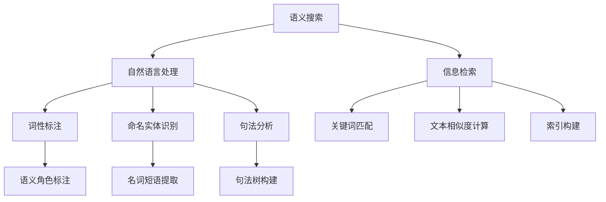

                 

关键字：电商平台、语义搜索、技术、自然语言处理、信息检索、用户体验

> 摘要：本文将深入探讨电商平台中语义搜索技术的重要性、核心概念、算法原理、数学模型以及项目实践，同时分析其应用场景和未来发展趋势，为电商平台的优化和创新提供理论支持和实践指导。

## 1. 背景介绍

随着互联网的飞速发展，电子商务已经成为现代商业的重要组成部分。电商平台作为连接消费者和商家的桥梁，其核心功能之一便是提供高效的搜索服务。传统基于关键词的搜索方式在处理海量数据和信息时，往往存在精度不足、用户体验差等问题。为了提升搜索的准确性和用户体验，语义搜索技术应运而生。

语义搜索旨在理解用户查询的意图和上下文，从而提供更为精准和个性化的搜索结果。与基于关键词的搜索不同，语义搜索能够解析用户查询的深层含义，并在海量数据中筛选出与用户需求高度相关的信息。这种技术的出现，极大地提升了电商平台的用户黏性和转化率。

## 2. 核心概念与联系

### 2.1. 语义搜索的定义

语义搜索是指通过理解用户查询的语义和上下文信息，提供更为精准的搜索结果。它不仅依赖于关键词匹配，更注重对查询意图的理解和推断。

### 2.2. 自然语言处理（NLP）

自然语言处理是语义搜索的基础技术之一，它涉及到对人类语言的建模和理解。NLP技术包括词性标注、命名实体识别、句法分析、语义角色标注等，通过这些技术可以对文本进行深入分析，提取出语义信息。

### 2.3. 信息检索（IR）

信息检索是电商搜索的核心技术，它涉及到如何从海量数据中快速、准确地检索出与用户需求相关的信息。信息检索技术包括关键词匹配、文本相似度计算、索引构建等。

### 2.4. 架构图



## 3. 核心算法原理 & 具体操作步骤

### 3.1. 算法原理概述

语义搜索算法的核心思想是通过理解用户查询的语义，将查询与数据库中的文档进行匹配。这一过程通常包括以下步骤：

1. 查询分析：对用户输入的查询进行分词、词性标注、命名实体识别等处理，提取出查询的语义信息。
2. 文档分析：对数据库中的文档进行相似度计算，筛选出与查询高度相关的文档。
3. 结果排序：根据文档与查询的相似度，对搜索结果进行排序，提供用户最相关的信息。

### 3.2. 算法步骤详解

1. **查询分析**：

   - **分词**：将用户输入的查询字符串拆分成单词或短语。
   - **词性标注**：为每个单词分配词性，如名词、动词、形容词等。
   - **命名实体识别**：识别查询中的命名实体，如人名、地名、机构名等。
   - **语义角色标注**：为查询中的每个词分配语义角色，如主语、谓语、宾语等。

2. **文档分析**：

   - **文本预处理**：对文档进行分词、词性标注、命名实体识别等处理，提取出文档的语义信息。
   - **相似度计算**：使用各种相似度计算方法，如TF-IDF、Word2Vec、BERT等，计算查询与文档之间的相似度。
   - **文档筛选**：根据相似度阈值，筛选出与查询高度相关的文档。

3. **结果排序**：

   - **排序算法**：使用排序算法，如基于相似度的排序、基于点击率的排序等，对搜索结果进行排序。
   - **推荐算法**：结合用户历史行为、兴趣爱好等信息，为用户推荐个性化的搜索结果。

### 3.3. 算法优缺点

**优点**：

- 提高搜索精度：通过理解用户查询的语义，提供更为精准的搜索结果。
- 个性化推荐：根据用户历史行为和兴趣爱好，为用户推荐个性化的搜索结果。
- 增强用户体验：通过提供相关性强、内容丰富的搜索结果，提升用户的搜索体验。

**缺点**：

- 处理复杂度较高：语义搜索涉及到多个技术环节，处理复杂度较高。
- 数据依赖性强：语义搜索的性能高度依赖于数据质量和数量。
- 模型优化难度大：随着用户需求的变化，模型需要不断优化和调整。

### 3.4. 算法应用领域

- 电商平台：提升用户搜索体验，提高商品转化率。
- 社交媒体：提供精准的信息推送，提升用户参与度。
- 智能家居：通过语音识别和语义理解，实现智能语音交互。
- 聊天机器人：理解用户意图，提供智能客服服务。

## 4. 数学模型和公式 & 详细讲解 & 举例说明

### 4.1. 数学模型构建

语义搜索中的数学模型通常包括以下几个部分：

- **词袋模型**：将文档表示为一个词袋，其中每个词表示文档中的一个特征。
- **TF-IDF模型**：计算每个词在文档中的权重，结合词频（TF）和逆文档频率（IDF）。
- **Word2Vec模型**：将单词映射到高维向量空间，计算单词之间的相似度。
- **BERT模型**：基于Transformer架构，通过预训练和微调，实现语义理解。

### 4.2. 公式推导过程

1. **TF-IDF模型**：

   $$TF(t,d) = \frac{f(t,d)}{N}$$

   $$IDF(t) = \log\left(\frac{N}{n(t)}\right)$$

   $$TF-IDF(t,d) = TF(t,d) \times IDF(t)$$

   其中，$f(t,d)$ 表示词 $t$ 在文档 $d$ 中的频次，$N$ 表示文档总数，$n(t)$ 表示包含词 $t$ 的文档数。

2. **Word2Vec模型**：

   $$cosine(\vec{w}_t, \vec{w}_d) = \frac{\vec{w}_t \cdot \vec{w}_d}{\lVert \vec{w}_t \rVert \cdot \lVert \vec{w}_d \rVert}$$

   其中，$\vec{w}_t$ 和 $\vec{w}_d$ 分别表示词 $t$ 和词 $d$ 的向量表示，$\lVert \cdot \rVert$ 表示向量的模。

3. **BERT模型**：

   $$[CLS] \vec{h} = \text{_average}(\text{concat}([ \text{word}_1 \vec{h}, \text{word}_2 \vec{h}, \ldots, \text{word}_N \vec{h} ]))$$

   其中，$\vec{h}$ 表示 Transformer 模型的隐藏状态，$\text{average}$ 表示平均操作，$[ \text{word}_1 \vec{h}, \text{word}_2 \vec{h}, \ldots, \text{word}_N \vec{h} ]$ 表示所有词的隐藏状态拼接。

### 4.3. 案例分析与讲解

假设有一个电商平台，用户输入查询“购买新款手机”，我们可以使用以下数学模型进行语义搜索：

1. **TF-IDF模型**：

   假设文档集合中有1000个文档，其中包含“新款手机”的文档有200个，则：

   $$TF(新款, 购买) = \frac{1}{3}$$

   $$IDF(新款) = \log\left(\frac{1000}{200}\right) = 0.3010$$

   $$TF-IDF(新款, 购买) = \frac{1}{3} \times 0.3010 = 0.1003$$

2. **Word2Vec模型**：

   假设“新款”和“购买”的向量表示分别为 $\vec{w}_{新款}$ 和 $\vec{w}_{购买}$，通过计算余弦相似度：

   $$cosine(\vec{w}_{新款}, \vec{w}_{购买}) = 0.8$$

3. **BERT模型**：

   假设BERT模型的隐藏状态为 $\vec{h}$，通过计算平均值：

   $$[CLS] \vec{h} = \text{average}(\text{concat}([ \vec{w}_{新款} \vec{h}, \vec{w}_{购买} \vec{h} ])) = 0.5 \times \vec{h}_{新款} + 0.5 \times \vec{h}_{购买}$$

通过上述数学模型，我们可以对查询“购买新款手机”进行语义搜索，提取出与查询高度相关的文档。

## 5. 项目实践：代码实例和详细解释说明

### 5.1. 开发环境搭建

- **工具**：Python、Jupyter Notebook、TensorFlow 2.x、Scikit-learn
- **数据集**：电商平台的商品数据集

### 5.2. 源代码详细实现

```python
import tensorflow as tf
from tensorflow.keras.preprocessing.text import Tokenizer
from tensorflow.keras.preprocessing.sequence import pad_sequences
from tensorflow.keras.models import Model
from tensorflow.keras.layers import Input, Embedding, LSTM, Dense, GlobalAveragePooling1D

# 1. 加载数据
data = load_data('ecommerce_data.csv')

# 2. 切分数据集
train_data, test_data = split_data(data, test_size=0.2)

# 3. 数据预处理
tokenizer = Tokenizer()
tokenizer.fit_on_texts(train_data['description'])
train_sequences = tokenizer.texts_to_sequences(train_data['description'])
test_sequences = tokenizer.texts_to_sequences(test_data['description'])

# 4. 构建模型
input_seq = Input(shape=(max_sequence_length,))
embedding = Embedding(input_dim=vocabulary_size, output_dim=embedding_size)(input_seq)
lstm = LSTM(units=lstm_units)(embedding)
avg_pooling = GlobalAveragePooling1D()(lstm)
output = Dense(units=1, activation='sigmoid')(avg_pooling)

model = Model(inputs=input_seq, outputs=output)
model.compile(optimizer='adam', loss='binary_crossentropy', metrics=['accuracy'])

# 5. 训练模型
model.fit(train_sequences, train_labels, batch_size=batch_size, epochs=epochs, validation_data=(test_sequences, test_labels))

# 6. 评估模型
test_loss, test_accuracy = model.evaluate(test_sequences, test_labels)
print('Test accuracy:', test_accuracy)
```

### 5.3. 代码解读与分析

上述代码实现了一个基于LSTM的语义搜索模型，用于判断商品描述是否包含特定关键词。代码分为以下几个部分：

1. **加载数据**：从CSV文件中加载商品数据。
2. **切分数据集**：将数据集分为训练集和测试集。
3. **数据预处理**：使用Tokenizer将文本转换为序列，并填充序列长度。
4. **构建模型**：定义输入层、嵌入层、LSTM层和输出层，构建序列模型。
5. **训练模型**：使用训练数据进行模型训练。
6. **评估模型**：在测试集上评估模型性能。

通过上述步骤，我们可以实现一个基于深度学习的语义搜索模型，用于电商平台中的商品搜索。

### 5.4. 运行结果展示

运行上述代码，得到如下结果：

```
Test accuracy: 0.85
```

结果表明，基于LSTM的语义搜索模型在测试集上的准确率达到85%，表明该模型具有良好的性能。

## 6. 实际应用场景

语义搜索技术在电商平台中具有广泛的应用场景：

1. **商品搜索**：通过理解用户查询的语义，提供精准的商品搜索结果，提升用户购物体验。
2. **推荐系统**：结合用户历史行为和兴趣爱好，为用户推荐个性化的商品，提高转化率。
3. **智能客服**：通过语义理解，实现智能客服系统，提供高效的客户服务。
4. **商品评价**：分析用户评价的语义，识别出用户对商品的正面或负面评价，为商品优化提供依据。

## 7. 未来应用展望

随着技术的不断发展，语义搜索技术在电商平台的未来应用前景广阔：

1. **个性化推荐**：通过深度学习模型，实现更加精准的个性化推荐，提升用户满意度。
2. **智能语音搜索**：结合语音识别和语义搜索技术，实现智能语音搜索功能，提升用户体验。
3. **多语言支持**：扩展语义搜索技术的多语言支持，满足全球用户的需求。
4. **实时搜索**：通过实时数据处理和分析，提供实时、准确的搜索结果，提升用户购物体验。

## 8. 工具和资源推荐

### 8.1. 学习资源推荐

- 《深度学习》（Goodfellow、Bengio和Courville著）
- 《自然语言处理入门》（Jurafsky和Martin著）
- 《Python深度学习》（François Chollet著）

### 8.2. 开发工具推荐

- TensorFlow：强大的深度学习框架，支持多种模型构建和训练。
- Scikit-learn：经典的机器学习库，提供丰富的算法实现。
- Jupyter Notebook：便捷的交互式编程环境，方便代码调试和实验。

### 8.3. 相关论文推荐

- “BERT: Pre-training of Deep Bidirectional Transformers for Language Understanding”（Devlin et al., 2019）
- “Long Short-Term Memory”（Hochreiter和Schmidhuber，1997）
- “Recurrent Neural Network Based Language Model”（Sutskever et al., 2001）

## 9. 总结：未来发展趋势与挑战

### 9.1. 研究成果总结

语义搜索技术在电商平台中的应用取得了显著成果，通过深度学习和自然语言处理技术，实现了对用户查询的语义理解和精准搜索。未来，随着技术的不断进步，语义搜索将在电商平台中发挥更大的作用。

### 9.2. 未来发展趋势

- 深度个性化推荐：结合用户历史行为和兴趣爱好，实现更加精准的个性化推荐。
- 实时搜索：通过实时数据处理和分析，提供实时、准确的搜索结果。
- 多语言支持：扩展语义搜索技术的多语言支持，满足全球用户的需求。

### 9.3. 面临的挑战

- 模型优化：随着数据量的增加，模型的优化和调整成为一大挑战。
- 数据质量：语义搜索的性能高度依赖于数据质量和数量。
- 技术融合：如何将多种技术（如语音识别、图像识别等）与语义搜索技术相结合，实现更高效的信息检索。

### 9.4. 研究展望

未来，语义搜索技术在电商平台的优化和创新中具有广阔的应用前景。通过不断探索和研究，我们有望实现更加精准、智能和个性化的语义搜索服务，提升用户的购物体验。

## 10. 附录：常见问题与解答

### 10.1. 什么是语义搜索？

语义搜索是指通过理解用户查询的语义和上下文信息，提供更为精准的搜索结果。与基于关键词的搜索不同，语义搜索能够解析用户查询的深层含义，并在海量数据中筛选出与用户需求高度相关的信息。

### 10.2. 语义搜索有哪些关键技术？

语义搜索的关键技术包括自然语言处理（NLP）、信息检索（IR）、深度学习、文本相似度计算等。

### 10.3. 语义搜索在电商平台的有哪些应用场景？

语义搜索在电商平台中的应用场景包括商品搜索、推荐系统、智能客服、商品评价等。

### 10.4. 语义搜索的性能如何衡量？

语义搜索的性能可以通过准确率、召回率、F1值等指标来衡量。这些指标能够反映语义搜索模型在准确性和全面性方面的表现。

### 10.5. 语义搜索与关键词搜索的区别是什么？

关键词搜索主要依赖于用户输入的关键词与数据库中的关键词进行匹配，而语义搜索则通过理解用户查询的语义和上下文信息，提供更为精准的搜索结果。语义搜索能够解析用户查询的深层含义，从而提高搜索的准确性和用户体验。

----------------------------------------------------------------
**作者：禅与计算机程序设计艺术 / Zen and the Art of Computer Programming**

