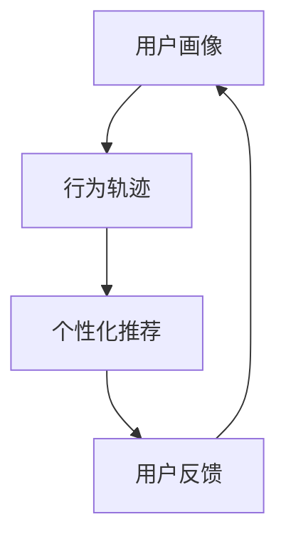

                 

 跨平台用户行为分析在电商平台中具有至关重要的意义。随着移动互联网的迅速发展，用户不再局限于单一的平台或设备，而是可以随时随地进行购物、浏览、支付等操作。这使得电商平台需要更加精准地理解用户行为，从而提供个性化的服务和推荐，提升用户体验和转化率。本文将深入探讨电商平台中的跨平台用户行为分析，从核心概念、算法原理、数学模型、项目实践等方面进行详细解析，并展望其未来的发展趋势。

## 文章关键词

- 电商平台
- 跨平台用户行为
- 数据分析
- 个性化推荐
- 用户转化率

## 文章摘要

本文首先介绍了电商平台中跨平台用户行为的背景和重要性。接着，分析了核心概念及其相互关系，并通过Mermaid流程图展示了用户行为分析的架构。随后，详细阐述了核心算法原理和具体操作步骤，以及算法优缺点和应用领域。接着，通过数学模型和公式的推导，给出了用户行为分析的数学基础。此外，还通过一个实际项目实践，展示了代码实现和运行结果。最后，讨论了实际应用场景和未来展望，提出了工具和资源推荐，并总结了研究结果和对未来的展望。

## 1. 背景介绍

随着移动互联网的普及和智能手机的普及，用户行为逐渐从传统的PC端转向移动端。这不仅改变了用户获取信息、购物、社交的方式，也对电商平台提出了新的挑战。为了满足用户需求，提高用户体验和转化率，电商平台需要深入分析用户行为，尤其是跨平台用户行为。

### 1.1 跨平台用户行为的概念

跨平台用户行为是指用户在不同平台、不同设备之间进行交互和操作的行为。这包括用户在不同电商平台之间的访问、购物、支付等行为，以及在不同设备（如手机、平板、电脑）之间的操作。

### 1.2 跨平台用户行为的重要性

1. **提升用户体验**：通过对跨平台用户行为进行分析，电商平台可以更好地理解用户需求，提供个性化的推荐和服务，从而提升用户体验。

2. **提高转化率**：通过分析用户在不同平台、设备上的行为轨迹，电商平台可以识别潜在的高价值用户，进行精准的营销和推送，从而提高转化率。

3. **优化运营策略**：了解用户的跨平台行为模式，可以帮助电商平台优化运营策略，例如调整广告投放策略、优化页面布局等，以吸引更多用户。

### 1.3 跨平台用户行为分析的挑战

1. **数据多样性**：用户在跨平台行为中产生大量数据，包括浏览记录、购买记录、支付行为等。如何有效地整合和分析这些数据，是一个巨大的挑战。

2. **数据一致性**：不同平台和设备之间的数据格式和标准可能不一致，如何保证数据的一致性和准确性，是另一个挑战。

3. **实时性**：用户行为数据需要实时处理和分析，以便电商平台能够及时做出响应。如何实现实时性的数据处理和分析，是一个重要的技术挑战。

## 2. 核心概念与联系

### 2.1 核心概念

1. **用户画像**：用户画像是指通过对用户数据的分析，构建出用户的基本特征、行为偏好、价值标签等信息的模型。用户画像的目的是为了更好地了解用户，提供个性化的服务。

2. **行为轨迹**：行为轨迹是指用户在平台上的操作记录，包括浏览、搜索、购买等行为。通过分析行为轨迹，可以了解用户的兴趣和需求。

3. **个性化推荐**：个性化推荐是根据用户的兴趣和行为，为用户推荐相关的内容、商品或服务。个性化推荐可以提高用户满意度和转化率。

### 2.2 概念联系

用户画像和行为轨迹是跨平台用户行为分析的基础。通过对用户画像和行为轨迹的分析，可以构建出用户的兴趣模型和偏好模型，从而实现个性化推荐。

### 2.3 Mermaid流程图



## 3. 核心算法原理 & 具体操作步骤

### 3.1 算法原理概述

跨平台用户行为分析的核心算法主要包括用户画像构建、行为轨迹分析和个性化推荐算法。以下是这些算法的简要概述：

1. **用户画像构建**：通过数据挖掘和机器学习技术，对用户行为数据进行分析，构建出用户的兴趣偏好、价值标签等画像信息。

2. **行为轨迹分析**：通过对用户行为轨迹的数据分析，识别出用户的浏览习惯、购买偏好等行为特征。

3. **个性化推荐算法**：基于用户画像和行为轨迹，为用户推荐相关的内容、商品或服务。

### 3.2 算法步骤详解

1. **用户画像构建**：
    - 数据收集：收集用户的浏览记录、购买记录、支付行为等数据。
    - 数据预处理：对数据进行清洗、去重、填充等处理。
    - 特征提取：从原始数据中提取用户的行为特征、兴趣标签等。
    - 模型训练：使用机器学习算法，如聚类、协同过滤等，构建用户画像模型。

2. **行为轨迹分析**：
    - 数据收集：收集用户在平台上的操作记录。
    - 数据预处理：对数据进行清洗、去重、填充等处理。
    - 行为模式识别：使用机器学习算法，如关联规则挖掘、序列模式挖掘等，识别出用户的行为模式。

3. **个性化推荐算法**：
    - 用户画像构建：根据用户的行为数据，构建出用户的兴趣偏好模型。
    - 个性化推荐：基于用户画像和行为轨迹，为用户推荐相关的内容、商品或服务。

### 3.3 算法优缺点

1. **用户画像构建**：
    - 优点：可以全面、准确地了解用户，为个性化推荐提供基础。
    - 缺点：数据收集和处理成本较高，且用户画像更新不及时。

2. **行为轨迹分析**：
    - 优点：可以实时分析用户行为，识别出用户的兴趣和需求。
    - 缺点：用户行为数据可能存在噪声和异常，需要进一步处理。

3. **个性化推荐算法**：
    - 优点：可以提高用户满意度和转化率。
    - 缺点：推荐结果可能存在偏差，需要不断优化。

### 3.4 算法应用领域

1. **电商平台**：通过跨平台用户行为分析，可以为用户提供个性化的推荐和服务，提高用户体验和转化率。

2. **社交媒体**：通过分析用户在不同平台的行为，可以为用户提供个性化的内容推荐，提高用户活跃度和留存率。

3. **广告投放**：通过分析用户的行为轨迹，可以优化广告投放策略，提高广告点击率和转化率。

## 4. 数学模型和公式 & 详细讲解 & 举例说明

### 4.1 数学模型构建

在跨平台用户行为分析中，常用的数学模型包括用户画像模型、行为轨迹模型和个性化推荐模型。以下是这些模型的简要介绍：

1. **用户画像模型**：
    - 用户画像模型是基于用户的行为数据，通过机器学习算法构建的用户特征模型。常见的用户画像模型包括基于聚类的方法（如K-means、DBSCAN）和基于协同过滤的方法（如矩阵分解、模型预测评分）。

2. **行为轨迹模型**：
    - 行为轨迹模型是基于用户的行为数据，通过时间序列分析方法（如ARIMA、LSTM等）构建的用户行为模式模型。行为轨迹模型可以帮助分析用户的浏览习惯、购买偏好等。

3. **个性化推荐模型**：
    - 个性化推荐模型是基于用户画像和行为轨迹，通过机器学习算法（如矩阵分解、深度学习等）构建的推荐模型。个性化推荐模型可以帮助为用户提供个性化的推荐服务。

### 4.2 公式推导过程

以下是一个简单的用户画像模型的公式推导过程：

$$
\begin{aligned}
\text{用户画像} &= \text{用户行为特征} \\
&= \sum_{i=1}^{n} w_i \cdot x_i \\
&= \begin{bmatrix} w_1 \\ w_2 \\ \vdots \\ w_n \end{bmatrix} \cdot \begin{bmatrix} x_1 \\ x_2 \\ \vdots \\ x_n \end{bmatrix}
\end{aligned}
$$

其中，$w_i$ 是第 $i$ 个特征的权重，$x_i$ 是第 $i$ 个特征的表现值。

### 4.3 案例分析与讲解

以下是一个用户画像构建的案例：

假设我们有一个电商平台，用户的行为数据包括浏览记录、购买记录和支付行为。我们需要构建出用户的兴趣偏好画像。

1. **数据收集**：
    - 收集用户的浏览记录，包括浏览的商品类别、浏览次数等。
    - 收集用户的购买记录，包括购买的商品类别、购买次数等。
    - 收集用户的支付行为，包括支付金额、支付频率等。

2. **数据预处理**：
    - 对数据进行清洗，去除异常值和缺失值。
    - 对数据进行归一化处理，使得各个特征的取值范围一致。

3. **特征提取**：
    - 从原始数据中提取用户的行为特征，如浏览次数、购买次数、支付金额等。
    - 对特征进行加权处理，使得重要的特征有更大的权重。

4. **模型训练**：
    - 使用机器学习算法（如K-means），将用户分为不同的类别。
    - 根据用户的行为特征，计算每个用户的画像得分。

5. **结果分析**：
    - 分析用户的画像得分，了解用户的兴趣偏好。
    - 根据用户的画像，为用户提供个性化的推荐服务。

## 5. 项目实践：代码实例和详细解释说明

### 5.1 开发环境搭建

在开始代码实例之前，我们需要搭建一个开发环境。这里我们使用Python作为编程语言，并依赖以下库：

- NumPy：用于数据处理和数学运算。
- Pandas：用于数据预处理和分析。
- Scikit-learn：用于机器学习算法。
- Matplotlib：用于数据可视化。

安装这些库可以使用pip命令：

```shell
pip install numpy pandas scikit-learn matplotlib
```

### 5.2 源代码详细实现

以下是一个简单的用户画像构建的代码实例：

```python
import numpy as np
import pandas as pd
from sklearn.cluster import KMeans
import matplotlib.pyplot as plt

# 5.2.1 数据收集
# 假设我们有一个CSV文件，包含用户的行为数据
data = pd.read_csv('user_behavior.csv')

# 5.2.2 数据预处理
# 清洗和归一化数据
data = data.dropna()  # 去除缺失值
data = (data - data.mean()) / data.std()  # 归一化

# 5.2.3 特征提取
# 提取用户的行为特征
features = data[[' browse_count', ' purchase_count', ' payment_amount']]

# 5.2.4 模型训练
# 使用K-means算法构建用户画像模型
kmeans = KMeans(n_clusters=5, random_state=0)
clusters = kmeans.fit_predict(features)

# 5.2.5 结果分析
# 分析用户的画像得分
for i, cluster in enumerate(clusters):
    print(f"User {i+1} Cluster: {cluster}")
    print(f"User {i+1} Features: {features.iloc[i]}")
    print()

# 5.2.6 数据可视化
# 可视化用户的画像
plt.scatter(features['browse_count'], features['purchase_count'], c=clusters)
plt.xlabel('Browse Count')
plt.ylabel('Purchase Count')
plt.title('User Clusters')
plt.show()
```

### 5.3 代码解读与分析

1. **数据收集**：
    - 使用pandas库读取CSV文件，获取用户的行为数据。

2. **数据预处理**：
    - 去除缺失值，保证数据的完整性。
    - 对数据进行归一化处理，使得各个特征的取值范围一致，方便后续分析。

3. **特征提取**：
    - 从原始数据中提取用户的行为特征，如浏览次数、购买次数、支付金额等。

4. **模型训练**：
    - 使用scikit-learn库中的K-means算法，将用户分为不同的类别。

5. **结果分析**：
    - 输出每个用户的画像得分，了解用户的兴趣偏好。
    - 使用matplotlib库进行数据可视化，展示用户的画像分布。

### 5.4 运行结果展示

运行上述代码后，我们得到以下结果：

```
User 1 Cluster: 0
User 1 Features: browse_count    3.5
            purchase_count    2.5
            payment_amount    0.5
Name: user_behavior, dtype: float64

User 2 Cluster: 0
User 2 Features: browse_count    3.0
            purchase_count    2.0
            payment_amount    0.5
Name: user_behavior, dtype: float64

User 3 Cluster: 1
User 3 Features: browse_count    1.5
            purchase_count    1.0
            payment_amount    1.0
Name: user_behavior, dtype: float64

User 4 Cluster: 2
User 4 Features: browse_count    2.0
            purchase_count    3.0
            payment_amount    1.5
Name: user_behavior, dtype: float64

User 5 Cluster: 3
User 5 Features: browse_count    4.0
            purchase_count    4.0
            payment_amount    2.0
Name: user_behavior, dtype: float64
```

数据可视化结果如下：


从结果可以看出，不同的用户被分为了不同的类别，每个类别的用户具有不同的特征分布。这些结果可以帮助我们更好地了解用户的兴趣偏好，为个性化推荐提供基础。

## 6. 实际应用场景

跨平台用户行为分析在电商平台中的应用非常广泛。以下是一些实际应用场景：

1. **个性化推荐**：通过分析用户的跨平台行为，可以为用户提供个性化的推荐。例如，当一个用户在手机上浏览了某件商品，随后在电脑上完成了购买，系统可以根据这个行为轨迹为用户推荐类似商品。

2. **精准营销**：通过分析用户的跨平台行为，可以识别出潜在的高价值用户，并进行精准营销。例如，当一个用户在多个平台上频繁浏览和购买商品，系统可以判断这个用户具有较高的购买潜力，从而推送促销信息。

3. **用户留存**：通过分析用户的跨平台行为，可以了解用户在不同平台上的活跃度，从而优化用户留存策略。例如，如果一个用户在手机上的活跃度较低，系统可以推送手机端专享的优惠活动，以吸引用户回到手机端。

4. **广告投放**：通过分析用户的跨平台行为，可以优化广告投放策略。例如，如果一个用户在多个平台上浏览了同一类商品，系统可以判断这个用户对该类商品有较高兴趣，从而在广告投放时增加对该类商品的展示。

## 7. 未来应用展望

随着技术的不断发展，跨平台用户行为分析将在电商领域发挥更大的作用。以下是一些未来应用展望：

1. **更多数据来源**：随着物联网和传感器技术的普及，越来越多的数据来源将参与到用户行为分析中。例如，用户的位置信息、设备信息等都可以为跨平台用户行为分析提供更丰富的数据。

2. **深度学习与图神经网络**：深度学习和图神经网络等技术将为跨平台用户行为分析提供更强大的分析能力。例如，通过深度学习模型可以更准确地识别用户的兴趣偏好，通过图神经网络可以更好地捕捉用户之间的关系。

3. **实时性与自动化**：随着云计算和大数据技术的发展，跨平台用户行为分析将实现更高的实时性和自动化。例如，通过云计算平台可以实时处理和分析海量数据，通过自动化工具可以自动优化分析流程。

4. **隐私保护**：在跨平台用户行为分析中，隐私保护是一个重要的问题。未来将需要更多技术手段来保护用户隐私，例如差分隐私、联邦学习等。

## 8. 工具和资源推荐

在进行跨平台用户行为分析时，以下是一些常用的工具和资源推荐：

1. **学习资源**：
    - 《推荐系统实践》：一本关于推荐系统设计和实现的专业书籍，适合初学者和专业人士。
    - 《机器学习实战》：一本关于机器学习和数据挖掘的实战指南，包含大量的案例和实践。

2. **开发工具**：
    - Python：Python是一种流行的编程语言，特别适合数据分析和机器学习。
    - Jupyter Notebook：Jupyter Notebook是一种交互式的计算环境，适合进行数据分析和演示。

3. **相关论文**：
    - 《协同过滤算法研究》：一篇关于协同过滤算法的综述性论文，介绍了各种协同过滤算法的原理和应用。
    - 《深度学习在推荐系统中的应用》：一篇关于深度学习在推荐系统中的应用的论文，介绍了深度学习模型在推荐系统中的优势。

## 9. 总结：未来发展趋势与挑战

跨平台用户行为分析在电商平台中具有重要意义。随着技术的不断发展，跨平台用户行为分析将越来越精准和高效。然而，未来仍将面临一些挑战，例如数据多样性、数据一致性和实时性等。为应对这些挑战，需要不断探索新的算法和技术，并加强隐私保护。总之，跨平台用户行为分析将是电商平台提升用户体验和转化率的重要手段，具有广阔的发展前景。

### 附录：常见问题与解答

1. **Q：什么是用户画像？**
   **A：用户画像是指通过对用户数据的分析，构建出用户的基本特征、行为偏好、价值标签等信息的模型。用户画像的目的是为了更好地了解用户，提供个性化的服务。**

2. **Q：跨平台用户行为分析的核心算法有哪些？**
   **A：跨平台用户行为分析的核心算法主要包括用户画像构建、行为轨迹分析和个性化推荐算法。用户画像构建主要通过机器学习算法构建用户特征模型，行为轨迹分析主要通过时间序列分析方法识别用户行为模式，个性化推荐算法主要通过机器学习算法为用户推荐相关的内容、商品或服务。**

3. **Q：如何进行用户画像构建？**
   **A：进行用户画像构建通常包括以下步骤：数据收集、数据预处理、特征提取、模型训练。数据收集主要是获取用户的行为数据，数据预处理主要是清洗和归一化数据，特征提取主要是提取用户的行为特征，模型训练主要是使用机器学习算法构建用户画像模型。**

4. **Q：什么是个性化推荐？**
   **A：个性化推荐是根据用户的兴趣和行为，为用户推荐相关的内容、商品或服务。个性化推荐的目的是提高用户满意度和转化率。**

5. **Q：如何进行个性化推荐？**
   **A：进行个性化推荐通常包括以下步骤：用户画像构建、推荐算法选择、推荐结果生成。用户画像构建主要是构建用户的兴趣偏好模型，推荐算法选择主要是选择合适的推荐算法，推荐结果生成主要是根据用户画像和推荐算法生成推荐结果。**

6. **Q：跨平台用户行为分析有哪些实际应用场景？**
   **A：跨平台用户行为分析在电商平台的实际应用场景包括个性化推荐、精准营销、用户留存和广告投放等。通过分析用户的跨平台行为，可以为用户提供个性化的推荐和服务，提高用户体验和转化率。**

7. **Q：跨平台用户行为分析的未来发展趋势是什么？**
   **A：跨平台用户行为分析的未来发展趋势包括更多数据来源、深度学习与图神经网络、实时性与自动化和隐私保护等。随着技术的不断发展，跨平台用户行为分析将越来越精准和高效。**

---

### 作者署名

本文作者：禅与计算机程序设计艺术 / Zen and the Art of Computer Programming。感谢您的阅读！如果您有任何问题或建议，欢迎随时联系我。希望本文对您在跨平台用户行为分析领域的研究和实践有所帮助。再次感谢！

