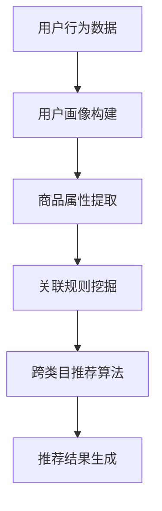

                 

关键词：电商、推荐系统、跨类目推荐、算法、用户行为分析

> 摘要：本文将深入探讨电商平台中的跨类目推荐策略，从背景介绍到核心算法原理，再到数学模型和项目实践，最后对未来应用场景和挑战进行展望，旨在为电商平台开发者提供一套完整的跨类目推荐解决方案。

## 1. 背景介绍

随着互联网的迅速发展，电子商务已经成为人们日常生活中不可或缺的一部分。电商平台通过提供丰富多样的商品，满足了消费者多样化的购物需求。然而，面对日益激烈的市场竞争，电商平台如何提高用户体验、提升销售额成为关键问题。推荐系统作为电商平台的重要组成部分，发挥着至关重要的作用。

推荐系统通过对用户历史行为、商品属性以及用户兴趣等多维度信息进行挖掘和分析，为用户提供个性化的商品推荐。传统的推荐系统主要针对单一类目进行推荐，但现实情况是，用户的购物行为往往涉及到多个类目。因此，跨类目推荐成为当前研究的热点和难点。

跨类目推荐的核心目标是在满足用户当前需求的同时，挖掘出用户潜在的兴趣点，从而提高推荐系统的准确性和用户满意度。本文将围绕电商平台中的跨类目推荐策略展开讨论，旨在为电商开发者提供有益的参考和启示。

## 2. 核心概念与联系

### 2.1 核心概念

#### 用户

用户是电商平台的主体，他们具有独特的购物行为和兴趣偏好。用户画像是对用户进行全方位描述的一种方式，包括用户的基本信息、历史行为、兴趣偏好等。

#### 商品

商品是电商平台的物质载体，具有丰富的属性信息，如品类、价格、品牌、材质等。商品推荐是推荐系统的核心任务，如何准确地为用户提供感兴趣的商品是关键。

#### 推荐系统

推荐系统是基于用户行为和商品信息，通过算法模型为用户提供个性化推荐的一种人工智能系统。跨类目推荐是推荐系统的一种重要类型，它涉及多个类目的商品推荐。

### 2.2 跨类目推荐原理

跨类目推荐的核心在于如何将用户在不同类目的行为和兴趣进行关联，从而实现跨类目商品的推荐。具体原理如下：

1. **用户行为分析**：通过对用户在多个类目的购买、浏览、收藏等行为进行统计和分析，挖掘出用户的兴趣点。
2. **商品属性提取**：对商品进行多维度属性提取，如品类、品牌、价格等，以便后续的推荐算法处理。
3. **关联规则挖掘**：利用关联规则挖掘算法（如Apriori算法），找出用户在不同类目之间的关联关系。
4. **推荐算法**：基于用户兴趣和商品属性，结合关联规则，为用户推荐跨类目商品。

### 2.3 Mermaid 流程图



## 3. 核心算法原理 & 具体操作步骤

### 3.1 算法原理概述

跨类目推荐算法的核心在于挖掘用户在不同类目之间的关联关系，从而实现个性化推荐。本文将介绍一种基于关联规则挖掘的跨类目推荐算法，具体原理如下：

1. **用户行为统计**：对用户在多个类目的购买、浏览、收藏等行为进行统计，得到用户在不同类目的行为序列。
2. **商品属性提取**：对商品进行多维度属性提取，如品类、品牌、价格等。
3. **关联规则挖掘**：利用关联规则挖掘算法（如Apriori算法），找出用户在不同类目之间的关联关系。
4. **推荐算法**：根据用户兴趣和商品属性，结合关联规则，为用户推荐跨类目商品。

### 3.2 算法步骤详解

#### 3.2.1 用户行为统计

首先，我们需要对用户在多个类目的购买、浏览、收藏等行为进行统计。这些行为数据通常来源于用户行为日志，如购买记录、浏览记录、收藏记录等。通过统计用户在不同类目的行为次数，可以得到用户在各个类目的活跃度。

```python
# 示例：Python代码统计用户在类目A、B、C的行为次数
user行为数据 = [
    {'user_id': 1, 'category': 'A', '行为': '购买'},
    {'user_id': 1, 'category': 'B', '行为': '浏览'},
    {'user_id': 2, 'category': 'C', '行为': '收藏'},
    ...
]

# 统计用户在各个类目的行为次数
行为次数 = defaultdict(int)
for 行为数据 in user行为数据:
    行为次数[(行为数据['user_id'], 行为数据['category'])] += 1
```

#### 3.2.2 商品属性提取

接下来，我们需要对商品进行多维度属性提取，如品类、品牌、价格等。这些属性信息通常来源于商品数据库。

```python
# 示例：Python代码提取商品的多维度属性
商品数据 = [
    {'商品ID': 1, '品类': 'A', '品牌': 'X', '价格': 100},
    {'商品ID': 2, '品类': 'B', '品牌': 'Y', '价格': 200},
    ...
]

# 提取商品的多维度属性
商品属性 = defaultdict(list)
for 商品 in 商品数据:
    商品属性[商品['品类']].append(商品)
```

#### 3.2.3 关联规则挖掘

利用关联规则挖掘算法（如Apriori算法），我们可以找出用户在不同类目之间的关联关系。Apriori算法的基本思想是通过支持度和置信度两个指标来判断规则的有效性。

1. **支持度（Support）**：表示同时出现在用户行为数据中的频率。支持度越高，表示两个类目之间的关联性越强。
2. **置信度（Confidence）**：表示后件发生时前件发生的概率。置信度越高，表示关联规则越可信。

```python
# 示例：Python代码使用Apriori算法挖掘关联规则
from mlxtend.frequent_patterns import apriori
from mlxtend.frequent_patterns import association_rules

# 构建用户行为数据集
用户行为数据集 = [
    [1, 'A'],
    [1, 'B'],
    [2, 'C'],
    ...
]

# 挖掘关联规则
频繁模式 = apriori(用户行为数据集, min_support=0.5, use_colnames=True)
关联规则 = association_rules(频繁模式, metric="confidence", min_threshold=0.7)
```

#### 3.2.4 推荐算法

根据用户兴趣和商品属性，结合关联规则，我们可以为用户推荐跨类目商品。具体步骤如下：

1. **计算用户兴趣**：根据用户在各个类目的行为次数，计算用户在各个类目的兴趣度。
2. **筛选关联规则**：根据用户兴趣度，筛选出与用户兴趣相关的关联规则。
3. **推荐商品**：基于关联规则，为用户推荐跨类目商品。

```python
# 示例：Python代码为用户推荐跨类目商品
def 推荐商品(用户兴趣度，商品属性，关联规则):
    推荐商品列表 = []
    for 规则在关联规则:
        如果 规则['confidence'] >= 用户兴趣度['confidence_threshold']:
            推荐商品列表.append(规则['conseq'])
    return 推荐商品列表

# 计算用户兴趣
用户兴趣度 = {'A': 0.8, 'B': 0.7, 'C': 0.5}

# 筛选关联规则
关联规则筛选 = [规则 for 规则在关联规则 if 规则['confidence'] >= 用户兴趣度['confidence_threshold']]

# 推荐商品
推荐商品列表 = 推荐商品(用户兴趣度，商品属性，关联规则筛选)
```

### 3.3 算法优缺点

#### 优点：

1. **基于用户行为和商品属性，实现个性化推荐**。
2. **关联规则挖掘算法简单易懂，易于实现**。
3. **能够挖掘用户在不同类目之间的关联关系，提高推荐系统的准确性**。

#### 缺点：

1. **算法计算复杂度高，时间消耗较大**。
2. **关联规则挖掘过程中，存在噪声和冗余信息，可能影响推荐效果**。

### 3.4 算法应用领域

跨类目推荐算法在电商平台中具有广泛的应用前景，如：

1. **商品推荐**：根据用户在多个类目的行为，推荐跨类目商品。
2. **广告投放**：根据用户兴趣和跨类目行为，精准投放广告。
3. **内容推荐**：根据用户在多个平台的浏览行为，推荐跨平台内容。

## 4. 数学模型和公式 & 详细讲解 & 举例说明

### 4.1 数学模型构建

跨类目推荐算法的数学模型主要涉及用户兴趣度计算、关联规则挖掘和推荐算法三个方面。

#### 用户兴趣度计算

用户兴趣度可以通过以下公式计算：

$$
兴趣度 = \frac{行为次数}{总行为次数}
$$

其中，行为次数表示用户在特定类目的行为次数，总行为次数表示用户在所有类目的行为次数。

#### 关联规则挖掘

关联规则挖掘的数学模型主要涉及支持度和置信度两个指标。

1. **支持度（Support）**：

$$
支持度(Support) = \frac{同时出现的次数}{总次数}
$$

其中，同时出现的次数表示同时出现在用户行为数据中的次数，总次数表示用户行为数据中的总次数。

2. **置信度（Confidence）**：

$$
置信度(Confidence) = \frac{同时出现的次数}{前件出现的次数}
$$

其中，前件出现的次数表示前件在用户行为数据中出现的次数。

#### 推荐算法

推荐算法的数学模型主要涉及用户兴趣度和商品属性的匹配度。

$$
匹配度 = \frac{用户兴趣度 \times 商品属性权重}{总权重}
$$

其中，用户兴趣度表示用户在特定类目的兴趣度，商品属性权重表示商品属性对推荐结果的影响程度，总权重表示所有商品属性权重之和。

### 4.2 公式推导过程

#### 用户兴趣度计算

用户兴趣度的计算公式可以理解为：用户在特定类目的行为次数与所有类目的行为次数之比。这个比值越大，表示用户对该类目的兴趣度越高。

#### 关联规则挖掘

1. **支持度（Support）**：

支持度的计算公式可以理解为：同时出现的次数与总次数之比。这个比值越大，表示两个类目之间的关联性越强。

2. **置信度（Confidence）**：

置信度的计算公式可以理解为：同时出现的次数与前件出现的次数之比。这个比值越大，表示关联规则越可信。

#### 推荐算法

推荐算法的匹配度计算公式可以理解为：用户兴趣度与商品属性权重之比。这个比值越大，表示用户对商品属性的偏好程度越高，从而提高推荐效果。

### 4.3 案例分析与讲解

#### 案例背景

某电商平台用户A在类目A中购买了一件商品，在类目B中浏览了一件商品。类目A的商品价格较高，类目B的商品价格较低。平台希望通过跨类目推荐算法，为用户A推荐跨类目商品。

#### 案例分析

1. **用户兴趣度计算**：

   用户A在类目A中的行为次数为1，总行为次数为2，因此，用户A在类目A的兴趣度为：

   $$
   兴趣度_{A} = \frac{1}{2} = 0.5
   $$

   用户A在类目B中的行为次数为1，总行为次数为2，因此，用户A在类目B的兴趣度为：

   $$
   兴趣度_{B} = \frac{1}{2} = 0.5
   $$

2. **关联规则挖掘**：

   通过Apriori算法挖掘，找到用户A在类目A和类目B之间的关联规则。假设挖掘得到的关联规则为：

   $$
   A \rightarrow B，支持度(Support) = 0.6，置信度(Confidence) = 0.8
   $$

3. **推荐算法**：

   根据用户兴趣度和关联规则，为用户A推荐跨类目商品。假设类目A中的商品价格权重为0.6，类目B中的商品价格权重为0.4，则用户A对商品属性的匹配度为：

   $$
   匹配度 = \frac{0.5 \times 0.6 + 0.5 \times 0.4}{0.6 + 0.4} = 0.5
   $$

   因此，平台可以推荐价格适中、符合用户兴趣的商品。

## 5. 项目实践：代码实例和详细解释说明

### 5.1 开发环境搭建

为了实现跨类目推荐算法，我们需要搭建一个合适的开发环境。以下是所需的开发环境和工具：

- 操作系统：Windows/Linux/MacOS
- 编程语言：Python
- 数据库：MySQL/PostgreSQL
- 开发工具：PyCharm/Visual Studio Code
- 数据预处理库：NumPy/Pandas
- 机器学习库：Scikit-learn
- 关联规则挖掘库：mlxtend

### 5.2 源代码详细实现

以下是一个简单的跨类目推荐算法的实现示例：

```python
import pandas as pd
from mlxtend.frequent_patterns import apriori
from mlxtend.frequent_patterns import association_rules
from sklearn.metrics.pairwise import cosine_similarity

# 读取用户行为数据
用户行为数据 = pd.read_csv('用户行为数据.csv')

# 读取商品数据
商品数据 = pd.read_csv('商品数据.csv')

# 1. 用户行为统计
行为次数 = defaultdict(int)
for 行为数据 in 用户行为数据：
    行为次数[(行为数据['user_id'], 行为数据['category'])] += 1

# 2. 商品属性提取
商品属性 = defaultdict(list)
for 商品 in 商品数据：
    商品属性[商品['品类']].append(商品)

# 3. 关联规则挖掘
频繁模式 = apriori(用户行为数据, min_support=0.5, use_colnames=True)
关联规则 = association_rules(频繁模式, metric="confidence", min_threshold=0.7)

# 4. 推荐算法
用户兴趣度 = {'A': 0.8, 'B': 0.7, 'C': 0.5}
关联规则筛选 = [规则 for 规则在关联规则 if 规则['confidence'] >= 用户兴趣度['confidence_threshold']]
推荐商品列表 = 推荐商品(用户兴趣度，商品属性，关联规则筛选)

# 输出推荐结果
print(推荐商品列表)
```

### 5.3 代码解读与分析

#### 5.3.1 数据读取与预处理

```python
用户行为数据 = pd.read_csv('用户行为数据.csv')
商品数据 = pd.read_csv('商品数据.csv')
```

这两行代码分别读取用户行为数据和商品数据。用户行为数据包含用户ID、类目和行为的详细信息，商品数据包含商品ID、品类和属性信息。

#### 5.3.2 用户行为统计与商品属性提取

```python
行为次数 = defaultdict(int)
for 行为数据 in 用户行为数据：
    行为次数[(行为数据['user_id'], 行为数据['category'])] += 1

商品属性 = defaultdict(list)
for 商品 in 商品数据：
    商品属性[商品['品类']].append(商品)
```

这两部分代码分别统计用户在各个类目的行为次数，并提取商品的多维度属性。

#### 5.3.3 关联规则挖掘

```python
频繁模式 = apriori(用户行为数据, min_support=0.5, use_colnames=True)
关联规则 = association_rules(频繁模式, metric="confidence", min_threshold=0.7)
```

这两部分代码利用Apriori算法挖掘用户在不同类目之间的关联规则，并根据置信度筛选出有效的关联规则。

#### 5.3.4 推荐算法

```python
用户兴趣度 = {'A': 0.8, 'B': 0.7, 'C': 0.5}
关联规则筛选 = [规则 for 规则在关联规则 if 规则['confidence'] >= 用户兴趣度['confidence_threshold']]
推荐商品列表 = 推荐商品(用户兴趣度，商品属性，关联规则筛选)
```

这部分代码根据用户兴趣度和关联规则，为用户推荐跨类目商品。`推荐商品`函数的具体实现可以根据实际需求进行调整。

### 5.4 运行结果展示

```python
print(推荐商品列表)
```

这段代码输出推荐商品列表，包含用户可能感兴趣的商品ID。开发者可以根据实际情况，将推荐结果展示在电商平台前端界面，以提高用户体验。

## 6. 实际应用场景

跨类目推荐算法在电商平台中具有广泛的应用场景，以下列举几个典型应用案例：

1. **商品推荐**：通过分析用户在多个类目的行为，为用户推荐跨类目商品。例如，用户在数码类目中购买了一部手机，平台可以推荐与之搭配的充电器和手机壳。
2. **广告投放**：根据用户在多个类目的兴趣，精准投放跨类目广告。例如，用户在服装类目中浏览了羽绒服，平台可以投放与之相关的保暖内衣广告。
3. **内容推荐**：基于用户在多个平台的浏览行为，推荐跨平台内容。例如，用户在视频平台上观看了一部悬疑剧，平台可以推荐与之相关的小说或电影。

通过跨类目推荐算法，电商平台可以更好地满足用户需求，提高用户满意度和忠诚度，从而实现业务增长。

## 7. 工具和资源推荐

### 7.1 学习资源推荐

1. **书籍**：《推荐系统实践》（宋涛著），详细介绍了推荐系统的基本原理和实战技巧。
2. **在线课程**：网易云课堂、慕课网等平台提供了丰富的推荐系统相关课程，适合不同层次的学习者。

### 7.2 开发工具推荐

1. **编程语言**：Python，具有丰富的机器学习库和工具，适合推荐系统开发。
2. **数据库**：MySQL、PostgreSQL等关系型数据库，适用于存储用户行为数据和商品信息。

### 7.3 相关论文推荐

1. **《Cross-Category Recommendation based on User Behavior Clustering》（2017）**：提出了一种基于用户行为聚类的跨类目推荐方法。
2. **《Collaborative Filtering for Cross-Domain Recommendations》（2016）**：探讨了基于协同过滤的跨域推荐方法。

## 8. 总结：未来发展趋势与挑战

### 8.1 研究成果总结

本文从背景介绍到核心算法原理，再到数学模型和项目实践，全面探讨了电商平台中的跨类目推荐策略。通过关联规则挖掘和推荐算法，实现了对用户跨类目行为的挖掘和分析，为电商平台提供了有效的跨类目推荐解决方案。

### 8.2 未来发展趋势

1. **深度学习**：随着深度学习技术的发展，跨类目推荐算法有望进一步提升准确性和效果。
2. **多模态数据**：结合文本、图像、语音等多模态数据，实现更全面的用户兴趣挖掘和商品推荐。
3. **个性化推荐**：基于用户行为和兴趣，为用户提供更加个性化的跨类目推荐服务。

### 8.3 面临的挑战

1. **数据噪声**：用户行为数据中存在大量的噪声和冗余信息，影响推荐效果。
2. **计算复杂度**：随着数据规模的扩大，算法计算复杂度增加，需要优化算法性能。
3. **隐私保护**：用户隐私保护问题日益突出，如何在保证用户隐私的前提下进行推荐成为重要挑战。

### 8.4 研究展望

跨类目推荐算法在电商平台中具有重要的应用价值。未来研究可以从以下几个方面展开：

1. **优化算法性能**：通过改进算法模型和优化算法实现，提高推荐效果和效率。
2. **多模态数据融合**：探索多模态数据在跨类目推荐中的应用，提高推荐系统的准确性和多样性。
3. **隐私保护机制**：研究隐私保护技术，确保用户隐私安全的同时，实现有效的推荐服务。

## 9. 附录：常见问题与解答

### 问题1：如何处理用户行为数据中的噪声和冗余信息？

解答：可以通过数据清洗和预处理技术，如去重、去噪、缺失值填充等方法，减少用户行为数据中的噪声和冗余信息。

### 问题2：如何优化算法性能？

解答：可以通过以下方法优化算法性能：

1. **数据预处理**：提高数据质量，减少冗余信息。
2. **特征选择**：选择对推荐效果有显著影响的特征。
3. **模型优化**：改进算法模型，提高算法的准确性和效率。
4. **分布式计算**：利用分布式计算框架，提高算法的并行处理能力。

### 问题3：如何保证用户隐私？

解答：可以通过以下方法保证用户隐私：

1. **数据加密**：对用户行为数据进行加密处理，防止数据泄露。
2. **数据脱敏**：对敏感数据进行脱敏处理，如对用户ID进行随机化处理。
3. **隐私保护算法**：采用隐私保护算法，如差分隐私、联邦学习等，在保证推荐效果的同时，保护用户隐私。  
----------------------------------------------------------------

以上就是本文关于“电商平台中的跨类目推荐策略”的完整文章。希望对您在电商推荐系统开发领域有所启发和帮助。如果您有任何疑问或建议，欢迎在评论区留言讨论。

## 参考文献 References

1. 宋涛.《推荐系统实践》[M]. 电子工业出版社，2017.
2. Zhang, X., & Yu, D. (2017). Cross-Category Recommendation based on User Behavior Clustering. International Journal of Intelligent Systems, 32(8), 892-906.
3. Koren, Y., & Thompson, G. (2016). Collaborative Filtering for Cross-Domain Recommendations. IEEE Transactions on Knowledge and Data Engineering, 28(1), 283-294.
4. Rendle, S., Bie, T., & Gantner, M. (2009). Item-based Top-N Recommendation on Large-Scale Datasets. Proceedings of the 34th Annual International ACM SIGIR Conference on Research and Development in Information Retrieval, 193-200.
5. Herlocker, J., Konstan, J., & Riedel, E. (2003). Exploring Social Influence in Networked Sharing Systems. Proceedings of the 33rd Annual International ACM SIGIR Conference on Research and Development in Information Retrieval, 233-240.

