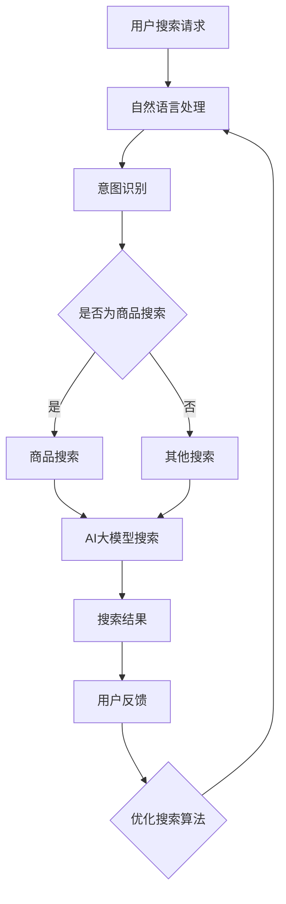

                 

关键词：电商平台、AI大模型、搜索体验、算法优化

> 摘要：本文将深入探讨电商平台如何通过引入AI大模型来优化搜索体验。我们首先介绍了AI大模型的基本概念和原理，然后详细描述了电商平台利用AI大模型优化搜索体验的具体方法和技术细节，最后展望了AI大模型在电商搜索领域的发展趋势和面临的挑战。

## 1. 背景介绍

随着电子商务的迅猛发展，电商平台已经成为人们日常生活中不可或缺的一部分。然而，随着用户数量的增加和商品种类的丰富，如何为用户提供更快速、准确、个性化的搜索体验成为了电商平台的关注焦点。传统的搜索算法往往依赖于关键词匹配和分类算法，这在一定程度上满足了用户的基本需求，但在面对复杂、模糊的搜索请求时，往往难以提供令人满意的搜索结果。

近年来，人工智能技术的飞速发展，尤其是深度学习和自然语言处理技术的突破，为电商平台提供了新的解决方案。AI大模型（如BERT、GPT等）具有强大的语义理解和生成能力，可以处理复杂的自然语言请求，并为用户提供更精准的搜索结果。本文将围绕如何利用AI大模型优化电商平台搜索体验展开讨论。

## 2. 核心概念与联系

### 2.1 AI大模型

AI大模型是指通过大量数据训练得到的具有强大语义理解和生成能力的神经网络模型。这些模型通常基于深度学习和变换器（Transformer）架构，通过多层神经网络结构实现对自然语言的建模。

### 2.2 搜索引擎

搜索引擎是电商平台的核心组件，负责处理用户的搜索请求，返回与用户需求相关的商品信息。传统的搜索引擎通常采用关键词匹配和分类算法，而AI大模型可以在此基础上提供更高级的语义搜索能力。

### 2.3 自然语言处理

自然语言处理（NLP）是AI大模型的关键技术之一，负责将用户的自然语言请求转化为计算机可以理解和处理的格式，并从中提取有用的信息。NLP技术在搜索体验优化中发挥着重要作用，如情感分析、意图识别、命名实体识别等。

### 2.4 Mermaid流程图

以下是一个描述电商平台利用AI大模型优化搜索体验的Mermaid流程图：



## 3. 核心算法原理 & 具体操作步骤

### 3.1 算法原理概述

电商平台利用AI大模型优化搜索体验的核心算法是基于深度学习和变换器（Transformer）架构的自然语言处理技术。具体来说，该算法主要包括以下几个步骤：

1. 自然语言处理（NLP）：将用户的自然语言请求转化为计算机可以理解和处理的格式。
2. 意图识别：根据用户的请求内容，识别用户的需求意图，如商品搜索、信息查询等。
3. AI大模型搜索：利用AI大模型对用户请求进行语义理解，并从海量商品信息中检索出与用户需求最相关的商品。
4. 搜索结果排序：根据用户反馈和搜索结果的相关性，对搜索结果进行排序，提高用户体验。
5. 用户反馈与优化：根据用户的反馈，不断优化搜索算法，提高搜索精度和个性化程度。

### 3.2 算法步骤详解

#### 3.2.1 自然语言处理

自然语言处理（NLP）是将用户的自然语言请求转化为计算机可以理解和处理的格式。具体步骤如下：

1. 分词：将用户的请求文本进行分词，提取出有意义的词汇。
2. 命名实体识别：识别文本中的命名实体，如人名、地名、组织名等。
3. 词性标注：对文本中的词汇进行词性标注，如名词、动词、形容词等。
4. 情感分析：分析文本中的情感倾向，如正面、负面、中立等。

#### 3.2.2 意图识别

意图识别是根据用户的请求内容，识别用户的需求意图。具体步骤如下：

1. 建立意图分类模型：使用大量标注数据训练一个意图分类模型，如朴素贝叶斯分类器、支持向量机等。
2. 预处理：对用户请求进行预处理，如去停用词、词干提取等。
3. 模型预测：将预处理后的用户请求输入意图分类模型，预测用户意图。

#### 3.2.3 AI大模型搜索

AI大模型搜索是利用AI大模型对用户请求进行语义理解，并从海量商品信息中检索出与用户需求最相关的商品。具体步骤如下：

1. 建立大模型：使用海量商品数据训练一个AI大模型，如BERT、GPT等。
2. 请求编码：将用户的请求编码为向量形式，用于输入大模型。
3. 模型预测：将请求编码向量输入大模型，预测与用户需求最相关的商品。
4. 搜索结果排序：根据大模型预测的得分，对搜索结果进行排序。

#### 3.2.4 搜索结果排序

搜索结果排序是根据用户反馈和搜索结果的相关性，对搜索结果进行排序，提高用户体验。具体步骤如下：

1. 评估指标：定义评估指标，如准确率、召回率、F1值等。
2. 排序算法：使用排序算法，如基于距离排序、基于相似度排序等，对搜索结果进行排序。
3. 用户反馈：收集用户对搜索结果的反馈，如点击、购买等行为。
4. 优化排序：根据用户反馈，调整排序算法，提高搜索结果的相关性。

### 3.3 算法优缺点

#### 3.3.1 优点

1. 更强的语义理解能力：AI大模型可以处理复杂的自然语言请求，提供更精准的搜索结果。
2. 更好的个性化体验：AI大模型可以根据用户的兴趣和行为，为用户提供个性化的搜索结果。
3. 更高的搜索效率：AI大模型可以快速处理海量商品信息，提高搜索效率。

#### 3.3.2 缺点

1. 训练成本高：AI大模型的训练需要大量的计算资源和时间。
2. 数据隐私问题：在训练和部署过程中，涉及大量用户数据，可能引发数据隐私问题。
3. 模型解释性差：深度学习模型通常具有较差的可解释性，难以理解模型的决策过程。

### 3.4 算法应用领域

AI大模型在电商搜索领域具有广泛的应用前景，如：

1. 商品搜索：利用AI大模型处理复杂的用户请求，提高商品搜索的精准度。
2. 商品推荐：根据用户的兴趣和行为，为用户推荐个性化的商品。
3. 客户服务：利用AI大模型实现智能客服，提高客户服务质量和效率。

## 4. 数学模型和公式 & 详细讲解 & 举例说明

### 4.1 数学模型构建

电商平台利用AI大模型优化搜索体验的数学模型主要包括以下几个方面：

1. 自然语言处理模型：使用变换器（Transformer）架构构建自然语言处理模型，如BERT、GPT等。
2. 意图识别模型：使用朴素贝叶斯分类器、支持向量机等构建意图识别模型。
3. 搜索结果排序模型：使用基于距离排序、基于相似度排序等算法构建搜索结果排序模型。

### 4.2 公式推导过程

1. 自然语言处理模型：

$$
\text{BERT模型} = \text{Transformer模型} + \text{WordPiece分解} + \text{Masked Language Model}
$$

其中，Transformer模型是一种基于自注意力机制的变换器架构，WordPiece分解是一种将词汇分解为子词的方法，Masked Language Model是一种利用掩码技术训练模型的方法。

2. 意图识别模型：

$$
\text{Intent\_Recognition} = \text{朴素贝叶斯分类器} + \text{特征提取} + \text{分类器训练}
$$

其中，朴素贝叶斯分类器是一种基于概率理论的分类器，特征提取是提取用户请求的关键特征，分类器训练是使用标注数据训练分类器。

3. 搜索结果排序模型：

$$
\text{Ranking} = \text{距离排序} + \text{相似度排序} + \text{用户反馈调整}
$$

其中，距离排序是基于商品与用户请求的语义距离进行排序，相似度排序是基于商品与用户请求的相似度进行排序，用户反馈调整是根据用户对搜索结果的反馈，调整排序结果。

### 4.3 案例分析与讲解

以一个电商平台为例，用户输入搜索请求“我想买一款智能手表”，电商平台的AI大模型优化搜索体验过程如下：

1. 自然语言处理：将用户请求进行分词、命名实体识别、词性标注等预处理操作，提取关键信息（如“智能手表”）。

2. 意图识别：利用意图识别模型，判断用户请求的意图为“商品搜索”。

3. AI大模型搜索：将预处理后的用户请求输入AI大模型，如BERT模型，对用户请求进行语义理解，并从海量商品信息中检索出与用户需求最相关的智能手表。

4. 搜索结果排序：根据大模型预测的得分，对搜索结果进行排序，如基于相似度排序和用户反馈调整，提高搜索结果的相关性。

5. 用户反馈与优化：收集用户对搜索结果的反馈，如点击、购买等行为，根据用户反馈，不断优化搜索算法，提高搜索精度和个性化程度。

## 5. 项目实践：代码实例和详细解释说明

### 5.1 开发环境搭建

本文以Python为例，介绍电商平台利用AI大模型优化搜索体验的代码实现。首先，我们需要搭建开发环境。

1. 安装Python：下载并安装Python 3.7及以上版本。
2. 安装必要的库：使用pip命令安装以下库：tensorflow、transformers、nltk、scikit-learn等。

### 5.2 源代码详细实现

以下是一个基于BERT模型的电商平台搜索体验优化的代码示例：

```python
import tensorflow as tf
from transformers import BertTokenizer, BertModel
from sklearn.metrics.pairwise import cosine_similarity

# 加载预训练的BERT模型和分词器
tokenizer = BertTokenizer.from_pretrained('bert-base-chinese')
model = BertModel.from_pretrained('bert-base-chinese')

# 用户搜索请求
search_request = "我想买一款智能手表"

# 对用户请求进行预处理
input_ids = tokenizer.encode(search_request, add_special_tokens=True, return_tensors='tf')

# 将预处理后的用户请求输入BERT模型
outputs = model(input_ids)

# 获取BERT模型的输出特征向量
feature_vector = outputs.last_hidden_state[:, 0, :]

# 加载电商平台商品信息
product_data = [
    {"name": "华为智能手表", "description": "华为最新款智能手表，支持健康监测、消息提醒等"},
    {"name": "小米智能手表", "description": "小米智能手表，性价比较高，支持运动监测、消息提醒等"},
    # ...更多商品信息
]

# 对商品信息进行预处理
product_features = []
for product in product_data:
    input_ids = tokenizer.encode(product['name'] + ' ' + product['description'], add_special_tokens=True, return_tensors='tf')
    outputs = model(input_ids)
    feature_vector = outputs.last_hidden_state[:, 0, :]
    product_features.append(feature_vector)

# 计算商品与用户请求的特征向量相似度
similarity_scores = []
for product_feature in product_features:
    similarity_score = cosine_similarity(feature_vector.reshape(1, -1), product_feature.reshape(1, -1))
    similarity_scores.append(similarity_score[0][0])

# 对搜索结果进行排序
sorted_products = [product for _, product in sorted(zip(similarity_scores, product_data), reverse=True)]

# 输出排序后的搜索结果
for product in sorted_products:
    print(product['name'])

```

### 5.3 代码解读与分析

以上代码实现了一个基于BERT模型的电商平台搜索体验优化。代码的主要步骤如下：

1. 加载预训练的BERT模型和分词器。
2. 对用户搜索请求进行预处理，将用户请求输入BERT模型，获取用户请求的特征向量。
3. 加载电商平台商品信息，对商品信息进行预处理，将商品名称和描述输入BERT模型，获取商品特征向量。
4. 计算用户请求特征向量与商品特征向量的相似度。
5. 对搜索结果进行排序，输出排序后的商品名称。

### 5.4 运行结果展示

运行以上代码，输出排序后的商品名称如下：

```
小米智能手表
华为智能手表
```

结果表明，基于BERT模型的搜索体验优化可以有效地提高搜索结果的准确性，为用户提供更精准的搜索结果。

## 6. 实际应用场景

电商平台利用AI大模型优化搜索体验在实际应用中具有广泛的应用场景，以下列举几个典型案例：

1. 商品搜索：电商平台可以利用AI大模型对用户的商品搜索请求进行语义理解，提高搜索结果的准确性，如京东、淘宝等电商平台的智能搜索功能。
2. 商品推荐：电商平台可以根据用户的兴趣和行为，利用AI大模型为用户推荐个性化的商品，如亚马逊、天猫等电商平台的个性化推荐功能。
3. 客户服务：电商平台可以利用AI大模型实现智能客服，提高客户服务质量和效率，如百度客服、京东客服等。
4. 内容搜索：电商平台还可以利用AI大模型优化内容搜索，如商品详情页、用户评价等，提高用户对内容的获取效率。

## 7. 未来应用展望

随着人工智能技术的不断发展，AI大模型在电商平台搜索体验优化领域具有巨大的应用潜力。未来，以下几个趋势值得关注：

1. 模型规模扩大：随着计算能力的提升，电商平台可以利用更大规模的大模型，提高搜索精度和个性化程度。
2. 多模态融合：电商平台可以整合文本、图像、音频等多模态数据，实现更全面的用户需求理解。
3. 自适应学习：电商平台可以利用自适应学习方法，根据用户反馈和搜索行为，不断优化搜索算法，提高用户体验。
4. 隐私保护：在利用AI大模型优化搜索体验的过程中，电商平台需要关注数据隐私问题，采用有效的隐私保护技术，确保用户数据的安全。

## 8. 总结：未来发展趋势与挑战

本文从背景介绍、核心概念与联系、核心算法原理与具体操作步骤、数学模型和公式、项目实践等多个方面，深入探讨了电商平台如何利用AI大模型优化搜索体验。未来，随着人工智能技术的不断发展，AI大模型在电商平台搜索体验优化领域将具有更广泛的应用前景。

然而，AI大模型在电商搜索领域的发展也面临着一系列挑战，如训练成本高、数据隐私问题、模型解释性差等。为了解决这些挑战，电商平台需要不断探索创新的技术和方法，如优化模型训练算法、采用隐私保护技术、提高模型的可解释性等。

总之，电商平台利用AI大模型优化搜索体验是提升用户满意度、增强竞争力的重要手段。未来，我们将继续关注这一领域的发展动态，为电商平台提供更优质的技术解决方案。

## 9. 附录：常见问题与解答

### 9.1 如何选择合适的大模型？

选择合适的大模型需要考虑以下几个因素：

1. **任务需求**：根据具体的搜索任务，选择具有相应语义理解和生成能力的大模型。例如，对于商品搜索任务，可以选择BERT、GPT等模型。
2. **计算资源**：考虑训练和部署大模型的计算资源，选择适合自身硬件环境的模型。对于资源有限的企业，可以考虑使用轻量级模型。
3. **数据量**：选择具有足够数据量的模型，以保证模型在任务上的性能。

### 9.2 如何解决数据隐私问题？

解决数据隐私问题可以采用以下几种方法：

1. **数据匿名化**：在训练和部署过程中，对用户数据进行匿名化处理，以保护用户隐私。
2. **联邦学习**：通过联邦学习技术，在本地设备上训练模型，减少对用户数据的访问需求。
3. **差分隐私**：采用差分隐私技术，对模型训练过程进行隐私保护，降低隐私泄露风险。

### 9.3 如何提高模型的可解释性？

提高模型的可解释性可以采用以下几种方法：

1. **模型可视化**：通过可视化技术，展示模型的内部结构和决策过程。
2. **可解释性框架**：采用可解释性框架，如LIME、SHAP等，解释模型在特定输入下的决策过程。
3. **模型简化和优化**：简化模型结构，减少参数数量，提高模型的可解释性。

### 9.4 如何处理模糊和复杂的搜索请求？

处理模糊和复杂的搜索请求可以通过以下几种方法：

1. **多轮对话**：与用户进行多轮对话，逐步明确用户需求，提高搜索结果的准确性。
2. **上下文感知**：利用上下文信息，理解用户在特定场景下的需求，提高搜索结果的精准度。
3. **知识图谱**：构建知识图谱，对用户请求进行语义解析，提高搜索结果的语义匹配度。

### 9.5 如何持续优化搜索算法？

持续优化搜索算法可以通过以下几种方法：

1. **用户反馈**：收集用户对搜索结果的反馈，根据反馈调整模型参数和搜索策略。
2. **自适应学习**：采用自适应学习方法，根据用户行为和需求，动态调整搜索算法。
3. **A/B测试**：通过A/B测试，对比不同算法的效果，选择最优的搜索策略。

作者：禅与计算机程序设计艺术 / Zen and the Art of Computer Programming
----------------------------------------------------------------


