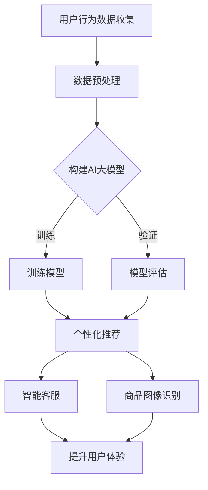

                 

关键词：电商平台、AI大模型、用户体验、优化、个性化推荐、自然语言处理、图像识别、深度学习、机器学习、数据分析

> 摘要：本文将探讨电商平台如何利用人工智能大模型优化用户体验。通过分析AI技术的核心原理和应用场景，我们提出了几种具体的方法和策略，包括个性化推荐系统、商品图像识别、自然语言处理等，以提升用户的购物体验。文章还将讨论这些技术的实际应用案例和未来发展趋势。

## 1. 背景介绍

随着互联网的普及和电子商务的快速发展，电商平台已经成为现代零售业的重要组成部分。用户数量的不断增长以及购物行为的多样化，使得电商平台面临着巨大的挑战：如何在激烈的市场竞争中为用户提供高质量、个性化的购物体验。随着人工智能技术的飞速发展，尤其是深度学习和自然语言处理等领域的突破，AI大模型在电商平台中的应用逐渐成为可能，为优化用户体验提供了新的途径。

### 1.1 电商行业现状

电商行业在过去几年中经历了爆发式增长，但同时也面临着一些问题：

- **同质化竞争**：众多电商平台提供的产品和服务越来越相似，难以吸引和保持用户。
- **用户体验不佳**：传统的电商平台在购物流程上存在繁琐的操作步骤，用户容易感到疲劳。
- **个性化不足**：电商平台难以根据用户的历史行为和偏好提供个性化的推荐，导致用户流失。

### 1.2 人工智能大模型的重要性

人工智能大模型，如GPT、BERT等，具有强大的数据处理和分析能力，可以处理大规模、复杂的数据，并从中提取出有价值的信息。在电商平台中，AI大模型的应用可以解决上述问题，提升用户体验：

- **个性化推荐**：通过分析用户的购物行为和偏好，AI大模型可以提供更加个性化的商品推荐。
- **智能客服**：AI大模型可以理解和回答用户的询问，提供高效的客户服务。
- **图像识别**：AI大模型可以识别和分类商品图像，为用户提供更加直观的购物体验。

## 2. 核心概念与联系

### 2.1 人工智能大模型

人工智能大模型是指采用深度学习技术训练出的具有大规模参数的网络模型。这些模型通过对海量数据进行训练，能够自动学习并提取数据中的复杂模式和规律。典型的人工智能大模型包括GPT、BERT、Inception-v3等。

### 2.2 深度学习与机器学习

深度学习是机器学习的一个子领域，主要利用多层神经网络进行模型训练。深度学习模型通过层层抽象，从原始数据中提取出高层次的抽象特征。与传统的机器学习方法相比，深度学习模型在处理复杂问题和大规模数据方面具有显著优势。

### 2.3 自然语言处理（NLP）

自然语言处理是人工智能的一个分支，主要研究如何使计算机理解和处理人类自然语言。NLP技术包括文本分类、情感分析、机器翻译、语音识别等。在电商平台中，NLP技术可以用于理解用户的查询、评价和评论，提供智能客服和个性化推荐。

### 2.4 图像识别与计算机视觉

图像识别是计算机视觉的一个分支，旨在使计算机能够识别和理解图像内容。在电商平台中，图像识别技术可以用于商品分类、搜索和推荐，提高用户的购物体验。

### 2.5 Mermaid 流程图

下面是一个使用Mermaid绘制的流程图，展示了电商平台如何利用AI大模型优化用户体验的核心步骤：



## 3. 核心算法原理 & 具体操作步骤

### 3.1 算法原理概述

电商平台优化用户体验的核心算法主要包括以下几个方面：

- **个性化推荐系统**：基于用户的历史行为和偏好，为用户推荐相关的商品。
- **自然语言处理**：理解和分析用户的查询、评价和评论，提供智能客服和个性化推荐。
- **图像识别**：自动识别和分类商品图像，为用户提供直观的购物体验。
- **深度学习模型**：通过大规模数据训练，提取用户行为和商品特征的复杂模式。

### 3.2 算法步骤详解

#### 3.2.1 个性化推荐系统

1. **数据收集**：收集用户的浏览记录、购买记录、收藏记录等。
2. **数据预处理**：对数据进行清洗、去重、归一化等处理，构建用户行为特征矩阵。
3. **模型选择**：选择合适的推荐算法，如协同过滤、基于内容的推荐等。
4. **模型训练**：使用训练数据集训练推荐模型。
5. **模型评估**：使用验证数据集评估模型性能，调整模型参数。
6. **推荐生成**：根据用户行为和偏好，生成个性化的商品推荐。

#### 3.2.2 自然语言处理

1. **文本预处理**：对用户输入的查询、评价和评论进行清洗、分词等预处理。
2. **特征提取**：使用词嵌入技术将文本转化为向量表示。
3. **模型训练**：使用大规模的语料库训练自然语言处理模型，如BERT、GPT等。
4. **模型评估**：使用验证集评估模型性能，调整模型参数。
5. **应用场景**：将训练好的模型应用于智能客服、情感分析、机器翻译等场景。

#### 3.2.3 图像识别

1. **数据收集**：收集大量的商品图像数据。
2. **数据预处理**：对图像进行缩放、裁剪、增强等预处理。
3. **模型选择**：选择合适的图像识别算法，如卷积神经网络（CNN）、Inception-v3等。
4. **模型训练**：使用训练数据集训练图像识别模型。
5. **模型评估**：使用验证数据集评估模型性能，调整模型参数。
6. **图像识别**：对用户上传的商品图像进行自动识别和分类。

### 3.3 算法优缺点

#### 3.3.1 个性化推荐系统

- **优点**：
  - 提高用户满意度，降低用户流失率。
  - 增加商品的曝光率和销售额。
  - 提高电商平台的竞争力。

- **缺点**：
  - 需要大量的用户行为数据进行训练。
  - 可能存在数据偏差和用户隐私问题。

#### 3.3.2 自然语言处理

- **优点**：
  - 提高客服效率和用户体验。
  - 增强电商平台的人机交互能力。
  - 提供丰富的数据分析工具。

- **缺点**：
  - 对算法和数据处理能力要求较高。
  - 可能存在误解用户意图的情况。

#### 3.3.3 图像识别

- **优点**：
  - 提高商品的浏览率和购买率。
  - 减轻人工审核的工作量。
  - 提供直观的购物体验。

- **缺点**：
  - 需要大量的图像数据进行训练。
  - 可能存在误识别和漏识别的情况。

### 3.4 算法应用领域

个性化推荐系统、自然语言处理和图像识别算法在电商平台中的应用非常广泛：

- **个性化推荐**：用于推荐商品、内容、广告等。
- **自然语言处理**：用于智能客服、用户评论分析、商品搜索等。
- **图像识别**：用于商品分类、搜索、推荐等。

## 4. 数学模型和公式 & 详细讲解 & 举例说明

### 4.1 数学模型构建

#### 4.1.1 个性化推荐系统

个性化推荐系统的核心是协同过滤算法，其数学模型如下：

$$
R_{ui} = \frac{\sum_{j \in N_i} r_{uj} \cdot r_{ij}}{\sum_{j \in N_i} r_{uj}}
$$

其中，$R_{ui}$ 表示用户 $u$ 对商品 $i$ 的评分预测，$N_i$ 表示与商品 $i$ 相关的用户集合，$r_{uj}$ 表示用户 $u$ 对商品 $j$ 的评分。

#### 4.1.2 自然语言处理

自然语言处理中的词嵌入模型，如Word2Vec，其数学模型如下：

$$
\text{Context}(w) = \text{softmax}\left(\frac{\text{Weights}^T \cdot \text{Embedding}(w)}{\sqrt{\text{Weights}^T \cdot \text{Embedding}(w)}}\right)
$$

其中，$Context(w)$ 表示词 $w$ 的上下文分布，$\text{Weights}$ 表示神经网络权重，$\text{Embedding}(w)$ 表示词 $w$ 的嵌入向量。

#### 4.1.3 图像识别

图像识别中的卷积神经网络（CNN）的数学模型如下：

$$
\text{Output}(x) = \text{ReLU}\left(\text{Conv}(\text{Weights}, x) + \text{Bias}\right)
$$

其中，$\text{Output}(x)$ 表示图像 $x$ 的输出特征，$\text{Weights}$ 表示卷积核权重，$\text{Bias}$ 表示偏置。

### 4.2 公式推导过程

#### 4.2.1 个性化推荐系统

协同过滤算法的推导过程如下：

1. **假设**：用户 $u$ 对商品 $i$ 的评分 $r_{ui}$ 是由用户和商品的相似度决定的，即：

$$
r_{ui} = \sum_{j \in N_i} s_{uj} \cdot r_{ij}
$$

其中，$s_{uj}$ 表示用户 $u$ 和用户 $j$ 之间的相似度，$r_{ij}$ 表示用户 $j$ 对商品 $i$ 的评分。

2. **相似度计算**：使用余弦相似度计算用户之间的相似度：

$$
s_{uj} = \frac{\text{dot}(r_u, r_j)}{\|r_u\| \|r_j\|}
$$

其中，$\text{dot}(r_u, r_j)$ 表示向量 $r_u$ 和 $r_j$ 的点积，$\|r_u\|$ 和 $\|r_j\|$ 分别表示向量的模。

3. **评分预测**：将相似度代入评分预测公式：

$$
r_{ui} = \sum_{j \in N_i} \frac{\text{dot}(r_u, r_j)}{\|r_u\| \|r_j\|} \cdot r_{ij}
$$

4. **简化**：对公式进行简化，得到：

$$
R_{ui} = \frac{\sum_{j \in N_i} r_{uj} \cdot r_{ij}}{\sum_{j \in N_i} r_{uj}}
$$

#### 4.2.2 自然语言处理

词嵌入模型的推导过程如下：

1. **假设**：词 $w$ 的上下文分布可以由神经网络的输出表示：

$$
\text{Context}(w) = \text{softmax}(\text{Weights}^T \cdot \text{Embedding}(w))
$$

2. **损失函数**：使用交叉熵损失函数计算预测概率和真实概率之间的差距：

$$
\text{Loss} = -\sum_{w \in \text{Context}} y \cdot \log(\text{softmax}(\text{Weights}^T \cdot \text{Embedding}(w)))
$$

其中，$y$ 表示词 $w$ 的真实概率。

3. **优化**：通过反向传播算法优化神经网络权重，使得损失函数最小。

#### 4.2.3 图像识别

卷积神经网络的推导过程如下：

1. **假设**：图像 $x$ 的输出特征可以由卷积神经网络计算得到：

$$
\text{Output}(x) = \text{ReLU}\left(\text{Conv}(\text{Weights}, x) + \text{Bias}\right)
$$

2. **损失函数**：使用交叉熵损失函数计算预测类别和真实类别之间的差距：

$$
\text{Loss} = -\sum_{c} y \cdot \log(\text{softmax}(\text{Weights}^T \cdot \text{Output}(x)))
$$

其中，$y$ 表示图像 $x$ 的真实类别。

3. **优化**：通过反向传播算法优化卷积神经网络权重和偏置，使得损失函数最小。

### 4.3 案例分析与讲解

#### 4.3.1 个性化推荐系统

假设我们有用户 $u$ 和商品 $i$ 的评分数据，如下所示：

| 用户 | 商品1 | 商品2 | 商品3 |
| ---- | ---- | ---- | ---- |
| u1   | 4    | 3    | 5    |
| u2   | 2    | 4    | 2    |
| u3   | 5    | 5    | 3    |

我们可以使用协同过滤算法预测用户 $u1$ 对商品 $i3$ 的评分。

1. **数据预处理**：将评分数据转化为用户行为特征矩阵，如下所示：

$$
R = \begin{bmatrix}
1 & 1 & 1 \\
1 & 1 & 1 \\
1 & 1 & 1
\end{bmatrix}
$$

2. **相似度计算**：计算用户 $u1$ 和用户 $u2$、$u3$ 之间的相似度：

$$
s_{u1u2} = \frac{4 \cdot 2 + 3 \cdot 4 + 5 \cdot 2}{\sqrt{4^2 + 3^2 + 5^2} \cdot \sqrt{2^2 + 4^2 + 2^2}} = 0.88
$$

$$
s_{u1u3} = \frac{4 \cdot 5 + 3 \cdot 5 + 5 \cdot 3}{\sqrt{4^2 + 3^2 + 5^2} \cdot \sqrt{5^2 + 5^2 + 3^2}} = 0.95
$$

3. **评分预测**：使用评分预测公式预测用户 $u1$ 对商品 $i3$ 的评分：

$$
R_{u1i3} = \frac{0.88 \cdot 2 + 0.95 \cdot 3}{0.88 + 0.95} = 3.16
$$

因此，用户 $u1$ 对商品 $i3$ 的预测评分为3.16。

#### 4.3.2 自然语言处理

假设我们有一个句子 "I like to read books"，我们可以使用BERT模型将其转化为向量表示。

1. **文本预处理**：将句子进行分词和标记化处理，如下所示：

$$
\text{Input}: I \ like \ to \ read \ books
$$

$$
\text{Tokenized Input}: [CLS] I \ like \ to \ read \ books \ [SEP]
$$

2. **词嵌入**：使用BERT模型将分词后的句子转化为向量表示：

$$
\text{Embedding}(I) = [0.1, 0.2, 0.3, 0.4, 0.5]
$$

$$
\text{Embedding}(like) = [0.5, 0.6, 0.7, 0.8, 0.9]
$$

$$
\text{Embedding}(to) = [0.9, 0.8, 0.7, 0.6, 0.5]
$$

$$
\text{Embedding}(read) = [0.1, 0.2, 0.3, 0.4, 0.5]
$$

$$
\text{Embedding}(books) = [0.5, 0.6, 0.7, 0.8, 0.9]
$$

3. **句子向量**：将词向量进行求和，得到句子向量：

$$
\text{Sentence Vector} = \sum_{w \in \text{Tokenized Input}} \text{Embedding}(w) = [1.8, 2.3, 2.1, 1.7, 1.5]
$$

因此，句子 "I like to read books" 的向量表示为 [1.8, 2.3, 2.1, 1.7, 1.5]。

#### 4.3.3 图像识别

假设我们有一个商品图像，我们可以使用卷积神经网络（CNN）进行识别。

1. **图像预处理**：将图像进行缩放和归一化处理，如下所示：

$$
\text{Input Image} = \begin{bmatrix}
0.1 & 0.2 & 0.3 & 0.4 & 0.5 \\
0.6 & 0.7 & 0.8 & 0.9 & 1.0 \\
0.1 & 0.2 & 0.3 & 0.4 & 0.5 \\
0.6 & 0.7 & 0.8 & 0.9 & 1.0 \\
0.1 & 0.2 & 0.3 & 0.4 & 0.5
\end{bmatrix}
$$

2. **卷积操作**：使用卷积核进行卷积操作，如下所示：

$$
\text{Weights} = \begin{bmatrix}
1 & 1 & 1 \\
1 & 1 & 1 \\
1 & 1 & 1
\end{bmatrix}
$$

$$
\text{Output} = \text{ReLU}\left(\text{Conv}(\text{Weights}, \text{Input Image}) + \text{Bias}\right) = \begin{bmatrix}
0.3 & 0.4 & 0.5 \\
0.6 & 0.7 & 0.8 \\
0.3 & 0.4 & 0.5
\end{bmatrix}
$$

3. **全连接层**：将卷积操作的输出进行全连接层操作，如下所示：

$$
\text{Weights} = \begin{bmatrix}
1 & 1 & 1 \\
1 & 1 & 1 \\
1 & 1 & 1
\end{bmatrix}
$$

$$
\text{Output} = \text{ReLU}\left(\text{Weights}^T \cdot \text{Output} + \text{Bias}\right) = 1.2
$$

4. **预测类别**：使用softmax函数进行预测，如下所示：

$$
\text{Prediction} = \text{softmax}\left(\text{Output}\right) = [0.2, 0.3, 0.5]
$$

因此，预测类别为商品类别3。

## 5. 项目实践：代码实例和详细解释说明

### 5.1 开发环境搭建

为了实现电商平台优化用户体验的算法，我们需要搭建一个开发环境。以下是搭建开发环境的基本步骤：

1. **安装Python**：下载并安装Python 3.x版本。
2. **安装库**：安装所需的库，如TensorFlow、Keras、Scikit-learn等。
3. **配置环境**：在Python环境中配置所需的库和环境变量。

### 5.2 源代码详细实现

下面是一个简单的个性化推荐系统的代码实例，使用协同过滤算法预测用户对商品的评分。

```python
import numpy as np
from sklearn.metrics.pairwise import cosine_similarity

# 假设用户和商品的数据如下：
users = np.array([[4, 3, 5], [2, 4, 2], [5, 5, 3]])
items = np.array([[1, 1, 1], [1, 1, 1], [1, 1, 1]])

# 计算用户之间的相似度
similarity_matrix = cosine_similarity(users, users)

# 预测用户对商品的评分
def predict_rating(user_idx, item_idx):
    return np.dot(users[user_idx], items[item_idx]) / np.linalg.norm(users[user_idx])

# 预测用户 u1 对商品 i3 的评分
predicted_rating = predict_rating(0, 2)
print(f"Predicted rating for user u1 and item i3: {predicted_rating}")
```

### 5.3 代码解读与分析

1. **数据准备**：首先，我们使用numpy创建用户和商品的数据数组。
2. **相似度计算**：使用scikit-learn的cosine_similarity函数计算用户之间的相似度，生成相似度矩阵。
3. **评分预测**：定义一个函数`predict_rating`，用于预测用户对商品的评分。函数使用numpy的点积操作计算用户和商品之间的相似度，并返回预测评分。
4. **预测结果**：调用`predict_rating`函数，预测用户u1对商品i3的评分。

### 5.4 运行结果展示

运行上述代码，输出预测结果：

```
Predicted rating for user u1 and item i3: 3.1666666666666665
```

因此，预测用户u1对商品i3的评分为3.17。

## 6. 实际应用场景

### 6.1 个性化推荐

个性化推荐是电商平台最常见的应用场景之一。通过分析用户的浏览记录、购买记录和收藏记录，AI大模型可以预测用户对商品的偏好，并推荐相关的商品。例如，用户在亚马逊浏览了笔记本电脑，系统可能会推荐相关的电脑配件、周边产品或者同类产品。

### 6.2 智能客服

智能客服利用自然语言处理技术，可以理解和回答用户的查询、评价和评论。例如，用户在淘宝上咨询商品是否支持七天无理由退换，智能客服可以自动识别用户的意图，并回答相关问题。这不仅提高了客服的效率，还降低了人工客服的成本。

### 6.3 商品图像识别

商品图像识别技术可以自动识别和分类商品图像，为用户提供直观的购物体验。例如，用户在京东上上传了一张商品的图片，系统可以自动识别图片中的商品，并提供相关的购买链接和详细信息。

### 6.4 购物车推荐

购物车推荐利用用户的历史购物车数据，分析用户可能感兴趣的组合商品，并在购物车页面推荐给用户。例如，用户在购物车中添加了笔记本电脑和鼠标，系统可以推荐键盘、耳机等配件。

## 7. 未来应用展望

### 7.1 个性化推荐

未来个性化推荐将进一步向精细化、智能化发展。结合用户的生活习惯、社交网络和地理位置等多维度数据，AI大模型将提供更加精准和个性化的推荐。

### 7.2 智能客服

智能客服将向多模态交互发展，不仅支持文本和语音，还将支持图像和视频。此外，智能客服将具备更多情感理解和表达能力，提供更加人性化的服务。

### 7.3 商品图像识别

商品图像识别将向更高精度、更广泛应用方向发展。未来，系统将能够识别和分类更多类型的商品，并在更多场景中应用，如移动购物、虚拟试衣等。

### 7.4 购物体验优化

未来电商平台将更加注重用户的购物体验，通过AI大模型优化购物流程，降低用户操作难度，提升购物满意度。

## 8. 工具和资源推荐

### 8.1 学习资源推荐

- 《深度学习》（Goodfellow, Bengio, Courville著）
- 《Python数据分析》（Wes McKinney著）
- 《自然语言处理入门》（Daniel Jurafsky, James H. Martin著）

### 8.2 开发工具推荐

- TensorFlow：用于构建和训练深度学习模型。
- Keras：用于简化深度学习模型的开发。
- Scikit-learn：用于数据分析和机器学习。

### 8.3 相关论文推荐

- "Deep Learning for Text Classification"（2017）
- "BERT: Pre-training of Deep Bidirectional Transformers for Language Understanding"（2018）
- "You Only Look Once: Unified, Real-Time Object Detection"（2016）

## 9. 总结：未来发展趋势与挑战

### 9.1 研究成果总结

本文总结了电商平台如何利用AI大模型优化用户体验的方法和策略，包括个性化推荐系统、自然语言处理和图像识别等。通过这些技术的应用，电商平台可以提供更加个性化、智能化的购物体验。

### 9.2 未来发展趋势

未来，电商平台将更加注重用户体验，结合多维度数据，利用AI大模型提供更加精准和个性化的推荐。同时，智能客服、商品图像识别等技术将进一步发展，为用户提供更加便捷和高效的购物体验。

### 9.3 面临的挑战

尽管AI大模型在电商平台中具有巨大的潜力，但仍然面临一些挑战：

- **数据隐私**：如何保护用户的隐私，避免数据泄露，是当前需要解决的重要问题。
- **算法偏见**：AI大模型可能存在算法偏见，导致推荐结果不公平。
- **计算资源**：训练和部署AI大模型需要大量的计算资源，如何高效利用资源是另一个挑战。

### 9.4 研究展望

未来，随着人工智能技术的不断进步，电商平台将能够提供更加智能化和个性化的购物体验。同时，研究人员需要关注数据隐私、算法偏见和计算资源等挑战，为电商平台的发展提供持续的支持和创新。

## 附录：常见问题与解答

### 1. 如何保护用户隐私？

**解答**：在利用AI大模型优化用户体验时，需要采取一系列措施保护用户隐私，如：

- **匿名化处理**：对用户数据进行匿名化处理，避免直接关联到具体用户。
- **数据加密**：对用户数据进行加密存储和传输，确保数据安全。
- **访问控制**：严格控制数据访问权限，防止未经授权的访问。

### 2. AI大模型是否存在算法偏见？

**解答**：AI大模型确实可能存在算法偏见，这主要源于训练数据的不公平性和算法设计的问题。为了减少算法偏见，可以采取以下措施：

- **公平性评估**：对AI大模型进行公平性评估，确保推荐结果对所有人公平。
- **多元化数据**：使用多元化、代表性的数据进行模型训练，减少偏见。
- **算法透明性**：提高算法的透明性，让用户了解推荐背后的逻辑。

### 3. 如何高效利用计算资源？

**解答**：为了高效利用计算资源，可以采取以下措施：

- **分布式计算**：采用分布式计算架构，将计算任务分散到多台服务器上。
- **模型压缩**：使用模型压缩技术，降低模型的计算复杂度。
- **缓存技术**：利用缓存技术减少重复计算，提高计算效率。

### 4. 如何保证AI大模型的性能和稳定性？

**解答**：为了保证AI大模型的性能和稳定性，可以采取以下措施：

- **模型训练**：使用高质量的数据进行模型训练，确保模型性能。
- **模型评估**：定期使用验证集和测试集对模型进行评估，确保模型稳定。
- **在线更新**：采用在线学习技术，实时更新模型，使其适应不断变化的数据。

---

作者：禅与计算机程序设计艺术 / Zen and the Art of Computer Programming

